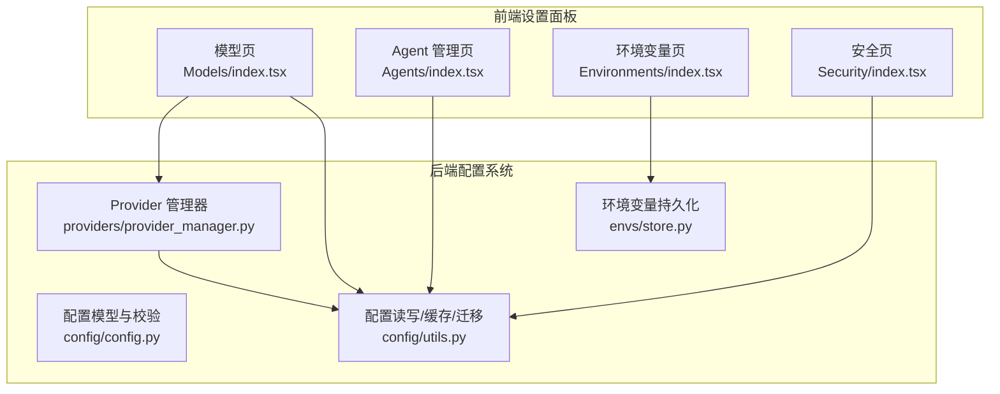
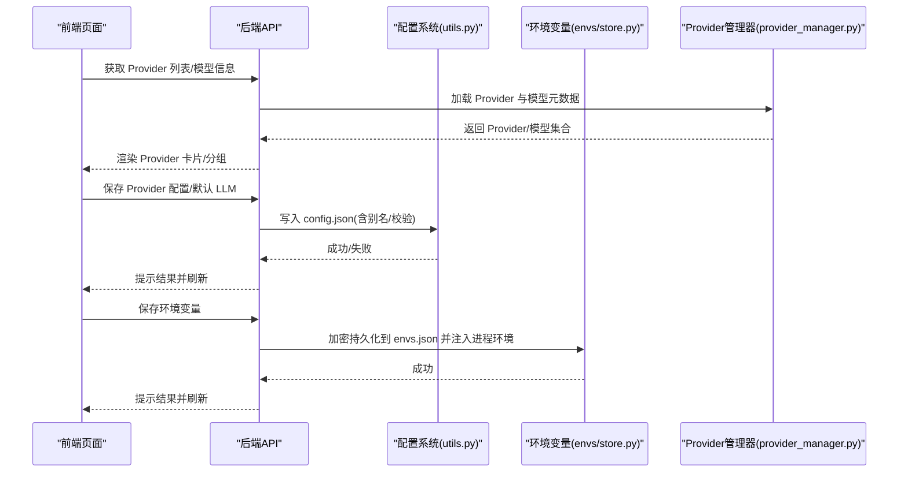
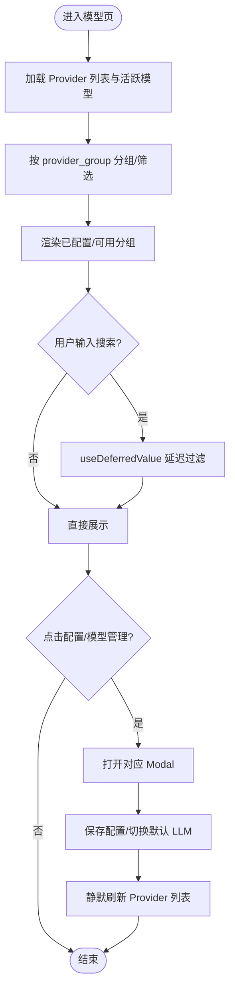
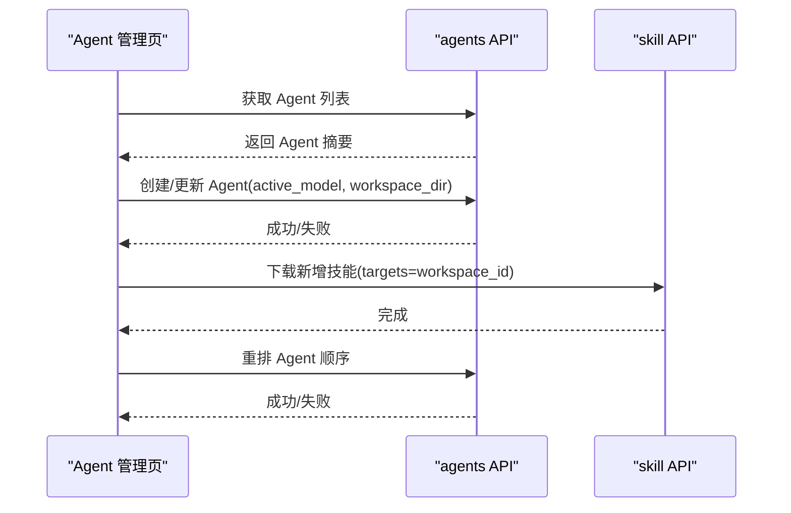
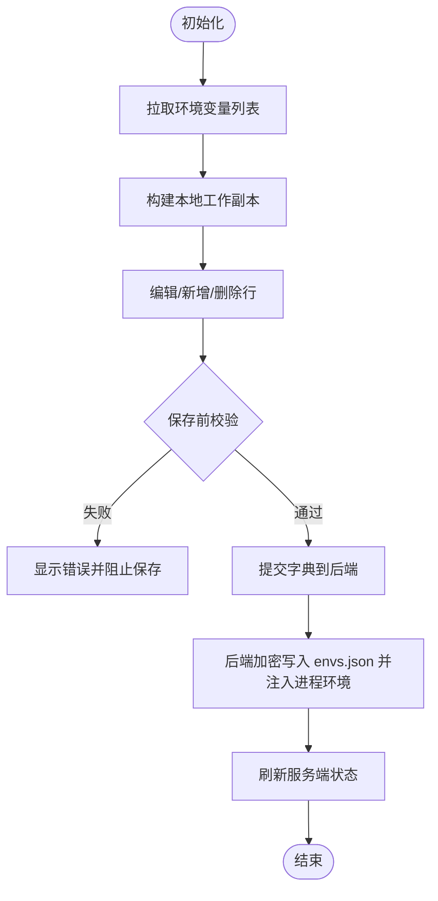
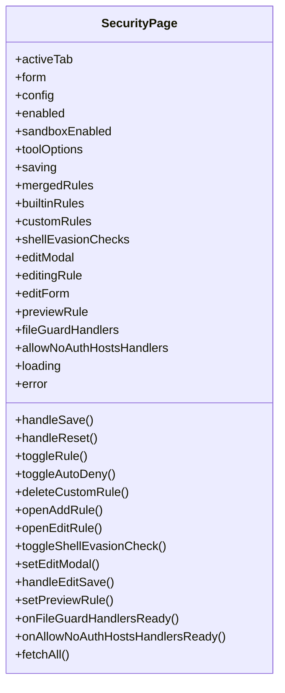
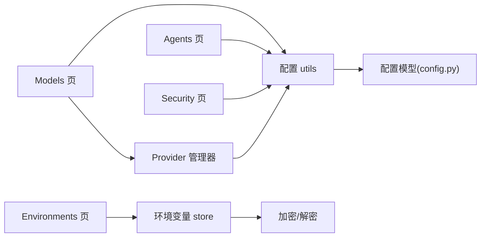

# 设置面板

<cite>
**本文引用的文件**   
- [console/src/pages/Settings/Models/index.tsx](file://console/src/pages/Settings/Models/index.tsx)
- [console/src/pages/Settings/Agents/index.tsx](file://console/src/pages/Settings/Agents/index.tsx)
- [console/src/pages/Settings/Environments/index.tsx](file://console/src/pages/Settings/Environments/index.tsx)
- [console/src/pages/Settings/Security/index.tsx](file://console/src/pages/Settings/Security/index.tsx)
- [src/qwenpaw/config/config.py](file://src/qwenpaw/config/config.py)
- [src/qwenpaw/config/utils.py](file://src/qwenpaw/config/utils.py)
- [src/qwenpaw/envs/store.py](file://src/qwenpaw/envs/store.py)
- [src/qwenpaw/providers/provider_manager.py](file://src/qwenpaw/providers/provider_manager.py)
- [e2e/tests/test_runtime_config.py](file://e2e/tests/test_runtime_config.py)
</cite>

## 目录
1. [简介](#简介)
2. [项目结构](#项目结构)
3. [核心组件](#核心组件)
4. [架构总览](#架构总览)
5. [详细组件分析](#详细组件分析)
6. [依赖关系分析](#依赖关系分析)
7. [性能与可靠性](#性能与可靠性)
8. [故障排查指南](#故障排查指南)
9. [结论](#结论)
10. [附录：扩展指南](#附录扩展指南)

## 简介
本文件面向 QwenPaw 的设置面板，系统性梳理其整体架构与各模块实现，覆盖模型配置、Agent 管理、环境变量与安全设置。文档重点解释表单验证、配置同步、权限控制、数据持久化、热重载机制以及导入导出能力，并提供来自代码库的具体示例路径，帮助初学者快速上手，同时为资深开发者提供深入的技术细节与优化建议。

## 项目结构
设置面板由前端页面与后端配置系统共同组成：
- 前端页面（React）：提供可视化配置入口，包括“模型”、“Agent”、“环境变量”、“安全”等模块。
- 后端配置（Pydantic + JSON）：以 config.json 为核心，结合加密的环境变量存储 envs.json，提供校验、迁移、缓存与持久化能力。
- 运行时集成：Provider 管理器负责加载内置/自定义 Provider 及其模型配置；ACP 服务暴露会话级配置选项；E2E 测试覆盖关键交互流程。

图表来源
- [console/src/pages/Settings/Models/index.tsx:1-618](file://console/src/pages/Settings/Models/index.tsx#L1-L618)
- [console/src/pages/Settings/Agents/index.tsx:1-217](file://console/src/pages/Settings/Agents/index.tsx#L1-L217)
- [console/src/pages/Settings/Environments/index.tsx:1-327](file://console/src/pages/Settings/Environments/index.tsx#L1-L327)
- [console/src/pages/Settings/Security/index.tsx:1-245](file://console/src/pages/Settings/Security/index.tsx#L1-L245)
- [src/qwenpaw/config/config.py:1-800](file://src/qwenpaw/config/config.py#L1-L800)
- [src/qwenpaw/config/utils.py:1-800](file://src/qwenpaw/config/utils.py#L1-L800)
- [src/qwenpaw/envs/store.py:1-270](file://src/qwenpaw/envs/store.py#L1-L270)
- [src/qwenpaw/providers/provider_manager.py:2234-2258](file://src/qwenpaw/providers/provider_manager.py#L2234-L2258)

章节来源
- [console/src/pages/Settings/Models/index.tsx:1-618](file://console/src/pages/Settings/Models/index.tsx#L1-L618)
- [console/src/pages/Settings/Agents/index.tsx:1-217](file://console/src/pages/Settings/Agents/index.tsx#L1-L217)
- [console/src/pages/Settings/Environments/index.tsx:1-327](file://console/src/pages/Settings/Environments/index.tsx#L1-L327)
- [console/src/pages/Settings/Security/index.tsx:1-245](file://console/src/pages/Settings/Security/index.tsx#L1-L245)
- [src/qwenpaw/config/config.py:1-800](file://src/qwenpaw/config/config.py#L1-L800)
- [src/qwenpaw/config/utils.py:1-800](file://src/qwenpaw/config/utils.py#L1-L800)
- [src/qwenpaw/envs/store.py:1-270](file://src/qwenpaw/envs/store.py#L1-L270)
- [src/qwenpaw/providers/provider_manager.py:2234-2258](file://src/qwenpaw/providers/provider_manager.py#L2234-L2258)

## 核心组件
- 模型配置（Models）
  - 功能：展示云/本地 Provider 列表，支持搜索、分组、默认 LLM 选择、Provider 配置与模型管理。
  - 关键点：使用 useProviders 拉取 Provider 信息；通过 Modal 打开配置与模型管理；支持按 provider_group 聚合显示；默认 LLM 状态在顶部胶囊中可见可编辑。
- Agent 管理（Agents）
  - 功能：创建/编辑/删除/启用禁用 Agent，支持拖拽排序与技能安装联动。
  - 关键点：表单包含 workspace_dir、active_model 等字段；保存时组装 active_model 对象并调用 agents API；新增技能触发下载并刷新缓存。
- 环境变量（Environments）
  - 功能：增删改查键值对，支持批量操作与实时校验。
  - 关键点：客户端维护工作副本，保存前进行 key 合法性与唯一性校验；删除已持久化项直接调用 DELETE；保存后刷新服务端状态。
- 安全设置（Security）
  - 功能：工具守卫规则、文件守卫、技能扫描、免认证主机白名单等。
  - 关键点：多 Tab 组织不同安全域；每个子模块独立保存/重置；规则预览与编辑弹窗复用。

章节来源
- [console/src/pages/Settings/Models/index.tsx:1-618](file://console/src/pages/Settings/Models/index.tsx#L1-L618)
- [console/src/pages/Settings/Agents/index.tsx:1-217](file://console/src/pages/Settings/Agents/index.tsx#L1-L217)
- [console/src/pages/Settings/Environments/index.tsx:1-327](file://console/src/pages/Settings/Environments/index.tsx#L1-L327)
- [console/src/pages/Settings/Security/index.tsx:1-245](file://console/src/pages/Settings/Security/index.tsx#L1-L245)

## 架构总览
设置面板采用前后端分离的模块化架构：
- 前端页面通过 API 与后端交互，完成配置的读取、修改与持久化。
- 后端以 Pydantic 模型定义配置结构，提供严格校验与自动修复策略；JSON 文件作为主配置源，环境变量以加密形式持久化。
- Provider 管理器负责加载内置/自定义 Provider 及模型元数据，并与前端模型页协同。

图表来源
- [console/src/pages/Settings/Models/index.tsx:1-618](file://console/src/pages/Settings/Models/index.tsx#L1-L618)
- [src/qwenpaw/config/utils.py:616-716](file://src/qwenpaw/config/utils.py#L616-L716)
- [src/qwenpaw/envs/store.py:142-221](file://src/qwenpaw/envs/store.py#L142-L221)
- [src/qwenpaw/providers/provider_manager.py:2234-2258](file://src/qwenpaw/providers/provider_manager.py#L2234-L2258)

## 详细组件分析

### 模型配置（Models）
- 页面职责
  - 展示云/本地 Provider 列表，支持搜索与分组。
  - 打开 Provider 配置弹窗与模型管理弹窗。
  - 设置默认 LLM，并在顶部胶囊显示当前生效的 provider_id/model。
- 关键实现要点
  - 使用 useDeferredValue 延迟搜索过滤，避免输入卡顿。
  - 根据 provider_group 聚合云 Provider，若组内任一变体已配置则整组归入“已配置”。
  - 本地 Provider 特殊处理：qwenpaw-local/copaw-local 视为“已配置”。
  - 通过 Modal 共享实例减少重复渲染开销。
- 与后端协作
  - 从后端获取 Provider 信息与 ActiveModels。
  - 保存 Provider 配置或切换默认 LLM 后静默刷新列表。

图表来源
- [console/src/pages/Settings/Models/index.tsx:1-618](file://console/src/pages/Settings/Models/index.tsx#L1-L618)

章节来源
- [console/src/pages/Settings/Models/index.tsx:1-618](file://console/src/pages/Settings/Models/index.tsx#L1-L618)

### Agent 管理（Agents）
- 页面职责
  - 创建/编辑/删除/启用禁用 Agent。
  - 支持拖拽排序，保持顺序持久化。
  - 编辑时预填 active_model 与 workspace_dir，新增技能时触发下载。
- 关键实现要点
  - 表单提交时组装 active_model 对象，仅当 provider_id 与 model 均存在时才设置。
  - 更新 Agent 时对比已安装技能，增量下载新技能并刷新缓存。
  - 删除或禁用当前选中 Agent 时自动回退至 default。
- 与后端协作
  - 调用 agents API 完成 CRUD 与重排。
  - 通过 skill API 下载技能并失效缓存。

图表来源
- [console/src/pages/Settings/Agents/index.tsx:1-217](file://console/src/pages/Settings/Agents/index.tsx#L1-L217)

章节来源
- [console/src/pages/Settings/Agents/index.tsx:1-217](file://console/src/pages/Settings/Agents/index.tsx#L1-L217)

### 环境变量（Environments）
- 页面职责
  - 增删改查环境变量键值对，支持批量选择与删除。
  - 实时校验 key 格式与唯一性，保存前集中报错。
- 关键实现要点
  - 客户端维护 workingRows 工作副本，区分新建行与已持久化行。
  - 删除已持久化行立即调用 DELETE API，随后刷新服务端状态。
  - 保存时将 workingRows 转为字典一次性提交。
- 与后端协作
  - 通过 api.saveEnvs 将环境变量加密持久化到 envs.json，并注入进程环境。

图表来源
- [console/src/pages/Settings/Environments/index.tsx:1-327](file://console/src/pages/Settings/Environments/index.tsx#L1-L327)
- [src/qwenpaw/envs/store.py:142-221](file://src/qwenpaw/envs/store.py#L142-L221)

章节来源
- [console/src/pages/Settings/Environments/index.tsx:1-327](file://console/src/pages/Settings/Environments/index.tsx#L1-L327)
- [src/qwenpaw/envs/store.py:1-270](file://src/qwenpaw/envs/store.py#L1-L270)

### 安全设置（Security）
- 页面职责
  - 工具守卫规则管理（启用/禁用、自动拒绝、Shell 逃逸检查）。
  - 文件守卫与技能扫描配置。
  - 免认证主机白名单管理。
- 关键实现要点
  - 多 Tab 组织不同安全域，各子模块独立保存/重置。
  - 规则编辑弹窗复用，支持预览与批量操作。
- 与后端协作
  - 各子模块通过各自 handlers 保存配置，页面统一呈现保存/重置按钮。

图表来源
- [console/src/pages/Settings/Security/index.tsx:1-245](file://console/src/pages/Settings/Security/index.tsx#L1-L245)

章节来源
- [console/src/pages/Settings/Security/index.tsx:1-245](file://console/src/pages/Settings/Security/index.tsx#L1-L245)

## 依赖关系分析
- 前端页面依赖
  - Models 依赖 useProviders 与 Provider 管理器，用于获取 Provider 与模型元数据。
  - Agents 依赖 agents API 与 skill API，用于 Agent 生命周期管理与技能安装。
  - Environments 依赖环境变量持久化模块，确保敏感值加密存储与进程注入。
  - Security 依赖多个子模块 handlers，分别负责不同安全域的配置保存。
- 后端配置系统依赖
  - config/config.py 定义所有配置模型与校验逻辑（如 ChannelConfig、HeartbeatConfig、ReMeLightMemoryConfig 等）。
  - config/utils.py 提供加载、校验、修复、备份、缓存与迁移能力。
  - envs/store.py 负责环境变量持久化与进程环境注入，保护引导相关键不被覆盖。
  - providers/provider_manager.py 合并内置/自定义 Provider 与模型配置，解密敏感字段。

图表来源
- [console/src/pages/Settings/Models/index.tsx:1-618](file://console/src/pages/Settings/Models/index.tsx#L1-L618)
- [console/src/pages/Settings/Agents/index.tsx:1-217](file://console/src/pages/Settings/Agents/index.tsx#L1-L217)
- [console/src/pages/Settings/Environments/index.tsx:1-327](file://console/src/pages/Settings/Environments/index.tsx#L1-L327)
- [console/src/pages/Settings/Security/index.tsx:1-245](file://console/src/pages/Settings/Security/index.tsx#L1-L245)
- [src/qwenpaw/config/config.py:1-800](file://src/qwenpaw/config/config.py#L1-L800)
- [src/qwenpaw/config/utils.py:1-800](file://src/qwenpaw/config/utils.py#L1-L800)
- [src/qwenpaw/envs/store.py:1-270](file://src/qwenpaw/envs/store.py#L1-L270)
- [src/qwenpaw/providers/provider_manager.py:2234-2258](file://src/qwenpaw/providers/provider_manager.py#L2234-L2258)

章节来源
- [src/qwenpaw/config/config.py:1-800](file://src/qwenpaw/config/config.py#L1-L800)
- [src/qwenpaw/config/utils.py:1-800](file://src/qwenpaw/config/utils.py#L1-L800)
- [src/qwenpaw/envs/store.py:1-270](file://src/qwenpaw/envs/store.py#L1-L270)
- [src/qwenpaw/providers/provider_manager.py:2234-2258](file://src/qwenpaw/providers/provider_manager.py#L2234-L2258)

## 性能与可靠性
- 配置加载缓存
  - 基于 mtime 的缓存策略减少磁盘 IO，保存后主动失效缓存。
- 配置容错与修复
  - 使用 json_repair 自动修复常见语法问题；校验失败时尝试移除异常字段并二次校验；不可恢复时备份原文件并回退默认配置。
- 环境变量安全
  - 敏感值加密存储，启动时按需注入进程环境，保护引导键不被覆盖。
- 前端交互体验
  - 使用 useDeferredValue 延迟搜索过滤，提升输入响应性；共享 Modal 实例减少渲染开销。

章节来源
- [src/qwenpaw/config/utils.py:497-716](file://src/qwenpaw/config/utils.py#L497-L716)
- [src/qwenpaw/envs/store.py:142-221](file://src/qwenpaw/envs/store.py#L142-L221)
- [console/src/pages/Settings/Models/index.tsx:112-113](file://console/src/pages/Settings/Models/index.tsx#L112-L113)

## 故障排查指南
- 配置文件损坏或无法解析
  - 现象：应用启动时回退到默认配置并生成备份文件。
  - 处理：查看生成的 .bak 文件定位问题；必要时手动修复 JSON 语法。
- 环境变量未生效
  - 现象：进程内 os.getenv 读取不到预期值。
  - 处理：确认 envs.json 是否存在且可读；检查是否被引导键保护；重启进程使注入生效。
- Provider 配置不生效
  - 现象：模型列表为空或默认 LLM 未切换。
  - 处理：检查 Provider 配置是否完整；确认后端解密敏感字段成功；刷新 Provider 列表。
- 表单校验失败
  - 现象：保存时报错（key 非法、重复等）。
  - 处理：根据前端错误提示修正；确保 key 符合正则且唯一。

章节来源
- [src/qwenpaw/config/utils.py:477-614](file://src/qwenpaw/config/utils.py#L477-L614)
- [src/qwenpaw/envs/store.py:142-221](file://src/qwenpaw/envs/store.py#L142-L221)
- [console/src/pages/Settings/Environments/index.tsx:212-251](file://console/src/pages/Settings/Environments/index.tsx#L212-L251)

## 结论
QwenPaw 设置面板通过清晰的前后端分层与严格的配置校验，提供了稳定可靠的配置管理能力。模型配置、Agent 管理、环境变量与安全设置四大模块各司其职，既满足日常运维需求，也为高级用户提供扩展空间。借助缓存、修复与加密机制，系统在易用性与安全性之间取得良好平衡。

## 附录：扩展指南
- 添加新的设置项
  - 在后端配置模型中新增字段（参考 config/config.py），并在前端表单中增加对应控件。
  - 如需持久化到 envs.json，使用环境变量模块的 save/set/delete 接口。
- 实现自定义验证规则
  - 使用 Pydantic 的 field_validator 或 model_validator 在后端实现复杂校验。
  - 前端可在保存前进行轻量校验，提升用户体验。
- 集成外部配置源
  - 在 Provider 管理器中注册新的 Provider 类型，并实现默认模型与元数据加载。
  - 对于插件化配置，遵循现有 JSON 结构与解密流程。
- 常见问题与解决方案
  - 配置冲突解决：优先使用最新保存的配置；必要时比较差异并提示用户。
  - 版本迁移：利用 _rewrite_legacy_* 函数实现一键迁移，保留备份文件。
  - 数据备份：保存前自动生成 .bak 文件，便于回滚。

章节来源
- [src/qwenpaw/config/config.py:1-800](file://src/qwenpaw/config/config.py#L1-L800)
- [src/qwenpaw/config/utils.py:532-576](file://src/qwenpaw/config/utils.py#L532-L576)
- [src/qwenpaw/providers/provider_manager.py:2234-2258](file://src/qwenpaw/providers/provider_manager.py#L2234-L2258)
- [e2e/tests/test_runtime_config.py:1-42](file://e2e/tests/test_runtime_config.py#L1-L42)