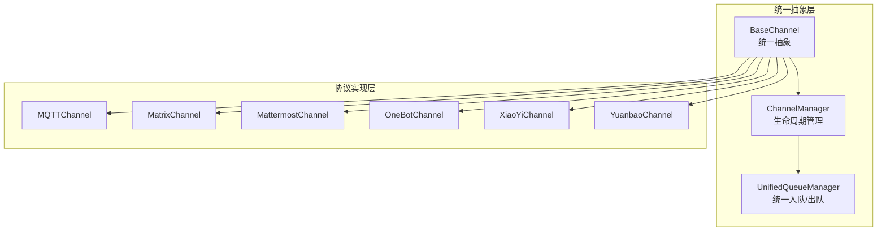
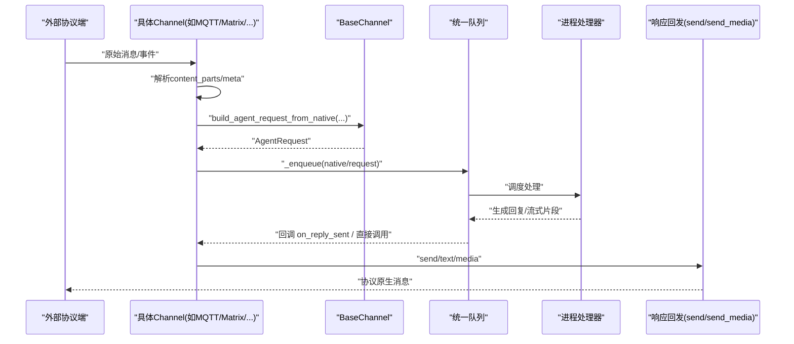
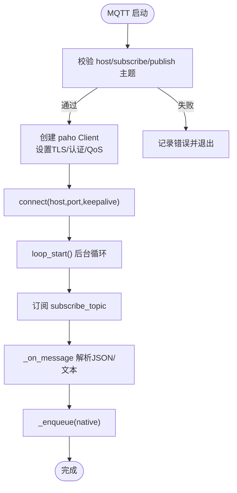
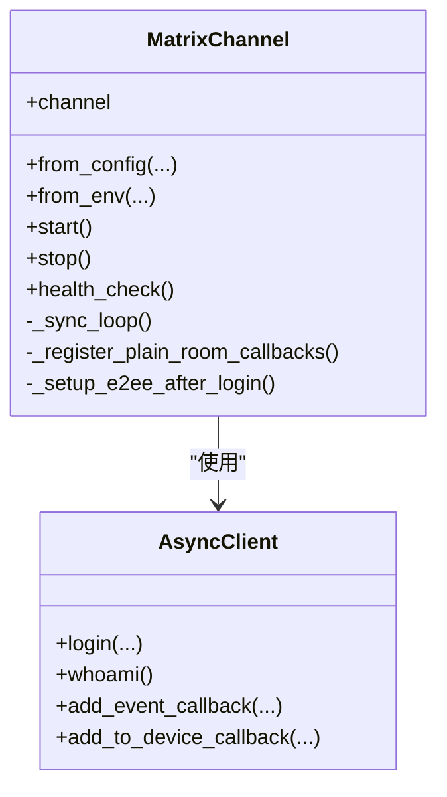
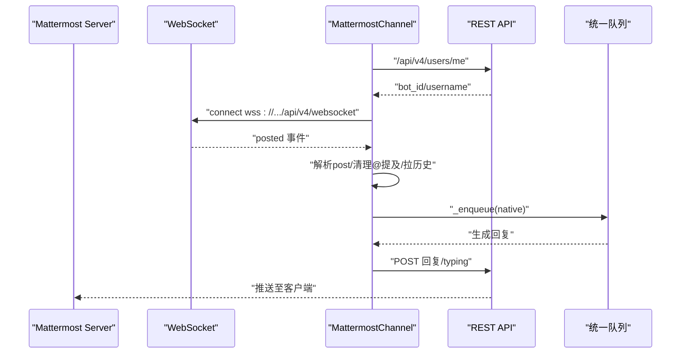
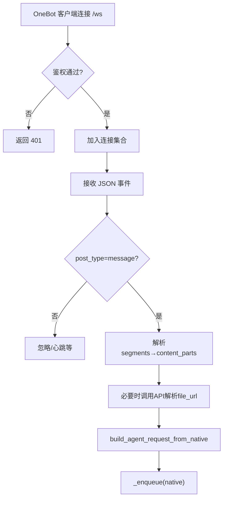
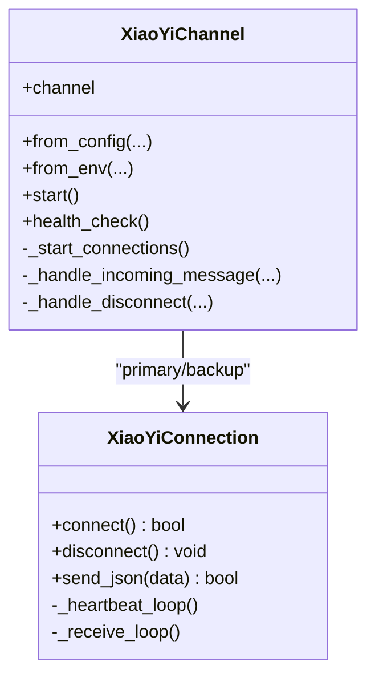
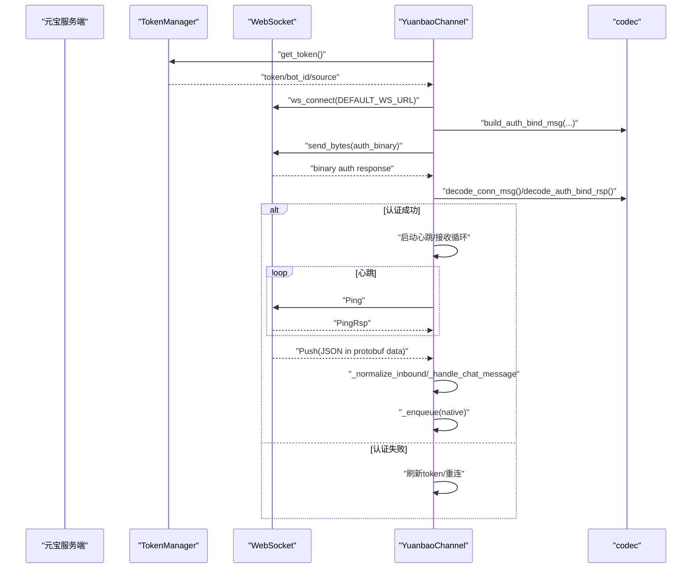
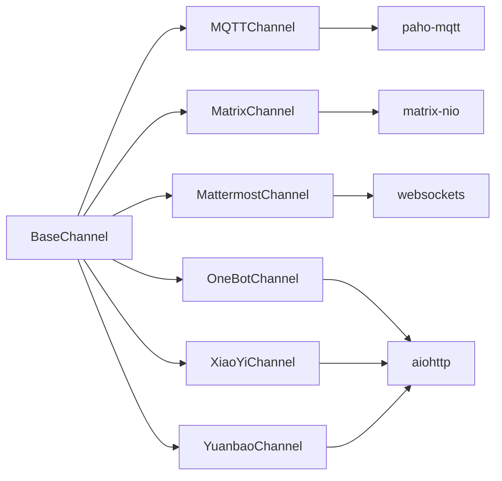

# 协议基础渠道

<cite>
**本文引用的文件**
- [src/qwenpaw/app/channels/base.py](file://src/qwenpaw/app/channels/base.py)
- [src/qwenpaw/app/channels/manager.py](file://src/qwenpaw/app/channels/manager.py)
- [src/qwenpaw/app/channels/unified_queue_manager.py](file://src/qwenpaw/app/channels/unified_queue_manager.py)
- [src/qwenpaw/app/channels/mqtt/channel.py](file://src/qwenpaw/app/channels/mqtt/channel.py)
- [src/qwenpaw/app/channels/matrix/channel.py](file://src/qwenpaw/app/channels/matrix/channel.py)
- [src/qwenpaw/app/channels/mattermost/channel.py](file://src/qwenpaw/app/channels/mattermost/channel.py)
- [src/qwenpaw/app/channels/onebot/channel.py](file://src/qwenpaw/app/channels/onebot/channel.py)
- [src/qwenpaw/app/channels/xiaoyi/channel.py](file://src/qwenpaw/app/channels/xiaoyi/channel.py)
- [src/qwenpaw/app/channels/yuanbao/channel.py](file://src/qwenpaw/app/channels/yuanbao/channel.py)
</cite>

## 目录
1. [简介](#简介)
2. [项目结构](#项目结构)
3. [核心组件](#核心组件)
4. [架构总览](#架构总览)
5. [详细组件分析](#详细组件分析)
6. [依赖关系分析](#依赖关系分析)
7. [性能考量](#性能考量)
8. [故障排查指南](#故障排查指南)
9. [结论](#结论)
10. [附录：配置与调试](#附录配置与调试)

## 简介
本章节面向 QwenPaw 的“协议基础渠道”，聚焦于基于特定协议的接入实现，包括 MQTT、Matrix、Mattermost、OneBot、小艺（A2A over WebSocket）、元宝（Protobuf over WebSocket）等。文档将解释各协议的消息格式、连接管理、状态同步与错误恢复机制；梳理协议适配层设计、数据编解码实现与性能优化策略；并说明不同协议间的差异处理与统一抽象层的实现方式，提供配置方法与调试技巧，兼顾初学者与资深开发者。

## 项目结构
QwenPaw 的渠道系统位于 src/qwenpaw/app/channels 下，采用“统一抽象 + 多协议实现”的分层组织：
- 统一抽象层：BaseChannel、Manager、统一队列等，屏蔽底层协议差异，向上提供一致的会话、路由、发送与渲染接口。
- 协议实现层：每个协议一个子目录，包含 channel.py 及必要的认证、编解码、媒体处理等辅助模块。
- 公共工具：utils、schema、renderer 等，用于消息拆分、内容类型、渲染与通用能力复用。

图表来源
- [src/qwenpaw/app/channels/base.py](file://src/qwenpaw/app/channels/base.py)
- [src/qwenpaw/app/channels/manager.py](file://src/qwenpaw/app/channels/manager.py)
- [src/qwenpaw/app/channels/unified_queue_manager.py](file://src/qwenpaw/app/channels/unified_queue_manager.py)
- [src/qwenpaw/app/channels/mqtt/channel.py](file://src/qwenpaw/app/channels/mqtt/channel.py)
- [src/qwenpaw/app/channels/matrix/channel.py](file://src/qwenpaw/app/channels/matrix/channel.py)
- [src/qwenpaw/app/channels/mattermost/channel.py](file://src/qwenpaw/app/channels/mattermost/channel.py)
- [src/qwenpaw/app/channels/onebot/channel.py](file://src/qwenpaw/app/channels/onebot/channel.py)
- [src/qwenpaw/app/channels/xiaoyi/channel.py](file://src/qwenpaw/app/channels/xiaoyi/channel.py)
- [src/qwenpaw/app/channels/yuanbao/channel.py](file://src/qwenpaw/app/channels/yuanbao/channel.py)

章节来源
- [src/qwenpaw/app/channels/base.py](file://src/qwenpaw/app/channels/base.py)
- [src/qwenpaw/app/channels/manager.py](file://src/qwenpaw/app/channels/manager.py)
- [src/qwenpaw/app/channels/unified_queue_manager.py](file://src/qwenpaw/app/channels/unified_queue_manager.py)

## 核心组件
- BaseChannel（统一抽象）
  - 职责：定义所有渠道必须实现的接口（start/stop/send/send_media/健康检查/会话解析/构建 AgentRequest 等），并提供通用的渲染风格、去抖、过滤、访问控制等横切能力。
  - 关键能力：
    - 统一消息入队：通过 _enqueue 将 native payload 或 AgentRequest 交给统一队列。
    - 统一发送：send/send_media 由具体协议实现，但对外暴露一致签名。
    - 会话路由：resolve_session_id/get_to_handle_from_request/to_handle_from_target 等。
    - 渲染与过滤：show_tool_details/filter_tool_messages/filter_thinking/no_text_debounce 等。
- ChannelManager（通道管理器）
  - 职责：加载、启动、停止、健康检查各渠道实例；协调统一队列与进程处理器。
- UnifiedQueueManager（统一队列）
  - 职责：为 uses_manager_queue=True 的渠道提供集中式入队/出队，避免并发竞争，保证顺序性与背压。

章节来源
- [src/qwenpaw/app/channels/base.py](file://src/qwenpaw/app/channels/base.py)
- [src/qwenpaw/app/channels/manager.py](file://src/qwenpaw/app/channels/manager.py)
- [src/qwenpaw/app/channels/unified_queue_manager.py](file://src/qwenpaw/app/channels/unified_queue_manager.py)

## 架构总览
下图展示了从外部协议到内部 Agent 的统一流程：外部事件进入对应 Channel → 解析为 content_parts 与 meta → 构建 AgentRequest → 入队 → 统一队列调度 → 返回结果后按协议 send/send_media 回写。

图表来源
- [src/qwenpaw/app/channels/base.py](file://src/qwenpaw/app/channels/base.py)
- [src/qwenpaw/app/channels/unified_queue_manager.py](file://src/qwenpaw/app/channels/unified_queue_manager.py)
- [src/qwenpaw/app/channels/mqtt/channel.py](file://src/qwenpaw/app/channels/mqtt/channel.py)
- [src/qwenpaw/app/channels/matrix/channel.py](file://src/qwenpaw/app/channels/matrix/channel.py)
- [src/qwenpaw/app/channels/mattermost/channel.py](file://src/qwenpaw/app/channels/mattermost/channel.py)
- [src/qwenpaw/app/channels/onebot/channel.py](file://src/qwenpaw/app/channels/onebot/channel.py)
- [src/qwenpaw/app/channels/xiaoyi/channel.py](file://src/qwenpaw/app/channels/xiaoyi/channel.py)
- [src/qwenpaw/app/channels/yuanbao/channel.py](file://src/qwenpaw/app/channels/yuanbao/channel.py)

## 详细组件分析

### MQTT 渠道
- 协议要点
  - 使用 paho-mqtt 客户端，支持 TCP/TLS、用户名密码、QoS、Clean Session。
  - 订阅主题接收消息，发布主题发送消息；client_id 可从 topic 或 payload 中解析。
- 消息格式
  - 入站：JSON 文本体优先，若无 JSON 则整段作为文本；至少包含 text 字段。
  - 出站：纯文本或媒体占位提示（图片/视频/音频/文件）。
- 连接管理与状态同步
  - start() 创建 client、设置回调、loop_start()；health_check() 检测连接状态。
  - 重连：paho 内置 reconnect_delay_set；断开时更新 connected 标志。
- 错误恢复
  - 连接失败/异常均记录日志；_on_message 捕获解析异常；未设置 _enqueue 时丢弃并告警。
- 适配层与数据编解码
  - 将 payload 解析为 TextContent，构造 native 负载并通过 _enqueue 入队。
  - send/send_media 根据 OutgoingContentPart 类型选择发布内容。
- 性能优化
  - 合理设置 QoS 与 Clean Session；长轮询 loop_start 在独立线程运行，避免阻塞事件循环。

图表来源
- [src/qwenpaw/app/channels/mqtt/channel.py](file://src/qwenpaw/app/channels/mqtt/channel.py)

章节来源
- [src/qwenpaw/app/channels/mqtt/channel.py](file://src/qwenpaw/app/channels/mqtt/channel.py)

### Matrix 渠道
- 协议要点
  - 基于 matrix-nio 的 AsyncClient，支持 token/password 登录、E2EE（可选）、房间事件回调、ToDevice 事件。
  - 支持历史拉取、typing 指示、流式占位编辑（预留常量）。
- 消息格式
  - 明文/加密事件分别注册回调；Markdown 转 HTML 以 formatted_body 展示。
  - 媒体事件（图/音视频/文件）下载并转为 Image/File/Audio/Video Content。
- 连接管理与状态同步
  - start() 负责初始化 client、登录（password/token）、注册回调、启动 _sync_loop。
  - health_check() 检查 homeserver、access_token、client 状态。
  - E2EE 依赖探测（olm），缺失时降级为非加密模式。
- 错误恢复
  - 登录失败/whoami 不匹配/设备ID缺失等情况均有明确日志与降级路径。
  - sync 任务取消与关闭流程完善。
- 适配层与数据编解码
  - 将 RoomMessage* 与 ToDeviceEvent 转换为 content_parts 与 meta，统一入队。
- 性能优化
  - request_timeout 大于 sync long-poll 超时；按需拉取历史；typing 定时刷新。

图表来源
- [src/qwenpaw/app/channels/matrix/channel.py](file://src/qwenpaw/app/channels/matrix/channel.py)

章节来源
- [src/qwenpaw/app/channels/matrix/channel.py](file://src/qwenpaw/app/channels/matrix/channel.py)

### Mattermost 渠道
- 协议要点
  - 通过 REST API 获取 bot 身份，再建立 WebSocket 监听 posted 事件；回复走 REST。
  - 支持 DM 与 Thread 两种会话模型；首次接触拉取历史作为上下文前缀。
- 消息格式
  - 入站：posted 事件中的 post 对象，含 message、root_id、user_id、channel_type 等。
  - 出站：REST 发送文本/附件；支持 typing 指示。
- 连接管理与状态同步
  - start() 创建异步任务执行 _run()；_websocket_loop 带指数退避重连。
  - health_check() 检查 WS 任务存活与 bot 身份。
- 错误恢复
  - WS 异常捕获并重试；typing 任务有安全超时；历史拉取失败不影响主流程。
- 适配层与数据编解码
  - 解析 post 为 content_parts（文本+附件），构造 native 负载入队。
  - 根据 session 模型决定 root_id 与 session_id。
- 性能优化
  - 仅首次 DM/新 thread 拉取历史；typing 每 4s 刷新且上限 180s。

图表来源
- [src/qwenpaw/app/channels/mattermost/channel.py](file://src/qwenpaw/app/channels/mattermost/channel.py)

章节来源
- [src/qwenpaw/app/channels/mattermost/channel.py](file://src/qwenpaw/app/channels/mattermost/channel.py)

### OneBot 渠道
- 协议要点
  - 反向 WebSocket 服务器（aiohttp web），NapCat/go-cqhttp/Lagrange 等作为客户端连接。
  - 支持 access_token 鉴权；meta_event/lifecycle/heartbeat/message 事件分发。
- 消息格式
  - 入站：message 事件中的 segments（text/image/record/video/file/at 等）。
  - 出站：send_private_msg/send_group_msg，segments 拼装。
- 连接管理与状态同步
  - start() 启动 aiohttp 服务与 watchdog 任务；watchdog 周期性探测端口健康并自动重启。
  - health_check() 报告监听地址与连接数。
- 错误恢复
  - 端口占用时优雅降级，等待旧实例释放后重试；WS 连接异常清理连接集合。
- 适配层与数据编解码
  - 解析 segments 为 content_parts；对 file 段调用 OneBot API 解析真实下载 URL。
  - build_agent_request_from_native 与 resolve_session_id 支持群聊共享会话开关。
- 性能优化
  - 消息处理异步化，WS 读循环不被阻塞；文件 URL 解析按需进行。

图表来源
- [src/qwenpaw/app/channels/onebot/channel.py](file://src/qwenpaw/app/channels/onebot/channel.py)

章节来源
- [src/qwenpaw/app/channels/onebot/channel.py](file://src/qwenpaw/app/channels/onebot/channel.py)

### 小艺（XiaoYi）渠道
- 协议要点
  - 基于 A2A（Agent-to-Agent）协议，双 WebSocket 连接（主域名 + 备用 IP）提升可用性。
  - 连接建立后发送 init 消息，周期心跳，接收 JSON 消息。
- 消息格式
  - 入站：JSON 消息，包含 agentId、method/action、params/sessionId 等。
  - 出站：根据 method/stream 等处理，维护 session→server 映射。
- 连接管理与状态同步
  - XiaoYiConnection 封装单条 WS 的生命周期；Channel 维护 primary/backup 两条连接。
  - 任一连接断开触发重连逻辑；仅当两者都断时才触发全局重连。
- 错误恢复
  - 连接/心跳/接收异常均记录日志；cleanup 确保资源释放；热切换实例时迁移回调。
- 适配层与数据编解码
  - 将 A2A 请求转换为 content_parts 与 meta，统一入队；支持 clearContext/tasks/cancel 等控制命令。
- 性能优化
  - 并行连接建立；按 agent_id 复用连接；IP 地址跳过证书校验减少握手开销。

图表来源
- [src/qwenpaw/app/channels/xiaoyi/channel.py](file://src/qwenpaw/app/channels/xiaoyi/channel.py)

章节来源
- [src/qwenpaw/app/channels/xiaoyi/channel.py](file://src/qwenpaw/app/channels/xiaoyi/channel.py)

### 元宝（Yuanbao）渠道
- 协议要点
  - 基于 Protobuf 二进制协议过 WebSocket，先通过 sign-token API 获取 token，再进行 AuthBind。
  - 支持 C2C 与群组聊天，服务端推送消息，客户端需 ACK。
- 消息格式
  - 入站：ConnMsg 包裹 JSON body，区分 response/push 类型；push 中包含 callback_command 等。
  - 出站：AuthBind/Ping/业务发送等二进制帧。
- 连接管理与状态同步
  - start() → _connect()：sign token → ws_connect → 发送 AuthBind → 等待响应 → 启动心跳与接收循环。
  - heartbeat_loop 周期性 Ping，超过阈值强制关闭并重连；收到 PingRsp 重置间隔。
- 错误恢复
  - 非可重试关闭码标记 stopping；auth 失败刷新 token 并重试；接收异常触发重连。
- 适配层与数据编解码
  - codec 模块负责编解码；normalize_inbound 标准化入站 JSON；session_map 持久化短 ID 映射。
- 性能优化
  - 心跳间隔自适应；pending_requests 用 Future 匹配响应；media 下载上传分离。

图表来源
- [src/qwenpaw/app/channels/yuanbao/channel.py](file://src/qwenpaw/app/channels/yuanbao/channel.py)

章节来源
- [src/qwenpaw/app/channels/yuanbao/channel.py](file://src/qwenpaw/app/channels/yuanbao/channel.py)

## 依赖关系分析
- 统一抽象依赖
  - 所有 Channel 继承 BaseChannel，遵循相同的生命周期与接口契约。
  - uses_manager_queue=True 的渠道通过统一队列管理入队，降低耦合。
- 外部依赖
  - MQTT：paho-mqtt（线程驱动）
  - Matrix：matrix-nio（asyncio）、httpx（HTTP 下载）
  - Mattermost：websockets、httpx
  - OneBot：aiohttp（反向 WS 服务）
  - 小艺：aiohttp（WS 客户端）
  - 元宝：aiohttp（WS 客户端）、自定义 codec（protobuf）
- 潜在环路与风险
  - 各 Channel 之间无直接依赖，依赖集中在 BaseChannel 与统一队列，耦合度低。
  - 注意第三方库导入失败时的降级与日志（如 Matrix E2EE 缺 olm、Mattermost 缺 websockets）。

图表来源
- [src/qwenpaw/app/channels/base.py](file://src/qwenpaw/app/channels/base.py)
- [src/qwenpaw/app/channels/mqtt/channel.py](file://src/qwenpaw/app/channels/mqtt/channel.py)
- [src/qwenpaw/app/channels/matrix/channel.py](file://src/qwenpaw/app/channels/matrix/channel.py)
- [src/qwenpaw/app/channels/mattermost/channel.py](file://src/qwenpaw/app/channels/mattermost/channel.py)
- [src/qwenpaw/app/channels/onebot/channel.py](file://src/qwenpaw/app/channels/onebot/channel.py)
- [src/qwenpaw/app/channels/xiaoyi/channel.py](file://src/qwenpaw/app/channels/xiaoyi/channel.py)
- [src/qwenpaw/app/channels/yuanbao/channel.py](file://src/qwenpaw/app/channels/yuanbao/channel.py)

章节来源
- [src/qwenpaw/app/channels/base.py](file://src/qwenpaw/app/channels/base.py)
- [src/qwenpaw/app/channels/mqtt/channel.py](file://src/qwenpaw/app/channels/mqtt/channel.py)
- [src/qwenpaw/app/channels/matrix/channel.py](file://src/qwenpaw/app/channels/matrix/channel.py)
- [src/qwenpaw/app/channels/mattermost/channel.py](file://src/qwenpaw/app/channels/mattermost/channel.py)
- [src/qwenpaw/app/channels/onebot/channel.py](file://src/qwenpaw/app/channels/onebot/channel.py)
- [src/qwenpaw/app/channels/xiaoyi/channel.py](file://src/qwenpaw/app/channels/xiaoyi/channel.py)
- [src/qwenpaw/app/channels/yuanbao/channel.py](file://src/qwenpaw/app/channels/yuanbao/channel.py)

## 性能考量
- 连接与重连
  - 指数退避（Mattermost）、固定间隔（MQTT）、心跳保活（小艺/元宝）结合，平衡延迟与稳定性。
- 历史与上下文
  - 按需拉取（Mattermost 首次 DM/新 thread；Matrix 历史限制），避免全量拉取造成拥塞。
- 并发与背压
  - 统一队列集中调度，避免多协议并发导致的乱序与竞争；OneBot 异步处理消息避免阻塞 WS 读循环。
- 媒体处理
  - 分块下载（Mattermost）、本地缓存目录隔离（workspace_dir/media），减少网络抖动影响。
- 渲染与过滤
  - 统一渲染风格与过滤开关，减少不必要输出，降低下游处理压力。

[本节为通用指导，无需源码引用]

## 故障排查指南
- 通用步骤
  - 查看 health_check 返回值，确认 channel 是否 disabled/unhealthy/healthy。
  - 核对 from_config/from_env 参数是否完整（host/port/token/user_id 等）。
  - 关注日志关键词：connect failed、auth failed、no active connections、port in use、import error。
- 典型问题定位
  - MQTT：未设置 host/subscribe/publish 主题导致启动跳过；TLS 证书路径不正确；QoS 过高导致吞吐下降。
  - Matrix：olm 未安装导致 E2EE 降级；token 与 user_id 不一致被拒绝；sync 超时需增大 request_timeout。
  - Mattermost：websockets 未安装；WS 任务未启动；bot 身份未解析。
  - OneBot：端口冲突；access_token 校验失败；file_id 无法解析真实 URL。
  - 小艺：agentId 不匹配；双连接均不可用导致重连；IP 地址证书校验失败。
  - 元宝：sign-token 失败；AuthBind 返回非成功码；心跳超时阈值触发重连。

章节来源
- [src/qwenpaw/app/channels/mqtt/channel.py](file://src/qwenpaw/app/channels/mqtt/channel.py)
- [src/qwenpaw/app/channels/matrix/channel.py](file://src/qwenpaw/app/channels/matrix/channel.py)
- [src/qwenpaw/app/channels/mattermost/channel.py](file://src/qwenpaw/app/channels/mattermost/channel.py)
- [src/qwenpaw/app/channels/onebot/channel.py](file://src/qwenpaw/app/channels/onebot/channel.py)
- [src/qwenpaw/app/channels/xiaoyi/channel.py](file://src/qwenpaw/app/channels/xiaoyi/channel.py)
- [src/qwenpaw/app/channels/yuanbao/channel.py](file://src/qwenpaw/app/channels/yuanbao/channel.py)

## 结论
QwenPaw 的协议基础渠道通过统一的 BaseChannel 抽象与统一队列管理，实现了多协议接入的一致性与可扩展性。各协议在连接管理、消息编解码、错误恢复方面各有特色：MQTT 轻量可靠、Matrix 功能完备（E2EE/历史/typing）、Mattermost 强调线程与上下文、OneBot 灵活适配生态、小艺高可用双连接、元宝强一致二进制协议。整体架构清晰、扩展性强，适合在不同场景下快速接入与稳定运行。

[本节为总结，无需源码引用]

## 附录：配置与调试
- 配置方法
  - 环境变量：多数渠道提供 from_env 工厂方法，可通过环境变量启用与配置（如 MQTT_*、ONEBOT_*、YUANBAO_*、XIAOYI_* 等）。
  - 配置文件：from_config 支持 dict/pydantic model/SimpleNamespace，便于 UI/控制台动态下发。
  - 关键参数示例（按渠道）：
    - MQTT：host、port、transport、username、password、subscribe_topic、publish_topic、tls_enabled、qos、clean_session。
    - Matrix：homeserver、user_id/password 或 access_token、device_name/device_id、encryption、history_limit、streaming_enabled。
    - Mattermost：url、bot_token、dm_policy/group_policy、thread_follow_without_mention、show_typing。
    - OneBot：ws_host/ws_port、access_token、require_mention、share_session_in_group。
    - 小艺：ak/sk/agent_id、task_timeout_ms、media_dir。
    - 元宝：app_id/app_secret/api_domain、require_mention、accept_bot_messages。
- 调试技巧
  - 开启详细日志：观察 connect/auth/receive/send 流程与异常堆栈。
  - 健康检查：定期调用 health_check 并记录状态变化。
  - 最小复现：禁用 E2EE（Matrix）、关闭 typing（Mattermost）、降低 QoS（MQTT）等逐步缩小范围。
  - 抓包与回放：对 WebSocket/HTTP 流量进行抓包，验证消息结构与时序。
  - 单元测试参考：voice 渠道测试展示了 mock 与服务启停的健康检查用例，可作为其他渠道的参考范式。

章节来源
- [src/qwenpaw/app/channels/mqtt/channel.py](file://src/qwenpaw/app/channels/mqtt/channel.py)
- [src/qwenpaw/app/channels/matrix/channel.py](file://src/qwenpaw/app/channels/matrix/channel.py)
- [src/qwenpaw/app/channels/mattermost/channel.py](file://src/qwenpaw/app/channels/mattermost/channel.py)
- [src/qwenpaw/app/channels/onebot/channel.py](file://src/qwenpaw/app/channels/onebot/channel.py)
- [src/qwenpaw/app/channels/xiaoyi/channel.py](file://src/qwenpaw/app/channels/xiaoyi/channel.py)
- [src/qwenpaw/app/channels/yuanbao/channel.py](file://src/qwenpaw/app/channels/yuanbao/channel.py)