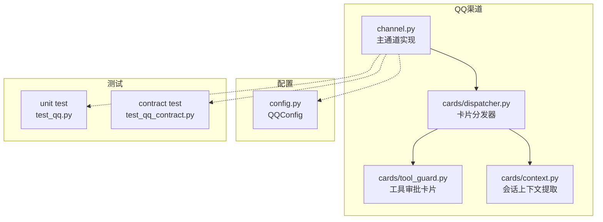
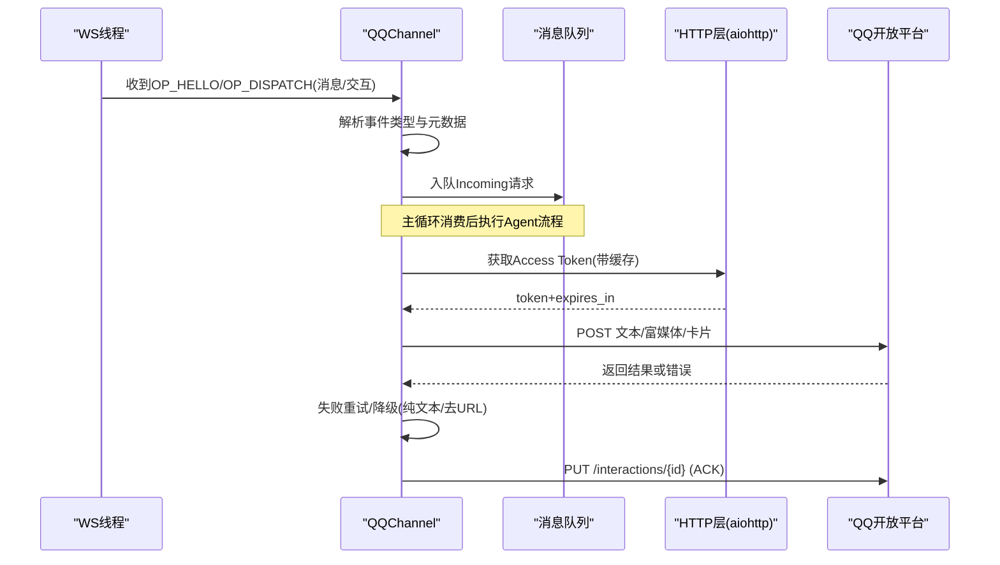
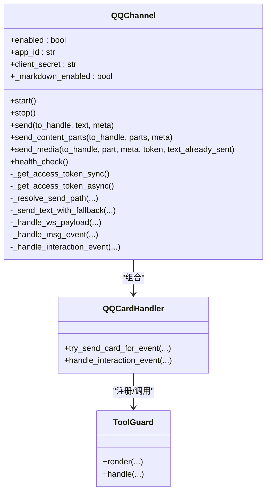
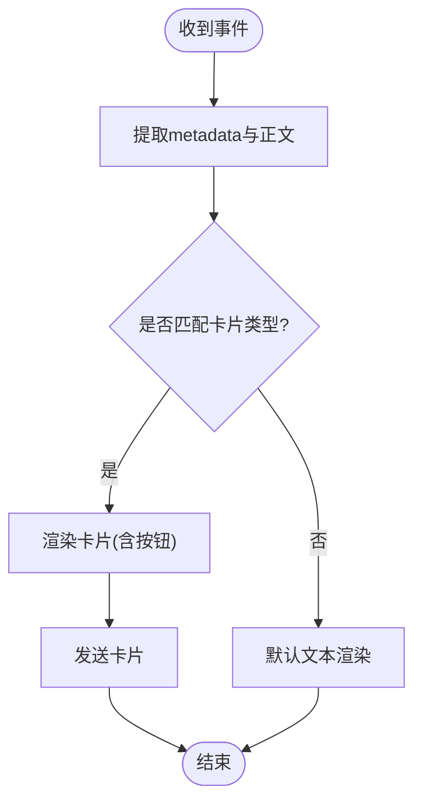
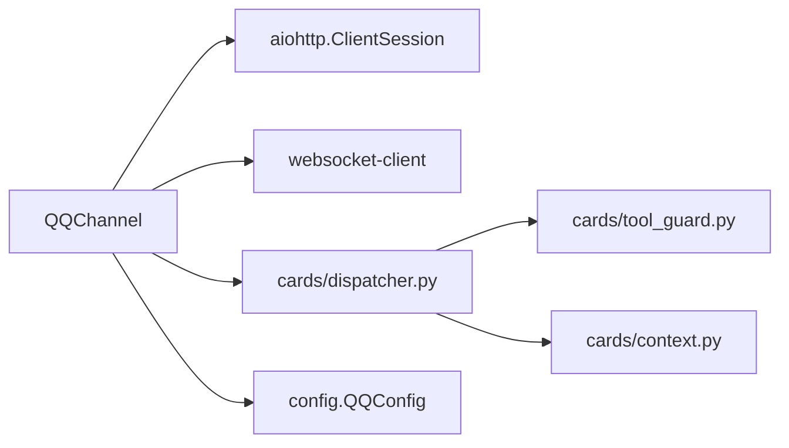

# QQ渠道

<cite>
**本文引用的文件列表**
- [channel.py](file://src/qwenpaw/app/channels/qq/channel.py)
- [dispatcher.py](file://src/qwenpaw/app/channels/qq/cards/dispatcher.py)
- [tool_guard.py](file://src/qwenpaw/app/channels/qq/cards/tool_guard.py)
- [context.py](file://src/qwenpaw/app/channels/qq/cards/context.py)
- [config.py](file://src/qwenpaw/config/config.py)
- [test_qq.py](file://tests/unit/channels/test_qq.py)
- [test_qq_contract.py](file://tests/contract/channels/test_qq_contract.py)
</cite>

## 目录
1. [简介](#简介)
2. [项目结构](#项目结构)
3. [核心组件](#核心组件)
4. [架构总览](#架构总览)
5. [详细组件分析](#详细组件分析)
6. [依赖关系分析](#依赖关系分析)
7. [性能与稳定性](#性能与稳定性)
8. [故障排查指南](#故障排查指南)
9. [结论](#结论)
10. [附录：API调用示例与配置清单](#附录api调用示例与配置清单)

## 简介
本章节面向“QQ频道机器人”的接入与集成，系统性说明以下能力：
- OpenAPI 认证（Access Token 获取、缓存与刷新）
- WebSocket 事件接收与消息推送（C2C、群聊、频道、私聊）
- 卡片系统实现（工具审批卡片、上下文管理、用户交互反馈）
- 消息格式适配（Markdown/纯文本、URL 过滤、表情符号处理策略）
- 文件传输与多媒体支持（图片、视频、音频、文件；语音 ASR 优先）
- API 调用示例、权限配置、频率限制与异常处理策略
- 开发调试指南与常见问题解决方案

## 项目结构
QQ 渠道位于 channels 子包下，包含通道主逻辑与卡片子系统。

图表来源
- [channel.py:1-120](file://src/qwenpaw/app/channels/qq/channel.py#L1-L120)
- [dispatcher.py:1-60](file://src/qwenpaw/app/channels/qq/cards/dispatcher.py#L1-L60)
- [tool_guard.py:1-40](file://src/qwenpaw/app/channels/qq/cards/tool_guard.py#L1-L40)
- [context.py:1-30](file://src/qwenpaw/app/channels/qq/cards/context.py#L1-L30)
- [config.py:272-280](file://src/qwenpaw/config/config.py#L272-L280)

章节来源
- [channel.py:1-120](file://src/qwenpaw/app/channels/qq/channel.py#L1-L120)
- [config.py:272-280](file://src/qwenpaw/config/config.py#L272-L280)

## 核心组件
- QQChannel：负责与 QQ 开放平台交互，包括：
  - Access Token 获取与缓存（同步/异步）
  - WebSocket 长连接、心跳、重连与会话恢复
  - 消息路由与发送（C2C、群聊、频道、DM）
  - 富媒体上传与发送（图片/视频/音频/文件）
  - 即时 ACK 回复
  - 卡片渲染与交互回调
- QQCardHandler：卡片分发器，按 message_type 和 action.data 前缀进行路由
- Tool Guard 卡片：工具审批按钮卡片（Approve/Deny），解析交互事件并注入 /approval 命令
- Context 辅助：从运行时事件中提取元数据与正文文本，构建无状态路由上下文

章节来源
- [channel.py:644-713](file://src/qwenpaw/app/channels/qq/channel.py#L644-L713)
- [dispatcher.py:63-94](file://src/qwenpaw/app/channels/qq/cards/dispatcher.py#L63-L94)
- [tool_guard.py:26-40](file://src/qwenpaw/app/channels/qq/cards/tool_guard.py#L26-L40)
- [context.py:21-47](file://src/qwenpaw/app/channels/qq/cards/context.py#L21-L47)

## 架构总览
QQ 渠道采用“WebSocket 事件入队 + HTTP API 回复”的解耦模式。WS 线程负责接收事件与心跳，主循环通过队列消费并调用 HTTP API 发送回复。卡片系统作为扩展点，在事件完成阶段尝试渲染交互式卡片，否则回退到默认文本渲染。

图表来源
- [channel.py:1600-1685](file://src/qwenpaw/app/channels/qq/channel.py#L1600-L1685)
- [channel.py:714-790](file://src/qwenpaw/app/channels/qq/channel.py#L714-L790)
- [tool_guard.py:426-456](file://src/qwenpaw/app/channels/qq/cards/tool_guard.py#L426-L456)

## 详细组件分析

### QQChannel 主通道
- 认证与网关
  - 同步/异步两种 Access Token 获取方式，实例级缓存，过期前自动刷新
  - 通过 GET /gateway 获取 WebSocket 地址
- 事件处理
  - OP_HELLO 启动心跳；OP_DISPATCH 根据 t 字段分发 READY/RESUMED/INTERACTION_CREATE/消息事件
  - 消息事件映射表定义 C2C、AT_MESSAGE、DIRECT_MESSAGE、GROUP_AT_MESSAGE 等场景
- 发送路径选择
  - DM：/dms/{guild_id}/messages
  - 群聊：/v2/groups/{group_openid}/messages（需要 msg_seq）
  - 频道：/channels/{channel_id}/messages
  - C2C：/v2/users/{openid}/messages（需要 msg_seq）
- 文本发送与降级
  - 支持 Markdown 与纯文本；当 Markdown 校验失败时回退为纯文本
  - 若检测到 URL 内容被拒，二次清洗（更激进的正则）后再试
- 富媒体发送
  - C2C/群：先上传至 /files，再以 msg_type=7 发送；群不支持 file_type=4（普通文件）
  - 频道/DM：仅支持图片/视频，使用 image 字段或 form-data 上传
- 附件下载与语音 ASR
  - 附件按扩展名/MIME 解析类型；语音优先使用平台侧 ASR 文本，若无则使用预转 WAV 链接
- 即时 ACK
  - 收到消息后立即发送 ack_message，避免用户感知延迟
- 卡片集成
  - on_event_message_completed 中优先尝试卡片渲染，失败再走默认文本渲染
  - 交互事件 INTERACTION_CREATE 由卡片分发器处理

图表来源
- [channel.py:644-713](file://src/qwenpaw/app/channels/qq/channel.py#L644-L713)
- [dispatcher.py:63-94](file://src/qwenpaw/app/channels/qq/cards/dispatcher.py#L63-L94)
- [tool_guard.py:211-280](file://src/qwenpaw/app/channels/qq/cards/tool_guard.py#L211-L280)

章节来源
- [channel.py:714-790](file://src/qwenpaw/app/channels/qq/channel.py#L714-L790)
- [channel.py:852-916](file://src/qwenpaw/app/channels/qq/channel.py#L852-L916)
- [channel.py:917-1047](file://src/qwenpaw/app/channels/qq/channel.py#L917-L1047)
- [channel.py:1090-1158](file://src/qwenpaw/app/channels/qq/channel.py#L1090-L1158)
- [channel.py:1315-1337](file://src/qwenpaw/app/channels/qq/channel.py#L1315-L1337)
- [channel.py:1343-1418](file://src/qwenpaw/app/channels/qq/channel.py#L1343-L1418)
- [channel.py:1461-1559](file://src/qwenpaw/app/channels/qq/channel.py#L1461-L1559)
- [channel.py:1565-1588](file://src/qwenpaw/app/channels/qq/channel.py#L1565-L1588)
- [channel.py:1600-1685](file://src/qwenpaw/app/channels/qq/channel.py#L1600-L1685)
- [channel.py:1869-1906](file://src/qwenpaw/app/channels/qq/channel.py#L1869-L1906)
- [channel.py:2007-2086](file://src/qwenpaw/app/channels/qq/channel.py#L2007-L2086)
- [channel.py:2088-2320](file://src/qwenpaw/app/channels/qq/channel.py#L2088-L2320)

### 卡片系统与工具审批
- 分发器
  - 维护两张查找表：按 outbound message_type 匹配 render；按 inbound action.data 前缀匹配 handle
  - 内置注册 tool_guard 卡片
- 工具审批卡片
  - 渲染：将工具审批事件转为 Markdown + 键盘按钮（Approve/Deny），附带 session 上下文
  - 交互：解析 button_data，去重处理，ACK 交互，发送结果消息，并将 /approval 命令入队
- 上下文
  - 从运行时 Msg.metadata 提取嵌套 metadata，扁平化 content 为纯文本
  - 构建路由上下文 sid/sender/mt/goid/cid/gid/mid 等

图表来源
- [dispatcher.py:99-131](file://src/qwenpaw/app/channels/qq/cards/dispatcher.py#L99-L131)
- [tool_guard.py:211-280](file://src/qwenpaw/app/channels/qq/cards/tool_guard.py#L211-L280)
- [context.py:21-47](file://src/qwenpaw/app/channels/qq/cards/context.py#L21-L47)

章节来源
- [dispatcher.py:1-194](file://src/qwenpaw/app/channels/qq/cards/dispatcher.py#L1-L194)
- [tool_guard.py:1-561](file://src/qwenpaw/app/channels/qq/cards/tool_guard.py#L1-L561)
- [context.py:1-85](file://src/qwenpaw/app/channels/qq/cards/context.py#L1-L85)

### 消息格式适配与表情符号处理
- 文本格式
  - 支持 Markdown 与纯文本；当平台拒绝 Markdown 时自动降级为纯文本
  - 对 URL 进行两级清洗：基础正则替换为占位符；必要时启用更激进的正则以去除裸域名
- 表情符号
  - 代码未显式处理表情符号，建议保持原样发送；如平台报错，可在上层预处理中移除或替换为文本描述
- 富媒体
  - 图片/视频/音频/文件分别走不同 API；群组不支持普通文件类型
  - 语音消息优先使用平台侧 ASR 文本，若无则使用预转 WAV 链接进行后续转录

章节来源
- [channel.py:216-283](file://src/qwenpaw/app/channels/qq/channel.py#L216-L283)
- [channel.py:1160-1198](file://src/qwenpaw/app/channels/qq/channel.py#L1160-L1198)
- [channel.py:1254-1313](file://src/qwenpaw/app/channels/qq/channel.py#L1254-L1313)
- [channel.py:1978-2005](file://src/qwenpaw/app/channels/qq/channel.py#L1978-L2005)

### 文件传输与多媒体支持
- 上传与发送
  - C2C/群：/files 上传 -> /messages 发送（msg_type=7）
  - 频道/DM：image 字段（URL）或 file_image（form-data）
- 本地文件与 URL
  - 支持 http(s)/file:// 协议；file:// 会解析为本地路径并校验存在性
- 语音 ASR
  - 若附件携带 asr_refer_text，直接使用该文本，跳过音频下载

章节来源
- [channel.py:438-524](file://src/qwenpaw/app/channels/qq/channel.py#L438-L524)
- [channel.py:526-585](file://src/qwenpaw/app/channels/qq/channel.py#L526-L585)
- [channel.py:1934-1976](file://src/qwenpaw/app/channels/qq/channel.py#L1934-L1976)
- [channel.py:1254-1313](file://src/qwenpaw/app/channels/qq/channel.py#L1254-L1313)

### 权限配置与频率限制
- 权限
  - 通过 Intents 声明所需权限：公开频道消息、成员信息、交互、私聊、群与C2C
  - 注意：首次识别失败次数小于阈值时才开启私聊与群/C2C 意图
- 频率限制
  - 快速断开检测：短时间内多次断线触发限流等待
  - 重连退避：指数退避与最大尝试次数控制
  - 文本发送失败时的 URL 内容错误码判断与降级

章节来源
- [channel.py:64-75](file://src/qwenpaw/app/channels/qq/channel.py#L64-L75)
- [channel.py:1691-1714](file://src/qwenpaw/app/channels/qq/channel.py#L1691-L1714)
- [channel.py:1716-1737](file://src/qwenpaw/app/channels/qq/channel.py#L1716-L1737)
- [channel.py:239-283](file://src/qwenpaw/app/channels/qq/channel.py#L239-L283)

### 异常处理策略
- 认证失败：抛出 ChannelError，记录原因
- 文本发送失败：
  - Markdown 校验失败 -> 降级为纯文本
  - URL 内容被拒 -> 二次清洗后重试
- 富媒体上传失败：记录日志并跳过该资源
- 交互 ACK 失败：记录日志但不中断主流程

章节来源
- [channel.py:714-790](file://src/qwenpaw/app/channels/qq/channel.py#L714-L790)
- [channel.py:917-1047](file://src/qwenpaw/app/channels/qq/channel.py#L917-L1047)
- [tool_guard.py:426-456](file://src/qwenpaw/app/channels/qq/cards/tool_guard.py#L426-L456)

## 依赖关系分析
- QQChannel 依赖：
  - aiohttp：HTTP 客户端
  - websocket-client：WebSocket 客户端（动态导入）
  - cards 子系统：卡片渲染与交互处理
  - config：QQConfig 配置项
- 卡片子系统内部依赖：
  - dispatcher 依赖 context 与 tool_guard
  - tool_guard 依赖 channel 的内部发送函数与队列入队接口

图表来源
- [channel.py:1823-1839](file://src/qwenpaw/app/channels/qq/channel.py#L1823-L1839)
- [dispatcher.py:1-60](file://src/qwenpaw/app/channels/qq/cards/dispatcher.py#L1-L60)
- [tool_guard.py:1-40](file://src/qwenpaw/app/channels/qq/cards/tool_guard.py#L1-L40)
- [config.py:272-280](file://src/qwenpaw/config/config.py#L272-L280)

章节来源
- [channel.py:1823-1839](file://src/qwenpaw/app/channels/qq/channel.py#L1823-L1839)
- [dispatcher.py:1-60](file://src/qwenpaw/app/channels/qq/cards/dispatcher.py#L1-L60)
- [tool_guard.py:1-40](file://src/qwenpaw/app/channels/qq/cards/tool_guard.py#L1-L40)
- [config.py:272-280](file://src/qwenpaw/config/config.py#L272-L280)

## 性能与稳定性
- 并发模型
  - WS 线程独立运行，主循环异步处理，互不阻塞
  - 心跳通过定时器周期性发送，异常静默处理
- 重连与恢复
  - 支持会话恢复（RESUME）与无效会话清理
  - 快速断开保护与限流等待，避免雪崩
- 文本分片
  - 长文本按平台限制分片发送，降低单次请求体积
- 富媒体优化
  - 本地文件读取与 Base64 编码在 executor 中执行，避免阻塞事件循环

章节来源
- [channel.py:150-198](file://src/qwenpaw/app/channels/qq/channel.py#L150-L198)
- [channel.py:1600-1685](file://src/qwenpaw/app/channels/qq/channel.py#L1600-L1685)
- [channel.py:1691-1737](file://src/qwenpaw/app/channels/qq/channel.py#L1691-L1737)
- [channel.py:587-599](file://src/qwenpaw/app/channels/qq/channel.py#L587-L599)

## 故障排查指南
- 无法获取 Access Token
  - 检查 APP_ID 与 CLIENT_SECRET 是否正确
  - 查看 ChannelError 中的响应体与状态码
- WebSocket 频繁断开
  - 关注快速断开计数与限流等待日志
  - 确认网络环境与防火墙策略
- 文本发送失败
  - 若报 Markdown 相关错误，系统将自动降级为纯文本
  - 若报 URL 内容错误，系统将二次清洗后重试
- 富媒体发送失败
  - 群聊不支持普通文件类型，需改用其他形式
  - 频道/DM 仅支持图片/视频，音频/文件将被跳过
- 卡片交互无响应
  - 确认已正确 ACK 交互事件
  - 检查 action.data 前缀与解析逻辑

章节来源
- [channel.py:714-790](file://src/qwenpaw/app/channels/qq/channel.py#L714-L790)
- [channel.py:917-1047](file://src/qwenpaw/app/channels/qq/channel.py#L917-L1047)
- [channel.py:2088-2320](file://src/qwenpaw/app/channels/qq/channel.py#L2088-L2320)
- [tool_guard.py:426-456](file://src/qwenpaw/app/channels/qq/cards/tool_guard.py#L426-L456)

## 结论
QQ 渠道实现了完整的机器人接入能力：稳定的 WebSocket 连接与心跳、健壮的文本与富媒体发送、完善的卡片系统与交互闭环，以及多层次的异常处理与降级策略。结合单元测试与契约测试，可保障接口兼容性与行为一致性。

## 附录：API调用示例与配置清单

### 配置项（环境变量与配置对象）
- 环境变量
  - QQ_CHANNEL_ENABLED：是否启用
  - QQ_APP_ID：应用 ID
  - QQ_CLIENT_SECRET：应用密钥
  - QQ_BOT_PREFIX：消息前缀
  - QQ_MARKDOWN_ENABLED：是否启用 Markdown
  - QQ_API_BASE：可选，覆盖默认 API 根地址
- 配置对象（QQConfig）
  - app_id、client_secret、markdown_enabled、max_reconnect_attempts、ack_message、media_dir、access_control_dm/group 等

章节来源
- [channel.py:796-850](file://src/qwenpaw/app/channels/qq/channel.py#L796-L850)
- [config.py:272-280](file://src/qwenpaw/config/config.py#L272-L280)

### 关键 API 调用路径
- 获取 Access Token
  - POST https://bots.qq.com/app/getAppAccessToken
- 获取 WebSocket 网关地址
  - GET {API_BASE}/gateway
- 发送文本（Markdown/纯文本）
  - C2C/群：POST {API_BASE}/v2/users/{openid}/messages 或 /v2/groups/{group_openid}/messages
  - 频道/DM：POST {API_BASE}/channels/{channel_id}/messages 或 /dms/{guild_id}/messages
- 富媒体上传与发送
  - 上传：POST {API_BASE}/v2/users/{openid}/files 或 /v2/groups/{group_openid}/files
  - 发送：POST {API_BASE}/v2/users/{openid}/messages 或 /v2/groups/{group_openid}/messages（msg_type=7）
  - 频道/DM 图片：POST {API_BASE}/channels/{channel_id}/messages 或 /dms/{guild_id}/messages（image/file_image）
- 交互 ACK
  - PUT {API_BASE}/interactions/{interaction_id}

章节来源
- [channel.py:714-790](file://src/qwenpaw/app/channels/qq/channel.py#L714-L790)
- [channel.py:290-331](file://src/qwenpaw/app/channels/qq/channel.py#L290-L331)
- [channel.py:852-916](file://src/qwenpaw/app/channels/qq/channel.py#L852-L916)
- [channel.py:438-524](file://src/qwenpaw/app/channels/qq/channel.py#L438-L524)
- [channel.py:526-585](file://src/qwenpaw/app/channels/qq/channel.py#L526-L585)
- [tool_guard.py:426-456](file://src/qwenpaw/app/channels/qq/cards/tool_guard.py#L426-L456)

### 单元测试与契约测试要点
- 初始化与工厂方法
  - from_env/from_config 参数解析与默认值
- 文本发送与降级
  - Markdown 校验失败回退、URL 内容错误检测与二次清洗
- 富媒体处理
  - 附件类型解析、语音 ASR 优先、本地/URL 路径处理
- 生命周期与健康检查
  - start/stop、健康状态报告

章节来源
- [test_qq.py:104-287](file://tests/unit/channels/test_qq.py#L104-L287)
- [test_qq.py:294-520](file://tests/unit/channels/test_qq.py#L294-L520)
- [test_qq.py:526-574](file://tests/unit/channels/test_qq.py#L526-L574)
- [test_qq.py:581-710](file://tests/unit/channels/test_qq.py#L581-L710)
- [test_qq.py:717-800](file://tests/unit/channels/test_qq.py#L717-L800)
- [test_qq_contract.py:21-45](file://tests/contract/channels/test_qq_contract.py#L21-L45)