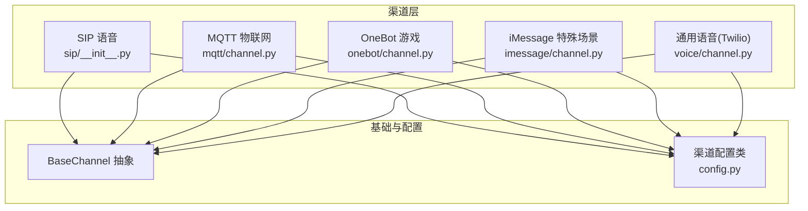
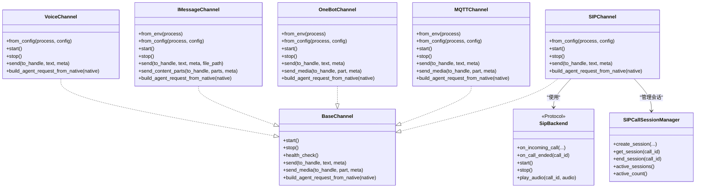
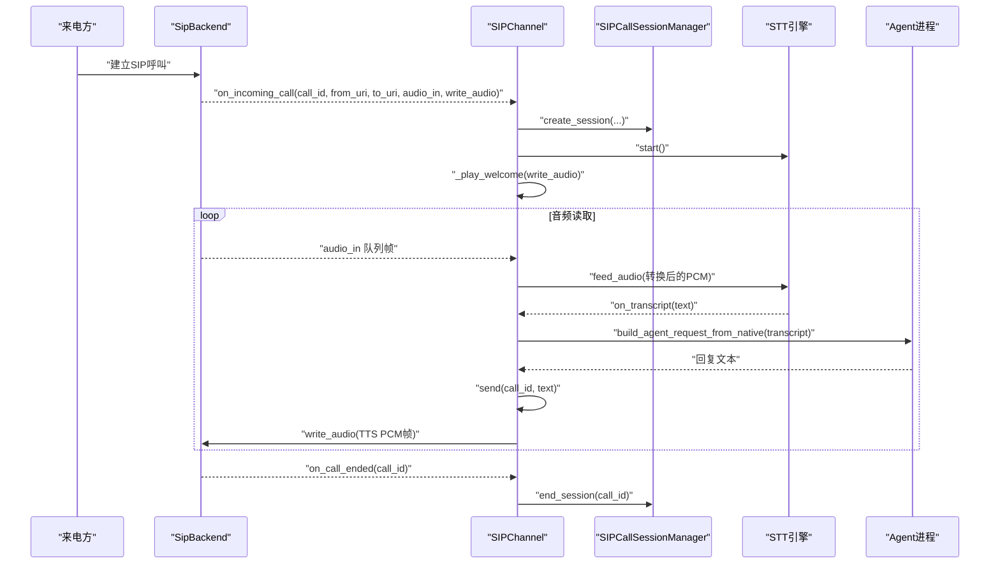
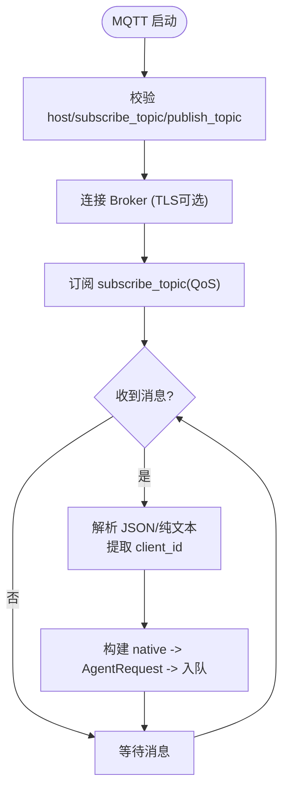
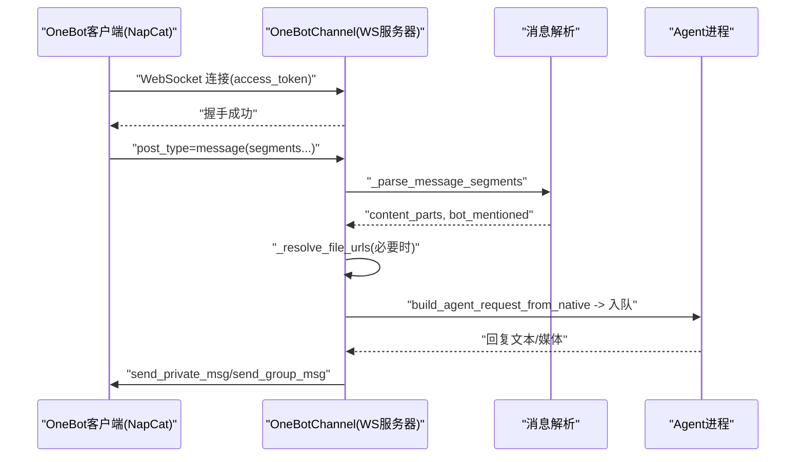
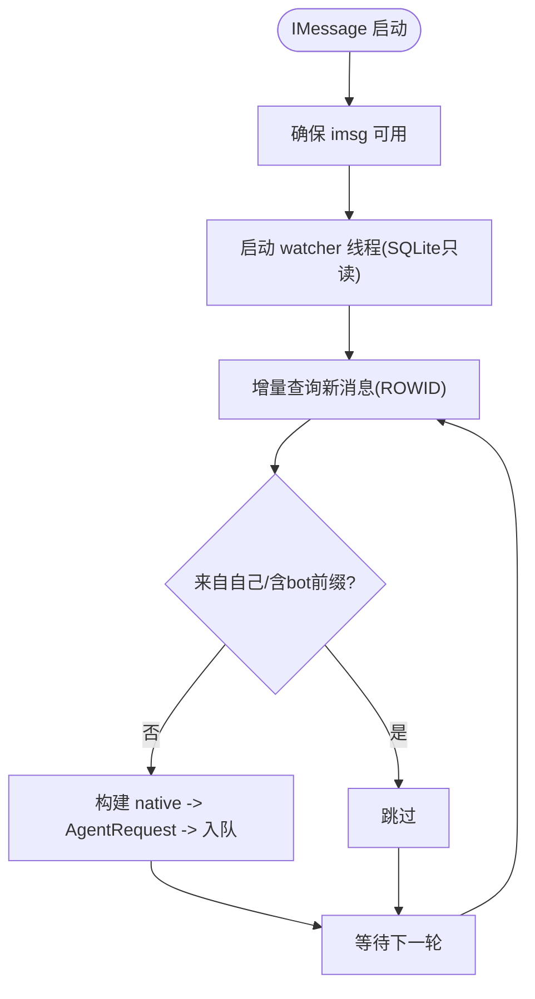
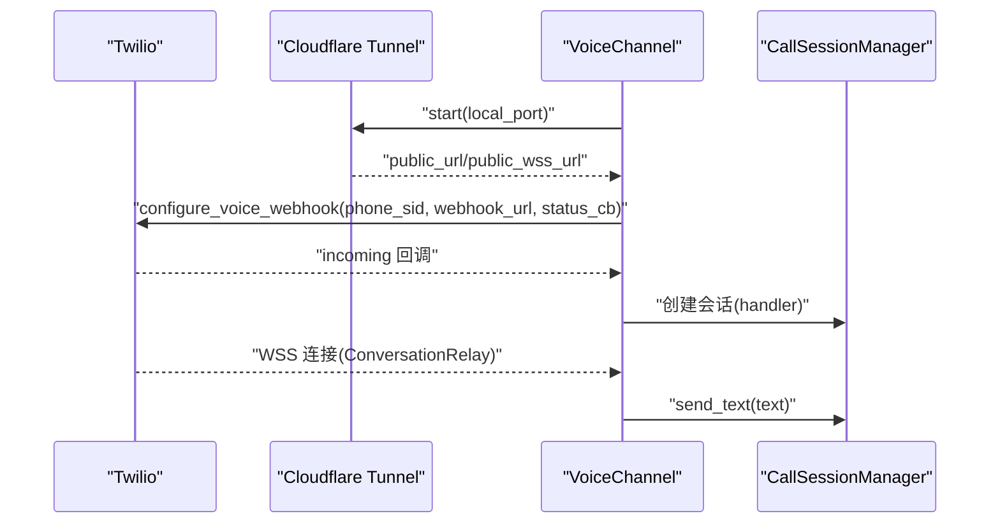
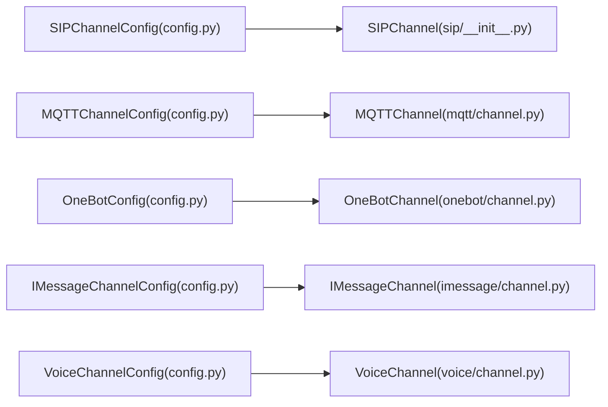

# 专业通讯渠道

<cite>
**本文引用的文件**   
- [src/qwenpaw/app/channels/sip/__init__.py](file://src/qwenpaw/app/channels/sip/__init__.py)
- [src/qwenpaw/app/channels/sip/backend.py](file://src/qwenpaw/app/channels/sip/backend.py)
- [src/qwenpaw/app/channels/sip/session.py](file://src/qwenpaw/app/channels/sip/session.py)
- [src/qwenpaw/config/config.py](file://src/qwenpaw/config/config.py)
- [src/qwenpaw/app/channels/mqtt/channel.py](file://src/qwenpaw/app/channels/mqtt/channel.py)
- [src/qwenpaw/app/channels/onebot/channel.py](file://src/qwenpaw/app/channels/onebot/channel.py)
- [src/qwenpaw/app/channels/imessage/channel.py](file://src/qwenpaw/app/channels/imessage/channel.py)
- [src/qwenpaw/app/channels/voice/channel.py](file://src/qwenpaw/app/channels/voice/channel.py)
</cite>

## 目录
1. [简介](#简介)
2. [项目结构](#项目结构)
3. [核心组件](#核心组件)
4. [架构总览](#架构总览)
5. [详细组件分析](#详细组件分析)
6. [依赖关系分析](#依赖关系分析)
7. [性能考虑](#性能考虑)
8. [故障诊断指南](#故障诊断指南)
9. [结论](#结论)
10. [附录](#附录)

## 简介
本文件聚焦于专业通讯渠道的集成与实现，覆盖以下场景：
- SIP 语音通话（双后端：开发 pyVoIP、生产 LiveKit）
- MQTT 物联网协议（主题管理、消息路由、离线能力）
- OneBot 游戏平台（反向 WebSocket、群私聊、多媒体）
- iMessage 特殊场景（本地数据库轮询、媒体处理）
- 通用语音通道（Twilio + Cloudflare Tunnel）

文档将深入解释会话管理、实时音频流处理、设备状态同步、协议适配层设计，并提供网络配置、安全加密、性能优化方案以及故障诊断方法。

## 项目结构
QwenPaw 的渠道系统位于 src/qwenpaw/app/channels 下，每个渠道以独立子模块组织，统一继承 BaseChannel 接口，提供 from_config/from_env 工厂方法、生命周期 start/stop、健康检查 health_check、消息收发 send/send_media、AgentRequest 转换 build_agent_request_from_native 等标准能力。

图表来源
- [src/qwenpaw/app/channels/sip/__init__.py:39-100](file://src/qwenpaw/app/channels/sip/__init__.py#L39-L100)
- [src/qwenpaw/app/channels/mqtt/channel.py:30-126](file://src/qwenpaw/app/channels/mqtt/channel.py#L30-L126)
- [src/qwenpaw/app/channels/onebot/channel.py:47-189](file://src/qwenpaw/app/channels/onebot/channel.py#L47-L189)
- [src/qwenpaw/app/channels/imessage/channel.py:39-183](file://src/qwenpaw/app/channels/imessage/channel.py#L39-L183)
- [src/qwenpaw/app/channels/voice/channel.py:17-83](file://src/qwenpaw/app/channels/voice/channel.py#L17-L83)
- [src/qwenpaw/config/config.py:391-417](file://src/qwenpaw/config/config.py#L391-L417)

章节来源
- [src/qwenpaw/app/channels/sip/__init__.py:39-100](file://src/qwenpaw/app/channels/sip/__init__.py#L39-L100)
- [src/qwenpaw/app/channels/mqtt/channel.py:30-126](file://src/qwenpaw/app/channels/mqtt/channel.py#L30-L126)
- [src/qwenpaw/app/channels/onebot/channel.py:47-189](file://src/qwenpaw/app/channels/onebot/channel.py#L47-L189)
- [src/qwenpaw/app/channels/imessage/channel.py:39-183](file://src/qwenpaw/app/channels/imessage/channel.py#L39-L183)
- [src/qwenpaw/app/channels/voice/channel.py:17-83](file://src/qwenpaw/app/channels/voice/channel.py#L17-L83)
- [src/qwenpaw/config/config.py:391-417](file://src/qwenpaw/config/config.py#L391-L417)

## 核心组件
- SIP 语音通道
  - 双后端模式：dev（pyVoIP）与 livekit（LiveKit），通过 SipBackend 协议解耦。
  - 会话管理：SIPCallSessionManager 维护活跃通话、STT/TTS 控制、超时与并发限制。
  - 实时音频：PCM 格式转换、流式 TTS 播放、语音打断（barge-in）。
- MQTT 物联网通道
  - 基于 paho-mqtt，支持 TLS、QoS、clean session、订阅/发布主题模板。
  - 消息路由：从 topic/payload 解析 client_id，构建 AgentRequest 并入队。
- OneBot 游戏平台
  - 反向 WebSocket 服务器，鉴权（access_token）、事件分发、多媒体发送。
  - 群/私聊会话策略、@提及检测、文件 URL 解析。
- iMessage 特殊场景
  - 本地 SQLite 轮询 chat.db，过滤 bot 前缀，文本+媒体分离发送。
  - 支持本地路径、HTTP/HTTPS、data:base64 三种媒体源，含大小限制与文件名清洗。
- 通用语音通道（Twilio）
  - Twilio ConversationRelay + Cloudflare Tunnel，自动创建公网 WSS，Webhook 回调驱动通话。

章节来源
- [src/qwenpaw/app/channels/sip/__init__.py:39-100](file://src/qwenpaw/app/channels/sip/__init__.py#L39-L100)
- [src/qwenpaw/app/channels/sip/session.py:14-92](file://src/qwenpaw/app/channels/sip/session.py#L14-L92)
- [src/qwenpaw/app/channels/mqtt/channel.py:30-126](file://src/qwenpaw/app/channels/mqtt/channel.py#L30-L126)
- [src/qwenpaw/app/channels/onebot/channel.py:47-189](file://src/qwenpaw/app/channels/onebot/channel.py#L47-L189)
- [src/qwenpaw/app/channels/imessage/channel.py:39-183](file://src/qwenpaw/app/channels/imessage/channel.py#L39-L183)
- [src/qwenpaw/app/channels/voice/channel.py:17-83](file://src/qwenpaw/app/channels/voice/channel.py#L17-L83)

## 架构总览
下图展示各渠道与基础抽象、配置的关系，以及关键数据流向。

图表来源
- [src/qwenpaw/app/channels/sip/__init__.py:39-100](file://src/qwenpaw/app/channels/sip/__init__.py#L39-L100)
- [src/qwenpaw/app/channels/sip/backend.py:36-55](file://src/qwenpaw/app/channels/sip/backend.py#L36-L55)
- [src/qwenpaw/app/channels/sip/session.py:37-92](file://src/qwenpaw/app/channels/sip/session.py#L37-L92)
- [src/qwenpaw/app/channels/mqtt/channel.py:30-126](file://src/qwenpaw/app/channels/mqtt/channel.py#L30-L126)
- [src/qwenpaw/app/channels/onebot/channel.py:47-189](file://src/qwenpaw/app/channels/onebot/channel.py#L47-L189)
- [src/qwenpaw/app/channels/imessage/channel.py:39-183](file://src/qwenpaw/app/channels/imessage/channel.py#L39-L183)
- [src/qwenpaw/app/channels/voice/channel.py:17-83](file://src/qwenpaw/app/channels/voice/channel.py#L17-L83)

## 详细组件分析

### SIP 语音通道
- 双后端设计
  - dev 模式：PyVoIPBackend，适合本地软电话快速验证。
  - livekit 模式：LiveKitBackend，面向生产环境，支持高并发与云端中继。
- 会话与资源
  - SIPCallSessionManager 管理 call_id 到会话对象映射，记录 STT/TTS 状态、tts_abort 事件、开始时间等。
  - 并发限制：max_concurrent_calls 控制同时通话数。
- 实时音频流
  - 输入：后端队列 PCM 帧，按采样率/位深转换为 STT 期望格式（16k/16bit）。
  - 输出：流式 TTS 合成，按帧推送至后端写函数；支持打断（用户说话时中止当前 TTS）。
- 超时与空闲挂断
  - 每次收到转写或交互重置空闲计时器，超过 call_timeout 自动结束通话。
- 欢迎语与错误提示
  - 接通后播放 welcome_greeting；STT 启动失败时回播错误提示。

图表来源
- [src/qwenpaw/app/channels/sip/__init__.py:300-398](file://src/qwenpaw/app/channels/sip/__init__.py#L300-L398)
- [src/qwenpaw/app/channels/sip/__init__.py:495-564](file://src/qwenpaw/app/channels/sip/__init__.py#L495-L564)
- [src/qwenpaw/app/channels/sip/__init__.py:576-628](file://src/qwenpaw/app/channels/sip/__init__.py#L576-L628)
- [src/qwenpaw/app/channels/sip/session.py:37-92](file://src/qwenpaw/app/channels/sip/session.py#L37-L92)

章节来源
- [src/qwenpaw/app/channels/sip/__init__.py:39-100](file://src/qwenpaw/app/channels/sip/__init__.py#L39-L100)
- [src/qwenpaw/app/channels/sip/__init__.py:300-398](file://src/qwenpaw/app/channels/sip/__init__.py#L300-L398)
- [src/qwenpaw/app/channels/sip/__init__.py:495-564](file://src/qwenpaw/app/channels/sip/__init__.py#L495-L564)
- [src/qwenpaw/app/channels/sip/__init__.py:576-628](file://src/qwenpaw/app/channels/sip/__init__.py#L576-L628)
- [src/qwenpaw/app/channels/sip/backend.py:36-55](file://src/qwenpaw/app/channels/sip/backend.py#L36-L55)
- [src/qwenpaw/app/channels/sip/session.py:37-92](file://src/qwenpaw/app/channels/sip/session.py#L37-L92)
- [src/qwenpaw/config/config.py:391-417](file://src/qwenpaw/config/config.py#L391-L417)

### MQTT 物联网通道
- 连接与会话
  - 使用 paho.mqtt.client，支持 TCP/WebSocket 传输、TLS、用户名密码、QoS、clean session。
  - 重连策略：reconnect_delay_set(min=1, max=10)。
- 主题管理与消息路由
  - subscribe_topic 订阅设备上行主题；publish_topic 可带 {client_id} 模板用于下行。
  - 解析逻辑：优先 payload.redirect_client_id，其次 topic 分段，最后 fallback 为 unknown-client。
- 离线与健壮性
  - QoS=2 确保至少一次投递；clean_session 控制是否保留离线消息。
  - 健康检查返回连接状态与 broker 地址。
- 媒体与多类型内容
  - send_media 对图片/视频/音频/文件进行文本占位转发，便于设备端显示链接或提示。

图表来源
- [src/qwenpaw/app/channels/mqtt/channel.py:217-240](file://src/qwenpaw/app/channels/mqtt/channel.py#L217-L240)
- [src/qwenpaw/app/channels/mqtt/channel.py:256-306](file://src/qwenpaw/app/channels/mqtt/channel.py#L256-L306)
- [src/qwenpaw/app/channels/mqtt/channel.py:333-390](file://src/qwenpaw/app/channels/mqtt/channel.py#L333-L390)
- [src/qwenpaw/app/channels/mqtt/channel.py:400-476](file://src/qwenpaw/app/channels/mqtt/channel.py#L400-L476)

章节来源
- [src/qwenpaw/app/channels/mqtt/channel.py:30-126](file://src/qwenpaw/app/channels/mqtt/channel.py#L30-L126)
- [src/qwenpaw/app/channels/mqtt/channel.py:217-240](file://src/qwenpaw/app/channels/mqtt/channel.py#L217-L240)
- [src/qwenpaw/app/channels/mqtt/channel.py:256-306](file://src/qwenpaw/app/channels/mqtt/channel.py#L256-L306)
- [src/qwenpaw/app/channels/mqtt/channel.py:333-390](file://src/qwenpaw/app/channels/mqtt/channel.py#L333-L390)
- [src/qwenpaw/app/channels/mqtt/channel.py:400-476](file://src/qwenpaw/app/channels/mqtt/channel.py#L400-L476)

### OneBot 游戏平台
- 反向 WebSocket 服务
  - 监听 /ws 与 /ws/，支持 access_token 鉴权（Header/Query）。
  - 心跳与生命周期 meta_event 维护 self_id。
- 事件分发与消息解析
  - message 事件解析 segments（text/image/record/video/file/at），构建 content_parts。
  - 文件下载：当 segment 仅包含 file_id 时，调用 OneBot API 获取真实下载 URL。
- 会话与路由
  - 群聊支持 share_session_in_group 共享会话；否则按 group_id:user_id 区分。
  - get_to_handle_from_request 根据 is_group 决定 group:gid 或 user_id。
- 发送与多媒体
  - send 分片文本，按群/私调用不同 API；send_media 支持 image/record/video/file。

图表来源
- [src/qwenpaw/app/channels/onebot/channel.py:251-290](file://src/qwenpaw/app/channels/onebot/channel.py#L251-L290)
- [src/qwenpaw/app/channels/onebot/channel.py:443-532](file://src/qwenpaw/app/channels/onebot/channel.py#L443-L532)
- [src/qwenpaw/app/channels/onebot/channel.py:537-678](file://src/qwenpaw/app/channels/onebot/channel.py#L537-L678)
- [src/qwenpaw/app/channels/onebot/channel.py:729-800](file://src/qwenpaw/app/channels/onebot/channel.py#L729-L800)

章节来源
- [src/qwenpaw/app/channels/onebot/channel.py:47-189](file://src/qwenpaw/app/channels/onebot/channel.py#L47-L189)
- [src/qwenpaw/app/channels/onebot/channel.py:251-290](file://src/qwenpaw/app/channels/onebot/channel.py#L251-L290)
- [src/qwenpaw/app/channels/onebot/channel.py:443-532](file://src/qwenpaw/app/channels/onebot/channel.py#L443-L532)
- [src/qwenpaw/app/channels/onebot/channel.py:537-678](file://src/qwenpaw/app/channels/onebot/channel.py#L537-L678)
- [src/qwenpaw/app/channels/onebot/channel.py:729-800](file://src/qwenpaw/app/channels/onebot/channel.py#L729-L800)

### iMessage 特殊场景
- 本地数据库轮询
  - 只读连接 ~/Library/Messages/chat.db，按 ROWID 增量拉取非 bot 前缀消息。
  - 线程安全入队：_emit_request_threadsafe 调用 manager 的 _enqueue。
- 发送与媒体处理
  - 文本与媒体分开发送；媒体支持本地路径、HTTP/HTTPS、data:base64。
  - data:base64 解码前估算大小，限制最大解码尺寸，防止内存溢出。
  - 文件名清洗：仅允许安全字符，避免路径穿越。
- 健康检查
  - 检查 imsg 二进制存在性与 watcher 线程存活状态。

图表来源
- [src/qwenpaw/app/channels/imessage/channel.py:185-208](file://src/qwenpaw/app/channels/imessage/channel.py#L185-L208)
- [src/qwenpaw/app/channels/imessage/channel.py:236-308](file://src/qwenpaw/app/channels/imessage/channel.py#L236-L308)
- [src/qwenpaw/app/channels/imessage/channel.py:393-471](file://src/qwenpaw/app/channels/imessage/channel.py#L393-L471)
- [src/qwenpaw/app/channels/imessage/channel.py:553-674](file://src/qwenpaw/app/channels/imessage/channel.py#L553-L674)

章节来源
- [src/qwenpaw/app/channels/imessage/channel.py:39-183](file://src/qwenpaw/app/channels/imessage/channel.py#L39-L183)
- [src/qwenpaw/app/channels/imessage/channel.py:185-208](file://src/qwenpaw/app/channels/imessage/channel.py#L185-L208)
- [src/qwenpaw/app/channels/imessage/channel.py:236-308](file://src/qwenpaw/app/channels/imessage/channel.py#L236-L308)
- [src/qwenpaw/app/channels/imessage/channel.py:393-471](file://src/qwenpaw/app/channels/imessage/channel.py#L393-L471)
- [src/qwenpaw/app/channels/imessage/channel.py:553-674](file://src/qwenpaw/app/channels/imessage/channel.py#L553-L674)

### 通用语音通道（Twilio）
- 隧道与 Webhook
  - 启动 Cloudflare Tunnel 暴露本地端口，生成公网 WSS 地址。
  - 配置 Twilio 号码的 incoming webhook 与 status callback。
- 会话管理
  - CallSessionManager 管理 active sessions，stop 时关闭所有 handler。
- 发送文本
  - send 通过 session.handler.send_text 向通话写入文本。

图表来源
- [src/qwenpaw/app/channels/voice/channel.py:114-170](file://src/qwenpaw/app/channels/voice/channel.py#L114-L170)
- [src/qwenpaw/app/channels/voice/channel.py:171-190](file://src/qwenpaw/app/channels/voice/channel.py#L171-L190)
- [src/qwenpaw/app/channels/voice/channel.py:192-203](file://src/qwenpaw/app/channels/voice/channel.py#L192-L203)

章节来源
- [src/qwenpaw/app/channels/voice/channel.py:17-83](file://src/qwenpaw/app/channels/voice/channel.py#L17-L83)
- [src/qwenpaw/app/channels/voice/channel.py:114-170](file://src/qwenpaw/app/channels/voice/channel.py#L114-L170)
- [src/qwenpaw/app/channels/voice/channel.py:171-190](file://src/qwenpaw/app/channels/voice/channel.py#L171-L190)
- [src/qwenpaw/app/channels/voice/channel.py:192-203](file://src/qwenpaw/app/channels/voice/channel.py#L192-L203)

## 依赖关系分析
- 渠道与配置
  - SIPChannelConfig 定义双后端参数（mode、host/port、RTP 范围、LiveKit 凭据、并发上限等）。
  - MQTTChannelConfig/OneBotConfig/IMessageChannelConfig 分别对应各自的环境变量与配置项。
- 外部依赖
  - MQTT：paho-mqtt（连接、TLS、QoS）。
  - OneBot：aiohttp（WS 服务器）、JSON 解析。
  - iMessage：sqlite3（只读）、subprocess（imsg 命令）、hashlib/base64（媒体处理）。
  - Voice：Cloudflare Tunnel Driver、Twilio Manager。

图表来源
- [src/qwenpaw/config/config.py:391-417](file://src/qwenpaw/config/config.py#L391-L417)
- [src/qwenpaw/app/channels/sip/__init__.py:78-99](file://src/qwenpaw/app/channels/sip/__init__.py#L78-L99)
- [src/qwenpaw/app/channels/mqtt/channel.py:127-215](file://src/qwenpaw/app/channels/mqtt/channel.py#L127-L215)
- [src/qwenpaw/app/channels/onebot/channel.py:150-189](file://src/qwenpaw/app/channels/onebot/channel.py#L150-L189)
- [src/qwenpaw/app/channels/imessage/channel.py:146-183](file://src/qwenpaw/app/channels/imessage/channel.py#L146-L183)
- [src/qwenpaw/app/channels/voice/channel.py:55-83](file://src/qwenpaw/app/channels/voice/channel.py#L55-L83)

章节来源
- [src/qwenpaw/config/config.py:391-417](file://src/qwenpaw/config/config.py#L391-L417)
- [src/qwenpaw/app/channels/sip/__init__.py:78-99](file://src/qwenpaw/app/channels/sip/__init__.py#L78-L99)
- [src/qwenpaw/app/channels/mqtt/channel.py:127-215](file://src/qwenpaw/app/channels/mqtt/channel.py#L127-L215)
- [src/qwenpaw/app/channels/onebot/channel.py:150-189](file://src/qwenpaw/app/channels/onebot/channel.py#L150-L189)
- [src/qwenpaw/app/channels/imessage/channel.py:146-183](file://src/qwenpaw/app/channels/imessage/channel.py#L146-L183)
- [src/qwenpaw/app/channels/voice/channel.py:55-83](file://src/qwenpaw/app/channels/voice/channel.py#L55-L83)

## 性能考虑
- SIP
  - 并发上限：max_concurrent_calls 控制同时通话数，避免资源耗尽。
  - 音频帧大小：dev 模式 160 字节（8kHz/8bit/20ms），livekit 模式 960 字节（24kHz/16bit/20ms），减少缓冲延迟。
  - 连续错误保护：feed_audio 连续错误达到阈值停止 STT，避免雪崩。
- MQTT
  - QoS=2 保证可靠投递；clean_session=false 可保留离线消息（需配合 Broker 持久化）。
  - 重连退避：min=1s、max=10s，降低瞬时风暴。
- OneBot
  - 异步事件处理：WS 读循环不阻塞，事件处理用 create_task 并行执行。
  - 文件 URL 解析：仅在需要时调用 OneBot API，避免多余开销。
- iMessage
  - 只读 SQLite 连接与增量 ROWID 查询，避免全表扫描。
  - base64 解码前估算大小，限制最大解码尺寸，防止内存暴涨。
- Voice
  - Tunnel 自动重启与端口探测，保障公网可达性。
  - 会话级 handler 关闭，避免僵尸连接。

[本节为通用指导，无需具体文件引用]

## 故障诊断指南
- SIP
  - 现象：无法接听或无声音
    - 检查 sip_mode、sip_host/sip_port、rtp 端口范围、LiveKit 凭据。
    - 查看 on_incoming_call 日志与 STT 启动异常。
  - 现象：通话中断或无响应
    - 确认 call_timeout 设置与 idle 计时器是否被正确重置。
    - 观察 _call_timeout 与 _on_call_ended 日志。
- MQTT
  - 现象：连接失败
    - 校验 host/port/transport/tls 证书；查看 connect 返回码。
  - 现象：消息未到达
    - 检查 subscribe_topic 与 publish_topic 模板；确认 QoS 与 clean_session。
    - 查看 _on_message 解析与 _enqueue 是否触发。
- OneBot
  - 现象：连接被拒绝
    - 核对 access_token（Header/Query）；查看 401 日志。
  - 现象：文件无法下载
    - 检查 file_id 是否存在；确认 get_group_file_url/get_private_file_url 返回值。
- iMessage
  - 现象：imsg 不可用
    - 确认 brew tap 安装与 which imsg；查看 ChannelError 提示。
  - 现象：媒体发送失败
    - 检查 URL 类型（local/http/data）与大小限制；查看下载与保存日志。
- Voice
  - 现象：Tunnel 未启动或端口冲突
    - 查看 watchdog 日志与 _is_server_healthy 探测结果。
  - 现象：Twilio Webhook 未生效
    - 确认 phone_number_sid 与 public_url 配置；检查 configure_voice_webhook 异常。

章节来源
- [src/qwenpaw/app/channels/sip/__init__.py:300-398](file://src/qwenpaw/app/channels/sip/__init__.py#L300-L398)
- [src/qwenpaw/app/channels/sip/__init__.py:495-564](file://src/qwenpaw/app/channels/sip/__init__.py#L495-L564)
- [src/qwenpaw/app/channels/mqtt/channel.py:226-243](file://src/qwenpaw/app/channels/mqtt/channel.py#L226-L243)
- [src/qwenpaw/app/channels/mqtt/channel.py:256-306](file://src/qwenpaw/app/channels/mqtt/channel.py#L256-L306)
- [src/qwenpaw/app/channels/onebot/channel.py:382-437](file://src/qwenpaw/app/channels/onebot/channel.py#L382-L437)
- [src/qwenpaw/app/channels/onebot/channel.py:608-678](file://src/qwenpaw/app/channels/onebot/channel.py#L608-L678)
- [src/qwenpaw/app/channels/imessage/channel.py:185-208](file://src/qwenpaw/app/channels/imessage/channel.py#L185-L208)
- [src/qwenpaw/app/channels/imessage/channel.py:553-674](file://src/qwenpaw/app/channels/imessage/channel.py#L553-L674)
- [src/qwenpaw/app/channels/voice/channel.py:114-170](file://src/qwenpaw/app/channels/voice/channel.py#L114-L170)

## 结论
本仓库在渠道层实现了高度可扩展的专业通讯能力：SIP 语音提供双后端与实时音视频链路；MQTT 面向 IoT 设备提供稳定可靠的主题路由；OneBot 打通游戏平台生态；iMessage 适配本地系统与媒体处理；通用语音通道借助 Twilio 与 Tunnel 实现跨公网通信。通过统一的 BaseChannel 抽象与配置体系，各渠道具备一致的生命周期与健康检查能力，便于运维监控与扩展。

[本节为总结，无需具体文件引用]

## 附录
- 硬件集成示例（建议）
  - SIP：软电话（Zoiper/Empathy）注册到内置 registrar（dev 模式），拨号 sip:agent@127.0.0.1:5060。
  - MQTT：设备端使用 paho-mqtt 客户端，按 publish_topic 模板上报，订阅 subscribe_topic 接收指令。
  - OneBot：部署 NapCat/go-cqhttp，配置反向 WebSocket 指向 QwenPaw 的 ws_host:ws_port。
  - iMessage：macOS 上安装 imsg，授予“辅助功能”权限，配置 db_path 与 media_dir。
  - Voice：准备 Twilio 账号与号码，启用 Cloudflare Tunnel，完成 Webhook 绑定。
- 网络与安全
  - MQTT：启用 TLS（ca_certs/certfile/keyfile），设置强认证（username/password），合理选择 QoS。
  - OneBot：强制 access_token 鉴权，限制来源 IP（网关层）。
  - iMessage：限制 media_dir 权限，仅允许应用读写；对 base64 数据做大小限制。
  - SIP/Voice：限制 RTP 端口范围，防火墙放行必要端口；生产环境建议使用 LiveKit 与 HTTPS/WSS。
- 性能优化
  - SIP：调整 frame_size 与采样率，减少 CPU 转换开销；合理设置 call_timeout 与并发上限。
  - MQTT：Broker 侧开启持久化与消息保留；客户端合理设置 keepalive。
  - OneBot：批量发送与分片文本，避免大消息阻塞。
  - iMessage：增大 poll_sec 以降低 DB 压力；按需清理 media_dir。
  - Voice：Tunnel 复用与连接池，减少频繁重建。

[本节为通用指导，无需具体文件引用]