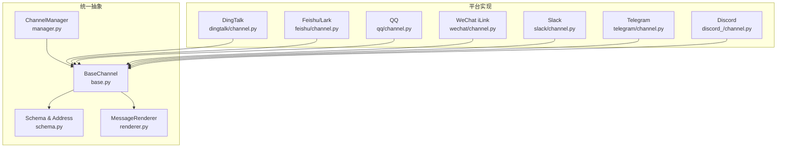
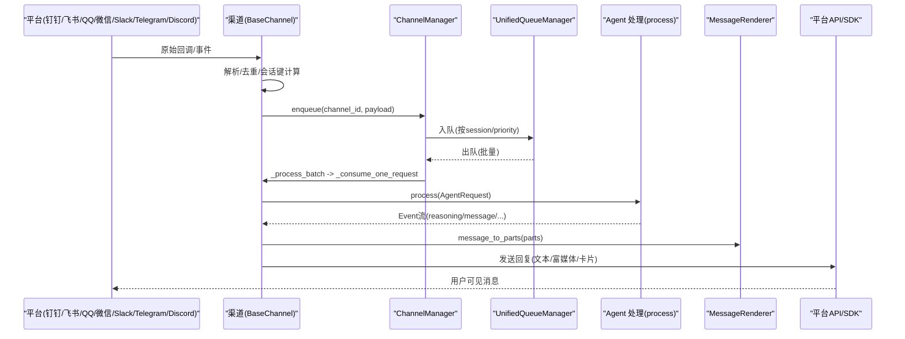
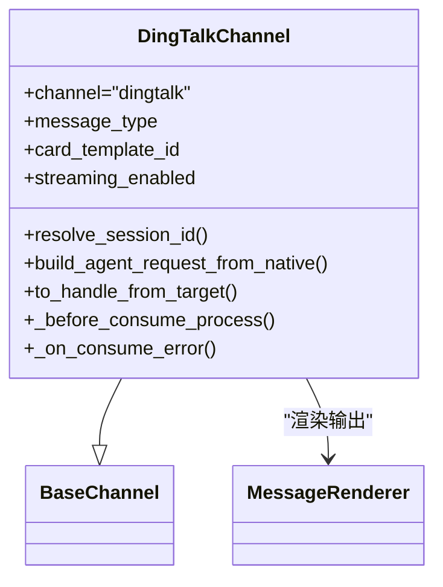
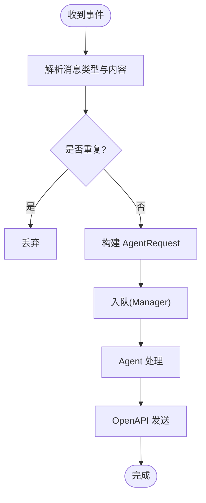
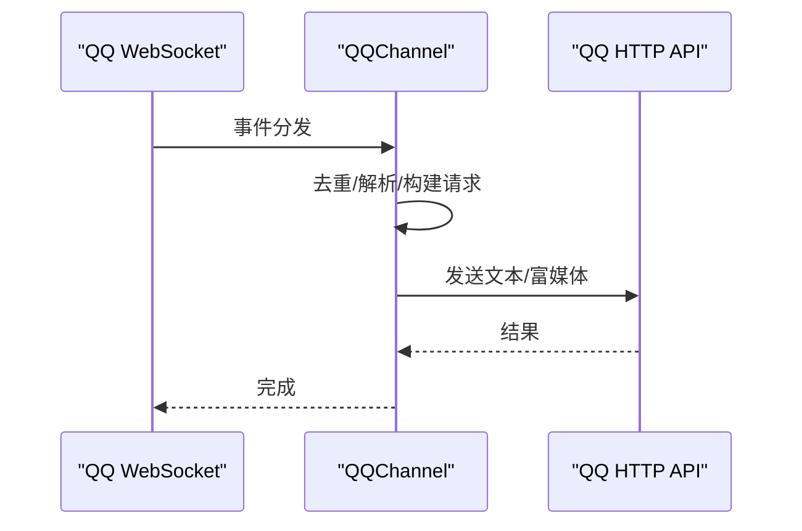
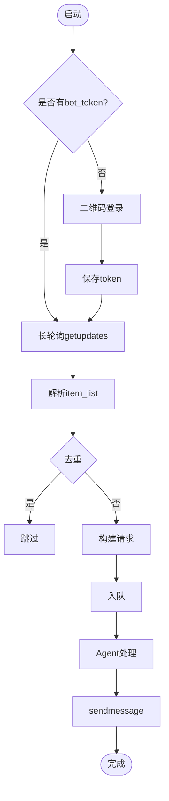
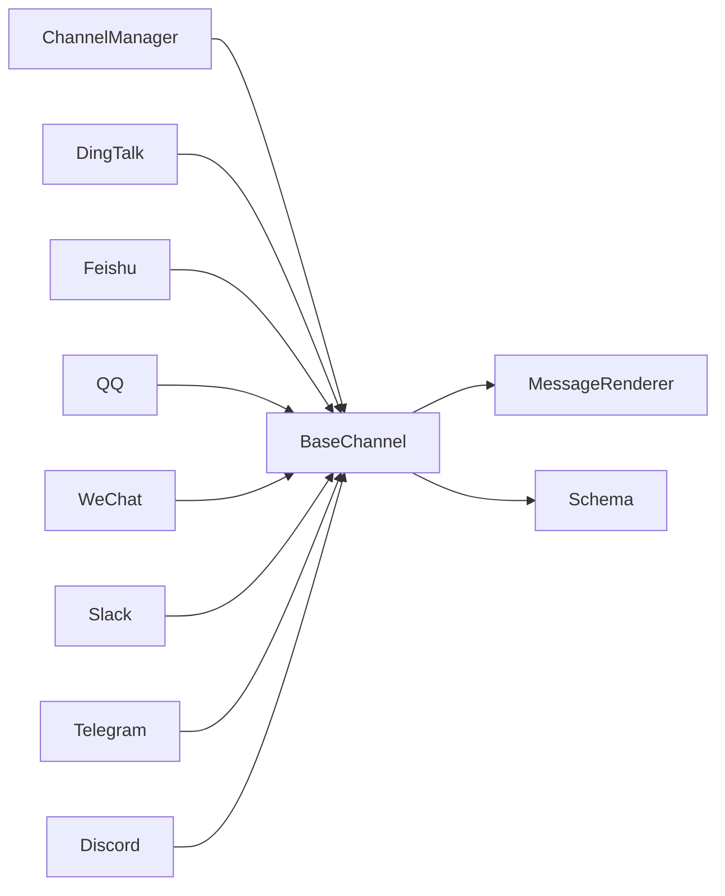

# 即时通讯渠道

<cite>
**本文引用的文件**   
- [src/qwenpaw/app/channels/__init__.py](file://src/qwenpaw/app/channels/__init__.py)
- [src/qwenpaw/app/channels/base.py](file://src/qwenpaw/app/channels/base.py)
- [src/qwenpaw/app/channels/manager.py](file://src/qwenpaw/app/channels/manager.py)
- [src/qwenpaw/app/channels/schema.py](file://src/qwenpaw/app/channels/schema.py)
- [src/qwenpaw/app/channels/renderer.py](file://src/qwenpaw/app/channels/renderer.py)
- [src/qwenpaw/app/channels/dingtalk/channel.py](file://src/qwenpaw/app/channels/dingtalk/channel.py)
- [src/qwenpaw/app/channels/feishu/channel.py](file://src/qwenpaw/app/channels/feishu/channel.py)
- [src/qwenpaw/app/channels/qq/channel.py](file://src/qwenpaw/app/channels/qq/channel.py)
- [src/qwenpaw/app/channels/wechat/channel.py](file://src/qwenpaw/app/channels/wechat/channel.py)
- [src/qwenpaw/app/channels/slack/channel.py](file://src/qwenpaw/app/channels/slack/channel.py)
- [src/qwenpaw/app/channels/telegram/channel.py](file://src/qwenpaw/app/channels/telegram/channel.py)
- [src/qwenpaw/app/channels/discord_/channel.py](file://src/qwenpaw/app/channels/discord_/channel.py)
</cite>

## 目录
1. [简介](#简介)
2. [项目结构](#项目结构)
3. [核心组件](#核心组件)
4. [架构总览](#架构总览)
5. [详细组件分析](#详细组件分析)
6. [依赖关系分析](#依赖关系分析)
7. [性能与稳定性](#性能与稳定性)
8. [故障排除指南](#故障排除指南)
9. [结论](#结论)
10. [附录：配置模板与最佳实践](#附录配置模板与最佳实践)

## 简介
本文件面向 QwenPaw 的“即时通讯渠道集成”，系统性梳理钉钉、飞书、QQ、微信（iLink Bot）、企业微信、Slack、Telegram、Discord 等主流平台的接入实现。文档覆盖统一抽象层设计、认证方式、消息格式转换、卡片渲染、富媒体支持、特殊功能适配、配置参数、错误处理策略与性能优化技巧，并提供渠道差异说明、配置模板与排障指南，帮助初学者快速上手，同时为资深开发者提供深入的技术细节。

## 项目结构
QwenPaw 的渠道子系统位于 src/qwenpaw/app/channels 下，采用“统一抽象 + 多平台实现”的分层组织：
- 统一抽象与基础设施
  - base.py：所有渠道的基类，定义消费流程、去重、流式分发、访问控制、渲染风格等通用能力。
  - manager.py：ChannelManager 负责队列管理、批量合并、任务追踪、健康检查与动态替换。
  - schema.py：渠道类型标识、路由地址 ChannelAddress、协议契约。
  - renderer.py：可插拔的消息渲染器，将内部内容模型转换为各渠道可发送的部件。
  - __init__.py：懒加载 ChannelManager，避免不必要的依赖拉取。
- 平台实现
  - dingtalk/feishu/qq/wechat/slack/telegram/discord_ 等子目录分别实现具体平台的能力与差异。

图表来源
- [src/qwenpaw/app/channels/base.py:80-170](file://src/qwenpaw/app/channels/base.py#L80-L170)
- [src/qwenpaw/app/channels/manager.py:68-112](file://src/qwenpaw/app/channels/manager.py#L68-L112)
- [src/qwenpaw/app/channels/schema.py:12-48](file://src/qwenpaw/app/channels/schema.py#L12-L48)
- [src/qwenpaw/app/channels/renderer.py:78-120](file://src/qwenpaw/app/channels/renderer.py#L78-L120)

章节来源
- [src/qwenpaw/app/channels/__init__.py:1-14](file://src/qwenpaw/app/channels/__init__.py#L1-L14)
- [src/qwenpaw/app/channels/base.py:80-170](file://src/qwenpaw/app/channels/base.py#L80-L170)
- [src/qwenpaw/app/channels/manager.py:68-112](file://src/qwenpaw/app/channels/manager.py#L68-L112)
- [src/qwenpaw/app/channels/schema.py:12-48](file://src/qwenpaw/app/channels/schema.py#L12-L48)
- [src/qwenpaw/app/channels/renderer.py:78-120](file://src/qwenpaw/app/channels/renderer.py#L78-L120)

## 核心组件
- BaseChannel
  - 职责：统一消息消费入口、会话去重、无文本内容防抖、流式事件分发、访问控制门控、渲染风格注入、工作区与命令注册表注入。
  - 关键能力：
    - 去重与合并：merge_native_items、merge_requests、get_debounce_key。
    - 流式分发：on_streaming_start/delta/end 钩子，按 reasoning/message 分流与节流。
    - 访问控制：白名单/黑名单/待审批，支持 DM/群组独立开关。
    - 渲染风格：RenderStyle 控制 markdown/emoji/代码块展示与工具输出过滤。
- ChannelManager
  - 职责：创建并管理各渠道实例；统一队列（UnifiedQueueManager）；批量合并；任务追踪与取消；健康检查；动态替换 channel。
  - 关键能力：from_env/from_config 构建；enqueue 线程安全入队；start_all/stop_all 生命周期；replace_channel 热替换。
- Schema
  - 职责：内置渠道类型集合、默认渠道、ChannelAddress 统一路由地址。
- MessageRenderer
  - 职责：将内部消息对象转换为可发送的内容部件（文本、图片、视频、音频、文件、拒绝提示），并按 RenderStyle 格式化工具调用与输出。

章节来源
- [src/qwenpaw/app/channels/base.py:80-170](file://src/qwenpaw/app/channels/base.py#L80-L170)
- [src/qwenpaw/app/channels/base.py:231-262](file://src/qwenpaw/app/channels/base.py#L231-L262)
- [src/qwenpaw/app/channels/base.py:379-451](file://src/qwenpaw/app/channels/base.py#L379-L451)
- [src/qwenpaw/app/channels/base.py:590-793](file://src/qwenpaw/app/channels/base.py#L590-L793)
- [src/qwenpaw/app/channels/manager.py:68-112](file://src/qwenpaw/app/channels/manager.py#L68-L112)
- [src/qwenpaw/app/channels/manager.py:364-473](file://src/qwenpaw/app/channels/manager.py#L364-L473)
- [src/qwenpaw/app/channels/schema.py:30-51](file://src/qwenpaw/app/channels/schema.py#L30-L51)
- [src/qwenpaw/app/channels/renderer.py:78-120](file://src/qwenpaw/app/channels/renderer.py#L78-L120)

## 架构总览
下图展示了从平台回调到 Agent 处理再到回复发送的整体流程，以及 ChannelManager 的统一队列与批处理机制。

图表来源
- [src/qwenpaw/app/channels/manager.py:39-66](file://src/qwenpaw/app/channels/manager.py#L39-L66)
- [src/qwenpaw/app/channels/base.py:529-585](file://src/qwenpaw/app/channels/base.py#L529-L585)
- [src/qwenpaw/app/channels/renderer.py:87-120](file://src/qwenpaw/app/channels/renderer.py#L87-L120)

## 详细组件分析

### 钉钉（DingTalk）
- 认证与连接
  - 使用 Stream 长连接接收事件；OpenAPI SDK 用于主动发送与卡片操作。
  - 支持自定义 endpoint，便于内网或代理环境。
- 消息格式与富媒体
  - 支持 Markdown 与 AI Card 两种模式；Card 模式支持流式更新。
  - 图片/文件通过 OpenAPI 上传与下载；本地 media_dir 缓存。
- 卡片渲染
  - 预创建 AI Card，在 on_streaming_* 钩子中增量更新；失败时回退到普通消息。
- 特殊功能
  - sessionWebhook 存储与持久化，支持定时任务与主动推送。
  - 群聊/私聊差异化 to_handle 路由；dedup 基于 message_id。
- 配置要点
  - 环境变量：DINGTALK_CLIENT_ID/SECRET、BOT_PREFIX、MESSAGE_TYPE(CARD/MARKDOWN)、STREAMING_ENABLED、CARD_TEMPLATE_ID/KEY、ENDPOINT 等。
  - from_config/from_env 双入口，支持 workspace_dir 隔离 media 与卡片状态。

图表来源
- [src/qwenpaw/app/channels/dingtalk/channel.py:107-200](file://src/qwenpaw/app/channels/dingtalk/channel.py#L107-L200)
- [src/qwenpaw/app/channels/base.py:80-170](file://src/qwenpaw/app/channels/base.py#L80-L170)
- [src/qwenpaw/app/channels/renderer.py:78-120](file://src/qwenpaw/app/channels/renderer.py#L78-L120)

章节来源
- [src/qwenpaw/app/channels/dingtalk/channel.py:107-200](file://src/qwenpaw/app/channels/dingtalk/channel.py#L107-L200)
- [src/qwenpaw/app/channels/dingtalk/channel.py:249-358](file://src/qwenpaw/app/channels/dingtalk/channel.py#L249-L358)
- [src/qwenpaw/app/channels/dingtalk/channel.py:364-430](file://src/qwenpaw/app/channels/dingtalk/channel.py#L364-L430)
- [src/qwenpaw/app/channels/dingtalk/channel.py:430-534](file://src/qwenpaw/app/channels/dingtalk/channel.py#L430-L534)

### 飞书（Feishu/Lark）
- 认证与连接
  - 使用 lark-oapi WebSocket 长连接接收事件；OpenAPI 发送消息。
  - 支持 feishu/lark 域名切换；自动校正服务器时间偏移。
- 消息格式与富媒体
  - 支持文本、图片、文件、音视频；交互式卡片由 cards 模块处理。
  - 群聊上下文包含 chat_id、message_id，用于下游去重与引用。
- 卡片渲染
  - 交互卡片收发逻辑封装在 FeishuCardHandler，统一处理 action.trigger。
- 特殊功能
  - 会话键短后缀化，兼容 cron 与主动推送；昵称缓存减少 Contact API 调用。
  - 旧消息丢弃阈值，防止重试风暴。

图表来源
- [src/qwenpaw/app/channels/feishu/channel.py:196-300](file://src/qwenpaw/app/channels/feishu/channel.py#L196-L300)
- [src/qwenpaw/app/channels/feishu/channel.py:385-443](file://src/qwenpaw/app/channels/feishu/channel.py#L385-L443)
- [src/qwenpaw/app/channels/feishu/channel.py:624-700](file://src/qwenpaw/app/channels/feishu/channel.py#L624-L700)

章节来源
- [src/qwenpaw/app/channels/feishu/channel.py:196-300](file://src/qwenpaw/app/channels/feishu/channel.py#L196-L300)
- [src/qwenpaw/app/channels/feishu/channel.py:300-383](file://src/qwenpaw/app/channels/feishu/channel.py#L300-L383)
- [src/qwenpaw/app/channels/feishu/channel.py:385-443](file://src/qwenpaw/app/channels/feishu/channel.py#L385-L443)
- [src/qwenpaw/app/channels/feishu/channel.py:624-700](file://src/qwenpaw/app/channels/feishu/channel.py#L624-L700)

### QQ
- 认证与连接
  - WebSocket 接收事件；HTTP API 发送；access_token 缓存与刷新。
  - 心跳控制器与指数退避重连；Windows 特定错误码恢复。
- 消息格式与富媒体
  - 支持 C2C、群聊、频道（Guild/DM）；富媒体上传/发送路径区分。
  - 文本 URL 清洗与 Markdown 回退策略，规避平台限制。
- 特殊功能
  - 严格去重（msg_seq/msg_id）；快速断开检测与限流保护。
  - 群聊/频道场景下的不同发送接口与字段要求。

图表来源
- [src/qwenpaw/app/channels/qq/channel.py:644-700](file://src/qwenpaw/app/channels/qq/channel.py#L644-L700)
- [src/qwenpaw/app/channels/qq/channel.py:714-790](file://src/qwenpaw/app/channels/qq/channel.py#L714-L790)
- [src/qwenpaw/app/channels/qq/channel.py:377-418](file://src/qwenpaw/app/channels/qq/channel.py#L377-L418)

章节来源
- [src/qwenpaw/app/channels/qq/channel.py:644-700](file://src/qwenpaw/app/channels/qq/channel.py#L644-L700)
- [src/qwenpaw/app/channels/qq/channel.py:714-790](file://src/qwenpaw/app/channels/qq/channel.py#L714-L790)
- [src/qwenpaw/app/channels/qq/channel.py:377-418](file://src/qwenpaw/app/channels/qq/channel.py#L377-L418)

### 微信（iLink Bot）
- 认证与登录
  - 优先使用 bot_token；若无则触发二维码登录，成功后持久化 token。
  - 支持 base_url 覆盖，适配不同部署环境。
- 消息格式与富媒体
  - 长轮询 getupdates 获取消息；支持文本、图片（AES 解密）、语音（ASR 文本）、文件。
  - 内容去重（context_token + 文本指纹）避免重复处理。
- 特殊功能
  - 打字指示器（typing tickets）与消息合并缓冲，缓解上下文 token 限制。
  - 单会话合并缓冲，降低频繁小消息对 LLM 的影响。

图表来源
- [src/qwenpaw/app/channels/wechat/channel.py:64-140](file://src/qwenpaw/app/channels/wechat/channel.py#L64-L140)
- [src/qwenpaw/app/channels/wechat/channel.py:486-526](file://src/qwenpaw/app/channels/wechat/channel.py#L486-L526)
- [src/qwenpaw/app/channels/wechat/channel.py:531-624](file://src/qwenpaw/app/channels/wechat/channel.py#L531-L624)
- [src/qwenpaw/app/channels/wechat/channel.py:629-700](file://src/qwenpaw/app/channels/wechat/channel.py#L629-L700)

章节来源
- [src/qwenpaw/app/channels/wechat/channel.py:64-140](file://src/qwenpaw/app/channels/wechat/channel.py#L64-L140)
- [src/qwenpaw/app/channels/wechat/channel.py:486-526](file://src/qwenpaw/app/channels/wechat/channel.py#L486-L526)
- [src/qwenpaw/app/channels/wechat/channel.py:531-624](file://src/qwenpaw/app/channels/wechat/channel.py#L531-L624)
- [src/qwenpaw/app/channels/wechat/channel.py:629-700](file://src/qwenpaw/app/channels/wechat/channel.py#L629-L700)

### Slack
- 认证与连接
  - 使用官方 SDK 建立 Socket Mode 或 Webhook 连接；OAuth 应用权限管理。
- 消息格式与富媒体
  - 支持 Blocks 与 Rich Text；图片/文件通过 Files API 上传与分享。
- 特殊功能
  - Slash Commands 与 Interactive Components 处理；消息去重与会话路由。

章节来源
- [src/qwenpaw/app/channels/slack/channel.py:1-120](file://src/qwenpaw/app/channels/slack/channel.py#L1-L120)

### Telegram
- 认证与连接
  - 使用 python-telegram-bot 或 aiogram 建立长连接；Bot Token 鉴权。
- 消息格式与富媒体
  - 支持 MarkdownV2/HTML 解析；图片/视频/文件/音频上传与发送。
- 特殊功能
  - Inline Keyboard 与 Callback Query 处理；群组 @mention 与命令路由。

章节来源
- [src/qwenpaw/app/channels/telegram/channel.py:1-120](file://src/qwenpaw/app/channels/telegram/channel.py#L1-L120)

### Discord
- 认证与连接
  - 使用 discord.py 或 discord-interactions 建立 Gateway 连接；Bot Token 鉴权。
- 消息格式与富媒体
  - Embeds 与 Components；附件上传与链接预览。
- 特殊功能
  - Slash Commands 与 Button/SelectMenu 交互；频道与角色权限控制。

章节来源
- [src/qwenpaw/app/channels/discord_/channel.py:1-120](file://src/qwenpaw/app/channels/discord_/channel.py#L1-L120)

### 企业微信（WeCom）
- 认证与连接
  - 使用企业微信开放接口；自建应用或机器人回调。
- 消息格式与富媒体
  - 支持文本、图片、文件、语音；卡片消息通过 JSON 模板渲染。
- 特殊功能
  - 部门/成员权限与回调签名校验；群组与私聊差异化路由。

章节来源
- [src/qwenpaw/app/channels/wecom/channel.py:1-120](file://src/qwenpaw/app/channels/wecom/channel.py#L1-L120)

## 依赖关系分析
- 组件耦合
  - BaseChannel 被所有平台实现继承，形成强内聚；ChannelManager 作为编排者，低耦合地管理各渠道实例。
  - MessageRenderer 与 RenderStyle 解耦平台差异，集中处理工具输出与富媒体转换。
- 外部依赖
  - 钉钉：dingtalk_stream、alibabacloud_dingtalk_*。
  - 飞书：lark_oapi。
  - QQ：aiohttp、WebSocket 客户端。
  - 微信：ILinkClient（HTTP 长轮询）。
  - Slack/Telegram/Discord：各自官方 SDK。
- 潜在循环依赖
  - 通过懒加载与 Protocol 契约避免循环导入；__init__.py 仅暴露 ChannelManager 懒加载。

图表来源
- [src/qwenpaw/app/channels/__init__.py:7-13](file://src/qwenpaw/app/channels/__init__.py#L7-L13)
- [src/qwenpaw/app/channels/base.py:80-170](file://src/qwenpaw/app/channels/base.py#L80-L170)
- [src/qwenpaw/app/channels/manager.py:68-112](file://src/qwenpaw/app/channels/manager.py#L68-L112)

章节来源
- [src/qwenpaw/app/channels/__init__.py:7-13](file://src/qwenpaw/app/channels/__init__.py#L7-L13)
- [src/qwenpaw/app/channels/base.py:80-170](file://src/qwenpaw/app/channels/base.py#L80-L170)
- [src/qwenpaw/app/channels/manager.py:68-112](file://src/qwenpaw/app/channels/manager.py#L68-L112)

## 性能与稳定性
- 队列与批处理
  - UnifiedQueueManager 按 (channel, session, priority) 分桶，消费者批量出队并合并，降低高频消息抖动。
- 流式节流
  - BaseChannel 的 _STREAM_DELTA_MIN_INTERVAL_S 与 flush 超时保护，避免频繁网络调用。
- 去重与容错
  - 各平台实现均具备消息去重（message_id/context_token）与重试/退避策略；异常路径回退到文本或表情反馈。
- 资源隔离
  - workspace_dir 隔离 media 与状态文件；media_dir 按需创建与清理。

章节来源
- [src/qwenpaw/app/channels/manager.py:377-473](file://src/qwenpaw/app/channels/manager.py#L377-L473)
- [src/qwenpaw/app/channels/base.py:586-793](file://src/qwenpaw/app/channels/base.py#L586-L793)
- [src/qwenpaw/app/channels/dingtalk/channel.py:236-248](file://src/qwenpaw/app/channels/dingtalk/channel.py#L236-L248)
- [src/qwenpaw/app/channels/feishu/channel.py:279-300](file://src/qwenpaw/app/channels/feishu/channel.py#L279-L300)
- [src/qwenpaw/app/channels/qq/channel.py:150-198](file://src/qwenpaw/app/channels/qq/channel.py#L150-L198)
- [src/qwenpaw/app/channels/wechat/channel.py:135-176](file://src/qwenpaw/app/channels/wechat/channel.py#L135-L176)

## 故障排除指南
- 常见问题定位
  - 无法接收消息：检查平台回调/Socket 连接状态与鉴权；查看 ChannelManager 日志中的 start_all 与 enqueue 记录。
  - 消息重复：确认平台去重键（message_id/context_token）是否正确设置；观察 BaseChannel 的去重与合并逻辑。
  - 富媒体失败：检查 media_dir 权限与平台上传接口返回；关注 QQ/微信的加密与下载流程。
  - 卡片不更新：钉钉 Card 模式需启用 streaming_enabled；检查预创建卡片与 on_streaming_* 钩子执行。
- 诊断建议
  - 使用 health_check 与 restart_channel 进行在线诊断与热修复。
  - 开启调试日志，关注 _process_batch、_consume_queue、_on_message 等关键路径。
  - 针对平台特有错误码（如 QQ 的 URL 限制、Markdown 不支持）启用回退策略。

章节来源
- [src/qwenpaw/app/channels/manager.py:579-608](file://src/qwenpaw/app/channels/manager.py#L579-L608)
- [src/qwenpaw/app/channels/manager.py:610-695](file://src/qwenpaw/app/channels/manager.py#L610-L695)
- [src/qwenpaw/app/channels/dingtalk/channel.py:497-534](file://src/qwenpaw/app/channels/dingtalk/channel.py#L497-L534)
- [src/qwenpaw/app/channels/qq/channel.py:216-283](file://src/qwenpaw/app/channels/qq/channel.py#L216-L283)
- [src/qwenpaw/app/channels/wechat/channel.py:453-481](file://src/qwenpaw/app/channels/wechat/channel.py#L453-L481)

## 结论
QwenPaw 的渠道子系统通过统一的 BaseChannel 与 ChannelManager 实现了跨平台的一致性与可扩展性。各平台在认证、消息格式、富媒体与卡片渲染上存在差异，但通过渲染器与协议契约有效收敛了复杂度。结合队列批处理、流式节流与去重策略，系统在性能与稳定性方面具备良好表现。建议在生产环境中合理配置 media_dir、workspace_dir 与平台专属参数，并结合健康检查与日志进行持续监控与排障。

## 附录：配置模板与最佳实践
- 通用配置项（适用于多数渠道）
  - enabled：是否启用该渠道。
  - dm_policy/group_policy：DM/群组访问策略（open/closed）。
  - allow_from：允许列表（白名单）。
  - deny_message：拒绝时的提示信息。
  - require_mention：群组是否需要 @机器人。
  - show_tool_details/filter_tool_messages/filter_thinking：工具输出与思考过程展示控制。
  - no_text_debounce：无文本内容的防抖策略。
  - access_control_dm/access_control_group：访问控制开关。
- 平台专属示例（以环境变量为例）
  - 钉钉
    - DINGTALK_CHANNEL_ENABLED=1
    - DINGTALK_CLIENT_ID=...
    - DINGTALK_CLIENT_SECRET=...
    - DINGTALK_BOT_PREFIX=...
    - DINGTALK_MESSAGE_TYPE=card
    - DINGTALK_STREAMING_ENABLED=1
    - DINGTALK_CARD_TEMPLATE_ID=...
    - DINGTALK_ENDPOINT=...
  - 飞书
    - FEISHU_CHANNEL_ENABLED=1
    - FEISHU_APP_ID=...
    - FEISHU_APP_SECRET=...
    - FEISHU_DOMAIN=lark
    - FEISHU_STREAMING_ENABLED=1
    - FEISHU_SHARE_SESSION_IN_GROUP=1
  - QQ
    - QQ_API_BASE=https://sandbox.api.sgroup.qq.com
    - QQ_APP_ID=...
    - QQ_CLIENT_SECRET=...
    - QQ_MARKDOWN_ENABLED=1
  - 微信（iLink）
    - WECHAT_CHANNEL_ENABLED=1
    - WECHAT_BOT_TOKEN=...
    - WECHAT_BOT_TOKEN_FILE=~/.qwenpaw/wechat_bot_token
    - WECHAT_BASE_URL=...
    - WECHAT_MESSAGE_MERGE_ENABLED=1
    - WECHAT_MESSAGE_MERGE_DELAY_MS=500
- 最佳实践
  - 使用 workspace_dir 隔离多工作区状态与媒体文件。
  - 合理设置 no_text_debounce 与 message_merge_delay_ms，平衡实时性与 LLM 负载。
  - 启用 streaming_enabled 与 card 模式以获得更好的用户体验（尤其钉钉/飞书）。
  - 定期清理 media_dir 与过期 token 文件，避免磁盘增长。
  - 结合 health_check 与 restart_channel 进行运维自动化。

章节来源
- [src/qwenpaw/app/channels/base.py:121-170](file://src/qwenpaw/app/channels/base.py#L121-L170)
- [src/qwenpaw/app/channels/dingtalk/channel.py:249-358](file://src/qwenpaw/app/channels/dingtalk/channel.py#L249-L358)
- [src/qwenpaw/app/channels/feishu/channel.py:300-383](file://src/qwenpaw/app/channels/feishu/channel.py#L300-L383)
- [src/qwenpaw/app/channels/qq/channel.py:796-800](file://src/qwenpaw/app/channels/qq/channel.py#L796-L800)
- [src/qwenpaw/app/channels/wechat/channel.py:221-295](file://src/qwenpaw/app/channels/wechat/channel.py#L221-L295)