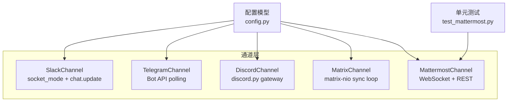
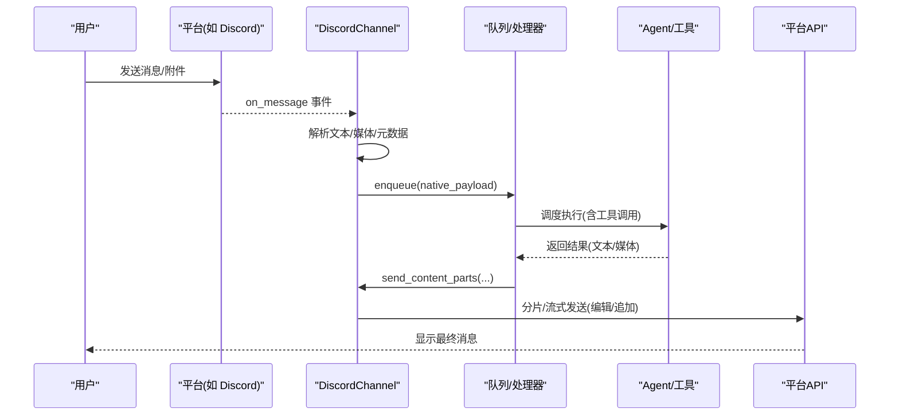
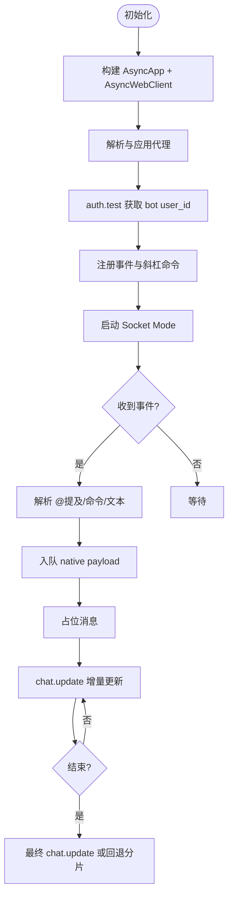
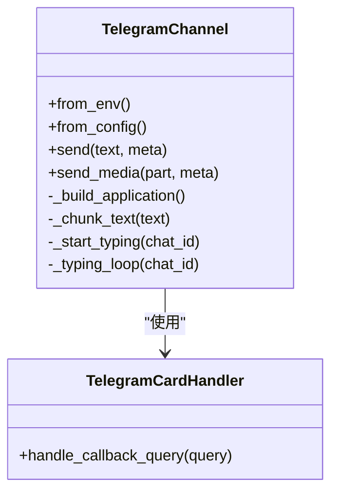
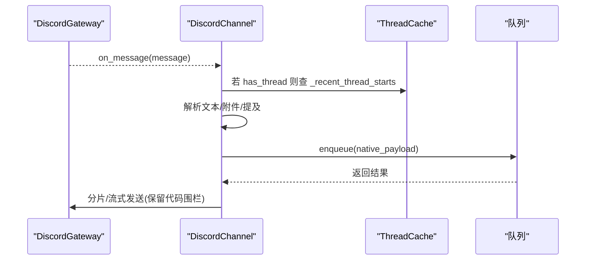
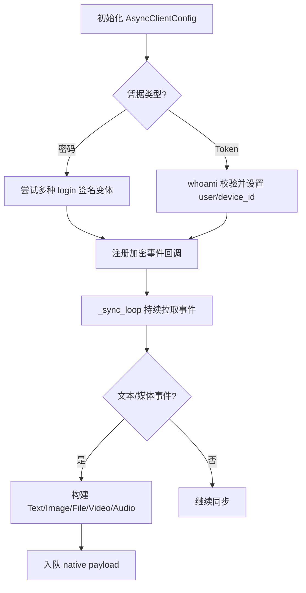
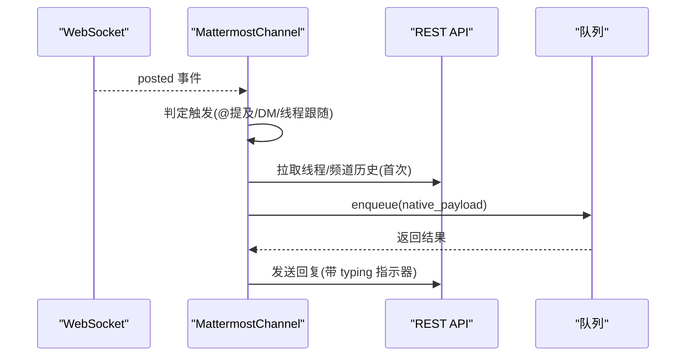
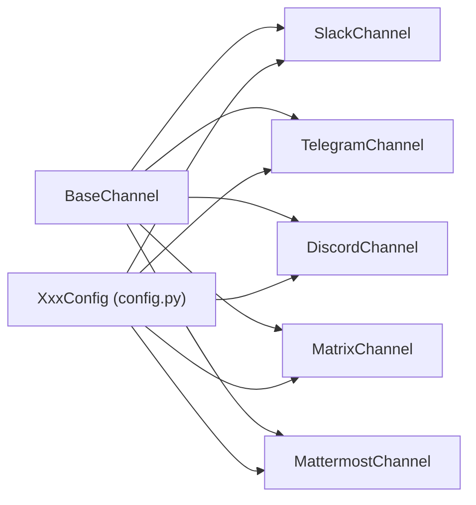

# 国际通讯渠道

<cite>
**本文引用的文件**   
- [src/qwenpaw/app/channels/slack/channel.py](file://src/qwenpaw/app/channels/slack/channel.py)
- [src/qwenpaw/app/channels/telegram/channel.py](file://src/qwenpaw/app/channels/telegram/channel.py)
- [src/qwenpaw/app/channels/discord_/channel.py](file://src/qwenpaw/app/channels/discord_/channel.py)
- [src/qwenpaw/app/channels/matrix/channel.py](file://src/qwenpaw/app/channels/matrix/channel.py)
- [src/qwenpaw/app/channels/mattermost/channel.py](file://src/qwenpaw/app/channels/mattermost/channel.py)
- [src/qwenpaw/config/config.py](file://src/qwenpaw/config/config.py)
- [tests/unit/channels/test_mattermost.py](file://tests/unit/channels/test_mattermost.py)
</cite>

## 目录
1. [简介](#简介)
2. [项目结构](#项目结构)
3. [核心组件](#核心组件)
4. [架构总览](#架构总览)
5. [详细组件分析](#详细组件分析)
6. [依赖关系分析](#依赖关系分析)
7. [性能与速率限制](#性能与速率限制)
8. [故障排查指南](#故障排查指南)
9. [结论](#结论)
10. [附录](#附录)

## 简介
本文件聚焦于 QwenPaw 在国际主流通讯平台的接入实现，覆盖 Slack、Telegram、Discord、Matrix 和 Mattermost。文档从 Bot 框架使用、消息格式转换、命令系统、插件生态集成、卡片消息与交互式组件、文件上传、多语言支持、SDK 使用示例、OAuth 配置、权限管理与速率限制等维度进行系统化说明，并提供跨平台兼容性建议与最佳实践。

## 项目结构
QwenPaw 的通道（Channel）子系统位于 src/qwenpaw/app/channels 下，每个平台以独立子模块组织，包含 channel.py 作为主实现，以及可选的 cards、format、handler 等辅助模块。配置集中在 src/qwenpaw/config/config.py 中，各平台 ChannelConfig 定义了环境变量与配置文件字段。

图表来源
- [src/qwenpaw/app/channels/slack/channel.py:1-120](file://src/qwenpaw/app/channels/slack/channel.py#L1-L120)
- [src/qwenpaw/app/channels/telegram/channel.py:1-120](file://src/qwenpaw/app/channels/telegram/channel.py#L1-L120)
- [src/qwenpaw/app/channels/discord_/channel.py:1-120](file://src/qwenpaw/app/channels/discord_/channel.py#L1-L120)
- [src/qwenpaw/app/channels/matrix/channel.py:1-120](file://src/qwenpaw/app/channels/matrix/channel.py#L1-L120)
- [src/qwenpaw/app/channels/mattermost/channel.py:1-120](file://src/qwenpaw/app/channels/mattermost/channel.py#L1-L120)
- [src/qwenpaw/config/config.py:355-522](file://src/qwenpaw/config/config.py#L355-L522)
- [tests/unit/channels/test_mattermost.py:232-368](file://tests/unit/channels/test_mattermost.py#L232-L368)

章节来源
- [src/qwenpaw/config/config.py:355-522](file://src/qwenpaw/config/config.py#L355-L522)

## 核心组件
- 统一抽象：所有平台均继承 BaseChannel，提供一致的 send/send_content_parts、生命周期 start/stop、健康检查 health_check、会话路由 resolve_session_id 等接口。
- 配置模型：通过 config.py 中的 XxxConfig 类集中管理各平台参数，支持 from_config/from_env 工厂方法。
- 事件驱动：各平台通过各自 SDK 的事件循环接收消息，解析为统一的 content_parts 并入队至上层处理。
- 流式输出：Slack/Telegram/Discord/Matrix 支持占位消息+原地更新或分片发送；Mattermost 侧重线程上下文补全。
- 媒体与附件：统一下载与分类（图片/视频/音频/文件），按平台能力发送。
- 访问控制：DM/群组策略、白名单、@提及触发、线程跟随等。

章节来源
- [src/qwenpaw/app/channels/slack/channel.py:112-199](file://src/qwenpaw/app/channels/slack/channel.py#L112-L199)
- [src/qwenpaw/app/channels/telegram/channel.py:300-384](file://src/qwenpaw/app/channels/telegram/channel.py#L300-L384)
- [src/qwenpaw/app/channels/discord_/channel.py:46-122](file://src/qwenpaw/app/channels/discord_/channel.py#L46-L122)
- [src/qwenpaw/app/channels/matrix/channel.py:175-256](file://src/qwenpaw/app/channels/matrix/channel.py#L175-L256)
- [src/qwenpaw/app/channels/mattermost/channel.py:75-171](file://src/qwenpaw/app/channels/mattermost/channel.py#L75-L171)

## 架构总览
下图展示一个典型的消息处理流程：平台事件 → 通道解析 → 内容标准化 → 入队 → 代理执行 → 流式/分片回复。

图表来源
- [src/qwenpaw/app/channels/discord_/channel.py:143-314](file://src/qwenpaw/app/channels/discord_/channel.py#L143-L314)
- [src/qwenpaw/app/channels/telegram/channel.py:434-498](file://src/qwenpaw/app/channels/telegram/channel.py#L434-L498)
- [src/qwenpaw/app/channels/slack/channel.py:342-365](file://src/qwenpaw/app/channels/slack/channel.py#L342-L365)
- [src/qwenpaw/app/channels/matrix/channel.py:632-696](file://src/qwenpaw/app/channels/matrix/channel.py#L632-L696)
- [src/qwenpaw/app/channels/mattermost/channel.py:396-412](file://src/qwenpaw/app/channels/mattermost/channel.py#L396-L412)

## 详细组件分析

### Slack 通道
- 连接模式：Socket Mode（WebSocket），无需公网回调地址；REST 使用 AsyncWebClient。
- 流式输出：on_streaming_start/delta/end 通过 chat.postMessage/chat.update 原地更新；超长文本回退到分片发送。
- 命令系统：注册通配斜杠命令，将 /name args 转换为内部命令并入队。
- 代理与重连：支持 proxy 配置；Socket Mode 异常时指数退避重连，非可恢复认证错误直接停止。
- 媒体与附件：通过 sender 模块发送；本地 media_dir 缓存。
- 安全与权限：@提及检测、DM/群组策略、白名单、deny_message。

图表来源
- [src/qwenpaw/app/channels/slack/channel.py:319-365](file://src/qwenpaw/app/channels/slack/channel.py#L319-L365)
- [src/qwenpaw/app/channels/slack/channel.py:608-764](file://src/qwenpaw/app/channels/slack/channel.py#L608-L764)
- [src/qwenpaw/app/channels/slack/channel.py:441-541](file://src/qwenpaw/app/channels/slack/channel.py#L441-L541)

章节来源
- [src/qwenpaw/app/channels/slack/channel.py:112-199](file://src/qwenpaw/app/channels/slack/channel.py#L112-L199)
- [src/qwenpaw/app/channels/slack/channel.py:319-365](file://src/qwenpaw/app/channels/slack/channel.py#L319-L365)
- [src/qwenpaw/app/channels/slack/channel.py:608-764](file://src/qwenpaw/app/channels/slack/channel.py#L608-L764)
- [src/qwenpaw/app/channels/slack/channel.py:441-541](file://src/qwenpaw/app/channels/slack/channel.py#L441-L541)

### Telegram 通道
- 连接模式：Bot API 轮询（getUpdates），支持自定义 base_url 与 HTTP 代理（含认证）。
- 消息解析：识别 bot_command 与 @mention，自动清理 @用户名；支持图片/视频/语音/文件等多媒体。
- 流式输出：editMessageText 原地更新，间隔节流；超长文本分片发送。
- 交互组件：集成卡片处理器（工具守卫审批按钮）通过 CallbackQueryHandler 处理。
- 重连策略：冲突/网络错误分别采用不同退避上限；优雅关闭。
- 权限控制：DM/群组策略、@提及触发、白名单。

图表来源
- [src/qwenpaw/app/channels/telegram/channel.py:300-384](file://src/qwenpaw/app/channels/telegram/channel.py#L300-L384)
- [src/qwenpaw/app/channels/telegram/channel.py:434-498](file://src/qwenpaw/app/channels/telegram/channel.py#L434-L498)
- [src/qwenpaw/app/channels/telegram/channel.py:667-737](file://src/qwenpaw/app/channels/telegram/channel.py#L667-L737)

章节来源
- [src/qwenpaw/app/channels/telegram/channel.py:300-384](file://src/qwenpaw/app/channels/telegram/channel.py#L300-L384)
- [src/qwenpaw/app/channels/telegram/channel.py:434-498](file://src/qwenpaw/app/channels/telegram/channel.py#L434-L498)
- [src/qwenpaw/app/channels/telegram/channel.py:667-737](file://src/qwenpaw/app/channels/telegram/channel.py#L667-L737)

### Discord 通道
- 连接模式：discord.py Gateway，启用 message_content 等 intents。
- 消息解析：去重最近消息 ID；支持 @提及与角色提及；自动清理提及标签；附件分类（图/视/音/文件）。
- 线程处理：on_thread_create 缓存 starter_message_id -> thread_id，避免竞态导致 session 路由错误。
- 流式输出：占位“...”并通过 edit 或分片发送；文本按 2000 字符切分，保持代码块围栏完整。
- 健康检查：判断 client.is_ready() 与任务存活状态。
- 权限控制：DM/群组策略、@提及触发、白名单、是否接受其他机器人消息。

图表来源
- [src/qwenpaw/app/channels/discord_/channel.py:143-314](file://src/qwenpaw/app/channels/discord_/channel.py#L143-L314)
- [src/qwenpaw/app/channels/discord_/channel.py:315-335](file://src/qwenpaw/app/channels/discord_/channel.py#L315-L335)
- [src/qwenpaw/app/channels/discord_/channel.py:501-574](file://src/qwenpaw/app/channels/discord_/channel.py#L501-L574)

章节来源
- [src/qwenpaw/app/channels/discord_/channel.py:46-122](file://src/qwenpaw/app/channels/discord_/channel.py#L46-L122)
- [src/qwenpaw/app/channels/discord_/channel.py:143-314](file://src/qwenpaw/app/channels/discord_/channel.py#L143-L314)
- [src/qwenpaw/app/channels/discord_/channel.py:315-335](file://src/qwenpaw/app/channels/discord_/channel.py#L315-L335)
- [src/qwenpaw/app/channels/discord_/channel.py:501-574](file://src/qwenpaw/app/channels/discord_/channel.py#L501-L574)

### Matrix 通道
- 连接模式：matrix-nio 长轮询同步（sync loop），支持 E2EE（olm）与 to-device 事件。
- 登录方式：密码登录（兼容不同 nio 版本签名）、access_token 登录（whoami 校验），设备名/设备 ID 持久化。
- 历史上下文：room 历史缓冲，首次触达拉取最近 N 条；当前消息与历史用标记分隔，便于 Agent 解析。
- 流式输出：占位“...”与原地更新；Markdown→HTML 渲染（markdown-it-py）。
- 权限控制：DM/群组禁用开关、每房间 groups 覆盖、vision_enabled 控制图片 URL 暴露。
- 健康检查：客户端连接、token 存在性。

图表来源
- [src/qwenpaw/app/channels/matrix/channel.py:346-456](file://src/qwenpaw/app/channels/matrix/channel.py#L346-L456)
- [src/qwenpaw/app/channels/matrix/channel.py:457-534](file://src/qwenpaw/app/channels/matrix/channel.py#L457-L534)
- [src/qwenpaw/app/channels/matrix/channel.py:536-630](file://src/qwenpaw/app/channels/matrix/channel.py#L536-L630)
- [src/qwenpaw/app/channels/matrix/channel.py:632-696](file://src/qwenpaw/app/channels/matrix/channel.py#L632-L696)

章节来源
- [src/qwenpaw/app/channels/matrix/channel.py:175-256](file://src/qwenpaw/app/channels/matrix/channel.py#L175-L256)
- [src/qwenpaw/app/channels/matrix/channel.py:346-456](file://src/qwenpaw/app/channels/matrix/channel.py#L346-L456)
- [src/qwenpaw/app/channels/matrix/channel.py:457-534](file://src/qwenpaw/app/channels/matrix/channel.py#L457-L534)
- [src/qwenpaw/app/channels/matrix/channel.py:536-630](file://src/qwenpaw/app/channels/matrix/channel.py#L536-L630)
- [src/qwenpaw/app/channels/matrix/channel.py:632-696](file://src/qwenpaw/app/channels/matrix/channel.py#L632-L696)

### Mattermost 通道
- 连接模式：WebSocket 事件监听 + REST API 回复；首次启动拉取 /api/v4/users/me 验证身份。
- 会话模型：DM 以 mm_channel_id 为键；群组/频道以 root_id（线程根）为键。
- 上下文补全：首次 DM 拉取频道历史；线程内根据上次 Bot 回复位置计算“未处理”消息片段。
- 附件处理：stream 下载并按后缀分类（图片/文件等）。
- 健康检查：WebSocket 任务存活 + bot_id 已解析。
- 测试覆盖：单元测试覆盖初始化、工厂方法、HTTP 交互、会话路由、发送、文件上传下载、历史拉取、打字指示器、生命周期、ACL 检查等。

图表来源
- [src/qwenpaw/app/channels/mattermost/channel.py:353-412](file://src/qwenpaw/app/channels/mattermost/channel.py#L353-L412)
- [src/qwenpaw/app/channels/mattermost/channel.py:417-476](file://src/qwenpaw/app/channels/mattermost/channel.py#L417-L476)
- [src/qwenpaw/app/channels/mattermost/channel.py:516-611](file://src/qwenpaw/app/channels/mattermost/channel.py#L516-L611)
- [tests/unit/channels/test_mattermost.py:232-368](file://tests/unit/channels/test_mattermost.py#L232-L368)

章节来源
- [src/qwenpaw/app/channels/mattermost/channel.py:75-171](file://src/qwenpaw/app/channels/mattermost/channel.py#L75-L171)
- [src/qwenpaw/app/channels/mattermost/channel.py:353-412](file://src/qwenpaw/app/channels/mattermost/channel.py#L353-L412)
- [src/qwenpaw/app/channels/mattermost/channel.py:516-611](file://src/qwenpaw/app/channels/mattermost/channel.py#L516-L611)
- [tests/unit/channels/test_mattermost.py:232-368](file://tests/unit/channels/test_mattermost.py#L232-L368)

## 依赖关系分析
- 外部 SDK 依赖
  - Slack: slack_bolt (AsyncApp, AsyncSocketModeHandler), slack_sdk.web.AsyncWebClient
  - Telegram: python-telegram-bot (Application, MessageHandler, CallbackQueryHandler)
  - Discord: discord.py (Client, Intents), aiohttp
  - Matrix: matrix-nio (AsyncClient, 各类事件类型), httpx
  - Mattermost: websockets, httpx
- 内部依赖
  - BaseChannel 抽象与统一消息 schema（TextContent/ImageContent/...）
  - config.py 中各平台 XxxConfig 提供统一配置入口
  - utils 提供 file_url_to_local_path 等通用工具

图表来源
- [src/qwenpaw/config/config.py:355-522](file://src/qwenpaw/config/config.py#L355-L522)
- [src/qwenpaw/app/channels/slack/channel.py:112-199](file://src/qwenpaw/app/channels/slack/channel.py#L112-L199)
- [src/qwenpaw/app/channels/telegram/channel.py:300-384](file://src/qwenpaw/app/channels/telegram/channel.py#L300-L384)
- [src/qwenpaw/app/channels/discord_/channel.py:46-122](file://src/qwenpaw/app/channels/discord_/channel.py#L46-L122)
- [src/qwenpaw/app/channels/matrix/channel.py:175-256](file://src/qwenpaw/app/channels/matrix/channel.py#L175-L256)
- [src/qwenpaw/app/channels/mattermost/channel.py:75-171](file://src/qwenpaw/app/channels/mattermost/channel.py#L75-L171)

章节来源
- [src/qwenpaw/config/config.py:355-522](file://src/qwenpaw/config/config.py#L355-L522)

## 性能与速率限制
- 流式更新节流
  - Slack：最小 delta 间隔约 1.5s，超长文本回退分片。
  - Telegram：editMessageText 节流约 1.5s，分片大小 4000 字符。
  - Discord：delta 间隔约 1.0s，分片 2000 字符且保持代码围栏。
  - Matrix：delta 间隔约 1.0s，占位“...”原地更新。
- 重连与退避
  - Slack：Socket Mode 异常指数退避，最大尝试次数限制，非可恢复认证错误停止。
  - Telegram：冲突与网络错误分别设定退避上限，优雅关闭。
  - Mattermost：WebSocket 指数退避（上限 60s）。
- 资源与并发
  - 打字指示器任务按会话隔离，超时取消。
  - 附件下载流式写入，避免内存峰值。
- 速率限制建议
  - 合理设置 streaming_enabled 与 delta 间隔。
  - 对高频群聊开启去抖与限流。
  - 大文件上传前做大小校验与重试。

[本节为通用指导，不直接分析具体文件]

## 故障排查指南
- 认证失败
  - Slack：检测不可恢复错误集合（invalid_auth/token_expired 等），需人工更新 token。
  - Matrix：whoami 校验失败或 device_id 缺失导致 E2EE 降级。
  - Mattermost：/users/me 返回非 200 检查 bot_token。
- 连接问题
  - Telegram：冲突错误提示“terminated by other getupdates request”，需单实例运行。
  - Discord：client.is_ready() 未就绪，检查网关连接。
  - Matrix：olm 未安装导致 E2EE 禁用。
- 权限与触发
  - 确认 @提及/角色提及/线程跟随策略是否正确。
  - DM/群组策略与白名单是否拦截。
- 附件与媒体
  - 下载失败日志定位 URL/路径/权限问题。
  - 超大文件超过平台限制的处理与回退。

章节来源
- [src/qwenpaw/app/channels/slack/channel.py:83-107](file://src/qwenpaw/app/channels/slack/channel.py#L83-L107)
- [src/qwenpaw/app/channels/matrix/channel.py:418-433](file://src/qwenpaw/app/channels/matrix/channel.py#L418-L433)
- [src/qwenpaw/app/channels/mattermost/channel.py:331-351](file://src/qwenpaw/app/channels/mattermost/channel.py#L331-L351)
- [src/qwenpaw/app/channels/telegram/channel.py:500-582](file://src/qwenpaw/app/channels/telegram/channel.py#L500-L582)
- [src/qwenpaw/app/channels/discord_/channel.py:721-754](file://src/qwenpaw/app/channels/discord_/channel.py#L721-L754)

## 结论
QwenPaw 通过统一的 BaseChannel 抽象与各平台 SDK 的深度适配，实现了跨平台的一致体验：稳定的事件驱动、健壮的流式输出、完善的媒体支持与灵活的权限控制。针对各平台的特性（如 Slack 的 Socket Mode、Telegram 的轮询与卡片、Discord 的线程与附件、Matrix 的 E2EE 与历史上下文、Mattermost 的 WebSocket+REST），提供了针对性的优化与容错机制。建议在部署时关注速率限制、重连策略与权限配置，以获得稳定高效的国际通讯集成。

[本节为总结，不直接分析具体文件]

## 附录

### 配置与环境变量要点
- 各平台 XxxConfig 在 config.py 中定义，支持 from_config/from_env 两种构造方式。
- 关键字段包括：enabled、bot_token/app_token、proxy/base_url、dm_policy/group_policy、allow_from、deny_message、streaming_enabled、media_dir 等。
- Matrix 额外支持 encryption、history_limit、sync_timeout_ms、vision_enabled、outbound_structured_mentions 等。

章节来源
- [src/qwenpaw/config/config.py:355-522](file://src/qwenpaw/config/config.py#L355-L522)

### 命令系统与插件生态
- Slack：通配斜杠命令统一转为内部命令入队。
- Telegram：内置 /help 等魔法命令，同时支持卡片回调（工具守卫审批）。
- Discord/Mattermost/Matrix：通过消息内容与元数据驱动命令解析，结合插件/技能扩展。

章节来源
- [src/qwenpaw/app/channels/slack/channel.py:351-365](file://src/qwenpaw/app/channels/slack/channel.py#L351-L365)
- [src/qwenpaw/app/channels/telegram/channel.py:486-498](file://src/qwenpaw/app/channels/telegram/channel.py#L486-L498)

### OAuth 与安全
- Slack：使用 App Token（Socket Mode）与 Bot Token（REST），注意 NO_PROXY 绕过逻辑。
- Matrix：支持密码登录与 access_token 登录，E2EE 需要 olm 与设备密钥存储。
- 其余平台主要基于 Bot Token/Access Token，配合访问控制策略。

章节来源
- [src/qwenpaw/app/channels/slack/channel.py:319-365](file://src/qwenpaw/app/channels/slack/channel.py#L319-L365)
- [src/qwenpaw/app/channels/matrix/channel.py:457-534](file://src/qwenpaw/app/channels/matrix/channel.py#L457-L534)

### 跨平台兼容性建议
- 统一消息 schema 与 content_parts 设计，屏蔽平台差异。
- 流式输出与分片策略按平台限制调整。
- 附件下载与分类遵循平台能力与大小限制。
- 会话路由规则（DM/群组/线程）在各平台保持一致语义。

[本节为通用指导，不直接分析具体文件]