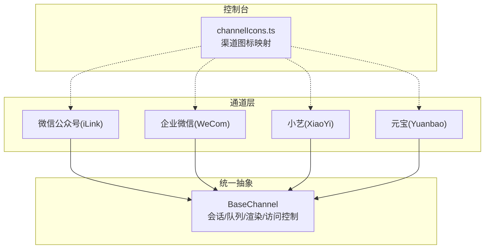
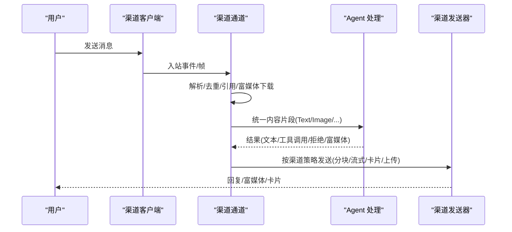
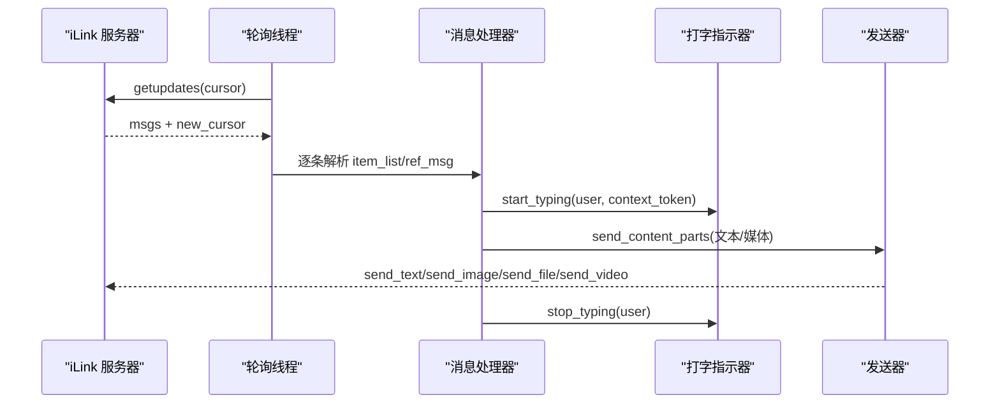
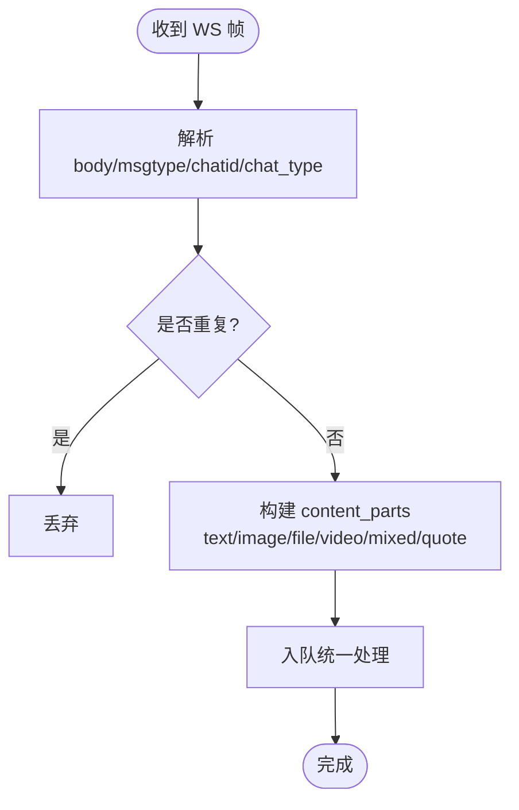
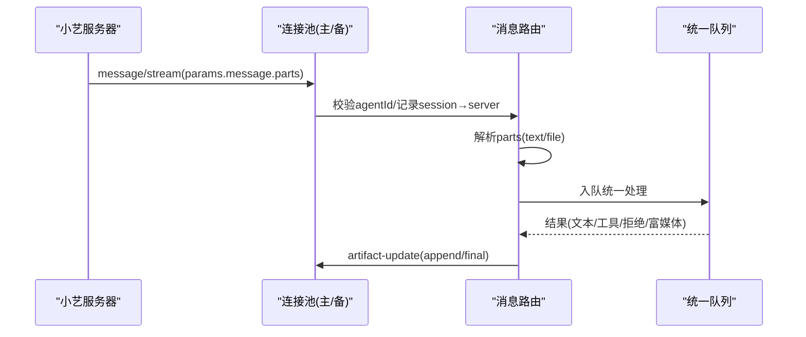
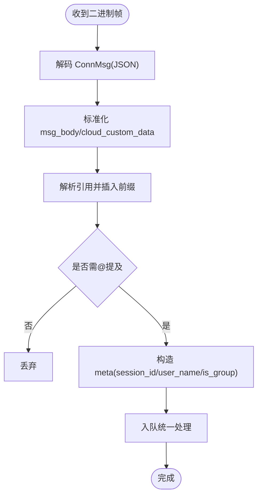
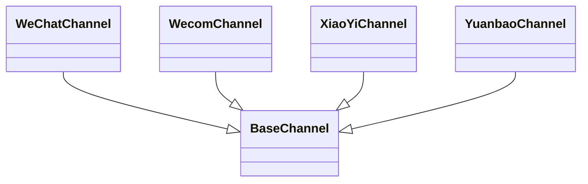

# 微信生态渠道

<cite>
**本文引用的文件**   
- [wechat/channel.py](file://src/qwenpaw/app/channels/wechat/channel.py)
- [wecom/channel.py](file://src/qwenpaw/app/channels/wecom/channel.py)
- [xiaoyi/channel.py](file://src/qwenpaw/app/channels/xiaoyi/channel.py)
- [yuanbao/channel.py](file://src/qwenpaw/app/channels/yuanbao/channel.py)
- [channelIcons.ts](file://console/src/pages/Control/Channels/components/channelIcons.ts)
</cite>

## 目录
1. [简介](#简介)
2. [项目结构](#项目结构)
3. [核心组件](#核心组件)
4. [架构总览](#架构总览)
5. [详细组件分析](#详细组件分析)
6. [依赖关系分析](#依赖关系分析)
7. [性能与可靠性](#性能与可靠性)
8. [故障排查指南](#故障排查指南)
9. [结论与建议](#结论与建议)
10. [附录：配置与安全要点](#附录配置与安全要点)

## 简介
本文件面向“微信生态渠道集成”，覆盖微信公众号（iLink Bot）、企业微信、小艺、元宝四个平台。文档从接入认证、消息格式转换、富媒体支持、卡片系统、小程序与企业级能力适配等维度进行系统化说明，并提供配置步骤、密钥管理、安全验证与合规建议，以及功能对比与选型建议，帮助读者快速落地并稳定运行。

## 项目结构
本项目在 channels 目录下为每个平台提供独立实现，遵循统一的 BaseChannel 抽象，完成入站解析、出站发送、流式输出、心跳保活、去重与合并等通用能力。控制台侧通过 channelIcons.ts 维护各渠道图标资源，便于前端展示。

图表来源
- [wechat/channel.py:1-120](file://src/qwenpaw/app/channels/wechat/channel.py#L1-L120)
- [wecom/channel.py:1-120](file://src/qwenpaw/app/channels/wecom/channel.py#L1-L120)
- [xiaoyi/channel.py:1-120](file://src/qwenpaw/app/channels/xiaoyi/channel.py#L1-L120)
- [yuanbao/channel.py:1-120](file://src/qwenpaw/app/channels/yuanbao/channel.py#L1-L120)
- [channelIcons.ts:22-36](file://console/src/pages/Control/Channels/components/channelIcons.ts#L22-L36)

章节来源
- [wechat/channel.py:1-120](file://src/qwenpaw/app/channels/wechat/channel.py#L1-L120)
- [wecom/channel.py:1-120](file://src/qwenpaw/app/channels/wecom/channel.py#L1-L120)
- [xiaoyi/channel.py:1-120](file://src/qwenpaw/app/channels/xiaoyi/channel.py#L1-L120)
- [yuanbao/channel.py:1-120](file://src/qwenpaw/app/channels/yuanbao/channel.py#L1-L120)
- [channelIcons.ts:22-36](file://console/src/pages/Control/Channels/components/channelIcons.ts#L22-L36)

## 核心组件
- 微信公众号（iLink）：基于 HTTP 长轮询拉取消息，HTTP 发送回复；支持文本、图片、语音（ASR 文本）、文件、视频；具备上下文 token 缓存、打字指示器、消息合并（缓解 context_token 限制）。
- 企业微信（WeCom）：基于 WebSocket SDK 收发消息；支持流式更新、交互式卡片、分片上传大文件、群聊 @ 命令处理、Markdown 表格兼容。
- 小艺（XiaoYi）：A2A 协议，双 WebSocket（主备）冗余连接；支持任务取消、上下文清理、文本分块、推理/思考内容渲染。
- 元宝（Yuanbao）：基于 Protobuf 二进制协议的 WebSocket；签名令牌鉴权；C2C/群聊；心跳保活、引用消息提示、音视频/文件分类与上传。

章节来源
- [wechat/channel.py:64-176](file://src/qwenpaw/app/channels/wechat/channel.py#L64-L176)
- [wecom/channel.py:124-216](file://src/qwenpaw/app/channels/wecom/channel.py#L124-L216)
- [xiaoyi/channel.py:343-410](file://src/qwenpaw/app/channels/xiaoyi/channel.py#L343-L410)
- [yuanbao/channel.py:126-226](file://src/qwenpaw/app/channels/yuanbao/channel.py#L126-L226)

## 架构总览
下图展示了四个渠道的通用流程：入站消息经各自通道解析为统一内容片段（Text/Image/File/Video/Audio），进入统一处理管线，再按渠道特性进行出站发送（文本分块、流式更新、卡片渲染、媒体上传等）。

图表来源
- [wechat/channel.py:629-910](file://src/qwenpaw/app/channels/wechat/channel.py#L629-L910)
- [wecom/channel.py:437-721](file://src/qwenpaw/app/channels/wecom/channel.py#L437-L721)
- [xiaoyi/channel.py:719-886](file://src/qwenpaw/app/channels/xiaoyi/channel.py#L719-L886)
- [yuanbao/channel.py:875-999](file://src/qwenpaw/app/channels/yuanbao/channel.py#L875-L999)

## 详细组件分析

### 微信公众号（iLink）
- 认证方式
  - 优先使用 bot_token；若未配置则启动时触发扫码登录，成功后持久化到本地文件，后续自动加载。
- 消息格式转换
  - 入站：item_list 包含 text/image/voice/file/video 等类型，支持 ref_msg 引用消息；语音走 ASR 文本；图片/文件/视频需解密或带加密参数下载。
  - 出站：文本分块发送；图片/文件/视频通过专用接口发送；音频以文件形式发送。
- 富媒体与引用
  - 支持图片、文件、视频下载与发送；引用消息会提取被引用内容的文本与媒体，前置提示。
- 体验增强
  - 打字指示器：接收消息后获取 typing_ticket 并周期性刷新，完成后停止。
  - 消息合并：缓解 context_token 单次限制，可延迟合并或请求结束合并。
- 会话与会话键
  - 私聊 wechat:<user_id>；群聊 wechat:group:<group_id>。
- 关键流程时序

图表来源
- [wechat/channel.py:563-624](file://src/qwenpaw/app/channels/wechat/channel.py#L563-L624)
- [wechat/channel.py:865-910](file://src/qwenpaw/app/channels/wechat/channel.py#L865-L910)
- [wechat/channel.py:1305-1467](file://src/qwenpaw/app/channels/wechat/channel.py#L1305-L1467)
- [wechat/channel.py:1541-1600](file://src/qwenpaw/app/channels/wechat/channel.py#L1541-L1600)

章节来源
- [wechat/channel.py:64-176](file://src/qwenpaw/app/channels/wechat/channel.py#L64-L176)
- [wechat/channel.py:382-447](file://src/qwenpaw/app/channels/wechat/channel.py#L382-L447)
- [wechat/channel.py:486-525](file://src/qwenpaw/app/channels/wechat/channel.py#L486-L525)
- [wechat/channel.py:563-624](file://src/qwenpaw/app/channels/wechat/channel.py#L563-L624)
- [wechat/channel.py:629-910](file://src/qwenpaw/app/channels/wechat/channel.py#L629-L910)
- [wechat/channel.py:1048-1226](file://src/qwenpaw/app/channels/wechat/channel.py#L1048-L1226)
- [wechat/channel.py:1305-1467](file://src/qwenpaw/app/channels/wechat/channel.py#L1305-L1467)
- [wechat/channel.py:1541-1600](file://src/qwenpaw/app/channels/wechat/channel.py#L1541-L1600)

### 企业微信（WeCom）
- 认证方式
  - 使用 bot_id 与 secret 建立 WebSocket 连接；支持最大重连次数配置。
- 消息格式转换
  - 入站：text/image/voice/file/video/mixed，支持 quote 引用消息；群聊中去除 @ 命令前缀。
  - 出站：文本通过 reply_stream 流式覆盖气泡；媒体通过分片上传后发送 media_id。
- 卡片系统与交互
  - 内置卡片处理器，用于工具守卫审批等场景；模板卡片事件监听。
- 流式与保活
  - “Thinking...”占位流定期刷新，防止服务端超时；到达上限强制关闭旧流，避免占用。
- 群聊与小程序/企业级能力
  - 支持群聊共享会话、@ 命令过滤、欢迎语；结合上层能力可对接企业应用与审批流。
- 关键流程图（入站解析）

图表来源
- [wecom/channel.py:437-721](file://src/qwenpaw/app/channels/wecom/channel.py#L437-L721)

章节来源
- [wecom/channel.py:124-216](file://src/qwenpaw/app/channels/wecom/channel.py#L124-L216)
- [wecom/channel.py:437-721](file://src/qwenpaw/app/channels/wecom/channel.py#L437-L721)
- [wecom/channel.py:837-936](file://src/qwenpaw/app/channels/wecom/channel.py#L837-L936)
- [wecom/channel.py:1001-1051](file://src/qwenpaw/app/channels/wecom/channel.py#L1001-L1051)
- [wecom/channel.py:1169-1266](file://src/qwenpaw/app/channels/wecom/channel.py#L1169-L1266)
- [wecom/channel.py:1556-1600](file://src/qwenpaw/app/channels/wecom/channel.py#L1556-L1600)

### 小艺（XiaoYi）
- 认证方式
  - AK/SK + agent_id 生成鉴权头；双 WebSocket（域名+备用 IP）并行连接，任一可用即可通信。
- 消息格式转换
  - A2A 协议：message/stream 入站，parts 包含 text/file；文件下载后转为 ImageContent/FileContent。
  - 出站：artifact-update 分块推送，支持 reasoningText 与 text；超长文本按行切分。
- 企业级与稳定性
  - 任务取消/clearContext 响应；断线重连退避；连接复用与热切换。
- 关键时序（A2A 请求处理）

图表来源
- [xiaoyi/channel.py:719-886](file://src/qwenpaw/app/channels/xiaoyi/channel.py#L719-L886)
- [xiaoyi/channel.py:1170-1269](file://src/qwenpaw/app/channels/xiaoyi/channel.py#L1170-L1269)

章节来源
- [xiaoyi/channel.py:99-174](file://src/qwenpaw/app/channels/xiaoyi/channel.py#L99-L174)
- [xiaoyi/channel.py:343-410](file://src/qwenpaw/app/channels/xiaoyi/channel.py#L343-L410)
- [xiaoyi/channel.py:606-663](file://src/qwenpaw/app/channels/xiaoyi/channel.py#L606-L663)
- [xiaoyi/channel.py:719-886](file://src/qwenpaw/app/channels/xiaoyi/channel.py#L719-L886)
- [xiaoyi/channel.py:1010-1041](file://src/qwenpaw/app/channels/xiaoyi/channel.py#L1010-L1041)
- [xiaoyi/channel.py:1170-1269](file://src/qwenpaw/app/channels/xiaoyi/channel.py#L1170-L1269)

### 元宝（Yuanbao）
- 认证方式
  - 先通过 sign-token API 获取 token，再建立 WebSocket 并发送 AuthBind 二进制帧完成绑定。
- 消息格式转换
  - 入站：Protobuf 包裹 JSON，msg_body 包含 TIMTextElem/TIMImageElem/TIMFileElem 等；支持 cloud_custom_data.quote 文本占位。
  - 出站：文本分块发送；媒体通过 COS 上传后以 TIMImageElem/TIMFileElem 发送。
- 心跳与保活
  - 定时 Ping/Pong；心跳超时阈值触发重连；typing 心跳维持“正在输入”状态。
- 群聊与提及
  - 支持 group_code 与 @bot 识别；可配置 require_mention 策略。
- 关键流程图（入站解析与引用）

图表来源
- [yuanbao/channel.py:801-829](file://src/qwenpaw/app/channels/yuanbao/channel.py#L801-L829)
- [yuanbao/channel.py:875-999](file://src/qwenpaw/app/channels/yuanbao/channel.py#L875-L999)

章节来源
- [yuanbao/channel.py:126-226](file://src/qwenpaw/app/channels/yuanbao/channel.py#L126-L226)
- [yuanbao/channel.py:436-557](file://src/qwenpaw/app/channels/yuanbao/channel.py#L436-L557)
- [yuanbao/channel.py:801-829](file://src/qwenpaw/app/channels/yuanbao/channel.py#L801-L829)
- [yuanbao/channel.py:875-999](file://src/qwenpaw/app/channels/yuanbao/channel.py#L875-L999)
- [yuanbao/channel.py:1276-1371](file://src/qwenpaw/app/channels/yuanbao/channel.py#L1276-L1371)
- [yuanbao/channel.py:1480-1600](file://src/qwenpaw/app/channels/yuanbao/channel.py#L1480-L1600)

## 依赖关系分析
- 通道与抽象
  - 四个通道均继承自 BaseChannel，复用会话解析、访问控制、渲染风格、错误处理等通用逻辑。
- 外部依赖
  - WeChat iLink：HTTP 客户端与长轮询；二维码登录；typing_ticket 获取。
  - WeCom：aibot WebSocket SDK；分片上传命令；模板卡片事件。
  - XiaoYi：aiohttp WebSocket；双连接管理与回调热替换。
  - Yuanbao：自定义 Protobuf 编解码；COS 上传；心跳与踢出处理。
- 控制台图标
  - console 侧通过 channelIcons.ts 维护 wecom/wechat/yuanbao 等图标 URL，便于 UI 展示。

图表来源
- [wechat/channel.py:64-176](file://src/qwenpaw/app/channels/wechat/channel.py#L64-L176)
- [wecom/channel.py:124-216](file://src/qwenpaw/app/channels/wecom/channel.py#L124-L216)
- [xiaoyi/channel.py:343-410](file://src/qwenpaw/app/channels/xiaoyi/channel.py#L343-L410)
- [yuanbao/channel.py:126-226](file://src/qwenpaw/app/channels/yuanbao/channel.py#L126-L226)

章节来源
- [channelIcons.ts:22-36](file://console/src/pages/Control/Channels/components/channelIcons.ts#L22-L36)

## 性能与可靠性
- 去重与防抖
  - WeChat：context_token 去重 + 内容哈希短时窗口去重；WeCom：消息 ID 去重；Yuanbao：消息 ID 集合定期修剪。
- 流式与保活
  - WeCom：占位流周期刷新，达到上限强制关闭；Yuanbao：Ping/Pong 心跳与超时阈值；XiaoYi：双连接冗余与断线重连退避。
- 大文件与分片
  - WeCom：分片上传（init/chunk/finish）；Yuanbao：COS 上传后再发送。
- 文本分块
  - WeChat/Yuanbao/XiaoYi 均对长文本进行分块发送，避免超限或断开。
- 并发与隔离
  - WeChat：独立轮询线程与事件循环；WeCom：WS 线程与主循环跨线程调度；XiaoYi：主备连接并行；Yuanbao：独立媒体会话。

[本节为通用指导，不直接分析具体文件]

## 故障排查指南
- 认证失败
  - WeChat：检查 bot_token 文件路径与权限；确认二维码登录成功日志。
  - WeCom：确认 bot_id/secret 正确；查看 WS 连接与重连日志。
  - XiaoYi：校验 AK/SK/agent_id；关注主备连接健康状态。
  - Yuanbao：检查 sign-token 返回与 AuthBind 状态码；必要时强制刷新 token。
- 媒体下载/上传失败
  - WeChat：核对 AES key 与加密参数；检查 CDN 链接有效性。
  - WeCom：检查分片上传 init/chunk/finish 返回值与 errcode。
  - Yuanbao：确认 COS 上传结果与返回 URL；失败回退为文本链接。
- 心跳/保活异常
  - WeCom：观察 keepalive 刷新与强制关闭日志。
  - Yuanbao：关注心跳超时计数与重连触发。
  - XiaoYi：查看重连退避与连接复用情况。
- 群聊与提及
  - WeCom：确认 @ 命令过滤逻辑；Yuanbao：检查 require_mention 策略与 @bot 识别。

章节来源
- [wechat/channel.py:382-447](file://src/qwenpaw/app/channels/wechat/channel.py#L382-L447)
- [wechat/channel.py:486-525](file://src/qwenpaw/app/channels/wechat/channel.py#L486-L525)
- [wecom/channel.py:837-936](file://src/qwenpaw/app/channels/wecom/channel.py#L837-L936)
- [wecom/channel.py:1001-1051](file://src/qwenpaw/app/channels/wecom/channel.py#L1001-L1051)
- [xiaoyi/channel.py:1010-1041](file://src/qwenpaw/app/channels/xiaoyi/channel.py#L1010-L1041)
- [yuanbao/channel.py:831-846](file://src/qwenpaw/app/channels/yuanbao/channel.py#L831-L846)
- [yuanbao/channel.py:1276-1371](file://src/qwenpaw/app/channels/yuanbao/channel.py#L1276-L1371)

## 结论与建议
- 选择建议
  - 微信公众号（iLink）：适合私域公众号机器人，强调文本与基础富媒体，注意 context_token 限制与合并策略。
  - 企业微信：适合企业内部协作，强项在于流式交互、卡片审批、群聊与 Markdown 兼容。
  - 小艺：适合 Agent-to-Agent 场景，双连接高可用，支持推理/思考内容展示。
  - 元宝：适合腾讯生态内 C2C/群聊，具备完善的签名鉴权与多媒体上传链路。
- 实施建议
  - 统一密钥管理：将 bot_token/bot_id/secret/AK/SK/app_id/app_secret 等放入环境变量或密钥管理服务。
  - 开启健康检查：暴露 health_check 接口，监控连接状态与心跳。
  - 完善日志与追踪：区分 warn/error/debug，保留必要上下文（如 user_id/session_id）。
  - 合规与安全：最小权限原则、敏感信息不落盘明文、网络传输启用 HTTPS/WSS。

[本节为总结性内容，不直接分析具体文件]

## 附录：配置与安全要点
- 微信公众号（iLink）
  - 环境变量：WECHAT_CHANNEL_ENABLED、WECHAT_BOT_TOKEN、WECHAT_BOT_TOKEN_FILE、WECHAT_BASE_URL、WECHAT_MEDIA_DIR、WECHAT_DM_POLICY、WECHAT_GROUP_POLICY、WECHAT_ALLOW_FROM、WECHAT_DENY_MESSAGE。
  - 安全：token 文件权限控制；context_token 失效处理；typing_ticket 缓存 TTL。
- 企业微信（WeCom）
  - 环境变量：WECOM_CHANNEL_ENABLED、WECOM_BOT_ID、WECOM_SECRET、WECOM_MEDIA_DIR、WECOM_SHARE_SESSION_IN_GROUP、WECOM_DM_POLICY、WECOM_GROUP_POLICY、WECOM_ALLOW_FROM、WECOM_DENY_MESSAGE、WECOM_MAX_RECONNECT_ATTEMPTS。
  - 安全：WS 连接重连上限；分片上传 errcode 校验；模板卡片事件白名单。
- 小艺（XiaoYi）
  - 环境变量：XIAOYI_CHANNEL_ENABLED、XIAOYI_AK、XIAOYI_SK、XIAOYI_AGENT_ID、XIAOYI_MEDIA_DIR。
  - 安全：AK/SK 保密；双连接主备切换；任务取消/上下文清理幂等。
- 元宝（Yuanbao）
  - 环境变量：YUANBAO_CHANNEL_ENABLED、YUANBAO_APP_ID、YUANBAO_APP_SECRET、YUANBAO_API_DOMAIN、YUANBAO_BOT_PREFIX、YUANBAO_DM_POLICY、YUANBAO_GROUP_POLICY、YUANBAO_ALLOW_FROM、YUANBAO_DENY_MESSAGE、YUANBAO_REQUIRE_MENTION、YUANBAO_ACCEPT_BOT_MESSAGES。
  - 安全：sign-token 刷新；心跳超时阈值；踢出码处理；引用消息仅文本占位，避免泄露原始内容。

章节来源
- [wechat/channel.py:221-295](file://src/qwenpaw/app/channels/wechat/channel.py#L221-L295)
- [wecom/channel.py:217-300](file://src/qwenpaw/app/channels/wecom/channel.py#L217-L300)
- [xiaoyi/channel.py:416-495](file://src/qwenpaw/app/channels/xiaoyi/channel.py#L416-L495)
- [yuanbao/channel.py:231-339](file://src/qwenpaw/app/channels/yuanbao/channel.py#L231-L339)