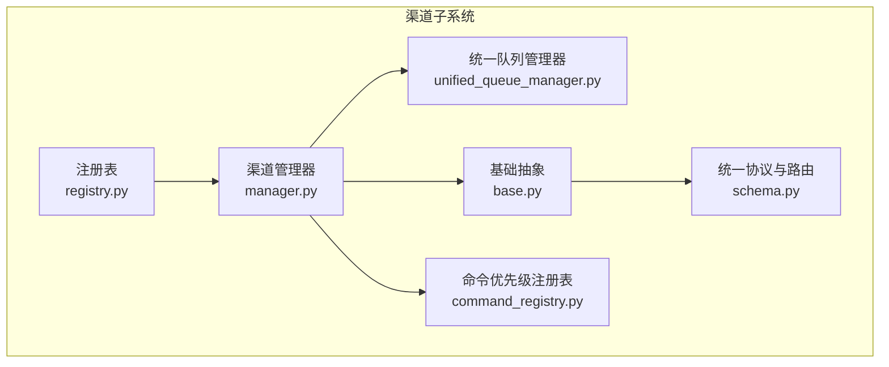
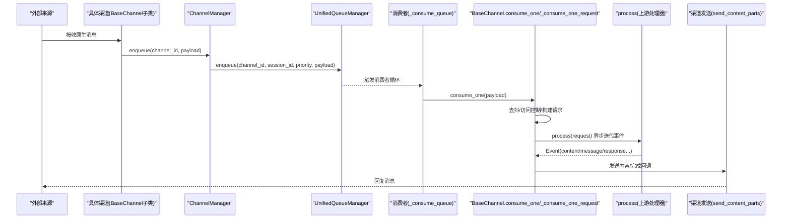
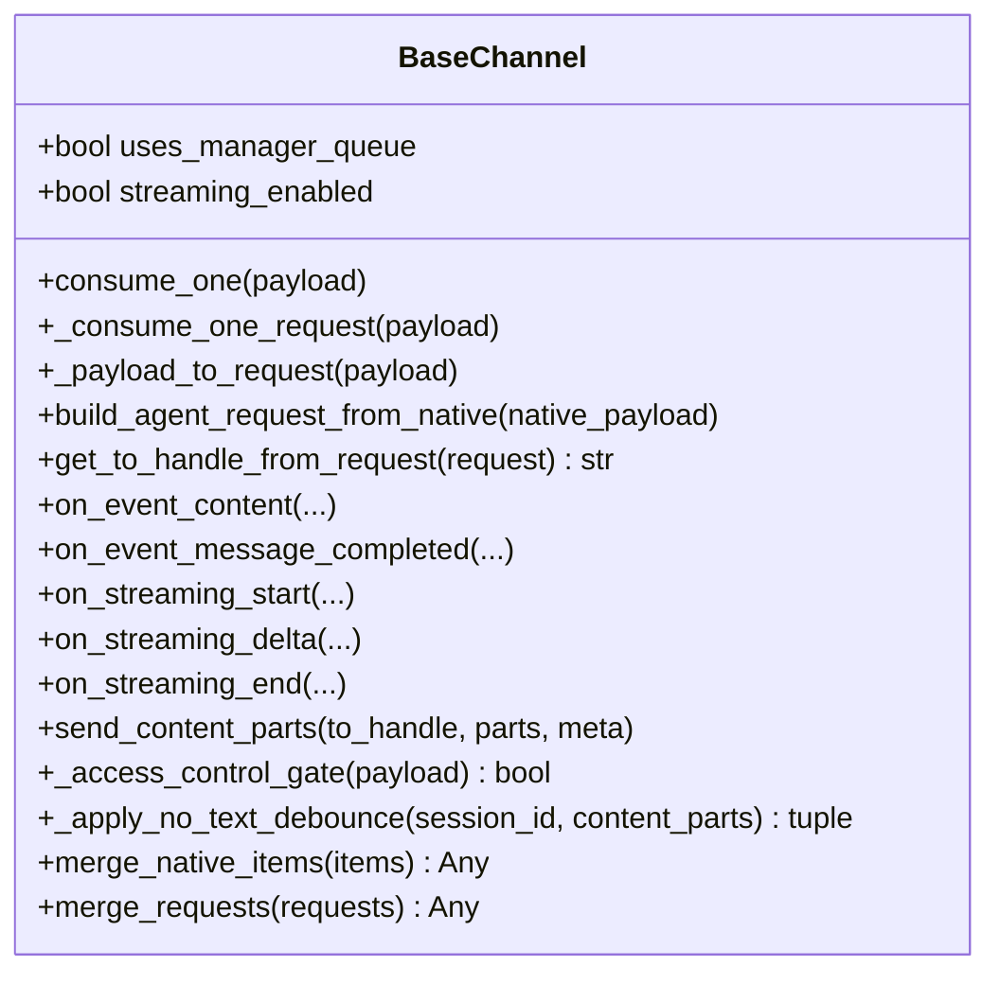
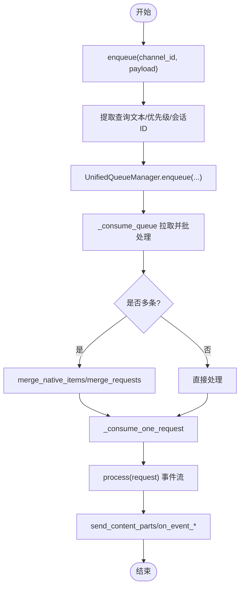
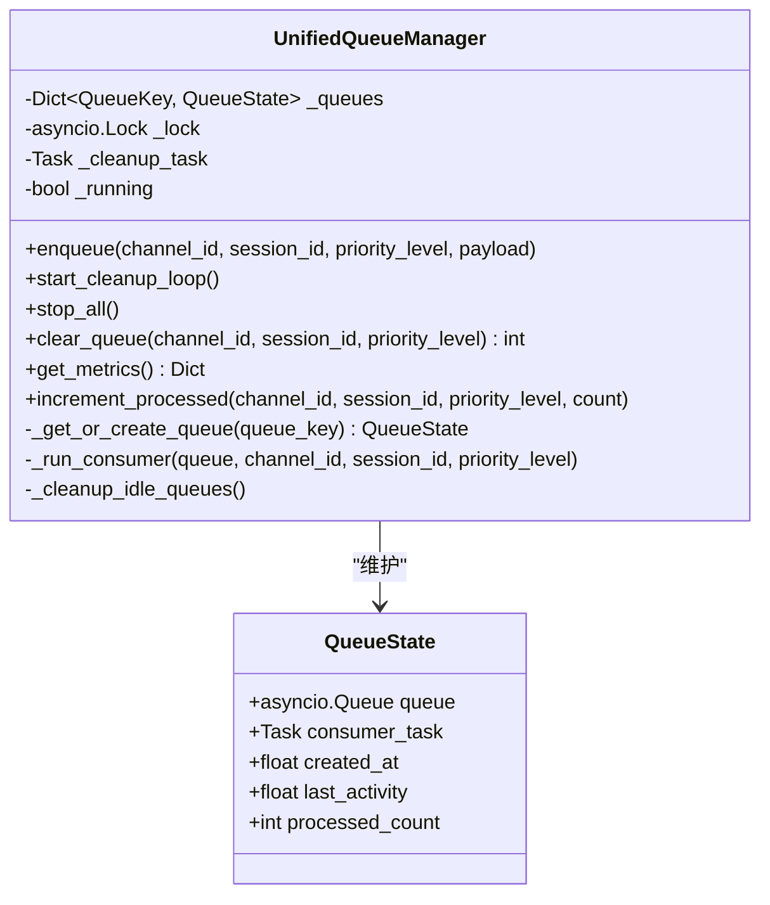
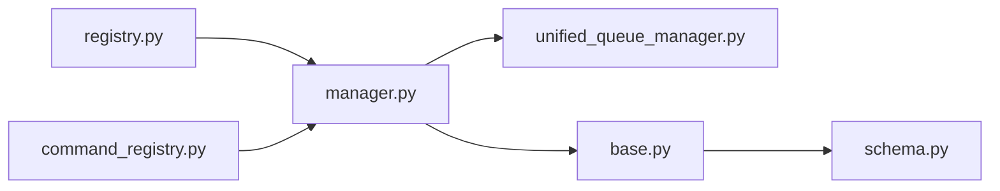

# 渠道架构设计

<cite>
**本文引用的文件**   
- [base.py](file://src/qwenpaw/app/channels/base.py)
- [manager.py](file://src/qwenpaw/app/channels/manager.py)
- [unified_queue_manager.py](file://src/qwenpaw/app/channels/unified_queue_manager.py)
- [registry.py](file://src/qwenpaw/app/channels/registry.py)
- [schema.py](file://src/qwenpaw/app/channels/schema.py)
- [command_registry.py](file://src/qwenpaw/app/channels/command_registry.py)
</cite>

## 目录
1. [引言](#引言)
2. [项目结构](#项目结构)
3. [核心组件](#核心组件)
4. [架构总览](#架构总览)
5. [详细组件分析](#详细组件分析)
6. [依赖关系分析](#依赖关系分析)
7. [性能与资源管理](#性能与资源管理)
8. [故障排查指南](#故障排查指南)
9. [结论](#结论)
10. [附录：扩展新渠道类型](#附录扩展新渠道类型)

## 引言
本文件面向 QwenPaw 的“渠道系统”进行系统化、可落地的架构说明，覆盖基础抽象类 ChannelBase（代码中为 BaseChannel）的设计、渠道管理器 ChannelManager 的职责、统一队列管理器 UnifiedQueueManager 的实现原理、渠道注册机制、统一消息格式转换、生命周期管理、错误处理策略、连接池与资源清理机制，以及渠道间通信和数据同步方式。文档同时提供架构图与流程图，帮助初学者快速上手，并为有经验的开发者提供足够的技术深度。

## 项目结构
渠道子系统位于 src/qwenpaw/app/channels 下，关键文件包括：
- base.py：所有渠道的基础抽象与通用流程（消费、流式事件、去抖、访问控制等）
- manager.py：渠道管理器，负责启动/停止、统一入队、消费者调度、健康检查与热替换
- unified_queue_manager.py：统一队列管理器，按 (channel_id, session_id, priority_level) 维度创建独立队列与消费者
- registry.py：内置与插件渠道注册表，支持按需加载与缓存
- schema.py：统一路由地址与协议定义（ChannelAddress、ChannelMessageConverter）
- command_registry.py：命令优先级注册表，用于将控制命令与普通消息区分并赋予不同优先级

图表来源
- [registry.py:1-135](file://src/qwenpaw/app/channels/registry.py#L1-L135)
- [manager.py:67-112](file://src/qwenpaw/app/channels/manager.py#L67-L112)
- [unified_queue_manager.py:60-118](file://src/qwenpaw/app/channels/unified_queue_manager.py#L60-L118)
- [base.py:80-170](file://src/qwenpaw/app/channels/base.py#L80-L170)
- [schema.py:12-74](file://src/qwenpaw/app/channels/schema.py#L12-L74)
- [command_registry.py:23-62](file://src/qwenpaw/app/channels/command_registry.py#L23-L62)

章节来源
- [registry.py:1-135](file://src/qwenpaw/app/channels/registry.py#L1-L135)
- [manager.py:67-112](file://src/qwenpaw/app/channels/manager.py#L67-L112)
- [unified_queue_manager.py:60-118](file://src/qwenpaw/app/channels/unified_queue_manager.py#L60-L118)
- [base.py:80-170](file://src/qwenpaw/app/channels/base.py#L80-L170)
- [schema.py:12-74](file://src/qwenpaw/app/channels/schema.py#L12-L74)
- [command_registry.py:23-62](file://src/qwenpaw/app/channels/command_registry.py#L23-L62)

## 核心组件
- BaseChannel（基础抽象）
  - 职责：统一消息消费入口 consume_one()；请求构建 _payload_to_request()；事件分发与发送；流式事件钩子 on_streaming_start/delta/end；无文本内容去抖；访问控制门控；SSE 序列化与头部清理；任务追踪集成。
  - 关键点：uses_manager_queue 标志决定由管理器接管队列；streaming_enabled 启用实时流式路径；_debounce_seconds 实现时间窗口合并；merge_native_items/merge_requests 实现批量合并。
- ChannelManager（渠道管理器）
  - 职责：从配置或环境创建渠道实例；统一入队 enqueue()；启动/停止所有渠道；替换单个渠道 replace_channel()；获取健康状态；向指定渠道发送事件/文本；注入工作区与命令注册表。
  - 关键点：通过 CommandRegistry 提取查询文本并计算优先级；通过 UnifiedQueueManager 按 (channel_id, session_id, priority_level) 路由；对每个 channel 设置 set_enqueue 回调。
- UnifiedQueueManager（统一队列管理器）
  - 职责：维护 QueueKey → QueueState 映射；按需创建 asyncio.Queue 与消费者 Task；后台清理空闲队列；提供指标与清理接口。
  - 关键点：consumer_fn 由 ChannelManager 提供；enqueue 带超时保护；stop_all 优雅关闭所有消费者与清理任务。
- Registry（注册表）
  - 职责：发现并缓存内置渠道类；合并插件注册的渠道；保证必需渠道（如 console）可用。
- Schema（统一协议）
  - 职责：定义 ChannelAddress 统一路由地址；定义 ChannelMessageConverter 协议（build_agent_request_from_native / send_response）。
- CommandRegistry（命令优先级注册表）
  - 职责：将控制命令映射到优先级级别（0/10/20/30），供管理器在入队前分类。

章节来源
- [base.py:80-170](file://src/qwenpaw/app/channels/base.py#L80-L170)
- [manager.py:67-112](file://src/qwenpaw/app/channels/manager.py#L67-L112)
- [unified_queue_manager.py:60-118](file://src/qwenpaw/app/channels/unified_queue_manager.py#L60-L118)
- [registry.py:1-135](file://src/qwenpaw/app/channels/registry.py#L1-L135)
- [schema.py:12-74](file://src/qwenpaw/app/channels/schema.py#L12-L74)
- [command_registry.py:23-62](file://src/qwenpaw/app/channels/command_registry.py#L23-L62)

## 架构总览
下图展示从外部消息进入、入队、消费到响应返回的整体流程，以及各组件间的交互关系。

图表来源
- [manager.py:364-376](file://src/qwenpaw/app/channels/manager.py#L364-L376)
- [unified_queue_manager.py:119-164](file://src/qwenpaw/app/channels/unified_queue_manager.py#L119-L164)
- [manager.py:377-473](file://src/qwenpaw/app/channels/manager.py#L377-L473)
- [base.py:1215-1386](file://src/qwenpaw/app/channels/base.py#L1215-L1386)

## 详细组件分析

### BaseChannel（基础抽象）
- 设计要点
  - 统一消费入口：consume_one() 支持时间去抖与无文本内容延迟合并；内部调用 _consume_one_request()。
  - 请求构建：_payload_to_request() 兼容 AgentRequest 与原生 dict；子类需实现 build_agent_request_from_native()。
  - 事件分发：_run_process_loop() 与 _stream_with_tracker() 分别处理非流式与 SSE 流式路径；支持 reasoning/message 流式三段式钩子。
  - 去抖与合并：_apply_no_text_debounce() 与 merge_native_items()/merge_requests() 保障多片段消息的正确聚合。
  - 访问控制：_access_control_gate() 基于白名单/黑名单/待审批策略，结合语言模板返回拒绝信息。
  - 任务追踪：当存在 workspace 时，通过 TaskTracker 绑定 chat_id，支持 /stop 取消。
- 关键方法路径
  - 消费入口与去抖：[base.py:1215-1314](file://src/qwenpaw/app/channels/base.py#L1215-L1314)
  - 请求构建与目标解析：[base.py:1176-1207](file://src/qwenpaw/app/channels/base.py#L1176-L1207)
  - 流式事件分发与结束：[base.py:604-849](file://src/qwenpaw/app/channels/base.py#L604-L849)
  - 访问控制门控：[base.py:379-451](file://src/qwenpaw/app/channels/base.py#L379-L451)
  - 任务追踪消费包装：[base.py:529-585](file://src/qwenpaw/app/channels/base.py#L529-L585)

图表来源
- [base.py:80-170](file://src/qwenpaw/app/channels/base.py#L80-L170)
- [base.py:1215-1386](file://src/qwenpaw/app/channels/base.py#L1215-L1386)
- [base.py:604-849](file://src/qwenpaw/app/channels/base.py#L604-L849)

章节来源
- [base.py:80-170](file://src/qwenpaw/app/channels/base.py#L80-L170)
- [base.py:1215-1386](file://src/qwenpaw/app/channels/base.py#L1215-L1386)
- [base.py:604-849](file://src/qwenpaw/app/channels/base.py#L604-L849)

### ChannelManager（渠道管理器）
- 职责边界
  - 初始化：from_env/from_config 根据可用渠道与配置构造实例；注入 CommandRegistry 与 Workspace。
  - 入队：enqueue() 线程安全地将 payload 投递到事件循环；_enqueue_one() 计算优先级与 session_id，交由 UnifiedQueueManager。
  - 消费者：_consume_queue() 拉取同键消息并批量合并，再交给 BaseChannel 处理。
  - 生命周期：start_all()/stop_all() 启动/停止所有渠道与队列；replace_channel() 热替换单渠道；clear_queue() 清理指定队列。
  - 对外发送：send_event()/send_text() 将事件/文本发送到指定渠道。
- 关键流程
  - 入队与优先级：[manager.py:364-376](file://src/qwenpaw/app/channels/manager.py#L364-L376)、[manager.py:270-363](file://src/qwenpaw/app/channels/manager.py#L270-L363)
  - 消费者循环与批处理：[manager.py:377-473](file://src/qwenpaw/app/channels/manager.py#L377-L473)
  - 启动/停止与热替换：[manager.py:474-571](file://src/qwenpaw/app/channels/manager.py#L474-L571)、[manager.py:734-792](file://src/qwenpaw/app/channels/manager.py#L734-L792)
  - 发送接口：[manager.py:800-874](file://src/qwenpaw/app/channels/manager.py#L800-L874)

图表来源
- [manager.py:364-376](file://src/qwenpaw/app/channels/manager.py#L364-L376)
- [manager.py:377-473](file://src/qwenpaw/app/channels/manager.py#L377-L473)
- [base.py:1215-1386](file://src/qwenpaw/app/channels/base.py#L1215-L1386)

章节来源
- [manager.py:364-376](file://src/qwenpaw/app/channels/manager.py#L364-L376)
- [manager.py:377-473](file://src/qwenpaw/app/channels/manager.py#L377-L473)
- [manager.py:474-571](file://src/qwenpaw/app/channels/manager.py#L474-L571)
- [manager.py:734-792](file://src/qwenpaw/app/channels/manager.py#L734-L792)
- [manager.py:800-874](file://src/qwenpaw/app/channels/manager.py#L800-L874)

### UnifiedQueueManager（统一队列管理器）
- 设计要点
  - QueueKey = (channel_id, session_id, priority_level)，每个键对应一个 asyncio.Queue 与一个消费者 Task。
  - 动态创建：首次入队时创建队列与消费者；空闲清理任务定期回收长时间无活动的队列。
  - 指标与清理：get_metrics() 暴露队列统计；clear_queue() 清空指定队列；stop_all() 优雅关闭。
- 关键流程
  - 入队与超时保护：[unified_queue_manager.py:119-164](file://src/qwenpaw/app/channels/unified_queue_manager.py#L119-L164)
  - 消费者运行与退出：[unified_queue_manager.py:214-273](file://src/qwenpaw/app/channels/unified_queue_manager.py#L214-L273)
  - 空闲清理：[unified_queue_manager.py:376-428](file://src/qwenpaw/app/channels/unified_queue_manager.py#L376-L428)
  - 停止与指标：[unified_queue_manager.py:329-375](file://src/qwenpaw/app/channels/unified_queue_manager.py#L329-375)、[unified_queue_manager.py:430-471](file://src/qwenpaw/app/channels/unified_queue_manager.py#L430-471)

图表来源
- [unified_queue_manager.py:60-118](file://src/qwenpaw/app/channels/unified_queue_manager.py#L60-L118)
- [unified_queue_manager.py:119-164](file://src/qwenpaw/app/channels/unified_queue_manager.py#L119-L164)
- [unified_queue_manager.py:214-273](file://src/qwenpaw/app/channels/unified_queue_manager.py#L214-L273)
- [unified_queue_manager.py:376-428](file://src/qwenpaw/app/channels/unified_queue_manager.py#L376-L428)

章节来源
- [unified_queue_manager.py:60-118](file://src/qwenpaw/app/channels/unified_queue_manager.py#L60-L118)
- [unified_queue_manager.py:119-164](file://src/qwenpaw/app/channels/unified_queue_manager.py#L119-L164)
- [unified_queue_manager.py:214-273](file://src/qwenpaw/app/channels/unified_queue_manager.py#L214-L273)
- [unified_queue_manager.py:376-428](file://src/qwenpaw/app/channels/unified_queue_manager.py#L376-L428)

### 渠道注册机制与统一消息格式
- 注册机制
  - 内置渠道：registry.py 维护模块与类名映射，按需 import 并校验继承关系；必需渠道（console）失败则抛出异常。
  - 插件渠道：通过插件注册表合并，避免与内置冲突。
- 统一消息格式
  - ChannelAddress：统一 to_handle 字符串表示，替代散落的 meta 键。
  - ChannelMessageConverter：定义 build_agent_request_from_native 与 send_response 协议，要求渠道使用运行时 Content 类型，不引入中间信封。

章节来源
- [registry.py:1-135](file://src/qwenpaw/app/channels/registry.py#L1-L135)
- [schema.py:12-74](file://src/qwenpaw/app/channels/schema.py#L12-L74)

### 渠道生命周期管理、错误处理与资源清理
- 生命周期
  - start_all：初始化 UnifiedQueueManager、启动清理循环、为每个渠道设置 enqueue 回调、后台启动各渠道。
  - stop_all：取消未完成的启动/入队任务、停止队列管理器、逐个停止渠道。
  - replace_channel：预启动新实例、原子替换旧实例并停止旧实例。
- 错误处理
  - 入队超时/取消：_enqueue_with_timeout 捕获超时与取消，记录日志。
  - 消费者异常：_run_consumer 捕获异常并记录，finally 清理状态。
  - 通道停止：stop_all 对 cancel 与异常做兜底处理。
- 资源清理
  - 空闲清理：_cleanup_idle_queues 周期性扫描空队列并取消消费者。
  - 停止流程：stop_all 等待消费者退出并清理字典。

章节来源
- [manager.py:474-571](file://src/qwenpaw/app/channels/manager.py#L474-L571)
- [manager.py:734-792](file://src/qwenpaw/app/channels/manager.py#L734-L792)
- [unified_queue_manager.py:329-375](file://src/qwenpaw/app/channels/unified_queue_manager.py#L329-375)
- [unified_queue_manager.py:376-428](file://src/qwenpaw/app/channels/unified_queue_manager.py#L376-L428)

### 统一队列管理与渠道间通信/数据同步
- 统一队列
  - 以 (channel_id, session_id, priority_level) 为键隔离并发与顺序，确保同一会话内严格串行，不同会话可并行。
  - 消费者函数由 ChannelManager 提供，保留原有批处理与合并逻辑。
- 渠道间通信
  - 通过 ChannelManager.send_event/send_text 向指定渠道发送事件/文本，内部会合并 bot_prefix 与元数据，并委托具体渠道的 send_content_parts。
- 数据同步
  - 通过统一 Content 类型（TextContent/ImageContent 等）与 MessageRenderer 渲染，屏蔽渠道差异；BaseChannel 负责将事件转换为渠道可发送的内容。

章节来源
- [unified_queue_manager.py:119-164](file://src/qwenpaw/app/channels/unified_queue_manager.py#L119-L164)
- [manager.py:800-874](file://src/qwenpaw/app/channels/manager.py#L800-L874)
- [base.py:1215-1386](file://src/qwenpaw/app/channels/base.py#L1215-L1386)

## 依赖关系分析
- 组件耦合
  - ChannelManager 强依赖 UnifiedQueueManager、CommandRegistry、BaseChannel 与注册表。
  - BaseChannel 依赖 schema 协议与运行时 Content 类型；可选依赖 workspace 与命令注册表。
  - UnifiedQueueManager 仅依赖 asyncio 与标准库，低耦合。
- 潜在环依赖
  - 当前未发现循环导入；注册表采用延迟 import 与缓存，降低启动期耦合。
- 外部依赖
  - 插件系统（可选）：通过 PluginRegistry 发现插件渠道。
  - 运行时 Schemas：AgentRequest/Event/Content 等。

图表来源
- [registry.py:1-135](file://src/qwenpaw/app/channels/registry.py#L1-L135)
- [manager.py:67-112](file://src/qwenpaw/app/channels/manager.py#L67-L112)
- [unified_queue_manager.py:60-118](file://src/qwenpaw/app/channels/unified_queue_manager.py#L60-L118)
- [base.py:80-170](file://src/qwenpaw/app/channels/base.py#L80-L170)
- [schema.py:12-74](file://src/qwenpaw/app/channels/schema.py#L12-L74)

章节来源
- [registry.py:1-135](file://src/qwenpaw/app/channels/registry.py#L1-L135)
- [manager.py:67-112](file://src/qwenpaw/app/channels/manager.py#L67-L112)
- [unified_queue_manager.py:60-118](file://src/qwenpaw/app/channels/unified_queue_manager.py#L60-L118)
- [base.py:80-170](file://src/qwenpaw/app/channels/base.py#L80-L170)
- [schema.py:12-74](file://src/qwenpaw/app/channels/schema.py#L12-L74)

## 性能与资源管理
- 并发与隔离
  - 不同会话与不同优先级的队列相互独立，最大化并发度；同一会话内严格串行，避免乱序。
- 背压与限流
  - 队列最大长度由 _CHANNEL_QUEUE_MAXSIZE 控制；入队 put 带 30s 超时保护，防止无限阻塞。
- 资源清理
  - 空闲清理周期默认 60s，空闲阈值 600s；stop_all 等待消费者退出，避免僵尸任务。
- 批处理优化
  - 消费者在 get_nowait 循环中尽可能合并同键消息，减少重复处理与网络往返。

章节来源
- [manager.py:36-37](file://src/qwenpaw/app/channels/manager.py#L36-L37)
- [unified_queue_manager.py:119-164](file://src/qwenpaw/app/channels/unified_queue_manager.py#L119-L164)
- [unified_queue_manager.py:376-428](file://src/qwenpaw/app/channels/unified_queue_manager.py#L376-L428)
- [manager.py:377-473](file://src/qwenpaw/app/channels/manager.py#L377-L473)

## 故障排查指南
- 常见问题定位
  - 入队失败/超时：检查 _enqueue_with_timeout 日志，确认队列大小与消费者是否正常。
  - 消费者崩溃：查看 _run_consumer 异常堆栈，确认业务处理是否抛错。
  - 渠道不可用：检查 registry 加载日志，确认必需渠道（console）是否成功加载。
  - 消息未送达：核对 send_event/send_text 的 channel/user_id/session_id 是否正确，to_handle 解析是否符合渠道约定。
- 建议操作
  - 使用 clear_queue 清理积压队列后重试。
  - 使用 restart_channel 热重启问题渠道。
  - 开启更详细的日志输出，关注 “Consumer started/stopped”、“Enqueued/Cleared” 等关键字。

章节来源
- [manager.py:317-363](file://src/qwenpaw/app/channels/manager.py#L317-L363)
- [unified_queue_manager.py:214-273](file://src/qwenpaw/app/channels/unified_queue_manager.py#L214-L273)
- [registry.py:46-79](file://src/qwenpaw/app/channels/registry.py#L46-L79)
- [manager.py:800-874](file://src/qwenpaw/app/channels/manager.py#L800-L874)

## 结论
QwenPaw 渠道系统通过 BaseChannel 抽象统一了消息消费与发送流程，借助 ChannelManager 与 UnifiedQueueManager 实现了高并发、可伸缩且易于维护的消息处理管线。统一的注册表与协议定义降低了新增渠道的接入成本，配合完善的生命周期与错误处理机制，使系统在复杂场景下仍具备良好稳定性与可观测性。

## 附录：扩展新渠道类型
- 步骤概览
  1) 新建渠道类：继承 BaseChannel，实现必要方法（至少 build_agent_request_from_native、send_content_parts 或 send_response）。
  2) 注册渠道：在注册表中添加映射（内置）或通过插件系统注册。
  3) 配置启用：在配置中启用该渠道，必要时设置 filter_tool_messages/no_text_debounce/streaming_enabled 等开关。
  4) 测试验证：使用 ChannelManager.from_config 启动，发送消息验证端到端流程。
- 参考路径
  - 基础抽象与必须实现点：[base.py:1160-1186](file://src/qwenpaw/app/channels/base.py#L1160-L1186)
  - 注册表映射示例：[registry.py:18-37](file://src/qwenpaw/app/channels/registry.py#L18-L37)
  - 统一协议定义：[schema.py:54-74](file://src/qwenpaw/app/channels/schema.py#L54-L74)
  - 管理器构造与注入：[manager.py:114-228](file://src/qwenpaw/app/channels/manager.py#L114-L228)

章节来源
- [base.py:1160-1186](file://src/qwenpaw/app/channels/base.py#L1160-L1186)
- [registry.py:18-37](file://src/qwenpaw/app/channels/registry.py#L18-L37)
- [schema.py:54-74](file://src/qwenpaw/app/channels/schema.py#L54-L74)
- [manager.py:114-228](file://src/qwenpaw/app/channels/manager.py#L114-L228)