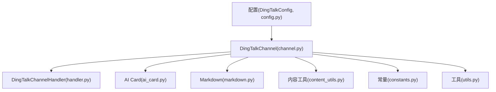
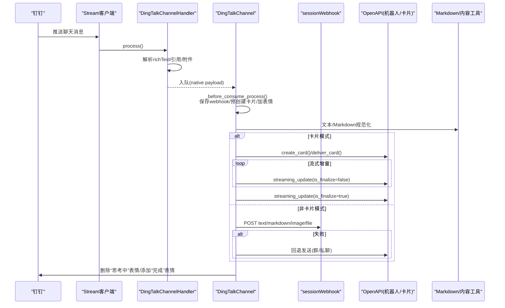
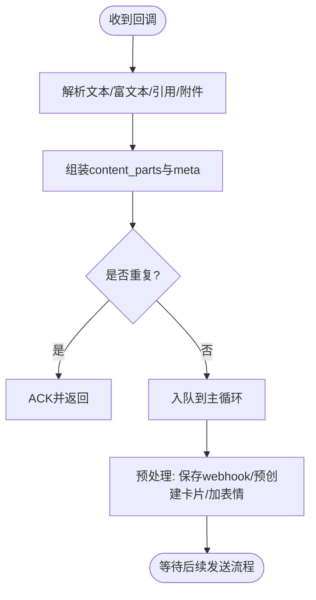
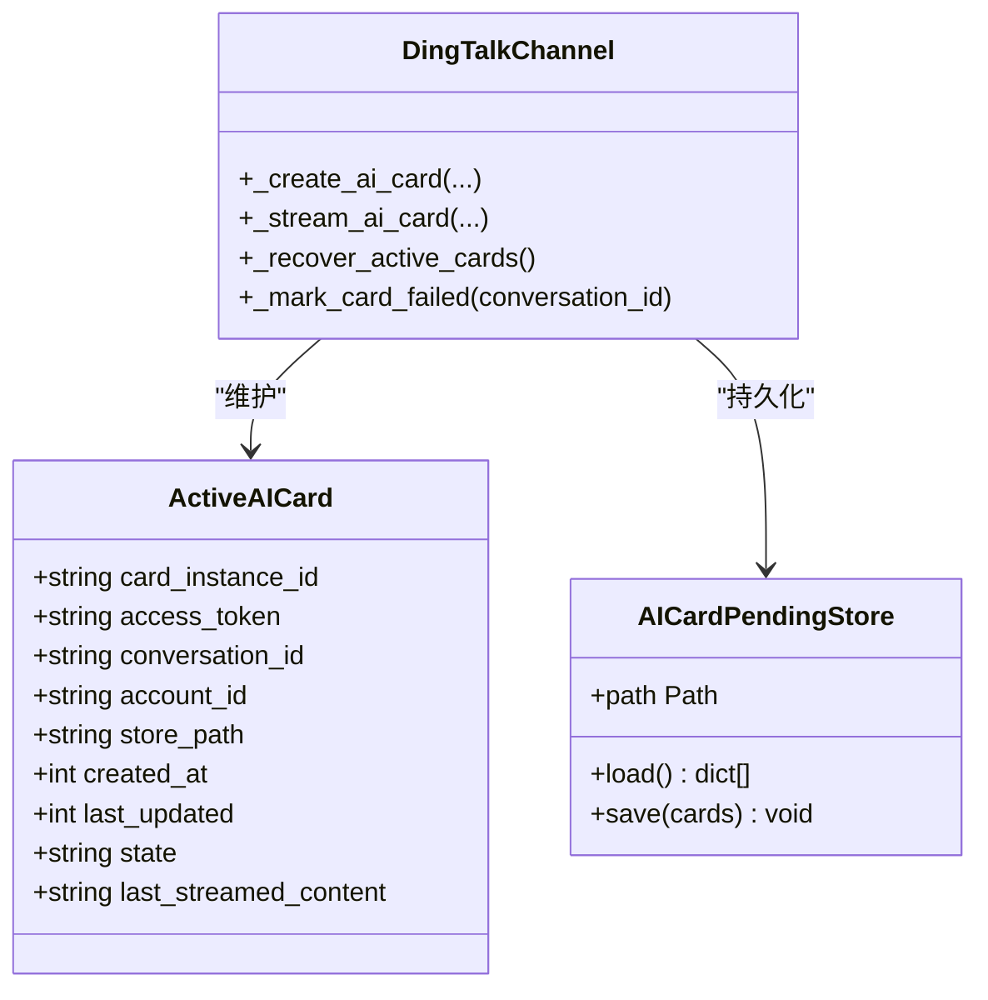
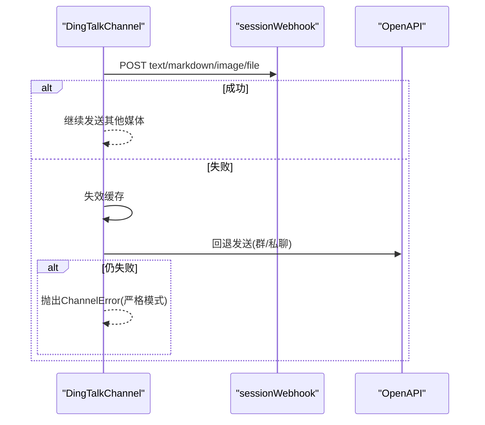
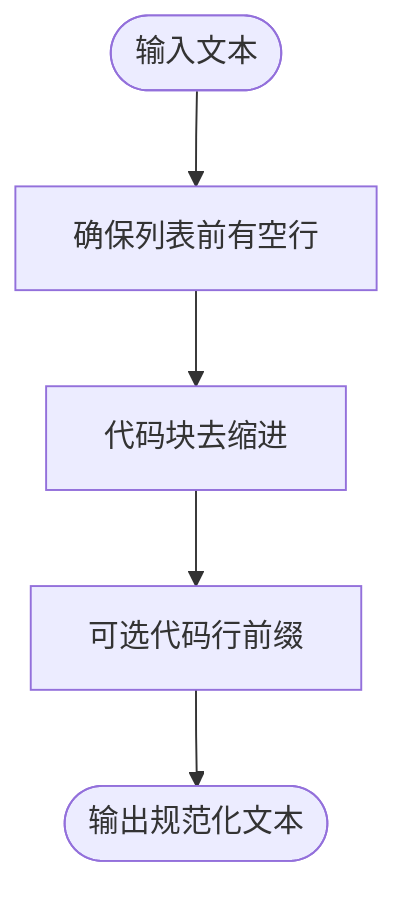
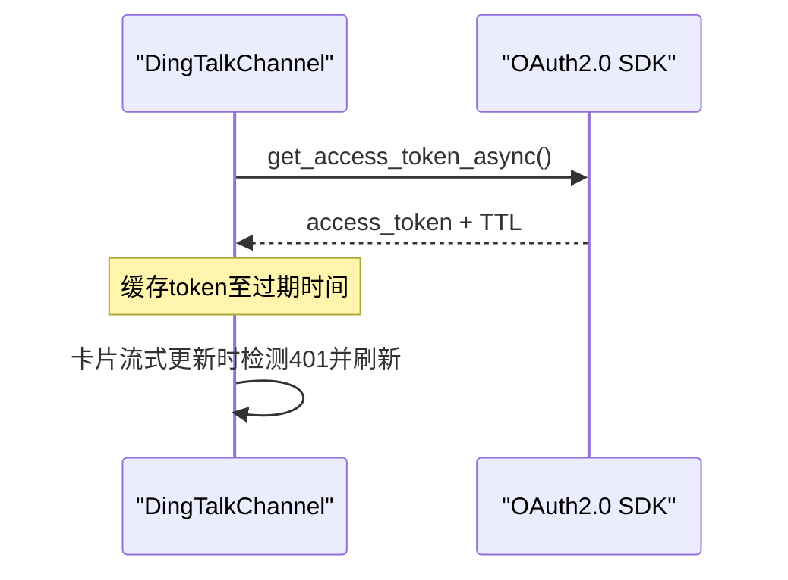
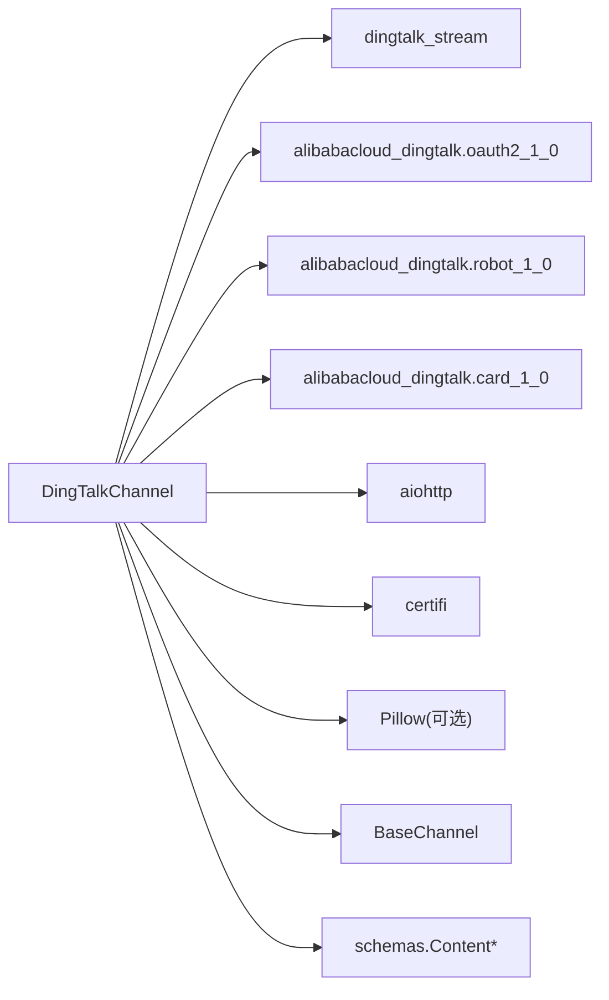

# 钉钉渠道

<cite>
**本文引用的文件**   
- [channel.py](file://src/qwenpaw/app/channels/dingtalk/channel.py)
- [handler.py](file://src/qwenpaw/app/channels/dingtalk/handler.py)
- [ai_card.py](file://src/qwenpaw/app/channels/dingtalk/ai_card.py)
- [markdown.py](file://src/qwenpaw/app/channels/dingtalk/markdown.py)
- [content_utils.py](file://src/qwenpaw/app/channels/dingtalk/content_utils.py)
- [constants.py](file://src/qwenpaw/app/channels/dingtalk/constants.py)
- [utils.py](file://src/qwenpaw/app/channels/dingtalk/utils.py)
- [config.py](file://src/qwenpaw/config/config.py)
</cite>

## 目录
1. [简介](#简介)
2. [项目结构](#项目结构)
3. [核心组件](#核心组件)
4. [架构总览](#架构总览)
5. [详细组件分析](#详细组件分析)
6. [依赖关系分析](#依赖关系分析)
7. [性能与可靠性](#性能与可靠性)
8. [故障排除指南](#故障排除指南)
9. [结论](#结论)
10. [附录：配置与API参考](#附录配置与api参考)

## 简介
本章节面向“钉钉渠道”的集成与实现，覆盖以下要点：
- 接入方式：基于钉钉 Stream 回调的消息接收、ACK 策略与异步回复。
- 认证与鉴权：Access Token 获取与缓存、OpenAPI 调用（机器人消息发送、卡片流式更新、表情回复等）。
- 消息收发：文本、Markdown、图片、视频、音频、文件的上传与下发；Webhook 直发与 OpenAPI 回退。
- AI 卡片：创建、投递、流式增量更新、失败恢复与状态持久化。
- Markdown 渲染：列表间距、代码块去缩进与可选前缀处理。
- 富媒体支持：下载链接解析、本地缓存、后缀猜测、封面生成。
- 安全与签名：访问令牌、端点定制、错误重试与幂等去重。
- 配置项与环境变量：启用开关、消息类型、模板 ID、自动布局、@提及策略、流式模式、自定义端点等。
- 故障排查与优化建议：常见问题定位、日志关键字、性能调优。

[本节不直接分析具体文件，故无“章节来源”]

## 项目结构
钉钉渠道位于 channels/dingtalk 子模块，围绕 channel.py 主类组织，配合 handler、ai_card、markdown、content_utils、constants、utils 等辅助模块完成完整链路。

图表来源
- [channel.py:107-248](file://src/qwenpaw/app/channels/dingtalk/channel.py#L107-L248)
- [handler.py:38-110](file://src/qwenpaw/app/channels/dingtalk/handler.py#L38-L110)
- [ai_card.py:19-79](file://src/qwenpaw/app/channels/dingtalk/ai_card.py#L19-L79)
- [markdown.py:96-111](file://src/qwenpaw/app/channels/dingtalk/markdown.py#L96-L111)
- [content_utils.py:33-46](file://src/qwenpaw/app/channels/dingtalk/content_utils.py#L33-L46)
- [constants.py:1-19](file://src/qwenpaw/app/channels/dingtalk/constants.py#L1-L19)
- [utils.py:23-34](file://src/qwenpaw/app/channels/dingtalk/utils.py#L23-L34)
- [config.py:237-250](file://src/qwenpaw/config/config.py#L237-L250)

章节来源
- [channel.py:107-248](file://src/qwenpaw/app/channels/dingtalk/channel.py#L107-L248)
- [config.py:237-250](file://src/qwenpaw/config/config.py#L237-L250)

## 核心组件
- DingTalkChannel：渠道主类，负责 Stream 生命周期管理、会话 Webhook 存储、消息路由、AI 卡片创建/投递/流式更新、OpenAPI 发送、媒体上传、表情回复、健康检查等。
- DingTalkChannelHandler：Stream 回调处理器，将原始消息转换为内部 Content 列表并入队，立即 ACK。
- AI Card 持久化：ActiveAICard 与 AICardPendingStore 用于崩溃恢复与状态持久化。
- Markdown 规范化：确保列表与代码块在钉钉渲染正确。
- 内容工具：构建 Content、提取会话信息、短会话 ID、类型映射等。
- 常量与工具：TTL、类型映射、Magic 字节后缀猜测等。

章节来源
- [channel.py:107-248](file://src/qwenpaw/app/channels/dingtalk/channel.py#L107-L248)
- [handler.py:38-110](file://src/qwenpaw/app/channels/dingtalk/handler.py#L38-L110)
- [ai_card.py:19-79](file://src/qwenpaw/app/channels/dingtalk/ai_card.py#L19-L79)
- [markdown.py:96-111](file://src/qwenpaw/app/channels/dingtalk/markdown.py#L96-L111)
- [content_utils.py:33-46](file://src/qwenpaw/app/channels/dingtalk/content_utils.py#L33-L46)
- [constants.py:1-19](file://src/qwenpaw/app/channels/dingtalk/constants.py#L1-L19)
- [utils.py:23-34](file://src/qwenpaw/app/channels/dingtalk/utils.py#L23-L34)

## 架构总览
整体流程：
- 接收：钉钉 Stream 推送 -> ChatbotMessage -> Handler 解析为 content_parts + meta -> 入队。
- 处理：BaseChannel 驱动 hooks（on_streaming_start/delta/end、on_event_message_completed、_on_process_completed）。
- 发送：优先 sessionWebhook 直发；失败或不可用时回退到 OpenAPI（群/私聊）；AI 卡片模式下通过 card SDK 流式更新。
- 媒体：支持图片直链、上传后以 markdown 内联或 file 卡片形式发送；视频自动生成封面；音频走 file 类型。
- 表情：处理中/完成时添加或删除表情反应。
- 恢复：启动时加载未完成的 AI 卡片并标记结束。

图表来源
- [channel.py:430-496](file://src/qwenpaw/app/channels/dingtalk/channel.py#L430-L496)
- [channel.py:2186-2345](file://src/qwenpaw/app/channels/dingtalk/channel.py#L2186-L2345)
- [channel.py:2346-2476](file://src/qwenpaw/app/channels/dingtalk/channel.py#L2346-L2476)
- [channel.py:2803-2871](file://src/qwenpaw/app/channels/dingtalk/channel.py#L2803-L2871)
- [handler.py:383-594](file://src/qwenpaw/app/channels/dingtalk/handler.py#L383-L594)
- [markdown.py:96-111](file://src/qwenpaw/app/channels/dingtalk/markdown.py#L96-L111)

## 详细组件分析

### 组件一：消息接收与处理（Handler + Channel）
- 接收与解析
  - 从 ChatbotMessage 提取文本、richText、引用消息、附件等，统一转为 content_parts。
  - 语音优先使用钉钉识别文本，避免额外转写。
  - 对群聊可配置“必须 @机器人”才响应。
- 去重与 ACK
  - 基于 msgId 的去重集合，防止重复处理。
  - 收到后立即 reply_text(" ") ACK，避免钉钉重试风暴。
- 会话 Webhook 存储
  - 内存+磁盘持久化，支持旧格式兼容与后缀键回退。
  - 提供失效清理与读取入口，供主动发送与回退路径使用。

图表来源
- [handler.py:383-594](file://src/qwenpaw/app/channels/dingtalk/handler.py#L383-L594)
- [channel.py:430-496](file://src/qwenpaw/app/channels/dingtalk/channel.py#L430-L496)
- [channel.py:784-818](file://src/qwenpaw/app/channels/dingtalk/channel.py#L784-L818)

章节来源
- [handler.py:383-594](file://src/qwenpaw/app/channels/dingtalk/handler.py#L383-L594)
- [channel.py:430-496](file://src/qwenpaw/app/channels/dingtalk/channel.py#L430-L496)
- [channel.py:784-818](file://src/qwenpaw/app/channels/dingtalk/channel.py#L784-L818)

### 组件二：AI 卡片（创建、投递、流式更新、恢复）
- 能力开关
  - message_type="card" 且具备 card_template_id 与 robot_code 时启用。
  - cron_message_type="card" 支持定时/主动任务也走卡片。
- 创建与投递
  - 根据会话类型选择 IM_GROUP 或 IM_ROBOT 投递空间。
  - 支持自动布局与 @提及用户（群聊）。
- 流式更新
  - 增量 is_full=true 更新，支持 finalize 标记完成。
  - 自动检测 401 并刷新 token；未知错误提示模板 key 不匹配。
- 恢复与持久化
  - 启动时加载未完成卡片，写入“中断恢复”文案并 finalize。
  - 进程停止时尝试 finalize 活跃卡片。

图表来源
- [ai_card.py:19-79](file://src/qwenpaw/app/channels/dingtalk/ai_card.py#L19-L79)
- [channel.py:2987-3186](file://src/qwenpaw/app/channels/dingtalk/channel.py#L2987-L3186)
- [channel.py:3188-3295](file://src/qwenpaw/app/channels/dingtalk/channel.py#L3188-L3295)
- [channel.py:3297-3338](file://src/qwenpaw/app/channels/dingtalk/channel.py#L3297-L3338)

章节来源
- [ai_card.py:19-79](file://src/qwenpaw/app/channels/dingtalk/ai_card.py#L19-L79)
- [channel.py:2987-3186](file://src/qwenpaw/app/channels/dingtalk/channel.py#L2987-L3186)
- [channel.py:3188-3295](file://src/qwenpaw/app/channels/dingtalk/channel.py#L3188-L3295)
- [channel.py:3297-3338](file://src/qwenpaw/app/channels/dingtalk/channel.py#L3297-L3338)

### 组件三：消息发送与回退（Webhook 与 OpenAPI）
- 发送优先级
  - 首选 sessionWebhook 直发（text/markdown/image/file/video）。
  - 失败则失效缓存并回退 OpenAPI（群 org_group_send / 私聊 batch_send_oto）。
- 媒体发送
  - 图片：优先 public HTTP URL 直发；否则上传后以 markdown 内联或 file 卡片。
  - 视频：需 picMediaId，若无则自动生成暗色封面 PNG。
  - 音频：sendBySession 不支持 voice，降级为 file。
- 主动发送
  - send(to_handle, text, meta) 支持三种目标：meta 直链、to_handle 指向存储键、或直接 URL。
  - 无 webhook 且无 conversation_id 时抛出 ChannelError（严格模式）。

图表来源
- [channel.py:921-1020](file://src/qwenpaw/app/channels/dingtalk/channel.py#L921-L1020)
- [channel.py:1021-1084](file://src/qwenpaw/app/channels/dingtalk/channel.py#L1021-L1084)
- [channel.py:1085-1220](file://src/qwenpaw/app/channels/dingtalk/channel.py#L1085-L1220)
- [channel.py:1291-1375](file://src/qwenpaw/app/channels/dingtalk/channel.py#L1291-L1375)
- [channel.py:1524-1854](file://src/qwenpaw/app/channels/dingtalk/channel.py#L1524-L1854)
- [channel.py:3339-3479](file://src/qwenpaw/app/channels/dingtalk/channel.py#L3339-L3479)

章节来源
- [channel.py:921-1020](file://src/qwenpaw/app/channels/dingtalk/channel.py#L921-L1020)
- [channel.py:1021-1084](file://src/qwenpaw/app/channels/dingtalk/channel.py#L1021-L1084)
- [channel.py:1085-1220](file://src/qwenpaw/app/channels/dingtalk/channel.py#L1085-L1220)
- [channel.py:1291-1375](file://src/qwenpaw/app/channels/dingtalk/channel.py#L1291-L1375)
- [channel.py:1524-1854](file://src/qwenpaw/app/channels/dingtalk/channel.py#L1524-L1854)
- [channel.py:3339-3479](file://src/qwenpaw/app/channels/dingtalk/channel.py#L3339-L3479)

### 组件四：Markdown 格式化与富媒体
- Markdown 规范化
  - 列表前插入空行，避免被合并段落。
  - 去除代码块多余缩进，可选每行前缀修复异常渲染。
- 富媒体处理
  - 下载：messageFiles/download 获取临时链接，保存到 media_dir，按 Content-Type 与 Magic 字节修正后缀。
  - 上传：oapi/media/upload 获取 media_id，再组合不同 msgtype 发送。
  - 视频封面：Pillow 生成 640x360 暗色 PNG 作为默认封面。

图表来源
- [markdown.py:7-41](file://src/qwenpaw/app/channels/dingtalk/markdown.py#L7-L41)
- [markdown.py:44-71](file://src/qwenpaw/app/channels/dingtalk/markdown.py#L44-L71)
- [markdown.py:73-94](file://src/qwenpaw/app/channels/dingtalk/markdown.py#L73-L94)
- [markdown.py:96-111](file://src/qwenpaw/app/channels/dingtalk/markdown.py#L96-L111)
- [channel.py:3569-3631](file://src/qwenpaw/app/channels/dingtalk/channel.py#L3569-L3631)
- [channel.py:1376-1404](file://src/qwenpaw/app/channels/dingtalk/channel.py#L1376-L1404)

章节来源
- [markdown.py:7-41](file://src/qwenpaw/app/channels/dingtalk/markdown.py#L7-L41)
- [markdown.py:44-71](file://src/qwenpaw/app/channels/dingtalk/markdown.py#L44-L71)
- [markdown.py:73-94](file://src/qwenpaw/app/channels/dingtalk/markdown.py#L73-L94)
- [markdown.py:96-111](file://src/qwenpaw/app/channels/dingtalk/markdown.py#L96-L111)
- [channel.py:3569-3631](file://src/qwenpaw/app/channels/dingtalk/channel.py#L3569-L3631)
- [channel.py:1376-1404](file://src/qwenpaw/app/channels/dingtalk/channel.py#L1376-L1404)

### 组件五：认证与端点定制
- Access Token
  - 通过 OAuth2.0 SDK 获取，实例级缓存，TTL 1 小时。
  - 卡片流式更新时若 401 自动刷新并重试。
- 自定义端点
  - 运行时 monkey-patch dingtalk_stream 模块常量，使 Stream 与卡片回调使用指定 endpoint。
  - OpenAPI 客户端同样支持 endpoint 配置。

图表来源
- [channel.py:3480-3527](file://src/qwenpaw/app/channels/dingtalk/channel.py#L3480-L3527)
- [channel.py:2675-2702](file://src/qwenpaw/app/channels/dingtalk/channel.py#L2675-L2702)
- [constants.py:4-8](file://src/qwenpaw/app/channels/dingtalk/constants.py#L4-L8)

章节来源
- [channel.py:3480-3527](file://src/qwenpaw/app/channels/dingtalk/channel.py#L3480-L3527)
- [channel.py:2675-2702](file://src/qwenpaw/app/channels/dingtalk/channel.py#L2675-L2702)
- [constants.py:4-8](file://src/qwenpaw/app/channels/dingtalk/constants.py#L4-L8)

### 组件六：表情与交互反馈
- 处理中：添加“🤔Thinking”表情。
- 完成：删除“思考中”，添加“🥳Done”。
- 错误：删除“思考中”，添加“☹️Error”。

章节来源
- [channel.py:464-496](file://src/qwenpaw/app/channels/dingtalk/channel.py#L464-L496)
- [channel.py:497-534](file://src/qwenpaw/app/channels/dingtalk/channel.py#L497-L534)
- [channel.py:2854-2871](file://src/qwenpaw/app/channels/dingtalk/channel.py#L2854-L2871)

## 依赖关系分析
- 外部依赖
  - dingtalk_stream：Stream 客户端与回调注册。
  - alibabacloud_dingtalk.*：OAuth2.0、Robot、Card SDK。
  - aiohttp：HTTP 客户端（Webhook 直发、媒体上传/下载）。
  - certifi：SSL CA 证书。
  - Pillow：视频封面生成（可选）。
- 内部依赖
  - BaseChannel：统一消息处理框架与 hooks。
  - schemas：TextContent/ImageContent/FileContent 等。
  - utils.file_url_to_local_path：file:// 协议转换。

图表来源
- [channel.py:34-55](file://src/qwenpaw/app/channels/dingtalk/channel.py#L34-L55)
- [channel.py:62-68](file://src/qwenpaw/app/channels/dingtalk/channel.py#L62-L68)

章节来源
- [channel.py:34-55](file://src/qwenpaw/app/channels/dingtalk/channel.py#L34-L55)
- [channel.py:62-68](file://src/qwenpaw/app/channels/dingtalk/channel.py#L62-L68)

## 性能与可靠性
- 流式与缓冲
  - 卡片模式支持流式增量更新，减少长文本一次性发送延迟。
  - 去抖与批处理由上层队列控制，DingTalk 通道关闭去抖以避免吞事件。
- 连接健壮性
  - 心跳看门狗检测系统休眠唤醒，强制关闭 WebSocket 触发 SDK 重连。
  - 线程隔离：Stream 运行于独立线程，主循环专注业务。
- 资源管理
  - HTTP 会话复用，SSL 上下文初始化一次。
  - 媒体文件落盘与后缀修正，避免二次网络请求。
- 幂等与去重
  - 基于 msgId 的去重集合，处理完成后释放，允许后续重试。

[本节为通用指导，不直接分析具体文件，故无“章节来源”]

## 故障排除指南
- 无法接收消息
  - 检查 DINGTALK_CLIENT_ID/DINGTALK_CLIENT_SECRET 是否正确。
  - 查看 Stream 线程是否启动、是否应用了自定义 endpoint。
- 发送失败
  - 确认 sessionWebhook 是否存在且未过期；失败会失效缓存并回退 OpenAPI。
  - 群/私聊参数缺失（如 sender_staff_id）会导致 OpenAPI 发送失败。
- 卡片问题
  - unknownError 通常表示 card_template_key 与模板定义不一致。
  - 401 会自动刷新 token；若仍失败，检查模板权限与机器人 code。
- 媒体异常
  - 图片直链需公网可达；否则走上传流程。
  - 视频需 mp4 且提供封面；无封面将自动生成。
  - 音频不支持 voice 类型，将降级为 file。
- 表情未显示
  - 需要有效的 open_msg_id 与 open_conversation_id。

章节来源
- [channel.py:2675-2702](file://src/qwenpaw/app/channels/dingtalk/channel.py#L2675-L2702)
- [channel.py:2546-2649](file://src/qwenpaw/app/channels/dingtalk/channel.py#L2546-L2649)
- [channel.py:3188-3295](file://src/qwenpaw/app/channels/dingtalk/channel.py#L3188-L3295)
- [channel.py:1524-1854](file://src/qwenpaw/app/channels/dingtalk/channel.py#L1524-L1854)
- [channel.py:2889-2970](file://src/qwenpaw/app/channels/dingtalk/channel.py#L2889-L2970)

## 结论
钉钉渠道实现了从 Stream 接收到多形态消息下发的全链路能力，结合 AI 卡片提供了良好的实时体验与容错机制。通过 Webhook 直发与 OpenAPI 回退、严格的去重与表情反馈、以及完善的媒体处理与 Markdown 规范化，能够在企业场景下稳定运行。建议在生产环境开启卡片模式以获得更好的交互体验，并合理配置自动布局与 @提及策略。

[本节为总结性内容，不直接分析具体文件，故无“章节来源”]

## 附录：配置与API参考

### 配置项与环境变量
- 基础配置（DingTalkConfig）
  - client_id、client_secret：必填。
  - message_type：消息类型，支持 markdown/card。
  - cron_message_type：定时/主动任务消息类型。
  - card_template_id、card_template_key：卡片模板 ID 与数据字段名。
  - robot_code：机器人标识，用于卡片投递与 OpenAPI 发送。
  - media_dir：媒体目录，未设置时使用默认目录。
  - card_auto_layout：是否启用卡片自动布局。
  - at_sender_on_reply：是否在群聊回复中 @发送者。
  - streaming_enabled：是否启用卡片流式更新（仅 card 模式有效）。
  - endpoint：自定义端点，覆盖 Stream 与 OpenAPI。
- 环境变量
  - DINGTALK_CHANNEL_ENABLED、DINGTALK_ALLOW_FROM、DINGTALK_DM_POLICY、DINGTALK_GROUP_POLICY、DINGTALK_REQUIRE_MENTION、DINGTALK_DENY_MESSAGE、DINGTALK_STREAMING_ENABLED、DINGTALK_ENDPOINT 等。

章节来源
- [config.py:237-250](file://src/qwenpaw/config/config.py#L237-L250)
- [channel.py:249-358](file://src/qwenpaw/app/channels/dingtalk/channel.py#L249-L358)

### API 调用示例（描述性）
- 获取 Access Token
  - 使用 OAuth2.0 SDK 的 get_access_token_async(app_key, app_secret)。
- 发送机器人消息（OpenAPI）
  - 群：org_group_send(robot_code, open_conversation_id, msg_key, msg_param)。
  - 私聊：batch_send_oto(robot_code, user_ids, msg_key, msg_param)。
- 创建与投递卡片
  - create_card(card_template_id, out_track_id, card_data, callback_type=STREAM, ...).
  - deliver_card(out_track_id, user_id_type, open_space_id, im_group_open_deliver_model/im_robot_open_deliver_model).
- 卡片流式更新
  - streaming_update(out_track_id, guid, key, content, is_full, is_finalize, is_error).
- 表情回复/撤回
  - robot_reply_emotion_with_options_async(...).
  - robot_recall_emotion_with_options_async(...).
- 媒体上传
  - oapi/media/upload?access_token={token}&type={image|voice|video|file}.

章节来源
- [channel.py:3480-3527](file://src/qwenpaw/app/channels/dingtalk/channel.py#L3480-L3527)
- [channel.py:1221-1290](file://src/qwenpaw/app/channels/dingtalk/channel.py#L1221-L1290)
- [channel.py:2987-3186](file://src/qwenpaw/app/channels/dingtalk/channel.py#L2987-L3186)
- [channel.py:3188-3295](file://src/qwenpaw/app/channels/dingtalk/channel.py#L3188-L3295)
- [channel.py:2889-2970](file://src/qwenpaw/app/channels/dingtalk/channel.py#L2889-L2970)
- [channel.py:1291-1375](file://src/qwenpaw/app/channels/dingtalk/channel.py#L1291-L1375)