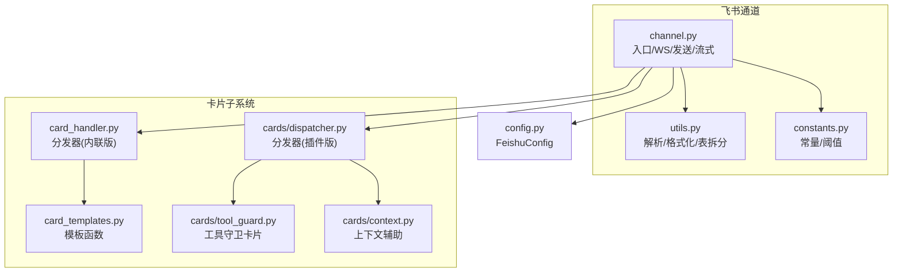
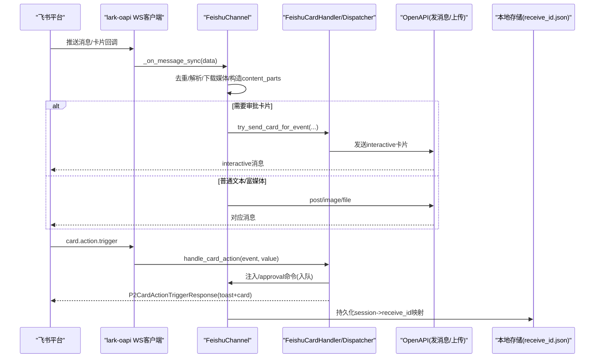
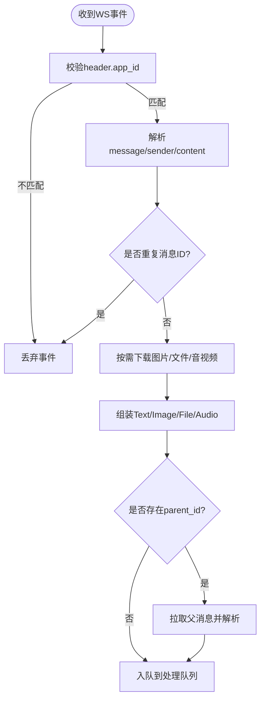
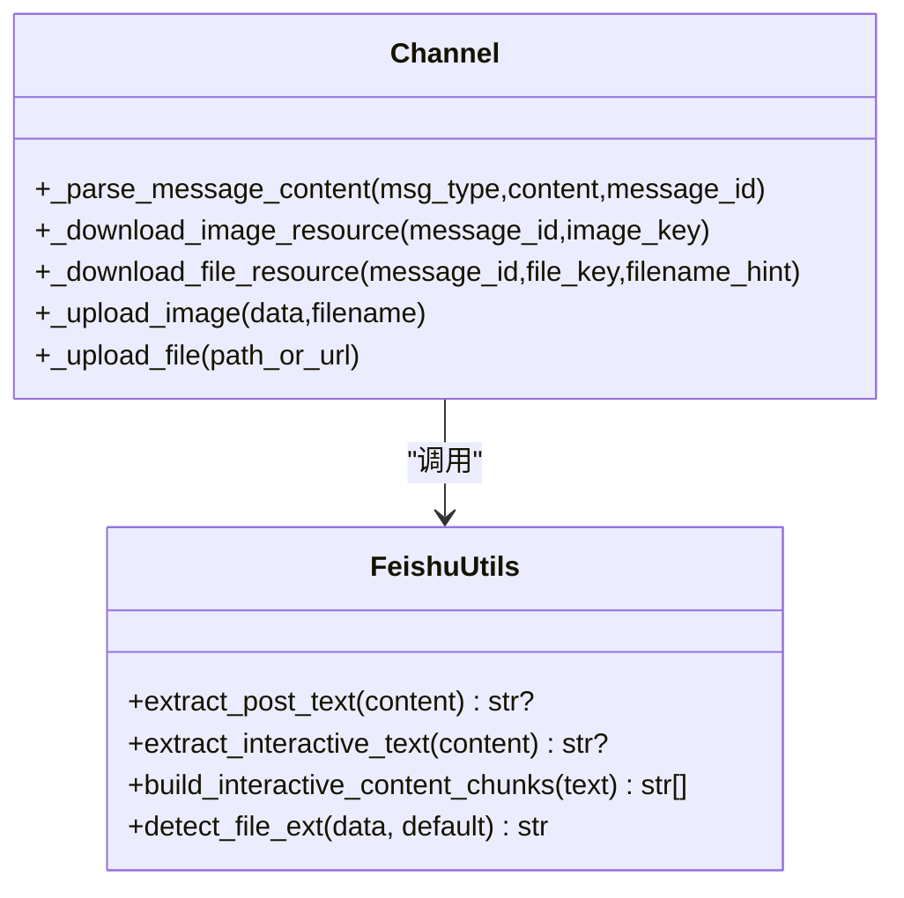
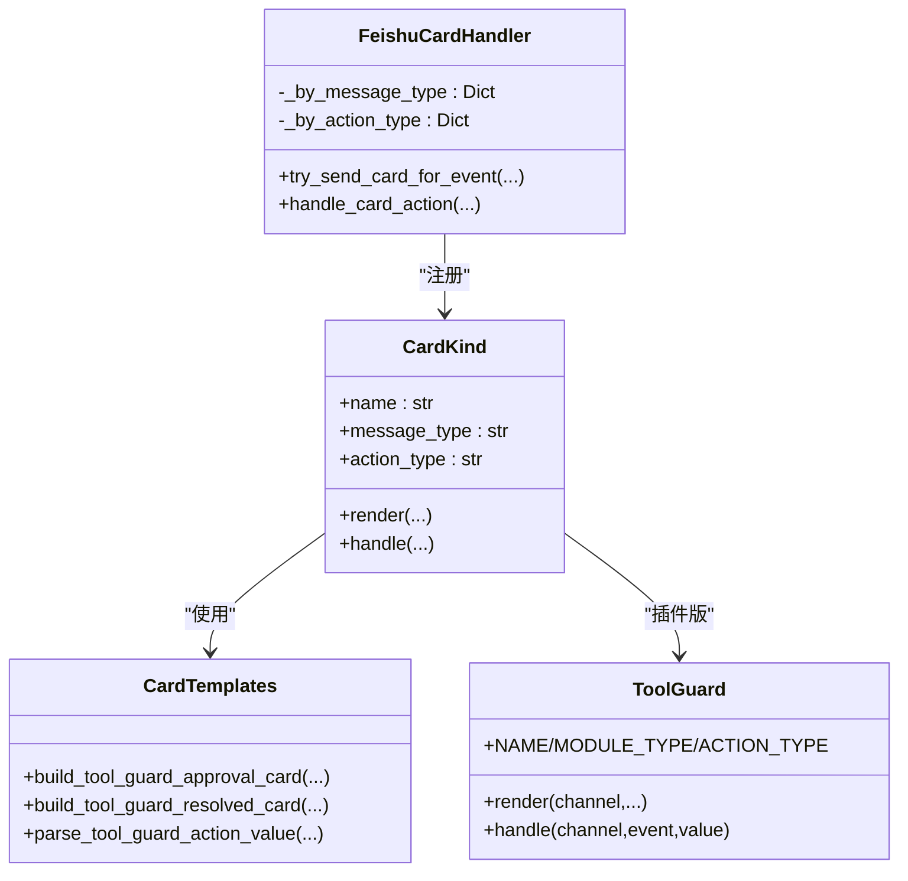
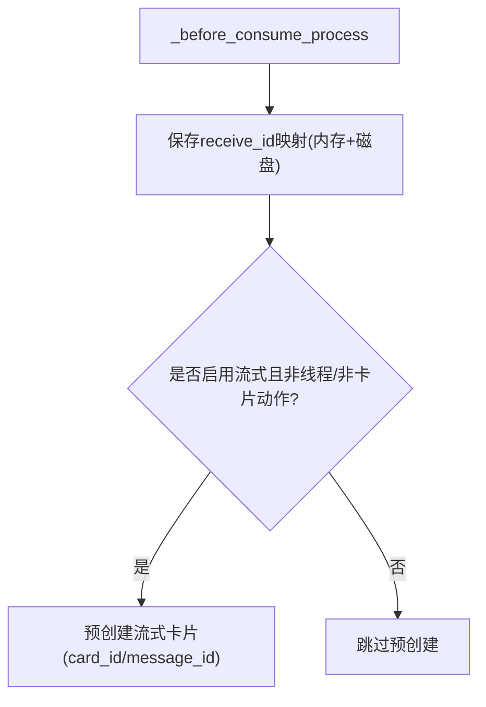
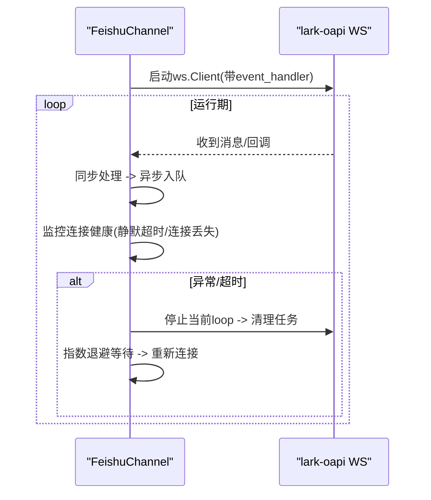
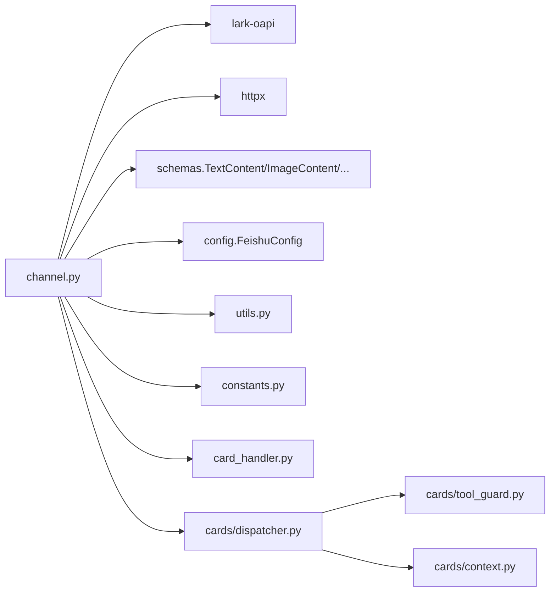

# 飞书渠道

<cite>
**本文引用的文件**   
- [channel.py](file://src/qwenpaw/app/channels/feishu/channel.py)
- [card_handler.py](file://src/qwenpaw/app/channels/feishu/card_handler.py)
- [card_templates.py](file://src/qwenpaw/app/channels/feishu/card_templates.py)
- [context.py](file://src/qwenpaw/app/channels/feishu/cards/context.py)
- [dispatcher.py](file://src/qwenpaw/app/channels/feishu/cards/dispatcher.py)
- [tool_guard.py](file://src/qwenpaw/app/channels/feishu/cards/tool_guard.py)
- [utils.py](file://src/qwenpaw/app/channels/feishu/utils.py)
- [constants.py](file://src/qwenpaw/app/channels/feishu/constants.py)
- [config.py](file://src/qwenpaw/config/config.py)
</cite>

## 目录
1. [简介](#简介)
2. [项目结构](#项目结构)
3. [核心组件](#核心组件)
4. [架构总览](#架构总览)
5. [详细组件分析](#详细组件分析)
6. [依赖关系分析](#依赖关系分析)
7. [性能与稳定性](#性能与稳定性)
8. [故障排查指南](#故障排查指南)
9. [结论](#结论)
10. [附录：配置与开发指南](#附录配置与开发指南)

## 简介
本章节面向“飞书（Lark）渠道”的集成与二次开发，覆盖以下关键主题：
- 事件订阅机制：基于 lark-oapi WebSocket 长连接接收消息与卡片回调。
- 消息卡片系统与交互回调：统一的卡片分发器、模板构建与解析、工具守卫审批卡片。
- 上下文管理与状态持久化：会话路由、receive_id 映射持久化、线程/群组会话策略。
- 消息格式转换与富媒体处理：文本、图片、文件、音视频、引用回复、Markdown 表格拆分。
- 权限控制与安全验证：加密密钥、校验令牌、跨实例 app_id 防护、超时与重试。
- Webhook 设置、事件处理流程与错误恢复：心跳检测、断线重连、指数退避。
- 卡片开发指南与调试技巧：新增卡片类型、注册方式、日志与回退策略。

## 项目结构
飞书渠道位于 channels/feishu 下，采用“通道 + 卡片子系统”的分层组织：
- channel.py：通道主实现，负责 WS 连接、消息收发、流式卡片、资源上传下载、会话路由等。
- card_handler.py / cards/*：卡片分发器与具体卡片实现（如工具守卫审批）。
- card_templates.py：纯数据模板函数（构建/解析 JSON），便于测试与复用。
- utils.py：通用工具（结构化文本提取、表格拆分、文件扩展名探测等）。
- constants.py：常量（文件大小上限、WS 重连参数、流式更新间隔等）。
- config.py：FeishuConfig 配置项（app_id、domain、streaming_enabled 等）。

图表来源
- [channel.py:196-383](file://src/qwenpaw/app/channels/feishu/channel.py#L196-L383)
- [card_handler.py:95-146](file://src/qwenpaw/app/channels/feishu/card_handler.py#L95-L146)
- [dispatcher.py:78-123](file://src/qwenpaw/app/channels/feishu/cards/dispatcher.py#L78-L123)
- [card_templates.py:58-137](file://src/qwenpaw/app/channels/feishu/card_templates.py#L58-L137)
- [tool_guard.py:251-308](file://src/qwenpaw/app/channels/feishu/cards/tool_guard.py#L251-L308)
- [utils.py:472-486](file://src/qwenpaw/app/channels/feishu/utils.py#L472-L486)
- [constants.py:1-42](file://src/qwenpaw/app/channels/feishu/constants.py#L1-L42)
- [config.py:252-270](file://src/qwenpaw/config/config.py#L252-L270)

章节来源
- [channel.py:196-383](file://src/qwenpaw/app/channels/feishu/channel.py#L196-L383)
- [card_handler.py:95-146](file://src/qwenpaw/app/channels/feishu/card_handler.py#L95-L146)
- [dispatcher.py:78-123](file://src/qwenpaw/app/channels/feishu/cards/dispatcher.py#L78-L123)
- [card_templates.py:58-137](file://src/qwenpaw/app/channels/feishu/card_templates.py#L58-L137)
- [tool_guard.py:251-308](file://src/qwenpaw/app/channels/feishu/cards/tool_guard.py#L251-L308)
- [utils.py:472-486](file://src/qwenpaw/app/channels/feishu/utils.py#L472-L486)
- [constants.py:1-42](file://src/qwenpaw/app/channels/feishu/constants.py#L1-L42)
- [config.py:252-270](file://src/qwenpaw/config/config.py#L252-L270)

## 核心组件
- FeishuChannel：通道主类，封装 WS 长连接、消息入队、内容解析、富媒体上传/下载、流式卡片、会话路由与持久化。
- FeishuCardHandler（内联版）：统一入口，按 message_type/action_type 分发渲染与回调处理。
- Dispatcher（插件版）：将卡片逻辑解耦到独立模块，通过 register 动态注册。
- Card Templates：纯函数构建/解析卡片 JSON，无副作用，便于单测与复用。
- Tool Guard Approval Card：工具守卫审批卡片，支持 approve/deny 按钮与结果回写。
- Utils：结构化文本提取、Markdown 表格转 native table、分块发送、文件扩展名探测等。
- Constants：阈值与行为开关（文件大小、WS 重连、流式最小间隔等）。
- Config：FeishuConfig 字段（app_id、encrypt_key、verification_token、domain、streaming_enabled、share_session_in_group 等）。

章节来源
- [channel.py:196-383](file://src/qwenpaw/app/channels/feishu/channel.py#L196-L383)
- [card_handler.py:95-146](file://src/qwenpaw/app/channels/feishu/card_handler.py#L95-L146)
- [dispatcher.py:78-123](file://src/qwenpaw/app/channels/feishu/cards/dispatcher.py#L78-L123)
- [card_templates.py:58-137](file://src/qwenpaw/app/channels/feishu/card_templates.py#L58-L137)
- [tool_guard.py:251-308](file://src/qwenpaw/app/channels/feishu/cards/tool_guard.py#L251-L308)
- [utils.py:472-486](file://src/qwenpaw/app/channels/feishu/utils.py#L472-L486)
- [constants.py:1-42](file://src/qwenpaw/app/channels/feishu/constants.py#L1-L42)
- [config.py:252-270](file://src/qwenpaw/config/config.py#L252-L270)

## 架构总览
下图展示从飞书事件到内部处理、再到卡片渲染与回调的全链路。

图表来源
- [channel.py:2506-2706](file://src/qwenpaw/app/channels/feishu/channel.py#L2506-L2706)
- [channel.py:624-852](file://src/qwenpaw/app/channels/feishu/channel.py#L624-L852)
- [card_handler.py:151-216](file://src/qwenpaw/app/channels/feishu/card_handler.py#L151-L216)
- [dispatcher.py:128-191](file://src/qwenpaw/app/channels/feishu/cards/dispatcher.py#L128-L191)
- [channel.py:1818-1891](file://src/qwenpaw/app/channels/feishu/channel.py#L1818-L1891)

## 详细组件分析

### 事件订阅与消息处理
- 使用 lark-oapi ws.Client 建立长连接，注册 p2.im.message.receive.v1 与 p2.card.action.trigger 处理器。
- 在 WS 线程中同步处理事件，再异步调度至主循环；包含跨实例 app_id 校验、过期消息丢弃、表情反应等。
- 消息解析引擎统一处理 text/post/image/file/media/audio/interactive，并自动下载媒体资源。
- 引用回复通过 GetMessage API 拉取父消息内容，拼接为前缀文本与媒体。

图表来源
- [channel.py:2506-2706](file://src/qwenpaw/app/channels/feishu/channel.py#L2506-L2706)
- [channel.py:624-852](file://src/qwenpaw/app/channels/feishu/channel.py#L624-L852)
- [channel.py:965-1112](file://src/qwenpaw/app/channels/feishu/channel.py#L965-L1112)
- [channel.py:1114-1218](file://src/qwenpaw/app/channels/feishu/channel.py#L1114-L1218)

章节来源
- [channel.py:2506-2706](file://src/qwenpaw/app/channels/feishu/channel.py#L2506-L2706)
- [channel.py:624-852](file://src/qwenpaw/app/channels/feishu/channel.py#L624-L852)
- [channel.py:965-1112](file://src/qwenpaw/app/channels/feishu/channel.py#L965-L1112)
- [channel.py:1114-1218](file://src/qwenpaw/app/channels/feishu/channel.py#L1114-L1218)

### 消息格式转换与富媒体处理
- 结构化文本提取：post/interactive 的 elements/body/title 等节点递归收集文本、链接、@提及、表格行列。
- Markdown 表格转 native table：解析 GFM 表格，生成 columns/rows，限制每卡最多 N 张表，超出则分块发送。
- 媒体下载：通过 GetMessageResource API 获取 image/file，写入 media_dir，自动探测扩展名。
- 媒体上传：CreateImage/CreateFile 上传后以 image_key/file_key 发送；音频根据后缀选择 msg_type。

图表来源
- [utils.py:237-249](file://src/qwenpaw/app/channels/feishu/utils.py#L237-L249)
- [utils.py:302-486](file://src/qwenpaw/app/channels/feishu/utils.py#L302-L486)
- [channel.py:965-1112](file://src/qwenpaw/app/channels/feishu/channel.py#L965-L1112)
- [channel.py:1339-1446](file://src/qwenpaw/app/channels/feishu/channel.py#L1339-L1446)

章节来源
- [utils.py:237-249](file://src/qwenpaw/app/channels/feishu/utils.py#L237-L249)
- [utils.py:302-486](file://src/qwenpaw/app/channels/feishu/utils.py#L302-L486)
- [channel.py:965-1112](file://src/qwenpaw/app/channels/feishu/channel.py#L965-L1112)
- [channel.py:1339-1446](file://src/qwenpaw/app/channels/feishu/channel.py#L1339-L1446)

### 卡片模板系统与交互回调
- 分发器设计：维护 by_message_type 与 by_action_type 两张表，分别用于出站渲染与入站回调。
- 模板函数：build_tool_guard_approval_card/build_tool_guard_resolved_card/parse_tool_guard_action_value 等纯函数。
- 工具守卫审批卡片：按钮 value 嵌入 session_ctx，回调时重建命令 /approval 入队，返回 toast 与 resolved card。
- 两种实现并存：内联版（card_handler.py）与插件版（cards/dispatcher.py + tool_guard.py），后者更利于扩展。

图表来源
- [card_handler.py:79-146](file://src/qwenpaw/app/channels/feishu/card_handler.py#L79-L146)
- [card_templates.py:58-137](file://src/qwenpaw/app/channels/feishu/card_templates.py#L58-L137)
- [dispatcher.py:62-123](file://src/qwenpaw/app/channels/feishu/cards/dispatcher.py#L62-L123)
- [tool_guard.py:36-42](file://src/qwenpaw/app/channels/feishu/cards/tool_guard.py#L36-L42)
- [tool_guard.py:251-308](file://src/qwenpaw/app/channels/feishu/cards/tool_guard.py#L251-L308)

章节来源
- [card_handler.py:79-146](file://src/qwenpaw/app/channels/feishu/card_handler.py#L79-L146)
- [card_templates.py:58-137](file://src/qwenpaw/app/channels/feishu/card_templates.py#L58-L137)
- [dispatcher.py:62-123](file://src/qwenpaw/app/channels/feishu/cards/dispatcher.py#L62-L123)
- [tool_guard.py:36-42](file://src/qwenpaw/app/channels/feishu/cards/tool_guard.py#L36-L42)
- [tool_guard.py:251-308](file://src/qwenpaw/app/channels/feishu/cards/tool_guard.py#L251-L308)

### 上下文管理与状态持久化
- 会话路由：to_handle 支持 feishu:sw:<short_session_id>、feishu:chat_id:...、feishu:open_id:... 等格式。
- receive_id 映射：内存字典 + 磁盘持久化（workspace 或全局配置目录），重启后可恢复。
- 群组/线程策略：topic thread 共享会话；可配置 share_session_in_group 使群成员共享同一会话。
- 前置保存：_before_consume_process 保存 receive_id 并预创建流式卡片（非线程、非卡片动作）。

图表来源
- [channel.py:2471-2505](file://src/qwenpaw/app/channels/feishu/channel.py#L2471-L2505)
- [channel.py:1219-1317](file://src/qwenpaw/app/channels/feishu/channel.py#L1219-L1317)
- [channel.py:385-404](file://src/qwenpaw/app/channels/feishu/channel.py#L385-L404)
- [channel.py:829-839](file://src/qwenpaw/app/channels/feishu/channel.py#L829-L839)

章节来源
- [channel.py:2471-2505](file://src/qwenpaw/app/channels/feishu/channel.py#L2471-L2505)
- [channel.py:1219-1317](file://src/qwenpaw/app/channels/feishu/channel.py#L1219-L1317)
- [channel.py:385-404](file://src/qwenpaw/app/channels/feishu/channel.py#L385-L404)
- [channel.py:829-839](file://src/qwenpaw/app/channels/feishu/channel.py#L829-L839)

### 权限控制与安全验证
- 事件加密与校验：encrypt_key、verification_token 传入 EventDispatcherHandler.builder。
- 跨实例隔离：WS 回调中校验 header.app_id，避免多实例互相消费事件。
- 超时与限流：Contact API 用户名片段超时、WS 静默超时强制重连、流式更新最小间隔。
- 文件安全：大小限制、magic bytes 探测扩展名、URL 白名单（http/https/file）。

章节来源
- [channel.py:2506-2706](file://src/qwenpaw/app/channels/feishu/channel.py#L2506-L2706)
- [channel.py:624-667](file://src/qwenpaw/app/channels/feishu/channel.py#L624-L667)
- [constants.py:1-42](file://src/qwenpaw/app/channels/feishu/constants.py#L1-L42)
- [utils.py:58-74](file://src/qwenpaw/app/channels/feishu/utils.py#L58-L74)

### Webhook 设置与事件处理流程
- 长连接模式：无需公网 IP，使用 lark-oapi ws.Client 建立连接，SDK 内部 ping/pong。
- 健康检查：监控 last_ws_recv_time 与 _conn 状态，超过阈值主动断开触发重连。
- 指数退避：首次失败立即重连，后续按因子增长最大延迟上限。

图表来源
- [channel.py:2506-2706](file://src/qwenpaw/app/channels/feishu/channel.py#L2506-L2706)

章节来源
- [channel.py:2506-2706](file://src/qwenpaw/app/channels/feishu/channel.py#L2506-L2706)

### 错误恢复机制
- 去重：processed_message_ids 有序集合，超限裁剪。
- 过期消息：create_time 与 clock_offset 计算年龄，超过阈值丢弃。
- 资源下载失败：记录诊断提示，继续处理其他部分。
- 卡片渲染/回调异常：捕获异常并返回空响应，保证 UI 稳定。

章节来源
- [channel.py:680-686](file://src/qwenpaw/app/channels/feishu/channel.py#L680-L686)
- [channel.py:647-656](file://src/qwenpaw/app/channels/feishu/channel.py#L647-L656)
- [channel.py:985-1112](file://src/qwenpaw/app/channels/feishu/channel.py#L985-L1112)
- [card_handler.py:175-180](file://src/qwenpaw/app/channels/feishu/card_handler.py#L175-L180)
- [dispatcher.py:153-158](file://src/qwenpaw/app/channels/feishu/cards/dispatcher.py#L153-L158)

## 依赖关系分析
- 外部依赖：lark-oapi（WS/REST）、httpx（HTTP 客户端）。
- 内部依赖：BaseChannel、schemas（内容模型）、config（FeishuConfig）、utils/constants。
- 卡片子系统：card_handler.py 与 cards/dispatcher.py 提供两套分发实现，后者更模块化。

图表来源
- [channel.py:121-175](file://src/qwenpaw/app/channels/feishu/channel.py#L121-L175)
- [channel.py:31-48](file://src/qwenpaw/app/channels/feishu/channel.py#L31-L48)
- [card_handler.py:1-26](file://src/qwenpaw/app/channels/feishu/card_handler.py#L1-L26)
- [dispatcher.py:1-43](file://src/qwenpaw/app/channels/feishu/cards/dispatcher.py#L1-L43)

章节来源
- [channel.py:121-175](file://src/qwenpaw/app/channels/feishu/channel.py#L121-L175)
- [channel.py:31-48](file://src/qwenpaw/app/channels/feishu/channel.py#L31-L48)
- [card_handler.py:1-26](file://src/qwenpaw/app/channels/feishu/card_handler.py#L1-L26)
- [dispatcher.py:1-43](file://src/qwenpaw/app/channels/feishu/cards/dispatcher.py#L1-L43)

## 性能与稳定性
- 流式卡片：CardKit streaming card，最小更新间隔 0.15s，避免高频刷新导致限流。
- 表格分块：当文本含表格时，拆分为多个 interactive 卡片，每张不超过固定数量表格。
- 资源上传：大文件限制 30MB，类型映射优化（doc/xls/ppt/opus）。
- WS 健康：静默超时 240s 强制重连，指数退避最大 60s。

章节来源
- [constants.py:34-42](file://src/qwenpaw/app/channels/feishu/constants.py#L34-L42)
- [utils.py:390-486](file://src/qwenpaw/app/channels/feishu/utils.py#L390-L486)
- [channel.py:1396-1446](file://src/qwenpaw/app/channels/feishu/channel.py#L1396-L1446)
- [channel.py:2577-2592](file://src/qwenpaw/app/channels/feishu/channel.py#L2577-L2592)

## 故障排查指南
- 无法接收消息：检查 encrypt_key/verification_token 是否正确；确认 WS 线程存活与健康检查状态。
- 卡片按钮无效：确认已订阅 card.action.trigger 回调；查看卡片 value 中的 type 是否匹配。
- 媒体下载失败：检查 image_key/file_key 是否存在；查看日志中的 “[image: download failed]” 等提示。
- 流式卡片未显示：确认 streaming_enabled 开启；线程回复不支持流式；检查 card_id 创建与更新日志。
- 会话找不到目标：确保用户至少发过一次消息以持久化 receive_id；或在 dispatch.meta 显式设置 feishu_receive_id。

章节来源
- [channel.py:2710-2736](file://src/qwenpaw/app/channels/feishu/channel.py#L2710-L2736)
- [card_handler.py:182-216](file://src/qwenpaw/app/channels/feishu/card_handler.py#L182-L216)
- [channel.py:985-1112](file://src/qwenpaw/app/channels/feishu/channel.py#L985-L1112)
- [channel.py:2256-2385](file://src/qwenpaw/app/channels/feishu/channel.py#L2256-L2385)
- [channel.py:1818-1891](file://src/qwenpaw/app/channels/feishu/channel.py#L1818-L1891)

## 结论
飞书渠道实现了高可用的事件订阅、丰富的消息与卡片能力、完善的上下文与状态管理，并通过流式卡片提升用户体验。其模块化卡片系统便于扩展新的交互场景，同时具备健壮的错误恢复与性能优化策略。

## 附录：配置与开发指南

### 配置步骤与环境变量
- 必填：FEISHU_APP_ID、FEISHU_APP_SECRET。
- 可选：FEISHU_ENCRYPT_KEY、FEISHU_VERIFICATION_TOKEN、FEISHU_MEDIA_DIR、FEISHU_DOMAIN(feishu/lark)、FEISHU_STREAMING_ENABLED、FEISHU_SHARE_SESSION_IN_GROUP。
- 控制台表单支持扫码授权与字段校验，详见前端 Drawer 逻辑。

章节来源
- [config.py:252-270](file://src/qwenpaw/config/config.py#L252-L270)
- [channel.py:300-336](file://src/qwenpaw/app/channels/feishu/channel.py#L300-L336)

### Webhook 设置
- 推荐使用 WebSocket 长连接模式，无需公网 IP。
- 如需回调卡片按钮，需在飞书后台订阅 card.action.trigger 事件，并确保服务端正确注册处理器。

章节来源
- [channel.py:2506-2706](file://src/qwenpaw/app/channels/feishu/channel.py#L2506-L2706)
- [card_handler.py:182-216](file://src/qwenpaw/app/channels/feishu/card_handler.py#L182-L216)

### 事件处理流程
- 入站：WS 接收 -> 去重/解析/下载媒体 -> 构造 content_parts -> 入队。
- 出站：文本优先 post/markdown，含表格则 split 为 interactive 卡片；图片/文件走上传接口。
- 流式：预创建 CardKit 卡片，增量更新 markdown 元素，结束时关闭流式并设置摘要。

章节来源
- [channel.py:624-852](file://src/qwenpaw/app/channels/feishu/channel.py#L624-L852)
- [channel.py:1581-1615](file://src/qwenpaw/app/channels/feishu/channel.py#L1581-L1615)
- [channel.py:2256-2385](file://src/qwenpaw/app/channels/feishu/channel.py#L2256-L2385)

### 卡片开发指南
- 新增卡片类型（推荐插件版）：
  1) 在 cards/ 下新建模块，定义 NAME/MESSAGE_TYPE/ACTION_TYPE 及 render/handle。
  2) 在 dispatcher._register_kinds 中 register(CardKind(...))。
  3) 模板函数放入 card_templates.py 或模块内，保持纯函数风格。
- 内联版快速接入：在 card_handler._register_kinds 中注册 CardKind(render/handle)。
- 调试技巧：
  - 关注日志关键字：“feishu card render failed”、“feishu card action enqueued”。
  - 检查卡片 value 的 type 是否与 ACTION_TYPE 一致。
  - 对复杂表格输出，先打印 build_interactive_content_chunks 的结果进行验证。

章节来源
- [dispatcher.py:110-123](file://src/qwenpaw/app/channels/feishu/cards/dispatcher.py#L110-L123)
- [card_handler.py:131-146](file://src/qwenpaw/app/channels/feishu/card_handler.py#L131-L146)
- [card_templates.py:58-137](file://src/qwenpaw/app/channels/feishu/card_templates.py#L58-L137)
- [utils.py:472-486](file://src/qwenpaw/app/channels/feishu/utils.py#L472-L486)