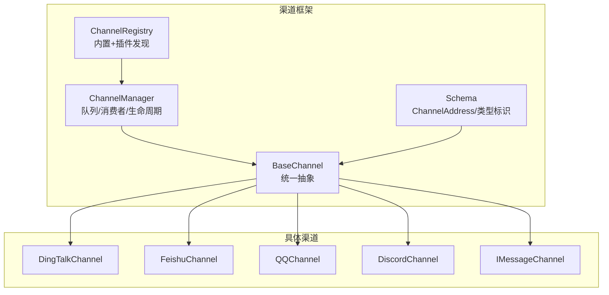
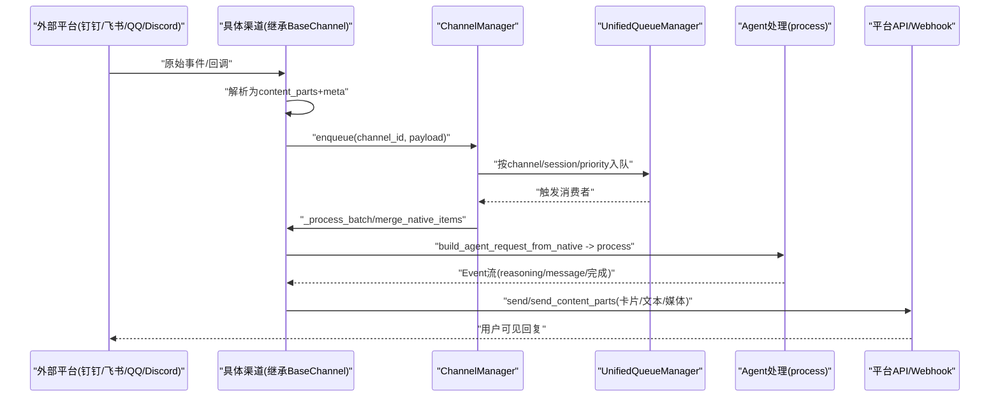
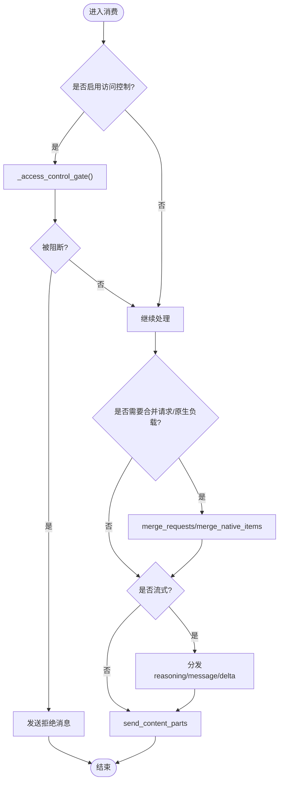
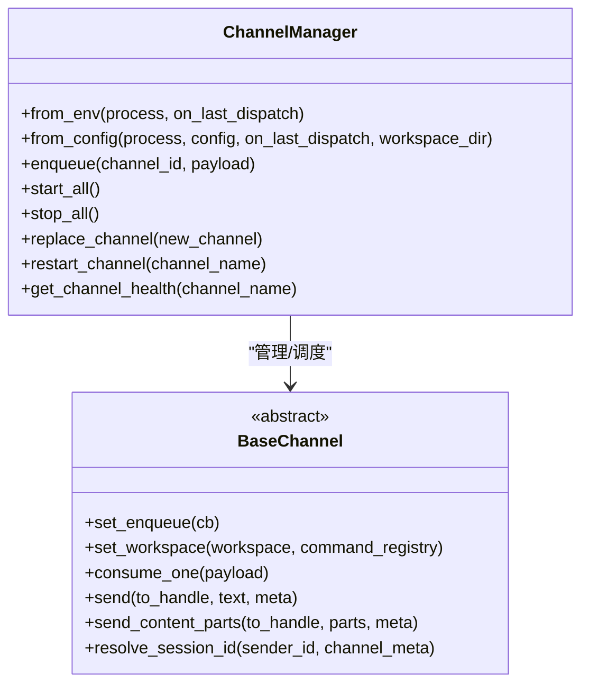
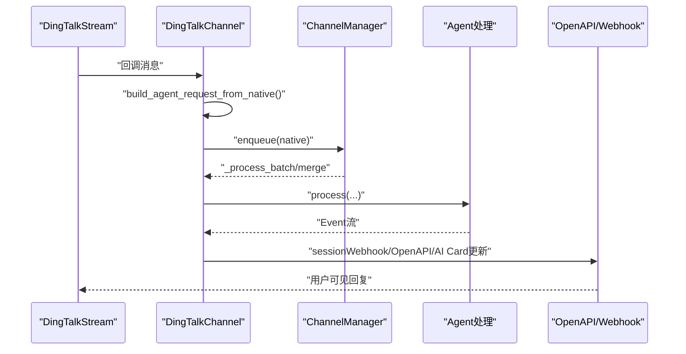
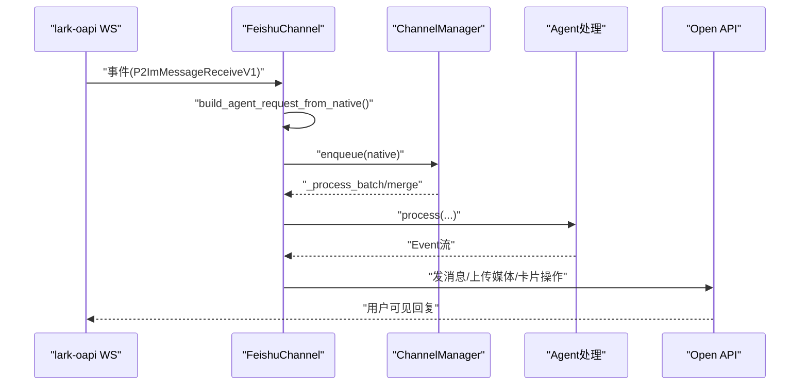
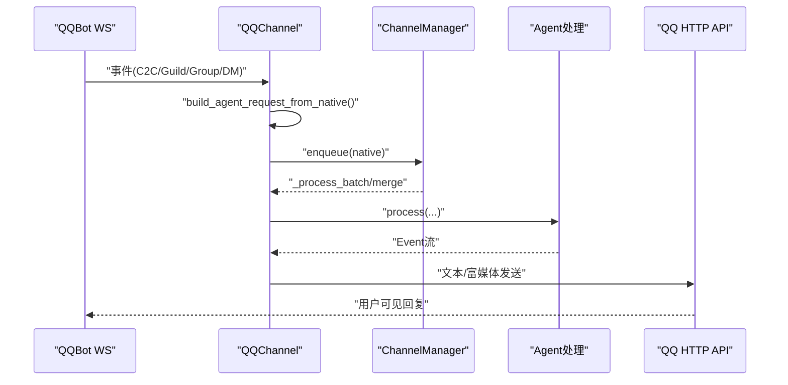
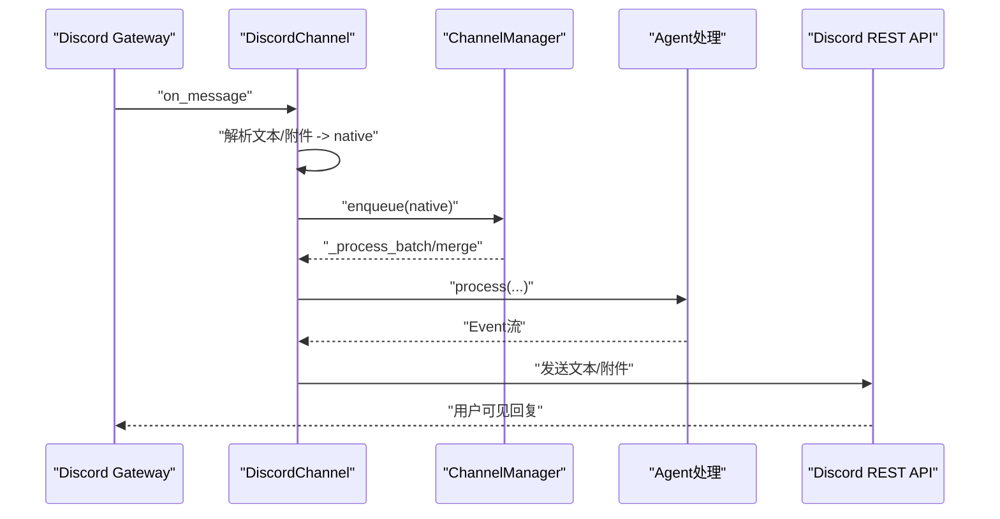
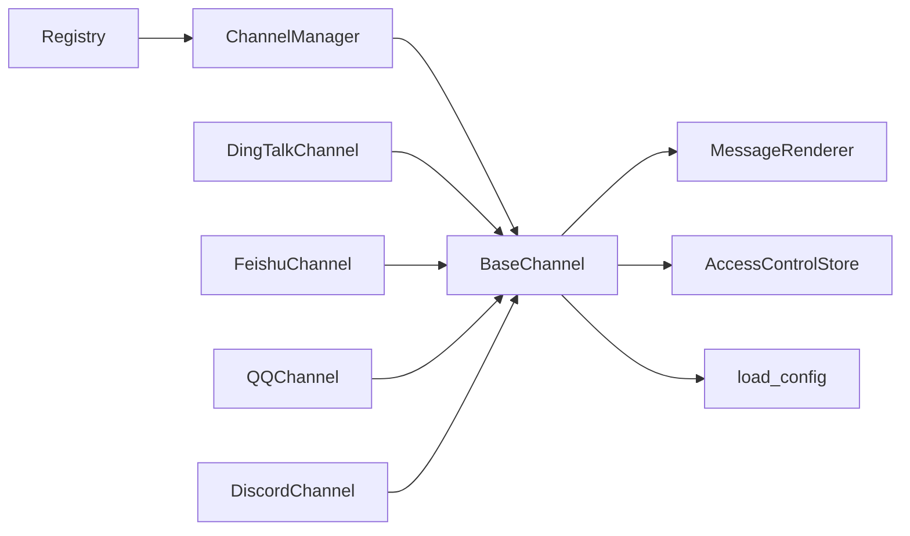

# 多渠道接入

<cite>
**本文引用的文件**
- [base.py](file://src/qwenpaw/app/channels/base.py)
- [manager.py](file://src/qwenpaw/app/channels/manager.py)
- [registry.py](file://src/qwenpaw/app/channels/registry.py)
- [schema.py](file://src/qwenpaw/app/channels/schema.py)
- [dingtalk/channel.py](file://src/qwenpaw/app/channels/dingtalk/channel.py)
- [feishu/channel.py](file://src/qwenpaw/app/channels/feishu/channel.py)
- [qq/channel.py](file://src/qwenpaw/app/channels/qq/channel.py)
- [discord_/channel.py](file://src/qwenpaw/app/channels/discord_/channel.py)
</cite>

## 目录
1. [简介](#简介)
2. [项目结构](#项目结构)
3. [核心组件](#核心组件)
4. [架构总览](#架构总览)
5. [详细组件分析](#详细组件分析)
6. [依赖关系分析](#依赖关系分析)
7. [性能与稳定性](#性能与稳定性)
8. [故障排查指南](#故障排查指南)
9. [结论](#结论)
10. [附录：渠道配置与自定义开发](#附录渠道配置与自定义开发)

## 简介
本文件面向 QwenPaw 的多渠道接入系统，系统性阐述渠道架构设计、已支持的渠道列表、配置方法、自定义渠道开发流程，以及关键实现细节、调用关系、接口与领域模型。重点覆盖钉钉、飞书、QQ、Discord、iMessage 等即时通讯平台的集成实现，并提供来自代码库的具体示例路径，帮助初学者快速上手，同时为有经验的开发者提供足够的技术深度。

## 项目结构
QwenPaw 的渠道子系统位于 src/qwenpaw/app/channels 下，采用“统一基类 + 注册表 + 管理器”的分层设计：
- 基类 BaseChannel：定义统一的消费、发送、流式处理、去抖、访问控制等通用能力。
- 注册表 registry：集中发现内置与插件渠道类。
- 管理器 manager：负责队列、优先级路由、批合并、生命周期管理（启动/停止/重启）。
- 具体渠道实现：每个平台一个子包，如 dingtalk、feishu、qq、discord_、imessage 等。

图表来源
- [base.py:80-170](file://src/qwenpaw/app/channels/base.py#L80-L170)
- [registry.py:18-37](file://src/qwenpaw/app/channels/registry.py#L18-L37)
- [manager.py:68-112](file://src/qwenpaw/app/channels/manager.py#L68-L112)
- [schema.py:12-48](file://src/qwenpaw/app/channels/schema.py#L12-L48)

章节来源
- [base.py:80-170](file://src/qwenpaw/app/channels/base.py#L80-L170)
- [registry.py:18-37](file://src/qwenpaw/app/channels/registry.py#L18-L37)
- [manager.py:68-112](file://src/qwenpaw/app/channels/manager.py#L68-L112)
- [schema.py:12-48](file://src/qwenpaw/app/channels/schema.py#L12-L48)

## 核心组件
- BaseChannel
  - 职责：统一消息消费入口 consume_one/_consume_with_tracker；统一发送 send/send_content_parts；流式事件分发 on_streaming_start/delta/end；去抖与合并；访问控制门控；会话路由 resolve_session_id；任务追踪与取消。
  - 关键能力：
    - 无文本内容去抖：将非文本内容缓冲，直到出现文本或音频时再合并发送。
    - 原生负载合并：对同一会话的快速多片段进行合并，减少重复处理。
    - 流式渲染：支持 reasoning/message 两类可流式文本，按 index 分箱并节流刷新。
    - 访问控制：白名单/黑名单/待审批，支持 DM/群组独立开关。
- ChannelManager
  - 职责：从配置/环境变量构建渠道实例；统一入队 enqueue；按 channel/session/priority 路由到 UnifiedQueueManager；批量合并与消费；健康检查、动态替换与重启。
  - 关键能力：
    - 线程安全入队：call_soon_threadsafe 投递到事件循环。
    - 批处理：同键消息拉取后合并，提升吞吐。
    - 优雅关闭：取消入队任务、停止消费者、依次 stop 各渠道。
- Registry
  - 职责：加载内置渠道映射（key -> module.class），兼容插件注册；缓存避免重复导入。
- Schema
  - 职责：统一路由地址 ChannelAddress（kind/id/extra）；内置渠道类型常量；默认渠道。

章节来源
- [base.py:80-170](file://src/qwenpaw/app/channels/base.py#L80-L170)
- [base.py:529-585](file://src/qwenpaw/app/channels/base.py#L529-L585)
- [base.py:604-793](file://src/qwenpaw/app/channels/base.py#L604-L793)
- [manager.py:68-112](file://src/qwenpaw/app/channels/manager.py#L68-L112)
- [manager.py:364-473](file://src/qwenpaw/app/channels/manager.py#L364-L473)
- [registry.py:18-37](file://src/qwenpaw/app/channels/registry.py#L18-L37)
- [schema.py:12-48](file://src/qwenpaw/app/channels/schema.py#L12-L48)

## 架构总览
下图展示从外部消息到达至回复返回的整体流程，包括通道接入、统一队列、Agent 处理、流式推送与平台发送。

图表来源
- [manager.py:39-66](file://src/qwenpaw/app/channels/manager.py#L39-L66)
- [manager.py:377-473](file://src/qwenpaw/app/channels/manager.py#L377-L473)
- [base.py:604-793](file://src/qwenpaw/app/channels/base.py#L604-L793)
- [dingtalk/channel.py:390-417](file://src/qwenpaw/app/channels/dingtalk/channel.py#L390-L417)
- [feishu/channel.py:406-442](file://src/qwenpaw/app/channels/feishu/channel.py#L406-L442)
- [qq/channel.py:644-680](file://src/qwenpaw/app/channels/qq/channel.py#L644-L680)
- [discord_/channel.py:301-314](file://src/qwenpaw/app/channels/discord_/channel.py#L301-L314)

## 详细组件分析

### 基础通道 BaseChannel
- 统一消费与追踪
  - _consume_with_tracker：创建或获取 Chat，通过 TaskTracker 绑定任务，支持 /stop 取消。
  - merge_requests/merge_native_items：对同一会话的请求或原生负载进行合并，降低抖动与重复。
- 流式事件分发
  - _dispatch_streaming_event：识别 message/reasoning/content delta，驱动 on_streaming_start/delta/end。
  - 分箱与节流：按 content_index 拆分流式块，最小间隔与超时保护，避免频繁网络调用。
- 访问控制
  - _access_control_gate：基于 ACL 存储判断白名单/黑名单/待审批，必要时回发拒绝信息。
- 去抖策略
  - _apply_no_text_debounce：无文本内容先缓冲，遇到文本或音频立即合并输出。

图表来源
- [base.py:529-585](file://src/qwenpaw/app/channels/base.py#L529-L585)
- [base.py:604-793](file://src/qwenpaw/app/channels/base.py#L604-L793)
- [base.py:379-451](file://src/qwenpaw/app/channels/base.py#L379-L451)
- [base.py:302-337](file://src/qwenpaw/app/channels/base.py#L302-L337)

章节来源
- [base.py:80-170](file://src/qwenpaw/app/channels/base.py#L80-L170)
- [base.py:529-585](file://src/qwenpaw/app/channels/base.py#L529-L585)
- [base.py:604-793](file://src/qwenpaw/app/channels/base.py#L604-L793)
- [base.py:302-337](file://src/qwenpaw/app/channels/base.py#L302-L337)
- [base.py:379-451](file://src/qwenpaw/app/channels/base.py#L379-L451)

### 通道管理器 ChannelManager
- 初始化与构建
  - from_env/from_config：根据可用渠道集合与配置项构建渠道实例，注入 process/on_reply_sent 等参数。
- 入队与消费
  - enqueue：线程安全投递到事件循环；内部提取 session_id 与优先级，交由 UnifiedQueueManager。
  - _consume_queue：消费者循环，拉取并批量合并，调用 _process_batch。
- 生命周期
  - start_all/stop_all：启动所有渠道，后台连接；优雅关闭，取消任务与清理资源。
  - replace_channel/restart_channel：热替换与重启，保证不丢消息。

图表来源
- [manager.py:92-112](file://src/qwenpaw/app/channels/manager.py#L92-L112)
- [manager.py:364-473](file://src/qwenpaw/app/channels/manager.py#L364-L473)
- [manager.py:474-570](file://src/qwenpaw/app/channels/manager.py#L474-L570)
- [manager.py:610-695](file://src/qwenpaw/app/channels/manager.py#L610-L695)
- [base.py:474-490](file://src/qwenpaw/app/channels/base.py#L474-L490)

章节来源
- [manager.py:68-112](file://src/qwenpaw/app/channels/manager.py#L68-L112)
- [manager.py:364-473](file://src/qwenpaw/app/channels/manager.py#L364-L473)
- [manager.py:474-570](file://src/qwenpaw/app/channels/manager.py#L474-L570)
- [manager.py:610-695](file://src/qwenpaw/app/channels/manager.py#L610-L695)

### 注册表 Registry
- 内置渠道映射：key -> (module, class)，按需 import 并校验子类关系。
- 插件扩展：通过插件注册中心发现额外渠道，冲突时跳过。
- 缓存机制：进程级缓存，避免重复导入开销。

章节来源
- [registry.py:18-37](file://src/qwenpaw/app/channels/registry.py#L18-L37)
- [registry.py:101-135](file://src/qwenpaw/app/channels/registry.py#L101-L135)

### 协议与路由 Schema
- ChannelAddress：统一路由地址（kind/id/extra），to_handle 生成规则。
- BUILTIN_CHANNEL_TYPES：内置渠道类型常量集。
- DEFAULT_CHANNEL：默认渠道为 console。

章节来源
- [schema.py:12-48](file://src/qwenpaw/app/channels/schema.py#L12-L48)

### 钉钉 DingTalkChannel
- 特点
  - 使用 Stream 接收回调，ACK 后立即异步处理；支持 Markdown 与 AI Card 两种模式。
  - 主动推送：维护 sessionWebhook 映射（内存+磁盘持久化），支持 cron 与跨会话发送。
  - 去重：处理中消息 ID 集合防止重复。
  - 流式：AI Card 模式下支持实时增量更新。
- 关键实现
  - build_agent_request_from_native：将原生 dict 转为 AgentRequest，设置 channel_meta。
  - resolve_session_id/get_debounce_key：以 conversation_id 短后缀作为会话键，DM 场景附加 sender 隔离。
  - to_handle_from_target/_route_from_handle：支持 sw/webhook/url 多种目标形式。
  - _before_consume_process：保存 webhook、添加“思考中”表情、预创建 AI Card。
  - _on_consume_error：错误表情与错误消息回退。

图表来源
- [dingtalk/channel.py:390-417](file://src/qwenpaw/app/channels/dingtalk/channel.py#L390-L417)
- [dingtalk/channel.py:430-496](file://src/qwenpaw/app/channels/dingtalk/channel.py#L430-L496)
- [dingtalk/channel.py:535-552](file://src/qwenpaw/app/channels/dingtalk/channel.py#L535-L552)
- [dingtalk/channel.py:607-642](file://src/qwenpaw/app/channels/dingtalk/channel.py#L607-L642)

章节来源
- [dingtalk/channel.py:107-248](file://src/qwenpaw/app/channels/dingtalk/channel.py#L107-L248)
- [dingtalk/channel.py:390-417](file://src/qwenpaw/app/channels/dingtalk/channel.py#L390-L417)
- [dingtalk/channel.py:430-496](file://src/qwenpaw/app/channels/dingtalk/channel.py#L430-L496)
- [dingtalk/channel.py:535-552](file://src/qwenpaw/app/channels/dingtalk/channel.py#L535-L552)
- [dingtalk/channel.py:607-642](file://src/qwenpaw/app/channels/dingtalk/channel.py#L607-L642)

### 飞书 FeishuChannel
- 特点
  - WebSocket 长连接接收事件，Open API 发送；支持文本、图片、文件、音视频与交互卡片。
  - 群聊上下文：chat_id/message_id 放入元数据用于下游去重。
  - 时钟偏移校正：从服务器 Date 头计算偏移，过滤过期重试消息。
  - 昵称缓存：通过 Contact API 获取用户昵称并缓存。
- 关键实现
  - build_agent_request_from_native：构造 AgentRequest，优先使用 payload.session_id 避免短 ID 不一致。
  - resolve_session_id：群聊包含 app_id 后缀区分多机器人；私聊使用 open_id 短后缀。
  - _fetch_bot_open_id：通过 Open API 获取机器人 open_id。
  - _get_user_name_by_open_id：联系人 API 查询并缓存。

图表来源
- [feishu/channel.py:406-442](file://src/qwenpaw/app/channels/feishu/channel.py#L406-L442)
- [feishu/channel.py:385-404](file://src/qwenpaw/app/channels/feishu/channel.py#L385-L404)
- [feishu/channel.py:495-550](file://src/qwenpaw/app/channels/feishu/channel.py#L495-L550)
- [feishu/channel.py:552-617](file://src/qwenpaw/app/channels/feishu/channel.py#L552-L617)

章节来源
- [feishu/channel.py:196-300](file://src/qwenpaw/app/channels/feishu/channel.py#L196-L300)
- [feishu/channel.py:406-442](file://src/qwenpaw/app/channels/feishu/channel.py#L406-L442)
- [feishu/channel.py:385-404](file://src/qwenpaw/app/channels/feishu/channel.py#L385-L404)
- [feishu/channel.py:495-550](file://src/qwenpaw/app/channels/feishu/channel.py#L495-L550)
- [feishu/channel.py:552-617](file://src/qwenpaw/app/channels/feishu/channel.py#L552-L617)

### QQChannel
- 特点
  - WebSocket 接收事件，HTTP API 发送；支持 C2C、群聊、频道（Guild）、私信（DM）。
  - 富媒体：图片/视频/音频/文件上传与发送；URL 自动转链接占位符以避免 API 拒绝。
  - 心跳控制器：Timer 周期性发送心跳，维持连接。
  - 错误恢复：针对特定 OS 错误码进行重连；Markdown 失败回退纯文本。
- 关键实现
  - build_agent_request_from_native：构造 AgentRequest，填充 channel_meta。
  - _HeartbeatController：线程 Timer 管理心跳。
  - _sanitize_qq_text/_aggressive_sanitize_qq_text：去除 URL 与裸域名，避免 API 拒绝。
  - _upload_media_async/_send_media_message_async：富媒体上传与发送。

图表来源
- [qq/channel.py:644-680](file://src/qwenpaw/app/channels/qq/channel.py#L644-L680)
- [qq/channel.py:150-197](file://src/qwenpaw/app/channels/qq/channel.py#L150-L197)
- [qq/channel.py:216-236](file://src/qwenpaw/app/channels/qq/channel.py#L216-L236)
- [qq/channel.py:438-485](file://src/qwenpaw/app/channels/qq/channel.py#L438-L485)
- [qq/channel.py:488-523](file://src/qwenpaw/app/channels/qq/channel.py#L488-L523)

章节来源
- [qq/channel.py:644-680](file://src/qwenpaw/app/channels/qq/channel.py#L644-L680)
- [qq/channel.py:150-197](file://src/qwenpaw/app/channels/qq/channel.py#L150-L197)
- [qq/channel.py:216-236](file://src/qwenpaw/app/channels/qq/channel.py#L216-L236)
- [qq/channel.py:438-485](file://src/qwenpaw/app/channels/qq/channel.py#L438-L485)
- [qq/channel.py:488-523](file://src/qwenpaw/app/channels/qq/channel.py#L488-L523)

### DiscordChannel
- 特点
  - 使用 discord.py 客户端连接 Gateway；支持频道、DM、Thread；附件分类与下载。
  - 消息长度限制：超过 2000 字符自动分段，保持代码围栏完整性。
  - 去重：最近消息 ID 队列限幅，避免重复处理。
  - 健康检查：Gateway 状态与任务存活检测。
- 关键实现
  - on_message：解析文本与附件，构造 native 负载并入队。
  - _chunk_text：按行分割并保持代码围栏闭合。
  - send/send_content_parts：文本与媒体分别发送。
  - health_check/start/stop：Gateway 生命周期与健康探测。

图表来源
- [discord_/channel.py:301-314](file://src/qwenpaw/app/channels/discord_/channel.py#L301-L314)
- [discord_/channel.py:501-573](file://src/qwenpaw/app/channels/discord_/channel.py#L501-L573)
- [discord_/channel.py:575-616](file://src/qwenpaw/app/channels/discord_/channel.py#L575-L616)
- [discord_/channel.py:618-645](file://src/qwenpaw/app/channels/discord_/channel.py#L618-L645)
- [discord_/channel.py:721-754](file://src/qwenpaw/app/channels/discord_/channel.py#L721-L754)

章节来源
- [discord_/channel.py:46-122](file://src/qwenpaw/app/channels/discord_/channel.py#L46-L122)
- [discord_/channel.py:301-314](file://src/qwenpaw/app/channels/discord_/channel.py#L301-L314)
- [discord_/channel.py:501-573](file://src/qwenpaw/app/channels/discord_/channel.py#L501-L573)
- [discord_/channel.py:575-616](file://src/qwenpaw/app/channels/discord_/channel.py#L575-L616)
- [discord_/channel.py:618-645](file://src/qwenpaw/app/channels/discord_/channel.py#L618-L645)
- [discord_/channel.py:721-754](file://src/qwenpaw/app/channels/discord_/channel.py#L721-L754)

### iMessageChannel
- 说明
  - 在注册表中存在 imessage 映射，但当前仓库未提供详细实现源码片段。可按 BaseChannel 规范实现 build_agent_request_from_native、send/send_content_parts、resolve_session_id 等方法，并通过 ChannelManager 注册与运行。

章节来源
- [registry.py:18-37](file://src/qwenpaw/app/channels/registry.py#L18-L37)

## 依赖关系分析
- 组件耦合
  - ChannelManager 强依赖 BaseChannel 接口与 UnifiedQueueManager；各渠道实现仅依赖 BaseChannel 抽象。
  - Registry 解耦渠道发现，允许插件扩展。
- 直接/间接依赖
  - 具体渠道依赖各自平台 SDK（dingtalk_stream、lark-oapi、discord.py、QQ Bot SDK 等）。
  - BaseChannel 依赖渲染器 MessageRenderer、访问控制 AccessControlStore、配置工具 load_config。
- 潜在循环依赖
  - 通过 Manager 与 Registry 的单向引用避免循环；渠道实现不反向依赖 Manager。
- 外部集成点
  - 平台 API/Webhook/Gateway；本地文件系统（媒体目录、webhook 持久化）；TaskTracker/ChatManager（工作区）。

图表来源
- [registry.py:18-37](file://src/qwenpaw/app/channels/registry.py#L18-L37)
- [manager.py:68-112](file://src/qwenpaw/app/channels/manager.py#L68-L112)
- [base.py:157-169](file://src/qwenpaw/app/channels/base.py#L157-L169)

章节来源
- [registry.py:18-37](file://src/qwenpaw/app/channels/registry.py#L18-L37)
- [manager.py:68-112](file://src/qwenpaw/app/channels/manager.py#L68-L112)
- [base.py:157-169](file://src/qwenpaw/app/channels/base.py#L157-L169)

## 性能与稳定性
- 批合并与去抖
  - 同一会话快速消息合并，减少重复处理与网络往返。
  - 无文本内容缓冲，避免碎片化输出。
- 流式节流
  - 最小间隔与超时保护，避免高频 flush 导致拥塞。
- 队列与优先级
  - 按 channel/session/priority 路由，保障关键命令优先处理。
- 连接健壮性
  - 心跳与重连（QQ）、时钟偏移校正（飞书）、消息去重（各平台）。
- 资源管理
  - 优雅关闭、任务取消、临时文件清理（Discord 附件）。

[本节为通用指导，无需列出具体文件来源]

## 故障排查指南
- 常见问题
  - 无法收到消息：检查渠道 enabled 标志、环境变量/配置文件、WebSocket/Gateway 连接状态。
  - 重复消息：确认各渠道的消息去重逻辑是否生效（msg_id 集合/有序队列）。
  - 发送失败：查看平台 API 错误码与日志，注意 URL 限制（QQ）、Markdown 限制（QQ）、Token 过期（各平台）。
  - 流式卡顿：调整 _STREAM_DELTA_MIN_INTERVAL_S 与 _STREAM_FLUSH_TIMEOUT_S。
  - 访问控制拦截：检查 ACL 白名单/黑名单/待审批状态。
- 定位建议
  - 使用 ChannelManager.get_channel_health 检查渠道健康。
  - 查看日志中的 enqueue/consumer 记录，确认入队与消费链路。
  - 对于钉钉，检查 session_webhook 持久化与失效清理逻辑。
  - 对于飞书，核对 receive_id_store 与 nickname_cache 命中情况。
  - 对于 QQ，关注心跳定时器与重连计数。
  - 对于 Discord，确认 Gateway ready 状态与任务存活。

章节来源
- [manager.py:579-608](file://src/qwenpaw/app/channels/manager.py#L579-L608)
- [dingtalk/channel.py:643-676](file://src/qwenpaw/app/channels/dingtalk/channel.py#L643-L676)
- [feishu/channel.py:552-617](file://src/qwenpaw/app/channels/feishu/channel.py#L552-L617)
- [qq/channel.py:150-197](file://src/qwenpaw/app/channels/qq/channel.py#L150-L197)
- [discord_/channel.py:721-754](file://src/qwenpaw/app/channels/discord_/channel.py#L721-L754)

## 结论
QwenPaw 的多渠道接入系统通过统一的 BaseChannel 抽象、集中化的 ChannelManager 与可扩展的 Registry，实现了跨平台的一致体验与高内聚低耦合的架构。各渠道在遵循统一契约的前提下，灵活适配平台特性（卡片、富媒体、长连接、心跳、去重等），并通过流式与批合并优化用户体验与系统吞吐。未来可通过插件机制进一步扩展新渠道，满足更多业务场景。

[本节为总结，无需列出具体文件来源]

## 附录：渠道配置与自定义开发

### 支持的渠道列表
- 内置渠道（部分）：imessage、discord、dingtalk、feishu、qq、telegram、mattermost、mqtt、console、matrix、slack、voice、sip、wecom、xiaoyi、yuanbao、wechat、onebot。
- 插件渠道：通过插件注册中心动态发现并注册。

章节来源
- [registry.py:18-37](file://src/qwenpaw/app/channels/registry.py#L18-L37)
- [registry.py:101-135](file://src/qwenpaw/app/channels/registry.py#L101-L135)

### 渠道配置方法
- 环境变量方式
  - 各渠道提供 from_env 工厂方法，读取对应环境变量（如 DINGTALK_*、FEISHU_*、DISCORD_*、QQ_* 等）。
- 配置文件方式
  - 通过 from_config 工厂方法，从 agents.json 或 config.json 的 channels 节点读取 Pydantic 配置对象。
- 常用配置项（示例字段，具体以各渠道 Config 为准）
  - enabled：是否启用
  - client_id/app_id/token：平台鉴权
  - bot_prefix：回复前缀
  - dm_policy/group_policy：访问策略
  - allow_from/deny_message：白名单与拒绝提示
  - require_mention：群聊需 @ 机器人
  - streaming_enabled：是否启用流式
  - media_dir/workspace_dir：媒体与工作区目录
  - access_control_dm/access_control_group：访问控制开关

章节来源
- [dingtalk/channel.py:249-358](file://src/qwenpaw/app/channels/dingtalk/channel.py#L249-L358)
- [feishu/channel.py:300-383](file://src/qwenpaw/app/channels/feishu/channel.py#L300-L383)
- [discord_/channel.py:336-422](file://src/qwenpaw/app/channels/discord_/channel.py#L336-L422)
- [qq/channel.py:796-800](file://src/qwenpaw/app/channels/qq/channel.py#L796-L800)

### 自定义渠道开发步骤
- 新建渠道包与类
  - 在 channels 目录下新增子包，实现继承自 BaseChannel 的类，设置 channel 标识。
- 实现必要接口
  - build_agent_request_from_native：将平台原生负载转换为 AgentRequest。
  - send/send_content_parts：将文本与媒体发送到平台。
  - resolve_session_id：定义会话键，确保去重与路由正确。
  - get_to_handle_from_request：定义回复目标 handle 格式。
- 注册与发现
  - 若为内置渠道，需在 registry 的 _BUILTIN_SPECS 中添加映射。
  - 若为插件渠道，通过插件注册中心暴露 channel_class。
- 配置与运行
  - 提供 from_env/from_config 工厂方法，便于环境/配置加载。
  - 通过 ChannelManager.from_env/from_config 构建并启动。

章节来源
- [base.py:80-170](file://src/qwenpaw/app/channels/base.py#L80-L170)
- [registry.py:18-37](file://src/qwenpaw/app/channels/registry.py#L18-L37)
- [registry.py:101-135](file://src/qwenpaw/app/channels/registry.py#L101-L135)
- [manager.py:92-112](file://src/qwenpaw/app/channels/manager.py#L92-L112)