# 消息处理与路由

<cite>
**本文引用的文件**   
- [unified_queue_manager.py](file://src/qwenpaw/app/channels/unified_queue_manager.py)
- [manager.py](file://src/qwenpaw/app/channels/manager.py)
- [base.py](file://src/qwenpaw/app/channels/base.py)
- [renderer.py](file://src/qwenpaw/app/channels/renderer.py)
- [command_registry.py](file://src/qwenpaw/app/channels/command_registry.py)
- [access_control.py](file://src/qwenpaw/app/channels/access_control.py)
- [message_convert.py](file://src/qwenpaw/runtime/message_convert.py)
- [slash_command_registry.py](file://src/qwenpaw/runtime/slash_command_registry.py)
- [access_control_api.py](file://src/qwenpaw/app/routers/access_control.py)
</cite>

## 目录
1. [简介](#简介)
2. [项目结构](#项目结构)
3. [核心组件](#核心组件)
4. [架构总览](#架构总览)
5. [详细组件分析](#详细组件分析)
6. [依赖关系分析](#依赖关系分析)
7. [性能考虑](#性能考虑)
8. [故障排查指南](#故障排查指南)
9. [结论](#结论)
10. [附录](#附录)

## 简介
本文件聚焦 QwenPaw 的消息处理与路由系统，围绕统一队列管理器、消息渲染引擎、命令注册表与访问控制策略展开，完整记录消息从接收、解析、路由到响应的全链路流程。内容涵盖：
- 统一队列管理器的按会话与优先级隔离机制
- 消息渲染引擎对富文本、卡片与多媒体的转换与过滤
- 命令注册表的优先级映射与控制命令识别
- 访问控制的白名单/黑名单/待审批策略与持久化
- 权限验证、消息过滤、速率限制与负载均衡的实现要点
- 监控指标与性能调优建议

## 项目结构
消息处理与路由相关代码主要分布在 channels 与 runtime 两大模块：
- channels：通道抽象、统一队列、渲染器、命令优先级、访问控制
- runtime：消息格式转换、斜杠命令注册与分发

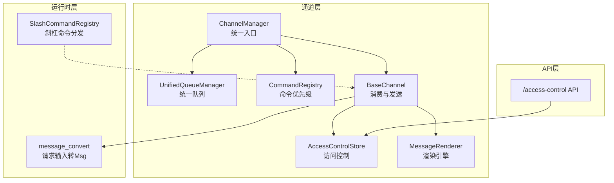

图表来源
- [manager.py:68-112](file://src/qwenpaw/app/channels/manager.py#L68-L112)
- [unified_queue_manager.py:60-118](file://src/qwenpaw/app/channels/unified_queue_manager.py#L60-L118)
- [command_registry.py:23-63](file://src/qwenpaw/app/channels/command_registry.py#L23-L63)
- [access_control.py:157-216](file://src/qwenpaw/app/channels/access_control.py#L157-L216)
- [base.py:80-170](file://src/qwenpaw/app/channels/base.py#L80-L170)
- [renderer.py:78-104](file://src/qwenpaw/app/channels/renderer.py#L78-L104)
- [message_convert.py:63-166](file://src/qwenpaw/runtime/message_convert.py#L63-L166)
- [slash_command_registry.py:45-103](file://src/qwenpaw/runtime/slash_command_registry.py#L45-L103)
- [access_control_api.py:78-118](file://src/qwenpaw/app/routers/access_control.py#L78-L118)

章节来源
- [manager.py:68-112](file://src/qwenpaw/app/channels/manager.py#L68-L112)
- [unified_queue_manager.py:60-118](file://src/qwenpaw/app/channels/unified_queue_manager.py#L60-L118)
- [command_registry.py:23-63](file://src/qwenpaw/app/channels/command_registry.py#L23-L63)
- [access_control.py:157-216](file://src/qwenpaw/app/channels/access_control.py#L157-L216)
- [base.py:80-170](file://src/qwenpaw/app/channels/base.py#L80-L170)
- [renderer.py:78-104](file://src/qwenpaw/app/channels/renderer.py#L78-L104)
- [message_convert.py:63-166](file://src/qwenpaw/runtime/message_convert.py#L63-L166)
- [slash_command_registry.py:45-103](file://src/qwenpaw/runtime/slash_command_registry.py#L45-L103)
- [access_control_api.py:78-118](file://src/qwenpaw/app/routers/access_control.py#L78-L118)

## 核心组件
- 统一队列管理器（UnifiedQueueManager）
  - 以 (channel_id, session_id, priority_level) 为键，为每个键维护独立队列与消费者任务
  - 按需创建消费者，空闲自动清理，支持指标采集与增量统计
- ChannelManager
  - 负责通道实例生命周期、入队调度、批量合并与消费者循环
  - 集成 CommandRegistry 进行优先级分类，注入 Workspace 能力
- BaseChannel
  - 定义消费流程、去抖合并、流式事件派发、访问控制门控、发送封装
  - 通过 MessageRenderer 将内部消息转换为可发送的 Content Parts
- MessageRenderer
  - 根据 RenderStyle 输出 Text/Image/Audio/Video/File/Refusal 等部件
  - 支持工具调用/输出的格式化与过滤、思考内容过滤
- CommandRegistry
  - 将 /stop、/daemon 等控制命令映射到高优先级级别
  - 提供 O(1) 查询与可扩展的优先级命名空间
- AccessControlStore
  - 基于 JSON 文件的线程安全存储，维护 per-channel 的白/黑/待审列表
  - 支持批操作、备注/用户名更新、迁移导入
- message_convert
  - 将 AgentRequest.input 转为 agentscope Msg，处理文本与多媒体块
- SlashCommandRegistry
  - 统一的斜杠命令注册与分发，支持别名与回退处理器

章节来源
- [unified_queue_manager.py:60-118](file://src/qwenpaw/app/channels/unified_queue_manager.py#L60-L118)
- [manager.py:68-112](file://src/qwenpaw/app/channels/manager.py#L68-L112)
- [base.py:80-170](file://src/qwenpaw/app/channels/base.py#L80-L170)
- [renderer.py:78-104](file://src/qwenpaw/app/channels/renderer.py#L78-L104)
- [command_registry.py:23-63](file://src/qwenpaw/app/channels/command_registry.py#L23-L63)
- [access_control.py:157-216](file://src/qwenpaw/app/channels/access_control.py#L157-L216)
- [message_convert.py:63-166](file://src/qwenpaw/runtime/message_convert.py#L63-L166)
- [slash_command_registry.py:45-103](file://src/qwenpaw/runtime/slash_command_registry.py#L45-L103)

## 架构总览
下图展示消息从接入到响应的主路径，包括优先级路由、队列消费、访问控制、渲染与发送。

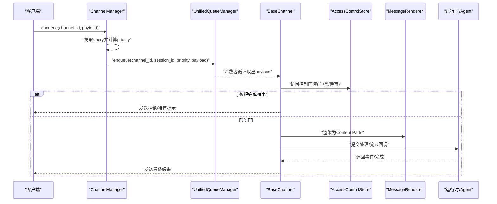

图表来源
- [manager.py:270-363](file://src/qwenpaw/app/channels/manager.py#L270-L363)
- [unified_queue_manager.py:119-164](file://src/qwenpaw/app/channels/unified_queue_manager.py#L119-L164)
- [base.py:379-451](file://src/qwenpaw/app/channels/base.py#L379-L451)
- [renderer.py:87-104](file://src/qwenpaw/app/channels/renderer.py#L87-L104)

## 详细组件分析

### 统一队列管理器（UnifiedQueueManager）
- 设计要点
  - QueueKey = (channel_id, session_id, priority_level)，保证同会话同优先级的严格串行
  - 动态消费者：首次入队时创建 asyncio.Task 运行消费者循环
  - 空闲清理：后台任务周期性扫描空队列，超过 idle_timeout 则取消消费者
  - 指标：processed_count、age_seconds、idle_seconds、qsize
- 关键流程
  - enqueue：获取或创建队列，带超时保护避免阻塞
  - _run_consumer：委托给上层 consumer_fn（由 ChannelManager 实现），异常与取消均做日志与清理
  - start_cleanup_loop：定时清理空闲队列
  - get_metrics/increment_processed：供监控与统计

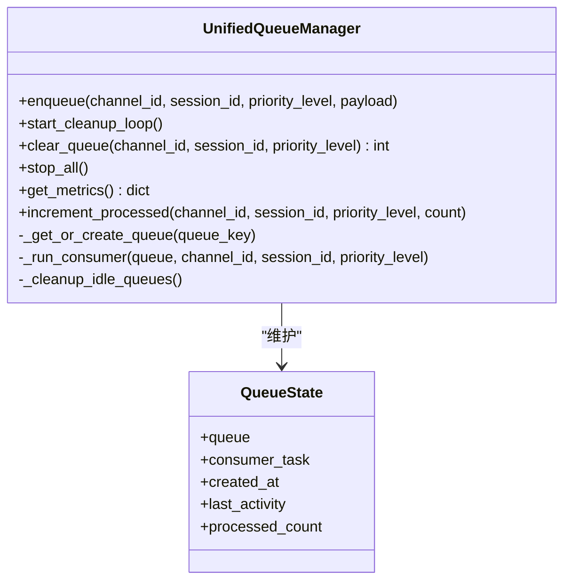

图表来源
- [unified_queue_manager.py:60-118](file://src/qwenpaw/app/channels/unified_queue_manager.py#L60-L118)
- [unified_queue_manager.py:165-213](file://src/qwenpaw/app/channels/unified_queue_manager.py#L165-L213)
- [unified_queue_manager.py:274-289](file://src/qwenpaw/app/channels/unified_queue_manager.py#L274-L289)
- [unified_queue_manager.py:376-428](file://src/qwenpaw/app/channels/unified_queue_manager.py#L376-L428)
- [unified_queue_manager.py:430-498](file://src/qwenpaw/app/channels/unified_queue_manager.py#L430-L498)

章节来源
- [unified_queue_manager.py:60-118](file://src/qwenpaw/app/channels/unified_queue_manager.py#L60-L118)
- [unified_queue_manager.py:119-164](file://src/qwenpaw/app/channels/unified_queue_manager.py#L119-L164)
- [unified_queue_manager.py:274-289](file://src/qwenpaw/app/channels/unified_queue_manager.py#L274-L289)
- [unified_queue_manager.py:376-428](file://src/qwenpaw/app/channels/unified_queue_manager.py#L376-L428)
- [unified_queue_manager.py:430-498](file://src/qwenpaw/app/channels/unified_queue_manager.py#L430-L498)

### ChannelManager 与优先级路由
- 职责
  - 从配置/环境构建通道实例，设置工作区与命令注册表
  - 入队前通过 CommandRegistry 判定优先级，结合 session_id 路由至统一队列
  - 消费者循环执行批量合并与消费，更新 processed_count
- 关键点
  - _extract_session_id：复用通道的 debounce key 逻辑，确保会话一致性
  - _enqueue_with_timeout：防止队列满导致无限等待
  - replace_channel：热替换通道实例，保持队列与消费者稳定

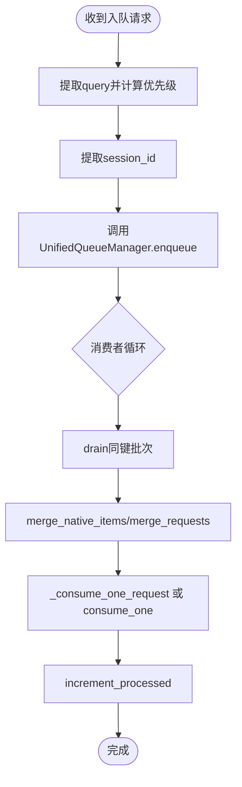

图表来源
- [manager.py:270-363](file://src/qwenpaw/app/channels/manager.py#L270-L363)
- [manager.py:377-473](file://src/qwenpaw/app/channels/manager.py#L377-L473)
- [command_registry.py:179-223](file://src/qwenpaw/app/channels/command_registry.py#L179-L223)

章节来源
- [manager.py:68-112](file://src/qwenpaw/app/channels/manager.py#L68-L112)
- [manager.py:270-363](file://src/qwenpaw/app/channels/manager.py#L270-L363)
- [manager.py:377-473](file://src/qwenpaw/app/channels/manager.py#L377-L473)
- [command_registry.py:179-223](file://src/qwenpaw/app/channels/command_registry.py#L179-L223)

### BaseChannel 消费与流式派发
- 消费流程
  - _consume_with_tracker：绑定 chat/task_tracker，支持 /stop 取消
  - 访问控制门控：依据白/黑/待审策略拦截并回复
  - 去抖与合并：无文本内容缓冲，音频直发；时间窗口内合并原生负载
  - 流式事件：reasoning/message 分箱聚合，最小间隔与超时保护
- 发送封装
  - send_content_parts：统一发送接口，携带 meta 信息

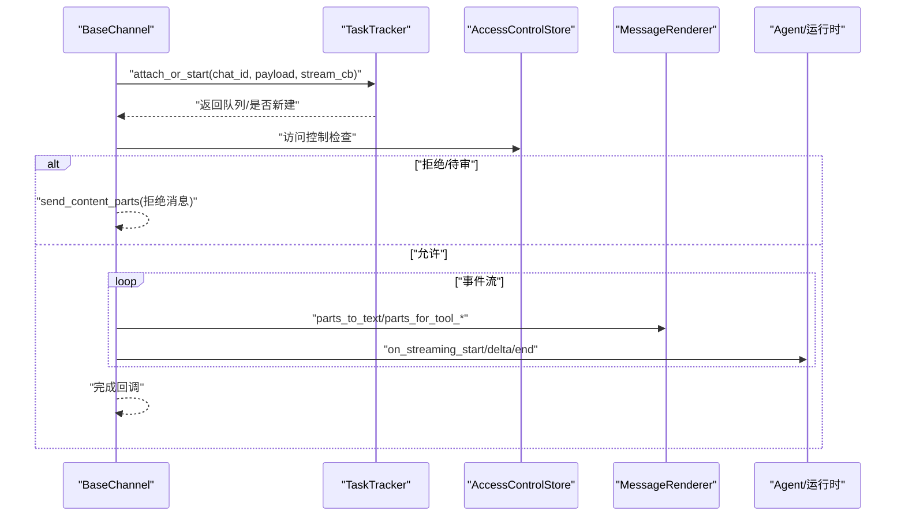

图表来源
- [base.py:529-585](file://src/qwenpaw/app/channels/base.py#L529-L585)
- [base.py:379-451](file://src/qwenpaw/app/channels/base.py#L379-L451)
- [base.py:604-793](file://src/qwenpaw/app/channels/base.py#L604-L793)
- [renderer.py:87-104](file://src/qwenpaw/app/channels/renderer.py#L87-L104)

章节来源
- [base.py:529-585](file://src/qwenpaw/app/channels/base.py#L529-L585)
- [base.py:379-451](file://src/qwenpaw/app/channels/base.py#L379-L451)
- [base.py:604-793](file://src/qwenpaw/app/channels/base.py#L604-L793)

### 消息渲染引擎（MessageRenderer）
- 功能
  - 将内部消息对象转换为可发送的 Content Parts（Text/Image/Audio/Video/File/Refusal）
  - 工具调用/输出格式化，支持显示细节与内部工具过滤
  - 思考内容过滤、滚动标题剥离
- 风格控制
  - RenderStyle：markdown/code fence/emoji 开关、工具消息过滤、内部工具集合

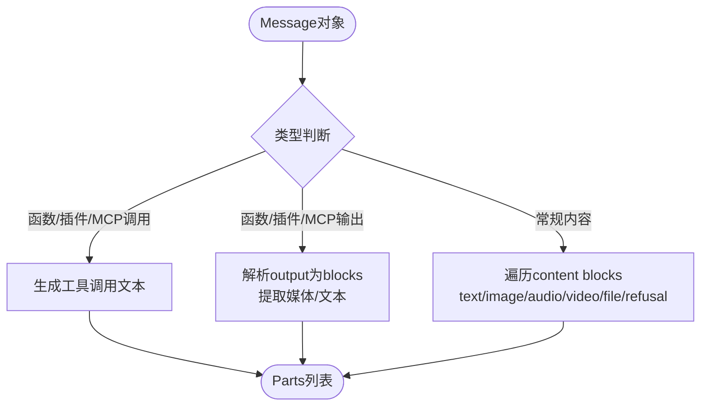

图表来源
- [renderer.py:87-104](file://src/qwenpaw/app/channels/renderer.py#L87-L104)
- [renderer.py:105-181](file://src/qwenpaw/app/channels/renderer.py#L105-L181)
- [renderer.py:183-261](file://src/qwenpaw/app/channels/renderer.py#L183-L261)
- [renderer.py:263-371](file://src/qwenpaw/app/channels/renderer.py#L263-L371)

章节来源
- [renderer.py:87-104](file://src/qwenpaw/app/channels/renderer.py#L87-L104)
- [renderer.py:105-181](file://src/qwenpaw/app/channels/renderer.py#L105-L181)
- [renderer.py:183-261](file://src/qwenpaw/app/channels/renderer.py#L183-L261)
- [renderer.py:263-371](file://src/qwenpaw/app/channels/renderer.py#L263-L371)

### 命令注册表（CommandRegistry）
- 作用
  - 将控制命令映射到优先级级别（critical/high/normal/low）
  - 提供 is_control_command/get_priority_level 快速查询
- 默认命令
  - /stop（critical）、/daemon *（high）、/approval（high）等

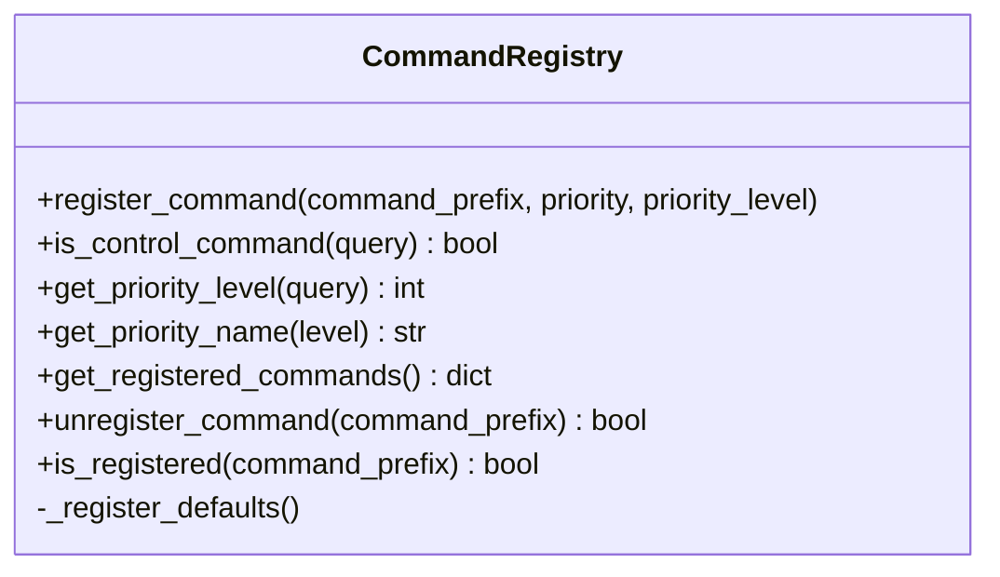

图表来源
- [command_registry.py:23-63](file://src/qwenpaw/app/channels/command_registry.py#L23-L63)
- [command_registry.py:94-139](file://src/qwenpaw/app/channels/command_registry.py#L94-L139)
- [command_registry.py:140-178](file://src/qwenpaw/app/channels/command_registry.py#L140-L178)
- [command_registry.py:179-223](file://src/qwenpaw/app/channels/command_registry.py#L179-L223)

章节来源
- [command_registry.py:23-63](file://src/qwenpaw/app/channels/command_registry.py#L23-L63)
- [command_registry.py:94-139](file://src/qwenpaw/app/channels/command_registry.py#L94-L139)
- [command_registry.py:140-178](file://src/qwenpaw/app/channels/command_registry.py#L140-L178)
- [command_registry.py:179-223](file://src/qwenpaw/app/channels/command_registry.py#L179-L223)

### 访问控制与安全策略（AccessControlStore）
- 数据模型
  - ChannelACL：whitelist/blacklist/pending
  - UserInfo/PendingEntry：用户元信息与待审条目
- 持久化
  - 基于 JSON 文件，线程锁保护，支持热重载检测
- 策略
  - 白名单放行、黑名单拒绝、待审进入审批队列
  - 支持批量操作、备注/用户名更新、迁移导入 allow_from

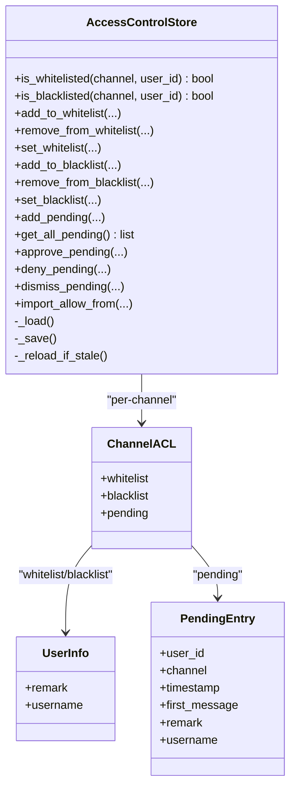

图表来源
- [access_control.py:157-216](file://src/qwenpaw/app/channels/access_control.py#L157-L216)
- [access_control.py:219-238](file://src/qwenpaw/app/channels/access_control.py#L219-L238)
- [access_control.py:241-319](file://src/qwenpaw/app/channels/access_control.py#L241-L319)
- [access_control.py:323-358](file://src/qwenpaw/app/channels/access_control.py#L323-L358)
- [access_control.py:361-406](file://src/qwenpaw/app/channels/access_control.py#L361-L406)
- [access_control.py:408-474](file://src/qwenpaw/app/channels/access_control.py#L408-L474)
- [access_control.py:493-516](file://src/qwenpaw/app/channels/access_control.py#L493-L516)

章节来源
- [access_control.py:157-216](file://src/qwenpaw/app/channels/access_control.py#L157-L216)
- [access_control.py:219-238](file://src/qwenpaw/app/channels/access_control.py#L219-L238)
- [access_control.py:241-319](file://src/qwenpaw/app/channels/access_control.py#L241-L319)
- [access_control.py:323-358](file://src/qwenpaw/app/channels/access_control.py#L323-L358)
- [access_control.py:361-406](file://src/qwenpaw/app/channels/access_control.py#L361-L406)
- [access_control.py:408-474](file://src/qwenpaw/app/channels/access_control.py#L408-L474)
- [access_control.py:493-516](file://src/qwenpaw/app/channels/access_control.py#L493-L516)

### 消息格式转换（runtime.message_convert）
- 目标
  - 将 AgentRequest.input 中的 text/media/file 块转换为 agentscope Msg/DataBlock
- 要点
  - URL scheme 规范化（本地绝对路径补 file://）
  - MIME 推断与 fallback 扩展名
  - 角色映射（tool→assistant）

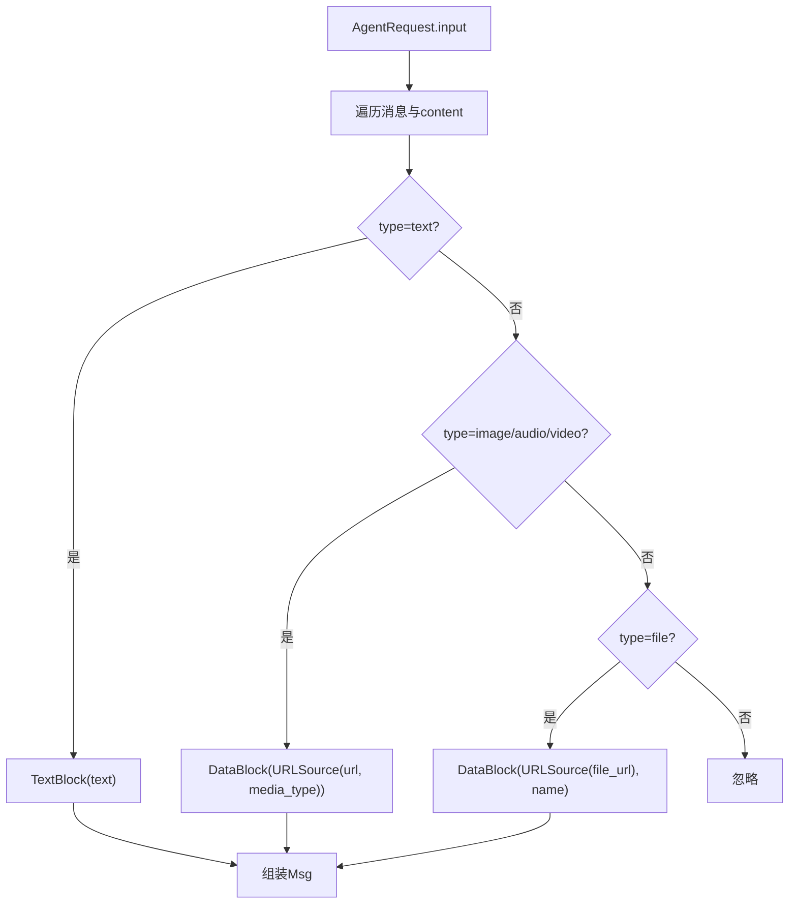

图表来源
- [message_convert.py:63-166](file://src/qwenpaw/runtime/message_convert.py#L63-L166)
- [message_convert.py:38-60](file://src/qwenpaw/runtime/message_convert.py#L38-L60)

章节来源
- [message_convert.py:63-166](file://src/qwenpaw/runtime/message_convert.py#L63-L166)
- [message_convert.py:38-60](file://src/qwenpaw/runtime/message_convert.py#L38-L60)

### 斜杠命令注册与分发（runtime.slash_command_registry）
- 功能
  - 统一注册命令（含别名）、解析参数、分发执行
  - 支持回退处理器用于技能名解析
- 使用场景
  - 对话模式下的 /skill、/daemon 等命令统一入口

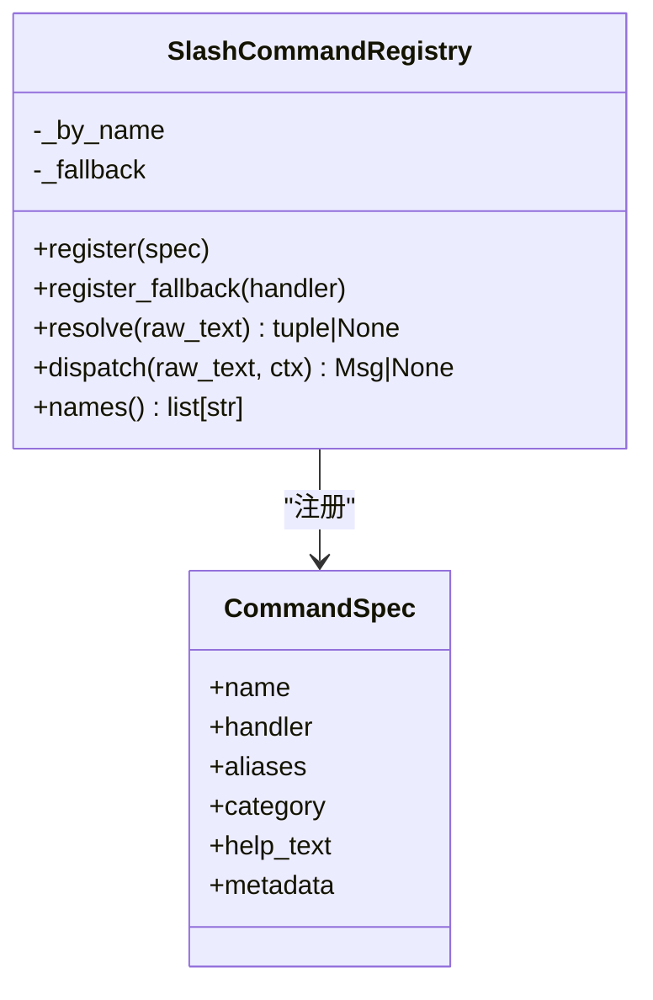

图表来源
- [slash_command_registry.py:45-103](file://src/qwenpaw/runtime/slash_command_registry.py#L45-L103)
- [slash_command_registry.py:108-124](file://src/qwenpaw/runtime/slash_command_registry.py#L108-L124)

章节来源
- [slash_command_registry.py:45-103](file://src/qwenpaw/runtime/slash_command_registry.py#L45-L103)
- [slash_command_registry.py:108-124](file://src/qwenpaw/runtime/slash_command_registry.py#L108-L124)

### 访问控制 API（app.routers.access_control）
- 提供 REST 接口管理白/黑/待审列表
- 典型端点
  - GET /access-control：获取所有通道 ACL
  - POST /access-control/pending/approve|deny|dismiss：批量审批/拒绝/忽略
  - POST /access-control/whitelist/add|remove、/blacklist/add|remove
  - POST /access-control/remark、/username：更新备注/用户名
  - GET /access-control/{channel}：获取指定通道 ACL

章节来源
- [access_control_api.py:78-118](file://src/qwenpaw/app/routers/access_control.py#L78-L118)
- [access_control_api.py:123-194](file://src/qwenpaw/app/routers/access_control.py#L123-L194)
- [access_control_api.py:199-294](file://src/qwenpaw/app/routers/access_control.py#L199-L294)
- [access_control_api.py:300-308](file://src/qwenpaw/app/routers/access_control.py#L300-L308)

## 依赖关系分析
- ChannelManager 依赖 UnifiedQueueManager 与 CommandRegistry
- BaseChannel 依赖 MessageRenderer、AccessControlStore、Workspace（task_tracker/chat_manager）
- runtime.message_convert 在消费阶段将输入转为 agentscope Msg
- slash_command_registry 作为命令分发补充，与 BaseChannel 消费流程协作

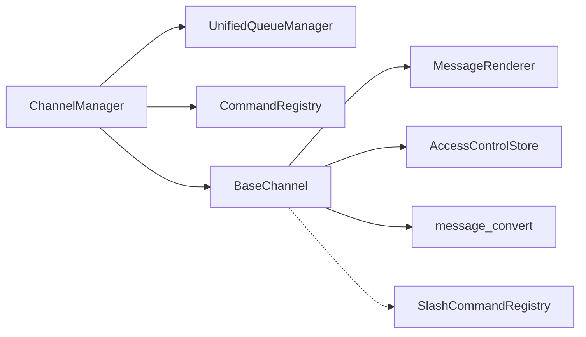

图表来源
- [manager.py:68-112](file://src/qwenpaw/app/channels/manager.py#L68-L112)
- [base.py:80-170](file://src/qwenpaw/app/channels/base.py#L80-L170)
- [message_convert.py:63-166](file://src/qwenpaw/runtime/message_convert.py#L63-L166)
- [slash_command_registry.py:45-103](file://src/qwenpaw/runtime/slash_command_registry.py#L45-L103)

章节来源
- [manager.py:68-112](file://src/qwenpaw/app/channels/manager.py#L68-L112)
- [base.py:80-170](file://src/qwenpaw/app/channels/base.py#L80-L170)
- [message_convert.py:63-166](file://src/qwenpaw/runtime/message_convert.py#L63-L166)
- [slash_command_registry.py:45-103](file://src/qwenpaw/runtime/slash_command_registry.py#L45-L103)

## 性能考虑
- 队列与消费者
  - 每键独立队列与消费者，避免跨会话竞争；空闲清理降低资源占用
  - 入队超时保护，防止背压导致阻塞
- 批量合并
  - 同一键下快速消息合并，减少重复处理与网络往返
- 流式发送
  - 最小间隔与超时保护，避免频繁 flush 造成抖动
- 监控指标
  - 使用 get_metrics 观察 total_queues、qsize、processed_count、age_seconds、idle_seconds
  - 结合 ChannelManager 的 stop_all 与 clear_queue 进行运维干预

[本节为通用指导，无需特定文件引用]

## 故障排查指南
- 入队失败/超时
  - 检查队列大小上限与消费者是否存活；查看 enqueue 日志与超时异常
- 消费者崩溃
  - 关注消费者异常日志；确认 consumer_fn 中异常捕获与清理逻辑
- 访问控制误拦截
  - 核对白/黑/待审状态；通过 API 批量修正；检查 access_control_enabled 开关
- 流式卡顿
  - 调整最小间隔与 flush 超时；检查 on_streaming_delta 的并发任务是否堆积
- 命令优先级不生效
  - 确认 CommandRegistry 已注册对应命令；检查 query 提取是否正确

章节来源
- [unified_queue_manager.py:119-164](file://src/qwenpaw/app/channels/unified_queue_manager.py#L119-L164)
- [unified_queue_manager.py:214-273](file://src/qwenpaw/app/channels/unified_queue_manager.py#L214-L273)
- [base.py:379-451](file://src/qwenpaw/app/channels/base.py#L379-L451)
- [base.py:604-793](file://src/qwenpaw/app/channels/base.py#L604-L793)
- [access_control_api.py:123-194](file://src/qwenpaw/app/routers/access_control.py#L123-L194)

## 结论
QwenPaw 的消息处理与路由系统以统一队列为核心，结合优先级路由、访问控制与渲染引擎，实现了高内聚、低耦合的可扩展架构。通过按需消费者、空闲清理与批量合并，系统在吞吐与延迟之间取得良好平衡；配合完善的监控与运维接口，便于在生产环境中持续优化与排障。

[本节为总结性内容，无需特定文件引用]

## 附录
- 术语
  - QueueKey：(channel_id, session_id, priority_level)
  - Content Parts：Text/Image/Audio/Video/File/Refusal 等可发送单元
  - 待审：未在白/黑名单的用户进入审批队列
- 最佳实践
  - 合理设置 queue_maxsize 与 idle_timeout
  - 开启 filter_thinking 与 internal_tools 过滤以提升用户体验
  - 使用 API 集中管理 ACL，避免手动修改文件

[本节为概念性内容，无需特定文件引用]