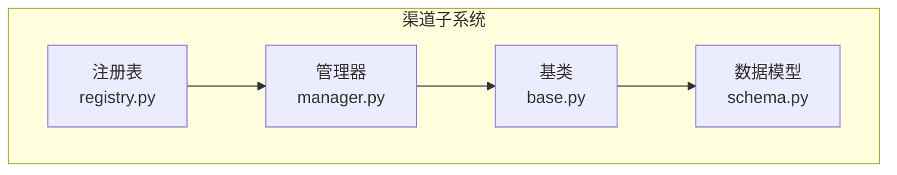
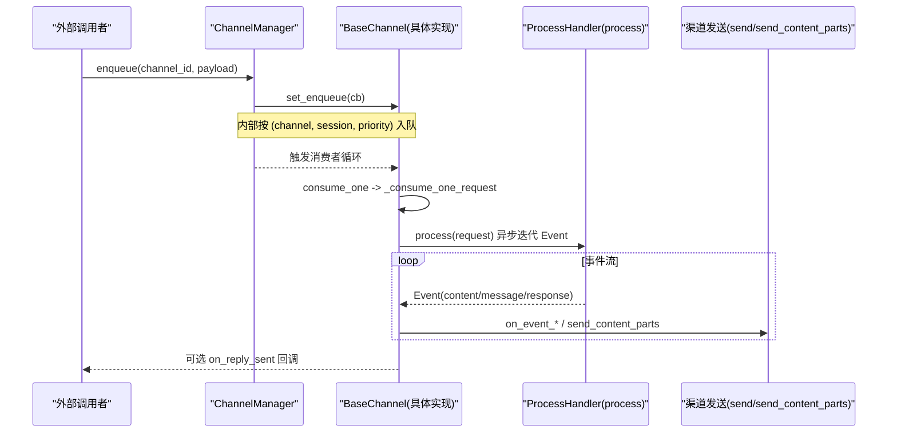
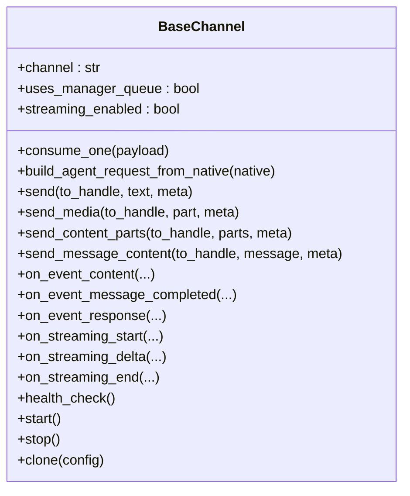
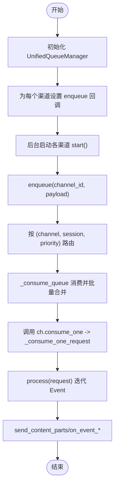
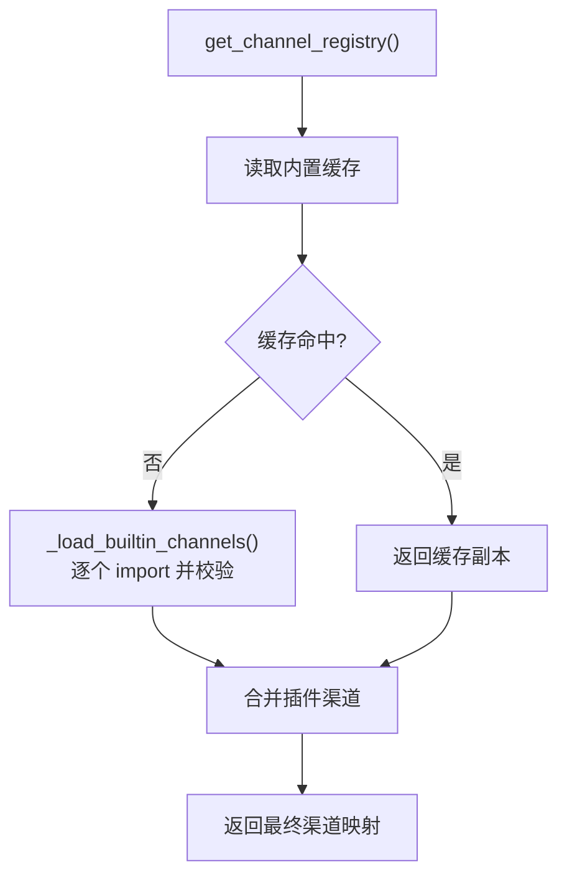
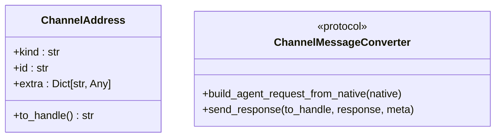
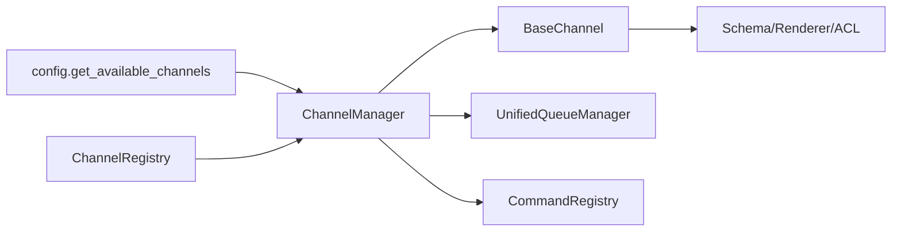

# 渠道架构设计

<cite>
**本文引用的文件**   
- [src/qwenpaw/app/channels/__init__.py](file://src/qwenpaw/app/channels/__init__.py)
- [src/qwenpaw/app/channels/base.py](file://src/qwenpaw/app/channels/base.py)
- [src/qwenpaw/app/channels/manager.py](file://src/qwenpaw/app/channels/manager.py)
- [src/qwenpaw/app/channels/registry.py](file://src/qwenpaw/app/channels/registry.py)
- [src/qwenpaw/app/channels/schema.py](file://src/qwenpaw/app/channels/schema.py)
</cite>

## 目录
1. [简介](#简介)
2. [项目结构](#项目结构)
3. [核心组件](#核心组件)
4. [架构总览](#架构总览)
5. [详细组件分析](#详细组件分析)
6. [依赖关系分析](#依赖关系分析)
7. [性能考量](#性能考量)
8. [故障排查指南](#故障排查指南)
9. [结论](#结论)
10. [附录：自定义渠道开发最佳实践](#附录自定义渠道开发最佳实践)

## 简介
本文件系统化阐述 QwenPaw 的“渠道（Channel）”架构，覆盖整体架构、核心组件关系、消息处理流程与扩展机制。重点解析 ChannelBase 基类的设计模式、ChannelManager 的管理逻辑、ChannelRegistry 的注册机制以及 Schema 的数据模型定义，并给出渠道发现、加载、初始化与销毁的完整生命周期说明，辅以自定义渠道开发的最佳实践与设计原则，兼顾初学者理解与资深开发者深度需求。

## 项目结构
渠道子系统位于 src/qwenpaw/app/channels 下，采用“基类 + 管理器 + 注册表 + 数据模型”的分层组织方式：
- base.py：所有渠道的抽象基类，统一消费、发送、流式处理、去抖、访问控制等通用能力。
- manager.py：ChannelManager 负责队列、消费者、批量合并、健康检查、重启与替换等运行时管理。
- registry.py：ChannelRegistry 负责内置与插件渠道的发现与注册。
- schema.py：渠道类型标识、路由地址与转换协议的数据模型。
- __init__.py：惰性导出 ChannelManager，避免 CLI 启动时拉入重型依赖。

图表来源
- [src/qwenpaw/app/channels/registry.py:1-135](file://src/qwenpaw/app/channels/registry.py#L1-L135)
- [src/qwenpaw/app/channels/base.py:1-120](file://src/qwenpaw/app/channels/base.py#L1-L120)
- [src/qwenpaw/app/channels/manager.py:1-120](file://src/qwenpaw/app/channels/manager.py#L1-L120)
- [src/qwenpaw/app/channels/schema.py:1-74](file://src/qwenpaw/app/channels/schema.py#L1-L74)

章节来源
- [src/qwenpaw/app/channels/__init__.py:1-14](file://src/qwenpaw/app/channels/__init__.py#L1-L14)
- [src/qwenpaw/app/channels/base.py:1-120](file://src/qwenpaw/app/channels/base.py#L1-L120)
- [src/qwenpaw/app/channels/manager.py:1-120](file://src/qwenpaw/app/channels/manager.py#L1-L120)
- [src/qwenpaw/app/channels/registry.py:1-135](file://src/qwenpaw/app/channels/registry.py#L1-L135)
- [src/qwenpaw/app/channels/schema.py:1-74](file://src/qwenpaw/app/channels/schema.py#L1-L74)

## 核心组件
- ChannelBase（基类）
  - 职责：统一消息消费入口 consume_one、请求构建 build_agent_request_from_native、事件分发与发送 send_content_parts/send_message_content、流式钩子 on_streaming_*、去抖与合并、访问控制门控、SSE 序列化等。
  - 关键特性：支持 streaming_enabled 开关；提供 _debounce_seconds 时间去抖；_no_text_debounce 无文本内容延迟合并；统一 ACL 门控；可插拔渲染器 MessageRenderer。
- ChannelManager（管理器）
  - 职责：从配置或环境创建渠道实例；维护 UnifiedQueueManager；按 (channel, session, priority) 维度路由；批量合并；start_all/stop_all；replace_channel/restart_channel；send_event/send_text 等。
  - 关键特性：线程安全 enqueue；消费者循环内 drain 合并；per-channel restart lock；优雅关闭。
- ChannelRegistry（注册表）
  - 职责：加载内置渠道映射；缓存；与插件系统融合；返回最终可用渠道集合。
  - 关键特性：必需渠道校验（如 console）；插件键冲突告警；进程级缓存。
- Schema（数据模型）
  - 职责：ChannelAddress 统一路由地址；BUILTIN_CHANNEL_TYPES 内置类型集；ChannelType 字符串类型；ChannelMessageConverter 协议。

章节来源
- [src/qwenpaw/app/channels/base.py:80-200](file://src/qwenpaw/app/channels/base.py#L80-L200)
- [src/qwenpaw/app/channels/manager.py:68-120](file://src/qwenpaw/app/channels/manager.py#L68-L120)
- [src/qwenpaw/app/channels/registry.py:18-98](file://src/qwenpaw/app/channels/registry.py#L18-L98)
- [src/qwenpaw/app/channels/schema.py:12-74](file://src/qwenpaw/app/channels/schema.py#L12-L74)

## 架构总览
下图展示渠道子系统在运行时的交互关系：外部通过 ChannelManager 注入 enqueue 回调，渠道将原生消息转换为 AgentRequest，交由 process 处理器产生 Event 流，再由基类进行渲染与发送。

图表来源
- [src/qwenpaw/app/channels/manager.py:364-476](file://src/qwenpaw/app/channels/manager.py#L364-L476)
- [src/qwenpaw/app/channels/base.py:1215-1386](file://src/qwenpaw/app/channels/base.py#L1215-L1386)
- [src/qwenpaw/app/channels/base.py:1387-1443](file://src/qwenpaw/app/channels/base.py#L1387-L1443)

## 详细组件分析

### ChannelBase 基类
- 设计要点
  - 统一入口：consume_one 负责时间去抖与无文本内容延迟合并；_consume_one_request 完成 ACL 门控、命令识别、TaskTracker 接入、process 执行与结果发送。
  - 流式支持：streaming_enabled 开启后，对 reasoning/message 事件走 on_streaming_start/delta/end 钩子；非流式路径仍保留 on_event_content/on_event_message_completed 兼容。
  - 发送抽象：send_content_parts 聚合文本与媒体，默认回退为文本拼接；子类可重写 send_media 以发送真实附件。
  - 会话与目标：resolve_session_id/get_to_handle_from_request/to_handle_from_target 提供会话与目标解析策略。
  - 错误与完成：_on_consume_error/_on_process_completed 统一错误与完成回调。
- 关键方法
  - 消费与合并：merge_native_items/merge_requests/_apply_no_text_debounce/_debounce_payload
  - 事件处理：on_event_content/on_event_message_completed/on_event_response
  - 流式钩子：on_streaming_start/on_streaming_delta/on_streaming_end
  - 发送接口：send/send_media/send_content_parts/send_message_content
  - 生命周期：from_config/from_env/clone/start/stop/health_check

图表来源
- [src/qwenpaw/app/channels/base.py:80-200](file://src/qwenpaw/app/channels/base.py#L80-L200)
- [src/qwenpaw/app/channels/base.py:1215-1386](file://src/qwenpaw/app/channels/base.py#L1215-L1386)
- [src/qwenpaw/app/channels/base.py:1387-1443](file://src/qwenpaw/app/channels/base.py#L1387-L1443)
- [src/qwenpaw/app/channels/base.py:1601-1998](file://src/qwenpaw/app/channels/base.py#L1601-L1998)

章节来源
- [src/qwenpaw/app/channels/base.py:80-200](file://src/qwenpaw/app/channels/base.py#L80-L200)
- [src/qwenpaw/app/channels/base.py:1215-1386](file://src/qwenpaw/app/channels/base.py#L1215-L1386)
- [src/qwenpaw/app/channels/base.py:1387-1443](file://src/qwenpaw/app/channels/base.py#L1387-L1443)
- [src/qwenpaw/app/channels/base.py:1601-1998](file://src/qwenpaw/app/channels/base.py#L1601-L1998)

### ChannelManager 管理器
- 职责边界
  - 渠道实例化：from_env/from_config 根据可用渠道与配置构造实例。
  - 队列与消费者：UnifiedQueueManager 按 (channel, session, priority) 维度路由；消费者循环内做同 key 批量合并。
  - 生命周期：start_all 设置 enqueue 回调并后台启动各渠道；stop_all 取消任务、停止队列与渠道。
  - 动态替换：replace_channel 先预启新实例再原子替换旧实例；restart_channel 基于最新配置 clone 并替换。
  - 对外发送：send_event/send_text 封装到 channel.send_message_content。
- 关键流程
  - enqueue 线程安全入队；_enqueue_with_timeout 保护阻塞；_consume_queue 驱动消费与合并。
  - set_workspace 注入工作区与命令注册表，使渠道具备 TaskTracker 与命令识别能力。

图表来源
- [src/qwenpaw/app/channels/manager.py:474-570](file://src/qwenpaw/app/channels/manager.py#L474-L570)
- [src/qwenpaw/app/channels/manager.py:364-476](file://src/qwenpaw/app/channels/manager.py#L364-L476)
- [src/qwenpaw/app/channels/manager.py:734-792](file://src/qwenpaw/app/channels/manager.py#L734-L792)
- [src/qwenpaw/app/channels/manager.py:822-874](file://src/qwenpaw/app/channels/manager.py#L822-L874)

章节来源
- [src/qwenpaw/app/channels/manager.py:68-120](file://src/qwenpaw/app/channels/manager.py#L68-L120)
- [src/qwenpaw/app/channels/manager.py:364-476](file://src/qwenpaw/app/channels/manager.py#L364-L476)
- [src/qwenpaw/app/channels/manager.py:474-570](file://src/qwenpaw/app/channels/manager.py#L474-L570)
- [src/qwenpaw/app/channels/manager.py:734-792](file://src/qwenpaw/app/channels/manager.py#L734-L792)
- [src/qwenpaw/app/channels/manager.py:822-874](file://src/qwenpaw/app/channels/manager.py#L822-L874)

### ChannelRegistry 注册表
- 功能概述
  - 内置渠道映射：_BUILTIN_SPECS 声明模块与类名；_load_builtin_channels 安全导入并校验类型；必需渠道失败直接抛出。
  - 插件渠道：_get_plugin_channels 从插件注册表获取渠道类，键冲突则跳过并记录警告。
  - 缓存：_get_cached_builtin_channels 进程级缓存，测试可通过 clear_builtin_channel_cache 重置。
- 使用方式
  - get_channel_registry 返回最终可用渠道字典，供 ChannelManager.from_config/from_env 遍历构造。

图表来源
- [src/qwenpaw/app/channels/registry.py:46-98](file://src/qwenpaw/app/channels/registry.py#L46-L98)
- [src/qwenpaw/app/channels/registry.py:101-135](file://src/qwenpaw/app/channels/registry.py#L101-L135)

章节来源
- [src/qwenpaw/app/channels/registry.py:18-98](file://src/qwenpaw/app/channels/registry.py#L18-L98)
- [src/qwenpaw/app/channels/registry.py:101-135](file://src/qwenpaw/app/channels/registry.py#L101-L135)

### Schema 数据模型
- ChannelAddress：统一路由地址，包含 kind/id/extra，并提供 to_handle 生成规则。
- BUILTIN_CHANNEL_TYPES：内置渠道类型常量集。
- ChannelType：字符串类型，允许插件渠道使用任意键。
- DEFAULT_CHANNEL：未指定时的默认渠道。
- ChannelMessageConverter：协议，要求实现 native->AgentRequest 与 response->channel reply 的转换。

图表来源
- [src/qwenpaw/app/channels/schema.py:12-74](file://src/qwenpaw/app/channels/schema.py#L12-L74)

章节来源
- [src/qwenpaw/app/channels/schema.py:12-74](file://src/qwenpaw/app/channels/schema.py#L12-L74)

## 依赖关系分析
- 模块耦合
  - manager 依赖 base 与 registry，并通过 config 获取可用渠道列表。
  - base 依赖 schemas、renderer、access_control 与 config utils。
  - registry 依赖 plugins.registry（可选），失败不阻断启动。
- 外部集成点
  - UnifiedQueueManager：由 manager 持有，负责多队列与清理循环。
  - CommandRegistry：用于控制命令识别与优先级划分。
  - Workspace：注入到渠道，提供 chat_manager/task_tracker 等能力。

图表来源
- [src/qwenpaw/app/channels/manager.py:1-120](file://src/qwenpaw/app/channels/manager.py#L1-L120)
- [src/qwenpaw/app/channels/registry.py:1-135](file://src/qwenpaw/app/channels/registry.py#L1-L135)
- [src/qwenpaw/app/channels/base.py:1-120](file://src/qwenpaw/app/channels/base.py#L1-L120)

章节来源
- [src/qwenpaw/app/channels/manager.py:1-120](file://src/qwenpaw/app/channels/manager.py#L1-L120)
- [src/qwenpaw/app/channels/registry.py:1-135](file://src/qwenpaw/app/channels/registry.py#L1-L135)
- [src/qwenpaw/app/channels/base.py:1-120](file://src/qwenpaw/app/channels/base.py#L1-L120)

## 性能考量
- 批量合并：消费者循环内 drain 同一 key 的消息，减少频繁网络往返与重复渲染。
- 去抖策略：_debounce_seconds 时间窗口合并；_no_text_debounce 针对无文本内容进行延迟合并，提升体验。
- 流式刷新节流：_STREAM_DELTA_MIN_INTERVAL_S 与超时保护，避免高频 flush 导致拥塞。
- 并发与锁：per-channel restart lock 防止资源泄漏；enqueue 线程安全。
- 懒加载：__getattr__ 惰性加载 ChannelManager，降低 CLI 冷启动开销。

[本节为通用性能建议，无需特定文件引用]

## 故障排查指南
- 渠道不可用
  - 现象：启动日志提示 built-in channel unavailable 或 required channel failed。
  - 排查：确认依赖是否安装；检查必需渠道（console）是否成功加载。
- 消息未送达
  - 现象：enqueue 成功但无输出。
  - 排查：确认 ChannelManager.start_all 已调用；检查 _consume_queue 是否启动；查看日志中的 batch 合并与 processed 计数。
- 流式异常
  - 现象：on_streaming_delta 报错但不影响主流程。
  - 排查：基类已捕获异常并重置刷新间隔；关注 on_streaming_end 是否被正确触发。
- 重启/替换失败
  - 现象：replace_channel 抛错或旧实例未停止。
  - 排查：查看 replace_channel 预启阶段异常；确认 per-channel lock 未被死锁；检查 stop 的 CancelledError 处理。

章节来源
- [src/qwenpaw/app/channels/registry.py:64-78](file://src/qwenpaw/app/channels/registry.py#L64-L78)
- [src/qwenpaw/app/channels/manager.py:474-570](file://src/qwenpaw/app/channels/manager.py#L474-L570)
- [src/qwenpaw/app/channels/manager.py:734-792](file://src/qwenpaw/app/channels/manager.py#L734-L792)
- [src/qwenpaw/app/channels/base.py:1520-1546](file://src/qwenpaw/app/channels/base.py#L1520-L1546)

## 结论
QwenPaw 渠道体系以 BaseChannel 为统一抽象，配合 ChannelManager 的队列与消费者编排，以及 ChannelRegistry 的动态发现与注册，形成高内聚、低耦合、可扩展的通道生态。其去抖、批处理、流式刷新与访问控制等机制，在保证性能的同时提升了用户体验与安全性。通过清晰的扩展点与生命周期管理，开发者可以便捷地实现自定义渠道并与现有生态无缝集成。

[本节为总结性内容，无需特定文件引用]

## 附录：自定义渠道开发最佳实践
- 继承与实现
  - 继承 BaseChannel，至少实现 from_config 与 start/stop/send。
  - 若需原生消息转 AgentRequest，实现 build_agent_request_from_native；否则可在 consume_one 中自行构造。
- 会话与目标
  - 合理实现 resolve_session_id 与 get_to_handle_from_request，确保会话隔离与目标解析准确。
- 发送与媒体
  - 优先使用 send_content_parts；如需原生附件，重写 send_media。
- 流式支持
  - 若需要实时推送，设置 streaming_enabled=True，并实现 on_streaming_start/delta/end。
- 去抖与合并
  - 对于高频碎片消息，设置 _debounce_seconds 并在 merge_native_items 中合并 content_parts/meta。
- 访问控制
  - 按需启用 access_control_dm/group，结合 _access_control_gate 与 ACL 存储。
- 生命周期
  - 遵循 clone/from_config 约定，确保 restart/replace 行为一致。
- 健壮性与可观测性
  - 在 health_check 中暴露渠道状态；在错误路径调用 _on_consume_error 保证用户可见反馈。

[本节为通用指导，无需特定文件引用]