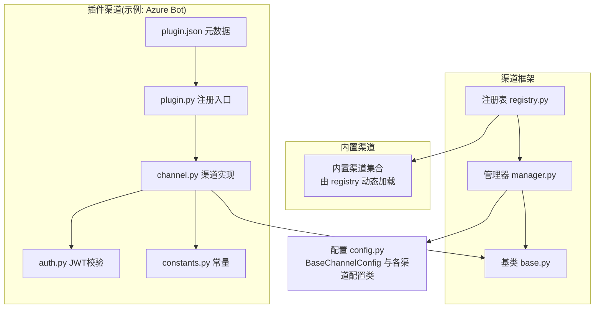
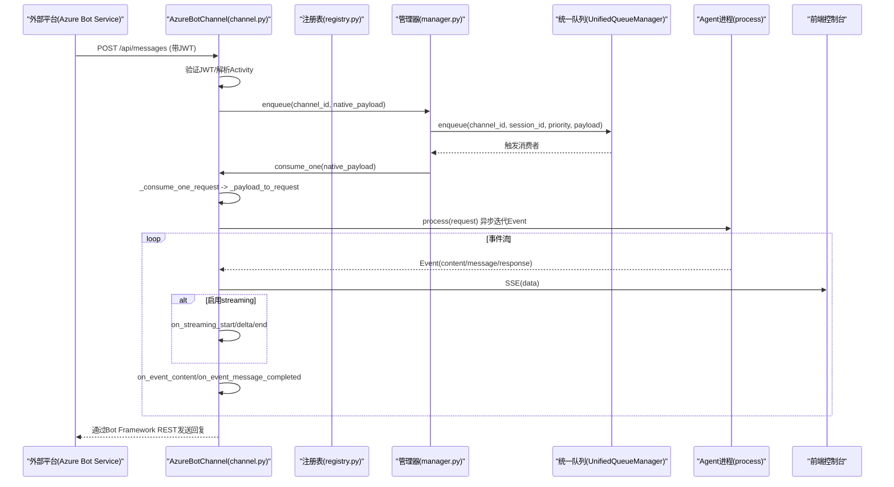
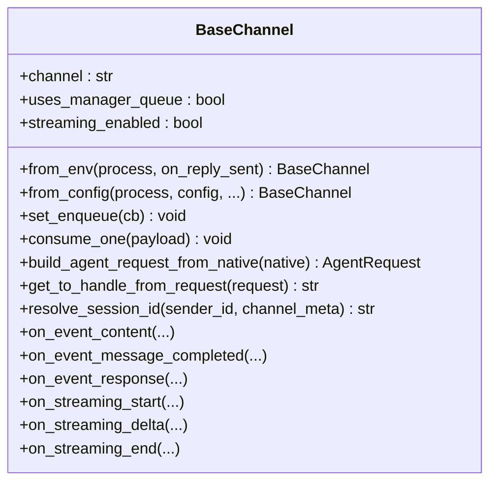
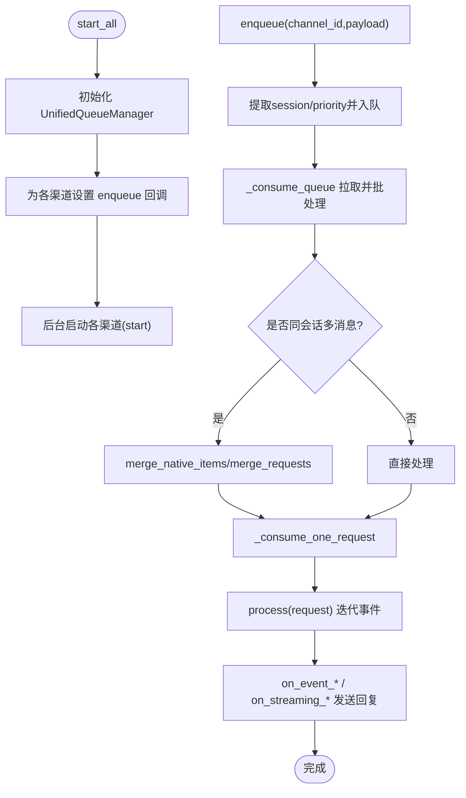
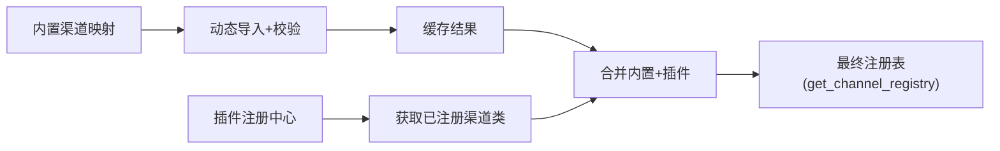
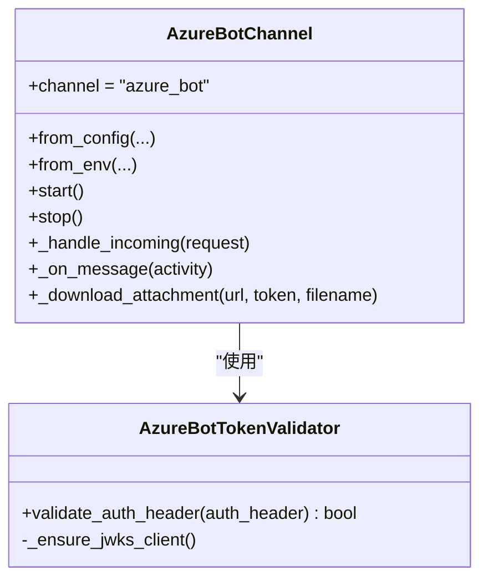
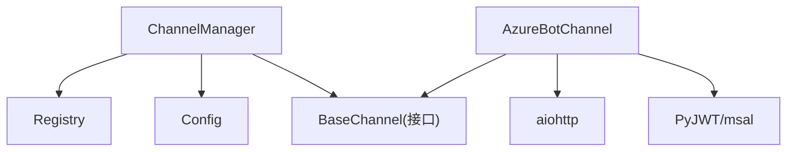

# 自定义渠道开发

<cite>
**本文引用的文件**   
- [base.py](file://src/qwenpaw/app/channels/base.py)
- [manager.py](file://src/qwenpaw/app/channels/manager.py)
- [registry.py](file://src/qwenpaw/app/channels/registry.py)
- [config.py](file://src/qwenpaw/config/config.py)
- [plugin.json](file://plugins/channel/azure_bot/plugin.json)
- [plugin.py](file://plugins/channel/azure_bot/plugin.py)
- [channel.py](file://plugins/channel/azure_bot/channel.py)
- [auth.py](file://plugins/channel/azure_bot/auth.py)
- [constants.py](file://plugins/channel/azure_bot/constants.py)
- [test_voice.py](file://tests/unit/channels/test_voice.py)
</cite>

## 目录
1. [简介](#简介)
2. [项目结构](#项目结构)
3. [核心组件](#核心组件)
4. [架构总览](#架构总览)
5. [详细组件分析](#详细组件分析)
6. [依赖分析](#依赖分析)
7. [性能考虑](#性能考虑)
8. [故障排查指南](#故障排查指南)
9. [结论](#结论)
10. [附录](#附录)

## 简介
本指南面向希望在 QwenPaw 中开发“自定义渠道”的开发者，系统讲解如何基于 ChannelBase 基类实现新的渠道适配器，涵盖：
- 必需方法、可选扩展点与事件钩子
- 配置管理（Pydantic 模型 + from_config/from_env）
- 插件打包结构、元数据定义、依赖管理与版本兼容
- 具体示例（以 Azure Bot Service 为例）、测试策略、调试技巧与发布流程
- 前端控制台集成要点（API 与 UI 表单字段）
- 最佳实践、常见问题与性能优化建议

## 项目结构
QwenPaw 的渠道体系位于后端 channels 子系统，采用“注册表 + 管理器 + 基类 + 具体实现”的分层设计。插件化渠道通过 plugin.json 声明元数据，并在 plugin.py 中调用 API 完成注册。

图表来源
- [registry.py:1-135](file://src/qwenpaw/app/channels/registry.py#L1-L135)
- [manager.py:1-200](file://src/qwenpaw/app/channels/manager.py#L1-L200)
- [base.py:1-200](file://src/qwenpaw/app/channels/base.py#L1-L200)
- [plugin.json:1-25](file://plugins/channel/azure_bot/plugin.json#L1-L25)
- [plugin.py:1-120](file://plugins/channel/azure_bot/plugin.py#L1-L120)
- [channel.py:1-120](file://plugins/channel/azure_bot/channel.py#L1-L120)
- [auth.py:1-60](file://plugins/channel/azure_bot/auth.py#L1-L60)
- [constants.py:1-20](file://plugins/channel/azure_bot/constants.py#L1-L20)
- [config.py:197-260](file://src/qwenpaw/config/config.py#L197-L260)

章节来源
- [registry.py:1-135](file://src/qwenpaw/app/channels/registry.py#L1-L135)
- [manager.py:1-200](file://src/qwenpaw/app/channels/manager.py#L1-L200)
- [base.py:1-200](file://src/qwenpaw/app/channels/base.py#L1-L200)
- [config.py:197-260](file://src/qwenpaw/config/config.py#L197-L260)
- [plugin.json:1-25](file://plugins/channel/azure_bot/plugin.json#L1-L25)
- [plugin.py:1-120](file://plugins/channel/azure_bot/plugin.py#L1-L120)
- [channel.py:1-120](file://plugins/channel/azure_bot/channel.py#L1-L120)
- [auth.py:1-60](file://plugins/channel/azure_bot/auth.py#L1-L60)
- [constants.py:1-20](file://plugins/channel/azure_bot/constants.py#L1-L20)

## 核心组件
- BaseChannel（抽象基类）
  - 提供统一的消息消费流程、去抖合并、访问控制、SSE 序列化、流式事件分发等通用能力
  - 关键扩展点：from_config / from_env、build_agent_request_from_native、get_to_handle_from_request、on_event_* 系列回调、on_streaming_* 系列回调
- ChannelManager（通道管理器）
  - 负责从配置或环境变量创建并启动各渠道实例；维护统一队列（UnifiedQueueManager），按会话与优先级路由消息；支持热替换与重启
- Registry（注册表）
  - 聚合内置渠道与插件注册的渠道类；保证 key 唯一性；按需加载，失败不阻塞启动（除必需渠道）
- 配置模型（BaseChannelConfig 及各渠道配置类）
  - 统一的渠道开关、过滤、提及、白名单、媒体目录、流式输出等配置项；各渠道可继承扩展

章节来源
- [base.py:80-200](file://src/qwenpaw/app/channels/base.py#L80-L200)
- [manager.py:68-228](file://src/qwenpaw/app/channels/manager.py#L68-L228)
- [registry.py:18-135](file://src/qwenpaw/app/channels/registry.py#L18-L135)
- [config.py:197-260](file://src/qwenpaw/config/config.py#L197-L260)

## 架构总览
下图展示从外部消息到 Agent 处理再到回复发送的整体链路，以及插件渠道的注册与发现过程。

图表来源
- [channel.py:497-558](file://plugins/channel/azure_bot/channel.py#L497-L558)
- [auth.py:97-168](file://plugins/channel/azure_bot/auth.py#L97-L168)
- [manager.py:364-473](file://src/qwenpaw/app/channels/manager.py#L364-L473)
- [base.py:1315-1443](file://src/qwenpaw/app/channels/base.py#L1315-L1443)
- [base.py:864-983](file://src/qwenpaw/app/channels/base.py#L864-L983)

## 详细组件分析

### 基类 BaseChannel 与扩展点
- 生命周期与工厂方法
  - from_env / from_config：子类必须实现，用于从环境变量或配置对象构造实例
  - start / stop：子类自行管理资源（如HTTP服务、WebSocket连接）
- 消息入队与消费
  - set_enqueue：由管理器注入，渠道内部通过 self._enqueue 将原生消息入队
  - consume_one：默认实现包含时间去抖与无文本缓冲合并逻辑；子类可按需覆盖
  - _consume_one_request：统一接入访问控制、命令识别、TaskTracker 跟踪、错误处理与 on_reply_sent 回调
- 请求构建与目标解析
  - build_agent_request_from_native：子类必须实现，将平台原生消息转为 AgentRequest
  - get_to_handle_from_request：决定回复目标（user_id 或 session_id 等）
- 事件与流式处理
  - on_event_content / on_event_message_completed / on_event_response：非流式路径回调
  - on_streaming_start / on_streaming_delta / on_streaming_end：当 streaming_enabled=True 时触发
- 其他通用能力
  - resolve_session_id、merge_native_items、merge_requests、_apply_no_text_debounce、_serialize_event_for_sse 等

图表来源
- [base.py:80-200](file://src/qwenpaw/app/channels/base.py#L80-L200)
- [base.py:1092-1174](file://src/qwenpaw/app/channels/base.py#L1092-L1174)
- [base.py:1315-1443](file://src/qwenpaw/app/channels/base.py#L1315-L1443)
- [base.py:1547-1592](file://src/qwenpaw/app/channels/base.py#L1547-L1592)

章节来源
- [base.py:80-200](file://src/qwenpaw/app/channels/base.py#L80-L200)
- [base.py:1092-1174](file://src/qwenpaw/app/channels/base.py#L1092-L1174)
- [base.py:1315-1443](file://src/qwenpaw/app/channels/base.py#L1315-L1443)
- [base.py:1547-1592](file://src/qwenpaw/app/channels/base.py#L1547-L1592)

### 管理器 ChannelManager 与统一队列
- 职责
  - 根据可用渠道列表与配置初始化各渠道实例
  - 为每个渠道设置 enqueue 回调，统一走 UnifiedQueueManager
  - 按 (channel_id, session_id, priority_level) 维度组织队列，避免并发冲突
  - 提供 restart_channel、replace_channel、clear_queue、send_event 等运维接口
- 关键流程
  - start_all：初始化队列管理器、设置 enqueue、后台启动各渠道
  - _consume_queue：拉取批次、合并、调用 ch.consume_one 或 _consume_one_request
  - replace_channel：先启新实例再原子替换旧实例，保障零停机更新

图表来源
- [manager.py:474-570](file://src/qwenpaw/app/channels/manager.py#L474-L570)
- [manager.py:377-473](file://src/qwenpaw/app/channels/manager.py#L377-L473)
- [manager.py:734-792](file://src/qwenpaw/app/channels/manager.py#L734-L792)

章节来源
- [manager.py:68-228](file://src/qwenpaw/app/channels/manager.py#L68-L228)
- [manager.py:364-473](file://src/qwenpaw/app/channels/manager.py#L364-L473)
- [manager.py:474-570](file://src/qwenpaw/app/channels/manager.py#L474-L570)
- [manager.py:734-792](file://src/qwenpaw/app/channels/manager.py#L734-L792)

### 注册表 Registry 与插件机制
- 内置渠道：在注册表中声明模块与类名映射，按需 import，失败不影响启动（除必需渠道）
- 插件渠道：通过 PluginRegistry 扫描已安装插件，读取其 channel_class 并合并到全局注册表
- 键冲突保护：若插件渠道 key 与内置重复，则跳过并记录警告

图表来源
- [registry.py:18-79](file://src/qwenpaw/app/channels/registry.py#L18-L79)
- [registry.py:101-135](file://src/qwenpaw/app/channels/registry.py#L101-L135)

章节来源
- [registry.py:18-79](file://src/qwenpaw/app/channels/registry.py#L18-L79)
- [registry.py:101-135](file://src/qwenpaw/app/channels/registry.py#L101-L135)

### 配置管理（BaseChannelConfig 与各渠道配置）
- BaseChannelConfig 提供通用开关与策略：enabled、bot_prefix、filter_tool_messages、filter_thinking、dm/group_policy、allow_from、deny_message、require_mention、no_text_debounce、access_control_dm/group、dm_disabled/group_disabled
- 各渠道配置类继承 BaseChannelConfig 并扩展特有字段（如 Discord、DingTalk、Feishu、OneBot、Telegram、MQTT、Mattermost、Console、Wecom、SIP、XiaoYi、Yuanbao 等）
- ChannelManager.from_config 会合并默认值与用户配置，并以 SimpleNamespace 形式传入渠道 from_config

章节来源
- [config.py:197-260](file://src/qwenpaw/config/config.py#L197-L260)
- [config.py:495-498](file://src/qwenpaw/config/config.py#L495-L498)
- [manager.py:114-228](file://src/qwenpaw/app/channels/manager.py#L114-L228)

### 插件渠道示例：Azure Bot Service
- 插件元数据 plugin.json
  - id/name/version/type/description/i18n/author
  - entry.backend 指向插件入口
  - dependencies 声明 Python 依赖
  - qwenpaw_version 指定兼容范围
- 插件入口 plugin.py
  - 使用 api.register_channel 注册渠道类、标签、图标、文档链接与前端表单字段（config_fields）
- 渠道实现 channel.py
  - 继承 BaseChannel，实现 from_config/from_env、start/stop、消息处理、附件下载、鉴权等
  - 使用 aiohttp 自建 HTTP 服务接收 Webhook，并通过 Bot Framework REST 发送回复
- 鉴权 auth.py
  - 基于 OpenID Metadata 获取 JWKS，校验 Authorization Bearer Token 的签名、过期与受众
- 常量 constants.py
  - 端口、OpenID 地址、Scope、看门狗间隔、JWKS 缓存 TTL 等

图表来源
- [channel.py:45-120](file://plugins/channel/azure_bot/channel.py#L45-L120)
- [channel.py:497-558](file://plugins/channel/azure_bot/channel.py#L497-L558)
- [auth.py:22-60](file://plugins/channel/azure_bot/auth.py#L22-L60)
- [auth.py:97-168](file://plugins/channel/azure_bot/auth.py#L97-L168)
- [constants.py:1-20](file://plugins/channel/azure_bot/constants.py#L1-L20)

章节来源
- [plugin.json:1-25](file://plugins/channel/azure_bot/plugin.json#L1-L25)
- [plugin.py:1-120](file://plugins/channel/azure_bot/plugin.py#L1-L120)
- [channel.py:45-120](file://plugins/channel/azure_bot/channel.py#L45-L120)
- [channel.py:497-558](file://plugins/channel/azure_bot/channel.py#L497-L558)
- [auth.py:22-60](file://plugins/channel/azure_bot/auth.py#L22-L60)
- [auth.py:97-168](file://plugins/channel/azure_bot/auth.py#L97-L168)
- [constants.py:1-20](file://plugins/channel/azure_bot/constants.py#L1-L20)

### 前端控制台集成要点
- 插件通过 config_fields 描述表单字段，控制台据此渲染配置界面（文本、密码、数字、开关、帮助文案、国际化等）
- 字段顺序与命名应与渠道 from_config 参数保持一致，确保运行时正确注入
- 文档链接 doc_url 支持多语言，便于用户查阅官方说明

章节来源
- [plugin.py:42-307](file://plugins/channel/azure_bot/plugin.py#L42-L307)

## 依赖分析
- 组件耦合
  - ChannelManager 强依赖 Registry 与 Config；对 BaseChannel 仅通过接口交互
  - 渠道实现依赖 BaseChannel 提供的通用能力，同时可引入第三方库（如 aiohttp、jwt）
- 外部依赖
  - Azure Bot 渠道依赖 aiohttp、PyJWT、msal 等（在 plugin.json 中声明）
- 潜在循环依赖
  - 注册表仅在需要时导入渠道模块，避免启动期循环导入风险

图表来源
- [manager.py:1-120](file://src/qwenpaw/app/channels/manager.py#L1-L120)
- [registry.py:1-60](file://src/qwenpaw/app/channels/registry.py#L1-L60)
- [channel.py:1-60](file://plugins/channel/azure_bot/channel.py#L1-L60)
- [plugin.json:15-23](file://plugins/channel/azure_bot/plugin.json#L15-L23)

章节来源
- [manager.py:1-120](file://src/qwenpaw/app/channels/manager.py#L1-L120)
- [registry.py:1-60](file://src/qwenpaw/app/channels/registry.py#L1-L60)
- [channel.py:1-60](file://plugins/channel/azure_bot/channel.py#L1-L60)
- [plugin.json:15-23](file://plugins/channel/azure_bot/plugin.json#L15-L23)

## 性能考虑
- 批量合并与去抖
  - 同一会话内快速到达的消息会被合并，减少频繁网络往返与渲染开销
  - 无文本内容（如图片/音频）可延迟合并，直到出现文本再一并处理
- 流式输出节流
  - 流式 delta 推送具备最小间隔与超时保护，避免高频刷新导致前端抖动
- 任务追踪与取消
  - 通过 TaskTracker 关联 chat 任务，支持 /stop 取消长时间运行任务
- 健康检查与自愈
  - 渠道可实现 watchdog 定期探测自身服务健康度，异常自动重启

章节来源
- [base.py:1215-1314](file://src/qwenpaw/app/channels/base.py#L1215-L1314)
- [base.py:864-983](file://src/qwenpaw/app/channels/base.py#L864-L983)
- [channel.py:448-492](file://plugins/channel/azure_bot/channel.py#L448-L492)

## 故障排查指南
- 常见错误定位
  - 渠道未启动：检查 enabled 与必要配置项（如 app_id/app_password）
  - 端口占用：查看日志中的端口占用告警，调整 http_host/http_port
  - JWT 校验失败：确认 OpenID 可达、租户 ID 与受众匹配
  - 附件过大：注意平台限制（例如 Azure Bot 附件大小上限）
- 调试技巧
  - 开启详细日志，关注 enqueue/consume 与事件流
  - 使用 health_check 与 restart_channel 进行在线诊断与恢复
  - 单元测试参考 VoiceChannel 的初始化与属性断言模式

章节来源
- [channel.py:336-392](file://plugins/channel/azure_bot/channel.py#L336-L392)
- [auth.py:97-168](file://plugins/channel/azure_bot/auth.py#L97-L168)
- [test_voice.py:91-131](file://tests/unit/channels/test_voice.py#L91-L131)

## 结论
通过 BaseChannel 的统一抽象与 ChannelManager 的编排，QwenPaw 提供了高内聚、低耦合的渠道扩展体系。借助插件机制与清晰的配置模型，开发者可以快速实现自有渠道适配，并通过前端表单便捷配置。结合流式输出、任务追踪与健康自检，可在复杂场景下保持良好稳定性与用户体验。

## 附录

### 开发步骤清单（从零到一）
- 新建插件目录与 plugin.json（id、type=channel、entry.backend、dependencies、qwenpaw_version）
- 编写 plugin.py，使用 api.register_channel 注册渠道类与 config_fields
- 实现 channel.py：
  - 继承 BaseChannel，实现 from_config/from_env、start/stop
  - 实现 build_agent_request_from_native 与 get_to_handle_from_request
  - 如需实时流式输出，设置 streaming_enabled 并实现 on_streaming_*
- 在 plugin.json 中声明依赖与版本兼容范围
- 本地安装插件后，在前端控制台配置并启用渠道
- 编写单测与集成用例，覆盖入队、消费、事件流与错误路径

章节来源
- [plugin.json:1-25](file://plugins/channel/azure_bot/plugin.json#L1-L25)
- [plugin.py:1-120](file://plugins/channel/azure_bot/plugin.py#L1-L120)
- [channel.py:45-120](file://plugins/channel/azure_bot/channel.py#L45-L120)
- [base.py:1092-1174](file://src/qwenpaw/app/channels/base.py#L1092-L1174)

### 测试策略
- 单元层面
  - 构造渠道实例，断言内部数据结构与默认行为
  - 模拟 process 返回事件流，验证 on_event_* 与 on_streaming_* 调用路径
- 集成层面
  - 通过 ChannelManager 启动渠道，模拟外部 Webhook/WebSocket 消息，端到端验证
- 参考用例
  - VoiceChannel 的单测展示了初始化与属性断言的最佳实践

章节来源
- [test_voice.py:91-131](file://tests/unit/channels/test_voice.py#L91-L131)

### 发布流程建议
- 代码规范与静态检查（lint、类型检查）
- 单元测试与 E2E 用例通过
- 更新 plugin.json 的版本与兼容性范围
- 打包与分发（遵循仓库脚本与约定）
- 文档与示例更新（doc_url 指向最新文档）

[本节为通用指导，无需源码引用]