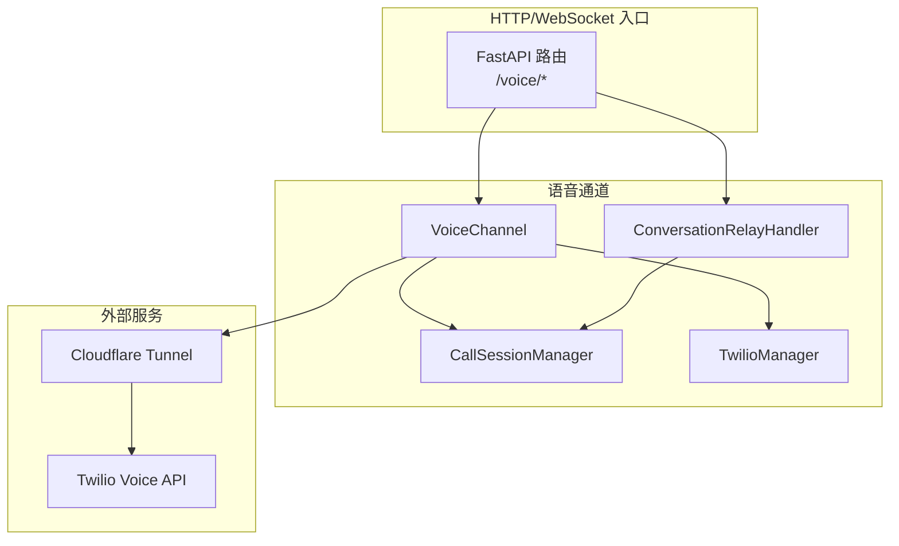
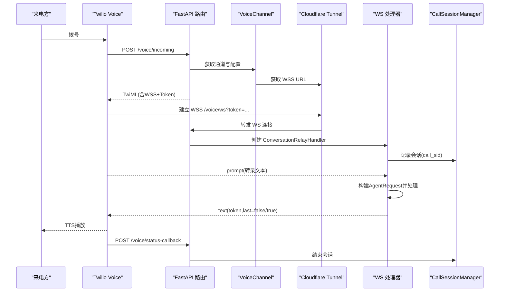
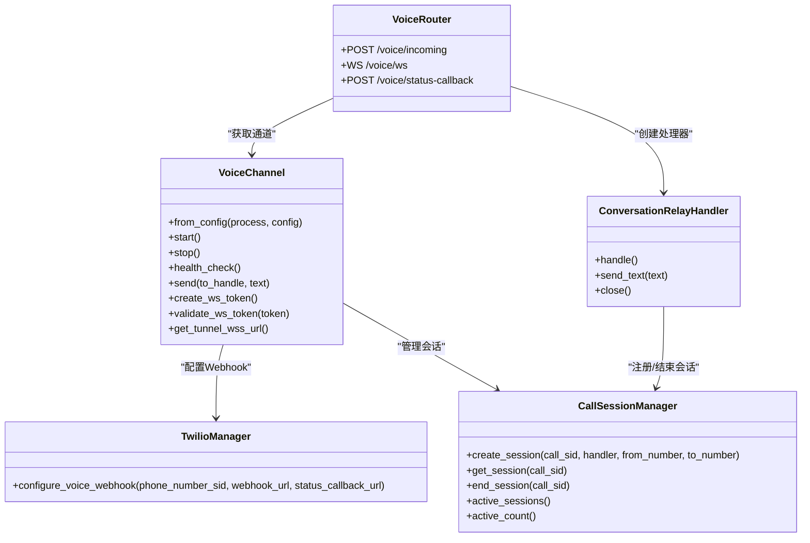

# 语音通信渠道

<cite>
**本文引用的文件**   
- [src/qwenpaw/app/channels/voice/channel.py](file://src/qwenpaw/app/channels/voice/channel.py)
- [src/qwenpaw/app/channels/voice/conversation_relay.py](file://src/qwenpaw/app/channels/voice/conversation_relay.py)
- [src/qwenpaw/app/channels/voice/session.py](file://src/qwenpaw/app/channels/voice/session.py)
- [src/qwenpaw/app/channels/voice/twilio_manager.py](file://src/qwenpaw/app/channels/voice/twilio_manager.py)
- [src/qwenpaw/app/routers/voice.py](file://src/qwenpaw/app/routers/voice.py)
- [src/qwenpaw/app/channels/sip/backend.py](file://src/qwenpaw/app/channels/sip/backend.py)
- [src/qwenpaw/app/channels/sip/stt_tts.py](file://src/qwenpaw/app/channels/sip/stt_tts.py)
- [src/qwenpaw/app/channels/sip/session.py](file://src/qwenpaw/app/channels/sip/session.py)
</cite>

## 目录
1. [简介](#简介)
2. [项目结构](#项目结构)
3. [核心组件](#核心组件)
4. [架构总览](#架构总览)
5. [详细组件分析](#详细组件分析)
6. [依赖关系分析](#依赖关系分析)
7. [性能与延迟优化](#性能与延迟优化)
8. [部署配置指南](#部署配置指南)
9. [故障诊断指南](#故障诊断指南)
10. [结论](#结论)

## 简介
本章节面向 QwenPaw 的“语音通信渠道”，系统性阐述基于 Twilio ConversationRelay 的语音通话、实时对话、语音转文字（STT）和文字转语音（TTS）的实现机制，并补充 SIP 协议支持、音频流处理与会话管理。文档同时覆盖关键配置项、音频格式、延迟优化与音质调优方法，以及通道建立、维持、断开的流程与并发处理能力，并提供部署与排障建议，兼顾初学者与资深开发者。

## 项目结构
围绕语音渠道的核心代码位于 channels/voice 与 routers/voice，SIP 能力位于 channels/sip。整体组织遵循“通道抽象 + 具体实现 + 路由入口”的分层模式：
- 通道抽象与实例：VoiceChannel 负责生命周期、健康检查、会话管理与外部集成（Twilio、隧道）。
- 路由入口：FastAPI 暴露 /voice/incoming、/voice/ws、/voice/status-callback 三个端点。
- 会话管理：CallSessionManager 维护活跃通话。
- 会话处理器：ConversationRelayHandler 处理 Twilio WS 消息、构建 AgentRequest、流式回写文本给 Twilio。
- Twilio 集成：TwilioManager 异步封装 SDK，更新号码 webhook。
- SIP 扩展：backend 协议抽象、stt_tts 工厂、SIP 会话管理。

图表来源
- [src/qwenpaw/app/routers/voice.py:1-184](file://src/qwenpaw/app/routers/voice.py#L1-L184)
- [src/qwenpaw/app/channels/voice/channel.py:1-273](file://src/qwenpaw/app/channels/voice/channel.py#L1-L273)
- [src/qwenpaw/app/channels/voice/conversation_relay.py:1-289](file://src/qwenpaw/app/channels/voice/conversation_relay.py#L1-L289)
- [src/qwenpaw/app/channels/voice/session.py:1-73](file://src/qwenpaw/app/channels/voice/session.py#L1-L73)
- [src/qwenpaw/app/channels/voice/twilio_manager.py:1-58](file://src/qwenpaw/app/channels/voice/twilio_manager.py#L1-L58)

章节来源
- [src/qwenpaw/app/channels/voice/channel.py:1-273](file://src/qwenpaw/app/channels/voice/channel.py#L1-L273)
- [src/qwenpaw/app/routers/voice.py:1-184](file://src/qwenpaw/app/routers/voice.py#L1-L184)

## 核心组件
- VoiceChannel：通道门面，负责启动/停止、健康检查、Tunnel 与 Twilio Webhook 配置、WebSocket Token 生成与校验、向活跃会话发送文本。
- CallSessionManager：按 call_sid 注册/查询/结束会话，统计活跃会话数。
- ConversationRelayHandler：单路通话的 WebSocket 处理器，解析 setup/prompt/interrupt/dtmf，构造 AgentRequest，流式将文本 token 返回给 Twilio。
- TwilioManager：异步包装 twilio SDK，设置 incoming phone number 的 voice_url 与 status_callback。
- FastAPI 路由：验证 Twilio 签名、返回 TwiML、接受 WS 连接、处理状态回调。

章节来源
- [src/qwenpaw/app/channels/voice/channel.py:1-273](file://src/qwenpaw/app/channels/voice/channel.py#L1-L273)
- [src/qwenpaw/app/channels/voice/session.py:1-73](file://src/qwenpaw/app/channels/voice/session.py#L1-L73)
- [src/qwenpaw/app/channels/voice/conversation_relay.py:1-289](file://src/qwenpaw/app/channels/voice/conversation_relay.py#L1-L289)
- [src/qwenpaw/app/channels/voice/twilio_manager.py:1-58](file://src/qwenpaw/app/channels/voice/twilio_manager.py#L1-L58)
- [src/qwenpaw/app/routers/voice.py:1-184](file://src/qwenpaw/app/routers/voice.py#L1-L184)

## 架构总览
Twilio 来电触发 HTTP 回调，后端返回 TwiML 指定 ConversationRelay 的 WSS 地址；Twilio 通过 Cloudflare Tunnel 建立到后端的 WS 连接；WS 上以 JSON 事件驱动 STT/TTS 与 Agent 响应流式输出。

图表来源
- [src/qwenpaw/app/routers/voice.py:84-122](file://src/qwenpaw/app/routers/voice.py#L84-L122)
- [src/qwenpaw/app/routers/voice.py:125-161](file://src/qwenpaw/app/routers/voice.py#L125-L161)
- [src/qwenpaw/app/routers/voice.py:163-184](file://src/qwenpaw/app/routers/voice.py#L163-L184)
- [src/qwenpaw/app/channels/voice/channel.py:114-170](file://src/qwenpaw/app/channels/voice/channel.py#L114-L170)
- [src/qwenpaw/app/channels/voice/conversation_relay.py:60-102](file://src/qwenpaw/app/channels/voice/conversation_relay.py#L60-L102)
- [src/qwenpaw/app/channels/voice/session.py:34-54](file://src/qwenpaw/app/channels/voice/session.py#L34-L54)

## 详细组件分析

### VoiceChannel 通道门面
职责
- 从配置读取 Twilio 凭据与电话号码 SID，初始化 TwilioManager。
- start() 启动 Cloudflare Tunnel，动态计算本地端口，配置 Twilio webhook 与状态回调。
- stop() 关闭所有活跃会话与隧道。
- health_check() 报告通道是否启用、凭据与隧道状态、活跃会话数。
- create_ws_token()/validate_ws_token() 提供一次性 WS 鉴权令牌。
- send(to_handle, text) 向指定 call_sid 的会话发送文本（用于主动播报等场景）。

关键点
- uses_manager_queue=False，因为每个通话是独立的长连接 WS 会话，由各自 handler 运行异步循环。
- 通过 get_tunnel_wss_url() 为 TwiML 提供公网 WSS 地址。

章节来源
- [src/qwenpaw/app/channels/voice/channel.py:17-84](file://src/qwenpaw/app/channels/voice/channel.py#L17-L84)
- [src/qwenpaw/app/channels/voice/channel.py:85-113](file://src/qwenpaw/app/channels/voice/channel.py#L85-L113)
- [src/qwenpaw/app/channels/voice/channel.py:114-191](file://src/qwenpaw/app/channels/voice/channel.py#L114-L191)
- [src/qwenpaw/app/channels/voice/channel.py:192-273](file://src/qwenpaw/app/channels/voice/channel.py#L192-L273)

### Twilio 集成（TwilioManager）
职责
- 异步执行同步 SDK 调用，避免阻塞事件循环。
- configure_voice_webhook(phone_number_sid, webhook_url, status_callback_url) 更新号码的 voice_url 与状态回调。

注意
- 使用 run_in_executor 将阻塞调用放入线程池。
- 超时保护：wait_for 限制配置耗时。

章节来源
- [src/qwenpaw/app/channels/voice/twilio_manager.py:12-58](file://src/qwenpaw/app/channels/voice/twilio_manager.py#L12-L58)

### 路由与 TwiML（/voice/*）
职责
- /voice/incoming：校验 Twilio 签名，返回 TwiML 指定 ConversationRelay 的 WSS 地址与欢迎语、TTS/STT 提供商与语言。
- /voice/ws：校验一次性 token，接受 WS 连接，创建 ConversationRelayHandler 并进入主循环。
- /voice/status-callback：接收 Twilio 呼叫状态变更，结束时清理会话。

安全
- 支持 X-Twilio-Signature 校验，开发环境可跳过。
- 反向代理/隧道下通过 x-forwarded-* 重建签名 URL。

章节来源
- [src/qwenpaw/app/routers/voice.py:42-82](file://src/qwenpaw/app/routers/voice.py#L42-L82)
- [src/qwenpaw/app/routers/voice.py:84-122](file://src/qwenpaw/app/routers/voice.py#L84-L122)
- [src/qwenpaw/app/routers/voice.py:125-161](file://src/qwenpaw/app/routers/voice.py#L125-L161)
- [src/qwenpaw/app/routers/voice.py:163-184](file://src/qwenpaw/app/routers/voice.py#L163-L184)

### 会话管理（CallSessionManager）
职责
- 按 call_sid 创建、查询、结束会话，统计活跃会话数量。
- 与 ConversationRelayHandler 协作，在连接断开或 Twilio 回调时统一收尾。

章节来源
- [src/qwenpaw/app/channels/voice/session.py:16-73](file://src/qwenpaw/app/channels/voice/session.py#L16-L73)

### 通话处理器（ConversationRelayHandler）
职责
- 解析 Twilio WS 事件：setup、prompt、interrupt、dtmf。
- 将用户语音文本转换为 AgentRequest，经 Agent 处理后，将文本 token 流式发回 Twilio 进行 TTS 播放。
- 错误兜底：当 Agent 报错或异常时，发送友好提示文本。
- 关闭流程：发送 end 帧并关闭 WS，通知会话管理器结束会话。

数据流要点
- 收到 prompt -> 构建 AgentRequest(session_id="voice:{call_sid}") -> 迭代事件 -> 提取文本 -> 发送 {type:"text", token, last}。

章节来源
- [src/qwenpaw/app/channels/voice/conversation_relay.py:29-102](file://src/qwenpaw/app/channels/voice/conversation_relay.py#L29-L102)
- [src/qwenpaw/app/channels/voice/conversation_relay.py:103-184](file://src/qwenpaw/app/channels/voice/conversation_relay.py#L103-L184)
- [src/qwenpaw/app/channels/voice/conversation_relay.py:185-289](file://src/qwenpaw/app/channels/voice/conversation_relay.py#L185-L289)

### SIP 协议支持与音频流（可选扩展）
- SipBackend 协议：定义 start/stop/play_audio 及入站/结束回调，便于切换 PyVoIP 与 LiveKit 后端。
- STT/TTS 工厂：create_stt_engine 与 synthesize_tts_stream 支持阿里云 STT/TTS，采样率映射至 PCM 格式。
- SIP 会话：SIPCallSession/SIPCallSessionManager 管理 SIP 通话状态与资源。

说明
- SIP 模块提供可扩展的音频接入与 STT/TTS 能力，可作为独立于 Twilio 的语音通道实现基础。

章节来源
- [src/qwenpaw/app/channels/sip/backend.py:1-55](file://src/qwenpaw/app/channels/sip/backend.py#L1-L55)
- [src/qwenpaw/app/channels/sip/stt_tts.py:1-196](file://src/qwenpaw/app/channels/sip/stt_tts.py#L1-L196)
- [src/qwenpaw/app/channels/sip/session.py:1-92](file://src/qwenpaw/app/channels/sip/session.py#L1-L92)

## 依赖关系分析
- VoiceChannel 依赖 TwilioManager 与 Cloudflare TunnelDriver（后者在 start() 中按需导入）。
- 路由依赖 VoiceChannel 实例（通过 app.state.channel_manager 查找），并在请求上下文中注入签名校验中间件。
- ConversationRelayHandler 依赖 ProcessHandler 与 CallSessionManager，内部再依赖 qwenpaw.schemas 构造标准消息体。
- SIP 模块解耦了底层 RTP/UDP 栈与上层 STT/TTS 引擎。

图表来源
- [src/qwenpaw/app/channels/voice/channel.py:17-84](file://src/qwenpaw/app/channels/voice/channel.py#L17-L84)
- [src/qwenpaw/app/channels/voice/twilio_manager.py:12-58](file://src/qwenpaw/app/channels/voice/twilio_manager.py#L12-L58)
- [src/qwenpaw/app/channels/voice/session.py:28-73](file://src/qwenpaw/app/channels/voice/session.py#L28-L73)
- [src/qwenpaw/app/channels/voice/conversation_relay.py:29-102](file://src/qwenpaw/app/channels/voice/conversation_relay.py#L29-L102)
- [src/qwenpaw/app/routers/voice.py:25-40](file://src/qwenpaw/app/routers/voice.py#L25-L40)

## 性能与延迟优化
- 流式 TTS：Twilio ConversationRelay 采用逐 token 推送，配合 last=true 标记，使 TTS 尽早开始播放，降低首包延迟。
- 单次 Token 鉴权：/voice/ws 使用一次性 token，减少握手开销与安全风险。
- 异步 I/O：Twilio SDK 调用通过线程池执行，避免阻塞事件循环。
- 会话级隔离：每通电话一个 WS 处理器，互不阻塞，提升并发吞吐。
- 健康检查：快速判断通道可用性与活跃会话数，辅助自动扩缩容与告警。

[本节为通用指导，无需源码引用]

## 部署配置指南
- 启用语音通道：在通道配置中设置 enabled=true。
- Twilio 凭据：twilio_account_sid、twilio_auth_token。
- 电话号码：phone_number_sid（必须存在且已购买）。
- 欢迎语与模型：welcome_greeting、tts_provider、tts_voice、stt_provider、language。
- 隧道：start() 会自动启动 Cloudflare Tunnel 并将本地端口映射为公网 WSS。
- 签名校验：生产环境务必配置 twilio_auth_token，否则 /voice/incoming 会拒绝无签名的请求。

章节来源
- [src/qwenpaw/app/channels/voice/channel.py:55-84](file://src/qwenpaw/app/channels/voice/channel.py#L55-L84)
- [src/qwenpaw/app/channels/voice/channel.py:114-170](file://src/qwenpaw/app/channels/voice/channel.py#L114-L170)
- [src/qwenpaw/app/routers/voice.py:84-122](file://src/qwenpaw/app/routers/voice.py#L84-L122)

## 故障诊断指南
常见问题与定位
- 通道未启用：health_check 返回 disabled。检查配置 enabled 字段。
- Twilio 凭据缺失：health_check 返回 unhealthy，日志提示缺少凭据。
- 隧道未启动：health_check 返回 unhealthy，需确认 start() 成功并获取到 public_wss_url。
- Twilio 签名失败：/voice/incoming 返回 403，检查 X-Twilio-Signature 与 x-forwarded-* 头是否正确。
- WS 连接被拒：/voice/ws 因 token 无效或过期关闭，检查 create_ws_token/validate_ws_token 逻辑与时间窗口。
- 会话未释放：status-callback 未触发或未被处理，导致会话残留。检查回调 URL 可达性与路由处理。

排查步骤
- 查看健康检查接口返回的状态与 detail。
- 核对 Twilio 控制台号码的 voice_url 与 status_callback 是否指向当前公网地址。
- 在反向代理/隧道环境下，确保 x-forwarded-proto/host 透传正确。
- 观察活跃会话计数与日志中的 call_sid，确认会话生命周期闭环。

章节来源
- [src/qwenpaw/app/channels/voice/channel.py:85-113](file://src/qwenpaw/app/channels/voice/channel.py#L85-L113)
- [src/qwenpaw/app/routers/voice.py:42-82](file://src/qwenpaw/app/routers/voice.py#L42-L82)
- [src/qwenpaw/app/routers/voice.py:125-161](file://src/qwenpaw/app/routers/voice.py#L125-L161)
- [src/qwenpaw/app/routers/voice.py:163-184](file://src/qwenpaw/app/routers/voice.py#L163-L184)

## 结论
QwenPaw 的语音渠道以 VoiceChannel 为核心，结合 Twilio ConversationRelay 与 Cloudflare Tunnel，实现了低延迟的实时语音对话链路。通过一次性 WS token、流式文本推送与完善的会话管理，系统在易用性、安全性与可扩展性之间取得良好平衡。SIP 模块提供了另一条可扩展的语音接入路径，便于在不同基础设施间灵活切换。