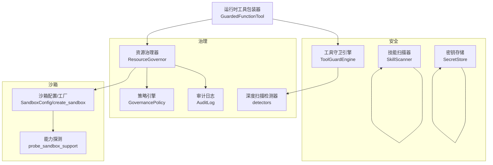
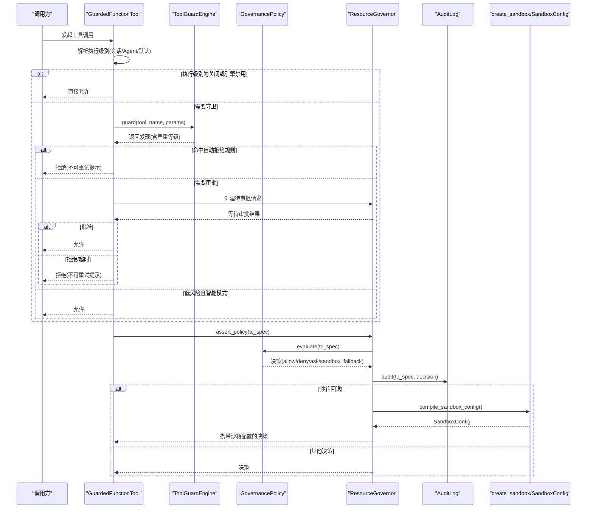
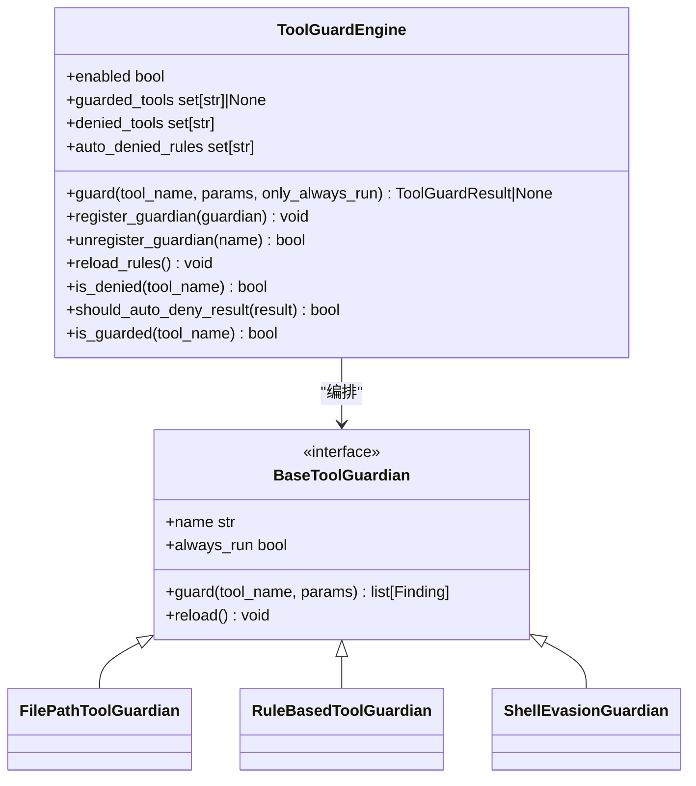
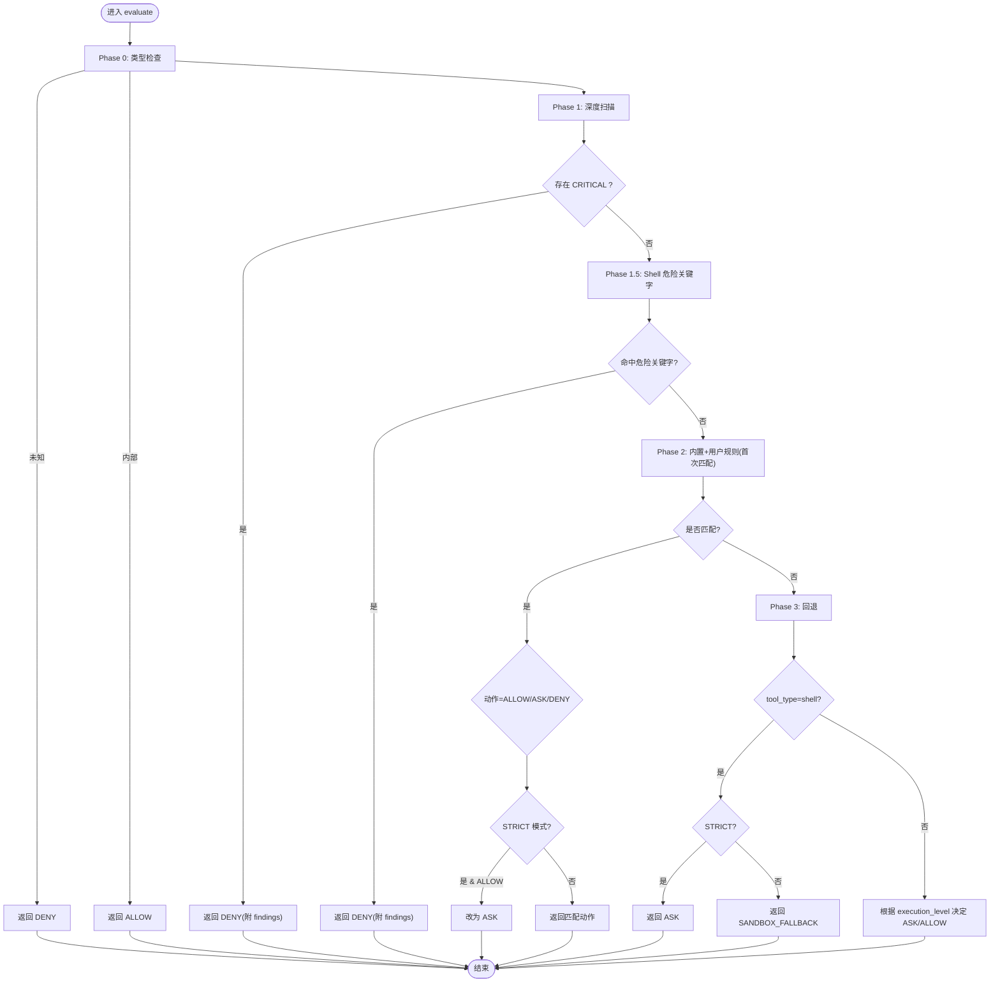
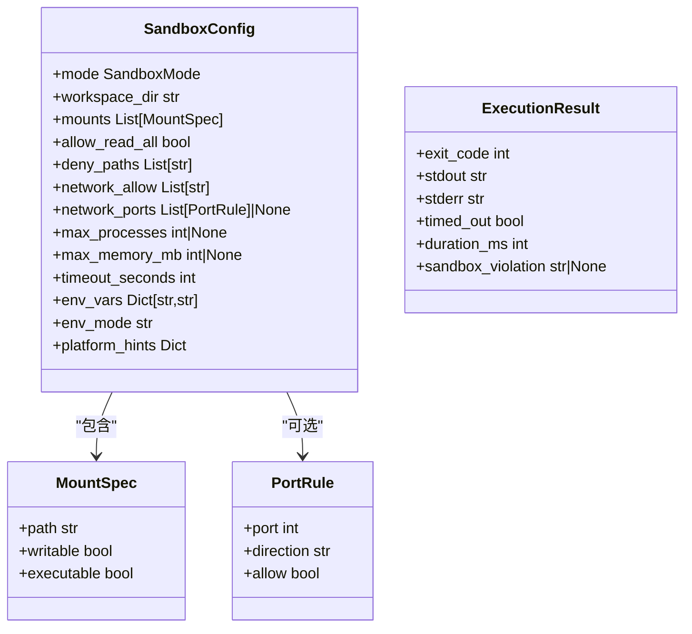
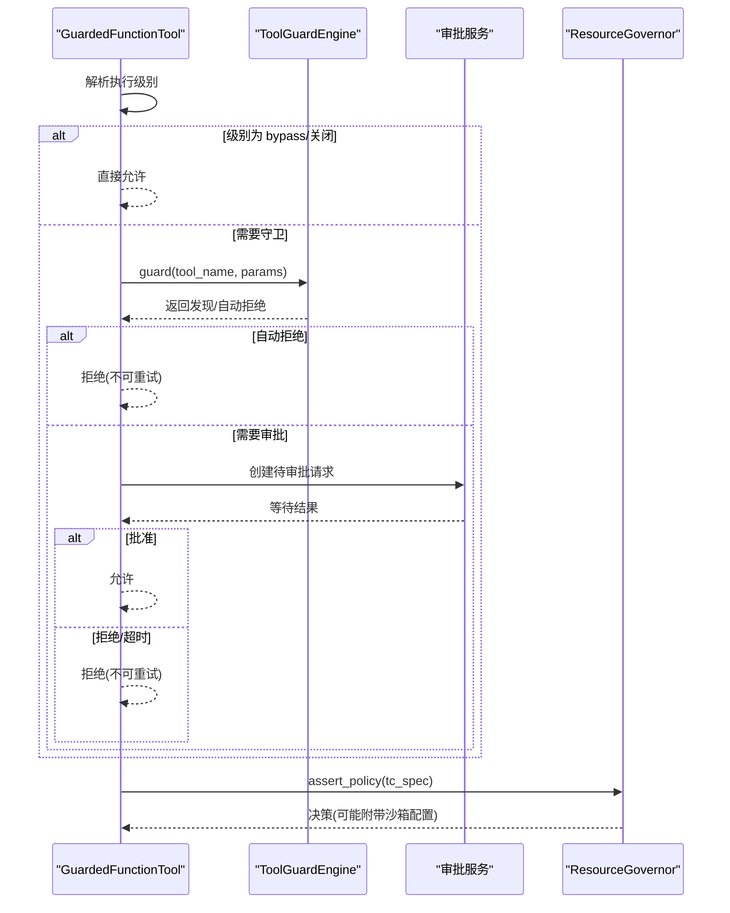
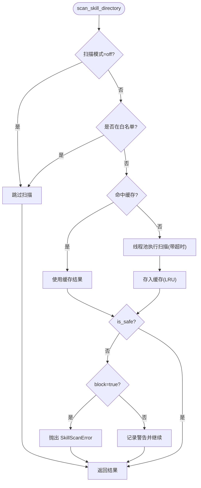
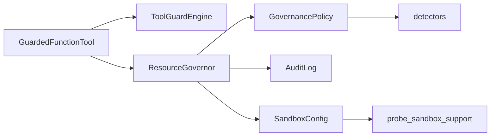

# 安全与治理

<cite>
**本文引用的文件**   
- [security/__init__.py](file://src/qwenpaw/security/__init__.py)
- [runtime/tool_guard.py](file://src/qwenpaw/runtime/tool_guard.py)
- [security/tool_guard/__init__.py](file://src/qwenpaw/security/tool_guard/__init__.py)
- [security/tool_guard/engine.py](file://src/qwenpaw/security/tool_guard/engine.py)
- [governance/resource_governor.py](file://src/qwenpaw/governance/resource_governor.py)
- [governance/policy.py](file://src/qwenpaw/governance/policy.py)
- [governance/detectors.py](file://src/qwenpaw/governance/detectors.py)
- [governance/audit.py](file://src/qwenpaw/governance/audit.py)
- [sandbox/config.py](file://src/qwenpaw/sandbox/config.py)
- [sandbox/__init__.py](file://src/qwenpaw/sandbox/__init__.py)
- [security/skill_scanner/__init__.py](file://src/qwenpaw/security/skill_scanner/__init__.py)
- [security/skill_scanner/scanner.py](file://src/qwenpaw/security/skill_scanner/scanner.py)
- [security/secret_store.py](file://src/qwenpaw/security/secret_store.py)
</cite>

## 目录
1. [简介](#简介)
2. [项目结构](#项目结构)
3. [核心组件](#核心组件)
4. [架构总览](#架构总览)
5. [详细组件分析](#详细组件分析)
6. [依赖关系分析](#依赖关系分析)
7. [性能考量](#性能考量)
8. [故障排查指南](#故障排查指南)
9. [结论](#结论)
10. [附录](#附录)

## 简介
本文件系统性阐述 QwenPaw 的安全与治理体系，覆盖以下关键主题：
- 安全模型设计：工具调用前置守卫、策略引擎（内置规则 + 用户规则）、深度扫描与 Shell 危险关键字检测。
- 沙箱机制：跨平台内核级隔离能力探测与执行约束（macOS Seatbelt、Linux bubblewrap/Landlock、Windows AppContainer）。
- 工具守卫系统：参数级风险识别（路径敏感、正则规则、Shell 逃逸规避）与审批流集成。
- 访问策略管理：策略加载、匹配、动态增删、审计记录与回退策略。
- 密钥存储方案：基于 Fernet 的透明加解密、系统钥匙串优先与本地文件兜底。
- 技能包安全扫描：安装/激活前静态分析、白名单、阻断历史与缓存。
- 与其他组件的关系：运行时工具包装器、治理层、沙箱工厂、审计日志等。

## 项目结构
安全与治理相关代码主要分布在如下模块：
- security：工具守卫、技能扫描、密钥存储
- governance：策略定义、评估、审计
- sandbox：沙箱配置、能力探测、后端工厂
- runtime：工具包装器（将守卫与审批接入工具调用链路）

图表来源
- [security/tool_guard/engine.py:1-269](file://src/qwenpaw/security/tool_guard/engine.py#L1-L269)
- [governance/policy.py:1-800](file://src/qwenpaw/governance/policy.py#L1-L800)
- [governance/resource_governor.py:1-510](file://src/qwenpaw/governance/resource_governor.py#L1-L510)
- [governance/audit.py:1-381](file://src/qwenpaw/governance/audit.py#L1-L381)
- [governance/detectors.py:1-764](file://src/qwenpaw/governance/detectors.py#L1-L764)
- [sandbox/config.py:1-499](file://src/qwenpaw/sandbox/config.py#L1-L499)
- [runtime/tool_guard.py:1-415](file://src/qwenpaw/runtime/tool_guard.py#L1-L415)
- [security/skill_scanner/scanner.py:1-319](file://src/qwenpaw/security/skill_scanner/scanner.py#L1-L319)
- [security/secret_store.py:1-467](file://src/qwenpaw/security/secret_store.py#L1-L467)

章节来源
- [security/__init__.py:1-21](file://src/qwenpaw/security/__init__.py#L1-L21)
- [sandbox/__init__.py:1-63](file://src/qwenpaw/sandbox/__init__.py#L1-L63)

## 核心组件
- 工具守卫引擎（ToolGuardEngine）：编排多个守护器（路径敏感、规则匹配、Shell 逃逸规避），聚合发现并支持自动拒绝规则集。
- 治理策略（GovernancePolicy）：两阶段匹配（内置规则 + 用户规则），结合 Phase 1 深度扫描与 Phase 1.5 Shell 危险关键字检测，输出决策（允许/拒绝/询问/沙箱回退）。
- 资源治理器（ResourceGovernor）：负责策略评估、审计记录、沙箱配置编译与动态规则追加。
- 沙箱配置与工厂（SandboxConfig/create_sandbox）：统一描述约束（挂载、端口、环境变量、超时），按平台选择最佳实现（Seatbelt/bubblewrap/Landlock/AppContainer）。
- 审计日志（AuditLog）：单例 SQLite 持久化，支持分页查询与自动清理。
- 技能扫描器（SkillScanner）：安装/激活前对技能包进行静态扫描，支持白名单、阻断历史与结果缓存。
- 密钥存储（SecretStore）：Fernet 加解密，优先使用系统钥匙串，失败时回退到本地文件，提供字典字段批量加解密接口。

章节来源
- [security/tool_guard/engine.py:1-269](file://src/qwenpaw/security/tool_guard/engine.py#L1-L269)
- [governance/policy.py:1-800](file://src/qwenpaw/governance/policy.py#L1-L800)
- [governance/resource_governor.py:1-510](file://src/qwenpaw/governance/resource_governor.py#L1-L510)
- [sandbox/config.py:1-499](file://src/qwenpaw/sandbox/config.py#L1-L499)
- [governance/audit.py:1-381](file://src/qwenpaw/governance/audit.py#L1-L381)
- [security/skill_scanner/scanner.py:1-319](file://src/qwenpaw/security/skill_scanner/scanner.py#L1-L319)
- [security/secret_store.py:1-467](file://src/qwenpaw/security/secret_store.py#L1-L467)

## 架构总览
下图展示一次工具调用的完整安全与治理流程，包括前置守卫、策略评估、审批与沙箱执行。

图表来源
- [runtime/tool_guard.py:1-415](file://src/qwenpaw/runtime/tool_guard.py#L1-L415)
- [security/tool_guard/engine.py:1-269](file://src/qwenpaw/security/tool_guard/engine.py#L1-L269)
- [governance/policy.py:1-800](file://src/qwenpaw/governance/policy.py#L1-L800)
- [governance/resource_governor.py:1-510](file://src/qwenpaw/governance/resource_governor.py#L1-L510)
- [governance/audit.py:1-381](file://src/qwenpaw/governance/audit.py#L1-L381)
- [sandbox/config.py:1-499](file://src/qwenpaw/sandbox/config.py#L1-L499)

## 详细组件分析

### 工具守卫系统（ToolGuardEngine）
- 职责：在工具实际执行前对参数进行扫描，产出结构化发现（包含严重等级、类别、建议修复等），支持“自动拒绝”规则集。
- 守护器：
  - 路径敏感守护：检测目标是否指向敏感文件或目录。
  - 规则守护：基于 YAML 正则签名快速匹配危险模式。
  - Shell 逃逸规避守护：检测命令替换、转义混淆、引号不一致等。
- 特性：
  - 支持仅运行 always_run 守护器（用于非受管工具的路径检查）。
  - 支持动态注册/卸载守护器与规则重载。
  - 通过环境变量或配置文件开关启用/禁用。

图表来源
- [security/tool_guard/engine.py:1-269](file://src/qwenpaw/security/tool_guard/engine.py#L1-L269)
- [security/tool_guard/__init__.py:1-59](file://src/qwenpaw/security/tool_guard/__init__.py#L1-L59)

章节来源
- [security/tool_guard/engine.py:1-269](file://src/qwenpaw/security/tool_guard/engine.py#L1-L269)
- [security/tool_guard/__init__.py:1-59](file://src/qwenpaw/security/tool_guard/__init__.py#L1-L59)

### 治理策略与评估（GovernancePolicy + ResourceGovernor）
- 策略组成：
  - 内置规则（builtin_rules）：系统保护性规则（如 .env/.ssh/.aws 等敏感路径 ASK；sudo/rm -rf / 等 DENY）。
  - 用户规则（user_rules）：由用户审批后生成并可持久化。
- 评估流程（v2.0）：
  - Phase 0：类型检查（未知→DENY，内部→ALLOW）。
  - Phase 1：深度安全扫描（敏感路径、危险模式、Shell 逃逸规避），CRITICAL→立即 DENY。
  - Phase 1.5：Shell 危险关键字正则检测（补充 fnmatch 无法匹配的变体）。
  - Phase 2：内置规则 + 用户规则（首次匹配生效），STRICT 模式可将 ALLOW 升级为 ASK。
  - Phase 3：回退策略（shell→SANDBOX_FALLBACK，其他→根据 execution_level 决定 ASK/ALLOW）。
- 资源治理器：
  - 负责加载/保存策略、审计记录、沙箱配置编译（从 user_rules 推导读写挂载）、动态添加规则。
  - 当 SANDBOX_FALLBACK 但平台不支持或全局开关关闭时，降级为 ALLOW（保持 Phase 0-2 防护）。

图表来源
- [governance/policy.py:1-800](file://src/qwenpaw/governance/policy.py#L1-L800)
- [governance/detectors.py:1-764](file://src/qwenpaw/governance/detectors.py#L1-L764)
- [governance/resource_governor.py:1-510](file://src/qwenpaw/governance/resource_governor.py#L1-L510)

章节来源
- [governance/policy.py:1-800](file://src/qwenpaw/governance/policy.py#L1-L800)
- [governance/resource_governor.py:1-510](file://src/qwenpaw/governance/resource_governor.py#L1-L510)
- [governance/detectors.py:1-764](file://src/qwenpaw/governance/detectors.py#L1-L764)

### 沙箱机制（SandboxConfig + create_sandbox）
- 能力探测：
  - macOS：检测 sandbox-exec 可用性（Seatbelt）。
  - Linux：优先 bubblewrap（需用户命名空间），否则 Landlock（内核≥5.13，LSM 启用，ABI 版本探测）。
  - Windows：AppContainer（Win10+，icacls.exe 可用，API 可调用）。
- 配置项：
  - 工作目录、挂载列表（读/写/可执行）、读取默认策略（全允许/白名单）、禁止路径、网络域白名单、端口规则、进程/内存限制、超时、环境变量注入/白名单模式、平台透传参数。
- 工厂分发：根据 mode 实例化对应后端（MacOSSandbox/BubblewrapSandbox/LinuxSandbox/WindowsSandbox/NoneSandbox）。

图表来源
- [sandbox/config.py:1-499](file://src/qwenpaw/sandbox/config.py#L1-L499)

章节来源
- [sandbox/config.py:1-499](file://src/qwenpaw/sandbox/config.py#L1-L499)
- [sandbox/__init__.py:1-63](file://src/qwenpaw/sandbox/__init__.py#L1-L63)

### 运行时工具包装器（GuardedFunctionTool）
- 作用：将工具调用路由至守卫引擎与审批服务，依据执行级别（OFF/AUTO/SMART/STRICT）与拒绝清单做出最终决策。
- 执行级别解析优先级：
  - 会话级覆盖（来自前端 request_context）。
  - Agent 配置中的 approval_level。
  - 未绑定 agent_id 或异常时回退为 bypass。
- 审批流程：
  - 创建 PendingApproval，阻塞等待审批结果（批准/拒绝/超时），并将结果映射为允许/拒绝。
  - 拒绝消息附加“不要重试”的系统指令，避免模型反复尝试被拒操作。

图表来源
- [runtime/tool_guard.py:1-415](file://src/qwenpaw/runtime/tool_guard.py#L1-L415)
- [security/tool_guard/engine.py:1-269](file://src/qwenpaw/security/tool_guard/engine.py#L1-L269)
- [governance/resource_governor.py:1-510](file://src/qwenpaw/governance/resource_governor.py#L1-L510)

章节来源
- [runtime/tool_guard.py:1-415](file://src/qwenpaw/runtime/tool_guard.py#L1-L415)

### 审计日志（AuditLog）
- 存储：单文件 SQLite，WAL 模式，索引优化（时间戳、工作区、代理、工具）。
- 功能：
  - record：写入事件（ts 以毫秒整数存储），自动清理阈值触发删除最旧记录。
  - query：多条件过滤与分页。
  - purge：手动清理并 VACUUM。
- 生命周期：全局单例，ResourceGovernor.stop 中显式关闭以释放句柄并触发 VACUUM。

章节来源
- [governance/audit.py:1-381](file://src/qwenpaw/governance/audit.py#L1-L381)
- [governance/resource_governor.py:1-510](file://src/qwenpaw/governance/resource_governor.py#L1-L510)

### 技能包安全扫描（SkillScanner）
- 扫描流程：
  - 文件发现：递归遍历，跳过符号链接与大文件，限制最大文件数。
  - 分析器执行：默认 PatternAnalyzer（YAML 正则签名），可扩展更多分析器。
  - 去重：按 finding id 去重（可由策略控制）。
- 策略与缓存：
  - ScanPolicy：文件分类、大小/数量上限、规则作用域与去重策略。
  - 结果缓存：基于 mtime 的 LRU 缓存，减少重复扫描开销。
- 白名单与阻断历史：
  - 白名单支持内容哈希校验，确保同名不同内容的技能不被误放行。
  - 阻断历史持久化（blocked.json），支持查看、清空与移除条目。

图表来源
- [security/skill_scanner/__init__.py:1-487](file://src/qwenpaw/security/skill_scanner/__init__.py#L1-L487)
- [security/skill_scanner/scanner.py:1-319](file://src/qwenpaw/security/skill_scanner/scanner.py#L1-L319)

章节来源
- [security/skill_scanner/__init__.py:1-487](file://src/qwenpaw/security/skill_scanner/__init__.py#L1-L487)
- [security/skill_scanner/scanner.py:1-319](file://src/qwenpaw/security/skill_scanner/scanner.py#L1-L319)

### 密钥存储（SecretStore）
- 加密算法：Fernet（AES-128-CBC + HMAC-SHA256），明文值以 ENC: 前缀标识。
- 主密钥获取顺序：
  - 进程内缓存（热路径）。
  - 系统钥匙串（keyring，优先）。
  - 本地文件 SECRET_DIR/.master_key（权限 0o600）。
  - 若均不可用则生成新密钥并回写。
- 环境适配：
  - 容器/无头 Linux/CI 环境下自动跳过 keyring 访问，避免阻塞。
  - 支持通过环境变量切换 keyring account，避免多安装共享同一钥匙串条目导致冲突。
- 便捷接口：
  - encrypt/decrypt/is_encrypted。
  - encrypt_dict_fields/decrypt_dict_fields：对字典指定字段批量加解密。
  - reload_master_key_from_disk：恢复备份后刷新缓存并同步钥匙串。

章节来源
- [security/secret_store.py:1-467](file://src/qwenpaw/security/secret_store.py#L1-L467)

## 依赖关系分析
- 组件耦合：
  - GuardedFunctionTool 依赖 ToolGuardEngine 与审批服务，同时与 ResourceGovernor 协作完成策略评估与沙箱配置。
  - ResourceGovernor 依赖 GovernancePolicy 与 AuditLog，并在需要时调用 SandboxConfig 工厂。
  - GovernancePolicy 依赖 detectors 进行深度扫描，依赖 ToolRegistry 进行工具类型判定。
  - SandboxConfig 独立于上层业务，提供跨平台能力探测与后端实例化。
- 外部依赖：
  - keyring（系统钥匙串）、cryptography（Fernet）、sqlite3（审计）、shutil/subprocess（能力探测）。
- 潜在循环：
  - 通过延迟导入与懒初始化避免定义期强依赖（例如 GuardedFunctionTool 动态继承 FunctionTool）。

图表来源
- [runtime/tool_guard.py:1-415](file://src/qwenpaw/runtime/tool_guard.py#L1-L415)
- [security/tool_guard/engine.py:1-269](file://src/qwenpaw/security/tool_guard/engine.py#L1-L269)
- [governance/resource_governor.py:1-510](file://src/qwenpaw/governance/resource_governor.py#L1-L510)
- [governance/policy.py:1-800](file://src/qwenpaw/governance/policy.py#L1-L800)
- [governance/detectors.py:1-764](file://src/qwenpaw/governance/detectors.py#L1-L764)
- [governance/audit.py:1-381](file://src/qwenpaw/governance/audit.py#L1-L381)
- [sandbox/config.py:1-499](file://src/qwenpaw/sandbox/config.py#L1-L499)

章节来源
- [runtime/tool_guard.py:1-415](file://src/qwenpaw/runtime/tool_guard.py#L1-L415)
- [security/tool_guard/engine.py:1-269](file://src/qwenpaw/security/tool_guard/engine.py#L1-L269)
- [governance/resource_governor.py:1-510](file://src/qwenpaw/governance/resource_governor.py#L1-L510)
- [governance/policy.py:1-800](file://src/qwenpaw/governance/policy.py#L1-L800)
- [governance/detectors.py:1-764](file://src/qwenpaw/governance/detectors.py#L1-L764)
- [governance/audit.py:1-381](file://src/qwenpaw/governance/audit.py#L1-L381)
- [sandbox/config.py:1-499](file://src/qwenpaw/sandbox/config.py#L1-L499)

## 性能考量
- 工具守卫：
  - 守护器异常不影响整体流程（记录失败信息）。
  - 仅 always_run 守护器在非受管工具上执行，降低开销。
- 策略评估：
  - 深度扫描采用正则编译缓存，避免重复编译。
  - 严格模式下对 ALLOW 升级为 ASK，增加交互成本，应谨慎开启。
- 沙箱：
  - 能力探测仅在启动时执行一次，后续复用。
  - 当前默认 network_allow=["*"]，未来可按策略细化。
- 审计：
  - WAL 模式与索引提升写入与查询性能。
  - 自动清理避免数据库膨胀。
- 技能扫描：
  - 基于 mtime 的结果缓存与 LRU 淘汰，减少重复扫描。
  - 线程池执行与超时保护，防止长时间阻塞。

## 故障排查指南
- 工具守卫未生效：
  - 检查执行级别是否为 OFF 或引擎被禁用（环境变量/配置）。
  - 确认工具是否在受管集合或被拒绝清单排除。
- 审批卡住：
  - 检查审批服务是否可用、超时设置是否合理。
  - 确认前端推送通道正常（/console/push-messages）。
- 沙箱不可用：
  - 查看 probe_sandbox_support 返回的原因（缺少 bwrap、Landlock ABI 不足、Seatbelt 不可用等）。
  - 确认全局开关 security.sandbox_enabled 是否关闭。
- 审计查询为空：
  - 确认 Record 是否成功写入（SQLite 错误会被捕获并记录日志）。
  - 检查时间范围与过滤条件是否正确。
- 密钥解密失败：
  - 检查主密钥文件是否存在且格式正确。
  - 在容器/无头环境中，确认已禁用 keyring 并使用文件回退。
- 技能扫描超时：
  - 调整 scan_timeout 与 max_files/max_file_size。
  - 检查技能包是否过大或包含大量大文件。

章节来源
- [security/tool_guard/engine.py:1-269](file://src/qwenpaw/security/tool_guard/engine.py#L1-L269)
- [runtime/tool_guard.py:1-415](file://src/qwenpaw/runtime/tool_guard.py#L1-L415)
- [sandbox/config.py:1-499](file://src/qwenpaw/sandbox/config.py#L1-L499)
- [governance/audit.py:1-381](file://src/qwenpaw/governance/audit.py#L1-L381)
- [security/secret_store.py:1-467](file://src/qwenpaw/security/secret_store.py#L1-L467)
- [security/skill_scanner/__init__.py:1-487](file://src/qwenpaw/security/skill_scanner/__init__.py#L1-L487)

## 结论
QwenPaw 的安全与治理体系通过“前置守卫 + 策略评估 + 沙箱隔离 + 审计追踪”的多层防护，兼顾安全性与可用性。其设计强调：
- 可扩展：守护器与分析器均可插拔扩展。
- 可观测：审计与日志贯穿全流程。
- 可配置：策略与执行级别灵活可调。
- 可落地：跨平台沙箱能力探测与回退策略保障在不同环境下的可用性。

## 附录
- 配置选项参考：
  - 工具守卫：QWENPAW_TOOL_GUARD_ENABLED、config.security.tool_guard.enabled。
  - 技能扫描：QWENPAW_SKILL_SCAN_MODE、config.security.skill_scanner.mode/timeout/whitelist。
  - 沙箱：config.security.sandbox_enabled、SandboxConfig 各项约束。
  - 密钥存储：QWENPAW_DISABLE_KEYRING、QWENPAW_RUNNING_IN_CONTAINER、QWENPAW_WORKING_DIR/QWENPAW_SECRET_DIR、KEYRING_ACCOUNT_ENV。
- 返回值与状态：
  - 工具守卫：ToolGuardResult（findings、max_severity、guardians_used/failed）。
  - 策略评估：GovernanceDecision（action、reason、sandbox_config、findings、source）。
  - 沙箱执行：ExecutionResult（exit_code、stdout/stderr、timed_out、duration_ms、violation）。
  - 审计：AuditEvent（ts、workspace_dir、agent_id、session_id、tool_name、target、decision、reason、extra）。