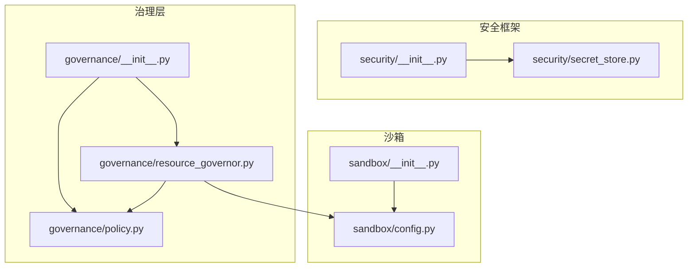
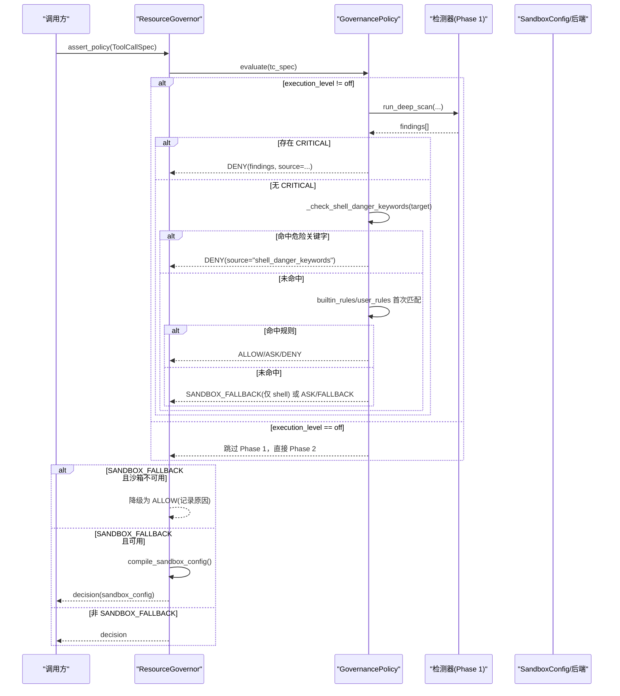
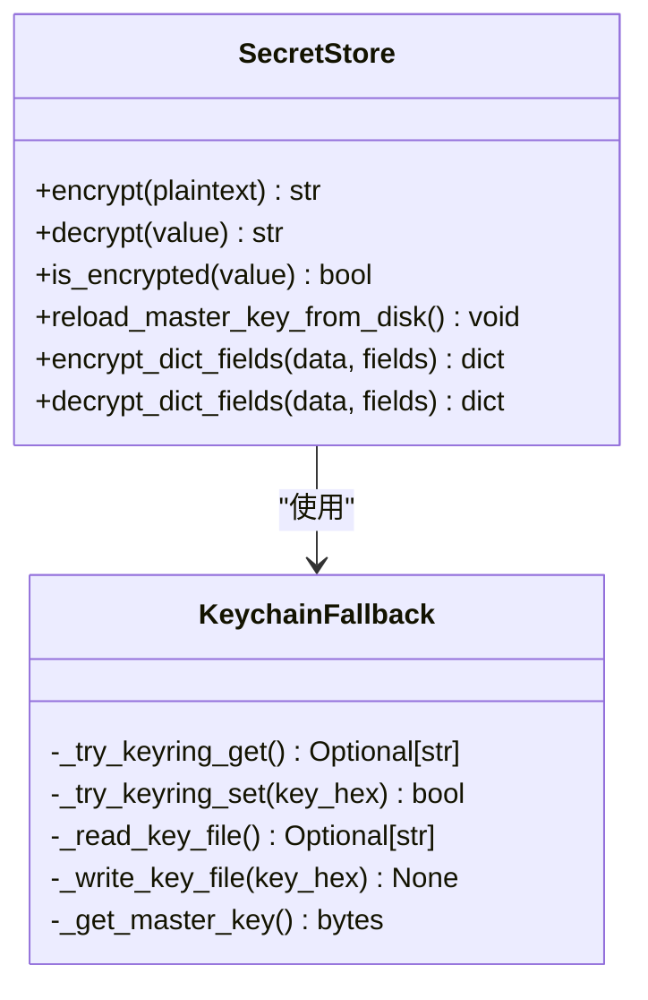
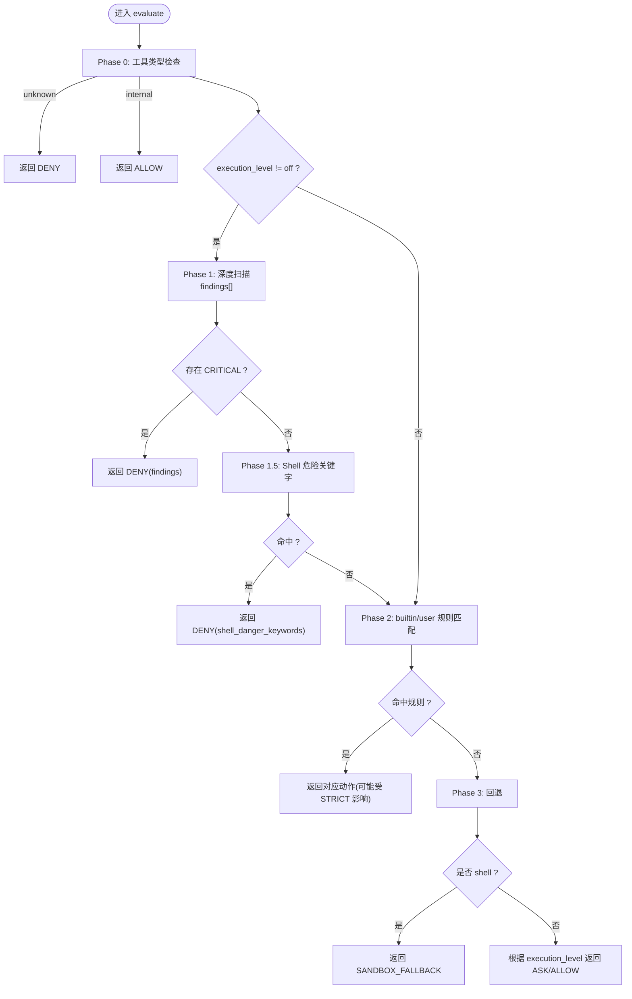
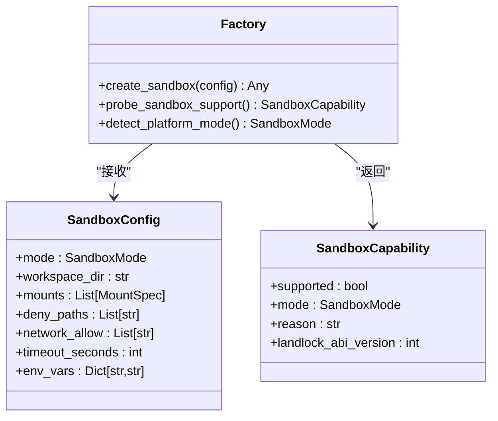
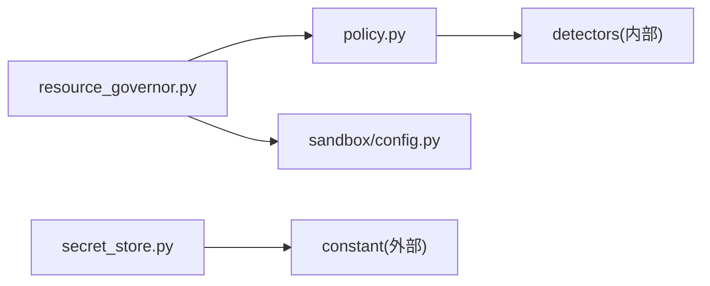

# 安全模型设计

<cite>
**本文引用的文件**   
- [src/qwenpaw/security/__init__.py](file://src/qwenpaw/security/__init__.py)
- [src/qwenpaw/security/secret_store.py](file://src/qwenpaw/security/secret_store.py)
- [src/qwenpaw/governance/__init__.py](file://src/qwenpaw/governance/__init__.py)
- [src/qwenpaw/governance/policy.py](file://src/qwenpaw/governance/policy.py)
- [src/qwenpaw/governance/resource_governor.py](file://src/qwenpaw/governance/resource_governor.py)
- [src/qwenpaw/sandbox/config.py](file://src/qwenpaw/sandbox/config.py)
- [src/qwenpaw/sandbox/__init__.py](file://src/qwenpaw/sandbox/__init__.py)
- [tests/contract/security/test_guardian_contract.py](file://tests/contract/security/test_guardian_contract.py)
</cite>

## 目录
1. [引言](#引言)
2. [项目结构](#项目结构)
3. [核心组件](#核心组件)
4. [架构总览](#架构总览)
5. [详细组件分析](#详细组件分析)
6. [依赖关系分析](#依赖关系分析)
7. [性能与可扩展性](#性能与可扩展性)
8. [故障排查指南](#故障排查指南)
9. [结论](#结论)
10. [附录：配置项与接口速查](#附录配置项与接口速查)

## 引言
本文件系统化阐述 QwenPaw 的安全模型，覆盖整体安全架构、安全边界定义、信任模型与威胁防护策略；并给出具体实现细节、调用关系、接口、领域模型和使用模式。重点包括多层安全防护体系、权限控制模型与安全策略执行机制，帮助初学者快速理解，同时为经验丰富的开发者提供足够的技术深度。

## 项目结构
QwenPaw 的安全能力由三大子系统协同构成：
- 安全框架（security）：工具调用前置扫描、技能静态扫描、敏感信息加密存储
- 治理层（governance）：策略引擎、审计日志、沙箱配置编译与动态规则管理
- 沙箱（sandbox）：跨平台执行隔离与资源限制

**图表来源**
- [src/qwenpaw/security/__init__.py:1-21](file://src/qwenpaw/security/__init__.py#L1-L21)
- [src/qwenpaw/security/secret_store.py:1-467](file://src/qwenpaw/security/secret_store.py#L1-L467)
- [src/qwenpaw/governance/__init__.py:1-21](file://src/qwenpaw/governance/__init__.py#L1-L21)
- [src/qwenpaw/governance/policy.py:1-800](file://src/qwenpaw/governance/policy.py#L1-L800)
- [src/qwenpaw/governance/resource_governor.py:1-510](file://src/qwenpaw/governance/resource_governor.py#L1-L510)
- [src/qwenpaw/sandbox/__init__.py:1-63](file://src/qwenpaw/sandbox/__init__.py#L1-L63)
- [src/qwenpaw/sandbox/config.py:1-499](file://src/qwenpaw/sandbox/config.py#L1-L499)

**章节来源**
- [src/qwenpaw/security/__init__.py:1-21](file://src/qwenpaw/security/__init__.py#L1-L21)
- [src/qwenpaw/governance/__init__.py:1-21](file://src/qwenpaw/governance/__init__.py#L1-L21)
- [src/qwenpaw/sandbox/__init__.py:1-63](file://src/qwenpaw/sandbox/__init__.py#L1-L63)

## 核心组件
- 安全框架
  - 工具调用守卫：在工具执行前进行参数扫描，检测命令注入、数据外泄等危险模式
  - 技能扫描：在安装/激活前对技能目录进行静态分析
  - 密钥存储：使用 Fernet（AES-128-CBC + HMAC-SHA256）对磁盘上的敏感字段进行透明加解密，主密钥优先存放于系统钥匙串，回退到受限权限的文件
- 治理层
  - 策略引擎：内置规则与用户规则双层匹配，支持 ASK/DENY/ALLOW/SANDBOX_FALLBACK 动作
  - 审计日志：记录每次策略评估结果，便于合规与取证
  - 沙箱配置编译：根据策略与用户规则生成文件系统挂载、网络与资源限制等约束
- 沙箱
  - 多后端适配：macOS Seatbelt、Linux bubblewrap/Landlock、Windows AppContainer、无隔离
  - 能力探测：启动时自动探测可用模式与 ABI 版本
  - 工厂创建：按 SandboxConfig.mode 分发到具体后端实例

**章节来源**
- [src/qwenpaw/security/__init__.py:1-21](file://src/qwenpaw/security/__init__.py#L1-L21)
- [src/qwenpaw/security/secret_store.py:1-467](file://src/qwenpaw/security/secret_store.py#L1-L467)
- [src/qwenpaw/governance/__init__.py:1-21](file://src/qwenpaw/governance/__init__.py#L1-L21)
- [src/qwenpaw/governance/policy.py:1-800](file://src/qwenpaw/governance/policy.py#L1-L800)
- [src/qwenpaw/governance/resource_governor.py:1-510](file://src/qwenpaw/governance/resource_governor.py#L1-L510)
- [src/qwenpaw/sandbox/config.py:1-499](file://src/qwenpaw/sandbox/config.py#L1-L499)

## 架构总览
下图展示一次工具调用的完整安全决策流程，涵盖“深扫描 → 关键字检查 → 规则匹配 → 沙箱降级/编译”的三段式路径。

**图表来源**
- [src/qwenpaw/governance/resource_governor.py:196-271](file://src/qwenpaw/governance/resource_governor.py#L196-L271)
- [src/qwenpaw/governance/policy.py:607-730](file://src/qwenpaw/governance/policy.py#L607-L730)
- [src/qwenpaw/governance/policy.py:310-324](file://src/qwenpaw/governance/policy.py#L310-L324)
- [src/qwenpaw/sandbox/config.py:424-459](file://src/qwenpaw/sandbox/config.py#L424-L459)

## 详细组件分析

### 安全框架：工具守卫与密钥存储
- 工具守卫契约
  - BaseToolGuardian 抽象基类要求子类实现 guard(tool_name, params) -> list[GuardFinding]
  - 未知工具名与空参数需优雅处理，不崩溃
  - GuardFinding 必须填充必要字段（rule_id、category、severity、title、description、tool_name、guardian 等）
- 密钥存储（Fernet）
  - 主密钥获取顺序：进程缓存 → OS 钥匙串 → 本地文件（.master_key，权限 0o600）→ 生成新密钥并持久化
  - 兼容旧 CoPaw 钥匙串条目；在容器/无桌面环境/CI 下自动跳过 keyring 访问
  - 提供 encrypt/decrypt/is_encrypted 及字典字段批量加解密辅助函数
  - 支持从磁盘恢复后刷新进程内缓存并同步钥匙串

**图表来源**
- [src/qwenpaw/security/secret_store.py:346-467](file://src/qwenpaw/security/secret_store.py#L346-L467)
- [src/qwenpaw/security/secret_store.py:168-242](file://src/qwenpaw/security/secret_store.py#L168-L242)
- [src/qwenpaw/security/secret_store.py:287-322](file://src/qwenpaw/security/secret_store.py#L287-L322)

**章节来源**
- [tests/contract/security/test_guardian_contract.py:1-289](file://tests/contract/security/test_guardian_contract.py#L1-L289)
- [src/qwenpaw/security/secret_store.py:1-467](file://src/qwenpaw/security/secret_store.py#L1-L467)

### 治理层：策略引擎与资源治理
- 策略类型与动作
  - GovernanceAction：allow / deny / ask / sandbox_fallback
  - GovernanceDecision：包含 action、reason、sandbox_config、findings、source
  - ToolCallSpec：封装 tool_name、target、agent_id、session_id、raw_params
  - GovernanceRule：match 格式 "ToolName(pattern)"，支持 grantee/session 级作用域
- 三层评估流程
  - Phase 0：工具注册表类型检查（未知→DENY，internal→ALLOW）
  - Phase 1：深度安全扫描（敏感路径、模式匹配、Shell 逃逸检测），CRITICAL→立即 DENY
  - Phase 1.5：Shell 危险关键字正则检查（如递归删除根、sudo、fork bomb、写裸设备、mkfs）
  - Phase 2：builtin_rules + user_rules 首次匹配（strict 模式下 ALLOW→ASK）
  - Phase 3：默认回退（shell→SANDBOX_FALLBACK，其他→ASK/ALLOW 取决于 execution_level）
- 资源治理器（ResourceGovernor）
  - 负责加载/保存策略、审计记录、沙箱配置编译、动态添加规则
  - 当 SANDBOX_FALLBACK 但沙箱不可用时，降级为 ALLOW（保留 Phase 0-2 保护）
  - 编译沙箱配置：基于用户规则解析 mount 列表，设置 deny_paths、env_vars、超时等

**图表来源**
- [src/qwenpaw/governance/policy.py:607-730](file://src/qwenpaw/governance/policy.py#L607-L730)
- [src/qwenpaw/governance/policy.py:310-324](file://src/qwenpaw/governance/policy.py#L310-L324)

**章节来源**
- [src/qwenpaw/governance/policy.py:1-800](file://src/qwenpaw/governance/policy.py#L1-L800)
- [src/qwenpaw/governance/resource_governor.py:196-271](file://src/qwenpaw/governance/resource_governor.py#L196-L271)
- [src/qwenpaw/governance/resource_governor.py:300-379](file://src/qwenpaw/governance/resource_governor.py#L300-L379)

### 沙箱：跨平台执行隔离
- 能力探测
  - Linux：优先 bubblewrap（bwrap + 用户命名空间），回退 Landlock（内核≥5.13，LSM 启用，ABI 探测）
  - macOS：Seatbelt（sandbox-exec）
  - Windows：AppContainer（Win10+，icacls.exe，CreateAppContainerProfile API）
- 配置与工厂
  - SandboxConfig：mode、mounts、deny_paths、network_allow、端口规则、资源限制、超时、环境变量注入模式等
  - create_sandbox：按 mode 分发到 MacOSSandbox/BubblewrapSandbox/LinuxSandbox/WindowsSandbox/NoneSandbox
- 与治理层集成
  - ResourceGovernor.compile_sandbox_config 将用户规则中的读写路径映射为 MountSpec，并注入 deny_paths/env_vars 等

**图表来源**
- [src/qwenpaw/sandbox/config.py:80-156](file://src/qwenpaw/sandbox/config.py#L80-L156)
- [src/qwenpaw/sandbox/config.py:424-459](file://src/qwenpaw/sandbox/config.py#L424-L459)
- [src/qwenpaw/sandbox/config.py:467-499](file://src/qwenpaw/sandbox/config.py#L467-L499)

**章节来源**
- [src/qwenpaw/sandbox/config.py:1-499](file://src/qwenpaw/sandbox/config.py#L1-L499)
- [src/qwenpaw/sandbox/__init__.py:1-63](file://src/qwenpaw/sandbox/__init__.py#L1-L63)
- [src/qwenpaw/governance/resource_governor.py:300-379](file://src/qwenpaw/governance/resource_governor.py#L300-L379)

## 依赖关系分析
- 模块耦合
  - governance.resource_governor 强依赖 policy 与 sandbox.config
  - security.secret_store 独立，通过常量与环境变量决定钥匙串/文件行为
  - sandbox.config 提供平台无关的配置与工厂，被治理层消费
- 外部依赖
  - cryptography（Fernet）、keyring（系统钥匙串）、wcmatch（glob 匹配）、yaml（策略持久化）
- 潜在循环
  - 各子包保持低耦合，导入延迟加载以避免冷启动开销

**图表来源**
- [src/qwenpaw/governance/policy.py:731-757](file://src/qwenpaw/governance/policy.py#L731-L757)
- [src/qwenpaw/governance/resource_governor.py:1-510](file://src/qwenpaw/governance/resource_governor.py#L1-L510)
- [src/qwenpaw/sandbox/config.py:1-499](file://src/qwenpaw/sandbox/config.py#L1-L499)
- [src/qwenpaw/security/secret_store.py:1-467](file://src/qwenpaw/security/secret_store.py#L1-L467)

**章节来源**
- [src/qwenpaw/governance/resource_governor.py:1-510](file://src/qwenpaw/governance/resource_governor.py#L1-L510)
- [src/qwenpaw/governance/policy.py:1-800](file://src/qwenpaw/governance/policy.py#L1-L800)
- [src/qwenpaw/sandbox/config.py:1-499](file://src/qwenpaw/sandbox/config.py#L1-L499)
- [src/qwenpaw/security/secret_store.py:1-467](file://src/qwenpaw/security/secret_store.py#L1-L467)

## 性能与可扩展性
- 冷启动优化
  - 安全框架子模块采用延迟导入，避免引入重型依赖
  - 主密钥与 Fernet 实例进程内缓存，减少重复计算
- 热路径优化
  - 策略评估遵循“首次匹配”，builtin_rules 在前，user_rules 在后，命中即返回
  - 深度扫描异常被捕获并降级，不影响后续规则匹配
- 可扩展点
  - 新增检测器：扩展 detection_rules 与 detectors 模块
  - 新增守护器：实现 BaseToolGuardian 并注册
  - 新增沙箱后端：实现统一接口并通过 create_sandbox 分发

[本节为通用指导，无需特定文件引用]

## 故障排查指南
- 无法读取系统钥匙串
  - 现象：keyring get/set 超时或失败，回退到文件存储
  - 排查：确认是否在容器/无桌面环境运行；可设置禁用 keyring 的环境变量
  - 参考：[src/qwenpaw/security/secret_store.py:93-131](file://src/qwenpaw/security/secret_store.py#L93-L131)、[src/qwenpaw/security/secret_store.py:168-242](file://src/qwenpaw/security/secret_store.py#L168-L242)
- 主密钥损坏或不一致
  - 现象：解密失败，返回原始密文并告警
  - 处理：使用 reload_master_key_from_disk 刷新缓存并同步钥匙串
  - 参考：[src/qwenpaw/security/secret_store.py:382-423](file://src/qwenpaw/security/secret_store.py#L382-L423)
- 沙箱不可用导致命令未隔离
  - 现象：SANDBOX_FALLBACK 被降级为 ALLOW
  - 排查：检查 platform 支持、全局开关 security.sandbox_enabled、bwrap/seatbelt/appcontainer 可用性
  - 参考：[src/qwenpaw/governance/resource_governor.py:106-135](file://src/qwenpaw/governance/resource_governor.py#L106-L135)、[src/qwenpaw/sandbox/config.py:424-459](file://src/qwenpaw/sandbox/config.py#L424-L459)
- 策略未生效或误判
  - 现象：期望 ASK 却 ALLOW，或相反
  - 排查：查看 decision.source 与 reason；确认 execution_level、builtin/user 规则优先级与匹配模式
  - 参考：[src/qwenpaw/governance/policy.py:607-730](file://src/qwenpaw/governance/policy.py#L607-L730)

**章节来源**
- [src/qwenpaw/security/secret_store.py:93-131](file://src/qwenpaw/security/secret_store.py#L93-L131)
- [src/qwenpaw/security/secret_store.py:382-423](file://src/qwenpaw/security/secret_store.py#L382-L423)
- [src/qwenpaw/governance/resource_governor.py:106-135](file://src/qwenpaw/governance/resource_governor.py#L106-L135)
- [src/qwenpaw/sandbox/config.py:424-459](file://src/qwenpaw/sandbox/config.py#L424-L459)
- [src/qwenpaw/governance/policy.py:607-730](file://src/qwenpaw/governance/policy.py#L607-L730)

## 结论
QwenPaw 的安全模型以“检测先行、策略驱动、沙箱兜底”为核心思想：
- 检测先行：Phase 1 深度扫描与 Phase 1.5 关键字检查快速拦截高危操作
- 策略驱动：builtin_rules 与 user_rules 双层匹配，支持细粒度授权与会话级作用域
- 沙箱兜底：对 shell 类操作提供跨平台隔离，结合 deny_paths 与 env 白名单最小暴露面
配合透明的密钥存储与完善的审计日志，形成可观测、可演进的多层防护体系。

[本节为总结性内容，无需特定文件引用]

## 附录：配置项与接口速查
- 策略相关
  - GovernanceAction：allow / deny / ask / sandbox_fallback
  - GovernanceDecision：action、reason、sandbox_config、findings、source
  - GovernanceRule.match：格式 "ToolName(pattern)"，支持 grantee/session 级作用域
  - DEFAULT_BUILTIN_RULES / DEFAULT_USER_RULES：内置与默认用户规则集合
  - DEFAULT_SANDBOX_DENY_PATHS / DEFAULT_ENV_BLACKLIST：沙箱默认拒绝路径与黑名单环境变量
- 治理器接口
  - ResourceGovernor.assert_policy(tc_spec) → GovernanceDecision
  - ResourceGovernor.audit(tc_spec, decision) → None
  - ResourceGovernor.compile_sandbox_config(tc_spec) → SandboxConfig
  - ResourceGovernor.add_rule(rule) / add_approved_rule(...)
- 沙箱配置
  - SandboxConfig：mode、workspace_dir、mounts、deny_paths、network_allow、network_ports、max_processes、max_memory_mb、timeout_seconds、env_vars、platform_hints
  - probe_sandbox_support() → SandboxCapability
  - detect_platform_mode() → SandboxMode
  - create_sandbox(config) → 具体后端实例
- 密钥存储
  - encrypt/decrypt/is_encrypted
  - encrypt_dict_fields/decrypt_dict_fields
  - reload_master_key_from_disk

**章节来源**
- [src/qwenpaw/governance/policy.py:36-123](file://src/qwenpaw/governance/policy.py#L36-L123)
- [src/qwenpaw/governance/policy.py:253-259](file://src/qwenpaw/governance/policy.py#L253-L259)
- [src/qwenpaw/governance/policy.py:330-380](file://src/qwenpaw/governance/policy.py#L330-L380)
- [src/qwenpaw/governance/resource_governor.py:196-271](file://src/qwenpaw/governance/resource_governor.py#L196-L271)
- [src/qwenpaw/governance/resource_governor.py:300-379](file://src/qwenpaw/governance/resource_governor.py#L300-L379)
- [src/qwenpaw/sandbox/config.py:80-156](file://src/qwenpaw/sandbox/config.py#L80-L156)
- [src/qwenpaw/sandbox/config.py:424-459](file://src/qwenpaw/sandbox/config.py#L424-L459)
- [src/qwenpaw/sandbox/config.py:467-499](file://src/qwenpaw/sandbox/config.py#L467-L499)
- [src/qwenpaw/security/secret_store.py:346-467](file://src/qwenpaw/security/secret_store.py#L346-L467)