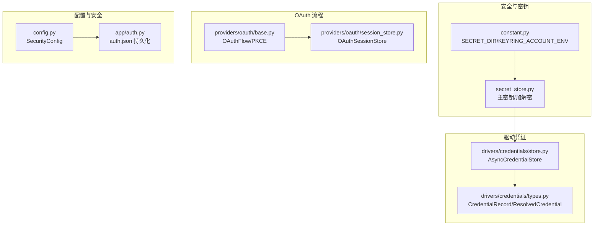
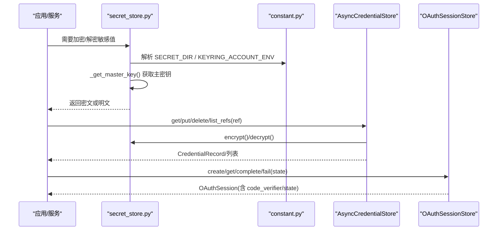
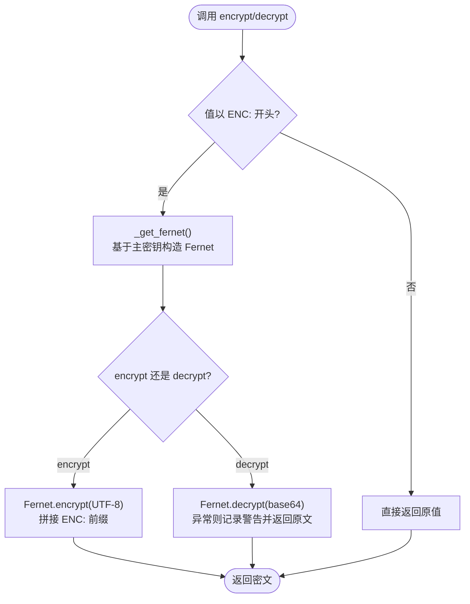
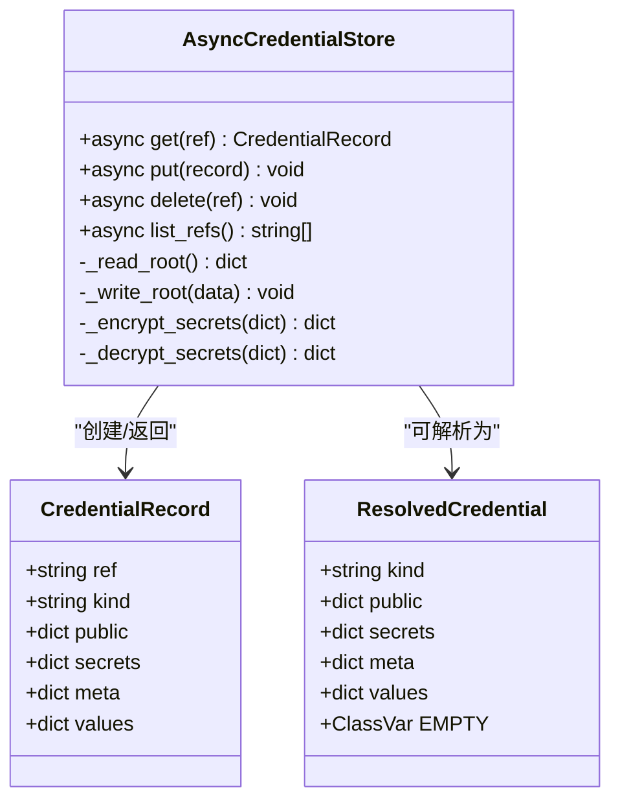
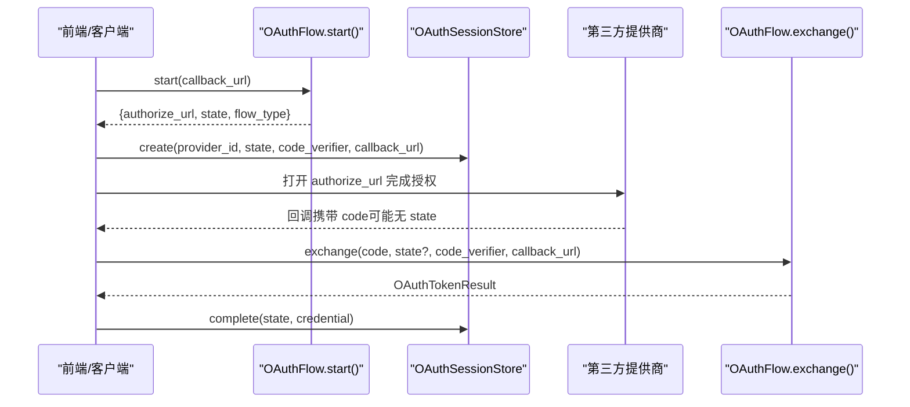
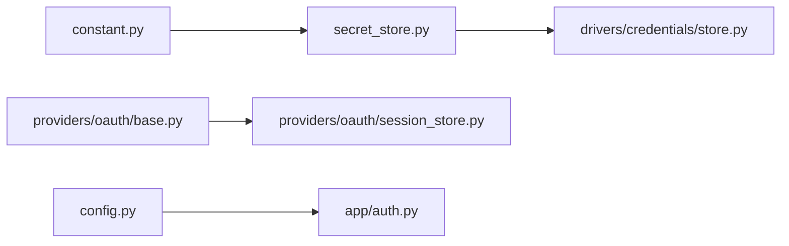

# 密钥管理

<cite>
**本文引用的文件**   
- [secret_store.py](file://src/qwenpaw/security/secret_store.py)
- [store.py](file://src/qwenpaw/drivers/credentials/store.py)
- [types.py](file://src/qwenpaw/drivers/credentials/types.py)
- [base.py](file://src/qwenpaw/providers/oauth/base.py)
- [session_store.py](file://src/qwenpaw/providers/oauth/session_store.py)
- [config.py](file://src/qwenpaw/config/config.py)
- [constant.py](file://src/qwenpaw/constant.py)
- [auth.py](file://src/qwenpaw/app/auth.py)
</cite>

## 目录
1. [简介](#简介)
2. [项目结构](#项目结构)
3. [核心组件](#核心组件)
4. [架构总览](#架构总览)
5. [详细组件分析](#详细组件分析)
6. [依赖关系分析](#依赖关系分析)
7. [性能与可用性](#性能与可用性)
8. [故障排查指南](#故障排查指南)
9. [结论](#结论)
10. [附录](#附录)

## 简介
本文件系统性梳理 QwenPaw 的密钥管理系统，覆盖密钥存储方案、加密算法、凭证管理与安全访问控制。重点说明：
- 主密钥（Master Key）获取与回退策略（系统钥匙串优先，本地文件兜底）
- Fernet 对称加密在敏感字段上的应用
- 工作区级 YAML 凭证存储与原子写入
- OAuth 流程中的临时会话与 PKCE 安全机制
- 配置项与安全边界（可信代理、免认证主机等）
- 备份恢复对主密钥的影响与热重载
- 多提供商支持与生命周期管理

## 项目结构
密钥相关代码主要分布在以下模块：
- 安全层：secret_store.py（主密钥与加解密）
- 驱动凭证：drivers/credentials/*（YAML 凭证存储与类型定义）
- OAuth 流程：providers/oauth/*（基础模型、PKCE、会话存储）
- 配置与安全：config.py、constant.py（路径、环境变量、安全开关）
- 应用认证：app/auth.py（auth.json 持久化）

**图表来源**
- [secret_store.py:1-467](file://src/qwenpaw/security/secret_store.py#L1-L467)
- [constant.py:102-114](file://src/qwenpaw/constant.py#L102-L114)
- [store.py:1-225](file://src/qwenpaw/drivers/credentials/store.py#L1-L225)
- [types.py:1-61](file://src/qwenpaw/drivers/credentials/types.py#L1-L61)
- [base.py:1-113](file://src/qwenpaw/providers/oauth/base.py#L1-L113)
- [session_store.py:1-115](file://src/qwenpaw/providers/oauth/session_store.py#L1-L115)
- [config.py:2070-2126](file://src/qwenpaw/config/config.py#L2070-L2126)
- [auth.py:1-260](file://src/qwenpaw/app/auth.py#L1-L260)

**章节来源**
- [secret_store.py:1-467](file://src/qwenpaw/security/secret_store.py#L1-L467)
- [constant.py:102-114](file://src/qwenpaw/constant.py#L102-L114)
- [store.py:1-225](file://src/qwenpaw/drivers/credentials/store.py#L1-L225)
- [types.py:1-61](file://src/qwenpaw/drivers/credentials/types.py#L1-L61)
- [base.py:1-113](file://src/qwenpaw/providers/oauth/base.py#L1-L113)
- [session_store.py:1-115](file://src/qwenpaw/providers/oauth/session_store.py#L1-L115)
- [config.py:2070-2126](file://src/qwenpaw/config/config.py#L2070-L2126)
- [auth.py:1-260](file://src/qwenpaw/app/auth.py#L1-L260)

## 核心组件
- 主密钥与加解密（Fernet + 系统钥匙串/本地文件）
  - 主密钥解析顺序：进程缓存 → 系统钥匙串 → 本地 .master_key → 生成并落盘
  - 提供 encrypt/decrypt/is_encrypted 及字典字段批量加解密工具
- 工作区凭证存储（YAML）
  - AsyncCredentialStore 提供异步 API，内部同步 IO 通过线程池隔离
  - secrets 字段统一加密存储，public/meta 明文保存
  - 原子写入（临时文件 + fsync + replace），POSIX 下限制权限为 0o600
- OAuth 基础与 PKCE
  - OAuthFlow 抽象 start/exchange/refresh，支持浏览器重定向和设备码两种流
  - generate_code_verifier/generate_code_challenge 实现 RFC 7636
  - OAuthSessionStore 进程内 TTL 过期清理
- 配置与安全边界
  - SecurityConfig 包含沙箱开关、免认证主机列表、可信代理白名单校验
  - SECRET_DIR 由 constant.py 计算，支持环境变量覆盖
- 应用认证数据
  - auth.json 位于 SECRET_DIR，使用相同加解密能力保护 jwt_secret 等字段

**章节来源**
- [secret_store.py:287-374](file://src/qwenpaw/security/secret_store.py#L287-L374)
- [secret_store.py:429-466](file://src/qwenpaw/security/secret_store.py#L429-L466)
- [store.py:22-225](file://src/qwenpaw/drivers/credentials/store.py#L22-L225)
- [types.py:14-61](file://src/qwenpaw/drivers/credentials/types.py#L14-L61)
- [base.py:57-113](file://src/qwenpaw/providers/oauth/base.py#L57-L113)
- [session_store.py:14-115](file://src/qwenpaw/providers/oauth/session_store.py#L14-L115)
- [config.py:2070-2126](file://src/qwenpaw/config/config.py#L2070-L2126)
- [constant.py:102-114](file://src/qwenpaw/constant.py#L102-L114)
- [auth.py:207-260](file://src/qwenpaw/app/auth.py#L207-L260)

## 架构总览
下图展示密钥从“获取主密钥”到“加密存储/读取”，再到“OAuth 临时会话”的整体链路。

**图表来源**
- [secret_store.py:287-374](file://src/qwenpaw/security/secret_store.py#L287-L374)
- [constant.py:102-114](file://src/qwenpaw/constant.py#L102-L114)
- [store.py:35-108](file://src/qwenpaw/drivers/credentials/store.py#L35-L108)
- [session_store.py:46-115](file://src/qwenpaw/providers/oauth/session_store.py#L46-L115)

## 详细组件分析

### 主密钥与加解密（secret_store.py）
- 主密钥获取策略
  - 进程缓存命中则直接返回
  - 尝试系统钥匙串（keyring），若超时/不可用则回退
  - 读取本地 .master_key（严格长度与格式校验）
  - 未找到则生成新主密钥，优先写入钥匙串，同时写本地文件
- 加解密接口
  - encrypt(value) → ENC:<base64-ciphertext>
  - decrypt(value) → 自动识别 ENC: 前缀，失败时降级返回原文
  - is_encrypted(value) → 判断是否已加密
- 字典字段批量处理
  - encrypt_dict_fields(data, secret_fields)
  - decrypt_dict_fields(data, secret_fields)
- 主密钥热重载
  - reload_master_key_from_disk()：清除进程缓存并从磁盘重新加载，必要时更新钥匙串

**图表来源**
- [secret_store.py:332-374](file://src/qwenpaw/security/secret_store.py#L332-L374)
- [secret_store.py:436-466](file://src/qwenpaw/security/secret_store.py#L436-L466)

**章节来源**
- [secret_store.py:89-321](file://src/qwenpaw/security/secret_store.py#L89-L321)
- [secret_store.py:332-374](file://src/qwenpaw/security/secret_store.py#L332-L374)
- [secret_store.py:382-423](file://src/qwenpaw/security/secret_store.py#L382-L423)
- [secret_store.py:429-466](file://src/qwenpaw/security/secret_store.py#L429-L466)

### 工作区凭证存储（AsyncCredentialStore）
- 数据结构
  - CredentialRecord：ref/kind/public/secrets/meta；values 合并 public+secrets
  - ResolvedCredential：运行时解析后的凭证（EMPTY 常量）
- 存储格式
  - YAML 根节点 version + credentials 映射
  - 每个 ref 对应 kind/public/secrets/meta
- 读写语义
  - get(ref)：env:xxx 直接从环境变量取值；否则从 YAML 读取并解密 secrets
  - put(record)：校验非空与类型，加密 secrets，原子写入（临时文件 + fsync + os.replace），POSIX 下 chmod 0o600
  - delete(list_refs)：删除条目或列出所有引用
- 并发与阻塞
  - 对外 async API，内部 IO 通过 asyncio.to_thread 执行，避免阻塞事件循环

**图表来源**
- [types.py:14-61](file://src/qwenpaw/drivers/credentials/types.py#L14-L61)
- [store.py:22-225](file://src/qwenpaw/drivers/credentials/store.py#L22-L225)

**章节来源**
- [types.py:14-61](file://src/qwenpaw/drivers/credentials/types.py#L14-L61)
- [store.py:22-225](file://src/qwenpaw/drivers/credentials/store.py#L22-L225)

### OAuth 基础与 PKCE（providers/oauth）
- OAuthFlow 抽象
  - start(callback_url) → OAuthStartResult(authorize_url, state, flow_type)
  - exchange(code, state, code_verifier, callback_url) → OAuthTokenResult(api_key/access_token/refresh_token/expires_at/base_url)
  - refresh(refresh_token) → OAuthTokenResult（可选）
  - get_credential_dict(result) → 将结果转换为 provider 配置字段（如 api_key）
- PKCE 工具
  - generate_code_verifier()：随机 base64url
  - generate_code_challenge(verifier)：SHA-256 + base64url
  - generate_state()：URL-safe 随机状态令牌
- 会话存储（OAuthSessionStore）
  - 进程内内存存储，TTL=600s，自动清理过期
  - 支持按 state 或 provider_id 查找最近 pending 会话（兼容不回传 state 的提供商）

**图表来源**
- [base.py:15-113](file://src/qwenpaw/providers/oauth/base.py#L15-L113)
- [session_store.py:33-115](file://src/qwenpaw/providers/oauth/session_store.py#L33-L115)

**章节来源**
- [base.py:15-113](file://src/qwenpaw/providers/oauth/base.py#L15-L113)
- [session_store.py:14-115](file://src/qwenpaw/providers/oauth/session_store.py#L14-L115)

### 配置与安全边界（config.py + constant.py）
- SecurityConfig
  - sandbox_enabled：全局治理沙箱开关
  - allow_no_auth_hosts：默认允许 localhost 免认证访问
  - trusted_proxies：反向代理 IP/CIDR 白名单，拒绝全零网段
- 路径与环境变量
  - SECRET_DIR：默认 ~/.qwenpaw.secret，可通过 QWENPAW_SECRET_DIR 覆盖
  - KEYRING_ACCOUNT_ENV：QWENPAW_KEYRING_ACCOUNT，用于覆盖系统钥匙串账户名

**章节来源**
- [config.py:2070-2126](file://src/qwenpaw/config/config.py#L2070-L2126)
- [constant.py:102-114](file://src/qwenpaw/constant.py#L102-L114)

### 应用认证数据（app/auth.py）
- auth.json 存放于 SECRET_DIR，用于持久化登录态与 JWT 相关机密
- 与 secret_store 的集成：对 jwt_secret 等字段进行加密存储

**章节来源**
- [auth.py:1-260](file://src/qwenpaw/app/auth.py#L1-L260)

## 依赖关系分析
- secret_store.py 依赖 constant.py 的 SECRET_DIR 与 KEYRING_ACCOUNT_ENV
- drivers/credentials/store.py 依赖 secret_store.py 的 encrypt/decrypt/is_encrypted
- providers/oauth/* 独立于存储层，仅依赖标准库与 Pydantic
- config.py 的 SecurityConfig 影响整体安全行为（如可信代理、免认证主机）

**图表来源**
- [constant.py:102-114](file://src/qwenpaw/constant.py#L102-L114)
- [secret_store.py:1-467](file://src/qwenpaw/security/secret_store.py#L1-L467)
- [store.py:1-225](file://src/qwenpaw/drivers/credentials/store.py#L1-L225)
- [base.py:1-113](file://src/qwenpaw/providers/oauth/base.py#L1-L113)
- [session_store.py:1-115](file://src/qwenpaw/providers/oauth/session_store.py#L1-L115)
- [config.py:2070-2126](file://src/qwenpaw/config/config.py#L2070-L2126)
- [auth.py:1-260](file://src/qwenpaw/app/auth.py#L1-L260)

**章节来源**
- [constant.py:102-114](file://src/qwenpaw/constant.py#L102-L114)
- [secret_store.py:1-467](file://src/qwenpaw/security/secret_store.py#L1-L467)
- [store.py:1-225](file://src/qwenpaw/drivers/credentials/store.py#L1-L225)
- [base.py:1-113](file://src/qwenpaw/providers/oauth/base.py#L1-L113)
- [session_store.py:1-115](file://src/qwenpaw/providers/oauth/session_store.py#L1-L115)
- [config.py:2070-2126](file://src/qwenpaw/config/config.py#L2070-L2126)
- [auth.py:1-260](file://src/qwenpaw/app/auth.py#L1-L260)

## 性能与可用性
- 主密钥缓存与双检锁：避免重复 I/O 与竞争条件
- 钥匙串访问超时保护：daemon 线程 + 超时，防止 D-Bus 挂起导致阻塞
- 凭证存储原子性：临时文件 + fsync + replace，保证一致性
- 异步封装：IO 操作放入线程池，避免阻塞 FastAPI 事件循环
- OAuth 会话 TTL：定期清理，降低内存占用

[本节为通用指导，无需具体文件分析]

## 故障排查指南
- 无法解密值（返回原文）
  - 现象：decrypt 返回原始密文字符串
  - 原因：主密钥变更或数据损坏
  - 处理：检查 SECRET_DIR/.master_key 是否被替换；调用 reload_master_key_from_disk() 刷新缓存与钥匙串
- 钥匙串不可用或超时
  - 现象：日志提示 keyring 超时或不可用
  - 原因：容器/无头环境/D-Bus 不可用
  - 处理：设置 QWENPAW_DISABLE_KEYRING=1 或 QWENPAW_RUNNING_IN_CONTAINER=1，强制使用本地文件
- 凭证写入失败
  - 现象：DriverCardError 提示写入失败
  - 原因：权限不足、磁盘空间不足、YAML 格式错误
  - 处理：确认目标目录可写、文件格式正确、POSIX 下权限 0o600 生效
- OAuth 会话过期
  - 现象：exchange 找不到对应 state 或 session
  - 原因：超过 600s TTL
  - 处理：缩短授权流程耗时或重试 start

**章节来源**
- [secret_store.py:355-374](file://src/qwenpaw/security/secret_store.py#L355-L374)
- [secret_store.py:382-423](file://src/qwenpaw/security/secret_store.py#L382-L423)
- [store.py:155-186](file://src/qwenpaw/drivers/credentials/store.py#L155-L186)
- [session_store.py:28-31](file://src/qwenpaw/providers/oauth/session_store.py#L28-L31)

## 结论
QwenPaw 的密钥管理采用“系统钥匙串优先 + 本地文件兜底”的主密钥策略，结合 Fernet 对称加密对敏感字段进行透明加解密。工作区级 YAML 凭证存储提供异步 API 与原子写入保障，OAuth 流程遵循 PKCE 规范并通过进程内会话存储实现短期状态管理。配合配置项的安全边界（可信代理、免认证主机），形成完整的多提供商密钥生命周期管理能力。

[本节为总结性内容，无需具体文件分析]

## 附录
- 关键环境变量
  - QWENPAW_SECRET_DIR：覆盖密钥目录
  - QWENPAW_KEYRING_ACCOUNT：覆盖系统钥匙串账户名
  - QWENPAW_DISABLE_KEYRING：禁用钥匙串
  - QWENPAW_RUNNING_IN_CONTAINER：容器模式
- 配置项
  - security.sandbox_enabled：沙箱开关
  - security.allow_no_auth_hosts：免认证主机列表
  - security.trusted_proxies：可信代理白名单（禁止全零网段）

**章节来源**
- [constant.py:102-114](file://src/qwenpaw/constant.py#L102-L114)
- [config.py:2070-2126](file://src/qwenpaw/config/config.py#L2070-L2126)