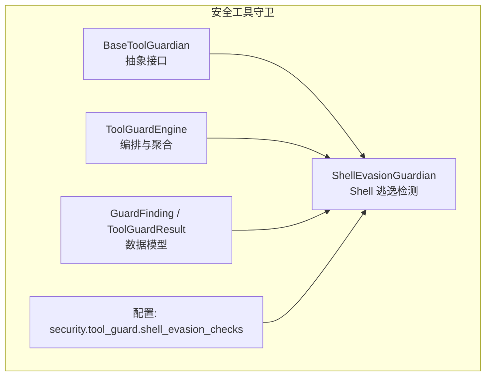
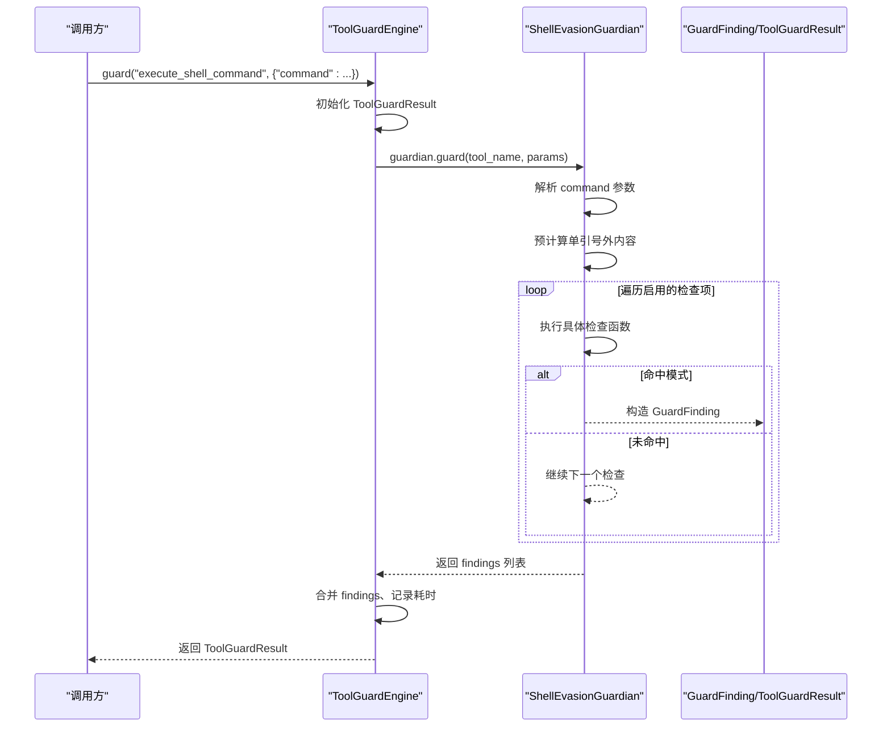
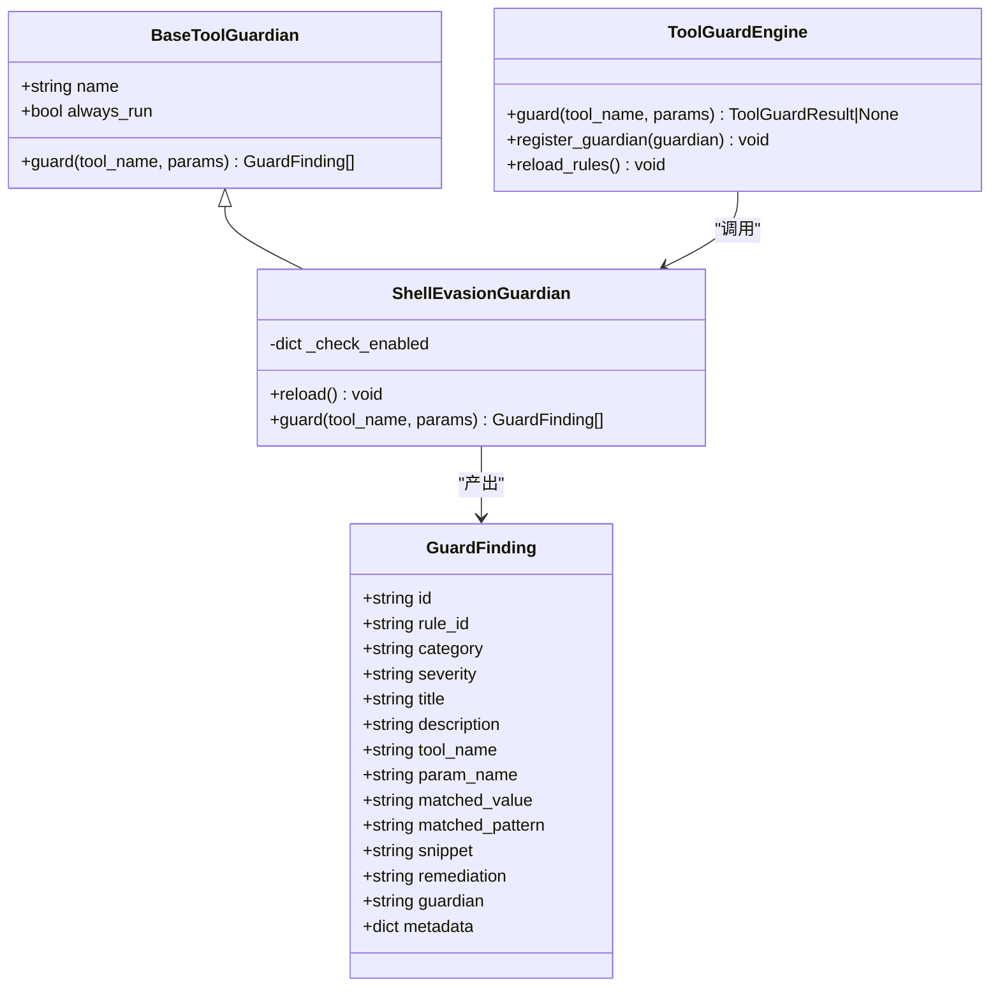
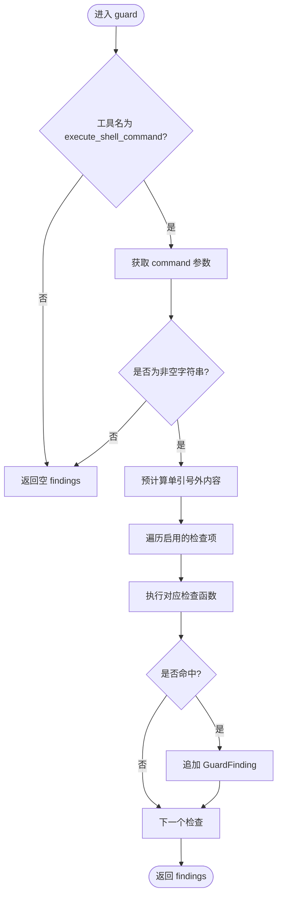
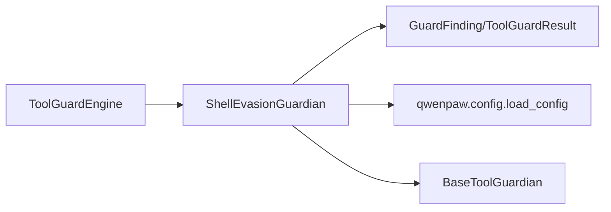

# Shell 逃逸检测守卫

<cite>
**本文引用的文件列表**
- [shell_evasion_guardian.py](file://src/qwenpaw/security/tool_guard/guardians/shell_evasion_guardian.py)
- [models.py](file://src/qwenpaw/security/tool_guard/models.py)
- [guardians/__init__.py](file://src/qwenpaw/security/tool_guard/guardians/__init__.py)
- [engine.py](file://src/qwenpaw/security/tool_guard/engine.py)
- [config.py](file://src/qwenpaw/config/config.py)
- [security.en.md](file://website/public/docs/security.en.md)
</cite>

## 目录
1. [简介](#简介)
2. [项目结构](#项目结构)
3. [核心组件](#核心组件)
4. [架构总览](#架构总览)
5. [详细组件分析](#详细组件分析)
6. [依赖关系分析](#依赖关系分析)
7. [性能考量](#性能考量)
8. [故障排查指南](#故障排查指南)
9. [结论](#结论)
10. [附录](#附录)

## 简介
本文件面向 QwenPaw 的“Shell 逃逸检测守卫”，聚焦于 ShellEvasionGuardian 的实现原理与使用方式。该守卫专门针对 execute_shell_command 工具调用，通过引号感知、命令替换识别、标志位混淆检测、反斜杠转义操作符/空白检测、换行注入、注释与引号状态不同步、以及“引号内换行 + 下一行以 # 开头”等攻击面进行综合检测，产出统一的安全发现（GuardFinding），并交由上层引擎聚合决策。

## 项目结构
围绕 ShellEvasionGuardian 的相关代码主要位于安全工具守卫子系统：
- 守护基类与模型定义：guardians 抽象接口、GuardFinding/ToolGuardResult 数据模型
- 引擎编排：ToolGuardEngine 负责加载默认守护器、执行 guard 流程、汇总结果
- 配置项：security.tool_guard.shell_evasion_checks 控制各子检查开关
- 文档说明：网站文档对规则 ID 与行为有补充说明

图表来源
- [guardians/__init__.py:17-61](file://src/qwenpaw/security/tool_guard/guardians/__init__.py#L17-L61)
- [shell_evasion_guardian.py:539-592](file://src/qwenpaw/security/tool_guard/guardians/shell_evasion_guardian.py#L539-L592)
- [engine.py:54-110](file://src/qwenpaw/security/tool_guard/engine.py#L54-L110)
- [models.py:60-185](file://src/qwenpaw/security/tool_guard/models.py#L60-L185)
- [config.py:1991-2019](file://src/qwenpaw/config/config.py#L1991-L2019)

章节来源
- [guardians/__init__.py:17-61](file://src/qwenpaw/security/tool_guard/guardians/__init__.py#L17-L61)
- [shell_evasion_guardian.py:539-592](file://src/qwenpaw/security/tool_guard/guardians/shell_evasion_guardian.py#L539-L592)
- [engine.py:54-110](file://src/qwenpaw/security/tool_guard/engine.py#L54-L110)
- [models.py:60-185](file://src/qwenpaw/security/tool_guard/models.py#L60-L185)
- [config.py:1991-2019](file://src/qwenpaw/config/config.py#L1991-L2019)

## 核心组件
- BaseToolGuardian：所有守护器的抽象基类，定义 guard(tool_name, params) -> list[GuardFinding] 的统一接口。
- ShellEvasionGuardian：实现 shell 逃逸与混淆检测，仅对 execute_shell_command 生效；内部包含多个细粒度检查函数，按配置启用。
- ToolGuardEngine：编排所有已注册守护器，收集 findings，计算最大严重级别、是否安全等。
- GuardFinding/ToolGuardResult：统一的发现与结果数据结构，便于 UI 展示与策略决策。

章节来源
- [guardians/__init__.py:17-61](file://src/qwenpaw/security/tool_guard/guardians/__init__.py#L17-L61)
- [shell_evasion_guardian.py:539-592](file://src/qwenpaw/security/tool_guard/guardians/shell_evasion_guardian.py#L539-L592)
- [engine.py:200-257](file://src/qwenpaw/security/tool_guard/engine.py#L200-L257)
- [models.py:60-185](file://src/qwenpaw/security/tool_guard/models.py#L60-L185)

## 架构总览
ShellEvasionGuardian 作为 ToolGuardEngine 的默认守护器之一，在每次工具调用前被触发。其工作流程如下：

图表来源
- [engine.py:200-257](file://src/qwenpaw/security/tool_guard/engine.py#L200-L257)
- [shell_evasion_guardian.py:539-592](file://src/qwenpaw/security/tool_guard/guardians/shell_evasion_guardian.py#L539-L592)
- [models.py:103-185](file://src/qwenpaw/security/tool_guard/models.py#L103-L185)

## 详细组件分析

### ShellEvasionGuardian 类
- 职责：对 execute_shell_command 的 command 参数进行“引号感知”的逃逸与混淆检测。
- 关键方法
  - __init__：初始化名称与检查启用映射（从配置读取）。
  - reload：热重载检查启用映射。
  - guard：入口方法，过滤非目标工具、空命令，预计算单引号外内容，依次执行启用的检查项，收集 GuardFinding。
- 内部机制
  - _QuoteState：逐字符跟踪单引号、双引号与反斜杠转义状态，用于判断当前是否在引号内。
  - _extract_outside_single_quotes：剥离单引号内容，保留双引号内容（因为双引号内仍会展开命令替换）。
  - 检查项集合 _CHECKS：按顺序执行，支持独立开关。
  - _load_check_enabled_map：从配置 security.tool_guard.shell_evasion_checks 读取布尔开关，未知键忽略，缺失键默认禁用。
  - _finding：工厂方法，生成 GuardFinding，包含 rule_id、severity、category、snippet、remediation 等字段。

图表来源
- [guardians/__init__.py:17-61](file://src/qwenpaw/security/tool_guard/guardians/__init__.py#L17-L61)
- [shell_evasion_guardian.py:539-592](file://src/qwenpaw/security/tool_guard/guardians/shell_evasion_guardian.py#L539-L592)
- [engine.py:54-110](file://src/qwenpaw/security/tool_guard/engine.py#L54-L110)
- [models.py:60-185](file://src/qwenpaw/security/tool_guard/models.py#L60-L185)

章节来源
- [shell_evasion_guardian.py:539-592](file://src/qwenpaw/security/tool_guard/guardians/shell_evasion_guardian.py#L539-L592)
- [shell_evasion_guardian.py:61-106](file://src/qwenpaw/security/tool_guard/guardians/shell_evasion_guardian.py#L61-L106)
- [shell_evasion_guardian.py:115-158](file://src/qwenpaw/security/tool_guard/guardians/shell_evasion_guardian.py#L115-L158)
- [shell_evasion_guardian.py:161-241](file://src/qwenpaw/security/tool_guard/guardians/shell_evasion_guardian.py#L161-L241)
- [shell_evasion_guardian.py:244-307](file://src/qwenpaw/security/tool_guard/guardians/shell_evasion_guardian.py#L244-L307)
- [shell_evasion_guardian.py:310-355](file://src/qwenpaw/security/tool_guard/guardians/shell_evasion_guardian.py#L310-L355)
- [shell_evasion_guardian.py:358-374](file://src/qwenpaw/security/tool_guard/guardians/shell_evasion_guardian.py#L358-L374)
- [shell_evasion_guardian.py:377-413](file://src/qwenpaw/security/tool_guard/guardians/shell_evasion_guardian.py#L377-L413)
- [shell_evasion_guardian.py:416-453](file://src/qwenpaw/security/tool_guard/guardians/shell_evasion_guardian.py#L416-L453)
- [shell_evasion_guardian.py:461-496](file://src/qwenpaw/security/tool_guard/guardians/shell_evasion_guardian.py#L461-L496)
- [shell_evasion_guardian.py:504-536](file://src/qwenpaw/security/tool_guard/guardians/shell_evasion_guardian.py#L504-L536)

### 检测算法与规则集
- 命令替换检测（SHELL_EVASION_COMMAND_SUBSTITUTION）
  - 扫描反引号（`` ` ``）在非单引号环境下的出现。
  - 对单引号外内容匹配多种命令/进程替换模式，如 $()、$[]、=()、<( )、>( )、Zsh 特定扩展等。
- 标志位混淆检测（SHELL_EVASION_OBFUSCATED_FLAGS）
  - ANSI-C 引号 $'...' 与 locale 引号 $"..." 的使用。
  - 空引号拼接短横线前缀（如 '' -x 或 "" -x）绕过正则。
  - 引号包裹的 flag 名（如 ' -exec'）检测。
- 反斜杠转义空白检测（SHELL_EVASION_BACKSLASH_WHITESPACE）
  - 非双引号内的 \空格/\t，可能导致分词差异。
- 反斜杠转义操作符检测（SHELL_EVASION_BACKSLASH_OPERATOR）
  - 非引号内的 \; \| & < >，但允许 find ... -exec ... {} \; 的正常语法。
- 换行注入检测（SHELL_EVASION_NEWLINE）
  - 非双引号内的 \r。
  - 非引号内的换行后紧跟非空白字符，可能隐藏后续命令。
  - 特殊豁免：完整 heredoc 不视为恶意拆分。
- 注释与引号状态不同步（SHELL_EVASION_COMMENT_QUOTE_DESYNC）
  - 在未引号包裹的 # 注释行中出现引号字符，导致后续引号状态错乱。
- 引号内换行 + 下一行以 # 开头（SHELL_EVASION_QUOTED_NEWLINE）
  - 引号内换行后，下一行看起来像注释行，可能被行级处理逻辑丢弃，从而绕过路径校验。

图表来源
- [shell_evasion_guardian.py:539-592](file://src/qwenpaw/security/tool_guard/guardians/shell_evasion_guardian.py#L539-L592)
- [shell_evasion_guardian.py:504-536](file://src/qwenpaw/security/tool_guard/guardians/shell_evasion_guardian.py#L504-L536)

章节来源
- [shell_evasion_guardian.py:115-158](file://src/qwenpaw/security/tool_guard/guardians/shell_evasion_guardian.py#L115-L158)
- [shell_evasion_guardian.py:161-241](file://src/qwenpaw/security/tool_guard/guardians/shell_evasion_guardian.py#L161-L241)
- [shell_evasion_guardian.py:244-307](file://src/qwenpaw/security/tool_guard/guardians/shell_evasion_guardian.py#L244-L307)
- [shell_evasion_guardian.py:310-355](file://src/qwenpaw/security/tool_guard/guardians/shell_evasion_guardian.py#L310-L355)
- [shell_evasion_guardian.py:358-374](file://src/qwenpaw/security/tool_guard/guardians/shell_evasion_guardian.py#L358-L374)
- [shell_evasion_guardian.py:377-413](file://src/qwenpaw/security/tool_guard/guardians/shell_evasion_guardian.py#L377-L413)
- [shell_evasion_guardian.py:416-453](file://src/qwenpaw/security/tool_guard/guardians/shell_evasion_guardian.py#L416-L453)

### 领域模型与返回值
- GuardFinding
  - 关键字段：id、rule_id、category、severity、title、description、tool_name、param_name、matched_value、matched_pattern、snippet、remediation、guardian、metadata。
  - to_dict：序列化为字典，供日志与 UI 消费。
- ToolGuardResult
  - 聚合一次工具调用的全部 findings，提供 is_safe、max_severity、findings_count 等便捷属性。
  - to_dict：序列化包含工具名、参数、耗时、使用的守护器等。

章节来源
- [models.py:60-185](file://src/qwenpaw/security/tool_guard/models.py#L60-L185)

### 配置选项与参数
- 全局开关
  - security.tool_guard.enabled：是否启用工具守卫（也可通过环境变量 QWENPAW_TOOL_GUARD_ENABLED 覆盖）。
- 作用域与白名单
  - guarded_tools：指定受保护的内置工具集合；null 表示保护全部内置工具；[] 表示不保护任何工具。
  - denied_tools：无条件拒绝的工具列表。
  - auto_denied_rules：命中即自动拒绝的规则 ID 集合。
- Shell 逃逸检查开关
  - security.tool_guard.shell_evasion_checks：每个子检查的布尔开关，默认全部为 false（关闭）。
  - 可用键：command_substitution、obfuscated_flags、backslash_escaped_whitespace、backslash_escaped_operators、newlines、comment_quote_desync、quoted_newline。
- 其他
  - custom_rules：自定义 YAML 规则。
  - disabled_rules：禁用内置 YAML 规则（仅对 TOOL_CMD_* 规则有效，不影响 SHELL_EVASION_*）。

章节来源
- [config.py:1991-2019](file://src/qwenpaw/config/config.py#L1991-L2019)
- [engine.py:36-51](file://src/qwenpaw/security/tool_guard/engine.py#L36-L51)
- [security.en.md:89-120](file://website/public/docs/security.en.md#L89-L120)
- [security.en.md:255-278](file://website/public/docs/security.en.md#L255-L278)

### 与其他组件的关系
- ToolGuardEngine
  - 默认注册 ShellEvasionGuardian，并在 guard 流程中调用其 guard 方法。
  - 支持动态注册/注销守护器，支持 only_always_run 模式（仅运行 always_run=True 的守护器）。
- RuleBasedToolGuardian 与 FilePathToolGuardian
  - 与 ShellEvasionGuardian 并列，分别负责基于 YAML 规则的匹配与文件路径访问限制。
- 治理层（governance.detectors/policy）
  - 可结合 shell_evasion_checks 进行策略联动（例如将 Phase 1 的发现纳入策略评估）。

章节来源
- [engine.py:86-110](file://src/qwenpaw/security/tool_guard/engine.py#L86-L110)
- [engine.py:116-171](file://src/qwenpaw/security/tool_guard/engine.py#L116-L171)
- [engine.py:200-257](file://src/qwenpaw/security/tool_guard/engine.py#L200-L257)

## 依赖关系分析
- 模块耦合
  - ShellEvasionGuardian 依赖 BaseToolGuardian 接口与 GuardFinding/ToolGuardResult 模型。
  - ToolGuardEngine 依赖所有守护器实例，并通过统一接口协调执行。
- 外部依赖
  - 配置读取来自 qwenpaw.config.load_config，读取 security.tool_guard.shell_evasion_checks。
- 潜在循环依赖
  - 当前设计通过抽象接口与数据模型解耦，未发现直接循环导入风险。

图表来源
- [engine.py:86-110](file://src/qwenpaw/security/tool_guard/engine.py#L86-L110)
- [shell_evasion_guardian.py:539-592](file://src/qwenpaw/security/tool_guard/guardians/shell_evasion_guardian.py#L539-L592)
- [models.py:60-185](file://src/qwenpaw/security/tool_guard/models.py#L60-L185)
- [config.py:1991-2019](file://src/qwenpaw/config/config.py#L1991-L2019)

章节来源
- [engine.py:86-110](file://src/qwenpaw/security/tool_guard/engine.py#L86-L110)
- [shell_evasion_guardian.py:539-592](file://src/qwenpaw/security/tool_guard/guardians/shell_evasion_guardian.py#L539-L592)
- [models.py:60-185](file://src/qwenpaw/security/tool_guard/models.py#L60-L185)
- [config.py:1991-2019](file://src/qwenpaw/config/config.py#L1991-L2019)

## 性能考量
- 时间复杂度
  - 每个检查函数多为 O(n) 线性扫描（n 为命令长度），总体为常数个检查项之和，整体近似 O(n)。
- 空间复杂度
  - 主要为逐字符状态机与少量切片片段，额外空间 O(1) 到 O(n) 之间（取决于片段截取长度）。
- 优化建议
  - 合理启用检查项：默认全部关闭，按需开启以减少不必要的扫描。
  - 避免超长命令输入：可在上游对 command 长度做上限约束。
  - 缓存预计算：若同一命令多次校验，可复用 outside_single_quotes 结果。

## 故障排查指南
- 常见问题
  - 未检测到预期模式：确认 shell_evasion_checks 中对应检查是否已启用。
  - 误报过多：根据业务场景调整启用项，必要时结合 auto_denied_rules 与审批流。
  - 守护器异常：ToolGuardEngine 会捕获守护器异常并记录失败信息，可通过日志定位。
- 定位步骤
  - 查看 ToolGuardResult 中的 guardians_failed 列表，确认哪个守护器抛出异常。
  - 检查 GuardFinding.snippet 与 matched_value，辅助定位触发点。
  - 核对配置项 security.tool_guard.shell_evasion_checks 与 guarded_tools/denied_tools。

章节来源
- [engine.py:240-257](file://src/qwenpaw/security/tool_guard/engine.py#L240-L257)
- [models.py:103-185](file://src/qwenpaw/security/tool_guard/models.py#L103-L185)
- [security.en.md:255-278](file://website/public/docs/security.en.md#L255-L278)

## 结论
ShellEvasionGuardian 通过“引号感知 + 多模式检测”的组合策略，覆盖了常见的 Shell 逃逸与混淆技术，并以统一的数据模型输出发现，便于上层引擎进行策略决策与审计。配合 ToolGuardEngine 的编排能力与配置化开关，可以在保证安全性的同时兼顾灵活性与可运维性。

## 附录
- 常见 Shell 逃逸技术与防护要点
  - 命令替换：$()、`...`、=()、<( )、>( ) 等，应在非引号环境下严格拦截。
  - 标志位混淆：ANSI-C/locale 引号、空引号拼接、引号包裹 flag，需特别关注。
  - 反斜杠转义：\空格/\t 与 \; \| & < > 在非引号下应告警。
  - 换行注入：\r 与非引号换行后的后续命令文本，需警惕。
  - 注释与引号不同步：# 注释中的引号会导致状态机错位，需检测。
  - 引号内换行 + 下一行以 # 开头：可能被行级处理丢弃，需防范。