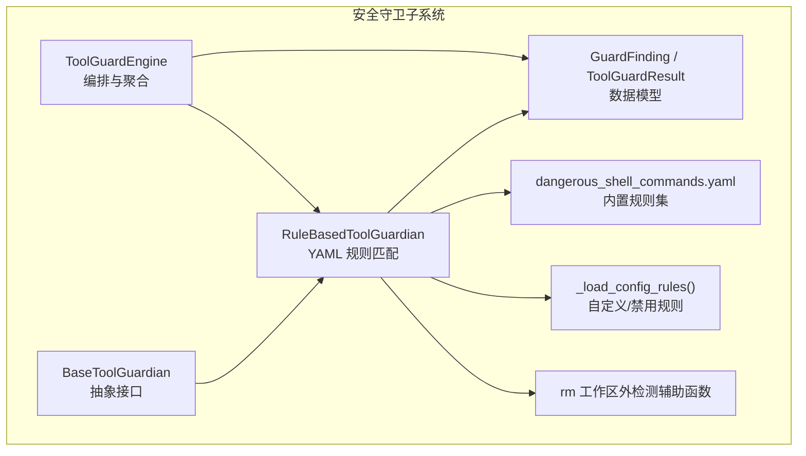
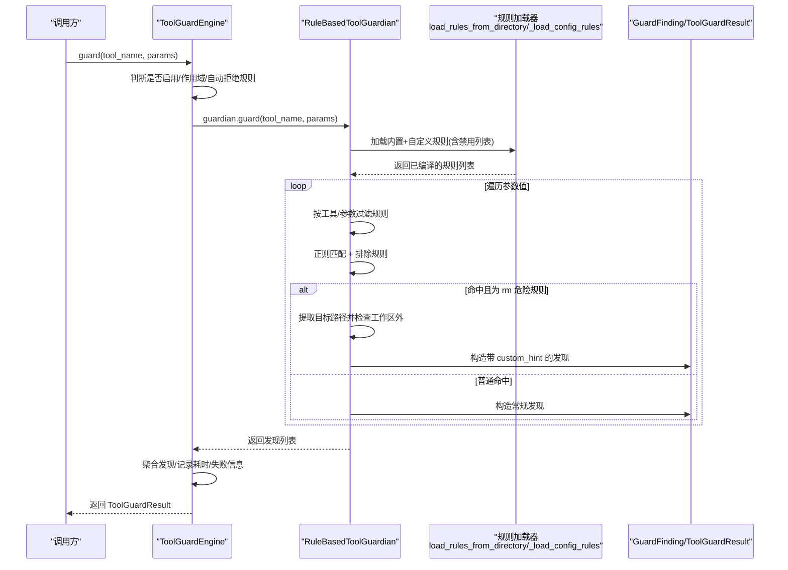
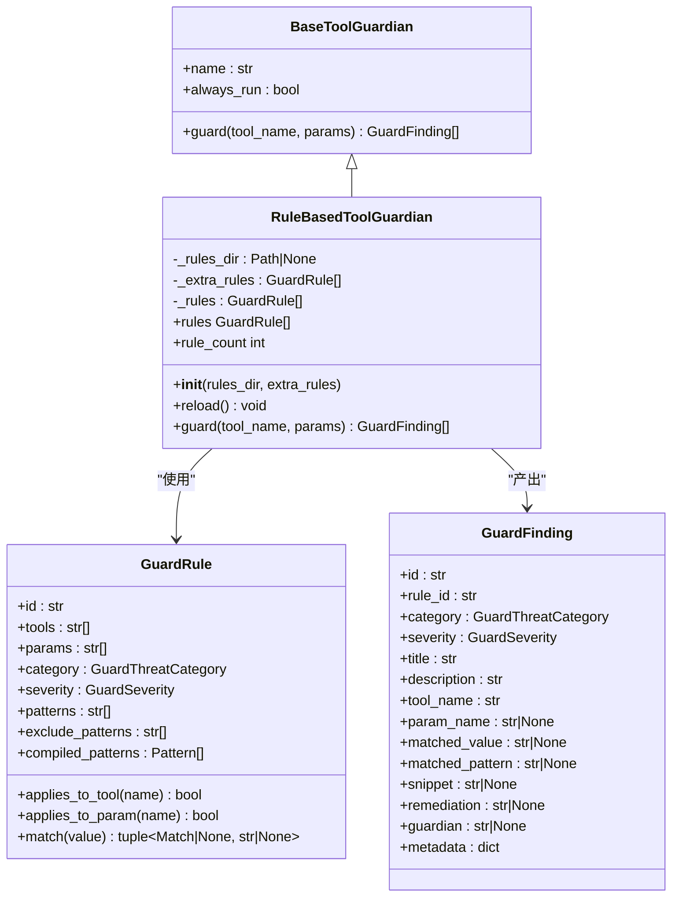
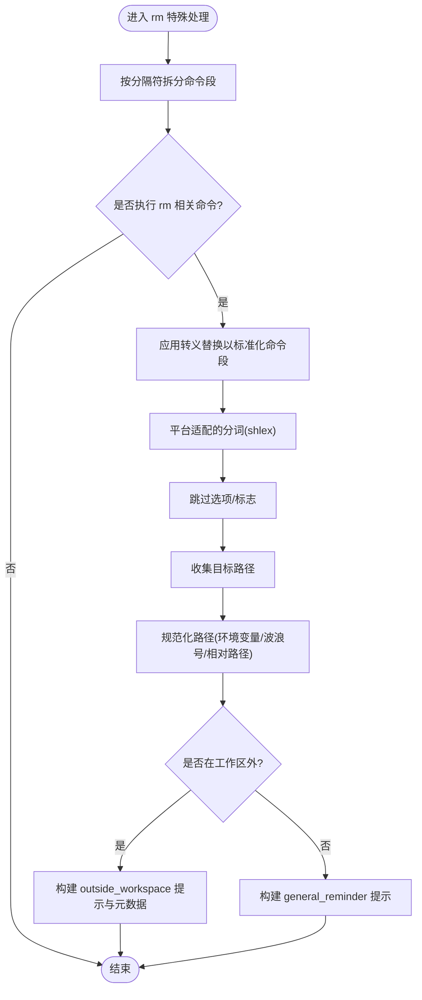
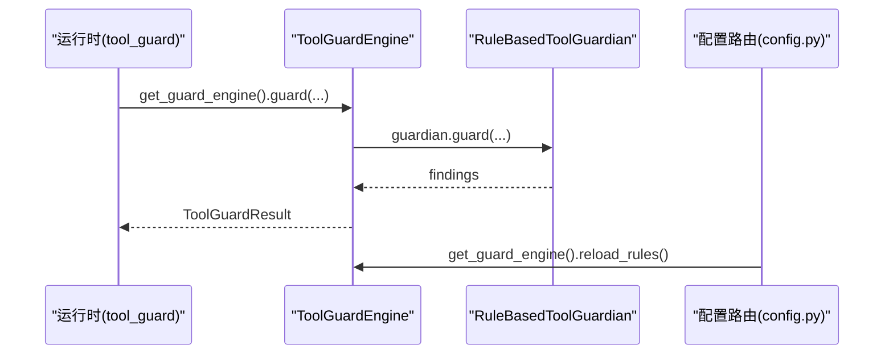
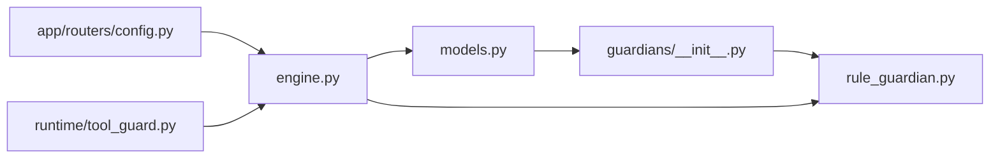

# 基于规则的守卫

<cite>
**本文引用的文件**   
- [rule_guardian.py](file://src/qwenpaw/security/tool_guard/guardians/rule_guardian.py)
- [engine.py](file://src/qwenpaw/security/tool_guard/engine.py)
- [models.py](file://src/qwenpaw/security/tool_guard/models.py)
- [dangerous_shell_commands.yaml](file://src/qwenpaw/security/tool_guard/rules/dangerous_shell_commands.yaml)
- [__init__.py（guardians）](file://src/qwenpaw/security/tool_guard/guardians/__init__.py)
- [test_rule_guardian.py](file://tests/unit/security/tool_guard/guardians/test_rule_guardian.py)
- [test_engine.py](file://tests/unit/security/tool_guard/test_engine.py)
- [config.py（路由）](file://src/qwenpaw/app/routers/config.py)
- [tool_guard.py（运行时）](file://src/qwenpaw/runtime/tool_guard.py)
</cite>

## 目录
1. [简介](#简介)
2. [项目结构](#项目结构)
3. [核心组件](#核心组件)
4. [架构总览](#架构总览)
5. [详细组件分析](#详细组件分析)
6. [依赖关系分析](#依赖关系分析)
7. [性能考量](#性能考量)
8. [故障排查指南](#故障排查指南)
9. [结论](#结论)
10. [附录](#附录)

## 简介
本章节面向 QwenPaw 的“基于规则的守卫”子系统，重点解析 RuleBasedToolGuardian 的实现原理与使用方式。该守卫通过加载 YAML 规则文件，对工具调用的参数进行正则匹配，识别危险命令、绕过技巧与越权操作等风险，并输出结构化发现结果。文档涵盖：
- 规则引擎与 YAML 规则定义
- 模式匹配算法与排除规则
- 动态规则加载与热重载
- 危险命令检测（尤其是 rm 删除路径与工作区边界检查）
- 与其他组件的集成点（引擎、运行时、配置路由）
- 常见问题与解决方案

## 项目结构
围绕“基于规则的守卫”，关键代码位于 security/tool_guard 子系统中，包含模型、引擎、守护基类、具体守护实现与规则集。

图表来源
- [__init__.py（guardians）:17-62](file://src/qwenpaw/security/tool_guard/guardians/__init__.py#L17-L62)
- [rule_guardian.py:581-779](file://src/qwenpaw/security/tool_guard/guardians/rule_guardian.py#L581-L779)
- [engine.py:54-268](file://src/qwenpaw/security/tool_guard/engine.py#L54-L268)
- [models.py:60-185](file://src/qwenpaw/security/tool_guard/models.py#L60-L185)
- [dangerous_shell_commands.yaml:1-321](file://src/qwenpaw/security/tool_guard/rules/dangerous_shell_commands.yaml#L1-L321)

章节来源
- [__init__.py（guardians）:17-62](file://src/qwenpaw/security/tool_guard/guardians/__init__.py#L17-L62)
- [engine.py:54-268](file://src/qwenpaw/security/tool_guard/engine.py#L54-L268)
- [rule_guardian.py:581-779](file://src/qwenpaw/security/tool_guard/guardians/rule_guardian.py#L581-L779)
- [models.py:60-185](file://src/qwenpaw/security/tool_guard/models.py#L60-L185)
- [dangerous_shell_commands.yaml:1-321](file://src/qwenpaw/security/tool_guard/rules/dangerous_shell_commands.yaml#L1-L321)

## 核心组件
- BaseToolGuardian：所有守护的抽象基类，定义统一的 guard(tool_name, params) 接口。
- RuleBasedToolGuardian：基于 YAML 的正则规则匹配守护，负责加载规则、过滤禁用项、执行匹配并生成发现。
- ToolGuardEngine：守护编排器，默认注册多个守护（包括规则守护），聚合各守护的发现，提供自动拒绝策略与开关控制。
- GuardFinding / ToolGuardResult：发现与结果的领域模型，承载严重级别、威胁分类、上下文片段、修复建议等。
- dangerous_shell_commands.yaml：内置的危险 Shell 命令规则集合，覆盖 rm、管道到 shell、提权、持久化、服务管理、进程终止等场景。

章节来源
- [__init__.py（guardians）:17-62](file://src/qwenpaw/security/tool_guard/guardians/__init__.py#L17-L62)
- [rule_guardian.py:581-779](file://src/qwenpaw/security/tool_guard/guardians/rule_guardian.py#L581-L779)
- [engine.py:54-268](file://src/qwenpaw/security/tool_guard/engine.py#L54-L268)
- [models.py:60-185](file://src/qwenpaw/security/tool_guard/models.py#L60-L185)
- [dangerous_shell_commands.yaml:1-321](file://src/qwenpaw/security/tool_guard/rules/dangerous_shell_commands.yaml#L1-L321)

## 架构总览
下图展示从调用入口到规则匹配的完整流程，以及结果聚合与决策点。

图表来源
- [engine.py:200-257](file://src/qwenpaw/security/tool_guard/engine.py#L200-L257)
- [rule_guardian.py:630-779](file://src/qwenpaw/security/tool_guard/guardians/rule_guardian.py#L630-L779)
- [rule_guardian.py:454-532](file://src/qwenpaw/security/tool_guard/guardians/rule_guardian.py#L454-L532)
- [rule_guardian.py:540-573](file://src/qwenpaw/security/tool_guard/guardians/rule_guardian.py#L540-L573)
- [models.py:103-176](file://src/qwenpaw/security/tool_guard/models.py#L103-L176)

## 详细组件分析

### RuleBasedToolGuardian 类
- 职责
  - 初始化时合并三类规则：内置 YAML 规则、额外传入规则、配置中的自定义规则；并按禁用 ID 过滤。
  - 提供 reload() 支持热重载。
  - 实现 guard(tool_name, params)，将每个参数的字符串表示与规则进行匹配，产出 GuardFinding。
- 关键特性
  - 规则对象 GuardRule 预编译正则，支持 exclude_patterns 快速短路。
  - 针对 rm 命令的特殊处理：提取目标路径、规范化路径、判断是否在工作区外，并在发现中附加 custom_hint 元数据以驱动 UI 提示。
  - 支持工具级与参数级过滤，避免不必要的扫描。
- 重要方法
  - __init__(rules_dir, extra_rules)
  - _load_all_rules()
  - reload()
  - guard(tool_name, params) -> list[GuardFinding]
- 内部辅助
  - load_rules_from_yaml / load_rules_from_directory
  - _load_config_rules（读取配置中的自定义规则与禁用规则）
  - _extract_rm_targets / _check_rm_targets_outside_workspace / _normalize_path / _is_outside_workspace

图表来源
- [__init__.py（guardians）:17-62](file://src/qwenpaw/security/tool_guard/guardians/__init__.py#L17-L62)
- [rule_guardian.py:353-446](file://src/qwenpaw/security/tool_guard/guardians/rule_guardian.py#L353-L446)
- [rule_guardian.py:581-779](file://src/qwenpaw/security/tool_guard/guardians/rule_guardian.py#L581-L779)
- [models.py:60-96](file://src/qwenpaw/security/tool_guard/models.py#L60-L96)

章节来源
- [rule_guardian.py:581-779](file://src/qwenpaw/security/tool_guard/guardians/rule_guardian.py#L581-L779)
- [rule_guardian.py:353-446](file://src/qwenpaw/security/tool_guard/guardians/rule_guardian.py#L353-L446)
- [rule_guardian.py:454-532](file://src/qwenpaw/security/tool_guard/guardians/rule_guardian.py#L454-L532)
- [rule_guardian.py:540-573](file://src/qwenpaw/security/tool_guard/guardians/rule_guardian.py#L540-L573)
- [models.py:60-96](file://src/qwenpaw/security/tool_guard/models.py#L60-L96)

### 规则引擎与 YAML 规则定义
- 规则格式要点
  - id：唯一标识
  - tools/params：限定匹配的工具与参数名（为空表示全部）
  - category/severity：威胁分类与严重级别
  - patterns/exclude_patterns：匹配与排除的正则表达式
  - description/remediation：人类可读说明与修复建议
- 加载机制
  - 内置规则目录默认只加载指定文件（如 dangerous_shell_commands.yaml）。
  - 自定义目录会加载目录下所有 *.yaml/*.yml。
  - 配置可注入自定义规则与禁用规则 ID 列表。
- 示例规则类别（来自内置规则集）
  - rm/del/Remove-Item 删除命令
  - find ... -delete 绕过 rm 的检测
  - mv 移动/重命名
  - 格式化/写盘设备破坏
  - Fork bomb 与大规模杀进程
  - curl/wget 管道到 shell
  - 反向 shell 与网络隧道
  - 系统篡改（crontab、sudoers、authorized_keys）
  - 不安全权限变更（chmod 777、chattr +i）
  - 混淆执行（base64 | bash/sh）
  - 重启/关机
  - 服务管理
  - 进程终止
  - 提权（sudo/su/doas/pkexec/runas）
  - IFS 注入、控制字符、Unicode 空白、/proc/*/environ、jq system()/文件标志、Zsh 危险内置

章节来源
- [dangerous_shell_commands.yaml:1-321](file://src/qwenpaw/security/tool_guard/rules/dangerous_shell_commands.yaml#L1-L321)
- [rule_guardian.py:454-532](file://src/qwenpaw/security/tool_guard/guardians/rule_guardian.py#L454-L532)
- [rule_guardian.py:540-573](file://src/qwenpaw/security/tool_guard/guardians/rule_guardian.py#L540-L573)

### 模式匹配算法与优先级
- 匹配流程
  - 先应用 exclude_patterns 进行快速排除，若命中则跳过后续匹配。
  - 再顺序尝试 compiled_patterns，首个命中即返回匹配对象与原始正则文本。
- 优先级
  - 同一规则内：exclude_patterns 优先于 patterns。
  - 多规则间：按加载顺序依次匹配，首个命中即产出发现（不继续同参数其他规则）。
- 性能优化
  - 预编译正则，减少重复开销。
  - 空值与空串直接跳过。
  - 工具/参数级过滤缩小候选规则集。

章节来源
- [rule_guardian.py:353-446](file://src/qwenpaw/security/tool_guard/guardians/rule_guardian.py#L353-L446)
- [rule_guardian.py:630-779](file://src/qwenpaw/security/tool_guard/guardians/rule_guardian.py#L630-L779)

### 动态规则加载与热重载
- 加载来源
  - 内置目录：默认仅加载指定规则文件。
  - 自定义目录：加载所有 yaml/yml。
  - 配置：custom_rules 注入新规则，disabled_rules 禁用特定规则 ID。
- 热重载
  - 调用 reload() 后重新合并三类规则并过滤禁用项，适用于配置变更或新增规则文件后的即时生效。

章节来源
- [rule_guardian.py:605-615](file://src/qwenpaw/security/tool_guard/guardians/rule_guardian.py#L605-L615)
- [rule_guardian.py:454-532](file://src/qwenpaw/security/tool_guard/guardians/rule_guardian.py#L454-L532)
- [rule_guardian.py:540-573](file://src/qwenpaw/security/tool_guard/guardians/rule_guardian.py#L540-L573)

### 危险命令检测与 rm 工作区外检查
- rm 目标提取
  - 支持多种分隔符（|、;、&）与引号保护。
  - 兼容 Unix rm、Windows del/Remove-Item，以及路径别名与间接引用（如 $(which rm)、`which rm`、/bin/rm 等）。
  - 使用 shlex 分词，忽略选项/标志，收集目标路径。
- 路径规范化与边界判定
  - 展开环境变量与波浪号，相对路径基于当前工作区根解析。
  - Windows 不同盘符视为工作区外；Unix/macOS 使用 relative_to 判定。
- 发现增强
  - 当检测到工作区外目标时，在描述与修复建议中加入明确警告，并在 metadata.custom_hint 中附带文件列表与消息，便于前端渲染。

图表来源
- [rule_guardian.py:177-345](file://src/qwenpaw/security/tool_guard/guardians/rule_guardian.py#L177-L345)
- [rule_guardian.py:667-756](file://src/qwenpaw/security/tool_guard/guardians/rule_guardian.py#L667-L756)

章节来源
- [rule_guardian.py:177-345](file://src/qwenpaw/security/tool_guard/guardians/rule_guardian.py#L177-L345)
- [rule_guardian.py:667-756](file://src/qwenpaw/security/tool_guard/guardians/rule_guardian.py#L667-L756)

### 与引擎和运行时的集成
- 引擎层
  - ToolGuardEngine 默认注册 FilePathToolGuardian、RuleBasedToolGuardian、ShellEvasionGuardian。
  - 提供 is_denied/is_guarded/should_auto_deny_result 等决策辅助。
  - 支持 only_always_run 模式用于非受管工具的路径级检查。
- 运行时与配置路由
  - 运行时 tool_guard 模块通过 get_guard_engine() 获取单例引擎并执行守卫。
  - 配置路由暴露了获取与刷新引擎的能力，便于外部触发 reload。

图表来源
- [engine.py:263-268](file://src/qwenpaw/security/tool_guard/engine.py#L263-L268)
- [engine.py:200-257](file://src/qwenpaw/security/tool_guard/engine.py#L200-L257)
- [tool_guard.py（运行时）:169-177](file://src/qwenpaw/runtime/tool_guard.py#L169-L177)
- [config.py（路由）:761-763](file://src/qwenpaw/app/routers/config.py#L761-L763)
- [config.py（路由）:901-903](file://src/qwenpaw/app/routers/config.py#L901-L903)

章节来源
- [engine.py:54-268](file://src/qwenpaw/security/tool_guard/engine.py#L54-L268)
- [tool_guard.py（运行时）:169-177](file://src/qwenpaw/runtime/tool_guard.py#L169-L177)
- [config.py（路由）:761-763](file://src/qwenpaw/app/routers/config.py#L761-L763)
- [config.py（路由）:901-903](file://src/qwenpaw/app/routers/config.py#L901-L903)

## 依赖关系分析
- 组件耦合
  - RuleBasedToolGuardian 依赖 models 与 guardians 基类，并通过工具函数访问配置与工作区路径。
  - ToolGuardEngine 聚合多个守护，统一对外暴露 guard/reload 能力。
- 外部依赖
  - YAML 解析库、re 正则、platform/shlex/os/pathlib 等标准库。
  - 配置加载模块（qwenpaw.config）用于读取自定义规则与禁用列表。
- 潜在循环
  - 当前实现未见循环导入；配置加载仅在需要时延迟导入。

图表来源
- [models.py:60-185](file://src/qwenpaw/security/tool_guard/models.py#L60-L185)
- [__init__.py（guardians）:17-62](file://src/qwenpaw/security/tool_guard/guardians/__init__.py#L17-L62)
- [rule_guardian.py:581-779](file://src/qwenpaw/security/tool_guard/guardians/rule_guardian.py#L581-L779)
- [engine.py:54-268](file://src/qwenpaw/security/tool_guard/engine.py#L54-L268)
- [config.py（路由）:761-763](file://src/qwenpaw/app/routers/config.py#L761-L763)
- [tool_guard.py（运行时）:169-177](file://src/qwenpaw/runtime/tool_guard.py#L169-L177)

章节来源
- [engine.py:54-268](file://src/qwenpaw/security/tool_guard/engine.py#L54-L268)
- [rule_guardian.py:581-779](file://src/qwenpaw/security/tool_guard/guardians/rule_guardian.py#L581-L779)
- [models.py:60-185](file://src/qwenpaw/security/tool_guard/models.py#L60-L185)

## 性能考量
- 正则预编译：每条规则的 patterns/exclude_patterns 在规则构造时预编译，避免重复编译开销。
- 快速短路：先应用 exclude_patterns，命中即跳过后续匹配。
- 作用域裁剪：按工具名与参数名过滤规则，减少不必要扫描。
- 空值跳过：None 与空串直接跳过，降低无效计算。
- 批量扫描：guard 方法对参数逐项扫描，建议在高频调用场景中复用引擎实例以避免重复初始化。

[本节为通用指导，无需列出具体文件来源]

## 故障排查指南
- 规则未生效
  - 确认 rules_dir 指向正确目录；自定义目录会加载所有 yaml/yml。
  - 检查 disabled_rules 是否误禁用了规则 ID。
  - 调用 reload() 确保热重载生效。
- 误报/漏报
  - 调整 patterns 与 exclude_patterns，必要时增加更具体的上下文约束。
  - 对于 rm 误报，检查工作区根解析与环境变量展开是否符合预期。
- 性能问题
  - 减少全局规则数量，尽量使用 tools/params 精确限定。
  - 避免过于宽泛的正则，优先使用 exclude_patterns 做快速排除。
- 集成问题
  - 确认引擎 enabled 状态与作用域 guarded_tools/denied_tools 配置。
  - 运行时通过 get_guard_engine() 获取单例，避免重复创建。

章节来源
- [rule_guardian.py:605-615](file://src/qwenpaw/security/tool_guard/guardians/rule_guardian.py#L605-L615)
- [rule_guardian.py:454-532](file://src/qwenpaw/security/tool_guard/guardians/rule_guardian.py#L454-L532)
- [engine.py:36-52](file://src/qwenpaw/security/tool_guard/engine.py#L36-L52)
- [engine.py:154-171](file://src/qwenpaw/security/tool_guard/engine.py#L154-L171)

## 结论
RuleBasedToolGuardian 通过“YAML 规则 + 预编译正则 + 排除规则 + 动态加载”的组合，提供了高效、可扩展且易于维护的安全守卫能力。结合 rm 工作区外检测与丰富的内置规则集，能有效拦截高危命令与常见绕过手法。配合 ToolGuardEngine 的统一编排与运行时集成，可在不侵入业务逻辑的前提下实现强一致的安全策略落地。

[本节为总结性内容，无需列出具体文件来源]

## 附录

### 配置与参数参考
- RuleBasedToolGuardian
  - rules_dir: 规则目录（可选，默认内置 rules/）
  - extra_rules: 额外规则（可选）
  - reload(): 热重载
  - guard(tool_name, params): 核心接口，返回发现列表
- ToolGuardEngine
  - enabled: 是否启用守卫（env > config > 默认 True）
  - register_guardian/unregister_guardian: 动态注册/注销守护
  - reload_rules(): 刷新守护规则与作用域
  - is_denied/is_guarded/should_auto_deny_result: 决策辅助
- 模型
  - GuardFinding：单次发现的详细信息
  - ToolGuardResult：一次工具调用的聚合结果，含 is_safe/max_severity/findings_count 等便捷属性

章节来源
- [rule_guardian.py:581-779](file://src/qwenpaw/security/tool_guard/guardians/rule_guardian.py#L581-L779)
- [engine.py:54-268](file://src/qwenpaw/security/tool_guard/engine.py#L54-L268)
- [models.py:103-176](file://src/qwenpaw/security/tool_guard/models.py#L103-L176)

### 使用示例（来自测试）
- 匹配规则并产生发现
  - 示例路径：[test_rule_guardian.py:703-754](file://tests/unit/security/tool_guard/guardians/test_rule_guardian.py#L703-L754)
- 初始化与热重载
  - 示例路径：[test_rule_guardian.py:640-700](file://tests/unit/security/tool_guard/guardians/test_rule_guardian.py#L640-L700), [test_rule_guardian.py:970-993](file://tests/unit/security/tool_guard/guardians/test_rule_guardian.py#L970-L993)
- 引擎初始化与属性
  - 示例路径：[test_engine.py:137-202](file://tests/unit/security/tool_guard/test_engine.py#L137-L202)

章节来源
- [test_rule_guardian.py:703-754](file://tests/unit/security/tool_guard/guardians/test_rule_guardian.py#L703-L754)
- [test_rule_guardian.py:640-700](file://tests/unit/security/tool_guard/guardians/test_rule_guardian.py#L640-L700)
- [test_rule_guardian.py:970-993](file://tests/unit/security/tool_guard/guardians/test_rule_guardian.py#L970-L993)
- [test_engine.py:137-202](file://tests/unit/security/tool_guard/test_engine.py#L137-L202)