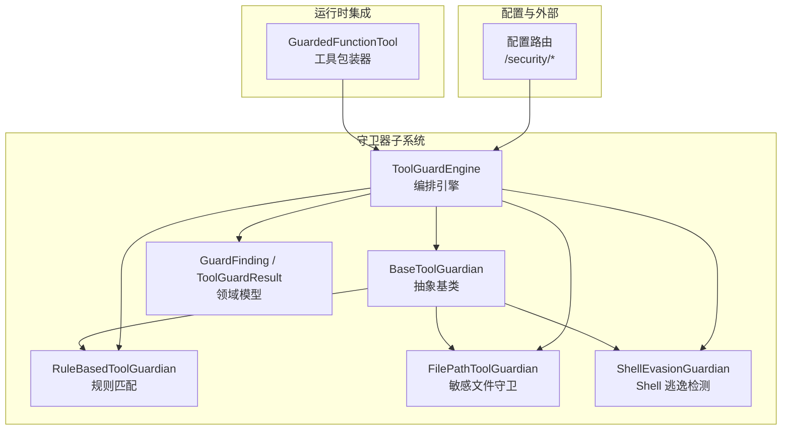
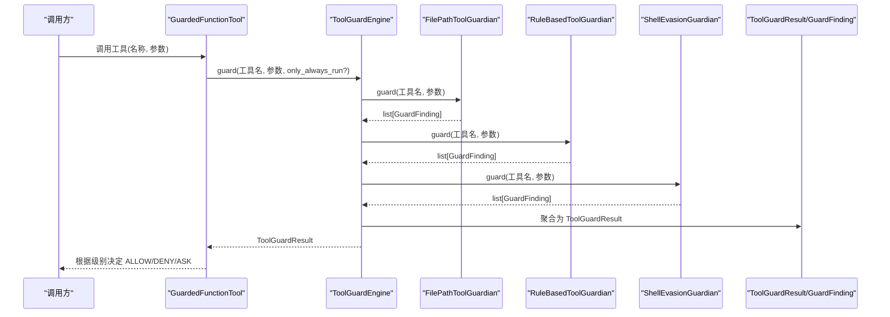
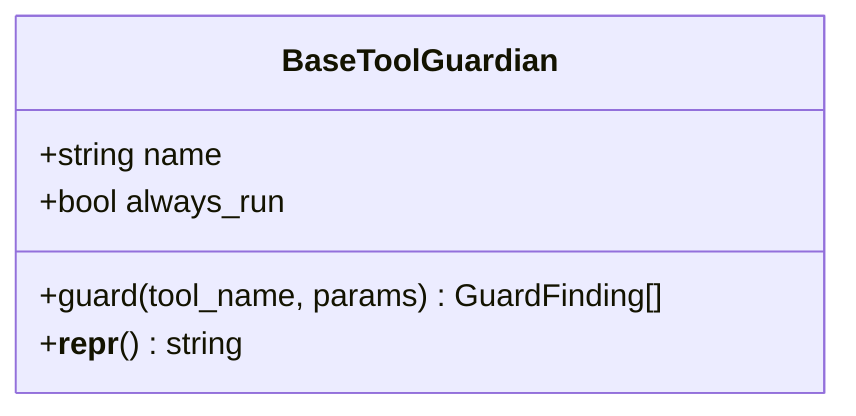
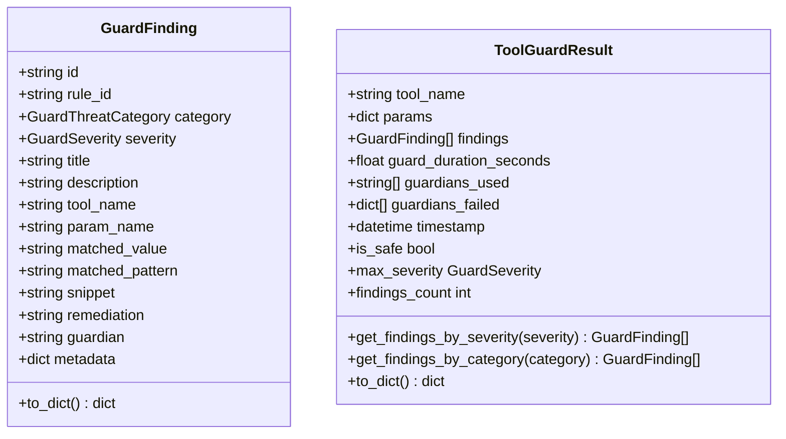
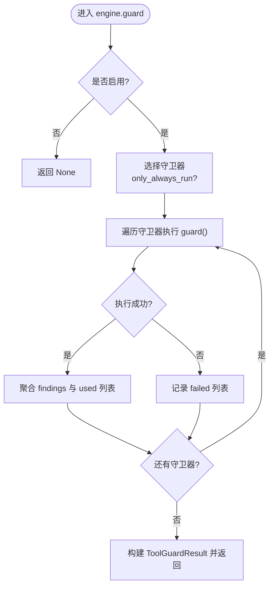
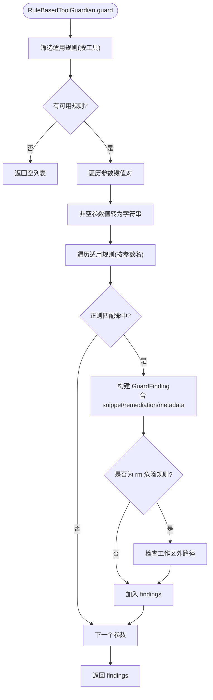
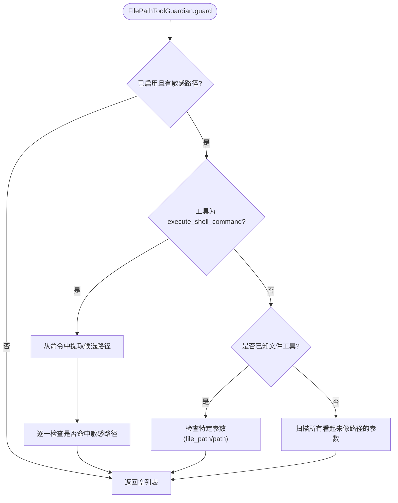
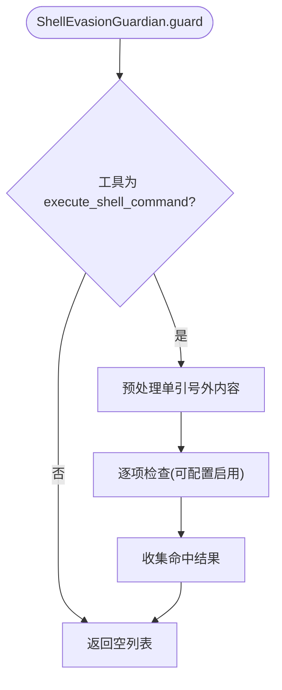
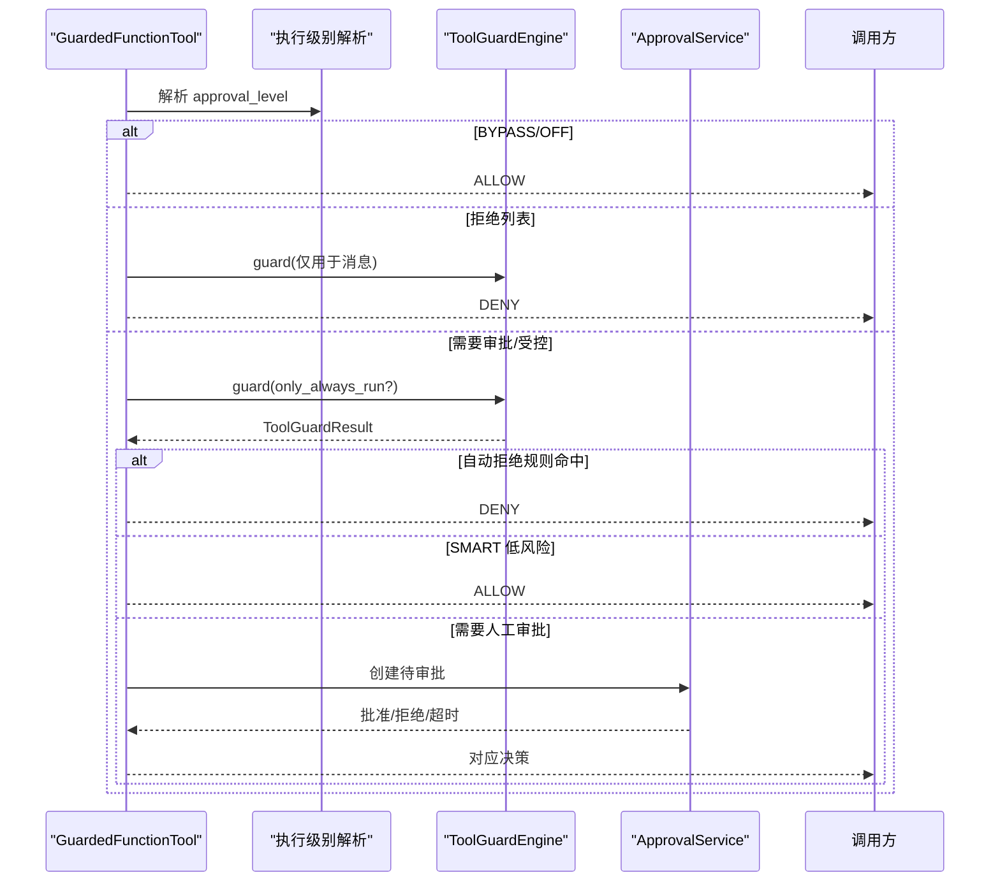
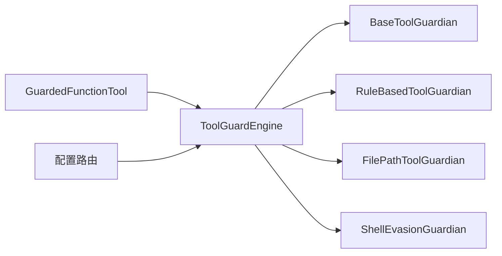

# 守卫器基础接口

<cite>
**本文引用的文件**   
- [src/qwenpaw/security/tool_guard/guardians/__init__.py](file://src/qwenpaw/security/tool_guard/guardians/__init__.py)
- [src/qwenpaw/security/tool_guard/engine.py](file://src/qwenpaw/security/tool_guard/engine.py)
- [src/qwenpaw/security/tool_guard/models.py](file://src/qwenpaw/security/tool_guard/models.py)
- [src/qwenpaw/security/tool_guard/guardians/rule_guardian.py](file://src/qwenpaw/security/tool_guard/guardians/rule_guardian.py)
- [src/qwenpaw/security/tool_guard/guardians/file_guardian.py](file://src/qwenpaw/security/tool_guard/guardians/file_guardian.py)
- [src/qwenpaw/security/tool_guard/guardians/shell_evasion_guardian.py](file://src/qwenpaw/security/tool_guard/guardians/shell_evasion_guardian.py)
- [src/qwenpaw/runtime/tool_guard.py](file://src/qwenpaw/runtime/tool_guard.py)
- [src/qwenpaw/app/routers/config.py](file://src/qwenpaw/app/routers/config.py)
- [tests/contract/security/test_guardian_contract.py](file://tests/contract/security/test_guardian_contract.py)
</cite>

## 目录
1. [简介](#简介)
2. [项目结构](#项目结构)
3. [核心组件](#核心组件)
4. [架构总览](#架构总览)
5. [详细组件分析](#详细组件分析)
6. [依赖关系分析](#依赖关系分析)
7. [性能考量](#性能考量)
8. [故障排查指南](#故障排查指南)
9. [结论](#结论)
10. [附录](#附录)

## 简介
本文件聚焦于 QwenPaw 守卫器基础接口，围绕 BaseToolGuardian 抽象类的设计原理、规范、生命周期方法、发现机制与扩展点进行系统化说明。文档同时覆盖具体实现细节（规则引擎、路径敏感文件守卫、Shell 逃逸检测）、调用关系、领域模型、配置项与返回值，并结合运行时集成点与前端配置路由，给出自定义守卫器的开发指南、最佳实践与测试策略。内容兼顾初学者友好与资深开发者所需的技术深度。

## 项目结构
守卫器子系统位于 security/tool_guard 下，采用“抽象基类 + 多实现 + 统一编排”的分层组织方式：
- 抽象基类与契约：guardians/__init__.py 定义 BaseToolGuardian 抽象接口
- 数据模型：models.py 定义 GuardFinding、ToolGuardResult 等
- 默认守卫器实现：
  - rule_guardian.py：基于 YAML 规则的规则匹配守卫器
  - file_guardian.py：敏感文件/目录访问守卫器
  - shell_evasion_guardian.py：针对 Shell 命令的逃逸与混淆检测
- 编排引擎：engine.py 负责发现、注册、执行与聚合结果
- 运行时集成：runtime/tool_guard.py 将守卫器接入工具调用权限流程
- 配置管理：app/routers/config.py 暴露安全相关配置更新并触发守卫器重载

图示来源
- [src/qwenpaw/security/tool_guard/guardians/__init__.py:17-61](file://src/qwenpaw/security/tool_guard/guardians/__init__.py#L17-L61)
- [src/qwenpaw/security/tool_guard/engine.py:54-268](file://src/qwenpaw/security/tool_guard/engine.py#L54-L268)
- [src/qwenpaw/security/tool_guard/models.py:60-176](file://src/qwenpaw/security/tool_guard/models.py#L60-L176)
- [src/qwenpaw/security/tool_guard/guardians/rule_guardian.py:581-779](file://src/qwenpaw/security/tool_guard/guardians/rule_guardian.py#L581-L779)
- [src/qwenpaw/security/tool_guard/guardians/file_guardian.py:301-501](file://src/qwenpaw/security/tool_guard/guardians/file_guardian.py#L301-L501)
- [src/qwenpaw/security/tool_guard/guardians/shell_evasion_guardian.py:539-593](file://src/qwenpaw/security/tool_guard/guardians/shell_evasion_guardian.py#L539-L593)
- [src/qwenpaw/runtime/tool_guard.py:130-258](file://src/qwenpaw/runtime/tool_guard.py#L130-L258)
- [src/qwenpaw/app/routers/config.py:760-911](file://src/qwenpaw/app/routers/config.py#L760-L911)

章节来源
- [src/qwenpaw/security/tool_guard/guardians/__init__.py:17-61](file://src/qwenpaw/security/tool_guard/guardians/__init__.py#L17-L61)
- [src/qwenpaw/security/tool_guard/engine.py:54-268](file://src/qwenpaw/security/tool_guard/engine.py#L54-L268)
- [src/qwenpaw/security/tool_guard/models.py:60-176](file://src/qwenpaw/security/tool_guard/models.py#L60-L176)

## 核心组件
- BaseToolGuardian 抽象基类
  - 职责：定义所有守卫器必须实现的 guard(tool_name, params) -> list[GuardFinding] 接口；提供 name、always_run 属性与 __repr__ 辅助方法。
  - 设计要点：最小化接口以支持多种检测引擎（如 LLM、语义分析）作为可插拔守卫器。
- 领域模型
  - GuardFinding：单次检测结果，包含规则 ID、威胁分类、严重等级、标题、描述、命中参数、片段、修复建议、元数据等。
  - ToolGuardResult：一次工具调用的聚合结果，包含 findings、耗时、使用的守卫器列表、失败的守卫器记录、便捷属性 is_safe、max_severity 等。
- 编排引擎 ToolGuardEngine
  - 职责：维护守卫器集合、启用开关、受控/拒绝工具集、自动拒绝规则集；按顺序执行守卫器并聚合结果；支持只运行 always_run 守卫器；提供 reload_rules 热重载。
  - 发现机制：默认守卫器在构造时创建（文件路径守卫、规则守卫、Shell 逃逸守卫），可通过 register_guardian 动态注册。
- 默认守卫器实现
  - RuleBasedToolGuardian：从 YAML 加载规则，对字符串化参数进行正则匹配，支持工具/参数过滤、排除模式、工作区外 rm 增强提示。
  - FilePathToolGuardian：拦截敏感文件/目录访问，兼容 Windows/POSIX 路径归一化，支持 shell 命令中的路径提取与重定向操作符处理。
  - ShellEvasionGuardian：检测命令替换、ANSI-C 引号、反斜杠转义空白/操作符、隐藏换行、注释引号失步等逃逸手法。

章节来源
- [src/qwenpaw/security/tool_guard/guardians/__init__.py:17-61](file://src/qwenpaw/security/tool_guard/guardians/__init__.py#L17-L61)
- [src/qwenpaw/security/tool_guard/models.py:60-176](file://src/qwenpaw/security/tool_guard/models.py#L60-L176)
- [src/qwenpaw/security/tool_guard/engine.py:54-268](file://src/qwenpaw/security/tool_guard/engine.py#L54-L268)
- [src/qwenpaw/security/tool_guard/guardians/rule_guardian.py:581-779](file://src/qwenpaw/security/tool_guard/guardians/rule_guardian.py#L581-L779)
- [src/qwenpaw/security/tool_guard/guardians/file_guardian.py:301-501](file://src/qwenpaw/security/tool_guard/guardians/file_guardian.py#L301-L501)
- [src/qwenpaw/security/tool_guard/guardians/shell_evasion_guardian.py:539-593](file://src/qwenpaw/security/tool_guard/guardians/shell_evasion_guardian.py#L539-L593)

## 架构总览
守卫器子系统通过统一的编排引擎协调多个守卫器，在工具调用前进行安全检查，并将结果反馈给运行时权限决策流程。

图示来源
- [src/qwenpaw/runtime/tool_guard.py:130-258](file://src/qwenpaw/runtime/tool_guard.py#L130-L258)
- [src/qwenpaw/security/tool_guard/engine.py:200-257](file://src/qwenpaw/security/tool_guard/engine.py#L200-L257)
- [src/qwenpaw/security/tool_guard/models.py:103-176](file://src/qwenpaw/security/tool_guard/models.py#L103-L176)

## 详细组件分析

### BaseToolGuardian 抽象类
- 设计原则
  - 最小契约：仅要求实现 guard(tool_name, params) -> list[GuardFinding]，确保新检测引擎可无缝接入。
  - 标识与执行策略：name 用于结果溯源；always_run 控制是否在所有场景下执行（例如路径守卫需始终运行）。
  - 可观测性：__repr__ 便于调试输出。
- 关键方法与属性
  - __init__(name, always_run=False)
  - guard(tool_name, params) -> list[GuardFinding]（抽象）
  - __repr__()
- 使用约束
  - 子类必须实现 guard，否则实例化失败（由单元测试验证）。

图示来源
- [src/qwenpaw/security/tool_guard/guardians/__init__.py:17-61](file://src/qwenpaw/security/tool_guard/guardians/__init__.py#L17-L61)

章节来源
- [src/qwenpaw/security/tool_guard/guardians/__init__.py:17-61](file://src/qwenpaw/security/tool_guard/guardians/__init__.py#L17-L61)
- [tests/contract/security/test_guardian_contract.py:260-289](file://tests/contract/security/test_guardian_contract.py#L260-L289)

### 领域模型：GuardFinding 与 ToolGuardResult
- GuardFinding
  - 字段：id、rule_id、category、severity、title、description、tool_name、param_name、matched_value、matched_pattern、snippet、remediation、guardian、metadata。
  - to_dict()：序列化输出，便于日志与前端展示。
- ToolGuardResult
  - 字段：tool_name、params、findings、guard_duration_seconds、guardians_used、guardians_failed、timestamp。
  - 便捷属性：is_safe、max_severity、findings_count、get_findings_by_severity、get_findings_by_category、to_dict()。

图示来源
- [src/qwenpaw/security/tool_guard/models.py:60-176](file://src/qwenpaw/security/tool_guard/models.py#L60-L176)

章节来源
- [src/qwenpaw/security/tool_guard/models.py:60-176](file://src/qwenpaw/security/tool_guard/models.py#L60-L176)

### 编排引擎：ToolGuardEngine
- 初始化与默认守卫器
  - 构造时可传入自定义守卫器列表或启用开关；未指定时使用默认守卫器（文件路径、规则、Shell 逃逸）。
  - 内部维护 guarded_tools、denied_tools、auto_denied_rules 三个集合，来源于配置解析。
- 核心能力
  - register_guardian/unregister_guardian：动态增删守卫器。
  - guard(tool_name, params, only_always_run=False)：执行守卫器链，捕获异常并记录到 guardians_failed，返回 ToolGuardResult。
  - reload_rules：遍历守卫器，若实现 reload 则调用，刷新受控/拒绝工具集。
  - is_denied/is_guarded/should_auto_deny_result：快速判断与自动拒绝逻辑。
- 启用策略
  - _guard_enabled：优先读取环境变量 QWENPAW_TOOL_GUARD_ENABLED，其次配置文件，默认开启。

图示来源
- [src/qwenpaw/security/tool_guard/engine.py:200-257](file://src/qwenpaw/security/tool_guard/engine.py#L200-L257)

章节来源
- [src/qwenpaw/security/tool_guard/engine.py:54-268](file://src/qwenpaw/security/tool_guard/engine.py#L54-L268)

### 规则守卫器：RuleBasedToolGuardian
- 规则加载
  - 从内置 rules 目录与配置 custom_rules 合并加载，支持 disabled_rules 过滤。
  - reload() 支持热重载。
- 匹配流程
  - 按工具过滤 applicable_rules，再按参数名过滤，将非空参数值转为字符串进行正则匹配。
  - 命中后生成 GuardFinding，包含 snippet、remediation、metadata 等。
  - 特殊增强：当规则为 TOOL_CMD_DANGEROUS_RM 且工具为 execute_shell_command、参数为 command 时，检查目标是否在工作区外，附加 custom_hint 与警告信息。
- 配置项
  - rules_dir：规则目录（可选）
  - extra_rules：额外规则（可选）
  - 配置项来自 security.tool_guard.custom_rules 与 disabled_rules。

图示来源
- [src/qwenpaw/security/tool_guard/guardians/rule_guardian.py:630-779](file://src/qwenpaw/security/tool_guard/guardians/rule_guardian.py#L630-L779)

章节来源
- [src/qwenpaw/security/tool_guard/guardians/rule_guardian.py:581-779](file://src/qwenpaw/security/tool_guard/guardians/rule_guardian.py#L581-L779)

### 路径敏感文件守卫器：FilePathToolGuardian
- 功能概述
  - 阻止对敏感文件或目录的访问，支持 POSIX 与 Windows 路径归一化与比较。
  - 对 execute_shell_command 进行路径提取（包括重定向操作符），对其他已知文件工具直接检查特定参数，其余工具扫描所有看起来像路径的参数。
- 配置项
  - sensitive_files：敏感文件/目录列表（支持目录后缀斜杠识别）
  - enabled：是否启用（默认 True）
  - allow_preview_outside_workspace：预览是否允许工作区外（与文件守卫相关）
- 行为特性
  - always_run=True：无论工具是否在受控范围，都执行路径检查。
  - reload()：从配置重新加载敏感文件集与启用状态。

图示来源
- [src/qwenpaw/security/tool_guard/guardians/file_guardian.py:449-501](file://src/qwenpaw/security/tool_guard/guardians/file_guardian.py#L449-L501)

章节来源
- [src/qwenpaw/security/tool_guard/guardians/file_guardian.py:301-501](file://src/qwenpaw/security/tool_guard/guardians/file_guardian.py#L301-L501)

### Shell 逃逸检测守卫器：ShellEvasionGuardian
- 检测维度
  - 命令替换（$()、``、${}、=()、<()、>() 等）
  - ANSI-C 引号与本地化引号（$'...'、$"..."）
  - 反斜杠转义空白与操作符
  - 隐藏换行与回车
  - 注释引号失步
  - 引号内换行后跟 # 行导致的参数隐藏
- 配置项
  - security.tool_guard.shell_evasion_checks：逐项启停（未知键忽略，缺失默认禁用）
- 行为特性
  - 仅对 execute_shell_command 生效；每项检查可独立启用/禁用；异常被捕获并记录，不影响其他检查。

图示来源
- [src/qwenpaw/security/tool_guard/guardians/shell_evasion_guardian.py:539-593](file://src/qwenpaw/security/tool_guard/guardians/shell_evasion_guardian.py#L539-L593)

章节来源
- [src/qwenpaw/security/tool_guard/guardians/shell_evasion_guardian.py:539-593](file://src/qwenpaw/security/tool_guard/guardians/shell_evasion_guardian.py#L539-L593)

### 运行时集成：GuardedFunctionTool
- 作用
  - 将工具调用接入守卫器引擎，依据执行级别（OFF/AUTO/SMART/STRICT/BYPASS）决定 ALLOW/DENY/ASK。
- 决策流程
  - BYPASS：无 agent_id 或显式 bypass 时放行。
  - OFF：关闭守卫器时放行。
  - DENIED 列表：无条件拒绝，附带守卫消息。
  - 需要审批的工具：执行完整守卫链；无发现时在 STRICT 模式下合成 INFO 级结果以便展示。
  - SMART 模式：低风险（INFO/LOW）自动放行。
  - ASK：创建待审批请求，阻塞等待用户批准/拒绝/超时。
- 上下文传递
  - request_context 携带 session_id、user_id、channel、approval_level 等，避免隐式 ContextVar。

图示来源
- [src/qwenpaw/runtime/tool_guard.py:130-258](file://src/qwenpaw/runtime/tool_guard.py#L130-L258)

章节来源
- [src/qwenpaw/runtime/tool_guard.py:130-258](file://src/qwenpaw/runtime/tool_guard.py#L130-L258)

### 配置与热重载
- 全局守卫开关
  - 环境变量 QWENPAW_TOOL_GUARD_ENABLED 优先级最高；否则读取配置文件 security.tool_guard.enabled。
- 文件守卫配置
  - security.file_guard.enabled、sensitive_files、allow_preview_outside_workspace。
- 规则配置
  - security.tool_guard.custom_rules、disabled_rules、shell_evasion_checks。
- 热重载
  - 更新配置后调用 engine.reload_rules()，各守卫器若实现 reload 将被调用以刷新规则与状态。

章节来源
- [src/qwenpaw/app/routers/config.py:760-911](file://src/qwenpaw/app/routers/config.py#L760-L911)
- [src/qwenpaw/security/tool_guard/engine.py:154-171](file://src/qwenpaw/security/tool_guard/engine.py#L154-L171)

## 依赖关系分析
- 组件耦合
  - ToolGuardEngine 依赖 BaseToolGuardian 抽象与默认实现；通过 register_guardian 解耦新增守卫器。
  - 运行时 GuardedFunctionTool 依赖 ToolGuardEngine 与 ApprovalService，形成“守卫 + 审批”闭环。
  - 配置路由通过 get_guard_engine() 获取单例并触发 reload_rules，实现配置变更即时生效。
- 外部依赖
  - 规则加载依赖 yaml 库；路径处理依赖 pathlib/os；Windows 兼容性使用 ntpath。
- 潜在循环依赖
  - 模块间导入集中在运行时函数体内，避免定义期强耦合。

图示来源
- [src/qwenpaw/security/tool_guard/engine.py:54-268](file://src/qwenpaw/security/tool_guard/engine.py#L54-L268)
- [src/qwenpaw/runtime/tool_guard.py:130-258](file://src/qwenpaw/runtime/tool_guard.py#L130-L258)
- [src/qwenpaw/app/routers/config.py:760-911](file://src/qwenpaw/app/routers/config.py#L760-L911)

章节来源
- [src/qwenpaw/security/tool_guard/engine.py:54-268](file://src/qwenpaw/security/tool_guard/engine.py#L54-L268)
- [src/qwenpaw/runtime/tool_guard.py:130-258](file://src/qwenpaw/runtime/tool_guard.py#L130-L258)
- [src/qwenpaw/app/routers/config.py:760-911](file://src/qwenpaw/app/routers/config.py#L760-L911)

## 性能考量
- 规则匹配
  - 预编译正则表达式，减少重复编译开销；按工具与参数名提前过滤规则，降低匹配次数。
- 路径处理
  - 路径归一化与去重，避免重复检查；Windows 与 POSIX 分别优化，减少跨平台分支成本。
- 引擎执行
  - 异常隔离：单个守卫器异常不影响整体执行；记录失败信息便于诊断。
  - 计时统计：guard_duration_seconds 可用于监控守卫器性能。
- 热重载
  - reload_rules 仅在配置变更时触发，避免频繁 IO。

## 故障排查指南
- 常见问题
  - 守卫器未生效：检查环境变量 QWENPAW_TOOL_GUARD_ENABLED 与配置文件 security.tool_guard.enabled。
  - 规则不匹配：确认规则 tools/params 过滤是否正确；查看 GuardFinding.snippet 与 matched_pattern。
  - 路径误判：核对敏感文件/目录配置；检查路径归一化逻辑与平台差异。
  - Shell 逃逸检测误报：调整 shell_evasion_checks 中相应检查项的启用状态。
  - 自动拒绝：检查 auto_denied_rules 配置，确认命中规则是否应自动拒绝。
- 定位手段
  - 使用 ToolGuardResult.to_dict() 输出完整结果，关注 guardians_failed 与 max_severity。
  - 通过配置路由获取内置规则列表，验证规则加载情况。
  - 在运行时日志中查找守卫器失败与审批流程信息。

章节来源
- [src/qwenpaw/security/tool_guard/engine.py:200-257](file://src/qwenpaw/security/tool_guard/engine.py#L200-L257)
- [src/qwenpaw/app/routers/config.py:771-795](file://src/qwenpaw/app/routers/config.py#L771-L795)

## 结论
BaseToolGuardian 抽象类为 QwenPaw 守卫器体系提供了稳定、可扩展的契约，配合 ToolGuardEngine 的统一编排与默认实现（规则、路径、Shell 逃逸），形成了覆盖常见安全风险的多层防护。运行时集成将守卫结果与审批流程结合，既保障安全性又兼顾用户体验。通过配置驱动与热重载机制，系统具备良好的可运维性与灵活性。

## 附录

### 自定义守卫器开发指南
- 步骤
  - 继承 BaseToolGuardian，实现 guard(tool_name, params) -> list[GuardFinding]。
  - 设置合理的 name 与 always_run（如需始终执行，如路径检查）。
  - 在 ToolGuardEngine 构造时或通过 register_guardian 注册。
  - 如需热重载，实现 reload() 方法。
- 最佳实践
  - 输入校验：对 params 进行类型与空值检查，避免异常传播。
  - 结果结构化：填充 GuardFinding 的关键字段（rule_id、category、severity、snippet、remediation、metadata）。
  - 性能优化：预编译正则、提前过滤规则、避免不必要的 IO。
  - 可观测性：记录必要日志，便于问题定位。
- 测试策略
  - 契约测试：验证无法实例化抽象类、子类必须实现 guard、__repr__/name/always_run 行为。
  - 单元测试：覆盖正常匹配、无匹配、未知工具、空参数、非字符串参数转换、异常路径。
  - 集成测试：通过 ToolGuardEngine.guard 端到端验证聚合结果与自动拒绝逻辑。

章节来源
- [tests/contract/security/test_guardian_contract.py:260-289](file://tests/contract/security/test_guardian_contract.py#L260-L289)