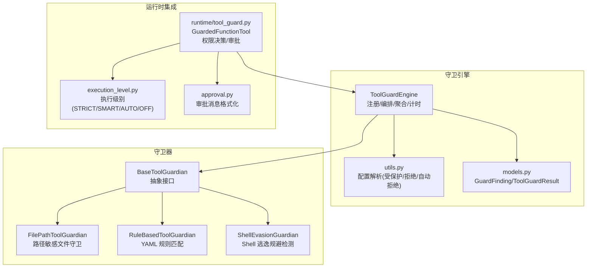
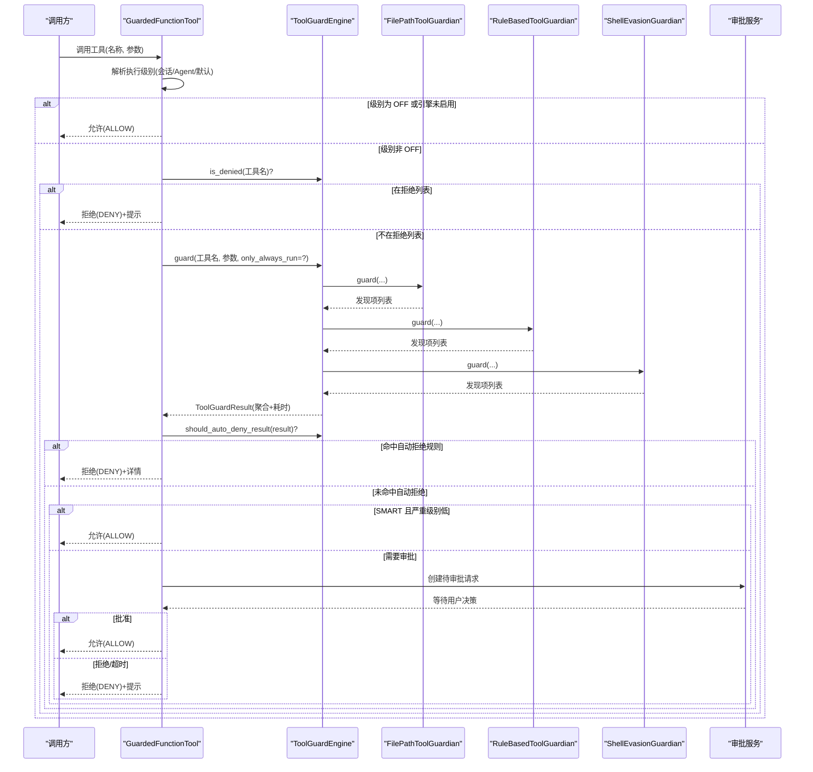
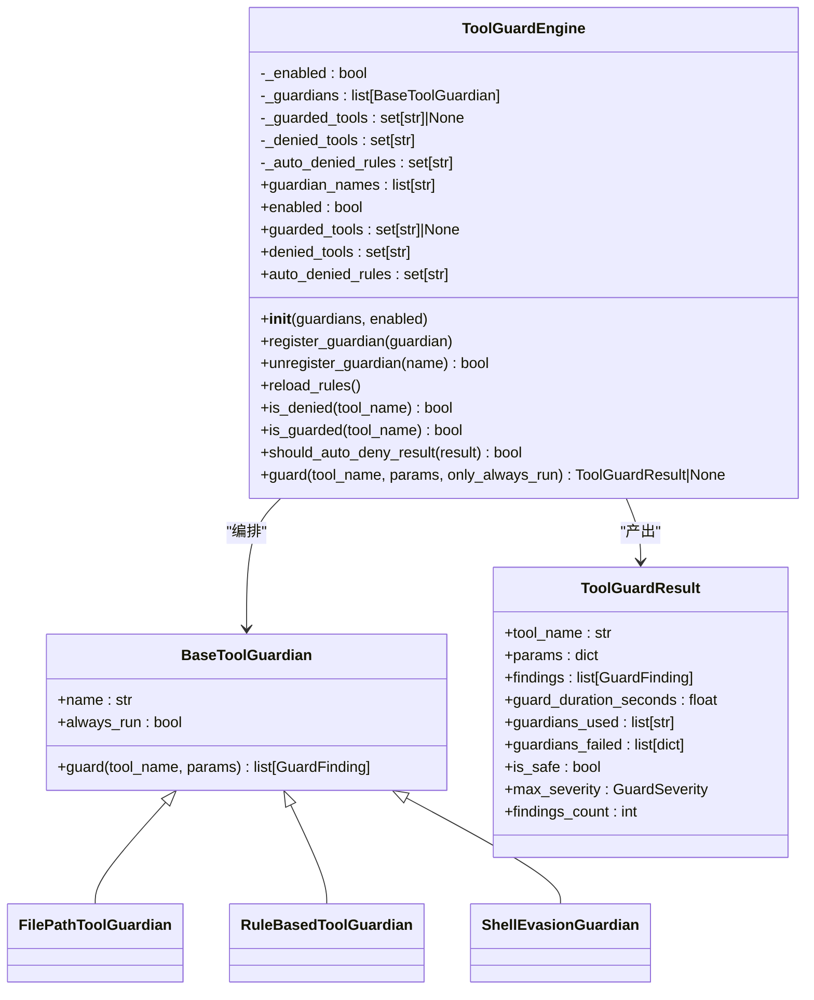
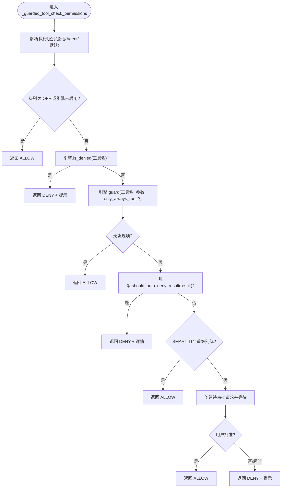
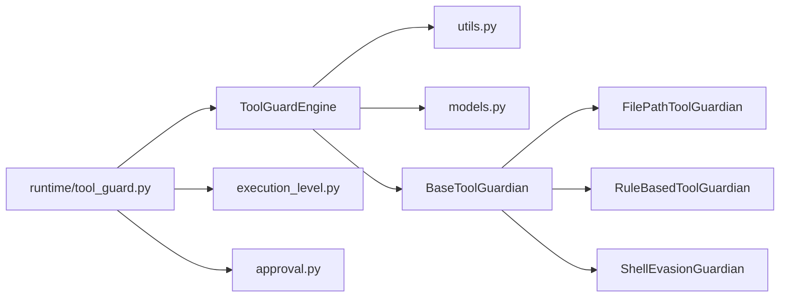

# 守卫引擎核心

<cite>
**本文引用的文件**   
- [engine.py](file://src/qwenpaw/security/tool_guard/engine.py)
- [models.py](file://src/qwenpaw/security/tool_guard/models.py)
- [guardians/__init__.py](file://src/qwenpaw/security/tool_guard/guardians/__init__.py)
- [file_guardian.py](file://src/qwenpaw/security/tool_guard/guardians/file_guardian.py)
- [rule_guardian.py](file://src/qwenpaw/security/tool_guard/guardians/rule_guardian.py)
- [shell_evasion_guardian.py](file://src/qwenpaw/security/tool_guard/guardians/shell_evasion_guardian.py)
- [utils.py](file://src/qwenpaw/security/tool_guard/utils.py)
- [tool_guard.py](file://src/qwenpaw/runtime/tool_guard.py)
- [execution_level.py](file://src/qwenpaw/security/tool_guard/execution_level.py)
- [approval.py](file://src/qwenpaw/security/tool_guard/approval.py)
- [test_engine.py](file://tests/unit/security/tool_guard/test_engine.py)
</cite>

## 目录
1. [简介](#简介)
2. [项目结构](#项目结构)
3. [核心组件](#核心组件)
4. [架构总览](#架构总览)
5. [详细组件分析](#详细组件分析)
6. [依赖关系分析](#依赖关系分析)
7. [性能考量](#性能考量)
8. [故障排查指南](#故障排查指南)
9. [结论](#结论)
10. [附录](#附录)

## 简介
本文件聚焦 QwenPaw 工具守卫引擎的核心实现，围绕 ToolGuardEngine 类展开，系统阐述其守卫器注册机制、默认守卫器初始化、工具调用检查流程、结果聚合与性能监控。文档同时覆盖配置选项、参数与返回值、与其他组件的集成方式、错误处理与自动拒绝规则的执行逻辑，并提供面向初学者的渐进式说明与面向资深开发者的技术深度。

## 项目结构
守卫引擎位于 security/tool_guard 子系统中，采用“引擎 + 守卫器 + 模型 + 工具函数”的分层组织：
- 引擎（ToolGuardEngine）：负责生命周期管理、守卫器编排、配置解析、结果聚合与性能计时。
- 守卫器（BaseToolGuardian 及其子类）：定义统一的 guard 接口，提供路径敏感检测、YAML 规则匹配、Shell 逃逸规避检测等能力。
- 模型（GuardFinding、ToolGuardResult 等）：描述发现项与聚合结果，包含严重级别、威胁分类、摘要与序列化方法。
- 工具函数（utils.py）：解析 guarded_tools/denied_tools/auto_denied_rules 等配置来源（环境变量、配置文件、内置默认）。
- 运行时集成（runtime/tool_guard.py）：将守卫引擎嵌入到工具执行链路，结合审批服务与执行级别策略进行放行/拒绝/询问决策。

图示来源
- [engine.py:54-257](file://src/qwenpaw/security/tool_guard/engine.py#L54-L257)
- [utils.py:64-156](file://src/qwenpaw/security/tool_guard/utils.py#L64-L156)
- [models.py:60-176](file://src/qwenpaw/security/tool_guard/models.py#L60-L176)
- [guardians/__init__.py:17-62](file://src/qwenpaw/security/tool_guard/guardians/__init__.py#L17-L62)
- [file_guardian.py:301-501](file://src/qwenpaw/security/tool_guard/guardians/file_guardian.py#L301-L501)
- [rule_guardian.py:581-780](file://src/qwenpaw/security/tool_guard/guardians/rule_guardian.py#L581-L780)
- [shell_evasion_guardian.py:539-593](file://src/qwenpaw/security/tool_guard/guardians/shell_evasion_guardian.py#L539-L593)
- [tool_guard.py:130-258](file://src/qwenpaw/runtime/tool_guard.py#L130-L258)
- [execution_level.py:15-80](file://src/qwenpaw/security/tool_guard/execution_level.py#L15-L80)
- [approval.py:32-115](file://src/qwenpaw/security/tool_guard/approval.py#L32-L115)

章节来源
- [engine.py:54-257](file://src/qwenpaw/security/tool_guard/engine.py#L54-L257)
- [utils.py:64-156](file://src/qwenpaw/security/tool_guard/utils.py#L64-L156)
- [models.py:60-176](file://src/qwenpaw/security/tool_guard/models.py#L60-L176)
- [guardians/__init__.py:17-62](file://src/qwenpaw/security/tool_guard/guardians/__init__.py#L17-L62)
- [file_guardian.py:301-501](file://src/qwenpaw/security/tool_guard/guardians/file_guardian.py#L301-L501)
- [rule_guardian.py:581-780](file://src/qwenpaw/security/tool_guard/guardians/rule_guardian.py#L581-L780)
- [shell_evasion_guardian.py:539-593](file://src/qwenpaw/security/tool_guard/guardians/shell_evasion_guardian.py#L539-L593)
- [tool_guard.py:130-258](file://src/qwenpaw/runtime/tool_guard.py#L130-L258)
- [execution_level.py:15-80](file://src/qwenpaw/security/tool_guard/execution_level.py#L15-L80)
- [approval.py:32-115](file://src/qwenpaw/security/tool_guard/approval.py#L32-L115)

## 核心组件
- ToolGuardEngine：守卫引擎主类，负责守卫器注册/注销、默认守卫器初始化、受保护/拒绝/自动拒绝规则集加载、工具调用检查、结果聚合与耗时统计。
- BaseToolGuardian：所有守卫器的抽象基类，定义 name、always_run 属性与 guard(tool_name, params) 接口。
- FilePathToolGuardian：基于路径敏感文件的守卫器，支持跨平台路径规范化、工作区根解析、重定向符提取、敏感目录/文件匹配。
- RuleBasedToolGuardian：基于 YAML 规则的守卫器，支持内置规则与自定义规则加载、禁用规则过滤、正则匹配与上下文片段生成。
- ShellEvasionGuardian：针对 Shell 命令的逃逸与混淆检测，包括命令替换、标志位混淆、反斜杠转义、换行隐藏、注释引号不同步等。
- models：GuardFinding 与 ToolGuardResult 数据模型，提供严重级别枚举、威胁分类、便捷属性（is_safe、max_severity）、汇总与序列化。
- utils：配置解析工具，优先级为构造参数 > 环境变量 > 配置文件 > 内置默认；支持 guarded_tools、denied_tools、auto_denied_rules 三类集合解析。
- runtime/tool_guard.py：将守卫引擎接入工具执行链路，依据执行级别（STRICT/SMART/AUTO/OFF）与引擎结果做出 ALLOW/DENY/ASK 决策，并对接审批服务。

章节来源
- [engine.py:54-257](file://src/qwenpaw/security/tool_guard/engine.py#L54-L257)
- [guardians/__init__.py:17-62](file://src/qwenpaw/security/tool_guard/guardians/__init__.py#L17-L62)
- [file_guardian.py:301-501](file://src/qwenpaw/security/tool_guard/guardians/file_guardian.py#L301-L501)
- [rule_guardian.py:581-780](file://src/qwenpaw/security/tool_guard/guardians/rule_guardian.py#L581-L780)
- [shell_evasion_guardian.py:539-593](file://src/qwenpaw/security/tool_guard/guardians/shell_evasion_guardian.py#L539-L593)
- [models.py:60-176](file://src/qwenpaw/security/tool_guard/models.py#L60-L176)
- [utils.py:64-156](file://src/qwenpaw/security/tool_guard/utils.py#L64-L156)
- [tool_guard.py:130-258](file://src/qwenpaw/runtime/tool_guard.py#L130-L258)

## 架构总览
守卫引擎在运行时通过 GuardedFunctionTool 拦截工具调用，先根据执行级别决定是否启用守卫，再调用引擎的 guard 方法遍历守卫器收集发现项，随后依据自动拒绝规则与严重级别决定放行、拒绝或发起用户审批。

图示来源
- [tool_guard.py:130-258](file://src/qwenpaw/runtime/tool_guard.py#L130-L258)
- [engine.py:200-257](file://src/qwenpaw/security/tool_guard/engine.py#L200-L257)
- [file_guardian.py:449-501](file://src/qwenpaw/security/tool_guard/guardians/file_guardian.py#L449-L501)
- [rule_guardian.py:630-780](file://src/qwenpaw/security/tool_guard/guardians/rule_guardian.py#L630-L780)
- [shell_evasion_guardian.py:555-593](file://src/qwenpaw/security/tool_guard/guardians/shell_evasion_guardian.py#L555-L593)
- [approval.py:32-115](file://src/qwenpaw/security/tool_guard/approval.py#L32-L115)

## 详细组件分析

### ToolGuardEngine 类
- 初始化与默认守卫器
  - 构造函数接受 guardians 列表与 enabled 开关；若未提供 guardians，则使用 _default_guardians 返回默认守卫器集合（文件路径、规则、Shell 逃逸），并在初始化后调用 _reload_tool_sets 刷新配置集合。
  - 默认守卫器初始化失败时记录警告日志，不影响其他守卫器加载。
- 守卫器注册与查询
  - register_guardian/unregister_guardian 支持动态增删；guardian_names 暴露当前已注册守卫器名称列表。
- 配置集合解析
  - guarded_tools：受保护的工具备选集合，None 表示全部工具受保护；由 resolve_guarded_tools 解析，优先级：构造参数 > 环境变量 > 配置文件 > 内置高风险默认集合。
  - denied_tools：无条件拒绝的工具集合；由 resolve_denied_tools 解析。
  - auto_denied_rules：命中即自动拒绝的规则 ID 集合；由 resolve_auto_denied_rules 解析。
- 判断与决策辅助
  - is_denied：判断工具是否在拒绝列表中。
  - is_guarded：判断工具是否处于受保护范围。
  - should_auto_deny_result：当结果中存在任一 rule_id 属于 auto_denied_rules 时返回 True。
- 核心检查流程 guard
  - 若引擎未启用直接返回 None。
  - 创建 ToolGuardResult，按 only_always_run 筛选守卫器（仅 always_run=True 的守卫器用于非受保护工具的轻量检查）。
  - 逐个调用 guardian.guard，聚合 findings 与使用的守卫器列表；异常被捕获并记录到 guardians_failed，不中断后续守卫器执行。
  - 计算并写入 guard_duration_seconds，返回结果。
- 单例访问
  - get_guard_engine 提供懒初始化的全局单例实例。

图示来源
- [engine.py:54-257](file://src/qwenpaw/security/tool_guard/engine.py#L54-L257)
- [guardians/__init__.py:17-62](file://src/qwenpaw/security/tool_guard/guardians/__init__.py#L17-L62)
- [file_guardian.py:301-501](file://src/qwenpaw/security/tool_guard/guardians/file_guardian.py#L301-L501)
- [rule_guardian.py:581-780](file://src/qwenpaw/security/tool_guard/guardians/rule_guardian.py#L581-L780)
- [shell_evasion_guardian.py:539-593](file://src/qwenpaw/security/tool_guard/guardians/shell_evasion_guardian.py#L539-L593)
- [models.py:103-176](file://src/qwenpaw/security/tool_guard/models.py#L103-L176)

章节来源
- [engine.py:54-257](file://src/qwenpaw/security/tool_guard/engine.py#L54-L257)
- [test_engine.py:137-175](file://tests/unit/security/tool_guard/test_engine.py#L137-L175)
- [test_engine.py:183-207](file://tests/unit/security/tool_guard/test_engine.py#L183-L207)
- [test_engine.py:215-233](file://tests/unit/security/tool_guard/test_engine.py#L215-L233)
- [test_engine.py:241-251](file://tests/unit/security/tool_guard/test_engine.py#L241-L251)
- [test_engine.py:259-335](file://tests/unit/security/tool_guard/test_engine.py#L259-L335)
- [test_engine.py:343-358](file://tests/unit/security/tool_guard/test_engine.py#L343-L358)
- [test_engine.py:366-467](file://tests/unit/security/tool_guard/test_engine.py#L366-L467)
- [test_engine.py:505-537](file://tests/unit/security/tool_guard/test_engine.py#L505-L537)

### 配置与工具集合解析（utils.py）
- resolve_guarded_tools
  - 输入支持 set/list/tuple/None；空集合表示关闭保护；"*"/"all" 表示保护全部工具；否则解析为具体工具名集合。
  - 优先级：构造参数 > QWENPAW_TOOL_GUARD_TOOLS 环境变量 > config.json.security.tool_guard.guarded_tools > 内置高风险默认集合。
- resolve_denied_tools
  - 解析逗号分隔的工具名集合；优先级：构造参数 > QWENPAW_TOOL_GUARD_DENIED_TOOLS > config.json.security.tool_guard.denied_tools > 空集合。
- resolve_auto_denied_rules
  - 解析逗号分隔的规则 ID 集合；优先级：构造参数 > QWENPAW_TOOL_GUARD_AUTO_DENIED_RULES > config.json.security.tool_guard.auto_denied_rules > 空集合。

章节来源
- [utils.py:64-156](file://src/qwenpaw/security/tool_guard/utils.py#L64-L156)

### 数据模型（models.py）
- GuardFinding：单个安全发现项，包含 id、rule_id、category、severity、title、description、tool_name、param_name、matched_value、matched_pattern、snippet、remediation、guardian、metadata 等字段，并提供 to_dict 序列化。
- ToolGuardResult：单次工具调用的聚合结果，包含 findings、guard_duration_seconds、guardians_used、guardians_failed、timestamp，以及 is_safe、max_severity、findings_count 等便捷属性与 to_dict 序列化。
- 严重级别与威胁分类枚举：GuardSeverity（CRITICAL/HIGH/MEDIUM/LOW/INFO/SAFE）、GuardThreatCategory（如 command_injection、path_traversal 等）。

章节来源
- [models.py:25-176](file://src/qwenpaw/security/tool_guard/models.py#L25-L176)

### 守卫器实现要点
- FilePathToolGuardian
  - 支持跨平台路径规范化（Windows/POSIX），工作区根解析，敏感文件/目录匹配，shell 重定向符提取，对所有字符串参数进行启发式路径识别。
  - 提供 reload 以从配置重新加载敏感文件列表与启用状态。
- RuleBasedToolGuardian
  - 加载内置 YAML 规则与自定义规则，支持禁用规则过滤；对每个参数值进行正则匹配，生成上下文片段与增强描述（如 rm 命令工作区外文件检测）。
  - 提供 reload 以热重载规则。
- ShellEvasionGuardian
  - 针对 execute_shell_command 的多种逃逸与混淆模式进行检测，包括命令替换、ANSI-C/本地化引号、反斜杠转义空白/操作符、隐藏换行、注释引号不同步、引号内换行等。
  - 支持按检查项启停的配置映射，提供 reload 更新。

章节来源
- [file_guardian.py:301-501](file://src/qwenpaw/security/tool_guard/guardians/file_guardian.py#L301-L501)
- [rule_guardian.py:581-780](file://src/qwenpaw/security/tool_guard/guardians/rule_guardian.py#L581-L780)
- [shell_evasion_guardian.py:539-593](file://src/qwenpaw/security/tool_guard/guardians/shell_evasion_guardian.py#L539-L593)

### 运行时集成与执行级别（runtime/tool_guard.py）
- GuardedFunctionTool
  - 动态继承 FunctionTool，注入代理方法以驱动守卫引擎与审批服务。
  - _resolve_execution_level：优先读取会话级 approval_level，其次 Agent 配置，最后回退 bypass。
  - _guarded_tool_check_permissions：根据执行级别与引擎结果做出 ALLOW/DENY/ASK 决策。
- 执行级别（execution_level.py）
  - STRICT：所有工具均需审批。
  - SMART：低风险（INFO/LOW）自动放行，中高风险需审批。
  - AUTO：仅受保护工具需审批（向后兼容）。
  - OFF：完全禁用守卫。
- 审批消息（approval.py）
  - format_findings_summary 与 format_channel_approval_body 提供简洁与富文本的消息格式，便于前端展示与通道通知。

图示来源
- [tool_guard.py:130-258](file://src/qwenpaw/runtime/tool_guard.py#L130-L258)
- [execution_level.py:15-80](file://src/qwenpaw/security/tool_guard/execution_level.py#L15-L80)
- [approval.py:32-115](file://src/qwenpaw/security/tool_guard/approval.py#L32-L115)

章节来源
- [tool_guard.py:130-258](file://src/qwenpaw/runtime/tool_guard.py#L130-L258)
- [execution_level.py:15-80](file://src/qwenpaw/security/tool_guard/execution_level.py#L15-L80)
- [approval.py:32-115](file://src/qwenpaw/security/tool_guard/approval.py#L32-L115)

## 依赖关系分析
- 组件耦合
  - ToolGuardEngine 依赖 BaseToolGuardian 抽象接口与其三个具体实现；依赖 utils 解析配置；产出 ToolGuardResult 供上层决策。
  - runtime/tool_guard.py 依赖 engine、execution_level、approval 完成端到端决策与用户交互。
- 外部依赖
  - 配置文件加载（config.load_config）与环境变量（EnvVarLoader）用于动态控制守卫行为。
  - agentscope.permission 用于 PermissionDecision/PermissionBehavior 的返回。
- 潜在循环依赖
  - 引擎与守卫器之间通过抽象接口解耦；运行时集成仅在函数体内延迟导入 agentscope，避免定义期强依赖。

图示来源
- [engine.py:54-257](file://src/qwenpaw/security/tool_guard/engine.py#L54-L257)
- [utils.py:64-156](file://src/qwenpaw/security/tool_guard/utils.py#L64-L156)
- [models.py:60-176](file://src/qwenpaw/security/tool_guard/models.py#L60-L176)
- [guardians/__init__.py:17-62](file://src/qwenpaw/security/tool_guard/guardians/__init__.py#L17-L62)
- [file_guardian.py:301-501](file://src/qwenpaw/security/tool_guard/guardians/file_guardian.py#L301-L501)
- [rule_guardian.py:581-780](file://src/qwenpaw/security/tool_guard/guardians/rule_guardian.py#L581-L780)
- [shell_evasion_guardian.py:539-593](file://src/qwenpaw/security/tool_guard/guardians/shell_evasion_guardian.py#L539-L593)
- [tool_guard.py:130-258](file://src/qwenpaw/runtime/tool_guard.py#L130-L258)
- [execution_level.py:15-80](file://src/qwenpaw/security/tool_guard/execution_level.py#L15-L80)
- [approval.py:32-115](file://src/qwenpaw/security/tool_guard/approval.py#L32-L115)

章节来源
- [engine.py:54-257](file://src/qwenpaw/security/tool_guard/engine.py#L54-L257)
- [tool_guard.py:130-258](file://src/qwenpaw/runtime/tool_guard.py#L130-L258)

## 性能考量
- 守卫器执行顺序与短路
  - only_always_run 参数可仅运行 always_run=True 的守卫器，适用于非受保护工具的轻量检查（如路径扫描），减少不必要的规则匹配开销。
- 结果聚合与异常隔离
  - 单个守卫器异常不会中断整体流程，错误信息记录到 guardians_failed，保障总体性能与稳定性。
- 计时指标
  - guard_duration_seconds 可用于观测守卫链路的耗时分布，定位慢守卫器或复杂规则匹配瓶颈。
- 规则预编译
  - RuleBasedToolGuardian 预编译正则表达式，提升匹配性能；建议合理拆分规则与排除模式，避免过度复杂的正则。
- 路径规范化与去重
  - FilePathToolGuardian 对路径进行规范化与去重，降低重复检查成本；建议在配置中尽量使用绝对路径以减少解析开销。

[本节为通用性能指导，无需特定文件引用]

## 故障排查指南
- 守卫器初始化失败
  - 现象：默认守卫器初始化抛出异常，但引擎继续运行。
  - 排查：查看警告日志，确认依赖环境（如配置文件、敏感文件路径）是否正确。
- 守卫器执行异常
  - 现象：某守卫器 guard 抛出异常，结果中出现 guardians_failed。
  - 排查：根据 guardians_failed 中的 name 与 error 定位具体守卫器与异常堆栈，修复实现或调整输入参数。
- 自动拒绝未生效
  - 现象：命中高危规则但未自动拒绝。
  - 排查：确认 auto_denied_rules 配置是否正确加载（环境变量/配置文件/构造参数），验证 result.findings 中的 rule_id 是否在集合中。
- 受保护工具范围不符合预期
  - 现象：某些工具未被检查或全部工具都被检查。
  - 排查：核对 guarded_tools 解析结果（None 表示全部），确认环境变量与配置文件优先级。
- 审批流程卡住
  - 现象：工具调用长时间等待审批。
  - 排查：检查审批服务是否可用、超时时间设置、前端推送消息是否正常；参考 _ask_user_approval 的日志输出。

章节来源
- [engine.py:200-257](file://src/qwenpaw/security/tool_guard/engine.py#L200-L257)
- [test_engine.py:366-467](file://tests/unit/security/tool_guard/test_engine.py#L366-L467)
- [tool_guard.py:309-415](file://src/qwenpaw/runtime/tool_guard.py#L309-L415)

## 结论
ToolGuardEngine 提供了可扩展、可配置、可观测的工具调用守卫能力。通过抽象守卫器接口与默认守卫器组合，实现了路径敏感、规则匹配与 Shell 逃逸检测等多维度防护；结合执行级别与审批服务，形成灵活的放行/拒绝/询问策略。合理的配置与规则设计、完善的异常隔离与性能计时，使得该引擎在生产环境中具备高可用性与可维护性。

[本节为总结性内容，无需特定文件引用]

## 附录
- 关键接口与参数
  - ToolGuardEngine.__init__(guardians=None, enabled=None)
    - guardians：显式守卫器列表；None 时使用默认守卫器。
    - enabled：覆盖 QWENPAW_TOOL_GUARD_ENABLED 环境变量。
  - ToolGuardEngine.guard(tool_name, params, only_always_run=False) -> ToolGuardResult|None
    - tool_name：工具名称。
    - params：工具调用参数字典。
    - only_always_run：仅运行 always_run=True 的守卫器。
    - 返回：ToolGuardResult 或 None（引擎未启用）。
  - ToolGuardEngine.reload_rules()
    - 触发守卫器 reload 与工具集合重新解析。
  - ToolExecutionLevel.from_config(value) -> ToolExecutionLevel
    - 从配置字符串解析执行级别，无效值回退 AUTO。
- 配置项与优先级
  - QWENPAW_TOOL_GUARD_ENABLED：布尔型，控制守卫引擎启用。
  - QWENPAW_TOOL_GUARD_TOOLS：逗号分隔工具名或 "*" / "all" / "none" / "off" / "false" / "0"。
  - QWENPAW_TOOL_GUARD_DENIED_TOOLS：逗号分隔工具名。
  - QWENPAW_TOOL_GUARD_AUTO_DENIED_RULES：逗号分隔规则 ID。
  - 对应 config.json 的 security.tool_guard.* 字段。
- 使用示例（路径引用）
  - 初始化与基本调用：[engine.py:8-16](file://src/qwenpaw/security/tool_guard/engine.py#L8-L16)
  - 单例获取：[engine.py:263-268](file://src/qwenpaw/security/tool_guard/engine.py#L263-L268)
  - 运行时集成入口：[tool_guard.py:130-258](file://src/qwenpaw/runtime/tool_guard.py#L130-L258)
  - 单元测试用例（初始化/注册/拒绝/自动拒绝/重载）：[test_engine.py:137-175](file://tests/unit/security/tool_guard/test_engine.py#L137-L175)、[test_engine.py:215-233](file://tests/unit/security/tool_guard/test_engine.py#L215-L233)、[test_engine.py:241-251](file://tests/unit/security/tool_guard/test_engine.py#L241-L251)、[test_engine.py:259-335](file://tests/unit/security/tool_guard/test_engine.py#L259-L335)、[test_engine.py:505-537](file://tests/unit/security/tool_guard/test_engine.py#L505-L537)

章节来源
- [engine.py:8-16](file://src/qwenpaw/security/tool_guard/engine.py#L8-L16)
- [engine.py:263-268](file://src/qwenpaw/security/tool_guard/engine.py#L263-L268)
- [tool_guard.py:130-258](file://src/qwenpaw/runtime/tool_guard.py#L130-L258)
- [test_engine.py:137-175](file://tests/unit/security/tool_guard/test_engine.py#L137-L175)
- [test_engine.py:215-233](file://tests/unit/security/tool_guard/test_engine.py#L215-L233)
- [test_engine.py:241-251](file://tests/unit/security/tool_guard/test_engine.py#L241-L251)
- [test_engine.py:259-335](file://tests/unit/security/tool_guard/test_engine.py#L259-L335)
- [test_engine.py:505-537](file://tests/unit/security/tool_guard/test_engine.py#L505-L537)