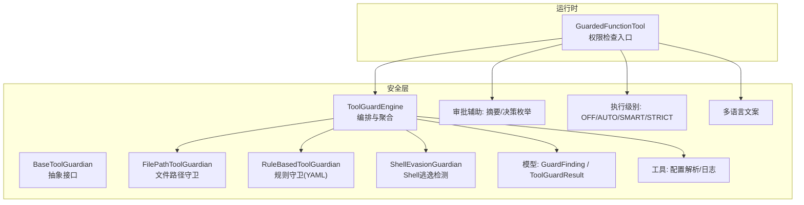
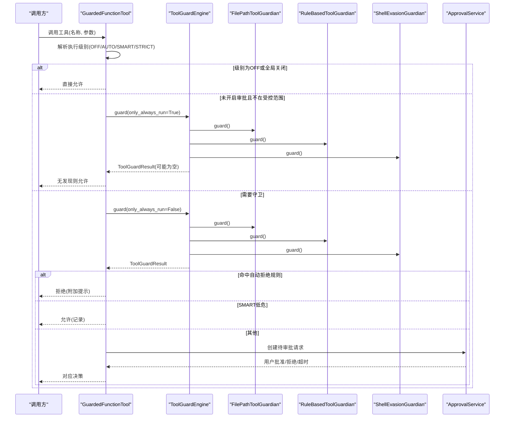
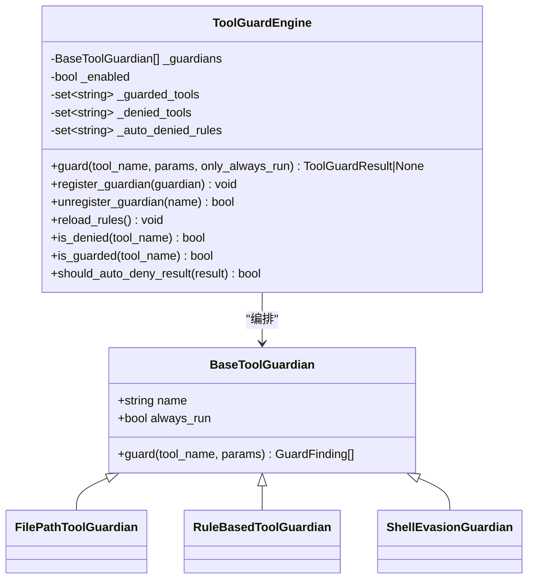
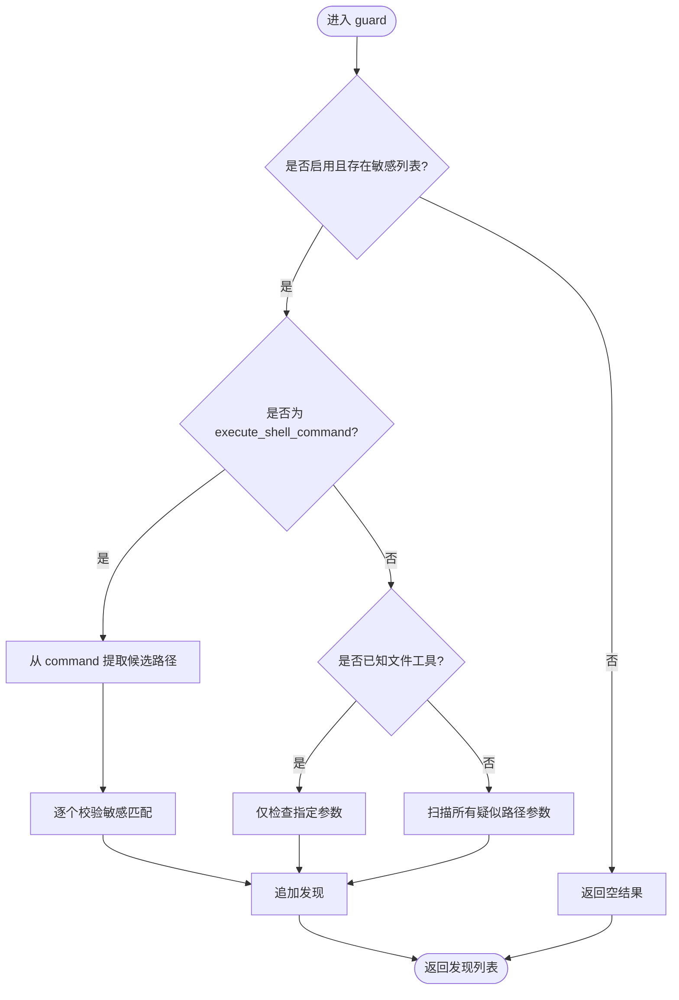
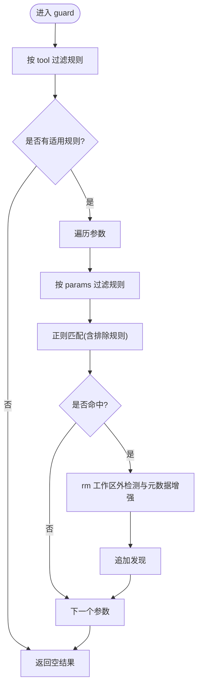
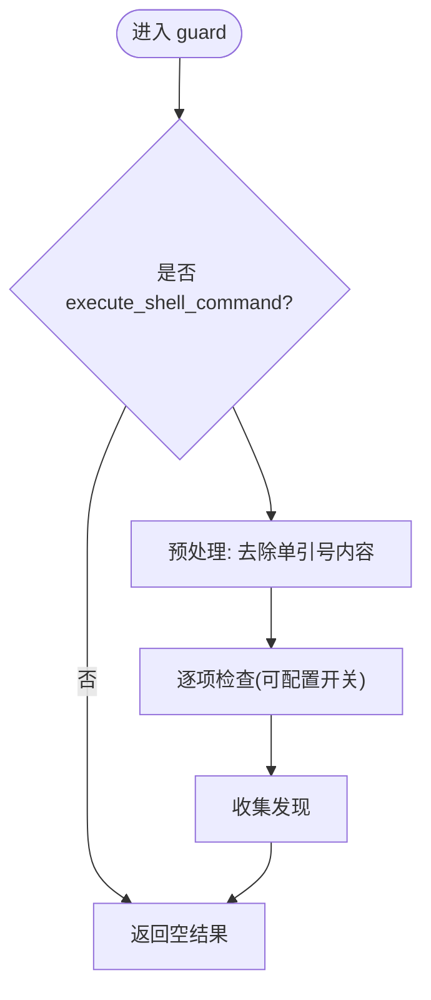
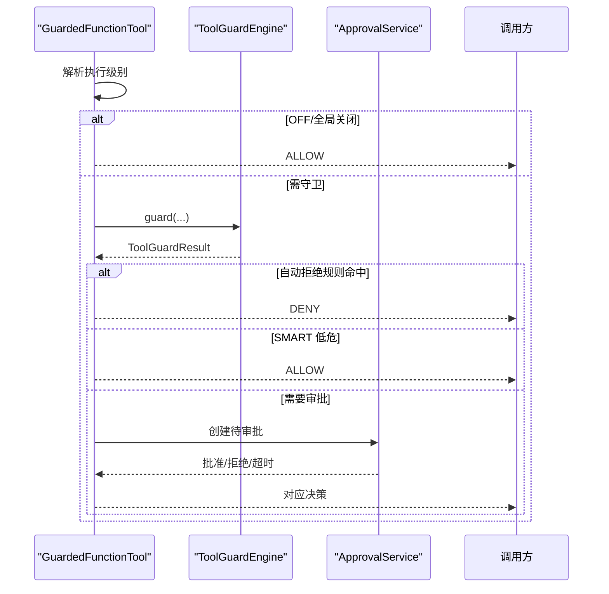
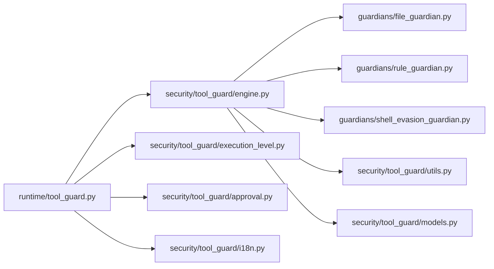

# 工具守卫系统

<cite>
**本文引用的文件**   
- [src/qwenpaw/security/tool_guard/__init__.py](file://src/qwenpaw/security/tool_guard/__init__.py)
- [src/qwenpaw/security/tool_guard/engine.py](file://src/qwenpaw/security/tool_guard/engine.py)
- [src/qwenpaw/security/tool_guard/models.py](file://src/qwenpaw/security/tool_guard/models.py)
- [src/qwenpaw/security/tool_guard/guardians/__init__.py](file://src/qwenpaw/security/tool_guard/guardians/__init__.py)
- [src/qwenpaw/security/tool_guard/guardians/file_guardian.py](file://src/qwenpaw/security/tool_guard/guardians/file_guardian.py)
- [src/qwenpaw/security/tool_guard/guardians/rule_guardian.py](file://src/qwenpaw/security/tool_guard/guardians/rule_guardian.py)
- [src/qwenpaw/security/tool_guard/guardians/shell_evasion_guardian.py](file://src/qwenpaw/security/tool_guard/guardians/shell_evasion_guardian.py)
- [src/qwenpaw/runtime/tool_guard.py](file://src/qwenpaw/runtime/tool_guard.py)
- [src/qwenpaw/security/tool_guard/utils.py](file://src/qwenpaw/security/tool_guard/utils.py)
- [src/qwenpaw/security/tool_guard/approval.py](file://src/qwenpaw/security/tool_guard/approval.py)
- [src/qwenpaw/security/tool_guard/execution_level.py](file://src/qwenpaw/security/tool_guard/execution_level.py)
- [src/qwenpaw/security/tool_guard/i18n.py](file://src/qwenpaw/security/tool_guard/i18n.py)
- [tests/contract/security/test_guardian_contract.py](file://tests/contract/security/test_guardian_contract.py)
</cite>

## 目录
1. [简介](#简介)
2. [项目结构](#项目结构)
3. [核心组件](#核心组件)
4. [架构总览](#架构总览)
5. [详细组件分析](#详细组件分析)
6. [依赖关系分析](#依赖关系分析)
7. [性能与可扩展性](#性能与可扩展性)
8. [配置与参数](#配置与参数)
9. [故障排查指南](#故障排查指南)
10. [结论](#结论)

## 简介
本文件系统性阐述 QwenPaw 的“工具守卫系统”，聚焦于工具调用前的安全检查、规则引擎、守卫器模式与结果聚合。文档覆盖：
- 文件路径守卫（敏感文件/目录拦截）
- 基于规则的守卫（YAML 正则签名匹配，含 rm 工作区外检测增强）
- Shell 逃逸检测守卫（引号感知、命令替换、转义逃逸等）
- 执行级别策略（OFF/AUTO/SMART/STRICT）
- 结果聚合与审批流集成
- 关键接口、领域模型、调用关系与使用模式
- 常见问题与解决方案

## 项目结构
工具守卫子系统位于 security/tool_guard 下，采用“引擎 + 守卫器”的可插拔架构；运行时通过 GuardedFunctionTool 将守卫能力注入到工具调用链路中。

图表来源
- [src/qwenpaw/security/tool_guard/engine.py:1-269](file://src/qwenpaw/security/tool_guard/engine.py#L1-L269)
- [src/qwenpaw/security/tool_guard/guardians/__init__.py:1-62](file://src/qwenpaw/security/tool_guard/guardians/__init__.py#L1-L62)
- [src/qwenpaw/security/tool_guard/guardians/file_guardian.py:1-501](file://src/qwenpaw/security/tool_guard/guardians/file_guardian.py#L1-L501)
- [src/qwenpaw/security/tool_guard/guardians/rule_guardian.py:1-780](file://src/qwenpaw/security/tool_guard/guardians/rule_guardian.py#L1-L780)
- [src/qwenpaw/security/tool_guard/guardians/shell_evasion_guardian.py:1-593](file://src/qwenpaw/security/tool_guard/guardians/shell_evasion_guardian.py#L1-L593)
- [src/qwenpaw/security/tool_guard/models.py:1-185](file://src/qwenpaw/security/tool_guard/models.py#L1-L185)
- [src/qwenpaw/security/tool_guard/utils.py:1-194](file://src/qwenpaw/security/tool_guard/utils.py#L1-L194)
- [src/qwenpaw/security/tool_guard/approval.py:1-115](file://src/qwenpaw/security/tool_guard/approval.py#L1-L115)
- [src/qwenpaw/security/tool_guard/execution_level.py:1-80](file://src/qwenpaw/security/tool_guard/execution_level.py#L1-L80)
- [src/qwenpaw/security/tool_guard/i18n.py:1-185](file://src/qwenpaw/security/tool_guard/i18n.py#L1-L185)
- [src/qwenpaw/runtime/tool_guard.py:1-415](file://src/qwenpaw/runtime/tool_guard.py#L1-L415)

章节来源
- [src/qwenpaw/security/tool_guard/__init__.py:1-59](file://src/qwenpaw/security/tool_guard/__init__.py#L1-L59)

## 核心组件
- 抽象守卫器接口：定义统一的 guard(tool_name, params) -> list[GuardFinding] 契约，支持 always_run 标记以在受限范围外仍执行关键检查。
- 引擎：负责发现并运行所有已注册守卫器，聚合结果为 ToolGuardResult，并提供 is_denied/is_guarded/should_auto_deny_result 等策略判断。
- 数据模型：GuardFinding 描述单次命中详情；ToolGuardResult 汇总一次调用的全部发现、耗时、使用的守卫器及失败信息。
- 守卫器实现：
  - 文件路径守卫：对敏感文件/目录进行前缀匹配拦截，兼容 Windows/POSIX 路径归一化与 shell 重定向提取。
  - 规则守卫：加载 YAML 规则，按工具/参数过滤后做正则匹配，并对 rm 命令进行工作区外目标检测增强。
  - Shell 逃逸守卫：引号状态机驱动的多项子检查，识别命令替换、标志位混淆、反斜杠逃逸、换行隐藏、注释引号失步等。
- 运行时集成：GuardedFunctionTool 根据执行级别决定是否需要审批，结合引擎结果与自动拒绝规则，最终返回允许/拒绝/请求审批。

章节来源
- [src/qwenpaw/security/tool_guard/guardians/__init__.py:1-62](file://src/qwenpaw/security/tool_guard/guardians/__init__.py#L1-L62)
- [src/qwenpaw/security/tool_guard/engine.py:1-269](file://src/qwenpaw/security/tool_guard/engine.py#L1-L269)
- [src/qwenpaw/security/tool_guard/models.py:1-185](file://src/qwenpaw/security/tool_guard/models.py#L1-L185)
- [src/qwenpaw/security/tool_guard/guardians/file_guardian.py:1-501](file://src/qwenpaw/security/tool_guard/guardians/file_guardian.py#L1-L501)
- [src/qwenpaw/security/tool_guard/guardians/rule_guardian.py:1-780](file://src/qwenpaw/security/tool_guard/guardians/rule_guardian.py#L1-L780)
- [src/qwenpaw/security/tool_guard/guardians/shell_evasion_guardian.py:1-593](file://src/qwenpaw/security/tool_guard/guardians/shell_evasion_guardian.py#L1-L593)
- [src/qwenpaw/runtime/tool_guard.py:1-415](file://src/qwenpaw/runtime/tool_guard.py#L1-L415)

## 架构总览
下图展示从工具调用到守卫决策的关键流程。

图表来源
- [src/qwenpaw/runtime/tool_guard.py:1-415](file://src/qwenpaw/runtime/tool_guard.py#L1-L415)
- [src/qwenpaw/security/tool_guard/engine.py:1-269](file://src/qwenpaw/security/tool_guard/engine.py#L1-L269)
- [src/qwenpaw/security/tool_guard/guardians/file_guardian.py:1-501](file://src/qwenpaw/security/tool_guard/guardians/file_guardian.py#L1-L501)
- [src/qwenpaw/security/tool_guard/guardians/rule_guardian.py:1-780](file://src/qwenpaw/security/tool_guard/guardians/rule_guardian.py#L1-L780)
- [src/qwenpaw/security/tool_guard/guardians/shell_evasion_guardian.py:1-593](file://src/qwenpaw/security/tool_guard/guardians/shell_evasion_guardian.py#L1-L593)

## 详细组件分析

### 抽象守卫器与引擎
- 抽象接口 BaseToolGuardian
  - 属性：name、always_run
  - 方法：guard(tool_name, params) -> list[GuardFinding]
- 引擎 ToolGuardEngine
  - 默认守卫器集合：文件路径守卫、规则守卫、Shell 逃逸守卫
  - 生命周期：构造时初始化守卫器、加载受控/禁止工具集与自动拒绝规则；提供 register/unregister、reload_rules、is_denied/is_guarded、should_auto_deny_result
  - 核心 guard：遍历守卫器，捕获异常并记录失败信息，统计耗时，返回聚合结果

图表来源
- [src/qwenpaw/security/tool_guard/guardians/__init__.py:1-62](file://src/qwenpaw/security/tool_guard/guardians/__init__.py#L1-L62)
- [src/qwenpaw/security/tool_guard/engine.py:1-269](file://src/qwenpaw/security/tool_guard/engine.py#L1-L269)

章节来源
- [src/qwenpaw/security/tool_guard/guardians/__init__.py:1-62](file://src/qwenpaw/security/tool_guard/guardians/__init__.py#L1-L62)
- [src/qwenpaw/security/tool_guard/engine.py:1-269](file://src/qwenpaw/security/tool_guard/engine.py#L1-L269)

### 文件路径守卫（FilePathToolGuardian）
- 功能要点
  - 维护敏感文件/目录集合，支持动态添加/移除与 reload
  - 对 execute_shell_command 的参数 command 进行路径提取（支持分离/附着重定向符），对其他已知文件工具仅检查指定参数名，其余工具扫描所有疑似路径字符串
  - 跨平台路径归一化（Windows UNC/盘符/相对路径/大小写不敏感）
  - 命中后生成 HIGH 严重度发现，附带建议修复说明
- 关键算法
  - 路径归一化：统一分隔符、展开用户目录、相对路径解析到工作区根
  - Shell 路径提取：shlex 分词 + 重定向操作符处理 + 去重
  - 敏感匹配：精确文件命中或目录前缀命中（考虑分隔符边界）

图表来源
- [src/qwenpaw/security/tool_guard/guardians/file_guardian.py:1-501](file://src/qwenpaw/security/tool_guard/guardians/file_guardian.py#L1-L501)

章节来源
- [src/qwenpaw/security/tool_guard/guardians/file_guardian.py:1-501](file://src/qwenpaw/security/tool_guard/guardians/file_guardian.py#L1-L501)

### 基于规则的守卫（RuleBasedToolGuardian）
- 功能要点
  - 从内置 rules 目录与配置自定义规则合并加载，支持禁用规则 ID
  - 按 tool/params 过滤后，对每个参数的字符串表示进行正则匹配
  - 针对 rm 命令增强：提取目标路径并判断是否在工作区外，补充结构化元数据与提示文案
- 规则格式
  - id、tools/tools、params/param、category、severity、patterns、exclude_patterns、description、remediation
- 性能优化
  - 预编译正则、按工具/参数快速筛选、跳过空值

图表来源
- [src/qwenpaw/security/tool_guard/guardians/rule_guardian.py:1-780](file://src/qwenpaw/security/tool_guard/guardians/rule_guardian.py#L1-L780)

章节来源
- [src/qwenpaw/security/tool_guard/guardians/rule_guardian.py:1-780](file://src/qwenpaw/security/tool_guard/guardians/rule_guardian.py#L1-L780)

### Shell 逃逸检测守卫（ShellEvasionGuardian）
- 功能要点
  - 仅对 execute_shell_command 生效
  - 引号状态机跟踪，区分单/双引号与转义
  - 多项子检查：命令替换、标志位混淆、反斜杠转义空白/操作符、隐藏换行、注释引号失步、引号内换行+下一行注释
  - 可配置逐项开关（来自配置）
- 典型绕过场景
  - $()/``/Zsh 扩展、$'...'/ $"..." 隐藏字符、\; \& 等转义操作符、\r 混入、# 注释中的引号导致状态机失步

图表来源
- [src/qwenpaw/security/tool_guard/guardians/shell_evasion_guardian.py:1-593](file://src/qwenpaw/security/tool_guard/guardians/shell_evasion_guardian.py#L1-L593)

章节来源
- [src/qwenpaw/security/tool_guard/guardians/shell_evasion_guardian.py:1-593](file://src/qwenpaw/security/tool_guard/guardians/shell_evasion_guardian.py#L1-L593)

### 运行时集成与审批流（GuardedFunctionTool）
- 职责
  - 解析执行级别（会话级 > Agent 配置 > 默认 bypass）
  - 根据级别与引擎结果决定 ALLOW/DENY/ASK
  - 自动拒绝规则命中即 DENY；SMART 模式下 INFO/LOW 自动放行
  - ASK 模式通过 ApprovalService 创建待审批请求并阻塞等待结果
- 关键行为
  - 被禁止工具直接 DENY
  - 非受控工具仅在 only_always_run=True 下运行必要守卫（如文件路径守卫）
  - STRICT 模式即使无发现也会生成 INFO 级发现以触发审批卡片

图表来源
- [src/qwenpaw/runtime/tool_guard.py:1-415](file://src/qwenpaw/runtime/tool_guard.py#L1-L415)
- [src/qwenpaw/security/tool_guard/engine.py:1-269](file://src/qwenpaw/security/tool_guard/engine.py#L1-L269)
- [src/qwenpaw/security/tool_guard/execution_level.py:1-80](file://src/qwenpaw/security/tool_guard/execution_level.py#L1-L80)

章节来源
- [src/qwenpaw/runtime/tool_guard.py:1-415](file://src/qwenpaw/runtime/tool_guard.py#L1-L415)
- [src/qwenpaw/security/tool_guard/execution_level.py:1-80](file://src/qwenpaw/security/tool_guard/execution_level.py#L1-L80)

## 依赖关系分析
- 模块耦合
  - 引擎依赖三个具体守卫器与 utils 的配置解析函数
  - 运行时依赖引擎、执行级别、审批辅助与 i18n
  - 守卫器均依赖 models 的 GuardFinding/Severity/Category
- 外部依赖
  - 配置文件加载（config）、环境变量（EnvVarLoader）、yaml 解析、agentscope 的 FunctionTool/PermissionDecision 等

图表来源
- [src/qwenpaw/runtime/tool_guard.py:1-415](file://src/qwenpaw/runtime/tool_guard.py#L1-L415)
- [src/qwenpaw/security/tool_guard/engine.py:1-269](file://src/qwenpaw/security/tool_guard/engine.py#L1-L269)
- [src/qwenpaw/security/tool_guard/utils.py:1-194](file://src/qwenpaw/security/tool_guard/utils.py#L1-L194)
- [src/qwenpaw/security/tool_guard/models.py:1-185](file://src/qwenpaw/security/tool_guard/models.py#L1-L185)

章节来源
- [src/qwenpaw/security/tool_guard/engine.py:1-269](file://src/qwenpaw/security/tool_guard/engine.py#L1-L269)
- [src/qwenpaw/security/tool_guard/utils.py:1-194](file://src/qwenpaw/security/tool_guard/utils.py#L1-L194)

## 性能与可扩展性
- 性能特性
  - 规则守卫预编译正则并按工具/参数快速过滤，避免全量匹配
  - 文件路径守卫对路径进行归一化与集合前缀匹配，时间复杂度近似 O(N)（N 为敏感条目数）
  - Shell 逃逸守卫为线性扫描，开销可控
  - 引擎记录每次守卫耗时，便于观测
- 可扩展性
  - 新增守卫器仅需继承 BaseToolGuardian 并在引擎注册
  - 规则可通过 YAML 与配置动态加载/禁用，无需重启
  - 执行级别与自动拒绝规则提供灵活策略面

[本节为通用指导，不直接分析具体文件]

## 配置与参数
- 全局开关
  - 环境变量：QWENPAW_TOOL_GUARD_ENABLED（true/1/yes 为开）
  - 配置项：security.tool_guard.enabled
- 受控工具集
  - 环境变量：QWENPAW_TOOL_GUARD_TOOLS（逗号分隔，* 表示全部，none/off/false/0 表示空集）
  - 配置项：security.tool_guard.guarded_tools
- 禁止工具集
  - 环境变量：QWENPAW_TOOL_GUARD_DENIED_TOOLS
  - 配置项：security.tool_guard.denied_tools
- 自动拒绝规则
  - 环境变量：QWENPAW_TOOL_GUARD_AUTO_DENIED_RULES
  - 配置项：security.tool_guard.auto_denied_rules
- 文件守卫
  - 配置项：security.file_guard.enabled、security.file_guard.sensitive_files
- 规则守卫
  - 配置项：security.tool_guard.disabled_rules、security.tool_guard.custom_rules
- Shell 逃逸检测
  - 配置项：security.tool_guard.shell_evasion_checks（键为检查名，值为布尔）
- 执行级别
  - 会话级：request_context.approval_level
  - Agent 级：AgentProfileConfig.approval_level
  - 取值：strict/smart/auto/off

章节来源
- [src/qwenpaw/security/tool_guard/engine.py:1-269](file://src/qwenpaw/security/tool_guard/engine.py#L1-L269)
- [src/qwenpaw/security/tool_guard/utils.py:1-194](file://src/qwenpaw/security/tool_guard/utils.py#L1-L194)
- [src/qwenpaw/security/tool_guard/guardians/file_guardian.py:1-501](file://src/qwenpaw/security/tool_guard/guardians/file_guardian.py#L1-L501)
- [src/qwenpaw/security/tool_guard/guardians/rule_guardian.py:1-780](file://src/qwenpaw/security/tool_guard/guardians/rule_guardian.py#L1-L780)
- [src/qwenpaw/security/tool_guard/guardians/shell_evasion_guardian.py:1-593](file://src/qwenpaw/security/tool_guard/guardians/shell_evasion_guardian.py#L1-L593)
- [src/qwenpaw/security/tool_guard/execution_level.py:1-80](file://src/qwenpaw/security/tool_guard/execution_level.py#L1-L80)

## 故障排查指南
- 常见现象与定位
  - 工具被误拦截：检查 denied_tools 与 auto_denied_rules 配置；查看 ToolGuardResult.max_severity 与 findings 明细
  - 规则未生效：确认 disabled_rules 与 custom_rules 是否正确加载；验证 patterns/exclude_patterns 语法
  - Shell 逃逸检测误报/漏报：核对 shell_evasion_checks 开关；关注引号与转义场景
  - 审批卡不出：确认 ApprovalService 是否可用、超时设置、前端轮询是否正常
- 调试建议
  - 启用结构化日志：log_findings 会输出每条发现的严重级别、规则ID、匹配片段
  - 使用只运行 always_run 守卫：在非受控工具上仅运行文件路径守卫，减少干扰
  - 单元测试参考：合同测试覆盖了未知工具名、空参数、字段填充等边界情况

章节来源
- [src/qwenpaw/security/tool_guard/utils.py:1-194](file://src/qwenpaw/security/tool_guard/utils.py#L1-L194)
- [tests/contract/security/test_guardian_contract.py:1-289](file://tests/contract/security/test_guardian_contract.py#L1-L289)

## 结论
工具守卫系统通过“引擎 + 守卫器”的可插拔设计，提供了面向文件路径、规则签名与 Shell 逃逸的综合防护能力；配合执行级别与自动拒绝规则，可在安全性与可用性之间取得平衡。其清晰的接口与丰富的配置选项，既适合初学者快速上手，也满足高级用户的深度定制需求。