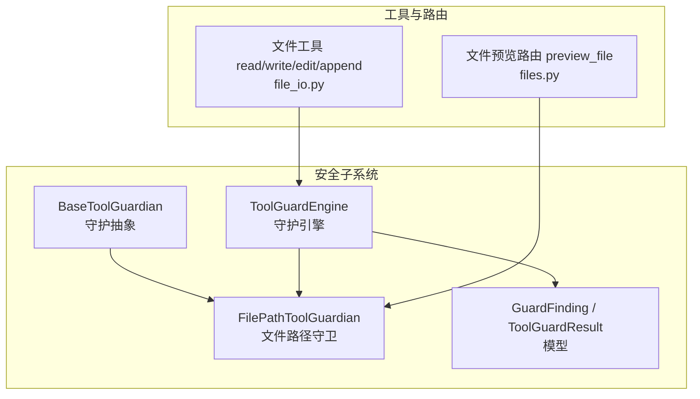
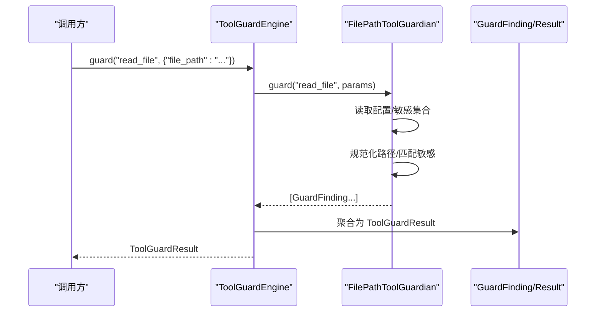
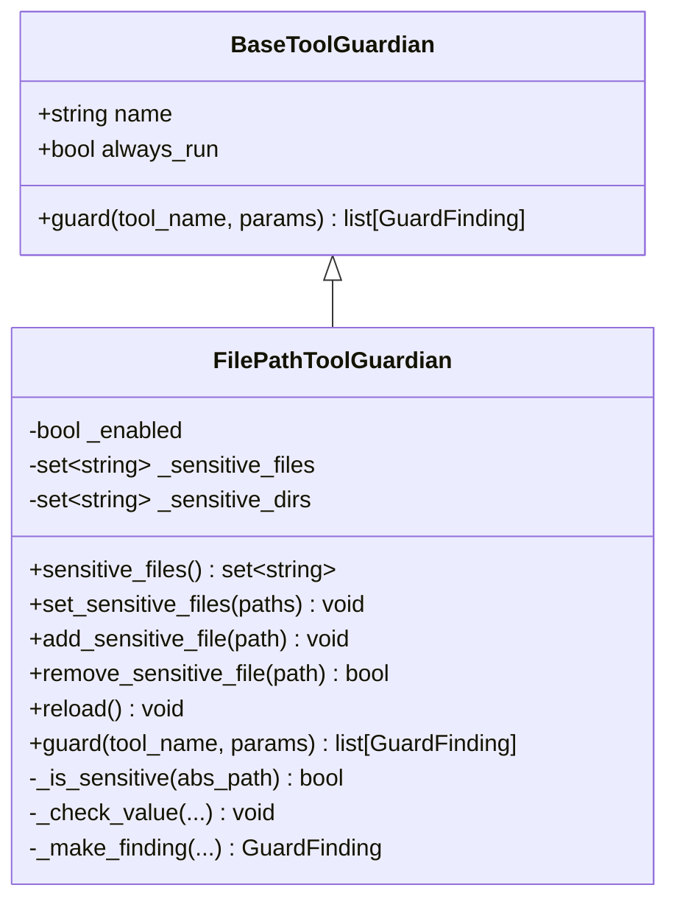
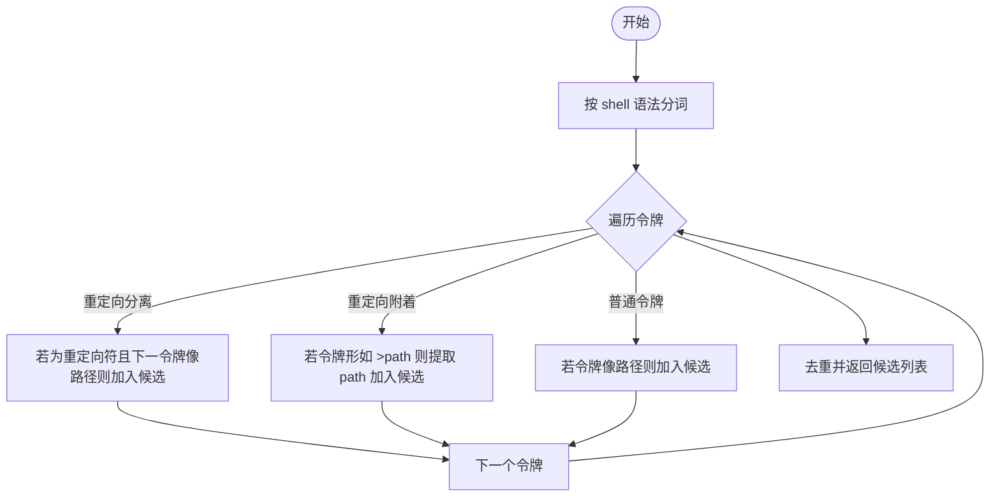
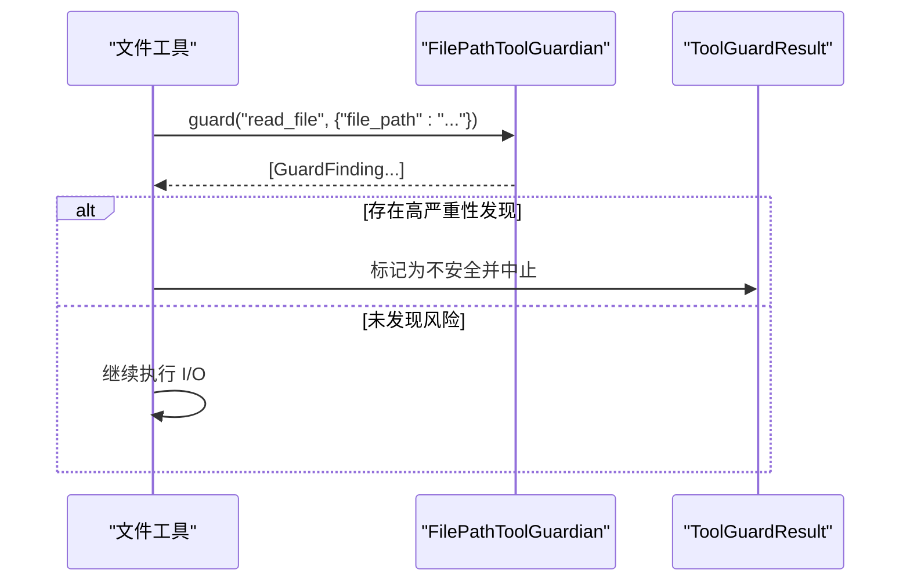
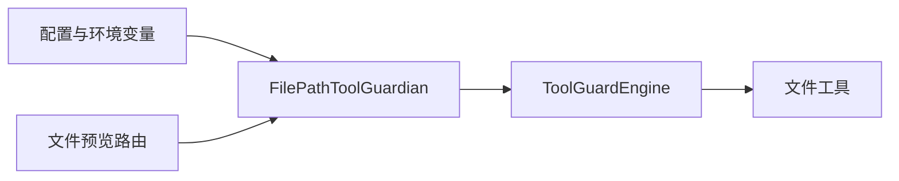

# 文件路径守卫

<cite>
**本文引用的文件**   
- [file_guardian.py](file://src/qwenpaw/security/tool_guard/guardians/file_guardian.py)
- [__init__.py（守护基类）](file://src/qwenpaw/security/tool_guard/guardians/__init__.py)
- [models.py（模型与枚举）](file://src/qwenpaw/security/tool_guard/models.py)
- [engine.py（守卫引擎）](file://src/qwenpaw/security/tool_guard/engine.py)
- [files.py（文件预览路由）](file://src/qwenpaw/app/routers/files.py)
- [file_io.py（文件工具实现）](file://src/qwenpaw/agents/tools/file_io.py)
- [test_file_guardian.py（单元测试）](file://tests/unit/security/tool_guard/guardians/test_file_guardian.py)
- [test_guardian_contract.py（契约测试）](file://tests/contract/security/test_guardian_contract.py)
</cite>

## 目录
1. [简介](#简介)
2. [项目结构](#项目结构)
3. [核心组件](#核心组件)
4. [架构总览](#架构总览)
5. [详细组件分析](#详细组件分析)
6. [依赖关系分析](#依赖关系分析)
7. [性能考量](#性能考量)
8. [故障排查指南](#故障排查指南)
9. [结论](#结论)
10. [附录](#附录)

## 简介
本文件围绕 QwenPaw 的“文件路径守卫”能力，系统性解析 FilePathToolGuardian 的实现原理与使用方式。其目标是：在工具调用前对涉及的文件路径进行安全检查，包括敏感目录检测、相对路径规范化、跨平台路径处理、以及通过白名单机制控制可访问范围。文档同时覆盖配置项、参数与返回值、与其他组件的关系、常见问题及解决方案，并提供面向初学者的渐进式说明与面向资深开发者的技术细节。

## 项目结构
与“文件路径守卫”直接相关的代码分布在安全子系统与工具执行链路中：
- 安全子系统提供统一的守护抽象、数据模型与引擎编排
- 文件路径守卫作为默认守护之一，负责基于路径的安全检查
- 文件工具与 HTTP 预览路由复用该守卫逻辑，形成统一的安全边界

图示来源
- [__init__.py（守护基类）:1-62](file://src/qwenpaw/security/tool_guard/guardians/__init__.py#L1-L62)
- [file_guardian.py:301-501](file://src/qwenpaw/security/tool_guard/guardians/file_guardian.py#L301-L501)
- [engine.py:54-269](file://src/qwenpaw/security/tool_guard/engine.py#L54-L269)
- [models.py:1-185](file://src/qwenpaw/security/tool_guard/models.py#L1-L185)
- [file_io.py:1-468](file://src/qwenpaw/agents/tools/file_io.py#L1-L468)
- [files.py:1-92](file://src/qwenpaw/app/routers/files.py#L1-L92)

章节来源
- [file_guardian.py:1-501](file://src/qwenpaw/security/tool_guard/guardians/file_guardian.py#L1-L501)
- [engine.py:1-269](file://src/qwenpaw/security/tool_guard/engine.py#L1-L269)
- [models.py:1-185](file://src/qwenpaw/security/tool_guard/models.py#L1-L185)
- [file_io.py:1-468](file://src/qwenpaw/agents/tools/file_io.py#L1-L468)
- [files.py:1-92](file://src/qwenpaw/app/routers/files.py#L1-L92)

## 核心组件
- BaseToolGuardian：定义所有守护的统一接口 guard(tool_name, params)，返回发现列表；支持 always_run 标记以强制运行。
- FilePathToolGuardian：基于路径的敏感文件守护，负责：
  - 从配置加载敏感文件/目录集合
  - 规范化并比较路径（POSIX/Windows兼容）
  - 针对 shell 命令提取候选路径
  - 生成 GuardFinding 供上层决策
- ToolGuardEngine：编排多个守护，聚合结果，支持自动拒绝规则与受控工具集。
- GuardFinding / ToolGuardResult：描述单次发现的详情与聚合结果，包含严重级别、类别、建议等。

章节来源
- [__init__.py（守护基类）:17-62](file://src/qwenpaw/security/tool_guard/guardians/__init__.py#L17-L62)
- [file_guardian.py:301-501](file://src/qwenpaw/security/tool_guard/guardians/file_guardian.py#L301-L501)
- [engine.py:54-269](file://src/qwenpaw/security/tool_guard/engine.py#L54-L269)
- [models.py:60-185](file://src/qwenpaw/security/tool_guard/models.py#L60-L185)

## 架构总览
下图展示一次工具调用的守卫流程，以及 FilePathToolGuardian 在其中的作用位置。

图示来源
- [engine.py:200-257](file://src/qwenpaw/security/tool_guard/engine.py#L200-L257)
- [file_guardian.py:449-501](file://src/qwenpaw/security/tool_guard/guardians/file_guardian.py#L449-L501)
- [models.py:103-185](file://src/qwenpaw/security/tool_guard/models.py#L103-L185)

## 详细组件分析

### FilePathToolGuardian 类设计
- 初始化
  - 名称固定为 file_path_tool_guardian，always_run=True，确保在非受控工具集中也能执行路径检查
  - 从配置加载敏感文件/目录集合，合并默认保护目录（含历史兼容目录）
- 敏感集合管理
  - set_sensitive_files：替换当前集合，区分文件与目录两类存储
  - add_sensitive_file/remove_sensitive_file：动态增删
  - sensitive_files 属性：返回去重后的绝对路径集合（文件+目录）
- 路径规范化与匹配
  - _normalize_path：统一 POSIX/Windows 风格，展开用户目录，相对路径基于工作区根解析
  - _is_sensitive：精确文件匹配或目录前缀匹配（考虑分隔符差异）
- Shell 命令路径提取
  - _extract_paths_from_shell_command：基于 shlex 分词，识别分离与附着的重定向操作符，过滤 URL/MIME 前缀，稳定去重
- 守卫入口
  - guard：根据工具名分流到 shell 命令、已知文件工具参数、或全参扫描；生成 GuardFinding 列表

图示来源
- [__init__.py（守护基类）:17-62](file://src/qwenpaw/security/tool_guard/guardians/__init__.py#L17-L62)
- [file_guardian.py:301-501](file://src/qwenpaw/security/tool_guard/guardians/file_guardian.py#L301-L501)

章节来源
- [file_guardian.py:301-501](file://src/qwenpaw/security/tool_guard/guardians/file_guardian.py#L301-L501)

### 路径白名单与安全边界控制
- 白名单来源
  - 配置文件 security.file_guard.sensitive_files
  - 默认保护目录（含 .qwenpaw.secret 与历史 .copaw.secret），保证新安装即具备基础防护
- 相对路径解析
  - 非绝对路径将基于当前工作区根解析，避免越界访问
- 安全边界
  - 文件预览路由在允许预览外部工作区时，仍强制应用敏感路径守卫，确保最小权限原则

章节来源
- [file_guardian.py:157-173](file://src/qwenpaw/security/tool_guard/guardians/file_guardian.py#L157-L173)
- [files.py:24-56](file://src/qwenpaw/app/routers/files.py#L24-L56)

### Shell 命令路径提取算法
- 分词策略
  - 使用 shlex.split，Windows 下禁用 posix 模式以避免反斜杠被当作转义字符丢弃
- 重定向处理
  - 分离形式：如 cat a > out.txt
  - 附着形式：如 >out.txt、2>err.log、<in.txt
- 启发式过滤
  - 忽略 URL 与 MIME 类型前缀，降低误报
- 稳定去重
  - 保持首次出现顺序，避免重复检查

图示来源
- [file_guardian.py:246-298](file://src/qwenpaw/security/tool_guard/guardians/file_guardian.py#L246-L298)

章节来源
- [file_guardian.py:246-298](file://src/qwenpaw/security/tool_guard/guardians/file_guardian.py#L246-L298)

### 与文件工具的集成
- 文件工具（read_file、write_file、edit_file、append_file）内部会解析相对路径至工作区根，再执行 I/O
- 守卫在工具执行前拦截，若命中敏感路径则返回高严重性发现，由上层决定是否阻断

图示来源
- [file_io.py:46-63](file://src/qwenpaw/agents/tools/file_io.py#L46-L63)
- [file_guardian.py:449-501](file://src/qwenpaw/security/tool_guard/guardians/file_guardian.py#L449-L501)
- [engine.py:200-257](file://src/qwenpaw/security/tool_guard/engine.py#L200-L257)

章节来源
- [file_io.py:46-63](file://src/qwenpaw/agents/tools/file_io.py#L46-L63)
- [file_guardian.py:449-501](file://src/qwenpaw/security/tool_guard/guardians/file_guardian.py#L449-L501)
- [engine.py:200-257](file://src/qwenpaw/security/tool_guard/engine.py#L200-L257)

### 与文件预览路由的集成
- 预览路由在返回文件内容前，先复用 FilePathToolGuardian 的敏感路径判断，确保即使允许预览工作区外文件，也不会泄露敏感资源
- 若路径不在工作区内且未开启外部预览，则拒绝访问

章节来源
- [files.py:24-56](file://src/qwenpaw/app/routers/files.py#L24-L56)
- [file_guardian.py:366-392](file://src/qwenpaw/security/tool_guard/guardians/file_guardian.py#L366-L392)

## 依赖关系分析
- 组件耦合
  - FilePathToolGuardian 依赖配置上下文与工作区根，用于相对路径解析
  - ToolGuardEngine 聚合多个守护实例，FilePathToolGuardian 作为默认守护之一
  - 文件预览路由直接复用 FilePathToolGuardian 的内部方法，形成跨模块安全复用
- 外部依赖
  - 配置加载：security.file_guard.enabled、security.file_guard.sensitive_files、allow_preview_outside_workspace
  - 环境变量：QWENPAW_TOOL_GUARD_ENABLED 可全局启用/禁用守卫

图示来源
- [engine.py:36-52](file://src/qwenpaw/security/tool_guard/engine.py#L36-L52)
- [file_guardian.py:147-173](file://src/qwenpaw/security/tool_guard/guardians/file_guardian.py#L147-L173)
- [files.py:24-56](file://src/qwenpaw/app/routers/files.py#L24-L56)

章节来源
- [engine.py:36-52](file://src/qwenpaw/security/tool_guard/engine.py#L36-L52)
- [file_guardian.py:147-173](file://src/qwenpaw/security/tool_guard/guardians/file_guardian.py#L147-L173)
- [files.py:24-56](file://src/qwenpaw/app/routers/files.py#L24-L56)

## 性能考量
- 路径规范化与匹配采用字符串前缀匹配，时间复杂度近似 O(N)（N 为敏感目录数量），适合中小规模配置
- Shell 命令解析使用标准库分词，异常情况下回退为简单 split，保证鲁棒性
- 守卫引擎支持 only_always_run 模式，可在非受控工具集中仅运行 FilePathToolGuardian，减少开销

章节来源
- [file_guardian.py:246-298](file://src/qwenpaw/security/tool_guard/guardians/file_guardian.py#L246-L298)
- [engine.py:200-257](file://src/qwenpaw/security/tool_guard/engine.py#L200-L257)

## 故障排查指南
- 问题：守卫未生效
  - 检查 security.tool_guard.enabled 与 QWENPAW_TOOL_GUARD_ENABLED 是否关闭
  - 确认 security.file_guard.enabled 是否为 True
- 问题：误报/漏报
  - 核对敏感文件/目录配置是否正确，注意末尾分隔符会被视为目录
  - Windows 路径大小写与分隔符已通过规范化处理，确认输入格式
- 问题：shell 命令中的路径未被识别
  - 检查重定向写法是否符合分离或附着形式
  - 确认令牌不以 URL/MIME 前缀开头
- 问题：预览路由 403/404/500
  - 403：命中敏感文件或超出工作区（未开启外部预览）
  - 404：目标不是文件
  - 500：无读权限

章节来源
- [engine.py:36-52](file://src/qwenpaw/security/tool_guard/engine.py#L36-L52)
- [file_guardian.py:147-173](file://src/qwenpaw/security/tool_guard/guardians/file_guardian.py#L147-L173)
- [files.py:83-91](file://src/qwenpaw/app/routers/files.py#L83-L91)

## 结论
FilePathToolGuardian 通过配置驱动的白名单机制、跨平台路径规范化与严格的目录前缀匹配，为工具调用与文件预览提供了坚实的安全边界。结合 ToolGuardEngine 的编排能力，系统能够在不同场景下灵活启用路径级防护，既满足易用性，又保障安全性。

## 附录

### 配置选项与行为
- security.tool_guard.enabled：全局开关（优先级高于环境变量）
- QWENPAW_TOOL_GUARD_ENABLED：环境变量，true/1/yes 表示启用
- security.file_guard.enabled：文件路径守卫开关
- security.file_guard.sensitive_files：敏感文件/目录列表（空列表时回退默认保护目录）
- security.file_guard.allow_preview_outside_workspace：允许预览工作区外文件（但仍受敏感路径守卫约束）

章节来源
- [engine.py:36-52](file://src/qwenpaw/security/tool_guard/engine.py#L36-L52)
- [file_guardian.py:147-173](file://src/qwenpaw/security/tool_guard/guardians/file_guardian.py#L147-L173)
- [files.py:24-33](file://src/qwenpaw/app/routers/files.py#L24-L33)

### 关键接口与返回值
- BaseToolGuardian.guard(tool_name, params) -> list[GuardFinding]
- FilePathToolGuardian.sensitive_files -> set[str]
- FilePathToolGuardian.set_sensitive_files(paths) -> None
- FilePathToolGuardian.add_sensitive_file(path) -> None
- FilePathToolGuardian.remove_sensitive_file(path) -> bool
- ToolGuardEngine.guard(tool_name, params, only_always_run=False) -> ToolGuardResult | None

章节来源
- [__init__.py（守护基类）:34-54](file://src/qwenpaw/security/tool_guard/guardians/__init__.py#L34-L54)
- [file_guardian.py:318-364](file://src/qwenpaw/security/tool_guard/guardians/file_guardian.py#L318-L364)
- [engine.py:200-257](file://src/qwenpaw/security/tool_guard/engine.py#L200-L257)
- [models.py:103-185](file://src/qwenpaw/security/tool_guard/models.py#L103-L185)

### 使用示例（来自测试）
- 构造守卫并验证默认启用与名称
  - 参考：[test_file_guardian.py:321-356](file://tests/unit/security/tool_guard/guardians/test_file_guardian.py#L321-L356)
- 添加敏感文件后，read_file 命中并返回高严重性发现
  - 参考：[test_file_guardian.py:493-501](file://tests/unit/security/tool_guard/guardians/test_file_guardian.py#L493-L501)
- execute_shell_command 中包含敏感路径应触发发现
  - 参考：[test_file_guardian.py:525-537](file://tests/unit/security/tool_guard/guardians/test_file_guardian.py#L525-L537)
- 契约测试验证 guard 返回类型与字段完整性
  - 参考：[test_guardian_contract.py:187-214](file://tests/contract/security/test_guardian_contract.py#L187-L214)

章节来源
- [test_file_guardian.py:321-537](file://tests/unit/security/tool_guard/guardians/test_file_guardian.py#L321-L537)
- [test_guardian_contract.py:187-214](file://tests/contract/security/test_guardian_contract.py#L187-L214)