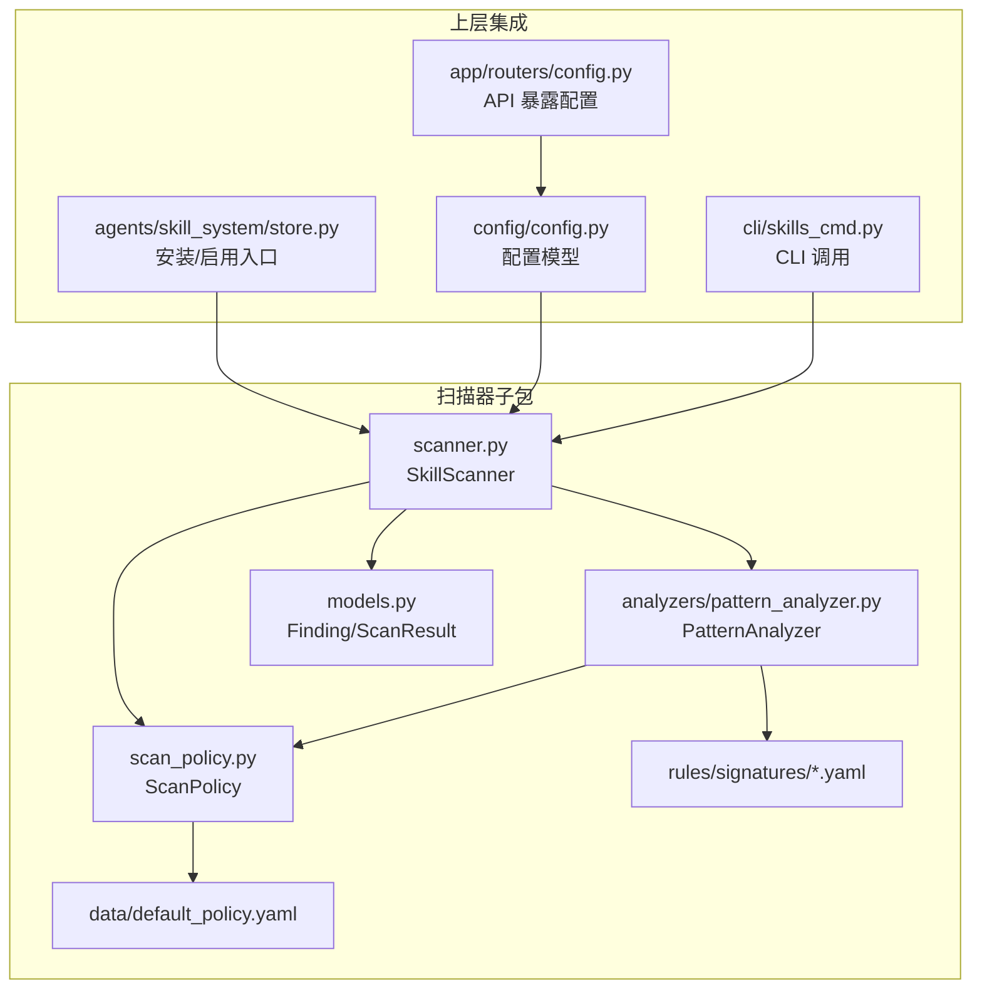
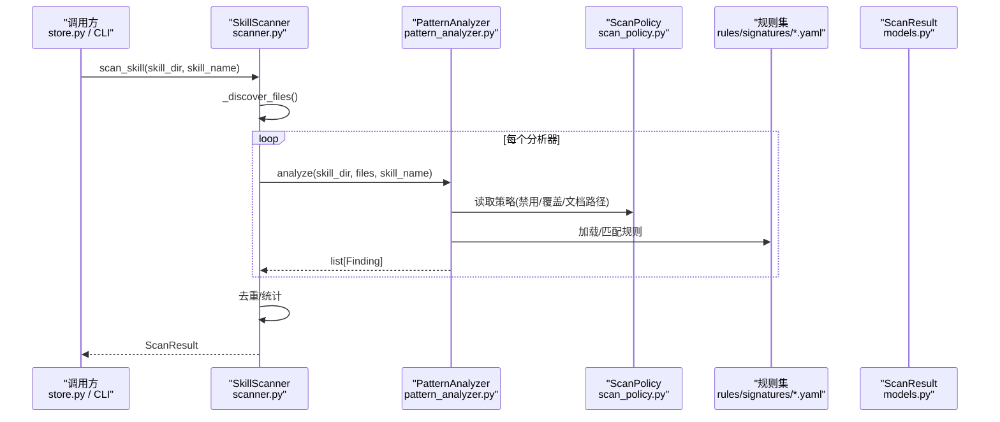
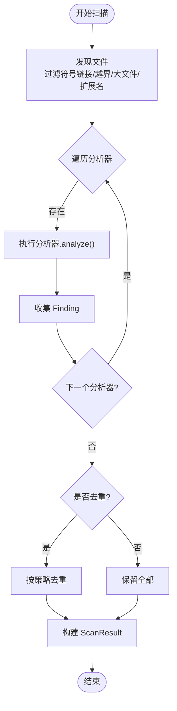
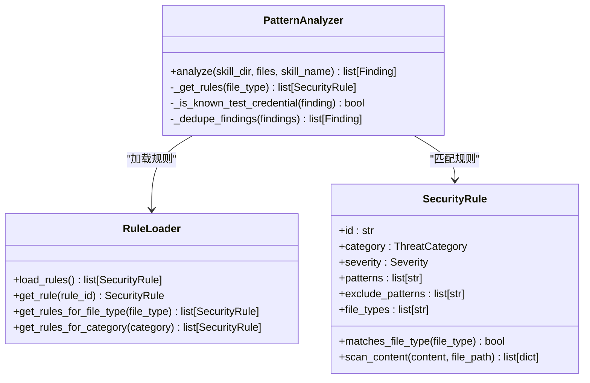
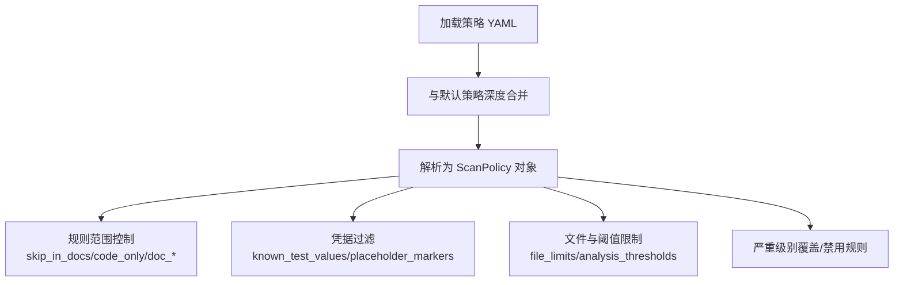
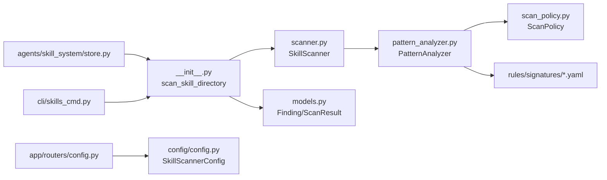
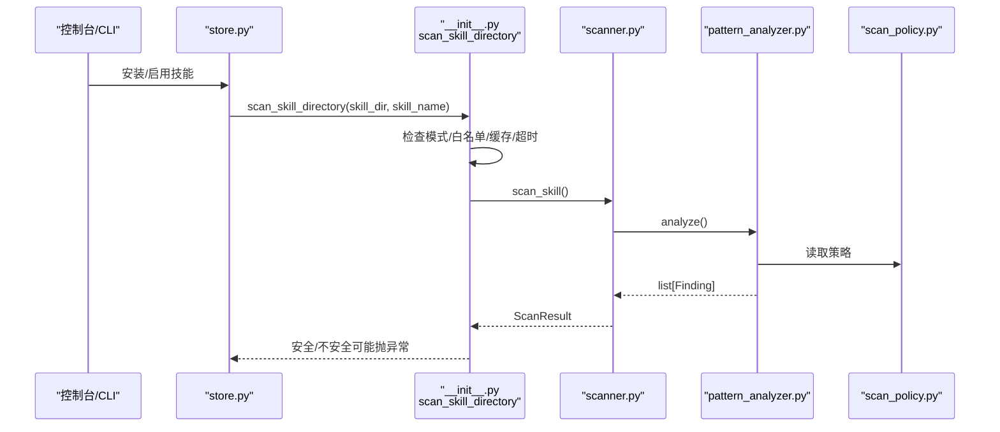

# 技能扫描器

<cite>
**本文引用的文件**   
- [security/__init__.py](file://src/qwenpaw/security/__init__.py)
- [skill_scanner/__init__.py](file://src/qwenpaw/security/skill_scanner/__init__.py)
- [skill_scanner/scanner.py](file://src/qwenpaw/security/skill_scanner/scanner.py)
- [skill_scanner/models.py](file://src/qwenpaw/security/skill_scanner/models.py)
- [skill_scanner/scan_policy.py](file://src/qwenpaw/security/skill_scanner/scan_policy.py)
- [skill_scanner/data/default_policy.yaml](file://src/qwenpaw/security/skill_scanner/data/default_policy.yaml)
- [skill_scanner/rules/signatures/command_injection.yaml](file://src/qwenpaw/security/skill_scanner/rules/signatures/command_injection.yaml)
- [skill_scanner/rules/signatures/hardcoded_secrets.yaml](file://src/qwenpaw/security/skill_scanner/rules/signatures/hardcoded_secrets.yaml)
- [skill_scanner/analyzers/pattern_analyzer.py](file://src/qwenpaw/security/skill_scanner/analyzers/pattern_analyzer.py)
- [agents/skill_system/store.py](file://src/qwenpaw/agents/skill_system/store.py)
- [app/routers/config.py](file://src/qwenpaw/app/routers/config.py)
- [config/config.py](file://src/qwenpaw/config/config.py)
- [cli/skills_cmd.py](file://src/qwenpaw/cli/skills_cmd.py)
</cite>

## 目录
1. [简介](#简介)
2. [项目结构](#项目结构)
3. [核心组件](#核心组件)
4. [架构总览](#架构总览)
5. [详细组件分析](#详细组件分析)
6. [依赖关系分析](#依赖关系分析)
7. [性能与可扩展性](#性能与可扩展性)
8. [配置与策略](#配置与策略)
9. [使用模式与调用关系](#使用模式与调用关系)
10. [常见问题与排障](#常见问题与排障)
11. [结论](#结论)

## 简介
本章节面向 QwenPaw 的“技能安全扫描器”，聚焦于在安装或激活技能包之前的静态安全检查。其目标包括：
- 基于 YAML 规则进行模式匹配分析，覆盖命令注入、硬编码密钥、数据外泄等常见风险。
- 通过动态策略加载（ScanPolicy）实现组织级白名单、规则范围控制、严重级别覆盖等。
- 生成结构化扫描报告（ScanResult），并支持阻断/告警两种处置模式。
- 提供缓存、超时、历史阻断记录等工程化能力，确保在生产环境稳定可用。

该模块与技能系统、控制台 API、CLI 工具紧密集成，贯穿“安装/启用”的关键路径。

## 项目结构
技能扫描器位于 security/skill_scanner 子包，采用“编排器 + 分析器 + 策略 + 模型”的分层设计：
- 编排器：SkillScanner，负责发现文件、调度分析器、聚合结果。
- 分析器：PatternAnalyzer（YAML 签名匹配），可插拔扩展更多分析器。
- 策略：ScanPolicy，从 YAML 动态加载，控制规则范围、忽略项、阈值等。
- 模型：Finding、ScanResult、ThreatCategory、Severity 等数据结构。
- 规则集：rules/signatures/*.yaml，定义具体检测规则。
- 默认策略：data/default_policy.yaml，内置平衡策略。

图表来源
- [skill_scanner/scanner.py:76-147](file://src/qwenpaw/security/skill_scanner/scanner.py#L76-L147)
- [skill_scanner/analyzers/pattern_analyzer.py:236-259](file://src/qwenpaw/security/skill_scanner/analyzers/pattern_analyzer.py#L236-L259)
- [skill_scanner/scan_policy.py:156-177](file://src/qwenpaw/security/skill_scanner/scan_policy.py#L156-L177)
- [skill_scanner/models.py:168-235](file://src/qwenpaw/security/skill_scanner/models.py#L168-L235)
- [skill_scanner/data/default_policy.yaml:1-243](file://src/qwenpaw/security/skill_scanner/data/default_policy.yaml#L1-L243)
- [skill_scanner/rules/signatures/command_injection.yaml:1-195](file://src/qwenpaw/security/skill_scanner/rules/signatures/command_injection.yaml#L1-L195)
- [skill_scanner/rules/signatures/hardcoded_secrets.yaml:1-150](file://src/qwenpaw/security/skill_scanner/rules/signatures/hardcoded_secrets.yaml#L1-L150)
- [agents/skill_system/store.py:26-26](file://src/qwenpaw/agents/skill_system/store.py#L26-L26)
- [app/routers/config.py:918-933](file://src/qwenpaw/app/routers/config.py#L918-L933)
- [config/config.py:2029-2075](file://src/qwenpaw/config/config.py#L2029-L2075)
- [cli/skills_cmd.py:30-30](file://src/qwenpaw/cli/skills_cmd.py#L30-L30)

章节来源
- [security/__init__.py:1-21](file://src/qwenpaw/security/__init__.py#L1-L21)
- [skill_scanner/__init__.py:1-77](file://src/qwenpaw/security/skill_scanner/__init__.py#L1-L77)

## 核心组件
- SkillScanner（编排器）
  - 职责：遍历技能目录、过滤文件、执行分析器、去重、汇总 ScanResult。
  - 关键参数：policy、skip_extensions、max_files、max_file_size。
  - 关键方法：register_analyzer、scan_skill。
- PatternAnalyzer（模式分析器）
  - 职责：加载 YAML 规则，按文件类型路由，逐行与多行正则匹配，输出 Finding。
  - 关键特性：支持 exclude_patterns、文档路径跳过、代码类规则限定、已知测试凭据过滤、重复项去重。
- ScanPolicy（扫描策略）
  - 职责：从 YAML 合并默认策略，提供规则禁用、严重级别覆盖、文档路径识别、文件分类、阈值限制等。
  - 关键方法：from_yaml、default、is_rule_disabled、get_severity_override、is_doc_path。
- 数据模型
  - Finding：单条发现，包含 id、rule_id、category、severity、title、description、file_path、line_number、snippet、remediation、analyzer、metadata。
  - ScanResult：聚合结果，包含 skill_name、findings、scan_duration_seconds、analyzers_used、analyzers_failed、timestamp，以及 is_safe、max_severity 等便捷属性。
  - ThreatCategory、Severity：枚举类型，用于分类和严重级别。

章节来源
- [skill_scanner/scanner.py:76-147](file://src/qwenpaw/security/skill_scanner/scanner.py#L76-L147)
- [skill_scanner/analyzers/pattern_analyzer.py:236-393](file://src/qwenpaw/security/skill_scanner/analyzers/pattern_analyzer.py#L236-L393)
- [skill_scanner/scan_policy.py:156-177](file://src/qwenpaw/security/skill_scanner/scan_policy.py#L156-L177)
- [skill_scanner/models.py:168-235](file://src/qwenpaw/security/skill_scanner/models.py#L168-L235)

## 架构总览
下图展示扫描流程与关键交互：上层入口触发扫描，扫描器发现文件并调度分析器，分析器依据策略与规则集产出发现，最终由编排器汇总并返回结果。

图表来源
- [skill_scanner/scanner.py:148-242](file://src/qwenpaw/security/skill_scanner/scanner.py#L148-L242)
- [skill_scanner/analyzers/pattern_analyzer.py:265-347](file://src/qwenpaw/security/skill_scanner/analyzers/pattern_analyzer.py#L265-L347)
- [skill_scanner/scan_policy.py:261-281](file://src/qwenpaw/security/skill_scanner/scan_policy.py#L261-L281)
- [skill_scanner/models.py:168-235](file://src/qwenpaw/security/skill_scanner/models.py#L168-L235)

## 详细组件分析

### 编排器 SkillScanner
- 文件发现与安全边界
  - 递归遍历目录，跳过符号链接，校验真实路径在技能目录内，避免路径穿越攻击。
  - 根据策略的文件分类与扩展名集合跳过无意义文件（图片、字体、归档、二进制等）。
  - 限制最大文件数与单个文件大小，防止资源耗尽。
- 分析器调度与容错
  - 逐个执行分析器，捕获异常并记录失败信息，不影响其他分析器运行。
  - 支持运行时注册新分析器（如未来 LLM 分析器）。
- 结果聚合
  - 可选的去重逻辑（基于 policy 开关），统计耗时、分析器使用情况与失败情况。
  - 返回 ScanResult，供上层判断是否阻断。

图表来源
- [skill_scanner/scanner.py:248-299](file://src/qwenpaw/security/skill_scanner/scanner.py#L248-L299)
- [skill_scanner/scanner.py:194-242](file://src/qwenpaw/security/skill_scanner/scanner.py#L194-L242)

章节来源
- [skill_scanner/scanner.py:76-147](file://src/qwenpaw/security/skill_scanner/scanner.py#L76-L147)
- [skill_scanner/scanner.py:148-242](file://src/qwenpaw/security/skill_scanner/scanner.py#L148-L242)
- [skill_scanner/scanner.py:248-299](file://src/qwenpaw/security/skill_scanner/scanner.py#L248-L299)

### 模式分析器 PatternAnalyzer
- 规则加载与索引
  - 从 rules/signatures/*.yaml 加载规则列表，按 category 与 file_type 建立索引。
  - 编译正则表达式，记录非法或超长规则的警告。
- 匹配流程
  - 先进行逐行匹配（快速路径），再对含换行的模式进行全文匹配（多行路径）。
  - 支持 exclude_patterns 排除误报。
- 策略联动
  - 根据策略禁用规则、应用严重级别覆盖、在文档路径下跳过特定规则、仅对代码文件触发某些规则。
  - 过滤已知测试凭据（如示例 key、占位符标记）。
  - 支持重复项去重（相同 rule_id + 文件 + 行号）。

图表来源
- [skill_scanner/analyzers/pattern_analyzer.py:236-393](file://src/qwenpaw/security/skill_scanner/analyzers/pattern_analyzer.py#L236-L393)
- [skill_scanner/analyzers/pattern_analyzer.py:38-156](file://src/qwenpaw/security/skill_scanner/analyzers/pattern_analyzer.py#L38-L156)
- [skill_scanner/analyzers/pattern_analyzer.py:163-229](file://src/qwenpaw/security/skill_scanner/analyzers/pattern_analyzer.py#L163-L229)

章节来源
- [skill_scanner/analyzers/pattern_analyzer.py:236-393](file://src/qwenpaw/security/skill_scanner/analyzers/pattern_analyzer.py#L236-L393)

### 策略 ScanPolicy
- 动态加载与合并
  - from_yaml 将用户自定义策略与内置默认策略深度合并，用户只需声明需要覆盖的部分。
  - default 直接加载内置默认策略；preset_names/from_preset 支持预设策略。
- 规则范围控制
  - skip_in_docs：在文档路径下跳过的规则 ID。
  - code_only：仅对代码文件触发的规则 ID。
  - doc_path_indicators/doc_filename_patterns：标识文档路径与文件名模式。
  - dedupe_duplicate_findings：是否对重复发现进行去重。
- 凭据与阈值
  - credentials.known_test_values/placeholder_markers：自动抑制已知测试值与占位符。
  - analysis_thresholds.max_regex_pattern_length：保护正则长度上限。
- 严重级别覆盖与禁用
  - severity_overrides：针对特定 rule_id 调整严重级别。
  - disabled_rules：完全禁用的规则 ID 集合。

图表来源
- [skill_scanner/scan_policy.py:261-281](file://src/qwenpaw/security/skill_scanner/scan_policy.py#L261-L281)
- [skill_scanner/scan_policy.py:156-177](file://src/qwenpaw/security/skill_scanner/scan_policy.py#L156-L177)
- [skill_scanner/scan_policy.py:336-397](file://src/qwenpaw/security/skill_scanner/scan_policy.py#L336-L397)

章节来源
- [skill_scanner/scan_policy.py:156-177](file://src/qwenpaw/security/skill_scanner/scan_policy.py#L156-L177)
- [skill_scanner/scan_policy.py:261-281](file://src/qwenpaw/security/skill_scanner/scan_policy.py#L261-L281)
- [skill_scanner/scan_policy.py:336-397](file://src/qwenpaw/security/skill_scanner/scan_policy.py#L336-L397)

### 数据模型与报告
- Finding
  - 字段：id、rule_id、category、severity、title、description、file_path、line_number、snippet、remediation、analyzer、metadata。
  - to_dict：序列化便于存储与展示。
- ScanResult
  - 字段：skill_name、skill_directory、findings、scan_duration_seconds、analyzers_used、analyzers_failed、timestamp。
  - 便捷属性：is_safe（无 CRITICAL/HIGH 即为安全）、max_severity（最高严重级别）。
  - to_dict：包含 findings_count、analyzers_failed（可选）等。

章节来源
- [skill_scanner/models.py:129-161](file://src/qwenpaw/security/skill_scanner/models.py#L129-L161)
- [skill_scanner/models.py:168-235](file://src/qwenpaw/security/skill_scanner/models.py#L168-L235)

## 依赖关系分析
- 内部依赖
  - scanner.py 依赖 models.py、scan_policy.py、analyzers.pattern_analyzer.py。
  - pattern_analyzer.py 依赖 models.py、scan_policy.py 与规则集 YAML。
  - __init__.py 提供高层 API（scan_skill_directory）、白名单、历史记录、缓存、超时控制。
- 外部集成
  - agents/skill_system/store.py 在安装/启用技能时调用 scan_skill_directory。
  - app/routers/config.py 暴露配置接口（SkillScannerConfig、白名单条目）。
  - config/config.py 定义配置模型（SkillScannerWhitelistEntry、SkillScannerConfig）。
  - cli/skills_cmd.py 在 CLI 中调用扫描器。

图表来源
- [agents/skill_system/store.py:26-26](file://src/qwenpaw/agents/skill_system/store.py#L26-L26)
- [skill_scanner/__init__.py:397-486](file://src/qwenpaw/security/skill_scanner/__init__.py#L397-L486)
- [skill_scanner/scanner.py:76-147](file://src/qwenpaw/security/skill_scanner/scanner.py#L76-L147)
- [skill_scanner/analyzers/pattern_analyzer.py:236-259](file://src/qwenpaw/security/skill_scanner/analyzers/pattern_analyzer.py#L236-L259)
- [skill_scanner/scan_policy.py:156-177](file://src/qwenpaw/security/skill_scanner/scan_policy.py#L156-L177)
- [app/routers/config.py:918-933](file://src/qwenpaw/app/routers/config.py#L918-L933)
- [config/config.py:2029-2075](file://src/qwenpaw/config/config.py#L2029-L2075)
- [cli/skills_cmd.py:30-30](file://src/qwenpaw/cli/skills_cmd.py#L30-L30)

章节来源
- [skill_scanner/__init__.py:397-486](file://src/qwenpaw/security/skill_scanner/__init__.py#L397-L486)
- [skill_scanner/scanner.py:76-147](file://src/qwenpaw/security/skill_scanner/scanner.py#L76-L147)
- [skill_scanner/analyzers/pattern_analyzer.py:236-259](file://src/qwenpaw/security/skill_scanner/analyzers/pattern_analyzer.py#L236-L259)
- [skill_scanner/scan_policy.py:156-177](file://src/qwenpaw/security/skill_scanner/scan_policy.py#L156-L177)
- [agents/skill_system/store.py:26-26](file://src/qwenpaw/agents/skill_system/store.py#L26-L26)
- [app/routers/config.py:918-933](file://src/qwenpaw/app/routers/config.py#L918-L933)
- [config/config.py:2029-2075](file://src/qwenpaw/config/config.py#L2029-L2075)
- [cli/skills_cmd.py:30-30](file://src/qwenpaw/cli/skills_cmd.py#L30-L30)

## 性能与可扩展性
- 性能优化
  - 文件发现阶段跳过符号链接与大文件，限制最大文件数量，避免内存与 IO 压力。
  - 分析器缓存规则索引（按文件类型），减少重复计算。
  - 扫描结果 mtime 缓存，避免重复扫描未变更目录。
  - 线程池执行扫描并设置超时，防止长时间阻塞。
- 可扩展性
  - 分析器接口 BaseAnalyzer 允许后续接入 LLM 分析器或其他静态分析引擎。
  - 策略 YAML 支持组织级定制，无需修改源码即可调整规则范围与阈值。

章节来源
- [skill_scanner/scanner.py:248-299](file://src/qwenpaw/security/skill_scanner/scanner.py#L248-L299)
- [skill_scanner/analyzers/pattern_analyzer.py:386-393](file://src/qwenpaw/security/skill_scanner/analyzers/pattern_analyzer.py#L386-L393)
- [skill_scanner/__init__.py:337-390](file://src/qwenpaw/security/skill_scanner/__init__.py#L337-L390)
- [skill_scanner/__init__.py:453-468](file://src/qwenpaw/security/skill_scanner/__init__.py#L453-L468)

## 配置与策略
- 扫描模式与超时
  - 模式优先级：环境变量 QWENPAW_SKILL_SCAN_MODE > 配置 > 默认 block。
  - 超时：可从配置读取，默认 30 秒。
- 白名单
  - 支持按 skill_name 与 content_hash 精确放行，避免误判影响生产。
- 历史记录
  - 阻断/告警记录持久化到工作目录下的 JSON 文件，支持查询、清空、删除单条记录。
- 策略 YAML
  - 默认策略 balanced，可通过 from_yaml 加载组织策略并覆盖默认。
  - 支持规则禁用、严重级别覆盖、文档路径识别、凭据过滤、文件分类与阈值。

章节来源
- [skill_scanner/__init__.py:87-116](file://src/qwenpaw/security/skill_scanner/__init__.py#L87-L116)
- [skill_scanner/__init__.py:143-169](file://src/qwenpaw/security/skill_scanner/__init__.py#L143-L169)
- [skill_scanner/__init__.py:241-312](file://src/qwenpaw/security/skill_scanner/__init__.py#L241-L312)
- [skill_scanner/scan_policy.py:261-281](file://src/qwenpaw/security/skill_scanner/scan_policy.py#L261-L281)
- [skill_scanner/data/default_policy.yaml:1-243](file://src/qwenpaw/security/skill_scanner/data/default_policy.yaml#L1-L243)

## 使用模式与调用关系
- 安装/启用技能
  - store.py 在安装或启用技能前调用 scan_skill_directory，若结果为不安全且处于阻断模式，则抛出异常阻止继续。
- CLI 调用
  - skills_cmd.py 在 CLI 中调用扫描器，支持指定超时与阻断行为。
- 控制台 API
  - config.py 暴露获取/更新 SkillScannerConfig 的接口，支持白名单管理。

图表来源
- [agents/skill_system/store.py:968-968](file://src/qwenpaw/agents/skill_system/store.py#L968-L968)
- [skill_scanner/__init__.py:397-486](file://src/qwenpaw/security/skill_scanner/__init__.py#L397-L486)
- [skill_scanner/scanner.py:148-242](file://src/qwenpaw/security/skill_scanner/scanner.py#L148-L242)
- [skill_scanner/analyzers/pattern_analyzer.py:265-347](file://src/qwenpaw/security/skill_scanner/analyzers/pattern_analyzer.py#L265-L347)
- [skill_scanner/scan_policy.py:261-281](file://src/qwenpaw/security/skill_scanner/scan_policy.py#L261-L281)

章节来源
- [agents/skill_system/store.py:968-968](file://src/qwenpaw/agents/skill_system/store.py#L968-L968)
- [cli/skills_cmd.py:146-146](file://src/qwenpaw/cli/skills_cmd.py#L146-L146)
- [app/routers/config.py:918-933](file://src/qwenpaw/app/routers/config.py#L918-L933)

## 常见问题与排障
- 扫描被阻断但确认为误报
  - 解决方案：将技能加入白名单（支持按名称与内容哈希），或在策略中禁用相关规则/降低严重级别。
  - 参考：白名单与历史记录机制。
- 扫描超时
  - 解决方案：增大超时时间或优化策略（减少规则数量、扩大跳过扩展名集合）。
  - 参考：scan_skill_directory 的超时处理。
- 规则过于敏感导致大量告警
  - 解决方案：在策略中启用 skip_in_docs、code_only 等范围控制，或使用 severity_overrides 调整级别。
  - 参考：ScanPolicy 的规则范围与覆盖。
- 误报来自示例/测试代码
  - 解决方案：利用 credentials.known_test_values 与 placeholder_markers 过滤，或在规则 exclude_patterns 中添加排除。
  - 参考：PatternAnalyzer 的凭据过滤与规则排除。
- 无法定位问题根因
  - 解决方案：查看扫描历史（blocked history），结合 ScanResult.to_dict 中的 findings 详情与 matched_text 进行排查。
  - 参考：历史记录与模型序列化。

章节来源
- [skill_scanner/__init__.py:143-169](file://src/qwenpaw/security/skill_scanner/__init__.py#L143-L169)
- [skill_scanner/__init__.py:453-468](file://src/qwenpaw/security/skill_scanner/__init__.py#L453-L468)
- [skill_scanner/scan_policy.py:156-177](file://src/qwenpaw/security/skill_scanner/scan_policy.py#L156-L177)
- [skill_scanner/analyzers/pattern_analyzer.py:338-364](file://src/qwenpaw/security/skill_scanner/analyzers/pattern_analyzer.py#L338-L364)
- [skill_scanner/models.py:220-235](file://src/qwenpaw/security/skill_scanner/models.py#L220-L235)

## 结论
QwenPaw 的技能扫描器以轻量可扩展的架构实现了高效的静态安全扫描。通过 YAML 规则与动态策略的结合，既能保证开箱即用的安全性，又能为组织提供灵活的定制能力。配合缓存、超时、白名单与历史记录等工程化手段，扫描器在生产环境中具备高可用性与可运维性。建议在实际部署中：
- 明确扫描模式（block/warn/off）与超时策略。
- 使用策略 YAML 精细化控制规则范围与严重级别。
- 定期审查扫描历史与误报，持续优化规则与策略。
- 在 CI/CD 中集成扫描，提前拦截高风险技能。