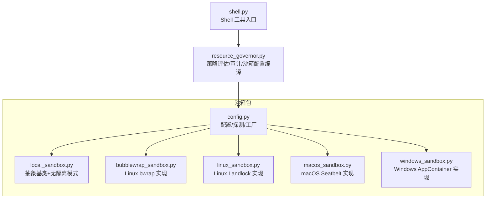
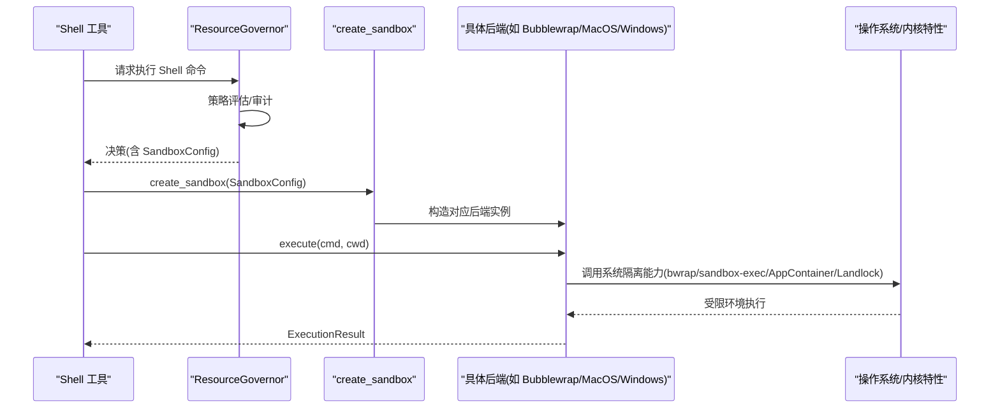
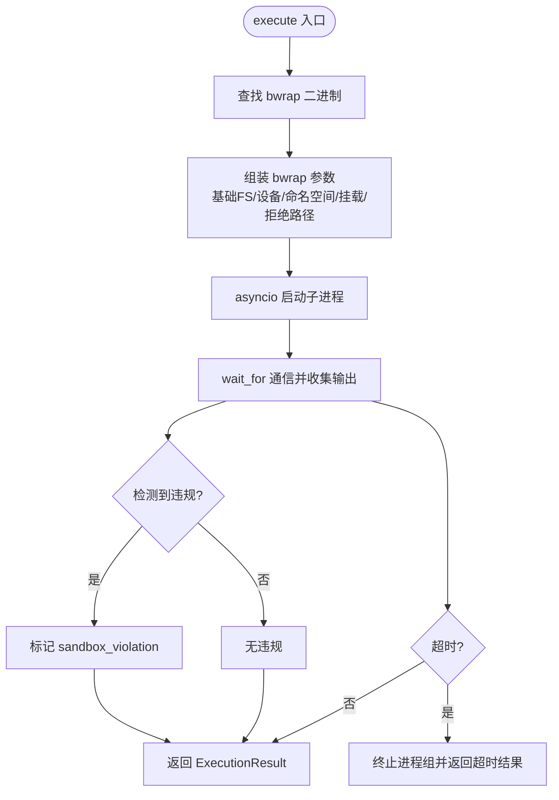
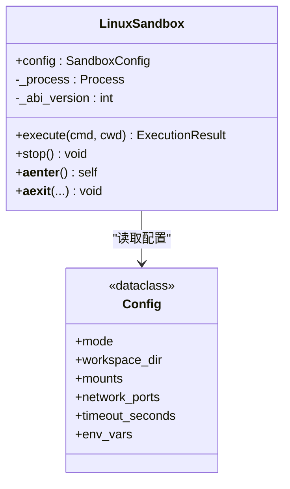
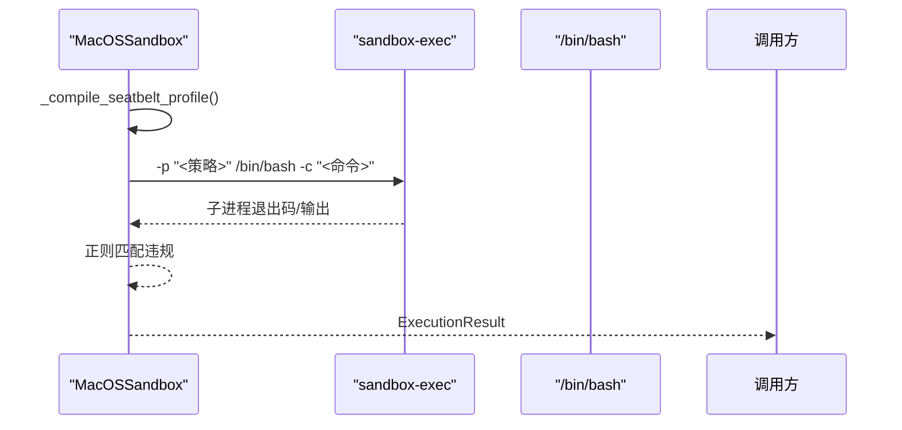
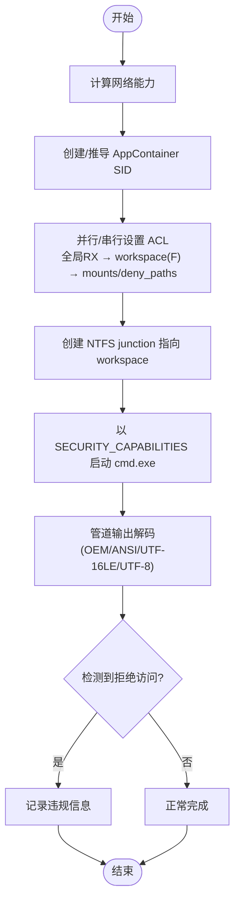
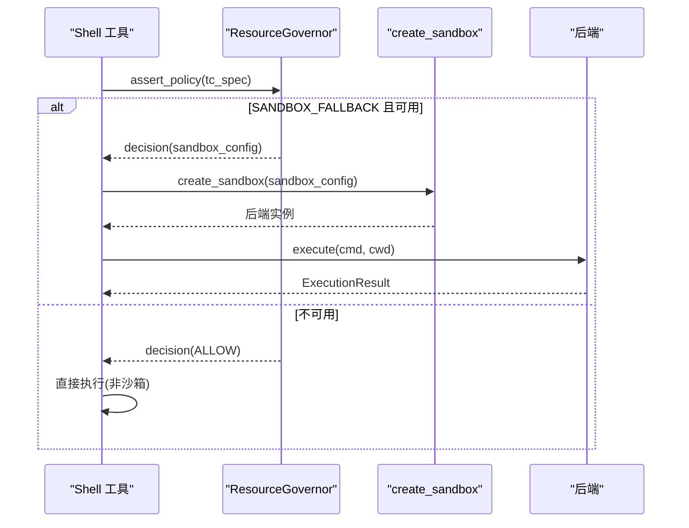
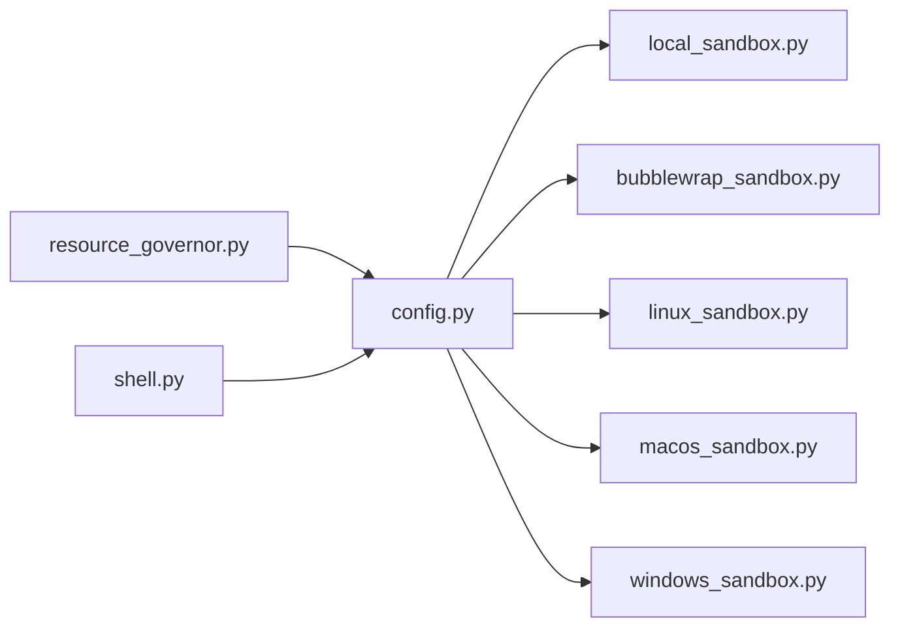

# 沙箱机制

<cite>
**本文引用的文件列表**
- [sandbox/__init__.py](file://src/qwenpaw/sandbox/__init__.py)
- [sandbox/config.py](file://src/qwenpaw/sandbox/config.py)
- [sandbox/local_sandbox.py](file://src/qwenpaw/sandbox/local_sandbox.py)
- [sandbox/bubblewrap_sandbox.py](file://src/qwenpaw/sandbox/bubblewrap_sandbox.py)
- [sandbox/macos_sandbox.py](file://src/qwenpaw/sandbox/macos_sandbox.py)
- [sandbox/windows_sandbox.py](file://src/qwenpaw/sandbox/windows_sandbox.py)
- [sandbox/linux_sandbox.py](file://src/qwenpaw/sandbox/linux_sandbox.py)
- [governance/resource_governor.py](file://src/qwenpaw/governance/resource_governor.py)
- [agents/tools/shell.py](file://src/qwenpaw/agents/tools/shell.py)
</cite>

## 目录
1. [简介](#简介)
2. [项目结构](#项目结构)
3. [核心组件](#核心组件)
4. [架构总览](#架构总览)
5. [详细组件分析](#详细组件分析)
6. [依赖关系分析](#依赖关系分析)
7. [性能与资源限制](#性能与资源限制)
8. [故障排查指南](#故障排查指南)
9. [结论](#结论)
10. [附录：配置项与接口速查](#附录配置项与接口速查)

## 简介
本文件系统性梳理 QwenPaw 的沙箱机制，覆盖跨平台实现、内核级隔离、资源限制与进程隔离。重点说明 Linux bubblewrap、macOS Seatbelt（sandbox-exec）与 Windows AppContainer 的差异化实现，并给出调用关系、领域模型、使用模式、配置选项、参数与返回值，以及与治理策略和工具执行层的集成方式。文档兼顾初学者可读性与资深开发者的技术深度。

## 项目结构
沙箱子系统位于 src/qwenpaw/sandbox，提供统一抽象与多后端实现；治理层在 governance 中负责策略评估与沙箱配置编译；工具层 shell 工具在需要时通过沙箱执行命令。

图表来源
- [sandbox/config.py:1-120](file://src/qwenpaw/sandbox/config.py#L1-L120)
- [sandbox/local_sandbox.py:1-64](file://src/qwenpaw/sandbox/local_sandbox.py#L1-L64)
- [sandbox/bubblewrap_sandbox.py:1-78](file://src/qwenpaw/sandbox/bubblewrap_sandbox.py#L1-L78)
- [sandbox/linux_sandbox.py:1-112](file://src/qwenpaw/sandbox/linux_sandbox.py#L1-L112)
- [sandbox/macos_sandbox.py:1-63](file://src/qwenpaw/sandbox/macos_sandbox.py#L1-L63)
- [sandbox/windows_sandbox.py:1-85](file://src/qwenpaw/sandbox/windows_sandbox.py#L1-L85)
- [governance/resource_governor.py:1-120](file://src/qwenpaw/governance/resource_governor.py#L1-L120)
- [agents/tools/shell.py:366-381](file://src/qwenpaw/agents/tools/shell.py#L366-L381)

章节来源
- [sandbox/__init__.py:1-63](file://src/qwenpaw/sandbox/__init__.py#L1-L63)
- [sandbox/config.py:1-120](file://src/qwenpaw/sandbox/config.py#L1-L120)
- [governance/resource_governor.py:1-120](file://src/qwenpaw/governance/resource_governor.py#L1-L120)
- [agents/tools/shell.py:366-381](file://src/qwenpaw/agents/tools/shell.py#L366-L381)

## 核心组件
- 配置与工厂
  - SandboxMode：枚举隔离模式（SEATBELT、BUBBLEWRAP、LANDLOCK、APPCONTAINER、NONE）。
  - MountSpec/PortRule/SandboxConfig：描述挂载、端口规则与完整沙箱约束。
  - ExecutionResult：统一返回结果（退出码、输出、是否超时、违规信息、耗时等）。
  - probe_sandbox_support/detect_platform_mode：启动期能力探测与自动模式选择。
  - create_sandbox：根据模式创建具体后端实例。
- 抽象与无隔离
  - LocalSandbox：抽象基类，定义 execute/stop 生命周期。
  - NoneSandbox：直通执行，用于可信场景或降级路径。
- 平台后端
  - BubblewrapSandbox（Linux）：基于 mount/user/pid 命名空间与最小 /dev 视图。
  - LinuxSandbox（Landlock）：内核 LSM 文件系统访问控制，可选网络端口规则（ABI v4+）。
  - MacOSSandbox（Seatbelt）：sandbox-exec 生成 .sb 策略，支持读写/执行/网络控制。
  - WindowsSandbox（AppContainer）：通过 userenv.dll 创建容器 SID，icacls 管理 ACL，以安全令牌启动子进程。

章节来源
- [sandbox/config.py:40-156](file://src/qwenpaw/sandbox/config.py#L40-L156)
- [sandbox/local_sandbox.py:32-64](file://src/qwenpaw/sandbox/local_sandbox.py#L32-L64)
- [sandbox/bubblewrap_sandbox.py:52-78](file://src/qwenpaw/sandbox/bubblewrap_sandbox.py#L52-L78)
- [sandbox/linux_sandbox.py:627-645](file://src/qwenpaw/sandbox/linux_sandbox.py#L627-L645)
- [sandbox/macos_sandbox.py:53-63](file://src/qwenpaw/sandbox/macos_sandbox.py#L53-L63)
- [sandbox/windows_sandbox.py:1-85](file://src/qwenpaw/sandbox/windows_sandbox.py#L1-L85)

## 架构总览
沙箱子系统采用“策略驱动 + 工厂分发 + 多后端”的架构。治理层根据策略决定是否需要沙箱以及挂载/黑名单等配置；随后由工厂按平台能力选择最合适的后端执行。

图表来源
- [governance/resource_governor.py:196-271](file://src/qwenpaw/governance/resource_governor.py#L196-L271)
- [sandbox/config.py:467-499](file://src/qwenpaw/sandbox/config.py#L467-L499)
- [agents/tools/shell.py:366-381](file://src/qwenpaw/agents/tools/shell.py#L366-L381)

## 详细组件分析

### 配置与工厂（config.py）
- 关键类型
  - SandboxMode：seatbelt、bubblewrap、landlock、appcontainer、none。
  - MountSpec：path/writable/executable。
  - PortRule：port/direction("connect"/"bind")/allow。
  - SandboxConfig：mode/workspace_dir/mounts/allow_read_all/deny_paths/network_allow/network_ports/max_processes/max_memory_mb/timeout_seconds/env_vars/env_mode/platform_hints。
  - ExecutionResult：exit_code/stdout/stderr/timed_out/duration_ms/sandbox_violation。
  - SandboxCapability：supported/mode/reason/landlock_abi_version。
- 能力探测
  - Linux：优先检测 bubblewrap（bwrap 可用且用户/命名空间正常），否则回退到 Landlock（内核版本≥5.13、LSM 包含 landlock、syscall ABI 探测）。
  - macOS：检测 sandbox-exec 是否存在。
  - Windows：检查 sys.platform、Win10+、icacls.exe、CreateAppContainerProfile API 可用性。
- 工厂
  - create_sandbox：按 mode 映射到 MacOSSandbox/BubblewrapSandbox/LinuxSandbox/WindowsSandbox/NoneSandbox。

章节来源
- [sandbox/config.py:40-156](file://src/qwenpaw/sandbox/config.py#L40-L156)
- [sandbox/config.py:158-449](file://src/qwenpaw/sandbox/config.py#L158-L449)
- [sandbox/config.py:467-499](file://src/qwenpaw/sandbox/config.py#L467-L499)

### 抽象与无隔离（local_sandbox.py）
- LocalSandbox：定义 execute/cwd 语义、stop 清理、异步上下文协议。
- NoneSandbox：直接以 SHELL 执行命令，继承环境变量并按 timeout 等待。

章节来源
- [sandbox/local_sandbox.py:32-64](file://src/qwenpaw/sandbox/local_sandbox.py#L32-L64)
- [sandbox/local_sandbox.py:71-134](file://src/qwenpaw/sandbox/local_sandbox.py#L71-L134)

### Linux bubblewrap 实现（bubblewrap_sandbox.py）
- 隔离要点
  - 文件系统：默认只读根(--ro-bind / /)或空根(--tmpfs /)，按需绑定系统路径与 mounts；deny_paths 通过 --tmpfs 隐藏或 /dev/null 覆写文件。
  - 设备：--dev /dev 提供最小设备节点集合。
  - 命名空间：--unshare-user/--uid 0/--gid 0 与 --unshare-pid，配合 --proc /proc 提供 PID 隔离。
  - 工作目录：--chdir 指定 cwd。
  - 命令：固定以 /bin/sh -c 执行，避免 SHELL 注入风险。
- 执行流程
  - 构建 bwrap 参数列表 → asyncio 子进程执行 → 捕获 stdout/stderr → 正则匹配违规关键词 → 返回 ExecutionResult。
- 停止
  - 向进程组发送 SIGKILL 并 wait 回收。

图表来源
- [sandbox/bubblewrap_sandbox.py:79-177](file://src/qwenpaw/sandbox/bubblewrap_sandbox.py#L79-L177)
- [sandbox/bubblewrap_sandbox.py:179-273](file://src/qwenpaw/sandbox/bubblewrap_sandbox.py#L179-L273)

章节来源
- [sandbox/bubblewrap_sandbox.py:1-78](file://src/qwenpaw/sandbox/bubblewrap_sandbox.py#L1-L78)
- [sandbox/bubblewrap_sandbox.py:79-177](file://src/qwenpaw/sandbox/bubblewrap_sandbox.py#L79-L177)
- [sandbox/bubblewrap_sandbox.py:179-273](file://src/qwenpaw/sandbox/bubblewrap_sandbox.py#L179-L273)

### Linux Landlock 实现（linux_sandbox.py）
- 隔离要点
  - 内核 LSM Landlock（≥5.13），通过 prctl(PR_SET_NO_NEW_PRIVS) 后创建 ruleset，添加路径规则，restrict_self 生效。
  - 文件系统：系统路径只读可执行，/tmp 可写；workspace 与 mounts 按 writable/executable 设置；allow_read_all=True 时采取“选择性放行”策略以避免 deny_paths 失效。
  - 网络：ABI v4+ 支持端口级限制（connect/bind），domain 级别不支持。
- 执行流程
  - 生成内嵌 Landlock 规则的 Python 脚本 → 写入临时文件 → 以 python3 执行 → 子进程内部应用规则并 exec 目标命令 → 父进程收集输出与违规信息。
- 停止
  - 向进程组发送 SIGKILL。

图表来源
- [sandbox/linux_sandbox.py:627-695](file://src/qwenpaw/sandbox/linux_sandbox.py#L627-L695)
- [sandbox/config.py:80-156](file://src/qwenpaw/sandbox/config.py#L80-L156)

章节来源
- [sandbox/linux_sandbox.py:1-112](file://src/qwenpaw/sandbox/linux_sandbox.py#L1-L112)
- [sandbox/linux_sandbox.py:280-619](file://src/qwenpaw/sandbox/linux_sandbox.py#L280-L619)
- [sandbox/linux_sandbox.py:627-795](file://src/qwenpaw/sandbox/linux_sandbox.py#L627-L795)

### macOS Seatbelt 实现（macos_sandbox.py）
- 隔离要点
  - 使用 sandbox-exec 加载 Seatbelt 策略字符串（.sb），默认 deny，显式 allow 系统路径、workspace、mounts；敏感路径显式 deny；网络可通过 network_allow 控制（域级过滤为尽力而为）。
  - 路径注入防护：对路径进行转义与换行校验。
- 执行流程
  - 编译策略 → 以 sandbox-exec -p '<profile>' <shell> -c '<cmd>' 执行 → 捕获输出 → 正则匹配违规 → 返回 ExecutionResult。

图表来源
- [sandbox/macos_sandbox.py:89-248](file://src/qwenpaw/sandbox/macos_sandbox.py#L89-L248)
- [sandbox/macos_sandbox.py:250-329](file://src/qwenpaw/sandbox/macos_sandbox.py#L250-L329)

章节来源
- [sandbox/macos_sandbox.py:1-63](file://src/qwenpaw/sandbox/macos_sandbox.py#L1-L63)
- [sandbox/macos_sandbox.py:89-248](file://src/qwenpaw/sandbox/macos_sandbox.py#L89-L248)
- [sandbox/macos_sandbox.py:250-329](file://src/qwenpaw/sandbox/macos_sandbox.py#L250-L329)

### Windows AppContainer 实现（windows_sandbox.py）
- 隔离要点
  - 通过 userenv.dll CreateAppContainerProfile/DeriveAppContainerSidFromAppContainerName 获取 SID。
  - 使用 icacls.exe 并行/串行设置 ACL：全局 RX 授予、workspace 全权、mounts/deny_paths 断继承并精确授权或拒绝。
  - 通过 NTFS junction 将工作区暴露给容器；以 SECURITY_CAPABILITIES 属性附加 AppContainer token 启动 cmd.exe。
  - 输出解码：UTF-16LE/OEM/ANSI/UTF-8 多级回退，适配中文本地化。
- 执行流程
  - 计算网络能力（全部允许或全部禁止）→ 创建/复用容器 → 设置 ACL → 创建 junction → 启动带 token 的子进程 → 捕获输出并检测违规。

图表来源
- [sandbox/windows_sandbox.py:122-184](file://src/qwenpaw/sandbox/windows_sandbox.py#L122-L184)
- [sandbox/windows_sandbox.py:302-517](file://src/qwenpaw/sandbox/windows_sandbox.py#L302-L517)
- [sandbox/windows_sandbox.py:525-581](file://src/qwenpaw/sandbox/windows_sandbox.py#L525-L581)
- [sandbox/windows_sandbox.py:589-619](file://src/qwenpaw/sandbox/windows_sandbox.py#L589-L619)
- [sandbox/windows_sandbox.py:694-729](file://src/qwenpaw/sandbox/windows_sandbox.py#L694-L729)

章节来源
- [sandbox/windows_sandbox.py:1-85](file://src/qwenpaw/sandbox/windows_sandbox.py#L1-L85)
- [sandbox/windows_sandbox.py:122-184](file://src/qwenpaw/sandbox/windows_sandbox.py#L122-L184)
- [sandbox/windows_sandbox.py:302-517](file://src/qwenpaw/sandbox/windows_sandbox.py#L302-L517)
- [sandbox/windows_sandbox.py:525-581](file://src/qwenpaw/sandbox/windows_sandbox.py#L525-L581)
- [sandbox/windows_sandbox.py:589-619](file://src/qwenpaw/sandbox/windows_sandbox.py#L589-L619)
- [sandbox/windows_sandbox.py:694-729](file://src/qwenpaw/sandbox/windows_sandbox.py#L694-L729)

### 治理与工具集成（resource_governor.py + shell.py）
- ResourceGovernor
  - start：加载策略、持久化、探测沙箱能力。
  - assert_policy：策略评估；若 SANDBOX_FALLBACK 且不可用则降级为 ALLOW；若 SANDBOX_FALLBACK 则编译 SandboxConfig。
  - compile_sandbox_config：从策略规则推导 mounts、deny_paths、network_allow、env_vars 等。
- Shell 工具
  - execute_shell_command：当存在 sandbox_config 时，通过 create_sandbox 进入沙箱执行；否则直连执行。
  - 处理超时、进程树终止、编码解码与错误包装。

图表来源
- [governance/resource_governor.py:196-271](file://src/qwenpaw/governance/resource_governor.py#L196-L271)
- [governance/resource_governor.py:300-379](file://src/qwenpaw/governance/resource_governor.py#L300-L379)
- [agents/tools/shell.py:366-381](file://src/qwenpaw/agents/tools/shell.py#L366-L381)
- [agents/tools/shell.py:450-583](file://src/qwenpaw/agents/tools/shell.py#L450-L583)

章节来源
- [governance/resource_governor.py:136-191](file://src/qwenpaw/governance/resource_governor.py#L136-L191)
- [governance/resource_governor.py:196-271](file://src/qwenpaw/governance/resource_governor.py#L196-L271)
- [governance/resource_governor.py:300-379](file://src/qwenpaw/governance/resource_governor.py#L300-L379)
- [agents/tools/shell.py:366-381](file://src/qwenpaw/agents/tools/shell.py#L366-L381)
- [agents/tools/shell.py:450-583](file://src/qwenpaw/agents/tools/shell.py#L450-L583)

## 依赖关系分析
- 模块耦合
  - config.py 作为入口，聚合所有后端类型并通过 create_sandbox 解耦调用方。
  - local_sandbox.py 提供抽象，降低各后端重复代码。
  - resource_governor.py 仅依赖 config 提供的类型与工厂，不感知具体后端。
  - shell.py 仅在运行时按需引入沙箱，保持主路径轻量。
- 外部依赖
  - Linux：bwrap、Landlock LSM（内核≥5.13，网络端口需 ABI v4+）。
  - macOS：sandbox-exec。
  - Windows：userenv.dll、advapi32、kernel32、icacls.exe。

图表来源
- [sandbox/config.py:467-499](file://src/qwenpaw/sandbox/config.py#L467-L499)
- [governance/resource_governor.py:31-37](file://src/qwenpaw/governance/resource_governor.py#L31-L37)
- [agents/tools/shell.py:30-31](file://src/qwenpaw/agents/tools/shell.py#L30-L31)

章节来源
- [sandbox/config.py:467-499](file://src/qwenpaw/sandbox/config.py#L467-L499)
- [governance/resource_governor.py:31-37](file://src/qwenpaw/governance/resource_governor.py#L31-L37)
- [agents/tools/shell.py:30-31](file://src/qwenpaw/agents/tools/shell.py#L30-L31)

## 性能与资源限制
- 进程与内存限制
  - Windows：Job 对象原生支持 max_processes/max_memory_mb。
  - Linux：cgroups 支持（当前 Landlock 未实现，bubblewrap 亦未内置）。
  - macOS：Seatbelt 不支持，忽略相关配置并告警。
- 网络限制
  - Landlock ABI v4+ 支持端口级 connect/bind 控制；其他平台多为“全开/全关”，域级过滤为尽力而为。
- I/O 与编码
  - Windows 输出解码采用 UTF-16LE/OEM/ANSI/UTF-8 多级回退，避免乱码。
- 超时与清理
  - 统一 timeout_seconds；stop 方法确保进程组被终止与回收。

章节来源
- [sandbox/config.py:109-128](file://src/qwenpaw/sandbox/config.py#L109-L128)
- [sandbox/linux_sandbox.py:476-488](file://src/qwenpaw/sandbox/linux_sandbox.py#L476-L488)
- [sandbox/macos_sandbox.py:230-246](file://src/qwenpaw/sandbox/macos_sandbox.py#L230-L246)
- [sandbox/windows_sandbox.py:694-729](file://src/qwenpaw/sandbox/windows_sandbox.py#L694-L729)

## 故障排查指南
- Linux
  - bwrap 未安装或命名空间不可用：probe 失败，回退至 Landlock 或 NONE。
  - Landlock 不可用：内核版本过低或未启用 LSM；检查 /sys/kernel/security/lsm。
  - 权限拒绝：stderr 包含“Permission denied/Operation not permitted/EACCES”即视为违规。
- macOS
  - sandbox-exec 缺失：无法启用 Seatbelt。
  - 策略注入：路径包含换行或非法字符会被拒绝；注意 seatbelt_extra_rules 仅来自可信管理员。
- Windows
  - AppContainer 不可用：非 Win10+ 或缺少 userenv.dll 导出。
  - ACL 设置失败：icacls 报错或继承未断开导致 deny 无效；检查继承链与权限顺序。
  - 输出乱码：确认 OEM/ANSI 编码回退逻辑；必要时调整系统区域设置。
- 通用
  - 超时：检查 timeout_seconds 与命令复杂度；必要时拆分任务。
  - 违规阻断：关注 ExecutionResult.sandbox_violation 字段，结合策略与 mounts 调整。

章节来源
- [sandbox/config.py:158-449](file://src/qwenpaw/sandbox/config.py#L158-L449)
- [sandbox/bubblewrap_sandbox.py:179-273](file://src/qwenpaw/sandbox/bubblewrap_sandbox.py#L179-L273)
- [sandbox/linux_sandbox.py:673-795](file://src/qwenpaw/sandbox/linux_sandbox.py#L673-L795)
- [sandbox/macos_sandbox.py:250-329](file://src/qwenpaw/sandbox/macos_sandbox.py#L250-L329)
- [sandbox/windows_sandbox.py:302-517](file://src/qwenpaw/sandbox/windows_sandbox.py#L302-L517)

## 结论
QwenPaw 的沙箱机制以统一的配置与工厂为核心，针对不同平台选择最优隔离方案：Linux 首选 bubblewrap（强文件系统隔离与命名空间），回退到 Landlock（内核级白名单）；macOS 使用 Seatbelt 策略；Windows 使用 AppContainer 与 ACL 组合。治理层将策略决策转化为沙箱配置，工具层按需进入沙箱执行，形成“策略—配置—执行—审计”的闭环。

## 附录：配置项与接口速查
- SandboxConfig 关键字段
  - mode：隔离模式（seatbelt/bubblewrap/landlock/appcontainer/none）。
  - workspace_dir：工作目录。
  - mounts：MountSpec 列表（path/writable/executable）。
  - allow_read_all：是否默认允许读取全部（deny-list 模式）。
  - deny_paths：显式拒绝路径（优先级最高）。
  - network_allow：域名白名单（["*"]=全开，[] = 全关）。
  - network_ports：TCP 端口规则（方向/允许）。
  - max_processes/max_memory_mb：进程/内存上限（平台差异）。
  - timeout_seconds：执行超时。
  - env_vars/env_mode：环境变量注入/白名单模式。
  - platform_hints：平台透传参数（如 seatbelt_extra_rules/landlock_extra_flags）。
- 工厂与探测
  - create_sandbox(config)：返回具体后端实例。
  - probe_sandbox_support()：返回 SandboxCapability。
  - detect_platform_mode()：自动选择模式。
- 执行结果
  - ExecutionResult：exit_code、stdout、stderr、timed_out、duration_ms、sandbox_violation。
- 典型用法
  - 在 shell 工具中传入 sandbox_config，通过 create_sandbox 进入沙箱执行命令。

章节来源
- [sandbox/config.py:80-156](file://src/qwenpaw/sandbox/config.py#L80-L156)
- [sandbox/config.py:467-499](file://src/qwenpaw/sandbox/config.py#L467-L499)
- [agents/tools/shell.py:366-381](file://src/qwenpaw/agents/tools/shell.py#L366-L381)