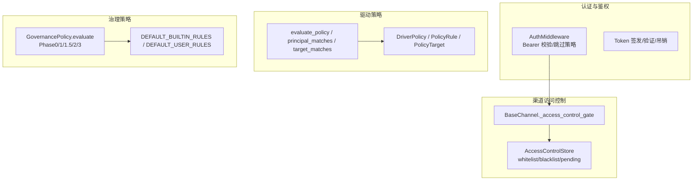
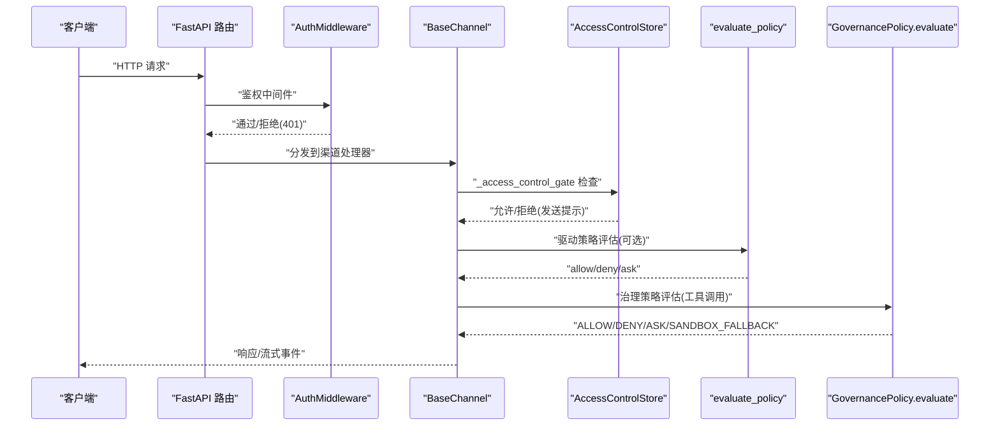
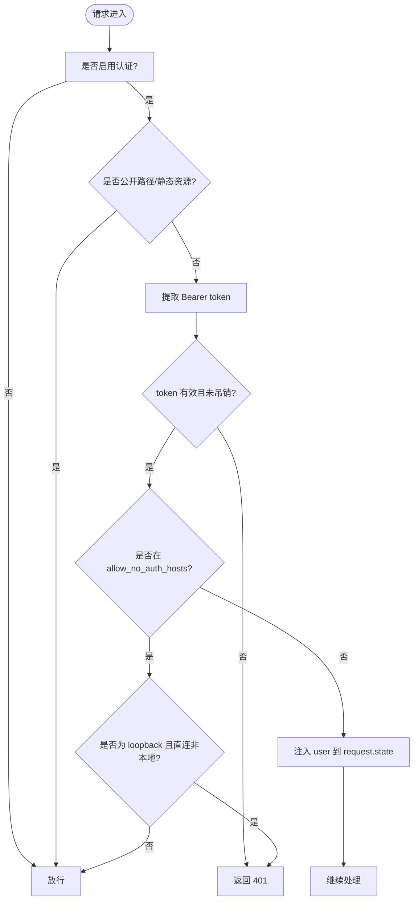
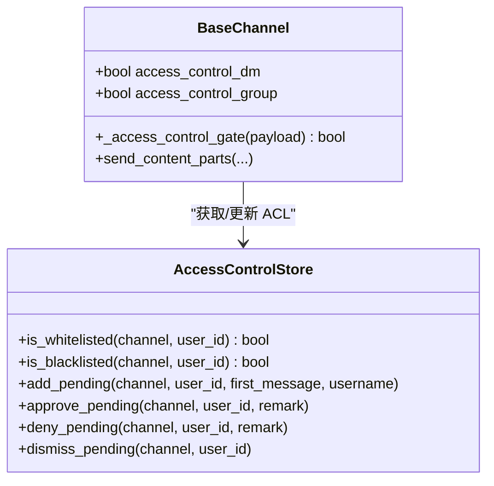
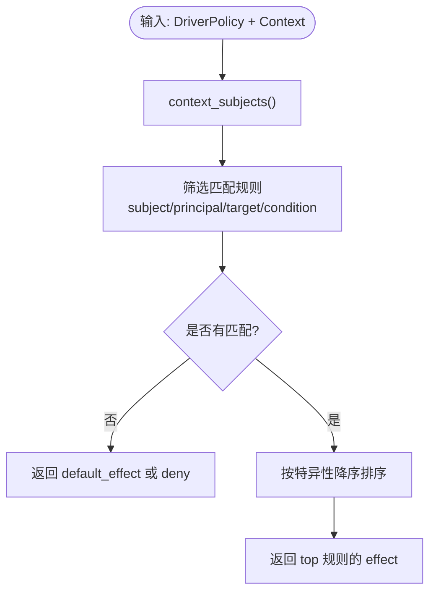
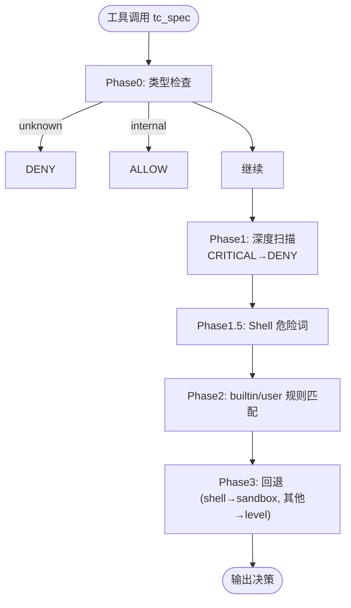
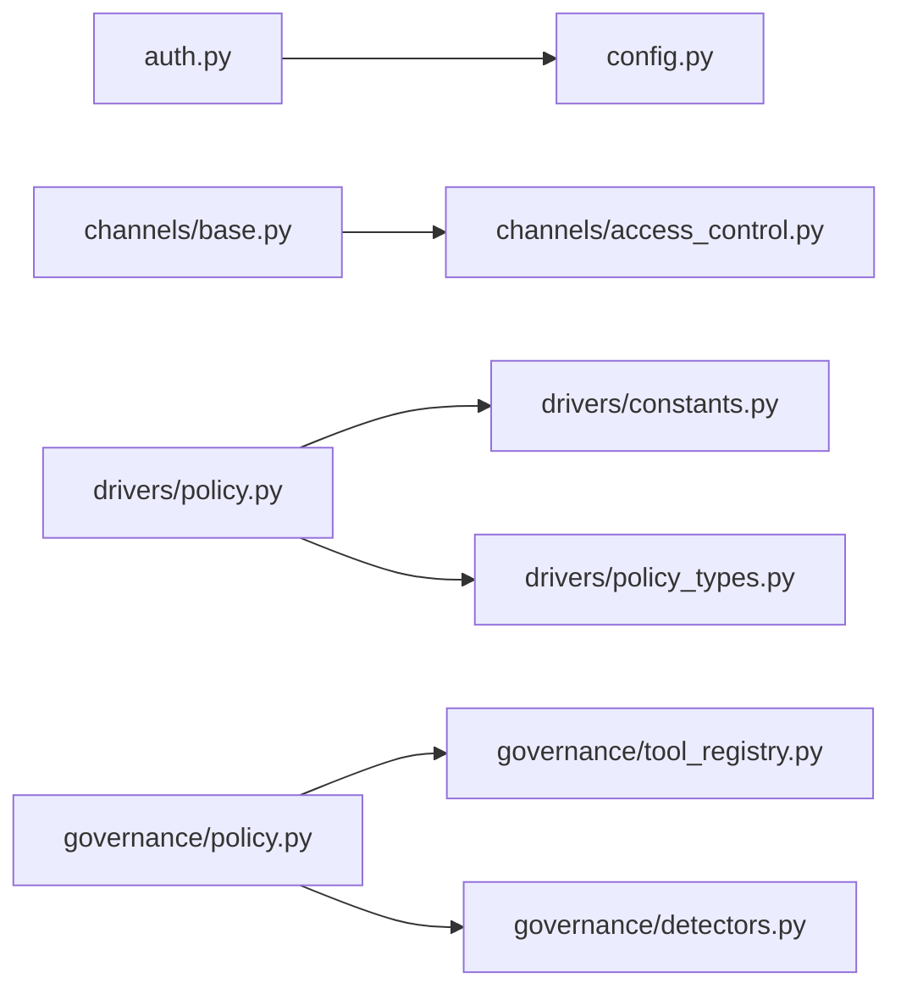

# 访问控制

<cite>
**本文引用的文件**   
- [src/qwenpaw/app/auth.py](file://src/qwenpaw/app/auth.py)
- [src/qwenpaw/app/channels/access_control.py](file://src/qwenpaw/app/channels/access_control.py)
- [src/qwenpaw/app/channels/base.py](file://src/qwenpaw/app/channels/base.py)
- [src/qwenpaw/drivers/policy.py](file://src/qwenpaw/drivers/policy.py)
- [src/qwenpaw/drivers/policy_types.py](file://src/qwenpaw/drivers/policy_types.py)
- [src/qwenpaw/drivers/constants.py](file://src/qwenpaw/drivers/constants.py)
- [src/qwenpaw/governance/policy.py](file://src/qwenpaw/governance/policy.py)
- [src/qwenpaw/config/config.py](file://src/qwenpaw/config/config.py)
</cite>

## 目录
1. [简介](#简介)
2. [项目结构](#项目结构)
3. [核心组件](#核心组件)
4. [架构总览](#架构总览)
5. [详细组件分析](#详细组件分析)
6. [依赖关系分析](#依赖关系分析)
7. [性能与可扩展性](#性能与可扩展性)
8. [故障排查指南](#故障排查指南)
9. [结论](#结论)
10. [附录：配置项与接口速查](#附录配置项与接口速查)

## 简介
本文件系统化梳理 QwenPaw 的访问控制系统，覆盖以下关键维度：
- 渠道访问控制（白名单/黑名单/待审批）
- 驱动策略管理（Driver Policy）
- 权限验证（认证中间件、令牌签发与吊销）
- 访问策略执行（治理策略 GovernancePolicy 与 Driver 策略评估）
- 细粒度权限控制、策略继承与动态权限评估机制
- 与其他组件的关系、调用关系、领域模型、使用模式与常见问题处理

## 项目结构
QwenPaw 的访问控制由多个子系统协作完成：
- 认证与鉴权：FastAPI 中间件校验 Bearer Token，支持白名单主机跳过鉴权、可信代理 IP 解析。
- 渠道访问控制：按渠道维护用户白名单/黑名单/待审批队列，支持多工作区隔离与持久化。
- 驱动策略：对驱动能力（如 MCP tool）进行结构化主体选择器匹配与条件评估。
- 治理策略：工具调用安全策略（内置规则 + 用户规则），三阶段评估（深度扫描 → 规则匹配 → 回退）。

图示来源
- [src/qwenpaw/app/auth.py:689-752](file://src/qwenpaw/app/auth.py#L689-L752)
- [src/qwenpaw/app/channels/base.py:379-451](file://src/qwenpaw/app/channels/base.py#L379-L451)
- [src/qwenpaw/app/channels/access_control.py:157-515](file://src/qwenpaw/app/channels/access_control.py#L157-L515)
- [src/qwenpaw/drivers/policy.py:77-111](file://src/qwenpaw/drivers/policy.py#L77-L111)
- [src/qwenpaw/drivers/policy_types.py:80-93](file://src/qwenpaw/drivers/policy_types.py#L80-L93)
- [src/qwenpaw/governance/policy.py:607-729](file://src/qwenpaw/governance/policy.py#L607-L729)

章节来源
- [src/qwenpaw/app/auth.py:689-752](file://src/qwenpaw/app/auth.py#L689-L752)
- [src/qwenpaw/app/channels/base.py:379-451](file://src/qwenpaw/app/channels/base.py#L379-L451)
- [src/qwenpaw/app/channels/access_control.py:157-515](file://src/qwenpaw/app/channels/access_control.py#L157-L515)
- [src/qwenpaw/drivers/policy.py:77-111](file://src/qwenpaw/drivers/policy.py#L77-L111)
- [src/qwenpaw/drivers/policy_types.py:80-93](file://src/qwenpaw/drivers/policy_types.py#L80-L93)
- [src/qwenpaw/governance/policy.py:607-729](file://src/qwenpaw/governance/policy.py#L607-L729)

## 核心组件
- 认证中间件 AuthMiddleware：统一鉴权入口，支持公开路径、静态资源、无认证主机白名单、可信代理 IP 解析。
- 渠道访问控制 AccessControlStore：按渠道存储白名单/黑名单/待审批，线程安全、持久化、热重载。
- 渠道基类 BaseChannel：在消息消费前执行 _access_control_gate，拦截并提示“被禁止/待审批”。
- 驱动策略 evaluate_policy：基于结构化主体选择器（source_type/source_value/subject_type/subject_value）、目标匹配与时间条件，返回 allow/deny/ask。
- 治理策略 GovernancePolicy.evaluate：三阶段评估（类型检查 → 深度扫描 → 规则匹配 → 回退），支持 STRICT/SMART/AUTO/OFF 执行级别。

章节来源
- [src/qwenpaw/app/auth.py:689-752](file://src/qwenpaw/app/auth.py#L689-L752)
- [src/qwenpaw/app/channels/access_control.py:157-515](file://src/qwenpaw/app/channels/access_control.py#L157-L515)
- [src/qwenpaw/app/channels/base.py:379-451](file://src/qwenpaw/app/channels/base.py#L379-L451)
- [src/qwenpaw/drivers/policy.py:77-111](file://src/qwenpaw/drivers/policy.py#L77-L111)
- [src/qwenpaw/governance/policy.py:607-729](file://src/qwenpaw/governance/policy.py#L607-L729)

## 架构总览
下图展示一次请求从进入服务到最终决策的关键路径：认证 → 渠道 ACL → 驱动策略 → 治理策略。

图示来源
- [src/qwenpaw/app/auth.py:689-752](file://src/qwenpaw/app/auth.py#L689-L752)
- [src/qwenpaw/app/channels/base.py:379-451](file://src/qwenpaw/app/channels/base.py#L379-L451)
- [src/qwenpaw/app/channels/access_control.py:157-515](file://src/qwenpaw/app/channels/access_control.py#L157-L515)
- [src/qwenpaw/drivers/policy.py:77-111](file://src/qwenpaw/drivers/policy.py#L77-L111)
- [src/qwenpaw/governance/policy.py:607-729](file://src/qwenpaw/governance/policy.py#L607-L729)

## 详细组件分析

### 认证与鉴权（AuthMiddleware）
- 功能要点
  - 环境变量开关：QWENPAW_AUTH_ENABLED 为真时启用鉴权。
  - 公开路径与静态资源跳过鉴权。
  - 支持 allow_no_auth_hosts 白名单（含 loopback 强化校验）。
  - 可信代理 IP 解析：仅当直连对端在 trusted_proxies 中才信任 X-Forwarded-For/X-Real-IP。
  - 令牌：HMAC-SHA256 签名，支持 jti 撤销与过期校验。
- 关键流程
  - dispatch：提取 Bearer token → verify_token → 注入 request.state.user。
  - _should_skip_auth：判断是否跳过鉴权（环境开关、注册状态、路径白名单、host 白名单、loopback 强化）。
  - resolve_client_ip：规范化 IP、CIDR 匹配、未受信代理告警。

图示来源
- [src/qwenpaw/app/auth.py:689-752](file://src/qwenpaw/app/auth.py#L689-L752)
- [src/qwenpaw/app/auth.py:569-686](file://src/qwenpaw/app/auth.py#L569-L686)
- [src/qwenpaw/app/auth.py:172-204](file://src/qwenpaw/app/auth.py#L172-L204)

章节来源
- [src/qwenpaw/app/auth.py:689-752](file://src/qwenpaw/app/auth.py#L689-L752)
- [src/qwenpaw/app/auth.py:569-686](file://src/qwenpaw/app/auth.py#L569-L686)
- [src/qwenpaw/app/auth.py:172-204](file://src/qwenpaw/app/auth.py#L172-L204)

### 渠道访问控制（BaseChannel + AccessControlStore）
- 功能要点
  - 每个渠道可独立开启 DM/群组访问控制（access_control_dm / access_control_group）。
  - 白名单直接放行；黑名单拒绝并回复国际化提示；不在列表则加入 pending 并提示“待审批”。
  - AccessControlStore 按工作区目录隔离，JSON 持久化，线程安全，支持 mtime 热重载。
- 关键流程
  - BaseChannel._access_control_gate：根据 payload 提取 sender_id/is_group，查询 store，必要时写入 pending 并发送拒绝消息。
  - AccessControlStore：add_to_whitelist/add_to_blacklist/approve_pending/deny_pending/dismiss_pending 等。

图示来源
- [src/qwenpaw/app/channels/base.py:379-451](file://src/qwenpaw/app/channels/base.py#L379-L451)
- [src/qwenpaw/app/channels/access_control.py:157-515](file://src/qwenpaw/app/channels/access_control.py#L157-L515)

章节来源
- [src/qwenpaw/app/channels/base.py:379-451](file://src/qwenpaw/app/channels/base.py#L379-L451)
- [src/qwenpaw/app/channels/access_control.py:157-515](file://src/qwenpaw/app/channels/access_control.py#L157-L515)

### 驱动策略管理（Driver Policy）
- 领域模型
  - DriverPolicy：包含 default_effect 与 rules。
  - PolicyRule：subject、effect、target、principal、condition。
  - PolicyTarget：kind/name（支持通配符）。
  - PolicyPrincipal：source_type/source_value、subject_type/subject_value。
  - PolicyCondition：time_range（after/before/weekdays）。
- 评估逻辑
  - evaluate_policy：收集上下文 subjects，过滤匹配规则，按特异性排序后取最高优先级 effect。
  - principal_matches/_source_matches/_subject_scope_matches：结构化选择器 AND 语义。
  - subject_matches/target_matches：精确/类型前缀通配/全局通配。
  - condition_satisfied：当前时间满足 time_range。
- 常量与类型
  - constants：POLICY_EFFECT_ALLOW/DENY/ASK、PRINCIPAL_SOURCE_CHANNEL、PRINCIPAL_SUBJECT_ALL/USER/SESSION 等。
  - policy_types：coerce_driver_policy 将松散数据归一化为 DriverPolicy。

图示来源
- [src/qwenpaw/drivers/policy.py:77-111](file://src/qwenpaw/drivers/policy.py#L77-L111)
- [src/qwenpaw/drivers/policy.py:114-143](file://src/qwenpaw/drivers/policy.py#L114-L143)
- [src/qwenpaw/drivers/policy.py:145-183](file://src/qwenpaw/drivers/policy.py#L145-L183)
- [src/qwenpaw/drivers/policy.py:212-224](file://src/qwenpaw/drivers/policy.py#L212-L224)
- [src/qwenpaw/drivers/policy_types.py:80-93](file://src/qwenpaw/drivers/policy_types.py#L80-L93)
- [src/qwenpaw/drivers/constants.py:16-37](file://src/qwenpaw/drivers/constants.py#L16-L37)

章节来源
- [src/qwenpaw/drivers/policy.py:77-111](file://src/qwenpaw/drivers/policy.py#L77-L111)
- [src/qwenpaw/drivers/policy.py:114-143](file://src/qwenpaw/drivers/policy.py#L114-L143)
- [src/qwenpaw/drivers/policy.py:145-183](file://src/qwenpaw/drivers/policy.py#L145-L183)
- [src/qwenpaw/drivers/policy.py:212-224](file://src/qwenpaw/drivers/policy.py#L212-L224)
- [src/qwenpaw/drivers/policy_types.py:80-93](file://src/qwenpaw/drivers/policy_types.py#L80-L93)
- [src/qwenpaw/drivers/constants.py:16-37](file://src/qwenpaw/drivers/constants.py#L16-L37)

### 治理策略执行（GovernancePolicy）
- 三阶段评估（v2.0）
  - Phase 0：工具类型检查（未知→DENY，内部→ALLOW）。
  - Phase 1：深度安全扫描（敏感路径/模式检测/Shell 逃逸），CRITICAL 立即 DENY。
  - Phase 1.5：Shell 危险关键词正则检测（绕过 fnmatch 的变体）。
  - Phase 2：builtin_rules + user_rules 首次命中优先（first-match-wins），STRICT 模式会将 ALLOW 升级为 ASK。
  - Phase 3：回退策略（shell→SANDBOX_FALLBACK，其他→按 execution_level 决定 ASK/ALLOW）。
- 默认规则
  - DEFAULT_BUILTIN_RULES：系统级保护（.env/.ssh/*.pem 等 ASK；sudo/rm -rf /* 等 DENY）。
  - DEFAULT_USER_RULES：工作区读写、搜索、浏览、网络读取、/tmp、gh 操作等 ALLOW。
- 动态扩展
  - add_rule/remove_rule：仅作用于 user_rules，新规则插入头部以优先生效，去重避免无限增长。
  - load/save：WORKSPACE_DIR/CODING_PROJECT_DIR 占位符替换与还原，applied_migrations 记录迁移标记。

图示来源
- [src/qwenpaw/governance/policy.py:607-729](file://src/qwenpaw/governance/policy.py#L607-L729)
- [src/qwenpaw/governance/policy.py:253-259](file://src/qwenpaw/governance/policy.py#L253-L259)
- [src/qwenpaw/governance/policy.py:392-526](file://src/qwenpaw/governance/policy.py#L392-L526)
- [src/qwenpaw/governance/policy.py:869-904](file://src/qwenpaw/governance/policy.py#L869-L904)
- [src/qwenpaw/governance/policy.py:992-1106](file://src/qwenpaw/governance/policy.py#L992-L1106)

章节来源
- [src/qwenpaw/governance/policy.py:607-729](file://src/qwenpaw/governance/policy.py#L607-L729)
- [src/qwenpaw/governance/policy.py:253-259](file://src/qwenpaw/governance/policy.py#L253-L259)
- [src/qwenpaw/governance/policy.py:392-526](file://src/qwenpaw/governance/policy.py#L392-L526)
- [src/qwenpaw/governance/policy.py:869-904](file://src/qwenpaw/governance/policy.py#L869-L904)
- [src/qwenpaw/governance/policy.py:992-1106](file://src/qwenpaw/governance/policy.py#L992-L1106)

## 依赖关系分析
- 认证模块依赖配置加载与安全存储（SECRET_DIR、加密字段）。
- 渠道访问控制依赖工作区目录定位与 JSON 持久化。
- 驱动策略依赖常量与类型归一化。
- 治理策略依赖工具注册表、检测器与沙箱配置。

图示来源
- [src/qwenpaw/app/auth.py:689-752](file://src/qwenpaw/app/auth.py#L689-L752)
- [src/qwenpaw/app/channels/base.py:379-451](file://src/qwenpaw/app/channels/base.py#L379-L451)
- [src/qwenpaw/app/channels/access_control.py:157-515](file://src/qwenpaw/app/channels/access_control.py#L157-L515)
- [src/qwenpaw/drivers/policy.py:77-111](file://src/qwenpaw/drivers/policy.py#L77-L111)
- [src/qwenpaw/drivers/constants.py:16-37](file://src/qwenpaw/drivers/constants.py#L16-L37)
- [src/qwenpaw/drivers/policy_types.py:80-93](file://src/qwenpaw/drivers/policy_types.py#L80-L93)
- [src/qwenpaw/governance/policy.py:607-729](file://src/qwenpaw/governance/policy.py#L607-L729)

章节来源
- [src/qwenpaw/app/auth.py:689-752](file://src/qwenpaw/app/auth.py#L689-L752)
- [src/qwenpaw/app/channels/base.py:379-451](file://src/qwenpaw/app/channels/base.py#L379-L451)
- [src/qwenpaw/app/channels/access_control.py:157-515](file://src/qwenpaw/app/channels/access_control.py#L157-L515)
- [src/qwenpaw/drivers/policy.py:77-111](file://src/qwenpaw/drivers/policy.py#L77-L111)
- [src/qwenpaw/drivers/constants.py:16-37](file://src/qwenpaw/drivers/constants.py#L16-L37)
- [src/qwenpaw/drivers/policy_types.py:80-93](file://src/qwenpaw/drivers/policy_types.py#L80-L93)
- [src/qwenpaw/governance/policy.py:607-729](file://src/qwenpaw/governance/policy.py#L607-L729)

## 性能与可扩展性
- 认证中间件
  - 配置缓存：基于配置文件 mtime 缓存 trusted_proxies，避免每次请求磁盘读取。
  - 未受信代理日志限流：防止大量告警影响性能。
- 渠道访问控制
  - 线程锁保证并发安全；mtime 热重载避免重启即可同步外部修改。
- 驱动策略
  - 规则匹配采用 O(n) 过滤+排序，建议合理拆分规则与减少通配符范围。
- 治理策略
  - 首次命中优先，避免全量遍历；新增规则插入头部提升命中率；去重避免用户规则膨胀。

[本节为通用指导，不直接分析具体文件]

## 故障排查指南
- 无法登录或频繁 401
  - 检查 QWENPAW_AUTH_ENABLED 是否启用、是否存在已注册用户。
  - 确认请求路径是否在公开路径或 allow_no_auth_hosts 白名单内。
  - 若经过反向代理，确保直连对端在 security.trusted_proxies 中，否则忽略 X-Forwarded-For。
- 渠道访问控制导致用户被拒绝
  - 查看对应渠道的 whitelist/blacklist/pending 状态，必要时 approve_pending 或 dismiss_pending。
  - 确认 access_control_dm/access_control_group 是否开启以及 is_group 元信息是否正确。
- 驱动策略误判
  - 检查 PolicyRule 的 subject/principal/target/condition 是否与上下文一致。
  - 调整 specificity（更具体的 source/subject/target）以提升匹配优先级。
- 治理策略过度询问或放行
  - 调整 execution_level（strict/smart/auto/off）。
  - 在 user_rules 中添加更精确的规则，注意 match 字符串与 WORKSPACE_DIR 占位符。

章节来源
- [src/qwenpaw/app/auth.py:689-752](file://src/qwenpaw/app/auth.py#L689-L752)
- [src/qwenpaw/app/channels/base.py:379-451](file://src/qwenpaw/app/channels/base.py#L379-L451)
- [src/qwenpaw/app/channels/access_control.py:157-515](file://src/qwenpaw/app/channels/access_control.py#L157-L515)
- [src/qwenpaw/drivers/policy.py:77-111](file://src/qwenpaw/drivers/policy.py#L77-L111)
- [src/qwenpaw/governance/policy.py:607-729](file://src/qwenpaw/governance/policy.py#L607-L729)

## 结论
QwenPaw 的访问控制体系围绕“认证—渠道 ACL—驱动策略—治理策略”四层展开，既提供开箱即用的安全防护（内置规则、严格模式），又支持灵活的动态授权（用户规则、策略继承、条件匹配）。通过细粒度的主体选择器、目标匹配与时段条件，结合严格的代理 IP 校验与令牌吊销机制，可在复杂部署环境下实现可控、可审计、可扩展的访问控制。

[本节为总结，不直接分析具体文件]

## 附录：配置项与接口速查
- 认证相关
  - 环境变量：QWENPAW_AUTH_ENABLED、QWENPAW_AUTH_USERNAME、QWENPAW_AUTH_PASSWORD
  - 配置项：security.allow_no_auth_hosts、security.trusted_proxies
  - 接口：create_token、verify_token、revoke_token、revoke_all_tokens、authenticate、register_user
- 渠道访问控制
  - 配置项：BaseChannelConfig.access_control_dm、access_control_group、dm_disabled、group_disabled
  - 接口：AccessControlStore.add_to_whitelist、add_to_blacklist、approve_pending、deny_pending、dismiss_pending、get_all_pending
- 驱动策略
  - 数据结构：DriverPolicy、PolicyRule、PolicyTarget、PolicyPrincipal、PolicyCondition
  - 函数：evaluate_policy、principal_matches、subject_matches、target_matches、condition_satisfied
- 治理策略
  - 配置项：execution_level（off/auto/smart/strict）、audit_level、sensitive_paths、detection_rules
  - 接口：load_governance_policy、save_governance_policy、GovernancePolicy.evaluate、add_rule、remove_rule

章节来源
- [src/qwenpaw/app/auth.py:132-169](file://src/qwenpaw/app/auth.py#L132-L169)
- [src/qwenpaw/app/auth.py:475-501](file://src/qwenpaw/app/auth.py#L475-L501)
- [src/qwenpaw/app/auth.py:504-565](file://src/qwenpaw/app/auth.py#L504-L565)
- [src/qwenpaw/config/config.py:197-216](file://src/qwenpaw/config/config.py#L197-L216)
- [src/qwenpaw/app/channels/access_control.py:241-319](file://src/qwenpaw/app/channels/access_control.py#L241-L319)
- [src/qwenpaw/app/channels/access_control.py:361-489](file://src/qwenpaw/app/channels/access_control.py#L361-L489)
- [src/qwenpaw/drivers/policy_types.py:80-93](file://src/qwenpaw/drivers/policy_types.py#L80-L93)
- [src/qwenpaw/drivers/policy.py:77-111](file://src/qwenpaw/drivers/policy.py#L77-L111)
- [src/qwenpaw/governance/policy.py:992-1106](file://src/qwenpaw/governance/policy.py#L992-L1106)
- [src/qwenpaw/governance/policy.py:869-904](file://src/qwenpaw/governance/policy.py#L869-L904)