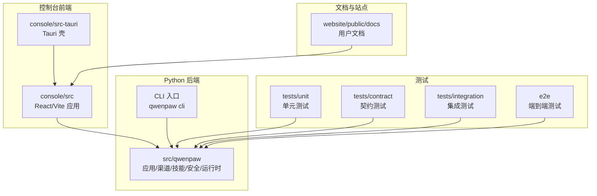
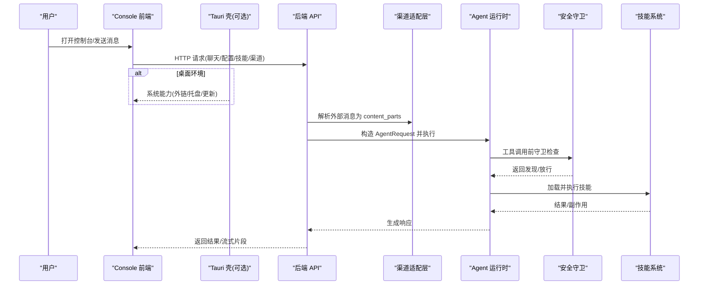
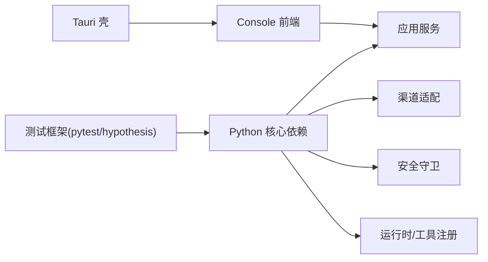

# 开发指南

<cite>
**本文引用的文件**
- [README.md](file://README.md)
- [CONTRIBUTING.md](file://CONTRIBUTING.md)
- [pyproject.toml](file://pyproject.toml)
- [docker-compose.yml](file://docker-compose.yml)
- [src/qwenpaw/cli/tui/paths.py](file://src/qwenpaw/cli/tui/paths.py)
- [console/src/utils/openExternalLink.ts](file://console/src/utils/openExternalLink.ts)
- [tests/contract/security/test_guardian_contract.py](file://tests/contract/security/test_guardian_contract.py)
- [website/public/docs/skills.zh.md](file://website/public/docs/skills.zh.md)
</cite>

## 目录
1. [简介](#简介)
2. [项目结构](#项目结构)
3. [核心组件](#核心组件)
4. [架构总览](#架构总览)
5. [详细组件分析](#详细组件分析)
6. [依赖关系分析](#依赖关系分析)
7. [性能考量](#性能考量)
8. [故障排查指南](#故障排查指南)
9. [结论](#结论)
10. [附录](#附录)

## 简介
本指南面向 QwenPaw 的贡献者与开发者，覆盖从环境搭建、代码规范、测试策略到贡献流程与持续集成要点的全链路说明。文档同时给出关键实现细节、调用关系、接口约定、领域模型与使用模式，并附带来自仓库的真实示例路径，帮助初学者快速上手，也为有经验的开发者提供深入的技术参考。

## 项目结构
QwenPaw 采用多语言、多子工程组织：
- Python 后端与 CLI：位于 src/qwenpaw，包含应用服务、渠道、技能、安全、运行时等模块
- Console 前端（React + Vite）：位于 console，构建产物被打包进 Python 包
- Tauri 桌面壳：位于 console/src-tauri，负责跨平台桌面体验与系统能力桥接
- E2E 测试套件：位于 e2e，基于 Playwright 的端到端测试
- 网站与文档：位于 website，用于站点与文档资源
- 脚本与部署：scripts、deploy 等

图表来源
- [README.md:104-175](file://README.md#L104-L175)
- [pyproject.toml:82-106](file://pyproject.toml#L82-L106)

章节来源
- [README.md:104-175](file://README.md#L104-L175)
- [pyproject.toml:82-106](file://pyproject.toml#L82-L106)

## 核心组件
- 应用与服务层：提供 HTTP API、频道接入、会话管理、定时任务、审批流等
- 渠道子系统：统一消息协议，将不同 IM 平台消息转换为内部 content_parts
- 技能系统：内置与自定义技能，支持技能池与工作区副本、自动同步、市场安装
- 安全体系：沙箱、工具守卫、文件守卫、技能扫描器、访问策略
- 运行时与循环：Agent 运行期、工具注册、中间件、钩子、上下文与记忆
- CLI/TUI：命令行与终端界面，便于本地开发与调试
- 桌面壳（Tauri）：跨平台桌面体验，原生能力桥接（外链打开、托盘、更新等）

章节来源
- [README.md:32-44](file://README.md#L32-L44)
- [website/public/docs/skills.zh.md:1-49](file://website/public/docs/skills.zh.md#L1-L49)

## 架构总览
下图展示从浏览器或桌面壳发起请求，经 Console 前端路由到后端 API，再由渠道/技能/安全/运行时协同处理的核心交互。

图表来源
- [README.md:32-44](file://README.md#L32-L44)
- [website/public/docs/skills.zh.md:1-49](file://website/public/docs/skills.zh.md#L1-L49)

## 详细组件分析

### 开发环境与安装
- 推荐方式
  - pip 安装与初始化：见“快速开始”选项一
  - 一键脚本安装：macOS/Linux/Windows 均有脚本，自动处理 uv 与依赖
  - Docker 部署：官方镜像，端口映射与数据卷挂载
  - 源码安装：先构建前端，再安装 Python 包
- 环境变量与路径
  - 工作目录默认 ~/.qwenpaw，可通过 QWENPAW_WORKING_DIR 覆盖
  - TUI 状态目录遵循 PAW_STATE_DIR/XDG_STATE_HOME，回退到平台默认

章节来源
- [README.md:104-175](file://README.md#L104-L175)
- [README.md:218-261](file://README.md#L218-L261)
- [README.md:469-491](file://README.md#L469-L491)
- [src/qwenpaw/cli/tui/paths.py:15-34](file://src/qwenpaw/cli/tui/paths.py#L15-L34)

### 代码规范与提交
- 遵循 Conventional Commits 规范，PR 标题同理
- 本地门禁：安装 dev 依赖、启用 pre-commit、全量检查、运行 pytest
- 前端格式化：console 与 website 目录需分别执行 npm run format
- 文档更新：涉及用户可见行为变更时，更新 website/public/docs 下文档

章节来源
- [CONTRIBUTING.md:23-85](file://CONTRIBUTING.md#L23-L85)

### 测试策略
- 分层测试
  - 单元测试：针对函数/类/模块边界逻辑
  - 契约测试：确保抽象接口与数据结构稳定（如 BaseToolGuardian 契约）
  - 集成测试：跨模块协作（渠道、MCP、审批、插件等）
  - 端到端测试：基于 Playwright 的 UI 与业务流程验证
- 标记与优先级
  - p0/p1/p2 分级；unit/contract/integration/e2e 标记
  - 覆盖率阈值与报告输出由 pyproject 配置
- 示例：BaseToolGuardian 契约测试
  - 校验 guard() 返回值类型、未知工具名不崩溃、空参数健壮性、发现字段完整性

章节来源
- [pyproject.toml:146-186](file://pyproject.toml#L146-L186)
- [tests/contract/security/test_guardian_contract.py:1-31](file://tests/contract/security/test_guardian_contract.py#L1-L31)
- [tests/contract/security/test_guardian_contract.py:73-113](file://tests/contract/security/test_guardian_contract.py#L73-L113)
- [tests/contract/security/test_guardian_contract.py:187-252](file://tests/contract/security/test_guardian_contract.py#L187-L252)

### 贡献指南与流程
- 贡献类型：新增渠道/模型提供者/技能、修复兼容性问题、完善文档、优化体验
- 新渠道实现要点：继承 BaseChannel、设置 channel 键、实现生命周期与消息处理、通过插件或注册表发现
- 新模型提供者要求：兼容 OpenAI chat.completions 或 Anthropic messages；建议支持 /model/list
- 技能结构与创建：SKILL.md front matter、references/scripts 可选；工作区副本与技能池分离；支持自动同步与市场安装

章节来源
- [CONTRIBUTING.md:95-127](file://CONTRIBUTING.md#L95-L127)
- [CONTRIBUTING.md:130-192](file://CONTRIBUTING.md#L130-L192)
- [website/public/docs/skills.zh.md:1-49](file://website/public/docs/skills.zh.md#L1-L49)
- [website/public/docs/skills.zh.md:120-153](file://website/public/docs/skills.zh.md#L120-L153)
- [website/public/docs/skills.zh.md:311-336](file://website/public/docs/skills.zh.md#L311-L336)
- [website/public/docs/skills.zh.md:339-368](file://website/public/docs/skills.zh.md#L339-L368)

### 持续集成与发布
- CI 策略：pre-commit 失败则不可合并；前端格式检查纳入 PR 门禁
- 版本与元数据：动态版本号取自 qwenpaw.__version__
- 打包与分发：PyPI 包、Docker 镜像、桌面安装包（Tauri）
- 文档站点：website 构建产物作为静态站点

章节来源
- [CONTRIBUTING.md:70-85](file://CONTRIBUTING.md#L70-L85)
- [pyproject.toml:79-81](file://pyproject.toml#L79-L81)
- [README.md:218-261](file://README.md#L218-L261)

### 领域模型与接口要点
- 渠道消息模型：统一为 content_parts（文本、图片、文件等），Agent 接收 AgentRequest
- 工具守卫契约：guard(tool_name, params) -> list[GuardFinding]，子类必须实现 guard
- 技能配置注入：按 requires.env 注入环境变量，完整 JSON 通过 QWENPAW_SKILL_CONFIG_<NAME> 暴露
- 外链打开策略：仅允许 http/https/mailto/tel 等白名单协议，Tauri 环境下走 invoke 命令

章节来源
- [CONTRIBUTING.md:114-127](file://CONTRIBUTING.md#L114-L127)
- [tests/contract/security/test_guardian_contract.py:260-289](file://tests/contract/security/test_guardian_contract.py#L260-L289)
- [website/public/docs/skills.zh.md:388-464](file://website/public/docs/skills.zh.md#L388-L464)
- [console/src/utils/openExternalLink.ts:1-43](file://console/src/utils/openExternalLink.ts#L1-L43)
- [console/src/utils/openExternalLink.ts:41-85](file://console/src/utils/openExternalLink.ts#L41-L85)

### 使用模式与最佳实践
- 本地开发：pip install -e ".[dev,full]"，pre-commit 全量检查，pytest 运行
- 前端改动：在 console 与 website 目录下分别执行 npm run format
- 技能编写：描述清晰、触发词明确、必要时声明 requires.env/bins
- 渠道扩展：优先复用统一消息协议，避免破坏现有 contract

章节来源
- [CONTRIBUTING.md:70-85](file://CONTRIBUTING.md#L70-L85)
- [website/public/docs/skills.zh.md:144-180](file://website/public/docs/skills.zh.md#L144-L180)

## 依赖关系分析
- Python 依赖：agentscope、httpx、uvicorn、apscheduler、playwright、textual、openai 等
- 前端依赖：Vite、React、Monaco Editor、Mermaid 等（由 console/package.json 管理）
- 桌面壳：Tauri（Rust）与前端 SDK 通信，开放系统能力
- 测试依赖：pytest、pytest-asyncio、pytest-cov、pytest-xdist、hypothesis

图表来源
- [pyproject.toml:7-71](file://pyproject.toml#L7-L71)
- [pyproject.toml:113-144](file://pyproject.toml#L113-L144)

章节来源
- [pyproject.toml:7-71](file://pyproject.toml#L7-L71)
- [pyproject.toml:113-144](file://pyproject.toml#L113-L144)

## 性能考量
- 异步与并发：HTTP 服务基于 uvicorn，测试使用 pytest-asyncio，注意事件循环与超时配置
- 前端渲染：大列表/长对话建议使用虚拟滚动与懒加载（Monaco/Mermaid 按需加载）
- 工具执行：结合沙箱与守卫减少危险操作开销，合理设置超时与重试
- 缓存与索引：技能池与工作区清单重建应增量进行，避免全量扫描

[本节为通用指导，无需具体文件引用]

## 故障排查指南
- 启动与端口
  - 确认 8088 端口未被占用；Docker 场景下使用 host.docker.internal 访问宿主机服务
- 权限与安全
  - 工具守卫/文件守卫误报：检查规则与敏感路径配置；查看 GuardFinding 字段定位原因
- 外链打开失败
  - 检查协议是否在白名单内；Tauri 环境下确认 invoke 可用
- 日志与状态
  - TUI 状态目录遵循 PAW_STATE_DIR/XDG_STATE_HOME；日志文件位于该目录下的 acp.log

章节来源
- [README.md:235-259](file://README.md#L235-L259)
- [tests/contract/security/test_guardian_contract.py:187-252](file://tests/contract/security/test_guardian_contract.py#L187-L252)
- [console/src/utils/openExternalLink.ts:1-43](file://console/src/utils/openExternalLink.ts#L1-L43)
- [src/qwenpaw/cli/tui/paths.py:15-34](file://src/qwenpaw/cli/tui/paths.py#L15-L34)

## 结论
QwenPaw 以“Agent OS”为核心，围绕渠道、技能、安全与运行时构建了可扩展的个人 AI 助手平台。通过清晰的贡献规范、完善的测试分层与可复用的组件设计，开发者可以快速扩展能力并保持质量。建议在贡献前先阅读相关文档与契约测试，确保改动符合既有约定。

[本节为总结，无需具体文件引用]

## 附录

### 常用命令速查
- 安装与初始化
  - pip 安装与初始化：见 README 快速开始
  - 一键脚本安装：见 README 脚本安装
- 本地开发
  - 安装开发依赖：pip install -e ".[dev,full]"
  - 前置检查：pre-commit run --all-files
  - 运行测试：pytest
  - 前端格式化：cd console && npm run format；cd website && npm run format
- Docker 运行
  - docker compose up -d；访问 http://127.0.0.1:8088/

章节来源
- [README.md:104-175](file://README.md#L104-L175)
- [CONTRIBUTING.md:70-85](file://CONTRIBUTING.md#L70-L85)
- [docker-compose.yml:1-27](file://docker-compose.yml#L1-L27)