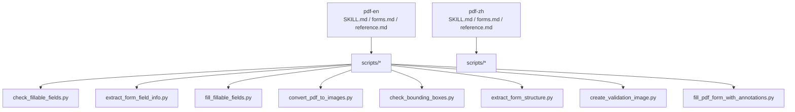
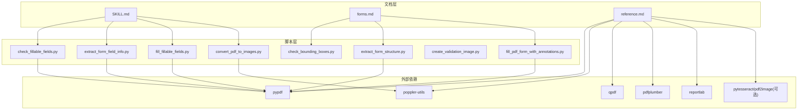
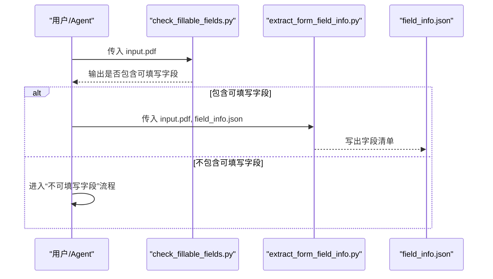
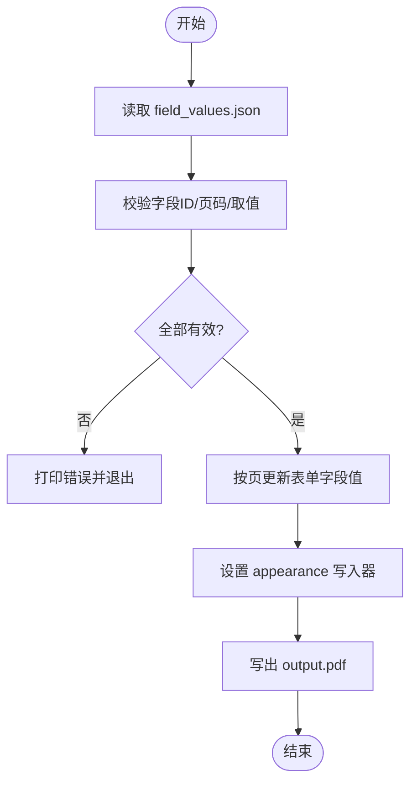
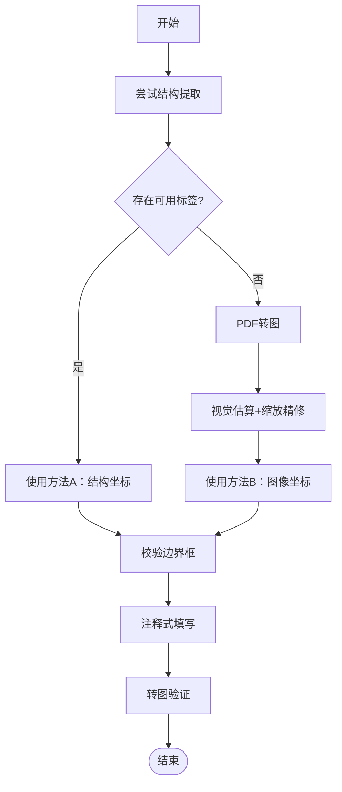
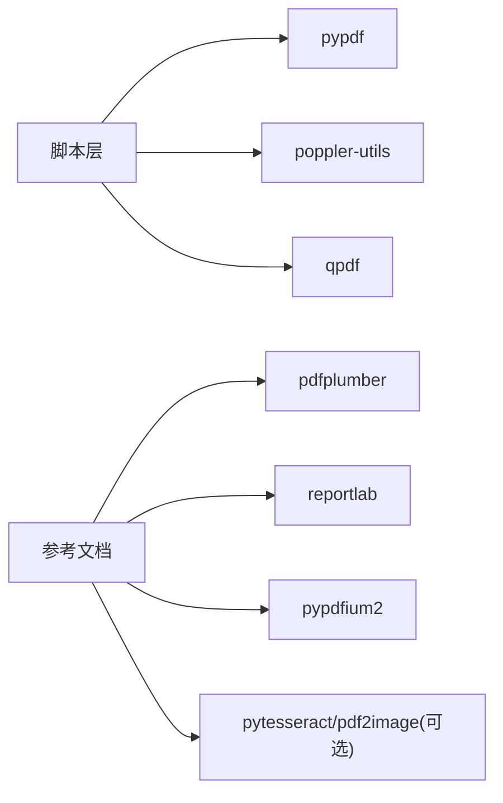

# PDF 处理技能

<cite>
**本文引用的文件**   
- [SKILL.md（英文）](file://src/qwenpaw/agents/skills/pdf-en/SKILL.md)
- [SKILL.md（中文）](file://src/qwenpaw/agents/skills/pdf-zh/SKILL.md)
- [forms.md（英文）](file://src/qwenpaw/agents/skills/pdf-en/forms.md)
- [forms.md（中文）](file://src/qwenpaw/agents/skills/pdf-zh/forms.md)
- [reference.md（英文）](file://src/qwenpaw/agents/skills/pdf-en/reference.md)
- [reference.md（中文）](file://src/qwenpaw/agents/skills/pdf-zh/reference.md)
- [check_fillable_fields.py（英文）](file://src/qwenpaw/agents/skills/pdf-en/scripts/check_fillable_fields.py)
- [check_fillable_fields.py（中文）](file://src/qwenpaw/agents/skills/pdf-zh/scripts/check_fillable_fields.py)
- [extract_form_field_info.py（英文）](file://src/qwenpaw/agents/skills/pdf-en/scripts/extract_form_field_info.py)
- [extract_form_field_info.py（中文）](file://src/qwenpaw/agents/skills/pdf-zh/scripts/extract_form_field_info.py)
- [fill_fillable_fields.py（英文）](file://src/qwenpaw/agents/skills/pdf-en/scripts/fill_fillable_fields.py)
- [fill_fillable_fields.py（中文）](file://src/qwenpaw/agents/skills/pdf-zh/scripts/fill_fillable_fields.py)
</cite>

## 目录
1. [简介](#简介)
2. [项目结构](#项目结构)
3. [核心组件](#核心组件)
4. [架构总览](#架构总览)
5. [详细组件分析](#详细组件分析)
6. [依赖关系分析](#依赖关系分析)
7. [性能与优化](#性能与优化)
8. [故障排查指南](#故障排查指南)
9. [结论](#结论)
10. [附录：常用命令与参数](#附录常用命令与参数)

## 简介
本章节面向 QwenPaw 的“PDF 处理技能”，系统性说明其能力边界、使用方式、配置项与实现细节。该技能围绕以下目标展开：
- 读取与提取文本、表格、元数据
- 合并、拆分、旋转、加密/解密、水印等基础操作
- 创建新 PDF（报告、表格等）
- 填写可交互表单字段，或为无表单字段的 PDF 通过注释方式添加内容
- 将 PDF 转换为图片、对扫描版进行 OCR 以增强可读性
- 提供命令行工具与 Python 库组合的最佳实践

该技能同时提供中英文文档与脚本，便于不同语言环境下的使用与集成。

## 项目结构
PDF 技能采用“文档 + 脚本”的组织方式：
- 顶层文档：SKILL.md（快速入门与常用任务）、forms.md（表单填写流程）、reference.md（高级参考）
- scripts 目录：包含一系列可独立运行的 Python 脚本，用于表单检测、字段信息抽取、值校验与填充、坐标验证、PDF 转图等

图表来源
- [SKILL.md（英文）](file://src/qwenpaw/agents/skills/pdf-en/SKILL.md)
- [SKILL.md（中文）](file://src/qwenpaw/agents/skills/pdf-zh/SKILL.md)
- [forms.md（英文）](file://src/qwenpaw/agents/skills/pdf-en/forms.md)
- [forms.md（中文）](file://src/qwenpaw/agents/skills/pdf-zh/forms.md)
- [reference.md（英文）](file://src/qwenpaw/agents/skills/pdf-en/reference.md)
- [reference.md（中文）](file://src/qwenpaw/agents/skills/pdf-zh/reference.md)
- [check_fillable_fields.py（英文）](file://src/qwenpaw/agents/skills/pdf-en/scripts/check_fillable_fields.py)
- [extract_form_field_info.py（英文）](file://src/qwenpaw/agents/skills/pdf-en/scripts/extract_form_field_info.py)
- [fill_fillable_fields.py（英文）](file://src/qwenpaw/agents/skills/pdf-en/scripts/fill_fillable_fields.py)

章节来源
- [SKILL.md（英文）](file://src/qwenpaw/agents/skills/pdf-en/SKILL.md)
- [SKILL.md（中文）](file://src/qwenpaw/agents/skills/pdf-zh/SKILL.md)
- [forms.md（英文）](file://src/qwenpaw/agents/skills/pdf-en/forms.md)
- [forms.md（中文）](file://src/qwenpaw/agents/skills/pdf-zh/forms.md)
- [reference.md（英文）](file://src/qwenpaw/agents/skills/pdf-en/reference.md)
- [reference.md（中文）](file://src/qwenpaw/agents/skills/pdf-zh/reference.md)

## 核心组件
- 文档层
  - SKILL.md：前置依赖、快速入门、Python 库与命令行工具用法、常见任务速查表
  - forms.md：表单填写标准流程（可填写字段 vs 不可填写字段），含坐标系统与验证步骤
  - reference.md：高级用法（pypdfium2、pdf-lib、pdfjs-dist、poppler-utils、qpdf 高级特性、批处理与性能建议）
- 脚本层
  - check_fillable_fields.py：判断 PDF 是否包含可填写表单字段
  - extract_form_field_info.py：抽取表单字段信息（类型、页码、矩形框、选项等）并输出 JSON
  - fill_fillable_fields.py：基于 field_values.json 填充可交互表单字段，并进行严格校验
  - convert_pdf_to_images.py：将 PDF 逐页渲染为图片（PNG/JPEG）
  - check_bounding_boxes.py：校验 fields.json 中边界框是否相交或过小
  - extract_form_structure.py：从 PDF 结构中解析标签、行线、复选框等元素及坐标
  - create_validation_image.py：生成校验图像辅助定位
  - fill_pdf_form_with_annotations.py：为无表单字段的 PDF 通过注释方式写入文本/勾选标记

章节来源
- [SKILL.md（英文）](file://src/qwenpaw/agents/skills/pdf-en/SKILL.md)
- [SKILL.md（中文）](file://src/qwenpaw/agents/skills/pdf-zh/SKILL.md)
- [forms.md（英文）](file://src/qwenpaw/agents/skills/pdf-en/forms.md)
- [forms.md（中文）](file://src/qwenpaw/agents/skills/pdf-zh/forms.md)
- [reference.md（英文）](file://src/qwenpaw/agents/skills/pdf-en/reference.md)
- [reference.md（中文）](file://src/qwenpaw/agents/skills/pdf-zh/reference.md)
- [check_fillable_fields.py（英文）](file://src/qwenpaw/agents/skills/pdf-en/scripts/check_fillable_fields.py)
- [extract_form_field_info.py（英文）](file://src/qwenpaw/agents/skills/pdf-en/scripts/extract_form_field_info.py)
- [fill_fillable_fields.py（英文）](file://src/qwenpaw/agents/skills/pdf-en/scripts/fill_fillable_fields.py)

## 架构总览
PDF 技能由“文档指导 + 脚本执行”的双层架构组成。上层文档定义工作流与最佳实践；下层脚本封装具体实现，并通过 pypdf、poppler-utils、qpdf 等外部依赖完成读写与转换。

图表来源
- [SKILL.md（英文）](file://src/qwenpaw/agents/skills/pdf-en/SKILL.md)
- [SKILL.md（中文）](file://src/qwenpaw/agents/skills/pdf-zh/SKILL.md)
- [forms.md（英文）](file://src/qwenpaw/agents/skills/pdf-en/forms.md)
- [forms.md（中文）](file://src/qwenpaw/agents/skills/pdf-zh/forms.md)
- [reference.md（英文）](file://src/qwenpaw/agents/skills/pdf-en/reference.md)
- [reference.md（中文）](file://src/qwenpaw/agents/skills/pdf-zh/reference.md)
- [check_fillable_fields.py（英文）](file://src/qwenpaw/agents/skills/pdf-en/scripts/check_fillable_fields.py)
- [extract_form_field_info.py（英文）](file://src/qwenpaw/agents/skills/pdf-en/scripts/extract_form_field_info.py)
- [fill_fillable_fields.py（英文）](file://src/qwenpaw/agents/skills/pdf-en/scripts/fill_fillable_fields.py)

## 详细组件分析

### 表单检测与字段信息抽取
- 功能要点
  - 检测 PDF 是否包含可填写表单字段
  - 抽取字段 ID、类型（文本、复选框、单选组、下拉选择）、页码、矩形框、选项列表等
  - 输出结构化 JSON，供后续填写脚本使用
- 关键脚本
  - check_fillable_fields.py：调用 pypdf 的 get_fields 判断是否存在表单字段
  - extract_form_field_info.py：遍历字段与页面注解，构建完整字段清单并按位置排序
- 输入/输出
  - 输入：PDF 路径
  - 输出：JSON 文件（字段清单）
- 典型调用链
  - 先运行检测脚本，再根据结果进入“可填写字段”或“不可填写字段”流程

图表来源
- [check_fillable_fields.py（英文）](file://src/qwenpaw/agents/skills/pdf-en/scripts/check_fillable_fields.py)
- [extract_form_field_info.py（英文）](file://src/qwenpaw/agents/skills/pdf-en/scripts/extract_form_field_info.py)
- [forms.md（英文）](file://src/qwenpaw/agents/skills/pdf-en/forms.md)

章节来源
- [check_fillable_fields.py（英文）](file://src/qwenpaw/agents/skills/pdf-en/scripts/check_fillable_fields.py)
- [extract_form_field_info.py（英文）](file://src/qwenpaw/agents/skills/pdf-en/scripts/extract_form_field_info.py)
- [forms.md（英文）](file://src/qwenpaw/agents/skills/pdf-en/forms.md)

### 可填写表单填充
- 功能要点
  - 基于 field_values.json 对可交互表单字段进行填充
  - 严格校验字段 ID、页码与取值合法性（复选框/单选组/下拉选择）
  - 自动设置 appearance 以确保渲染正确
- 关键脚本
  - fill_fillable_fields.py：加载字段信息，校验后更新表单字段值并写回
- 输入/输出
  - 输入：input.pdf、field_values.json
  - 输出：output.pdf（已填写）
- 错误处理
  - 字段不存在、页码不匹配、取值不在允许集合内均会报错并中止

图表来源
- [fill_fillable_fields.py（英文）](file://src/qwenpaw/agents/skills/pdf-en/scripts/fill_fillable_fields.py)

章节来源
- [fill_fillable_fields.py（英文）](file://src/qwenpaw/agents/skills/pdf-en/scripts/fill_fillable_fields.py)
- [forms.md（英文）](file://src/qwenpaw/agents/skills/pdf-en/forms.md)

### 不可填写字段的注释式填写
- 适用场景
  - PDF 不含可交互表单字段，需通过注释在指定坐标处写入文本或勾选标记
- 推荐流程
  - 优先尝试结构提取（extract_form_structure.py），若失败则采用视觉估算
  - 使用 check_bounding_boxes.py 校验边界框
  - 使用 fill_pdf_form_with_annotations.py 写入注释
- 坐标系统
  - 方法 A（结构坐标）：使用 PDF 点坐标，声明 pdf_width/pdf_height
  - 方法 B（视觉坐标）：使用像素坐标，声明 image_width/image_height
  - 混合方法：统一转换为 PDF 坐标

图表来源
- [forms.md（英文）](file://src/qwenpaw/agents/skills/pdf-en/forms.md)

章节来源
- [forms.md（英文）](file://src/qwenpaw/agents/skills/pdf-en/forms.md)

### PDF 转图与 OCR
- 用途
  - 将 PDF 转为 PNG/JPEG 以便可视化校验或 OCR 识别
- 工具
  - convert_pdf_to_images.py：基于 poppler-utils 的 pdftoppm 进行转换
  - 参考文档中的 OCR 示例（pytesseract + pdf2image）
- 注意事项
  - 高分辨率渲染耗时较长，建议按需选择分辨率
  - 扫描版 PDF 建议结合 OCR 提升文本可用性

章节来源
- [SKILL.md（英文）](file://src/qwenpaw/agents/skills/pdf-en/SKILL.md)
- [reference.md（英文）](file://src/qwenpaw/agents/skills/pdf-en/reference.md)

## 依赖关系分析
- Python 库
  - pypdf：PDF 读写、表单字段访问与更新
  - pdfplumber：文本与表格提取（参考文档）
  - reportlab：PDF 创建与排版（参考文档）
  - pypdfium2：高性能渲染与文本提取（参考文档）
- 命令行工具
  - poppler-utils（pdftotext、pdftoppm、pdfimages）：文本提取、PDF 转图、图片提取
  - qpdf：合并、拆分、旋转、加密/解密、优化修复
- 可选依赖
  - pytesseract + pdf2image：OCR 流程（参考文档）

图表来源
- [reference.md（英文）](file://src/qwenpaw/agents/skills/pdf-en/reference.md)
- [SKILL.md（英文）](file://src/qwenpaw/agents/skills/pdf-en/SKILL.md)

章节来源
- [reference.md（英文）](file://src/qwenpaw/agents/skills/pdf-en/reference.md)
- [SKILL.md（英文）](file://src/qwenpaw/agents/skills/pdf-en/SKILL.md)

## 性能与优化
- 大文件处理
  - 分块处理、逐页渲染、避免一次性载入整个 PDF
- 文本提取
  - 纯文本优先使用 pdftotext；结构化数据使用 pdfplumber；超大文档谨慎使用 pypdf 的全文提取
- 图片提取
  - 优先使用 pdfimages，速度远快于页面渲染
- 表单填写
  - 预先校验字段与取值，减少无效写入
- 内存管理
  - 分批写入中间结果，控制峰值内存占用

章节来源
- [reference.md（英文）](file://src/qwenpaw/agents/skills/pdf-en/reference.md)

## 故障排查指南
- 加密 PDF
  - 先解密再进行后续操作；参考文档提供处理思路
- 损坏 PDF
  - 使用 qpdf 检查与修复
- 文本提取异常
  - 扫描版 PDF 回退到 OCR 流程
- 表单填写失败
  - 检查字段 ID、页码与取值是否在允许集合内
- 坐标错位
  - 确认使用的是 PDF 坐标还是图像坐标，并确保宽高声明一致；使用 check_bounding_boxes.py 校验

章节来源
- [reference.md（英文）](file://src/qwenpaw/agents/skills/pdf-en/reference.md)
- [forms.md（英文）](file://src/qwenpaw/agents/skills/pdf-en/forms.md)

## 结论
QwenPaw 的 PDF 处理技能以“文档驱动 + 脚本落地”的方式，覆盖了从基础读写、格式转换到表单填写与注释写入的完整链路。通过严格的校验流程与多套坐标方案，既满足初学者快速上手，也为进阶用户提供丰富的扩展空间与性能优化手段。

## 附录：常用命令与参数
- 表单检测
  - 命令：python scripts/check_fillable_fields <file.pdf>
  - 作用：判断是否包含可填写表单字段
- 字段信息抽取
  - 命令：python scripts/extract_form_field_info.py <input.pdf> <field_info.json>
  - 作用：输出字段清单（类型、页码、矩形框、选项等）
- 可填写表单填充
  - 命令：python scripts/fill_fillable_fields.py <input.pdf> <field_values.json> <output.pdf>
  - 作用：填充可交互表单字段并输出结果
- 不可填写表单填写
  - 命令：python scripts/fill_pdf_form_with_annotations.py <input.pdf> <fields.json> <output.pdf>
  - 作用：通过注释在指定坐标写入文本或勾选标记
- 边界框校验
  - 命令：python scripts/check_bounding_boxes.py <fields.json>
  - 作用：检查边界框相交或过小问题
- PDF 转图
  - 命令：python scripts/convert_pdf_to_images.py <input.pdf> <output_dir>
  - 作用：逐页导出图片用于校验或 OCR

章节来源
- [forms.md（英文）](file://src/qwenpaw/agents/skills/pdf-en/forms.md)
- [check_fillable_fields.py（英文）](file://src/qwenpaw/agents/skills/pdf-en/scripts/check_fillable_fields.py)
- [extract_form_field_info.py（英文）](file://src/qwenpaw/agents/skills/pdf-en/scripts/extract_form_field_info.py)
- [fill_fillable_fields.py（英文）](file://src/qwenpaw/agents/skills/pdf-en/scripts/fill_fillable_fields.py)