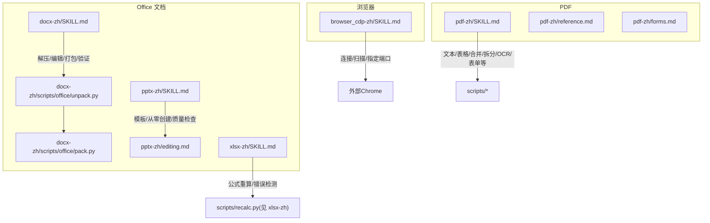
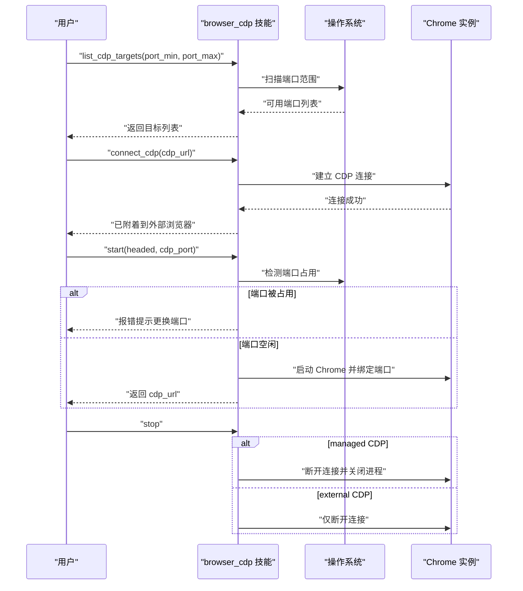
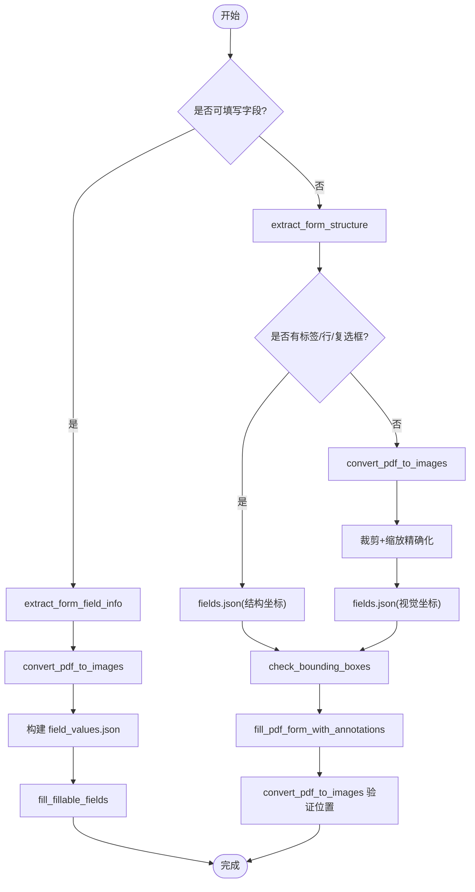
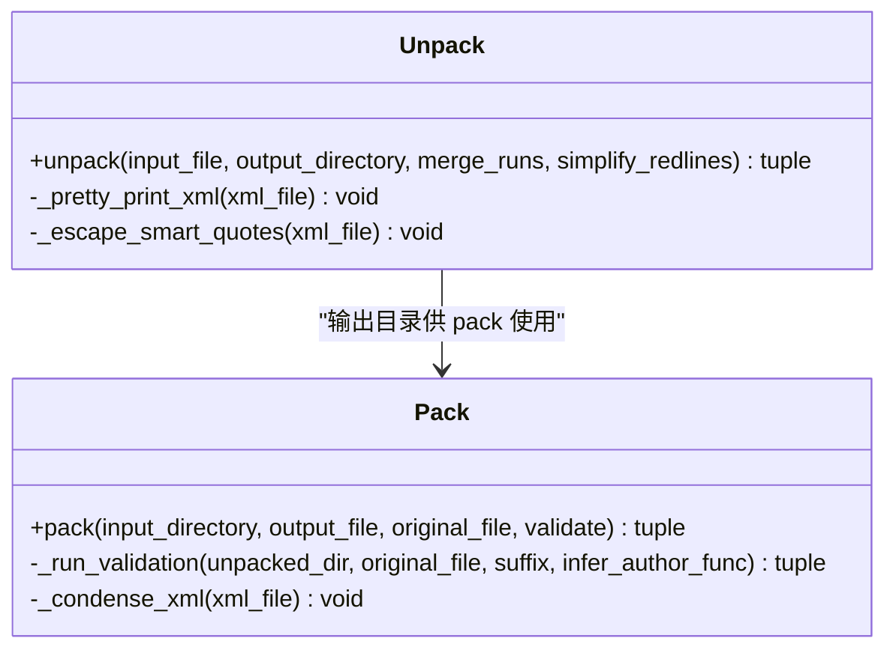
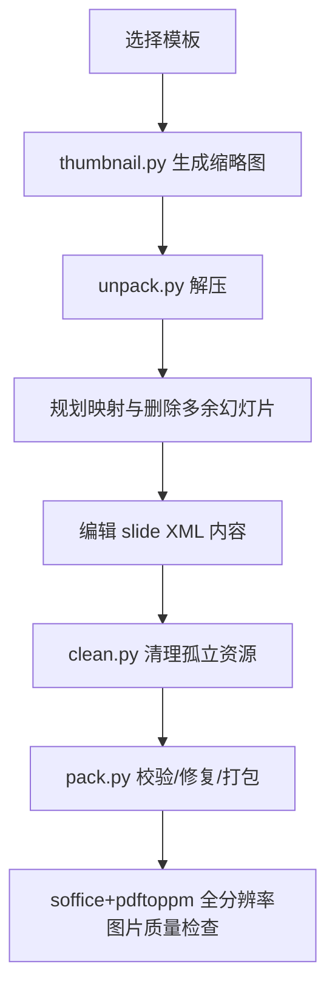
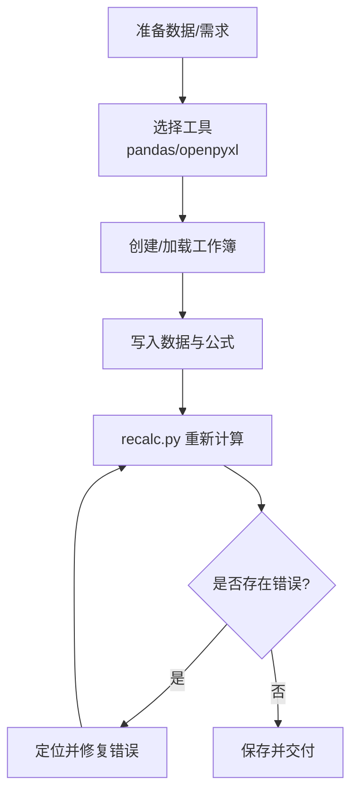
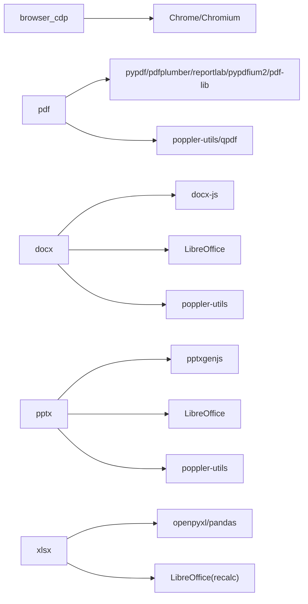

# 内置技能详解

<cite>
**本文引用的文件**   
- [browser_cdp-zh/SKILL.md](file://src/qwenpaw/agents/skills/browser_cdp-zh/SKILL.md)
- [pdf-zh/SKILL.md](file://src/qwenpaw/agents/skills/pdf-zh/SKILL.md)
- [pdf-zh/reference.md](file://src/qwenpaw/agents/skills/pdf-zh/reference.md)
- [pdf-zh/forms.md](file://src/qwenpaw/agents/skills/pdf-zh/forms.md)
- [docx-zh/SKILL.md](file://src/qwenpaw/agents/skills/docx-zh/SKILL.md)
- [docx-zh/scripts/office/unpack.py](file://src/qwenpaw/agents/skills/docx-zh/scripts/office/unpack.py)
- [docx-zh/scripts/office/pack.py](file://src/qwenpaw/agents/skills/docx-zh/scripts/office/pack.py)
- [pptx-zh/SKILL.md](file://src/qwenpaw/agents/skills/pptx-zh/SKILL.md)
- [pptx-zh/editing.md](file://src/qwenpaw/agents/skills/pptx-zh/editing.md)
- [xlsx-zh/SKILL.md](file://src/qwenpaw/agents/skills/xlsx-zh/SKILL.md)
</cite>

## 目录
1. [简介](#简介)
2. [项目结构](#项目结构)
3. [核心组件](#核心组件)
4. [架构总览](#架构总览)
5. [详细组件分析](#详细组件分析)
6. [依赖关系分析](#依赖关系分析)
7. [性能与可靠性建议](#性能与可靠性建议)
8. [故障排查指南](#故障排查指南)
9. [结论](#结论)
10. [附录：常用命令与参数速查](#附录常用命令与参数速查)

## 简介
本文件系统化梳理 QwenPaw 的内置技能，重点覆盖浏览器控制、文档处理（Word/PPT/Excel）与 PDF 操作三大类。内容包含功能特性、使用模式、配置选项、调用关系、接口约定、常见问题与解决方案，并提供面向初学者的渐进式说明与面向开发者的技术细节。

## 项目结构
QwenPaw 的内置技能以“技能包”形式组织在 agents/skills 目录下，每个技能包包含 SKILL.md（使用说明）、可选参考文档与脚本工具。本文聚焦以下技能：
- 浏览器 CDP：browser_cdp-zh
- PDF 处理：pdf-zh（含 reference.md、forms.md）
- Word 文档：docx-zh（含 scripts/office/unpack.py、pack.py）
- 演示文稿：pptx-zh（含 editing.md）
- 电子表格：xlsx-zh

图表来源
- [browser_cdp-zh/SKILL.md:1-205](file://src/qwenpaw/agents/skills/browser_cdp-zh/SKILL.md#L1-L205)
- [pdf-zh/SKILL.md:1-330](file://src/qwenpaw/agents/skills/pdf-zh/SKILL.md#L1-L330)
- [pdf-zh/reference.md:1-613](file://src/qwenpaw/agents/skills/pdf-zh/reference.md#L1-L613)
- [pdf-zh/forms.md:1-299](file://src/qwenpaw/agents/skills/pdf-zh/forms.md#L1-L299)
- [docx-zh/SKILL.md:1-488](file://src/qwenpaw/agents/skills/docx-zh/SKILL.md#L1-L488)
- [docx-zh/scripts/office/unpack.py:1-133](file://src/qwenpaw/agents/skills/docx-zh/scripts/office/unpack.py#L1-L133)
- [docx-zh/scripts/office/pack.py:1-160](file://src/qwenpaw/agents/skills/docx-zh/scripts/office/pack.py#L1-L160)
- [pptx-zh/SKILL.md:1-239](file://src/qwenpaw/agents/skills/pptx-zh/SKILL.md#L1-L239)
- [pptx-zh/editing.md:1-210](file://src/qwenpaw/agents/skills/pptx-zh/editing.md#L1-L210)
- [xlsx-zh/SKILL.md:1-307](file://src/qwenpaw/agents/skills/xlsx-zh/SKILL.md#L1-L307)

章节来源
- [browser_cdp-zh/SKILL.md:1-205](file://src/qwenpaw/agents/skills/browser_cdp-zh/SKILL.md#L1-L205)
- [pdf-zh/SKILL.md:1-330](file://src/qwenpaw/agents/skills/pdf-zh/SKILL.md#L1-L330)
- [docx-zh/SKILL.md:1-488](file://src/qwenpaw/agents/skills/docx-zh/SKILL.md#L1-L488)
- [pptx-zh/SKILL.md:1-239](file://src/qwenpaw/agents/skills/pptx-zh/SKILL.md#L1-L239)
- [xlsx-zh/SKILL.md:1-307](file://src/qwenpaw/agents/skills/xlsx-zh/SKILL.md#L1-L307)

## 核心组件
本节概述各内置技能的能力边界、典型场景与关键参数。

- 浏览器 CDP（browser_cdp）
  - 能力：扫描本地 CDP 端口、连接已有 Chrome、显式指定 cdp_port 启动、多 agent 共享同一浏览器实例。
  - 关键参数：action（list_cdp_targets/connect_cdp/start/stop）、cdp_url、port/port_min/port_max、headed、private_mode、cdp_port。
  - 行为差异：QwenPaw 自启 managed CDP 的 stop 会关闭进程；外部 CDP 的 stop 仅断开连接不关闭外部浏览器。
  - 适用场景：用户明确要求连接现有浏览器、固定调试端口或共享浏览器时。

- PDF 处理（pdf）
  - 能力：读取/提取文本与表格、合并/拆分/旋转、添加水印、创建新 PDF、填写表单、加密/解密、图片提取、扫描版 OCR。
  - 前置依赖：pypdf、pdfplumber、reportlab、poppler-utils（pdftotext/pdftoppm）、qpdf；高级参考含 pypdfium2、pdf-lib、pdfjs-dist。
  - 表单填写：支持可填写字段与不可填写字段两种路径，提供结构化坐标与视觉估算混合方法。

- Word 文档（docx）
  - 能力：创建/读取/编辑 .docx，修订与批注处理，插入/替换图片，查找替换，生成专业格式文档。
  - 工作流：解压 → 编辑 XML → 清理 → 打包验证；依赖 docx-js、LibreOffice、pandoc、poppler-utils。
  - 关键脚本：unpack.py（解压/格式化/智能引号转义/修订简化）、pack.py（校验/自动修复/压缩/打包）。

- 演示文稿（pptx）
  - 能力：基于模板编辑、从零创建、缩略图预览、质量检查（内容+视觉）、转换为图片进行审查。
  - 依赖：markitdown[pptx]、pptxgenjs、LibreOffice、poppler-utils。
  - 工作流：thumbnail → unpack → 编辑 slide XML → clean → pack。

- 电子表格（xlsx）
  - 能力：创建/编辑/修复 .xlsx/.xlsm/.csv/.tsv，数据清洗与重构，公式与格式规范。
  - 关键要求：必须使用 Excel 公式而非硬编码值；通过 recalc.py 重新计算并检测错误。
  - 颜色与数字格式：遵循财务模型标准（输入/公式/链接/外部引用/高亮假设等）。

章节来源
- [browser_cdp-zh/SKILL.md:1-205](file://src/qwenpaw/agents/skills/browser_cdp-zh/SKILL.md#L1-L205)
- [pdf-zh/SKILL.md:1-330](file://src/qwenpaw/agents/skills/pdf-zh/SKILL.md#L1-L330)
- [pdf-zh/reference.md:1-613](file://src/qwenpaw/agents/skills/pdf-zh/reference.md#L1-L613)
- [pdf-zh/forms.md:1-299](file://src/qwenpaw/agents/skills/pdf-zh/forms.md#L1-L299)
- [docx-zh/SKILL.md:1-488](file://src/qwenpaw/agents/skills/docx-zh/SKILL.md#L1-L488)
- [pptx-zh/SKILL.md:1-239](file://src/qwenpaw/agents/skills/pptx-zh/SKILL.md#L1-L239)
- [xlsx-zh/SKILL.md:1-307](file://src/qwenpaw/agents/skills/xlsx-zh/SKILL.md#L1-L307)

## 架构总览
下图展示浏览器 CDP 与 Office/PDF 技能之间的协作关系与数据流向。

```mermaid
graph TB
User["用户意图"] --> Router["技能路由<br/>browser_cdp / pdf / docx / pptx / xlsx"]
Router --> Browser["browser_cdp 技能"]
Router --> PDF["pdf 技能"]
Router --> DOCX["docx 技能"]
Router --> PPTX["pptx 技能"]
Router --> XLSX["xlsx 技能"]
Browser --> Chrome["本地/远程 Chrome 实例"]
PDF --> PDFScripts["scripts/* (pypdf/pdfplumber/reportlab/poppler/qpdf)"]
DOCX --> Unpack["unpack.py"]
Unpack --> EditXML["编辑 XML"]
EditXML --> Pack["pack.py"]
PPTX --> Thumbnail["thumbnail.py"]
Thumbnail --> EditSlide["编辑 slide XML"]
EditSlide --> Clean["clean.py"]
Clean --> PackPPTX["pack.py"]
XLSX --> Recalc["recalc.py"]
```

图表来源
- [browser_cdp-zh/SKILL.md:1-205](file://src/qwenpaw/agents/skills/browser_cdp-zh/SKILL.md#L1-L205)
- [pdf-zh/SKILL.md:1-330](file://src/qwenpaw/agents/skills/pdf-zh/SKILL.md#L1-L330)
- [docx-zh/scripts/office/unpack.py:1-133](file://src/qwenpaw/agents/skills/docx-zh/scripts/office/unpack.py#L1-L133)
- [docx-zh/scripts/office/pack.py:1-160](file://src/qwenpaw/agents/skills/docx-zh/scripts/office/pack.py#L1-L160)
- [pptx-zh/SKILL.md:1-239](file://src/qwenpaw/agents/skills/pptx-zh/SKILL.md#L1-L239)
- [xlsx-zh/SKILL.md:1-307](file://src/qwenpaw/agents/skills/xlsx-zh/SKILL.md#L1-L307)

## 详细组件分析

### 浏览器 CDP 技能
- 何时进入该技能
  - 用户明确表达“连接已有浏览器/扫描端口/指定端口/共享浏览器/远程调试”。
  - 普通“打开浏览器/可见窗口”应优先使用 browser_visible。
- 关键动作与参数
  - list_cdp_targets：port/port_min/port_max
  - connect_cdp：cdp_url
  - start：headed/cdp_port/private_mode
  - stop：区分 managed CDP（关闭进程）与 external CDP（仅断开）
- 多 workspace 与端口策略
  - 显式端口：先检测占用，冲突则失败
  - 未显式端口：自动选空闲端口降低冲突概率
- 隐私与安全
  - 建议 private_mode=true 避免暴露历史/Cookies/会话
  - 外部 CDP 的 idle auto-stop 语义为“自动断开”，非“自动关闭外部浏览器”

图表来源
- [browser_cdp-zh/SKILL.md:1-205](file://src/qwenpaw/agents/skills/browser_cdp-zh/SKILL.md#L1-L205)

章节来源
- [browser_cdp-zh/SKILL.md:1-205](file://src/qwenpaw/agents/skills/browser_cdp-zh/SKILL.md#L1-L205)

### PDF 处理技能
- 能力矩阵
  - 基础：合并/拆分/旋转/元数据/加密解密
  - 文本与表格：pdfplumber 布局感知提取、表格识别
  - 创建：reportlab Canvas/Platypus
  - 命令行：pdftotext、pdftoppm、qpdf
  - 高级：pypdfium2 渲染、pdf-lib 修改、pdfjs-dist 解析
  - 表单：可填写字段与不可填写字段两类流程
- 表单填写流程（概览）
  - 可填写字段：extract_form_field_info → convert_pdf_to_images → field_values.json → fill_fillable_fields
  - 不可填写字段：extract_form_structure → fields.json（结构坐标）或 convert_pdf_to_images + 缩放精确化（视觉坐标）→ check_bounding_boxes → fill_pdf_form_with_annotations → 验证输出

图表来源
- [pdf-zh/forms.md:1-299](file://src/qwenpaw/agents/skills/pdf-zh/forms.md#L1-L299)
- [pdf-zh/SKILL.md:1-330](file://src/qwenpaw/agents/skills/pdf-zh/SKILL.md#L1-L330)
- [pdf-zh/reference.md:1-613](file://src/qwenpaw/agents/skills/pdf-zh/reference.md#L1-L613)

章节来源
- [pdf-zh/SKILL.md:1-330](file://src/qwenpaw/agents/skills/pdf-zh/SKILL.md#L1-L330)
- [pdf-zh/reference.md:1-613](file://src/qwenpaw/agents/skills/pdf-zh/reference.md#L1-L613)
- [pdf-zh/forms.md:1-299](file://src/qwenpaw/agents/skills/pdf-zh/forms.md#L1-L299)

### Word 文档（DOCX）技能
- 工作流
  - 解压：unpack.py（ZIP 解压、XML 美化、智能引号转义、可选合并 run/简化修订）
  - 编辑：直接编辑 word/*.xml（段落、表格、图片、修订、批注）
  - 清理与打包：pack.py（校验 schema/修订、自动修复、压缩、打包）
- 关键脚本
  - unpack.py：入口函数 unpack(input_file, output_directory, merge_runs, simplify_redlines)
  - pack.py：入口函数 pack(input_directory, output_file, original_file, validate)

图表来源
- [docx-zh/scripts/office/unpack.py:1-133](file://src/qwenpaw/agents/skills/docx-zh/scripts/office/unpack.py#L1-L133)
- [docx-zh/scripts/office/pack.py:1-160](file://src/qwenpaw/agents/skills/docx-zh/scripts/office/pack.py#L1-L160)

章节来源
- [docx-zh/SKILL.md:1-488](file://src/qwenpaw/agents/skills/docx-zh/SKILL.md#L1-L488)
- [docx-zh/scripts/office/unpack.py:1-133](file://src/qwenpaw/agents/skills/docx-zh/scripts/office/unpack.py#L1-L133)
- [docx-zh/scripts/office/pack.py:1-160](file://src/qwenpaw/agents/skills/docx-zh/scripts/office/pack.py#L1-L160)

### 演示文稿（PPTX）技能
- 工作流
  - 模板分析：thumbnail.py 生成缩略图网格，markitdown 提取文本定位占位符
  - 解包/编辑：unpack.py → 编辑 slide XML（标题加粗、列表、智能引号实体）→ clean.py
  - 打包：pack.py 校验与修复
- 设计原则
  - 配色主次分明、明暗对比、统一视觉主题
  - 每张幻灯片需有视觉元素，避免纯文本
  - 字体排版与间距规范，避免常见错误

图表来源
- [pptx-zh/SKILL.md:1-239](file://src/qwenpaw/agents/skills/pptx-zh/SKILL.md#L1-L239)
- [pptx-zh/editing.md:1-210](file://src/qwenpaw/agents/skills/pptx-zh/editing.md#L1-L210)

章节来源
- [pptx-zh/SKILL.md:1-239](file://src/qwenpaw/agents/skills/pptx-zh/SKILL.md#L1-L239)
- [pptx-zh/editing.md:1-210](file://src/qwenpaw/agents/skills/pptx-zh/editing.md#L1-L210)

### 电子表格（XLSX）技能
- 核心要求
  - 必须使用 Excel 公式，禁止 Python 中计算后硬编码
  - 交付前使用 recalc.py 重新计算并检测错误（#REF!/#DIV/0!/#VALUE!/#NAME? 等）
- 最佳实践
  - pandas 用于数据处理，openpyxl 用于公式/格式
  - 列宽、对齐、样式、注释与数据来源记录
  - 财务模型颜色编码与数字格式规范

图表来源
- [xlsx-zh/SKILL.md:1-307](file://src/qwenpaw/agents/skills/xlsx-zh/SKILL.md#L1-L307)

章节来源
- [xlsx-zh/SKILL.md:1-307](file://src/qwenpaw/agents/skills/xlsx-zh/SKILL.md#L1-L307)

## 依赖关系分析
- 浏览器 CDP
  - 依赖：Playwright/CDP、系统 Chrome/Chromium
  - 耦合点：workspace 内单浏览器实例约束、端口占用检测
- PDF
  - 依赖：Python 库（pypdf、pdfplumber、reportlab、pypdfium2、pdf-lib）、命令行工具（poppler-utils、qpdf）
  - 耦合点：表单填写脚本链（extract/check/fill/verify）
- DOCX/PPTX
  - 依赖：docx-js、pptxgenjs、LibreOffice、poppler-utils、markitdown
  - 耦合点：unpack/pack 校验与自动修复、XML 命名空间与实体转义
- XLSX
  - 依赖：openpyxl、pandas、LibreOffice（recalc.py）
  - 耦合点：公式重算与错误报告 JSON 结构

图表来源
- [browser_cdp-zh/SKILL.md:1-205](file://src/qwenpaw/agents/skills/browser_cdp-zh/SKILL.md#L1-L205)
- [pdf-zh/SKILL.md:1-330](file://src/qwenpaw/agents/skills/pdf-zh/SKILL.md#L1-L330)
- [pdf-zh/reference.md:1-613](file://src/qwenpaw/agents/skills/pdf-zh/reference.md#L1-L613)
- [docx-zh/SKILL.md:1-488](file://src/qwenpaw/agents/skills/docx-zh/SKILL.md#L1-L488)
- [pptx-zh/SKILL.md:1-239](file://src/qwenpaw/agents/skills/pptx-zh/SKILL.md#L1-L239)
- [xlsx-zh/SKILL.md:1-307](file://src/qwenpaw/agents/skills/xlsx-zh/SKILL.md#L1-L307)

章节来源
- [pdf-zh/reference.md:1-613](file://src/qwenpaw/agents/skills/pdf-zh/reference.md#L1-L613)
- [docx-zh/SKILL.md:1-488](file://src/qwenpaw/agents/skills/docx-zh/SKILL.md#L1-L488)
- [pptx-zh/SKILL.md:1-239](file://src/qwenpaw/agents/skills/pptx-zh/SKILL.md#L1-L239)
- [xlsx-zh/SKILL.md:1-307](file://src/qwenpaw/agents/skills/xlsx-zh/SKILL.md#L1-L307)

## 性能与可靠性建议
- 浏览器 CDP
  - 避免不必要的端口暴露；优先 managed CDP 与 private_mode
  - 多 workspace 并发时尽量不显式指定端口，减少冲突
- PDF
  - 大文件分块处理；优先 pdftotext/pdfimages 快速路径
  - 表单填写前先 check_bounding_boxes，避免重叠与过小输入框
- DOCX/PPTX
  - 使用 pack.py 的自动修复能力；必要时跳过验证再手动修复
  - 批量并行编辑独立 slide XML 提升效率
- XLSX
  - 优先 openpyxl 写公式，recalc.py 统一重算与错误检测
  - 大文件读写使用 read_only/write_only 模式

[本节为通用指导，无需具体文件来源]

## 故障排查指南
- 浏览器 CDP
  - 端口占用：显式 cdp_port 冲突时报错，需更换端口或停止旧实例
  - 外部 CDP stop 不关闭浏览器：属预期行为，如需关闭请自行管理外部进程
- PDF
  - 加密/损坏：使用 qpdf --check/--fix-qdf 修复；受密码保护需先解密
  - 文本提取异常：回退 OCR（pdf2image + pytesseract）
- DOCX/PPTX
  - XML 解析问题：确保使用 defusedxml.minidom；注意命名空间与实体转义
  - 智能引号：Edit 工具可能转 ASCII，需在 XML 中使用实体
- XLSX
  - 公式错误：依据 recalc.py 输出的 JSON 定位 #REF!/#DIV/0!/#VALUE!/#NAME? 并修复
  - 列索引偏移：DataFrame 第 N 行对应 Excel 第 N+1 行

章节来源
- [browser_cdp-zh/SKILL.md:1-205](file://src/qwenpaw/agents/skills/browser_cdp-zh/SKILL.md#L1-L205)
- [pdf-zh/reference.md:1-613](file://src/qwenpaw/agents/skills/pdf-zh/reference.md#L1-L613)
- [docx-zh/SKILL.md:1-488](file://src/qwenpaw/agents/skills/docx-zh/SKILL.md#L1-L488)
- [xlsx-zh/SKILL.md:1-307](file://src/qwenpaw/agents/skills/xlsx-zh/SKILL.md#L1-L307)

## 结论
QwenPaw 的内置技能围绕浏览器控制与文档处理两大主线，提供了从入门到进阶的完整工作流与工具链。通过明确的触发条件、参数约定与脚本化工具，既能满足日常自动化需求，也能为复杂场景提供可扩展的基础。建议在团队内统一遵循各技能的“前置依赖—工作流—质量检查”范式，以获得稳定高效的产出。

[本节为总结性内容，无需具体文件来源]

## 附录：常用命令与参数速查
- 浏览器 CDP
  - list_cdp_targets：port/port_min/port_max
  - connect_cdp：cdp_url
  - start：headed/cdp_port/private_mode
  - stop：managed vs external 行为不同
- PDF
  - 文本/表格：pdfplumber；创建：reportlab；命令行：pdftotext/pdftoppm/qpdf
  - 表单：extract_form_field_info/extract_form_structure/convert_pdf_to_images/check_bounding_boxes/fill_fillable_fields/fill_pdf_form_with_annotations
- DOCX
  - unpack.py：input_file/output_directory/merge-runs/simplify-redlines
  - pack.py：input_directory/output_file/original/validate
- PPTX
  - thumbnail.py：input.pptx/[output_prefix]/--cols N
  - add_slide.py：unpacked/slideN.xml 或 layout
  - clean.py：unpacked/
  - pack.py：unpacked/output.pptx --original input.pptx
- XLSX
  - recalc.py：<excel_file> [timeout_seconds]

章节来源
- [browser_cdp-zh/SKILL.md:1-205](file://src/qwenpaw/agents/skills/browser_cdp-zh/SKILL.md#L1-L205)
- [pdf-zh/forms.md:1-299](file://src/qwenpaw/agents/skills/pdf-zh/forms.md#L1-L299)
- [docx-zh/scripts/office/unpack.py:1-133](file://src/qwenpaw/agents/skills/docx-zh/scripts/office/unpack.py#L1-L133)
- [docx-zh/scripts/office/pack.py:1-160](file://src/qwenpaw/agents/skills/docx-zh/scripts/office/pack.py#L1-L160)
- [pptx-zh/editing.md:1-210](file://src/qwenpaw/agents/skills/pptx-zh/editing.md#L1-L210)
- [xlsx-zh/SKILL.md:1-307](file://src/qwenpaw/agents/skills/xlsx-zh/SKILL.md#L1-L307)