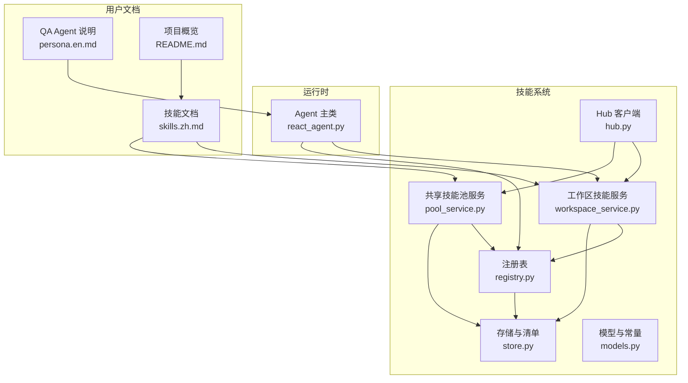
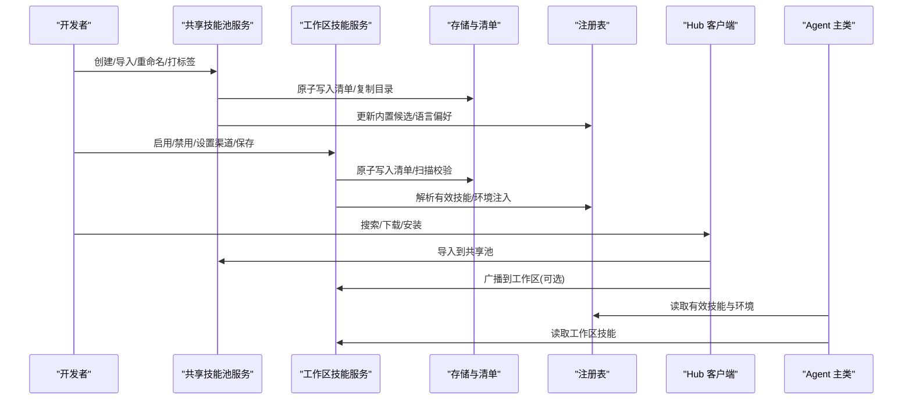
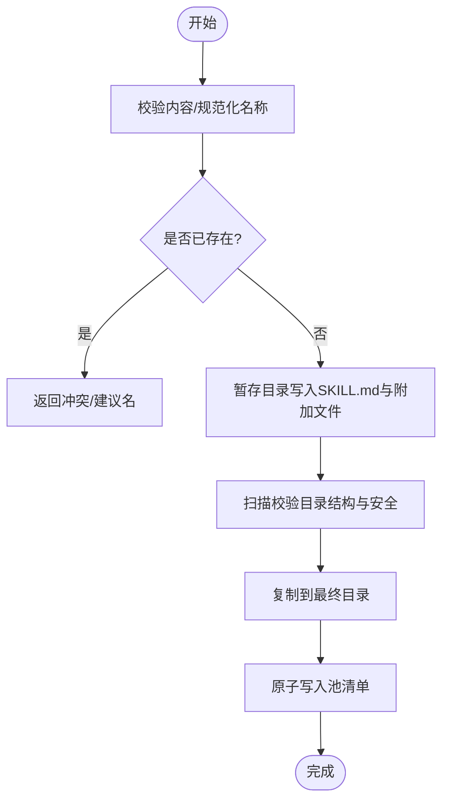
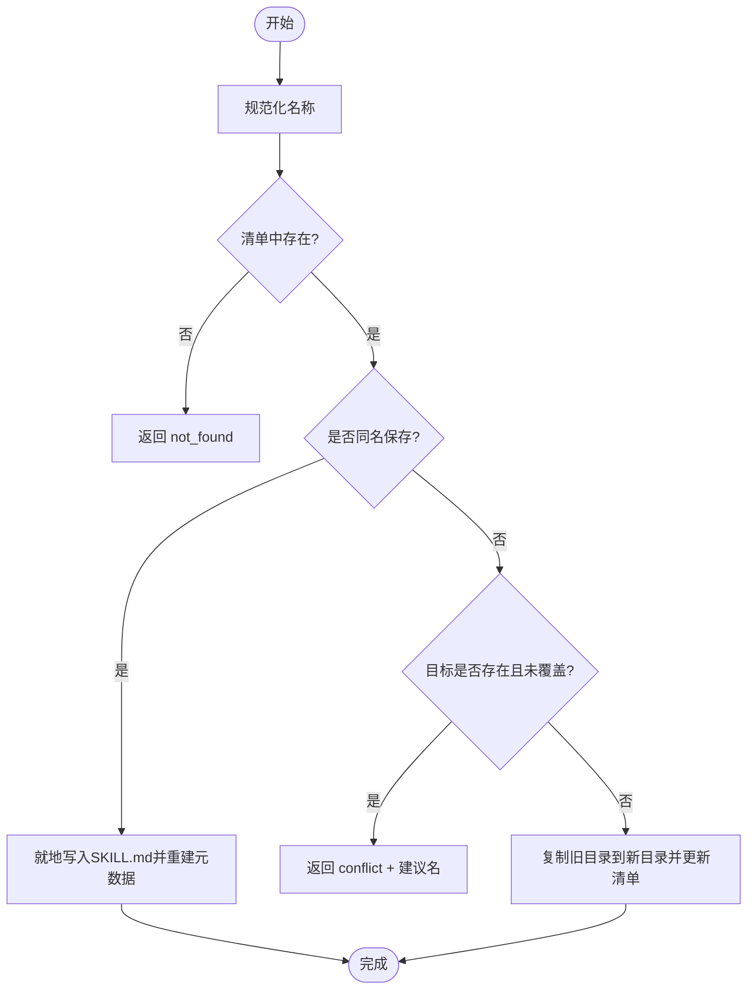
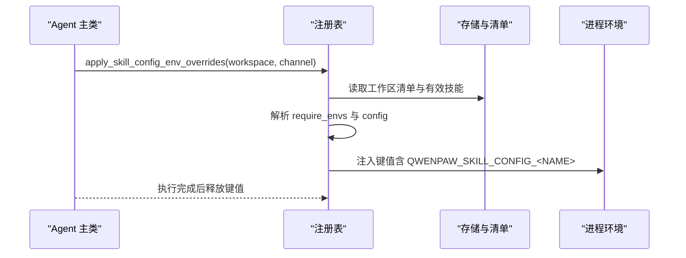
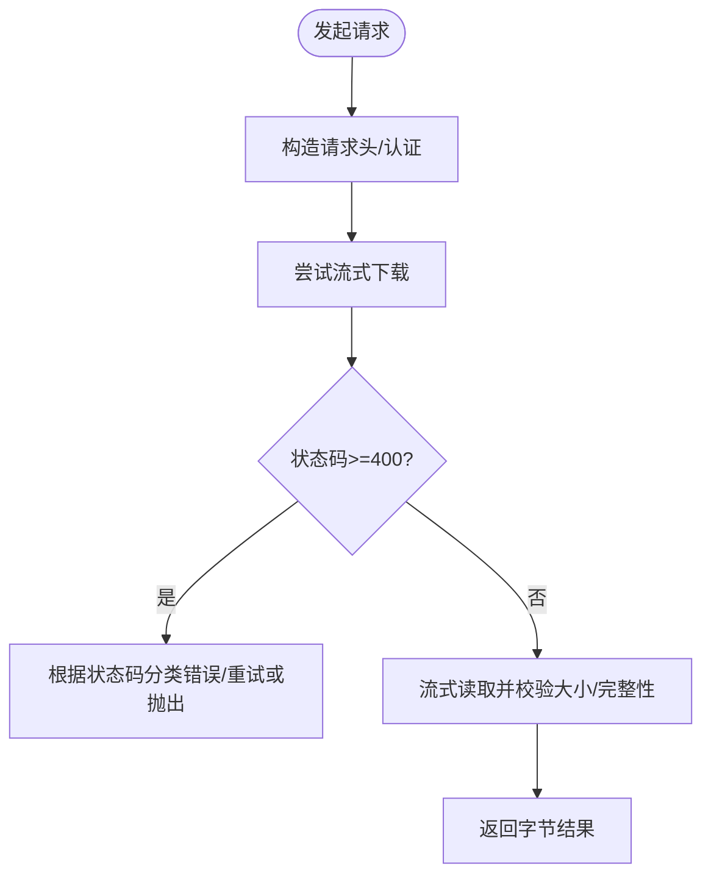
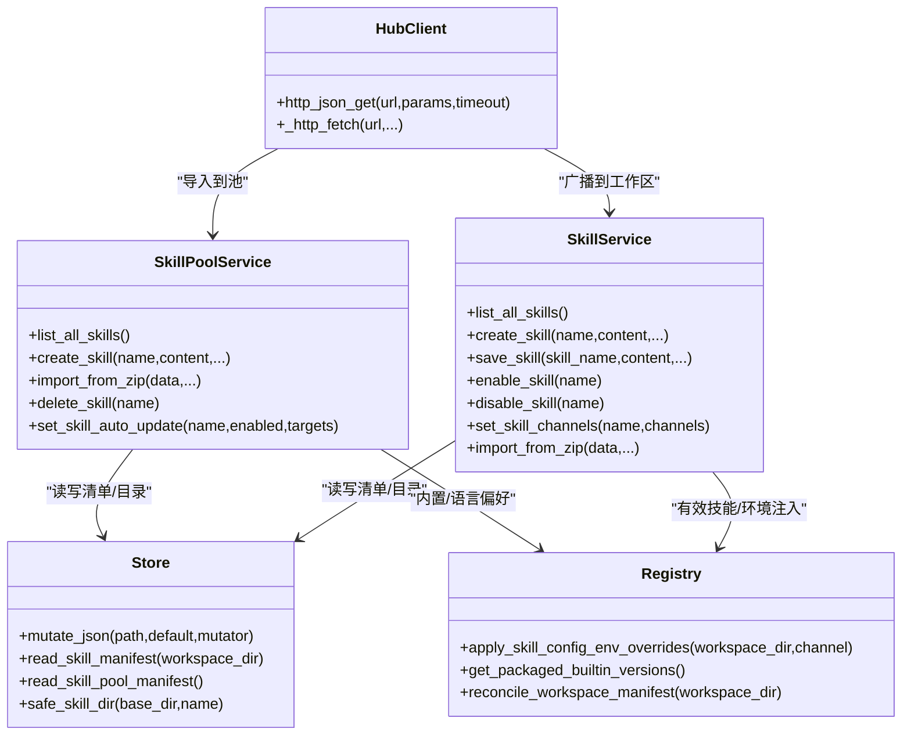

# 开发辅助技能

<cite>
**本文引用的文件**   
- [README.md](file://README.md)
- [skills.zh.md](file://website/public/docs/skills.zh.md)
- [persona.en.md](file://website/public/docs/persona.en.md)
- [skill_system/__init__.py](file://src/qwenpaw/agents/skill_system/__init__.py)
- [skill_system/models.py](file://src/qwenpaw/agents/skill_system/models.py)
- [skill_system/store.py](file://src/qwenpaw/agents/skill_system/store.py)
- [skill_system/registry.py](file://src/qwenpaw/agents/skill_system/registry.py)
- [skill_system/pool_service.py](file://src/qwenpaw/agents/skill_system/pool_service.py)
- [skill_system/workspace_service.py](file://src/qwenpaw/agents/skill_system/workspace_service.py)
- [skill_system/hub.py](file://src/qwenpaw/agents/skill_system/hub.py)
- [react_agent.py](file://src/qwenpaw/agents/react_agent.py)
</cite>

## 目录
1. [简介](#简介)
2. [项目结构](#项目结构)
3. [核心组件](#核心组件)
4. [架构总览](#架构总览)
5. [详细组件分析](#详细组件分析)
6. [依赖关系分析](#依赖关系分析)
7. [性能与可扩展性](#性能与可扩展性)
8. [故障排查指南](#故障排查指南)
9. [结论](#结论)
10. [附录：配置项与接口速查](#附录：配置项与接口速查)

## 简介
本文件面向 QwenPaw 的“开发辅助技能”主题，聚焦两类能力：
- 技能开发与工具链：如何创建、管理、发布和同步技能（Skill），包括技能池与工作区副本的关系、冲突处理、自动更新、环境注入等。
- 问题解答索引技能：内置 QA_source_index 技能及其在 QA Agent 中的使用方式，帮助快速定位源码与文档。

内容覆盖功能特性、使用方法、配置选项、调用关系、数据流、错误处理与性能要点，并提供来自代码库的具体示例路径，便于初学者上手与资深开发者深入定制。

## 项目结构
QwenPaw 的技能系统位于 agents/skill_system 下，围绕“共享技能池 + 工作区本地副本”的双层模型组织；同时提供 Hub 客户端用于从市场或远程源安装技能。

图示来源
- [skill_system/registry.py:1-120](file://src/qwenpaw/agents/skill_system/registry.py#L1-L120)
- [skill_system/store.py:1-120](file://src/qwenpaw/agents/skill_system/store.py#L1-L120)
- [skill_system/pool_service.py:120-200](file://src/qwenpaw/agents/skill_system/pool_service.py#L120-L200)
- [skill_system/workspace_service.py:88-145](file://src/qwenpaw/agents/skill_system/workspace_service.py#L88-L145)
- [skill_system/hub.py:1-120](file://src/qwenpaw/agents/skill_system/hub.py#L1-L120)
- [react_agent.py:1-48](file://src/qwenpaw/agents/react_agent.py#L1-L48)
- [skills.zh.md:1-118](file://website/public/docs/skills.zh.md#L1-L118)
- [persona.en.md:202-230](file://website/public/docs/persona.en.md#L202-L230)
- [README.md:397-430](file://README.md#L397-L430)

章节来源
- [README.md:397-430](file://README.md#L397-L430)
- [skills.zh.md:1-118](file://website/public/docs/skills.zh.md#L1-L118)

## 核心组件
- 模型与常量
  - SkillInfo、SkillRequirements、ALL_SKILL_ROUTING_CHANNELS 等数据结构定义，统一对外返回信息。
- 存储与清单
  - 负责 skill_pool 与工作区的 manifest 读写、原子写入、跨进程锁、zip 导入校验、安全路径检查、元数据构建等。
- 注册表
  - 内置技能发现与语言偏好选择、环境变量注入、工作区清单协调、有效技能解析等。
- 共享技能池服务
  - 创建/导入/删除/重命名/标签/自动更新等共享池生命周期操作。
- 工作区技能服务
  - 工作区内技能的创建、保存（就地编辑或改名）、启用/禁用、渠道路由、配置持久化、Zip 导入等。
- Hub 客户端
  - 从技能市场/URL/GitHub 等源搜索、下载、安装技能，支持重试、退避、取消、大小限制等。
- Agent 集成
  - Agent 主类通过注册表与服务获取并应用技能与环境变量。

章节来源
- [skill_system/models.py:1-81](file://src/qwenpaw/agents/skill_system/models.py#L1-L81)
- [skill_system/store.py:1-120](file://src/qwenpaw/agents/skill_system/store.py#L1-L120)
- [skill_system/registry.py:1-120](file://src/qwenpaw/agents/skill_system/registry.py#L1-L120)
- [skill_system/pool_service.py:120-200](file://src/qwenpaw/agents/skill_system/pool_service.py#L120-L200)
- [skill_system/workspace_service.py:88-145](file://src/qwenpaw/agents/skill_system/workspace_service.py#L88-L145)
- [skill_system/hub.py:1-120](file://src/qwenpaw/agents/skill_system/hub.py#L1-L120)
- [react_agent.py:1-48](file://src/qwenpaw/agents/react_agent.py#L1-L48)

## 架构总览
技能系统采用“双层目录 + 清单驱动”的设计：
- 共享技能池：$WORKING_DIR/skill_pool，存放可复用的共享技能与内置技能镜像。
- 工作区副本：$WORKING_DIR/workspaces/{agent_id}/skills，真正被 Agent 使用的本地副本。
- 清单文件：skill_pool/skill.json 与 workspaces/*/skill.json 记录状态、来源、配置、渠道路由等。
- 注册表与存储服务：负责解析、校验、合并、持久化与并发安全。
- Hub 客户端：提供远程安装能力，支持多种来源与网络容错。

图示来源
- [skill_system/pool_service.py:120-200](file://src/qwenpaw/agents/skill_system/pool_service.py#L120-L200)
- [skill_system/workspace_service.py:88-145](file://src/qwenpaw/agents/skill_system/workspace_service.py#L88-L145)
- [skill_system/store.py:384-395](file://src/qwenpaw/agents/skill_system/store.py#L384-L395)
- [skill_system/registry.py:347-392](file://src/qwenpaw/agents/skill_system/registry.py#L347-L392)
- [skill_system/hub.py:378-403](file://src/qwenpaw/agents/skill_system/hub.py#L378-L403)
- [react_agent.py:1-48](file://src/qwenpaw/agents/react_agent.py#L1-L48)

## 详细组件分析

### 组件一：共享技能池服务（SkillPoolService）
职责
- 在共享池中创建、导入、删除、重命名、打标签、设置自动更新目标。
- 维护 pool 清单与目录一致性，提供冲突检测与建议名生成。
- 支持将工作区技能上传至池子，或将池技能广播到多个工作区。

关键流程（创建技能）

图示来源
- [skill_system/pool_service.py:162-235](file://src/qwenpaw/agents/skill_system/pool_service.py#L162-L235)
- [skill_system/store.py:384-395](file://src/qwenpaw/agents/skill_system/store.py#L384-L395)

章节来源
- [skill_system/pool_service.py:120-200](file://src/qwenpaw/agents/skill_system/pool_service.py#L120-L200)
- [skill_system/store.py:384-395](file://src/qwenpaw/agents/skill_system/store.py#L384-L395)

### 组件二：工作区技能服务（SkillService）
职责
- 在工作区内创建、保存（就地编辑或改名）、启用/禁用、设置渠道路由、保存配置。
- Zip 导入与冲突检测，支持一键启用。
- 删除仅允许未启用的技能，避免破坏运行态。

关键流程（保存技能）

图示来源
- [skill_system/workspace_service.py:229-284](file://src/qwenpaw/agents/skill_system/workspace_service.py#L229-L284)
- [skill_system/workspace_service.py:286-372](file://src/qwenpaw/agents/skill_system/workspace_service.py#L286-L372)
- [skill_system/workspace_service.py:374-442](file://src/qwenpaw/agents/skill_system/workspace_service.py#L374-L442)

章节来源
- [skill_system/workspace_service.py:88-145](file://src/qwenpaw/agents/skill_system/workspace_service.py#L88-L145)
- [skill_system/workspace_service.py:229-284](file://src/qwenpaw/agents/skill_system/workspace_service.py#L229-L284)

### 组件三：注册表与内置技能（Registry）
职责
- 内置技能发现与语言偏好选择（en/zh）。
- 将工作区清单与内置版本进行协调，识别 missing/outdated/conflict。
- 将技能配置映射为环境变量注入，供技能执行时使用。

关键流程（环境变量注入）

图示来源
- [skill_system/registry.py:347-392](file://src/qwenpaw/agents/skill_system/registry.py#L347-L392)
- [skill_system/registry.py:248-306](file://src/qwenpaw/agents/skill_system/registry.py#L248-L306)

章节来源
- [skill_system/registry.py:1-120](file://src/qwenpaw/agents/skill_system/registry.py#L1-L120)
- [skill_system/registry.py:347-392](file://src/qwenpaw/agents/skill_system/registry.py#L347-L392)

### 组件四：Hub 客户端（Skills Hub）
职责
- 从技能市场/URL/GitHub 等源搜索、下载、安装技能。
- 支持 HTTP 重试、退避、取消、大小限制、速率限制提示。
- 提供 http_json_get 公共 API 给市场提供方复用。

关键流程（HTTP 请求与重试）

图示来源
- [skill_system/hub.py:378-403](file://src/qwenpaw/agents/skill_system/hub.py#L378-L403)
- [skill_system/hub.py:472-603](file://src/qwenpaw/agents/skill_system/hub.py#L472-L603)

章节来源
- [skill_system/hub.py:1-120](file://src/qwenpaw/agents/skill_system/hub.py#L1-L120)
- [skill_system/hub.py:378-403](file://src/qwenpaw/agents/skill_system/hub.py#L378-L403)

### 组件五：QA 问题解答索引技能（QA_source_index）
功能特性
- 专为回答 QwenPaw 相关问题设计，预装 guidance 与 QA_source_index 技能以检索源码与文档。
- 默认仅启用核心工具，其他内置工具关闭，降低误用风险。
- 可在控制台右上角智能体切换器中选择 QA Agent 直接提问。

使用模式
- 在控制台选择 QA Agent，输入关于 QwenPaw 的问题即可得到基于本地文档与源码的快速答案。
- 可通过工作区技能页面调整其启用的技能与工具。

章节来源
- [persona.en.md:202-230](file://website/public/docs/persona.en.md#L202-L230)
- [skills.zh.md:70-118](file://website/public/docs/skills.zh.md#L70-L118)

## 依赖关系分析
- 组件耦合
  - 共享技能池与工作区服务均依赖存储与清单模块，保证一致性与并发安全。
  - 注册表对内置技能与语言偏好有强依赖，影响工作区清单协调与环境注入。
  - Hub 客户端通过共享技能池与工作区服务落地安装结果。
- 外部依赖
  - httpx 异步客户端、frontmatter/yaml 解析、zip 解压、文件系统锁等。
- 潜在循环依赖
  - 各模块通过明确接口解耦，未见明显循环依赖。

图示来源
- [skill_system/pool_service.py:120-200](file://src/qwenpaw/agents/skill_system/pool_service.py#L120-L200)
- [skill_system/workspace_service.py:88-145](file://src/qwenpaw/agents/skill_system/workspace_service.py#L88-L145)
- [skill_system/registry.py:347-392](file://src/qwenpaw/agents/skill_system/registry.py#L347-L392)
- [skill_system/store.py:384-395](file://src/qwenpaw/agents/skill_system/store.py#L384-L395)
- [skill_system/hub.py:378-403](file://src/qwenpaw/agents/skill_system/hub.py#L378-L403)

章节来源
- [skill_system/pool_service.py:120-200](file://src/qwenpaw/agents/skill_system/pool_service.py#L120-L200)
- [skill_system/workspace_service.py:88-145](file://src/qwenpaw/agents/skill_system/workspace_service.py#L88-L145)
- [skill_system/registry.py:347-392](file://src/qwenpaw/agents/skill_system/registry.py#L347-L392)
- [skill_system/store.py:384-395](file://src/qwenpaw/agents/skill_system/store.py#L384-L395)
- [skill_system/hub.py:378-403](file://src/qwenpaw/agents/skill_system/hub.py#L378-L403)

## 性能与可扩展性
- 并发与一致性
  - 清单写入采用跨进程文件锁与原子替换，避免竞态条件与部分写入。
- I/O 优化
  - 清单读取按 mtime 缓存，减少重复 IO。
  - Hub 客户端使用连接池、超时与重试退避，提升稳定性。
- 可扩展点
  - 额外只读技能根目录通过配置注入，支持多源聚合。
  - 环境变量注入机制允许技能按需声明所需键，灵活扩展。

[本节为通用指导，不直接分析具体文件]

## 故障排查指南
常见问题与解决思路
- 导入冲突
  - 现象：创建/导入时提示已存在并给出建议新名。
  - 处理：采纳建议名或显式覆盖；检查现有清单与目录。
  - 参考路径：[skill_system/pool_service.py:237-351](file://src/qwenpaw/agents/skill_system/pool_service.py#L237-L351)、[skill_system/workspace_service.py:444-552](file://src/qwenpaw/agents/skill_system/workspace_service.py#L444-L552)
- 清单写入失败
  - 现象：文件已创建但清单更新失败，触发回滚。
  - 处理：检查磁盘权限与锁文件；查看异常详情中的 manifest_path。
  - 参考路径：[skill_system/pool_service.py:203-235](file://src/qwenpaw/agents/skill_system/pool_service.py#L203-L235)、[skill_system/workspace_service.py:187-227](file://src/qwenpaw/agents/skill_system/workspace_service.py#L187-L227)
- Hub 网络错误
  - 现象：429 速率限制、5xx 服务器错误、传输中断。
  - 处理：设置 GITHUB_TOKEN 提高限额；调整超时/重试参数；稍后重试。
  - 参考路径：[skill_system/hub.py:534-603](file://src/qwenpaw/agents/skill_system/hub.py#L534-L603)
- 环境变量缺失
  - 现象：技能需要 env 但未提供，日志告警。
  - 处理：在工作区清单中补充对应 config 键，确保匹配 require_envs。
  - 参考路径：[skill_system/registry.py:264-306](file://src/qwenpaw/agents/skill_system/registry.py#L264-L306)

章节来源
- [skill_system/pool_service.py:237-351](file://src/qwenpaw/agents/skill_system/pool_service.py#L237-L351)
- [skill_system/workspace_service.py:444-552](file://src/qwenpaw/agents/skill_system/workspace_service.py#L444-L552)
- [skill_system/pool_service.py:203-235](file://src/qwenpaw/agents/skill_system/pool_service.py#L203-L235)
- [skill_system/workspace_service.py:187-227](file://src/qwenpaw/agents/skill_system/workspace_service.py#L187-L227)
- [skill_system/hub.py:534-603](file://src/qwenpaw/agents/skill_system/hub.py#L534-L603)
- [skill_system/registry.py:264-306](file://src/qwenpaw/agents/skill_system/registry.py#L264-L306)

## 结论
QwenPaw 的技能系统通过清晰的“共享池 + 工作区副本”分层、严格的清单与并发控制、完善的 Hub 安装能力以及灵活的配置注入机制，为开发者提供了稳定高效的技能开发与运维体验。结合 QA_source_index 与 QA Agent，可以快速构建针对 QwenPaw 自身知识的高效问答能力。建议在团队内建立统一的技能规范与发布流程，充分利用自动更新与渠道路由，提升协作效率与可维护性。

[本节为总结，不直接分析具体文件]

## 附录：配置项与接口速查
- 环境变量（技能配置注入）
  - 全量配置键：QWENPAW_SKILL_CONFIG_<SKILL_NAME>（JSON 字符串）
  - 按需注入键：由技能 frontmatter metadata.requires.env 声明的键
  - 参考路径：[skill_system/registry.py:248-306](file://src/qwenpaw/agents/skill_system/registry.py#L248-L306)
- 清单字段（工作区/池）
  - enabled：是否启用
  - channels：渠道范围（如 console、discord、dingtalk 等）
  - source：builtin/customized
  - installed_from：来源标识（zip、url、market 等）
  - config：用户配置
  - metadata：描述、版本、更新时间等
  - requirements：require_bins、require_envs
  - 参考路径：[skill_system/workspace_service.py:41-86](file://src/qwenpaw/agents/skill_system/workspace_service.py#L41-L86)、[skill_system/store.py:636-661](file://src/qwenpaw/agents/skill_system/store.py#L636-L661)
- 常用接口（路径参考）
  - 共享池：创建/导入/删除/重命名/标签/自动更新
    - [skill_system/pool_service.py:162-235](file://src/qwenpaw/agents/skill_system/pool_service.py#L162-L235)
    - [skill_system/pool_service.py:237-351](file://src/qwenpaw/agents/skill_system/pool_service.py#L237-L351)
    - [skill_system/pool_service.py:353-416](file://src/qwenpaw/agents/skill_system/pool_service.py#L353-L416)
    - [skill_system/pool_service.py:417-458](file://src/qwenpaw/agents/skill_system/pool_service.py#L417-L458)
    - [skill_system/pool_service.py:504-682](file://src/qwenpaw/agents/skill_system/pool_service.py#L504-L682)
  - 工作区：创建/保存/启用/禁用/渠道/标签/Zip 导入
    - [skill_system/workspace_service.py:145-227](file://src/qwenpaw/agents/skill_system/workspace_service.py#L145-L227)
    - [skill_system/workspace_service.py:229-284](file://src/qwenpaw/agents/skill_system/workspace_service.py#L229-L284)
    - [skill_system/workspace_service.py:554-652](file://src/qwenpaw/agents/skill_system/workspace_service.py#L554-L652)
    - [skill_system/workspace_service.py:654-707](file://src/qwenpaw/agents/skill_system/workspace_service.py#L654-L707)
    - [skill_system/workspace_service.py:444-552](file://src/qwenpaw/agents/skill_system/workspace_service.py#L444-L552)
  - Hub：HTTP 基础与重试
    - [skill_system/hub.py:378-403](file://src/qwenpaw/agents/skill_system/hub.py#L378-L403)
    - [skill_system/hub.py:472-603](file://src/qwenpaw/agents/skill_system/hub.py#L472-L603)

章节来源
- [skill_system/registry.py:248-306](file://src/qwenpaw/agents/skill_system/registry.py#L248-L306)
- [skill_system/workspace_service.py:41-86](file://src/qwenpaw/agents/skill_system/workspace_service.py#L41-L86)
- [skill_system/store.py:636-661](file://src/qwenpaw/agents/skill_system/store.py#L636-L661)
- [skill_system/pool_service.py:162-235](file://src/qwenpaw/agents/skill_system/pool_service.py#L162-L235)
- [skill_system/pool_service.py:237-351](file://src/qwenpaw/agents/skill_system/pool_service.py#L237-L351)
- [skill_system/pool_service.py:353-416](file://src/qwenpaw/agents/skill_system/pool_service.py#L353-L416)
- [skill_system/pool_service.py:417-458](file://src/qwenpaw/agents/skill_system/pool_service.py#L417-L458)
- [skill_system/pool_service.py:504-682](file://src/qwenpaw/agents/skill_system/pool_service.py#L504-L682)
- [skill_system/workspace_service.py:145-227](file://src/qwenpaw/agents/skill_system/workspace_service.py#L145-L227)
- [skill_system/workspace_service.py:229-284](file://src/qwenpaw/agents/skill_system/workspace_service.py#L229-L284)
- [skill_system/workspace_service.py:554-652](file://src/qwenpaw/agents/skill_system/workspace_service.py#L554-L652)
- [skill_system/workspace_service.py:654-707](file://src/qwenpaw/agents/skill_system/workspace_service.py#L654-L707)
- [skill_system/workspace_service.py:444-552](file://src/qwenpaw/agents/skill_system/workspace_service.py#L444-L552)
- [skill_system/hub.py:378-403](file://src/qwenpaw/agents/skill_system/hub.py#L378-L403)
- [skill_system/hub.py:472-603](file://src/qwenpaw/agents/skill_system/hub.py#L472-L603)