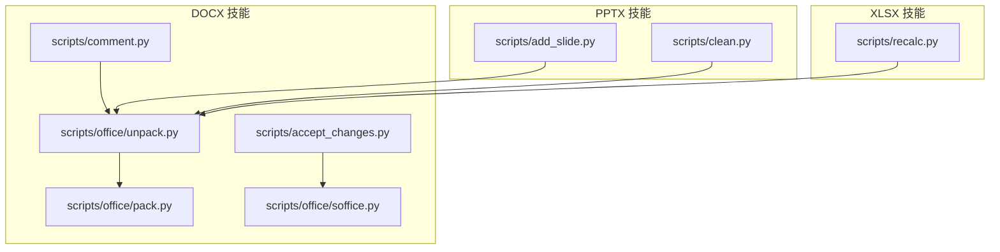
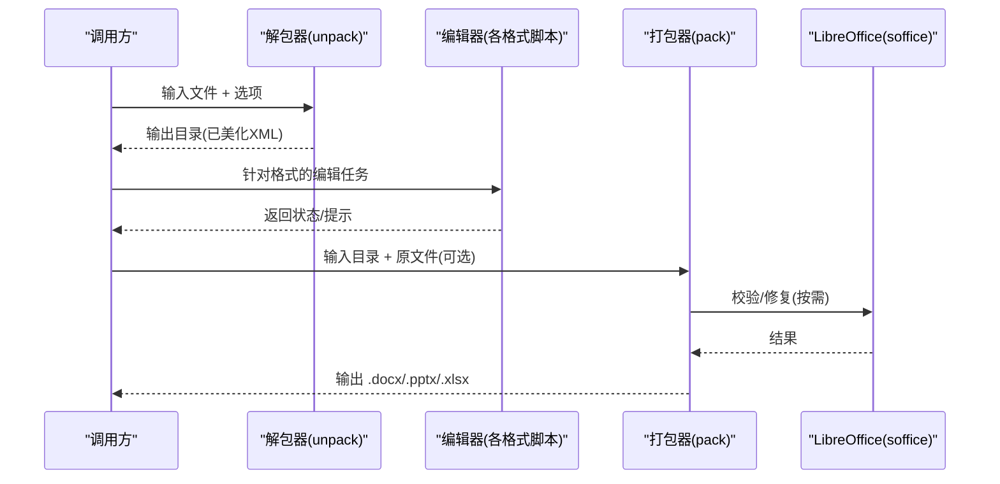
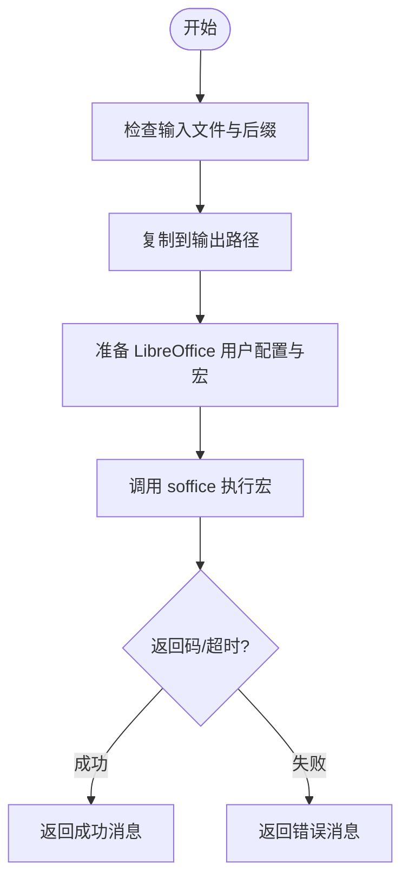
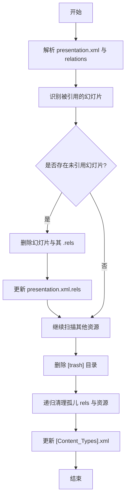
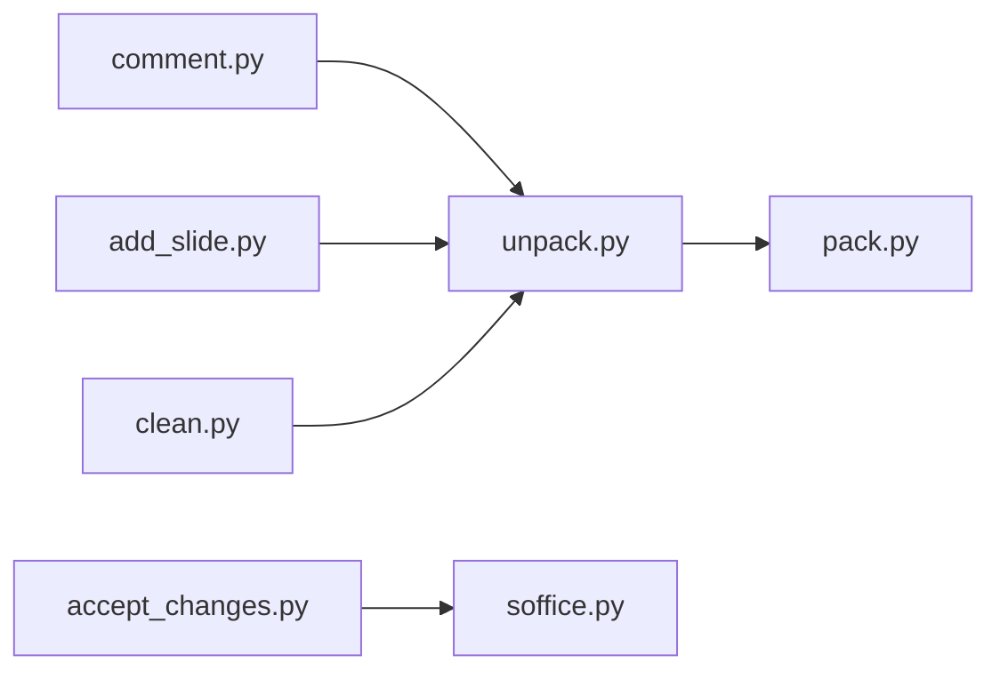

# 文档处理技能

<cite>
**本文引用的文件**
- [docx-zh/scripts/accept_changes.py](file://src/qwenpaw/agents/skills/docx-zh/scripts/accept_changes.py)
- [docx-zh/scripts/comment.py](file://src/qwenpaw/agents/skills/docx-zh/scripts/comment.py)
- [pptx-zh/scripts/add_slide.py](file://src/qwenpaw/agents/skills/pptx-zh/scripts/add_slide.py)
- [pptx-zh/scripts/clean.py](file://src/qwenpaw/agents/skills/pptx-zh/scripts/clean.py)
- [docx-zh/scripts/office/unpack.py](file://src/qwenpaw/agents/skills/docx-zh/scripts/office/unpack.py)
- [docx-zh/scripts/office/pack.py](file://src/qwenpaw/agents/skills/docx-zh/scripts/office/pack.py)
- [docx-zh/scripts/office/soffice.py](file://src/qwenpaw/agents/skills/docx-zh/scripts/office/soffice.py)
</cite>

## 目录
1. [简介](#简介)
2. [项目结构](#项目结构)
3. [核心组件](#核心组件)
4. [架构总览](#架构总览)
5. [详细组件分析](#详细组件分析)
6. [依赖关系分析](#依赖关系分析)
7. [性能与体积优化](#性能与体积优化)
8. [故障排查指南](#故障排查指南)
9. [结论](#结论)
10. [附录：接口与参数速查](#附录接口与参数速查)

## 简介
本章节面向 QwenPaw 的“文档处理技能”，聚焦 Word (docx)、PowerPoint (pptx) 和 Excel (xlsx) 三大 Office 格式的处理能力。该技能以“解包—编辑—打包”为核心工作流，结合 XML 级操作与 LibreOffice 转换能力，提供如下关键能力：
- 解包与格式化：将 .docx/.pptx/.xlsx 解压为可编辑的 XML 目录，并对 XML 进行美化、智能引号转义等预处理。
- 内容编辑：在 DOCX 中接受修订、添加评论；在 PPTX 中新增幻灯片（从布局或复制现有）；在 XLSX 中支持重算（脚本存在）。
- 校验与修复：基于 Schema 与红线条目校验，自动修复并压缩 XML，确保输出文件合规且体积更小。
- 打包输出：将修改后的目录重新打包为 .docx/.pptx/.xlsx。
- LibreOffice 集成：通过 soffice 无头模式执行宏与转换，并提供 AF_UNIX 受限环境的兼容方案。

## 项目结构
文档处理技能位于 agents/skills 下，按语言与格式分目录组织。每个技能包含 scripts 子目录，其中 office 子目录提供通用的解包、打包、验证与 LibreOffice 辅助工具。

图表来源
- [docx-zh/scripts/office/unpack.py:1-133](file://src/qwenpaw/agents/skills/docx-zh/scripts/office/unpack.py#L1-L133)
- [docx-zh/scripts/office/pack.py:1-160](file://src/qwenpaw/agents/skills/docx-zh/scripts/office/pack.py#L1-L160)
- [docx-zh/scripts/office/soffice.py:1-221](file://src/qwenpaw/agents/skills/docx-zh/scripts/office/soffice.py#L1-L221)
- [docx-zh/scripts/accept_changes.py:1-139](file://src/qwenpaw/agents/skills/docx-zh/scripts/accept_changes.py#L1-L139)
- [docx-zh/scripts/comment.py:1-319](file://src/qwenpaw/agents/skills/docx-zh/scripts/comment.py#L1-L319)
- [pptx-zh/scripts/add_slide.py:1-196](file://src/qwenpaw/agents/skills/pptx-zh/scripts/add_slide.py#L1-L196)
- [pptx-zh/scripts/clean.py:1-287](file://src/qwenpaw/agents/skills/pptx-zh/scripts/clean.py#L1-L287)

章节来源
- [docx-zh/scripts/office/unpack.py:1-133](file://src/qwenpaw/agents/skills/docx-zh/scripts/office/unpack.py#L1-L133)
- [docx-zh/scripts/office/pack.py:1-160](file://src/qwenpaw/agents/skills/docx-zh/scripts/office/pack.py#L1-L160)
- [docx-zh/scripts/office/soffice.py:1-221](file://src/qwenpaw/agents/skills/docx-zh/scripts/office/soffice.py#L1-L221)
- [docx-zh/scripts/accept_changes.py:1-139](file://src/qwenpaw/agents/skills/docx-zh/scripts/accept_changes.py#L1-L139)
- [docx-zh/scripts/comment.py:1-319](file://src/qwenpaw/agents/skills/docx-zh/scripts/comment.py#L1-L319)
- [pptx-zh/scripts/add_slide.py:1-196](file://src/qwenpaw/agents/skills/pptx-zh/scripts/add_slide.py#L1-L196)
- [pptx-zh/scripts/clean.py:1-287](file://src/qwenpaw/agents/skills/pptx-zh/scripts/clean.py#L1-L287)

## 核心组件
- 解包器（unpack）：负责解压 ZIP、美化 XML、可选合并相邻 run 与简化修订，并将智能引号替换为实体。
- 打包器（pack）：对 XML 进行压缩清理、可选校验与自动修复，最终生成 .docx/.pptx/.xlsx。
- LibreOffice 助手（soffice）：封装 soffice 命令与环境变量，检测 AF_UNIX 限制并注入 LD_PRELOAD 垫片，保障在无头环境下的稳定性。
- DOCX 专用脚本：
  - accept_changes：通过 LibreOffice 宏接受全部修订。
  - comment：向 comments.xml 及相关扩展文件中追加评论节点，并在 document.xml 插入引用标记。
- PPTX 专用脚本：
  - add_slide：从布局创建新幻灯片或复制现有幻灯片，更新 relationships 与 content types。
  - clean：清理未引用资源、孤儿幻灯片与冗余 rels，更新 Content Types。

章节来源
- [docx-zh/scripts/office/unpack.py:1-133](file://src/qwenpaw/agents/skills/docx-zh/scripts/office/unpack.py#L1-L133)
- [docx-zh/scripts/office/pack.py:1-160](file://src/qwenpaw/agents/skills/docx-zh/scripts/office/pack.py#L1-L160)
- [docx-zh/scripts/office/soffice.py:1-221](file://src/qwenpaw/agents/skills/docx-zh/scripts/office/soffice.py#L1-L221)
- [docx-zh/scripts/accept_changes.py:1-139](file://src/qwenpaw/agents/skills/docx-zh/scripts/accept_changes.py#L1-L139)
- [docx-zh/scripts/comment.py:1-319](file://src/qwenpaw/agents/skills/docx-zh/scripts/comment.py#L1-L319)
- [pptx-zh/scripts/add_slide.py:1-196](file://src/qwenpaw/agents/skills/pptx-zh/scripts/add_slide.py#L1-L196)
- [pptx-zh/scripts/clean.py:1-287](file://src/qwenpaw/agents/skills/pptx-zh/scripts/clean.py#L1-L287)

## 架构总览
整体采用“解包—编辑—打包”流水线，中间层由通用 office 工具支撑，上层按格式提供专用脚本。LibreOffice 作为外部依赖用于宏执行与格式转换。

图表来源
- [docx-zh/scripts/office/unpack.py:1-133](file://src/qwenpaw/agents/skills/docx-zh/scripts/office/unpack.py#L1-L133)
- [docx-zh/scripts/office/pack.py:1-160](file://src/qwenpaw/agents/skills/docx-zh/scripts/office/pack.py#L1-L160)
- [docx-zh/scripts/office/soffice.py:1-221](file://src/qwenpaw/agents/skills/docx-zh/scripts/office/soffice.py#L1-L221)

## 详细组件分析

### DOCX 技能
- 接受修订（accept_changes）
  - 功能：通过 LibreOffice 无头模式运行 Basic 宏，接受所有修订并保存。
  - 关键点：动态写入用户配置目录中的宏文件；使用临时 profile 隔离；超时容忍策略。
  - 典型流程：
    - 校验输入是否为 .docx
    - 复制输入到输出路径
    - 初始化 LibreOffice 用户配置并写入宏
    - 调用 soffice 执行宏并接受修订
    - 返回成功或错误信息
  - 参考实现路径：[accept_changes.py:1-139](file://src/qwenpaw/agents/skills/docx-zh/scripts/accept_changes.py#L1-L139)

- 添加评论（comment）
  - 功能：在 comments.xml、commentsExtended.xml、commentsIds.xml、commentsExtensible.xml 中添加评论条目，并在 document.xml 插入评论范围标记与引用。
  - 关键点：维护关系与内容类型覆盖；支持回复嵌套；时间戳与作者信息；智能引号实体化。
  - 参考实现路径：[comment.py:1-319](file://src/qwenpaw/agents/skills/docx-zh/scripts/comment.py#L1-L319)

- 解包（unpack）
  - 功能：解压 ZIP，美化 XML，可选合并相邻 run 与简化修订，最后将智能引号替换为实体。
  - 关键点：仅对非文本节点清理空白；DOCX 专属后处理；异常容错。
  - 参考实现路径：[unpack.py:1-133](file://src/qwenpaw/agents/skills/docx-zh/scripts/office/unpack.py#L1-L133)

- 打包（pack）
  - 功能：压缩 XML、可选校验与自动修复、生成目标文件。
  - 关键点：根据后缀选择不同校验器；支持推断作者；失败时打印诊断信息。
  - 参考实现路径：[pack.py:1-160](file://src/qwenpaw/agents/skills/docx-zh/scripts/office/pack.py#L1-L160)

- LibreOffice 集成（soffice）
  - 功能：跨平台定位 soffice；设置 headless 环境变量；检测 AF_UNIX 限制并注入 LD_PRELOAD 垫片。
  - 关键点：Linux 下 SAL_USE_VCLPLUGIN=svp；垫片编译与生命周期管理；close 监听退出。
  - 参考实现路径：[soffice.py:1-221](file://src/qwenpaw/agents/skills/docx-zh/scripts/office/soffice.py#L1-L221)

图表来源
- [docx-zh/scripts/accept_changes.py:1-139](file://src/qwenpaw/agents/skills/docx-zh/scripts/accept_changes.py#L1-L139)
- [docx-zh/scripts/office/soffice.py:1-221](file://src/qwenpaw/agents/skills/docx-zh/scripts/office/soffice.py#L1-L221)

章节来源
- [docx-zh/scripts/accept_changes.py:1-139](file://src/qwenpaw/agents/skills/docx-zh/scripts/accept_changes.py#L1-L139)
- [docx-zh/scripts/comment.py:1-319](file://src/qwenpaw/agents/skills/docx-zh/scripts/comment.py#L1-L319)
- [docx-zh/scripts/office/unpack.py:1-133](file://src/qwenpaw/agents/skills/docx-zh/scripts/office/unpack.py#L1-L133)
- [docx-zh/scripts/office/pack.py:1-160](file://src/qwenpaw/agents/skills/docx-zh/scripts/office/pack.py#L1-L160)
- [docx-zh/scripts/office/soffice.py:1-221](file://src/qwenpaw/agents/skills/docx-zh/scripts/office/soffice.py#L1-L221)

### PPTX 技能
- 新增幻灯片（add_slide）
  - 功能：从布局创建新幻灯片或复制现有幻灯片，更新 relationships、content types 与 sldId。
  - 关键点：计算下一个 slide 编号与 r:id；移除 notesSlide 引用以避免冗余；输出需添加到 presentation.xml 的片段。
  - 参考实现路径：[add_slide.py:1-196](file://src/qwenpaw/agents/skills/pptx-zh/scripts/add_slide.py#L1-L196)

- 清理无用资源（clean）
  - 功能：删除未引用的幻灯片、[trash] 目录、孤儿 rels、媒体/主题/备注等资源，并更新 Content Types。
  - 关键点：遍历所有 .rels 构建引用集合；迭代清理直至稳定；同步更新 [Content_Types].xml。
  - 参考实现路径：[clean.py:1-287](file://src/qwenpaw/agents/skills/pptx-zh/scripts/clean.py#L1-L287)

图表来源
- [pptx-zh/scripts/clean.py:1-287](file://src/qwenpaw/agents/skills/pptx-zh/scripts/clean.py#L1-L287)

章节来源
- [pptx-zh/scripts/add_slide.py:1-196](file://src/qwenpaw/agents/skills/pptx-zh/scripts/add_slide.py#L1-L196)
- [pptx-zh/scripts/clean.py:1-287](file://src/qwenpaw/agents/skills/pptx-zh/scripts/clean.py#L1-L287)

### XLSX 技能
- 重算（recalc）
  - 说明：脚本存在，通常用于触发公式重算或相关处理。具体实现细节请参考对应脚本文件。
  - 参考实现路径：[xlsx-en/scripts/recalc.py](file://src/qwenpaw/agents/skills/xlsx-en/scripts/recalc.py)

章节来源
- [xlsx-en/scripts/recalc.py](file://src/qwenpaw/agents/skills/xlsx-en/scripts/recalc.py)

## 依赖关系分析
- 内部依赖
  - unpack 与 pack 构成通用流水线，被各格式脚本复用。
  - soffice 为 LibreOffice 调用的统一入口，供 accept_changes 等脚本使用。
- 外部依赖
  - LibreOffice（soffice）：用于宏执行与可能的格式转换。
  - Python 标准库与 defusedxml：用于 ZIP 操作与安全的 XML 解析。

图表来源
- [docx-zh/scripts/office/unpack.py:1-133](file://src/qwenpaw/agents/skills/docx-zh/scripts/office/unpack.py#L1-L133)
- [docx-zh/scripts/office/pack.py:1-160](file://src/qwenpaw/agents/skills/docx-zh/scripts/office/pack.py#L1-L160)
- [docx-zh/scripts/office/soffice.py:1-221](file://src/qwenpaw/agents/skills/docx-zh/scripts/office/soffice.py#L1-L221)
- [docx-zh/scripts/accept_changes.py:1-139](file://src/qwenpaw/agents/skills/docx-zh/scripts/accept_changes.py#L1-L139)
- [docx-zh/scripts/comment.py:1-319](file://src/qwenpaw/agents/skills/docx-zh/scripts/comment.py#L1-L319)
- [pptx-zh/scripts/add_slide.py:1-196](file://src/qwenpaw/agents/skills/pptx-zh/scripts/add_slide.py#L1-L196)
- [pptx-zh/scripts/clean.py:1-287](file://src/qwenpaw/agents/skills/pptx-zh/scripts/clean.py#L1-L287)

章节来源
- [docx-zh/scripts/office/unpack.py:1-133](file://src/qwenpaw/agents/skills/docx-zh/scripts/office/unpack.py#L1-L133)
- [docx-zh/scripts/office/pack.py:1-160](file://src/qwenpaw/agents/skills/docx-zh/scripts/office/pack.py#L1-L160)
- [docx-zh/scripts/office/soffice.py:1-221](file://src/qwenpaw/agents/skills/docx-zh/scripts/office/soffice.py#L1-L221)
- [docx-zh/scripts/accept_changes.py:1-139](file://src/qwenpaw/agents/skills/docx-zh/scripts/accept_changes.py#L1-L139)
- [docx-zh/scripts/comment.py:1-319](file://src/qwenpaw/agents/skills/docx-zh/scripts/comment.py#L1-L319)
- [pptx-zh/scripts/add_slide.py:1-196](file://src/qwenpaw/agents/skills/pptx-zh/scripts/add_slide.py#L1-L196)
- [pptx-zh/scripts/clean.py:1-287](file://src/qwenpaw/agents/skills/pptx-zh/scripts/clean.py#L1-L287)

## 性能与体积优化
- XML 压缩与清理
  - 打包阶段会去除多余空白与注释节点，减小文件体积。
  - 解包阶段美化 XML 便于人工阅读与调试。
- 合并与简化
  - DOCX 解包时可合并相邻 run 与简化同作者的修订，减少冗余节点。
- 资源清理
  - PPTX 清理脚本会递归删除未引用资源与孤儿 rels，显著降低体积。
- LibreOffice 调用
  - 使用无头模式与最小化环境变量，避免 GUI 开销；必要时注入垫片提升兼容性。

章节来源
- [docx-zh/scripts/office/unpack.py:1-133](file://src/qwenpaw/agents/skills/docx-zh/scripts/office/unpack.py#L1-L133)
- [docx-zh/scripts/office/pack.py:1-160](file://src/qwenpaw/agents/skills/docx-zh/scripts/office/pack.py#L1-L160)
- [pptx-zh/scripts/clean.py:1-287](file://src/qwenpaw/agents/skills/pptx-zh/scripts/clean.py#L1-L287)
- [docx-zh/scripts/office/soffice.py:1-221](file://src/qwenpaw/agents/skills/docx-zh/scripts/office/soffice.py#L1-L221)

## 故障排查指南
- LibreOffice 不可用或无法启动
  - 确认 PATH 中存在 soffice 或在 Windows 常见安装路径下可找到。
  - Linux 环境下若 AF_UNIX 被限制，脚本会自动注入 LD_PRELOAD 垫片；如仍失败，检查 gcc 是否可用以编译垫片。
  - 参考路径：[soffice.py:1-221](file://src/qwenpaw/agents/skills/docx-zh/scripts/office/soffice.py#L1-L221)
- 接受修订失败
  - 检查输入是否为 .docx；确认输出目录可写；查看 LibreOffice 返回码与 stderr。
  - 参考路径：[accept_changes.py:1-139](file://src/qwenpaw/agents/skills/docx-zh/scripts/accept_changes.py#L1-L139)
- 添加评论无效
  - 确认 comments*.xml 与 document.xml 的关系与内容类型覆盖正确；检查 para_id 与 durableId 一致性。
  - 参考路径：[comment.py:1-319](file://src/qwenpaw/agents/skills/docx-zh/scripts/comment.py#L1-L319)
- PPTX 新增幻灯片不显示
  - 确认已在 presentation.xml 的 sldIdLst 中添加 sldId；检查 slides/_rels 与 ppt/_rels 的 r:id 映射。
  - 参考路径：[add_slide.py:1-196](file://src/qwenpaw/agents/skills/pptx-zh/scripts/add_slide.py#L1-L196)
- 打包后文件损坏
  - 启用 --validate true 并使用 --original 指定原始文件进行对比校验；关注自动修复报告。
  - 参考路径：[pack.py:1-160](file://src/qwenpaw/agents/skills/docx-zh/scripts/office/pack.py#L1-L160)

章节来源
- [docx-zh/scripts/office/soffice.py:1-221](file://src/qwenpaw/agents/skills/docx-zh/scripts/office/soffice.py#L1-L221)
- [docx-zh/scripts/accept_changes.py:1-139](file://src/qwenpaw/agents/skills/docx-zh/scripts/accept_changes.py#L1-L139)
- [docx-zh/scripts/comment.py:1-319](file://src/qwenpaw/agents/skills/docx-zh/scripts/comment.py#L1-L319)
- [pptx-zh/scripts/add_slide.py:1-196](file://src/qwenpaw/agents/skills/pptx-zh/scripts/add_slide.py#L1-L196)
- [docx-zh/scripts/office/pack.py:1-160](file://src/qwenpaw/agents/skills/docx-zh/scripts/office/pack.py#L1-L160)

## 结论
QwenPaw 的文档处理技能围绕“解包—编辑—打包”的清晰流水线设计，结合 XML 级精细控制与 LibreOffice 的强大能力，覆盖了 Word、PowerPoint 与 Excel 的核心编辑场景。通过统一的 office 工具与格式专用脚本的组合，既保证了易用性，也为高级用户提供足够的扩展空间。建议在生产环境中开启校验与自动修复，并结合清理脚本优化输出体积。

## 附录：接口与参数速查
- 解包（unpack）
  - 入口：unpack(input_file, output_directory, merge_runs=True, simplify_redlines=True)
  - 参数：
    - input_file: 输入 .docx/.pptx/.xlsx 路径
    - output_directory: 输出目录
    - merge_runs: 是否合并相邻 run（DOCX）
    - simplify_redlines: 是否简化同作者修订（DOCX）
  - 返回：元组 (None, 消息字符串)
  - 参考路径：[unpack.py:1-133](file://src/qwenpaw/agents/skills/docx-zh/scripts/office/unpack.py#L1-L133)

- 打包（pack）
  - 入口：pack(input_directory, output_file, original_file=None, validate=True, infer_author_func=None)
  - 参数：
    - input_directory: 待打包目录
    - output_file: 输出 .docx/.pptx/.xlsx
    - original_file: 原始文件（用于校验对比）
    - validate: 是否运行校验与自动修复
    - infer_author_func: 推断作者函数（DOCX）
  - 返回：元组 (None, 消息字符串)
  - 参考路径：[pack.py:1-160](file://src/qwenpaw/agents/skills/docx-zh/scripts/office/pack.py#L1-L160)

- LibreOffice 助手（soffice）
  - get_soffice_cmd(): 返回 soffice 可执行名
  - get_soffice_env(): 返回带必要环境变量的字典（含 LD_PRELOAD 垫片）
  - run_soffice(args, **kwargs): 直接运行 soffice
  - 参考路径：[soffice.py:1-221](file://src/qwenpaw/agents/skills/docx-zh/scripts/office/soffice.py#L1-L221)

- DOCX 接受修订（accept_changes）
  - 入口：accept_changes(input_file, output_file)
  - 参数：
    - input_file: 输入 .docx
    - output_file: 输出 .docx
  - 返回：元组 (None, 消息字符串)
  - 参考路径：[accept_changes.py:1-139](file://src/qwenpaw/agents/skills/docx-zh/scripts/accept_changes.py#L1-L139)

- DOCX 添加评论（comment）
  - 入口：add_comment(unpacked_dir, comment_id, text, author="Claude", initials="C", parent_id=None)
  - 参数：
    - unpacked_dir: 已解包的 DOCX 目录
    - comment_id: 唯一评论 ID
    - text: 评论内容（建议预转义）
    - author/initials: 作者信息与缩写
    - parent_id: 父评论 ID（用于回复）
  - 返回：元组(para_id, 消息字符串)
  - 参考路径：[comment.py:1-319](file://src/qwenpaw/agents/skills/docx-zh/scripts/comment.py#L1-L319)

- PPTX 新增幻灯片（add_slide）
  - 入口：create_slide_from_layout / duplicate_slide
  - 参数：
    - unpacked_dir: 已解包的 PPTX 目录
    - source: 源布局或幻灯片文件名
  - 行为：创建新幻灯片并输出需在 presentation.xml 中插入的片段
  - 参考路径：[add_slide.py:1-196](file://src/qwenpaw/agents/skills/pptx-zh/scripts/add_slide.py#L1-L196)

- PPTX 清理（clean）
  - 入口：clean_unused_files(unpacked_dir)
  - 参数：
    - unpacked_dir: 已解包的 PPTX 目录
  - 返回：被删除的文件列表
  - 参考路径：[clean.py:1-287](file://src/qwenpaw/agents/skills/pptx-zh/scripts/clean.py#L1-L287)