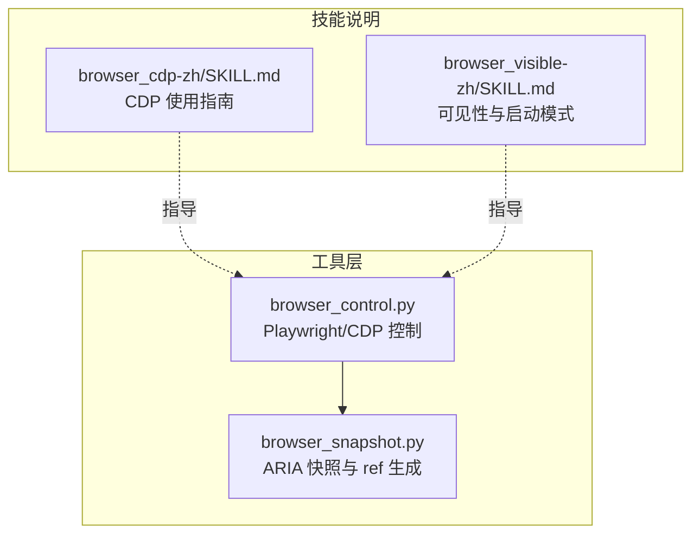
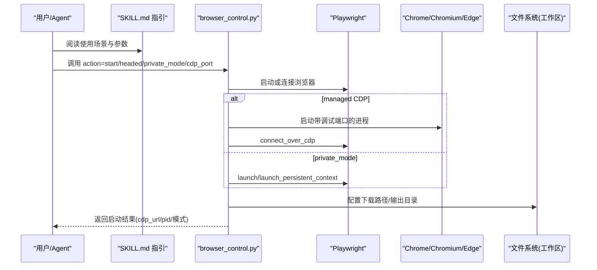
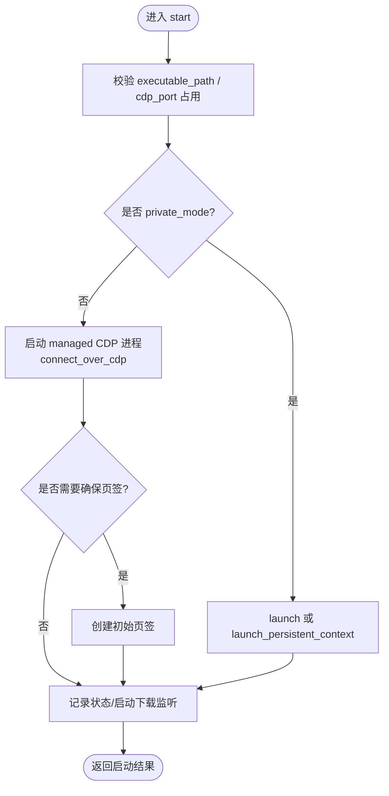
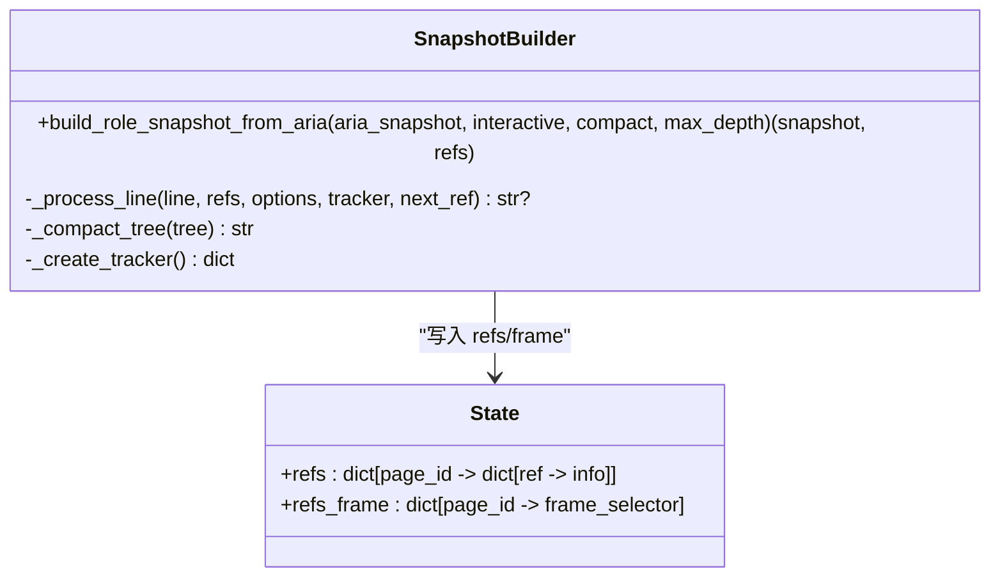
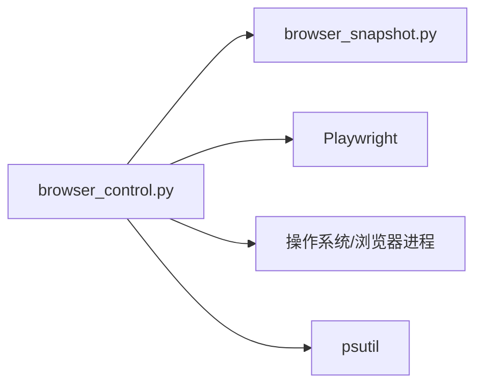

# 浏览器控制技能

<cite>
**本文引用的文件**   
- [browser_control.py](file://src/qwenpaw/agents/tools/browser_control.py)
- [browser_snapshot.py](file://src/qwenpaw/agents/tools/browser_snapshot.py)
- [browser_cdp-zh/SKILL.md](file://src/qwenpaw/agents/skills/browser_cdp-zh/SKILL.md)
- [browser_visible-zh/SKILL.md](file://src/qwenpaw/agents/skills/browser_visible-zh/SKILL.md)
</cite>

## 目录
1. [简介](#简介)
2. [项目结构](#项目结构)
3. [核心组件](#核心组件)
4. [架构总览](#架构总览)
5. [详细组件分析](#详细组件分析)
6. [依赖关系分析](#依赖关系分析)
7. [性能与资源管理](#性能与资源管理)
8. [常见问题与排障](#常见问题与排障)
9. [结论](#结论)
10. [附录：接口与使用模式](#附录接口与使用模式)

## 简介
本章节面向 QwenPaw 的“浏览器控制”相关技能，聚焦以下能力：
- 基于 Playwright 的浏览器自动化（启动、导航、点击、输入、截图、PDF、下载等）
- CDP 连接与端口扫描、显式端口绑定、多 agent 共享浏览器
- 可见性检测与启动模式（headed/private_mode/executable_path/browser_args）
- 快照与引用（ref）体系，用于稳定定位页面元素
- 与“文件读取”技能的协作（输出路径解析、下载产物落盘）

目标读者包括初学者与有经验的开发者。文档既提供高层概念，也给出代码级实现细节、调用关系与最佳实践。

## 项目结构
与浏览器控制相关的核心代码位于 agents/tools 与 agents/skills 两个层次：
- 工具层（tools）：实现具体动作（start/stop/open/navigate/click/type/snapshot/...），封装 Playwright 与 CDP 逻辑
- 技能说明（skills）：以 SKILL.md 形式描述何时使用、参数含义与典型用法

图示来源
- [browser_control.py:1-120](file://src/qwenpaw/agents/tools/browser_control.py#L1-L120)
- [browser_snapshot.py:1-60](file://src/qwenpaw/agents/tools/browser_snapshot.py#L1-L60)
- [browser_cdp-zh/SKILL.md:1-40](file://src/qwenpaw/agents/skills/browser_cdp-zh/SKILL.md#L1-L40)
- [browser_visible-zh/SKILL.md:1-30](file://src/qwenpaw/agents/skills/browser_visible-zh/SKILL.md#L1-L30)

章节来源
- [browser_control.py:1-120](file://src/qwenpaw/agents/tools/browser_control.py#L1-L120)
- [browser_snapshot.py:1-60](file://src/qwenpaw/agents/tools/browser_snapshot.py#L1-L60)
- [browser_cdp-zh/SKILL.md:1-40](file://src/qwenpaw/agents/skills/browser_cdp-zh/SKILL.md#L1-L40)
- [browser_visible-zh/SKILL.md:1-30](file://src/qwenpaw/agents/skills/browser_visible-zh/SKILL.md#L1-L30)

## 核心组件
- 浏览器控制工具（browser_control.py）
  - 统一入口：action 驱动（start/stop/open/navigate/click/type/screenshot/snapshot/evaluate/pdf/file_download/file_upload/handle_dialog/console_messages/tabs/wait_for/resize/press_key/drag/hover/select_option/network_requests/run_code/close 等）
  - 状态机：按 workspace 维护浏览器上下文、页签、refs、控制台日志、网络请求、对话框与文件选择器队列
  - 启动模式：managed CDP（默认）、private_mode（Playwright 直接管理）、Windows 混合模式（sync Playwright）
  - 生命周期：空闲自动停止、进程清理、CDP 连接断开处理
- 快照与引用（browser_snapshot.py）
  - 将 Playwright aria_snapshot 转换为精简树并注入 ref，供后续 click/type/evaluate 等通过 ref 精准定位
- 技能说明（SKILL.md）
  - browser_cdp-zh：何时使用 CDP、端口扫描、连接已有 Chrome、显式 cdp_port、多 agent 共享
  - browser_visible-zh：headed/private_mode/browser_args/executable_path 的含义与组合用法

章节来源
- [browser_control.py:1-120](file://src/qwenpaw/agents/tools/browser_control.py#L1-L120)
- [browser_snapshot.py:185-249](file://src/qwenpaw/agents/tools/browser_snapshot.py#L185-L249)
- [browser_cdp-zh/SKILL.md:1-120](file://src/qwenpaw/agents/skills/browser_cdp-zh/SKILL.md#L1-L120)
- [browser_visible-zh/SKILL.md:1-101](file://src/qwenpaw/agents/skills/browser_visible-zh/SKILL.md#L1-L101)

## 架构总览
下图展示从“技能说明”到“工具实现”的调用关系与数据流。

图示来源
- [browser_control.py:1081-1162](file://src/qwenpaw/agents/tools/browser_control.py#L1081-L1162)
- [browser_control.py:1675-1912](file://src/qwenpaw/agents/tools/browser_control.py#L1675-L1912)
- [browser_control.py:180-211](file://src/qwenpaw/agents/tools/browser_control.py#L180-L211)

## 详细组件分析

### 组件 A：浏览器控制工具（browser_control.py）
- 关键职责
  - 启动/停止浏览器（支持 managed CDP 与 private_mode）
  - 打开/导航/关闭页签，维护当前页签
  - 交互操作：click/type/evaluate/resize/press_key/drag/hover/select_option 等
  - 截图/PDF/控制台日志/网络请求采集
  - 对话框与文件选择器处理
  - 下载行为配置与直链下载限制
  - 空闲自动停止与进程回收
- 重要数据结构（workspace 级别 state）
  - playwright/browser/context：异步模式对象
  - _sync_playwright/_sync_browser/_sync_context：同步模式对象（Windows 重载模式）
  - pages/refs/refs_frame/console_logs/network_requests/pending_dialogs/pending_file_choosers：每页签状态
  - headless/current_page_id/page_counter/last_activity_time：运行期状态
  - connected_via_cdp/cdp_url/launch_mode/owned_browser_process/browser_pid/browser_process：CDP 与进程信息
- 启动流程要点
  - 校验 executable_path（白名单关键词+存在性）
  - 若指定 cdp_port，先检测占用
  - managed CDP：启动外部 Chromium 进程 + connect_over_cdp；失败回退到 private_mode
  - private_mode：launch 或 launch_persistent_context（保留 cookies）
  - Windows 重载模式：走 sync Playwright 线程池执行
- 生命周期与清理
  - idle watchdog：超过阈值自动 stop
  - dispose：关闭 context/browser/playwright，必要时终止 owned 进程
  - atexit：进程退出时尽力清理

图示来源
- [browser_control.py:1675-1912](file://src/qwenpaw/agents/tools/browser_control.py#L1675-L1912)
- [browser_control.py:1081-1162](file://src/qwenpaw/agents/tools/browser_control.py#L1081-L1162)
- [browser_control.py:180-211](file://src/qwenpaw/agents/tools/browser_control.py#L180-L211)

章节来源
- [browser_control.py:1-120](file://src/qwenpaw/agents/tools/browser_control.py#L1-L120)
- [browser_control.py:1081-1162](file://src/qwenpaw/agents/tools/browser_control.py#L1081-L1162)
- [browser_control.py:1675-1912](file://src/qwenpaw/agents/tools/browser_control.py#L1675-L1912)
- [browser_control.py:180-211](file://src/qwenpaw/agents/tools/browser_control.py#L180-L211)

### 组件 B：快照与引用（browser_snapshot.py）
- 功能
  - 将 aria_snapshot 文本转为精简树，并为可交互/内容节点注入 ref
  - 去重策略：同名同角色元素按 nth 区分，非重复项去除冗余 nth
  - 支持 interactive/compact/maxDepth 过滤
- 复杂度
  - 时间 O(N)，N 为 aria_snapshot 行数
  - 空间 O(R)，R 为生成的 ref 数量
- 与工具集成
  - snapshot 动作调用 build_role_snapshot_from_aria，并将 refs 写入 state
  - 后续 click/type/evaluate 等通过 ref 解析 locator

图示来源
- [browser_snapshot.py:185-249](file://src/qwenpaw/agents/tools/browser_snapshot.py#L185-L249)
- [browser_control.py:2664-2725](file://src/qwenpaw/agents/tools/browser_control.py#L2664-L2725)

章节来源
- [browser_snapshot.py:1-249](file://src/qwenpaw/agents/tools/browser_snapshot.py#L1-L249)
- [browser_control.py:2664-2725](file://src/qwenpaw/agents/tools/browser_control.py#L2664-L2725)

### 组件 C：CDP 与可见性技能说明
- browser_cdp-zh/SKILL.md
  - 适用场景：连接已有 Chrome、扫描本地 CDP 端口、显式指定 cdp_port、多 agent 共享
  - stop 语义差异：QwenPaw 自管 vs 外部 CDP（仅断开不关进程）
- browser_visible-zh/SKILL.md
  - headed/private_mode/browser_args/executable_path 的组合与注意事项
  - 何时选择 private_mode 与何时传入 browser_args

章节来源
- [browser_cdp-zh/SKILL.md:1-205](file://src/qwenpaw/agents/skills/browser_cdp-zh/SKILL.md#L1-L205)
- [browser_visible-zh/SKILL.md:1-101](file://src/qwenpaw/agents/skills/browser_visible-zh/SKILL.md#L1-L101)

## 依赖关系分析
- 内部依赖
  - browser_control.py 依赖 browser_snapshot.py 的快照构建函数
  - 两者均依赖运行时配置（工作区目录、Playwright 可执行路径、容器检测等）
- 外部依赖
  - Playwright（async/sync API）
  - 系统浏览器（Chrome/Chromium/Edge，WebKit 在 macOS 作为回退）
  - psutil（进程存活检查与终止）
  - 标准库（subprocess/socket/json/logging 等）

图示来源
- [browser_control.py:1-120](file://src/qwenpaw/agents/tools/browser_control.py#L1-L120)
- [browser_snapshot.py:1-60](file://src/qwenpaw/agents/tools/browser_snapshot.py#L1-L60)

章节来源
- [browser_control.py:1-120](file://src/qwenpaw/agents/tools/browser_control.py#L1-L120)
- [browser_snapshot.py:1-60](file://src/qwenpaw/agents/tools/browser_snapshot.py#L1-L60)

## 性能与资源管理
- 启动模式选择
  - managed CDP：默认，具备更强可控性；失败时自动回退 private_mode
  - private_mode：绕过 CDP，适合隐私需求或受限环境
  - Windows 重载模式：强制 sync Playwright，避免 asyncio 子进程异常
- 空闲回收
  - 默认空闲超时（约 10 分钟）后自动 stop，释放渲染进程
- 下载与 I/O
  - 下载路径固定在工作区 browser/downloads
  - 直链下载受大小限制（默认 10MB），需 HEAD 成功且含 Content-Length
- 进程清理
  - 优雅关闭优先，必要时 kill；对 Playwright driver 进程做兜底终止

章节来源
- [browser_control.py:303-416](file://src/qwenpaw/agents/tools/browser_control.py#L303-L416)
- [browser_control.py:180-211](file://src/qwenpaw/agents/tools/browser_control.py#L180-L211)
- [browser_control.py:3069-3163](file://src/qwenpaw/agents/tools/browser_control.py#L3069-L3163)

## 常见问题与排障
- 无法启动浏览器
  - 现象：start 返回错误，提示缺少 Chrome/Chromium 或 CDP 不可用
  - 排查：确认系统已安装支持的浏览器；在容器内检查环境变量；尝试 private_mode=true
  - 参考：[browser_control.py:1081-1162](file://src/qwenpaw/agents/tools/browser_control.py#L1081-L1162)
- 端口冲突
  - 现象：指定 cdp_port 时报端口占用
  - 解决：更换端口或先停止旧进程
  - 参考：[browser_control.py:1734-1751](file://src/qwenpaw/agents/tools/browser_control.py#L1734-L1751)
- 可见窗口与验证问题
  - 现象：headless 下触发验证码
  - 建议：切换到 headed=true 或使用私有模式
  - 参考：[browser_control.py:53-58](file://src/qwenpaw/agents/tools/browser_control.py#L53-L58)
- 下载失败或过大
  - 现象：直链下载被拒绝或无 Content-Length
  - 解决：改用 ref 触发的下载事件，或降低文件大小
  - 参考：[browser_control.py:3069-3163](file://src/qwenpaw/agents/tools/browser_control.py#L3069-L3163)
- 快照为空或 ref 找不到
  - 现象：snapshot 为空或 click/type 报 Unknown ref
  - 解决：重新 snapshot；检查 frame_selector 与 ref 对应关系
  - 参考：[browser_control.py:2664-2725](file://src/qwenpaw/agents/tools/browser_control.py#L2664-L2725)

章节来源
- [browser_control.py:1081-1162](file://src/qwenpaw/agents/tools/browser_control.py#L1081-L1162)
- [browser_control.py:1734-1751](file://src/qwenpaw/agents/tools/browser_control.py#L1734-L1751)
- [browser_control.py:53-58](file://src/qwenpaw/agents/tools/browser_control.py#L53-L58)
- [browser_control.py:3069-3163](file://src/qwenpaw/agents/tools/browser_control.py#L3069-L3163)
- [browser_control.py:2664-2725](file://src/qwenpaw/agents/tools/browser_control.py#L2664-L2725)

## 结论
QwenPaw 的浏览器控制技能以 Playwright 为核心，结合 CDP 与 private_mode 两种路径，兼顾灵活性与稳定性。通过快照与 ref 机制，实现了稳定的页面元素定位；配合空闲回收与完善的清理策略，保障资源安全。技能说明文档明确了不同场景下的最佳实践，便于初学者快速上手，也为高级用户提供深入定制的能力。

## 附录：接口与使用模式

### 启动与停止
- start
  - 参数：headed、cdp_port、private_mode、browser_args、executable_path
  - 行为：managed CDP 优先，失败回退 private_mode；Windows 重载模式走 sync
  - 返回：ok、message、tip、launch_mode、owned_browser_process、private_mode、cdp_url、browser_pid、headless_warning
  - 参考：[browser_control.py:1675-1912](file://src/qwenpaw/agents/tools/browser_control.py#L1675-L1912)
- stop
  - 行为：CDP 连接模式下仅断开（外部进程不关闭）；否则终止 owned 进程
  - 返回：ok、message、warning、fully_cleaned、cleanup_warnings
  - 参考：[browser_control.py:1914-1986](file://src/qwenpaw/agents/tools/browser_control.py#L1914-L1986)

### 页面与导航
- open(url, page_id)
  - 新建页签并导航至 url，注册 listeners，设置 current_page_id
  - 参考：[browser_control.py:1989-2054](file://src/qwenpaw/agents/tools/browser_control.py#L1989-L2054)
- navigate(url, page_id)
  - 在当前页签导航
  - 参考：[browser_control.py:2057-2108](file://src/qwenpaw/agents/tools/browser_control.py#L2057-L2108)
- tabs
  - 列出所有页签（page_id/url/title）
  - 参考：[browser_control.py:1369-1407](file://src/qwenpaw/agents/tools/browser_control.py#L1369-L1407)

### 交互与脚本
- click(selector/ref, double_click, button, modifiers_json, wait, frame_selector)
  - 支持 ref/selector/坐标三种方式
  - 参考：[browser_control.py:2233-2411](file://src/qwenpaw/agents/tools/browser_control.py#L2233-L2411)
- type(selector/ref, text, submit, slowly, frame_selector)
  - 支持 fill/press_sequentially 与回车提交
  - 参考：[browser_control.py:2414-2526](file://src/qwenpaw/agents/tools/browser_control.py#L2414-L2526)
- evaluate(code, ref, element, frame_selector)
  - 在 page 或 locator 上执行 JS
  - 参考：[browser_control.py:2760-2845](file://src/qwenpaw/agents/tools/browser_control.py#L2760-L2845)

### 截图与导出
- screenshot(page_id, path, full_page, screenshot_type, ref, frame_selector)
  - 支持整页/区域/iframe 截图，ref 定位
  - 参考：[browser_control.py:2111-2230](file://src/qwenpaw/agents/tools/browser_control.py#L2111-L2230)
- pdf(page_id, path)
  - 导出 PDF
  - 参考：[browser_control.py:2585-2616](file://src/qwenpaw/agents/tools/browser_control.py#L2585-L2616)

### 快照与引用
- snapshot(page_id, filename, frame_selector)
  - 生成精简树与 refs，可选落盘
  - 参考：[browser_control.py:2664-2725](file://src/qwenpaw/agents/tools/browser_control.py#L2664-L2725)
- 引用解析
  - 通过 role/name/nth 定位，支持 frame_selector
  - 参考：[browser_control.py:1427-1446](file://src/qwenpaw/agents/tools/browser_control.py#L1427-L1446)

### 下载与上传
- file_download(file_path, ref, url, wait_time)
  - 支持下载事件捕获或直链下载（HEAD 成功且含 Content-Length，大小限制）
  - 参考：[browser_control.py:3166-3199](file://src/qwenpaw/agents/tools/browser_control.py#L3166-L3199)
- file_upload(page_id, paths_json)
  - 处理 pending file chooser
  - 参考：[browser_control.py:3005-3066](file://src/qwenpaw/agents/tools/browser_control.py#L3005-L3066)

### 其他
- console_messages(level, filename)
  - 获取控制台日志并可落盘
  - 参考：[browser_control.py:2896-2943](file://src/qwenpaw/agents/tools/browser_control.py#L2896-L2943)
- handle_dialog(accept, prompt_text)
  - 处理 alert/confirm/prompt
  - 参考：[browser_control.py:2946-3002](file://src/qwenpaw/agents/tools/browser_control.py#L2946-L3002)
- resize(width, height)
  - 调整视口尺寸
  - 参考：[browser_control.py:2848-2893](file://src/qwenpaw/agents/tools/browser_control.py#L2848-L2893)
- close(page_id)
  - 关闭页签并清理状态
  - 参考：[browser_control.py:2619-2661](file://src/qwenpaw/agents/tools/browser_control.py#L2619-L2661)

### 与文件读取技能的协作
- 输出路径解析
  - 相对路径会解析到工作区 browser 目录下，确保跨平台一致性与权限安全
  - 参考：[browser_control.py:154-161](file://src/qwenpaw/agents/tools/browser_control.py#L154-L161)
- 下载产物落盘
  - 下载目录固定为 browser/downloads，便于文件读取技能发现与处理
  - 参考：[browser_control.py:180-211](file://src/qwenpaw/agents/tools/browser_control.py#L180-L211)

章节来源
- [browser_control.py:1675-1912](file://src/qwenpaw/agents/tools/browser_control.py#L1675-L1912)
- [browser_control.py:1914-1986](file://src/qwenpaw/agents/tools/browser_control.py#L1914-L1986)
- [browser_control.py:1989-2054](file://src/qwenpaw/agents/tools/browser_control.py#L1989-L2054)
- [browser_control.py:2057-2108](file://src/qwenpaw/agents/tools/browser_control.py#L2057-L2108)
- [browser_control.py:2111-2230](file://src/qwenpaw/agents/tools/browser_control.py#L2111-L2230)
- [browser_control.py:2233-2411](file://src/qwenpaw/agents/tools/browser_control.py#L2233-L2411)
- [browser_control.py:2414-2526](file://src/qwenpaw/agents/tools/browser_control.py#L2414-L2526)
- [browser_control.py:2585-2616](file://src/qwenpaw/agents/tools/browser_control.py#L2585-L2616)
- [browser_control.py:2619-2661](file://src/qwenpaw/agents/tools/browser_control.py#L2619-L2661)
- [browser_control.py:2664-2725](file://src/qwenpaw/agents/tools/browser_control.py#L2664-L2725)
- [browser_control.py:2760-2845](file://src/qwenpaw/agents/tools/browser_control.py#L2760-L2845)
- [browser_control.py:2848-2893](file://src/qwenpaw/agents/tools/browser_control.py#L2848-L2893)
- [browser_control.py:2896-2943](file://src/qwenpaw/agents/tools/browser_control.py#L2896-L2943)
- [browser_control.py:2946-3002](file://src/qwenpaw/agents/tools/browser_control.py#L2946-L3002)
- [browser_control.py:3005-3066](file://src/qwenpaw/agents/tools/browser_control.py#L3005-L3066)
- [browser_control.py:3166-3199](file://src/qwenpaw/agents/tools/browser_control.py#L3166-L3199)
- [browser_control.py:154-161](file://src/qwenpaw/agents/tools/browser_control.py#L154-L161)
- [browser_control.py:180-211](file://src/qwenpaw/agents/tools/browser_control.py#L180-L211)