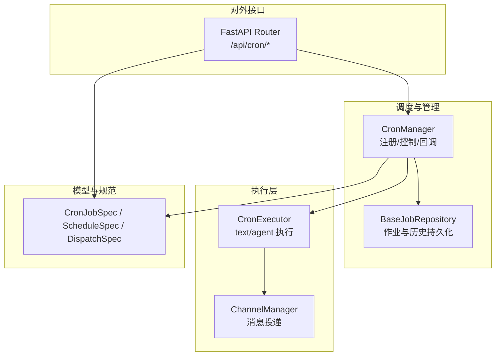
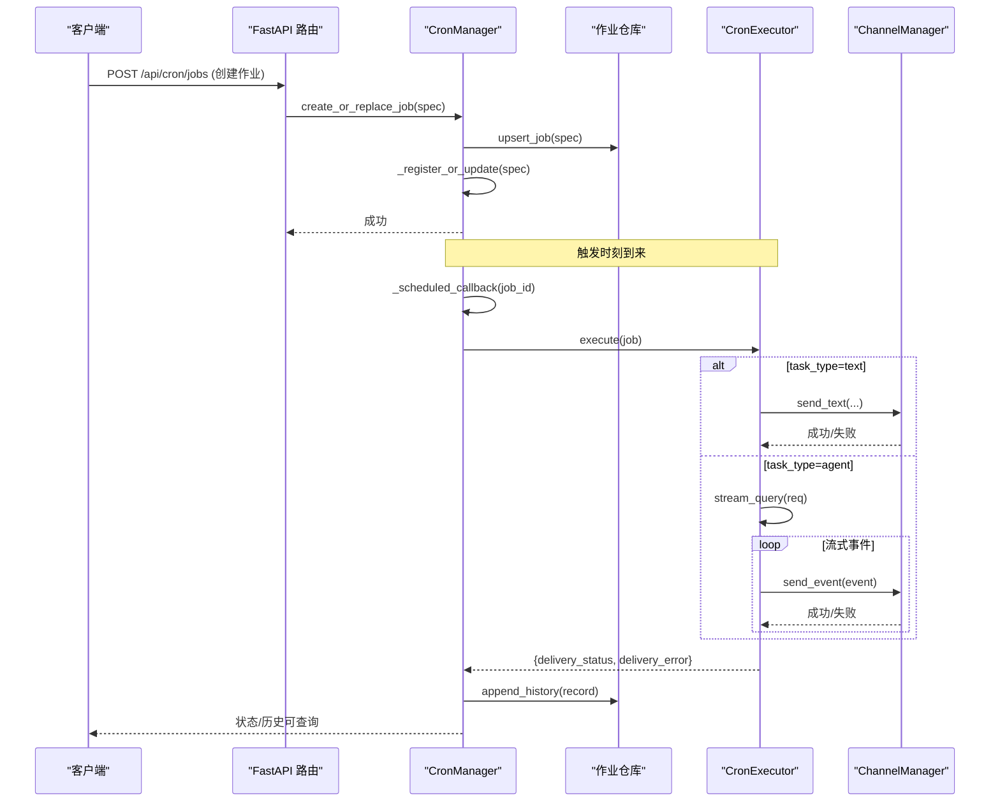
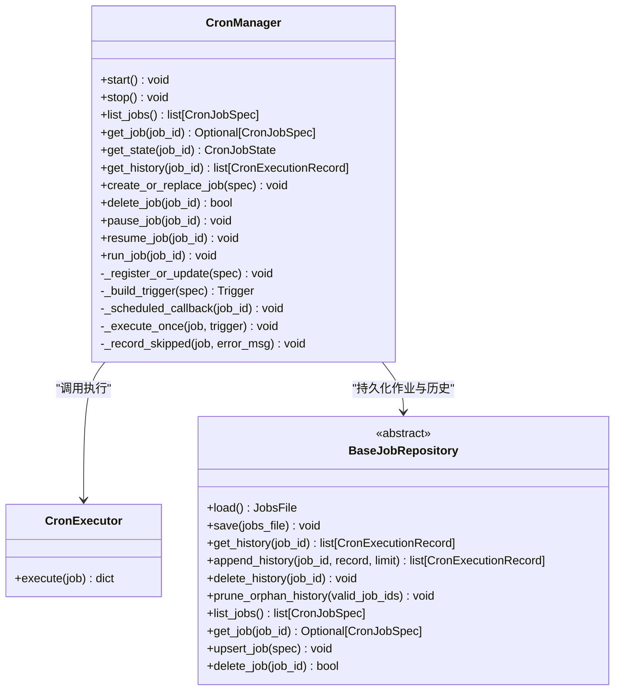
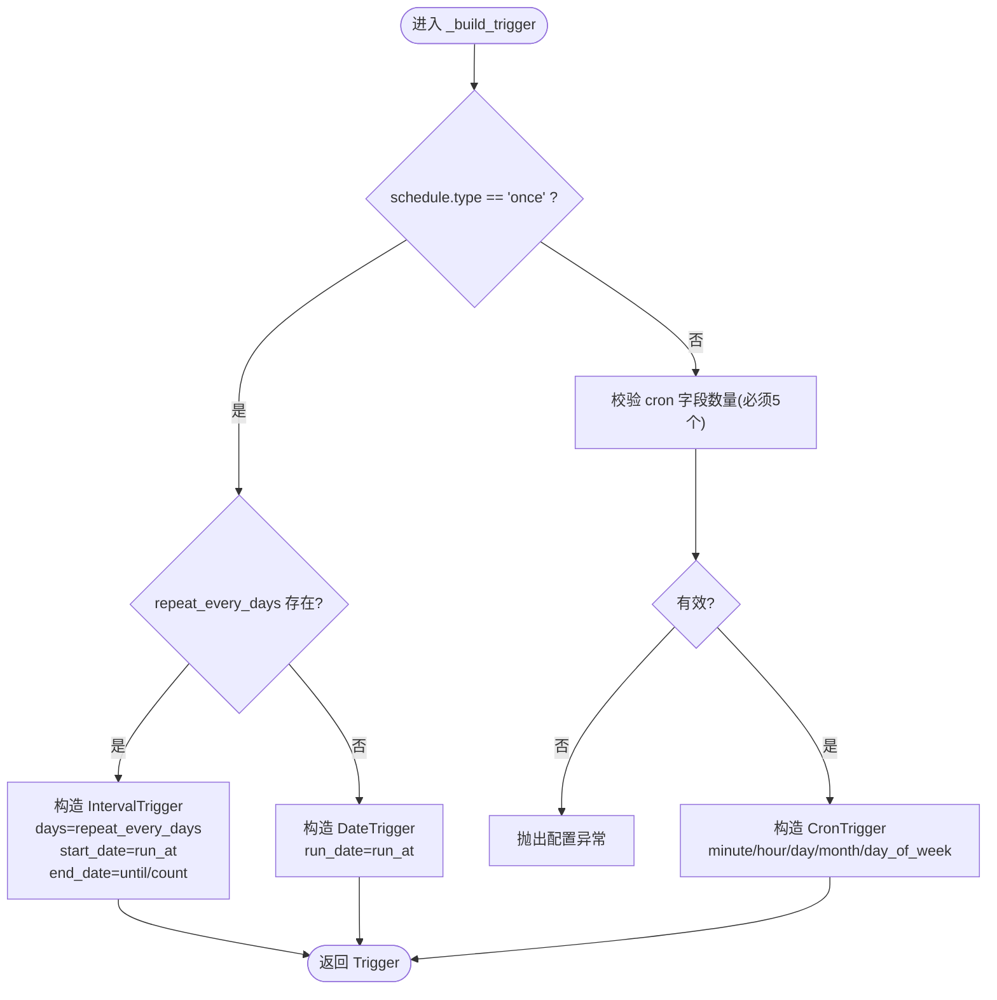
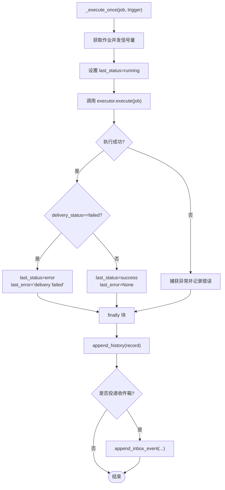
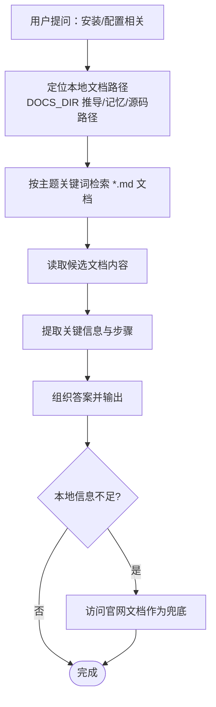
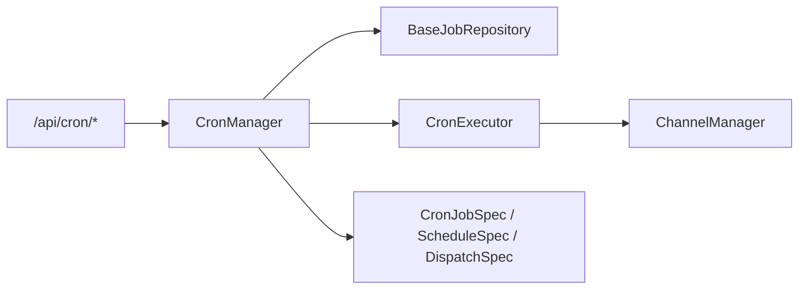

# 自动化任务技能

<cite>
**本文引用的文件列表**
- [src/qwenpaw/app/crons/manager.py](file://src/qwenpaw/app/crons/manager.py)
- [src/qwenpaw/app/crons/api.py](file://src/qwenpaw/app/crons/api.py)
- [src/qwenpaw/app/crons/models.py](file://src/qwenpaw/app/crons/models.py)
- [src/qwenpaw/app/crons/executor.py](file://src/qwenpaw/app/crons/executor.py)
- [src/qwenpaw/app/crons/repo/base.py](file://src/qwenpaw/app/crons/repo/base.py)
- [src/qwenpaw/agents/skills/cron-zh/SKILL.md](file://src/qwenpaw/agents/skills/cron-zh/SKILL.md)
- [src/qwenpaw/agents/skills/guidance-zh/SKILL.md](file://src/qwenpaw/agents/skills/guidance-zh/SKILL.md)
- [tests/integration/test_cron.py](file://tests/integration/test_cron.py)
- [tests/integration/test_cron_header.py](file://tests/integration/test_cron_header.py)
</cite>

## 目录
1. [简介](#简介)
2. [项目结构](#项目结构)
3. [核心组件](#核心组件)
4. [架构总览](#架构总览)
5. [详细组件分析](#详细组件分析)
6. [依赖关系分析](#依赖关系分析)
7. [性能与并发特性](#性能与并发特性)
8. [配置选项与参数说明](#配置选项与参数说明)
9. [使用模式与示例](#使用模式与示例)
10. [故障排查指南](#故障排查指南)
11. [结论](#结论)

## 简介
本章节面向 QwenPaw 的“自动化任务技能”，聚焦以下能力：
- 定时任务（cron）：支持经典 cron 表达式与日程型一次性/重复任务，提供创建、查询、暂停/恢复、手动触发、删除、历史查看等完整生命周期管理。
- 任务规划：通过统一调度器将多种触发方式（cron、日期、间隔）映射为可执行计划，并维护下次运行时间、最近状态与错误信息。
- 指导技能（guidance）：回答安装与配置问题，优先检索本地文档，必要时回退到官网文档。

本文件从系统架构、数据流、接口契约、调用关系、实现细节、最佳实践与常见问题等方面展开，既适合初学者快速上手，也为有经验的开发者提供深入的技术参考。

## 项目结构
围绕自动化任务的核心代码位于后端应用层与 Agent 技能描述中：
- 调度与管理：CronManager 负责加载作业、注册 APScheduler 触发器、执行回调、记录状态与历史。
- 执行器：CronExecutor 根据任务类型（text/agent）进行消息发送或代理对话，并将结果投递到目标 channel。
- API 路由：FastAPI 路由暴露 REST 接口，供控制台、CLI 和 Agent 调用。
- 模型定义：Pydantic 模型规范了作业规格、运行时参数、调度策略、派发目标与历史记录。
- 持久化抽象：BaseJobRepository 定义了作业与历史的读写接口，具体实现由工作区存储承担。
- 技能说明：内置 cron 与 guidance 技能的 SKILL.md 描述了使用规则、命令与流程。

图表来源
- [src/qwenpaw/app/crons/manager.py:53-162](file://src/qwenpaw/app/crons/manager.py#L53-L162)
- [src/qwenpaw/app/crons/executor.py:21-106](file://src/qwenpaw/app/crons/executor.py#L21-L106)
- [src/qwenpaw/app/crons/api.py:17-197](file://src/qwenpaw/app/crons/api.py#L17-L197)
- [src/qwenpaw/app/crons/models.py:57-270](file://src/qwenpaw/app/crons/models.py#L57-L270)
- [src/qwenpaw/app/crons/repo/base.py:10-80](file://src/qwenpaw/app/crons/repo/base.py#L10-L80)

章节来源
- [src/qwenpaw/app/crons/manager.py:53-162](file://src/qwenpaw/app/crons/manager.py#L53-L162)
- [src/qwenpaw/app/crons/api.py:17-197](file://src/qwenpaw/app/crons/api.py#L17-L197)
- [src/qwenpaw/app/crons/models.py:57-270](file://src/qwenpaw/app/crons/models.py#L57-L270)
- [src/qwenpaw/app/crons/executor.py:21-106](file://src/qwenpaw/app/crons/executor.py#L21-L106)
- [src/qwenpaw/app/crons/repo/base.py:10-80](file://src/qwenpaw/app/crons/repo/base.py#L10-L80)

## 核心组件
- CronManager
  - 职责：启动时加载作业、注册 APScheduler 触发器、处理心跳与梦境优化任务、维护作业状态与历史、提供暂停/恢复/手动触发等控制方法。
  - 关键点：每个作业独立并发信号量；misfire 事件记录跳过原因；next_run_at 在每次回调后刷新。
- CronExecutor
  - 职责：按 task_type 执行文本发送或 agent 对话；将流式事件投递到目标 channel；记录 trace 与最终状态。
  - 关键点：支持 share_session 与隔离 session；tool_safety 影响工具审批级别；超时与取消异常会写入 trace。
- API 路由
  - 职责：暴露作业 CRUD、暂停/恢复、手动触发、状态与历史查询、派发目标搜索等接口。
  - 关键点：服务器端生成 job id；校验 schedule 合法性；返回结构化响应。
- 模型定义
  - 职责：统一规范作业规格、调度策略、派发目标、运行时参数与执行历史。
  - 关键点：cron 字段规范化（星期几缩写转换）；once 与 cron 互斥；repeat 条件校验；save_result_to_inbox 默认值策略。
- 持久化抽象
  - 职责：定义作业与历史记录的加载、保存、追加、清理等接口。
  - 关键点：提供 list/get/upsert/delete 便捷方法；支持孤儿历史清理。

章节来源
- [src/qwenpaw/app/crons/manager.py:53-162](file://src/qwenpaw/app/crons/manager.py#L53-L162)
- [src/qwenpaw/app/crons/executor.py:21-106](file://src/qwenpaw/app/crons/executor.py#L21-L106)
- [src/qwenpaw/app/crons/api.py:17-197](file://src/qwenpaw/app/crons/api.py#L17-L197)
- [src/qwenpaw/app/crons/models.py:57-270](file://src/qwenpaw/app/crons/models.py#L57-L270)
- [src/qwenpaw/app/crons/repo/base.py:10-80](file://src/qwenpaw/app/crons/repo/base.py#L10-L80)

## 架构总览
下图展示了从 API 请求到作业执行的端到端流程，包括调度、执行、投递与状态记录。

图表来源
- [src/qwenpaw/app/crons/api.py:102-131](file://src/qwenpaw/app/crons/api.py#L102-L131)
- [src/qwenpaw/app/crons/manager.py:478-510](file://src/qwenpaw/app/crons/manager.py#L478-L510)
- [src/qwenpaw/app/crons/manager.py:586-601](file://src/qwenpaw/app/crons/manager.py#L586-L601)
- [src/qwenpaw/app/crons/executor.py:27-106](file://src/qwenpaw/app/crons/executor.py#L27-L106)
- [src/qwenpaw/app/crons/executor.py:164-205](file://src/qwenpaw/app/crons/executor.py#L164-L205)
- [src/qwenpaw/app/crons/manager.py:710-721](file://src/qwenpaw/app/crons/manager.py#L710-L721)

## 详细组件分析

### CronManager 类图与关键方法

图表来源
- [src/qwenpaw/app/crons/manager.py:53-162](file://src/qwenpaw/app/crons/manager.py#L53-L162)
- [src/qwenpaw/app/crons/manager.py:478-510](file://src/qwenpaw/app/crons/manager.py#L478-L510)
- [src/qwenpaw/app/crons/manager.py:586-601](file://src/qwenpaw/app/crons/manager.py#L586-L601)
- [src/qwenpaw/app/crons/executor.py:21-106](file://src/qwenpaw/app/crons/executor.py#L21-L106)
- [src/qwenpaw/app/crons/repo/base.py:10-80](file://src/qwenpaw/app/crons/repo/base.py#L10-L80)

章节来源
- [src/qwenpaw/app/crons/manager.py:53-162](file://src/qwenpaw/app/crons/manager.py#L53-L162)
- [src/qwenpaw/app/crons/manager.py:478-510](file://src/qwenpaw/app/crons/manager.py#L478-L510)
- [src/qwenpaw/app/crons/manager.py:586-601](file://src/qwenpaw/app/crons/manager.py#L586-L601)
- [src/qwenpaw/app/crons/executor.py:21-106](file://src/qwenpaw/app/crons/executor.py#L21-L106)
- [src/qwenpaw/app/crons/repo/base.py:10-80](file://src/qwenpaw/app/crons/repo/base.py#L10-L80)

### 调度触发构建逻辑流程图

图表来源
- [src/qwenpaw/app/crons/manager.py:511-563](file://src/qwenpaw/app/crons/manager.py#L511-L563)
- [src/qwenpaw/app/crons/models.py:57-138](file://src/qwenpaw/app/crons/models.py#L57-L138)

章节来源
- [src/qwenpaw/app/crons/manager.py:511-563](file://src/qwenpaw/app/crons/manager.py#L511-L563)
- [src/qwenpaw/app/crons/models.py:57-138](file://src/qwenpaw/app/crons/models.py#L57-L138)

### 执行一次的任务流程（含异常与投递）

图表来源
- [src/qwenpaw/app/crons/manager.py:650-782](file://src/qwenpaw/app/crons/manager.py#L650-L782)
- [src/qwenpaw/app/crons/executor.py:27-106](file://src/qwenpaw/app/crons/executor.py#L27-L106)

章节来源
- [src/qwenpaw/app/crons/manager.py:650-782](file://src/qwenpaw/app/crons/manager.py#L650-L782)
- [src/qwenpaw/app/crons/executor.py:27-106](file://src/qwenpaw/app/crons/executor.py#L27-L106)

### 指导技能（guidance）工作流程

图表来源
- [src/qwenpaw/agents/skills/guidance-zh/SKILL.md:1-148](file://src/qwenpaw/agents/skills/guidance-zh/SKILL.md#L1-L148)

章节来源
- [src/qwenpaw/agents/skills/guidance-zh/SKILL.md:1-148](file://src/qwenpaw/agents/skills/guidance-zh/SKILL.md#L1-L148)

## 依赖关系分析
- CronManager 依赖：
  - APScheduler（AsyncIOScheduler、CronTrigger、DateTrigger、IntervalTrigger）用于调度。
  - BaseJobRepository 用于作业与历史持久化。
  - CronExecutor 用于执行 text/agent 任务。
  - ChannelManager 用于消息投递。
  - 配置模块（heartbeat/dream cron）用于内部任务调度。
- API 路由依赖：
  - FastAPI 路由与 Pydantic 模型，提供 HTTP 接口与数据校验。
- 模型依赖：
  - 统一的 Pydantic 模型确保作业规格、调度策略、派发目标与运行时参数的强约束。

图表来源
- [src/qwenpaw/app/crons/api.py:17-197](file://src/qwenpaw/app/crons/api.py#L17-L197)
- [src/qwenpaw/app/crons/manager.py:53-162](file://src/qwenpaw/app/crons/manager.py#L53-L162)
- [src/qwenpaw/app/crons/executor.py:21-106](file://src/qwenpaw/app/crons/executor.py#L21-L106)
- [src/qwenpaw/app/crons/models.py:57-270](file://src/qwenpaw/app/crons/models.py#L57-L270)

章节来源
- [src/qwenpaw/app/crons/api.py:17-197](file://src/qwenpaw/app/crons/api.py#L17-L197)
- [src/qwenpaw/app/crons/manager.py:53-162](file://src/qwenpaw/app/crons/manager.py#L53-L162)
- [src/qwenpaw/app/crons/executor.py:21-106](file://src/qwenpaw/app/crons/executor.py#L21-L106)
- [src/qwenpaw/app/crons/models.py:57-270](file://src/qwenpaw/app/crons/models.py#L57-L270)

## 性能与并发特性
- 并发控制
  - 每个作业拥有独立的 asyncio.Semaphore，基于 runtime.max_concurrency 限制并行度，避免同一作业多次重叠执行。
- 误触发与最大实例
  - 监听 APScheduler 的 EVENT_JOB_MISSED 与 EVENT_JOB_MAX_INSTANCES，记录跳过原因与下一次运行时间，便于排障。
- 超时与取消
  - 执行器对 agent 任务设置超时（runtime.timeout_seconds），超时或取消会写入 trace 并标记状态。
- 历史裁剪
  - 历史记录上限 CRON_HISTORY_LIMIT，防止历史无限增长。

章节来源
- [src/qwenpaw/app/crons/manager.py:478-510](file://src/qwenpaw/app/crons/manager.py#L478-L510)
- [src/qwenpaw/app/crons/manager.py:380-444](file://src/qwenpaw/app/crons/manager.py#L380-L444)
- [src/qwenpaw/app/crons/executor.py:186-225](file://src/qwenpaw/app/crons/executor.py#L186-L225)
- [src/qwenpaw/app/crons/manager.py:43-44](file://src/qwenpaw/app/crons/manager.py#L43-L44)

## 配置选项与参数说明
- 调度策略（ScheduleSpec）
  - type：cron 或 once
  - cron：仅当 type=cron 时必填，支持 5 字段（分钟/小时/日/月/星期），内部会标准化星期字段为英文缩写
  - run_at：仅当 type=once 时必填，ISO 8601 时间
  - timezone：作业时区，默认 UTC
  - repeat_*：针对 once 的重复规则（repeat_every_days、repeat_end_type、repeat_until、repeat_count）
- 派发目标（DispatchSpec）
  - type：固定为 channel
  - channel：目标通道（如 console、dingtalk 等）
  - target：包含 user_id 与 session_id
  - mode：stream 或 final
  - meta：扩展元数据
- 运行时参数（JobRuntimeSpec）
  - max_concurrency：作业并发上限，默认 1
  - timeout_seconds：执行超时秒数，默认 120
  - misfire_grace_seconds：误触发容忍秒数，默认 600
  - share_session：是否共享目标会话，默认 True
  - tool_safety：工具执行安全策略，True 使用 AUTO（风险工具需审批），False 使用 OFF（无需审批）
- 作业规格（CronJobSpec）
  - id：服务器生成或替换时传入
  - name：作业名称
  - enabled：是否启用
  - task_type：text 或 agent
  - text：当 task_type=text 时必填
  - request：当 task_type=agent 时必填，包含 input、session_id、user_id 等
  - dispatch：派发目标
  - save_result_to_inbox：是否保存结果到收件箱，默认策略：text+cron 为 OFF，其他为 ON
  - meta：扩展元数据

章节来源
- [src/qwenpaw/app/crons/models.py:57-270](file://src/qwenpaw/app/crons/models.py#L57-L270)

## 使用模式与示例
- 创建任务（HTTP）
  - POST /api/cron/jobs，提交 CronJobSpec，服务器生成 id 并注册调度。
  - 示例参考集成测试中的最小文本任务 spec。
- 更新任务（HTTP）
  - PUT /api/cron/jobs/{job_id}，替换现有作业，id 必须匹配。
- 暂停/恢复（HTTP）
  - POST /api/cron/jobs/{job_id}/pause
  - POST /api/cron/jobs/{job_id}/resume
- 手动触发（HTTP）
  - POST /api/cron/jobs/{job_id}/run，异步执行一次。
- 查询状态与历史（HTTP）
  - GET /api/cron/jobs/{job_id}/state
  - GET /api/cron/jobs/{job_id}/history
- 派发目标搜索（HTTP）
  - GET /api/cron/dispatch-targets?channel=&keyword=&limit=
- CLI 与技能说明
  - 内置 cron 技能提供了完整的命令行用法与决策规则，强调显式 --agent-id、选择 cron 或 scheduled、确认目标 channel/user/session 等。
  - 内置 guidance 技能提供了安装与配置问答的标准流程，优先本地文档，必要时回退官网。

章节来源
- [src/qwenpaw/app/crons/api.py:89-197](file://src/qwenpaw/app/crons/api.py#L89-L197)
- [tests/integration/test_cron.py:13-31](file://tests/integration/test_cron.py#L13-L31)
- [tests/integration/test_cron_header.py:255-285](file://tests/integration/test_cron_header.py#L255-L285)
- [src/qwenpaw/agents/skills/cron-zh/SKILL.md:1-280](file://src/qwenpaw/agents/skills/cron-zh/SKILL.md#L1-L280)
- [src/qwenpaw/agents/skills/guidance-zh/SKILL.md:1-148](file://src/qwenpaw/agents/skills/guidance-zh/SKILL.md#L1-L148)

## 故障排查指南
- 常见错误与处理
  - 未传 --agent-id：任务可能落到错误的 agent/workspace，务必显式传递。
  - 缺少必要参数：创建前需确认 type、name、schedule-type、cron/run-at、channel、target-user、target-session、text/request、timeout。
  - 操作已有任务前不先查：建议先用 list 找到正确的 job_id。
  - 调度表达式无效：cron 必须为 5 字段，seconds 不支持；once 需要 run_at；repeat 条件需满足 until/count 要求。
  - 投递失败：text/agent 投递失败会记录 delivery_error，并在收件箱中产生 fallback 事件（若开启）。
  - 误触发与最大实例：错过执行或达到最大实例会被记录为 skipped，可查看 history 与 state。
- 排障步骤
  - 使用 state 接口查看 last_status、last_error、next_run_at。
  - 使用 history 接口查看最近执行记录与错误详情。
  - 检查 channel 配置与目标 session 是否存在。
  - 调整 timeout 与 max_concurrency，避免高频任务重叠。
  - 对于 agent 任务，关注 tool_safety 与审批策略，避免阻塞自动执行。

章节来源
- [src/qwenpaw/app/crons/manager.py:380-444](file://src/qwenpaw/app/crons/manager.py#L380-L444)
- [src/qwenpaw/app/crons/manager.py:710-782](file://src/qwenpaw/app/crons/manager.py#L710-L782)
- [src/qwenpaw/app/crons/models.py:57-138](file://src/qwenpaw/app/crons/models.py#L57-L138)
- [src/qwenpaw/agents/skills/cron-zh/SKILL.md:231-280](file://src/qwenpaw/agents/skills/cron-zh/SKILL.md#L231-L280)

## 结论
QwenPaw 的自动化任务技能以 CronManager 为核心，结合 CronExecutor 与 FastAPI 路由，提供了完善的定时任务管理能力。其设计兼顾易用性与可扩展性：
- 统一调度：支持 cron、日期与间隔三种触发方式，并通过模型校验保证配置正确性。
- 灵活派发：支持 text 与 agent 两种任务类型，并可配置会话共享与工具安全策略。
- 可观测性：状态与历史持久化，误触发与最大实例事件记录，便于排障与审计。
- 技能化引导：内置 cron 与 guidance 技能，帮助使用者正确决策与操作。

通过合理配置并发、超时与投递策略，并结合历史与状态查询，可以在生产环境中稳定地运行各类自动化任务。