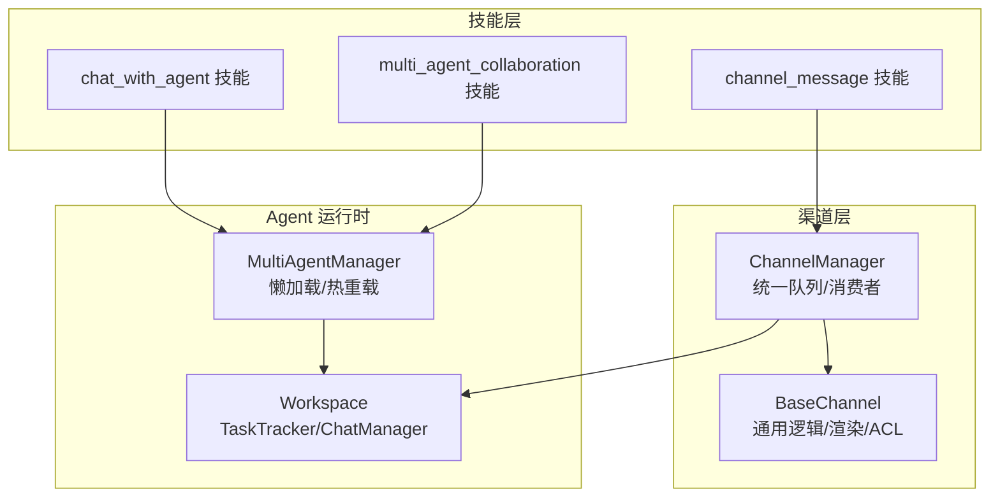
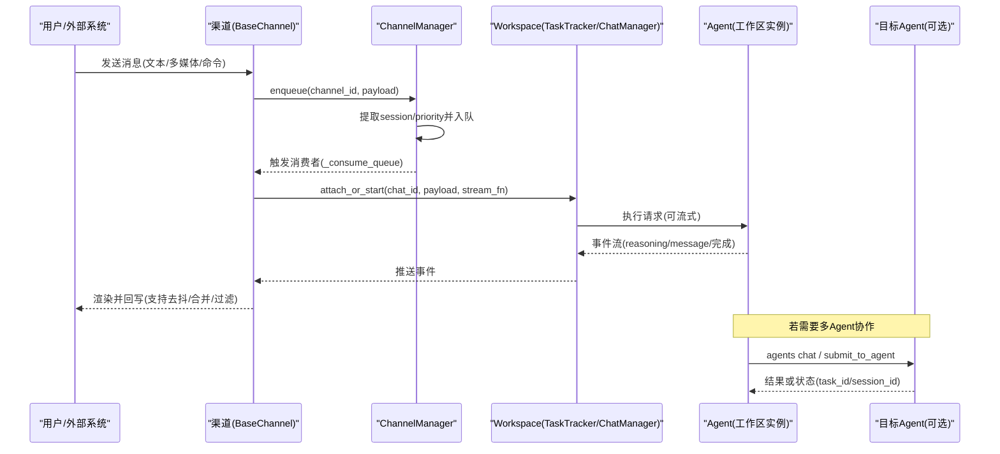
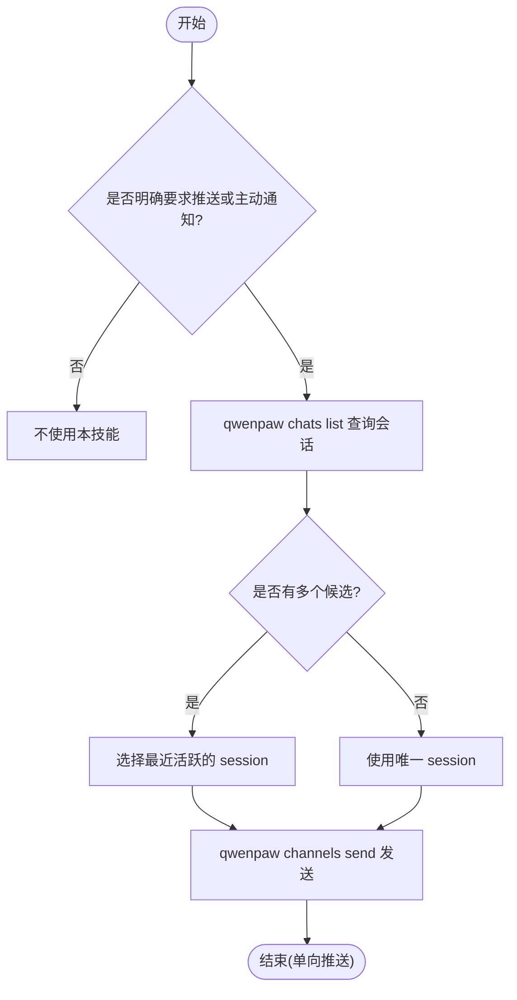
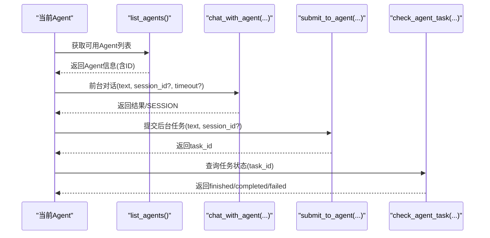
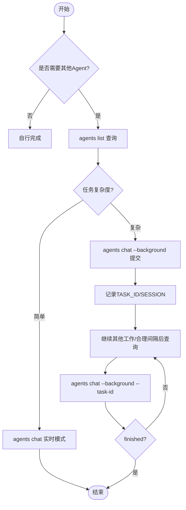
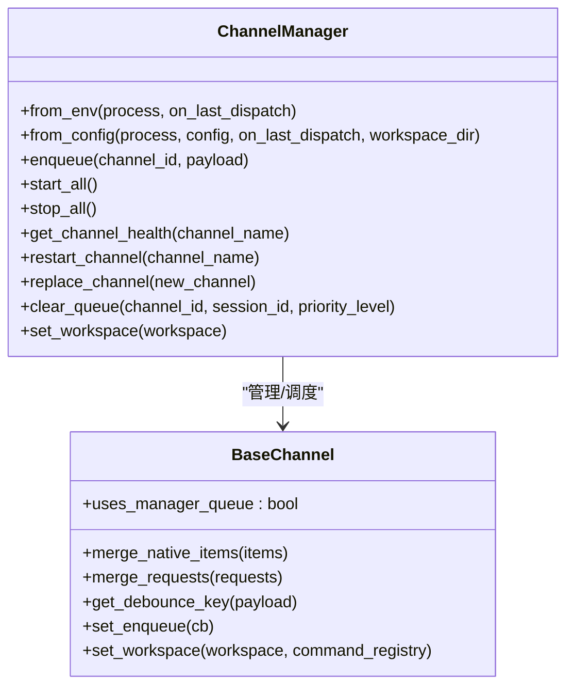
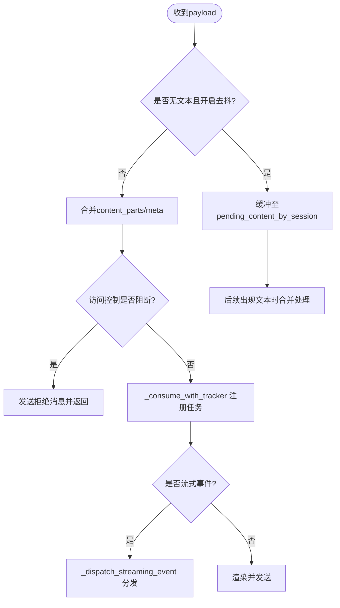
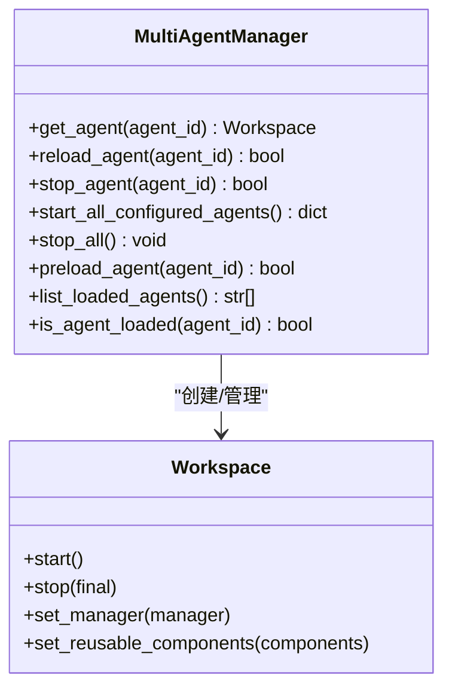
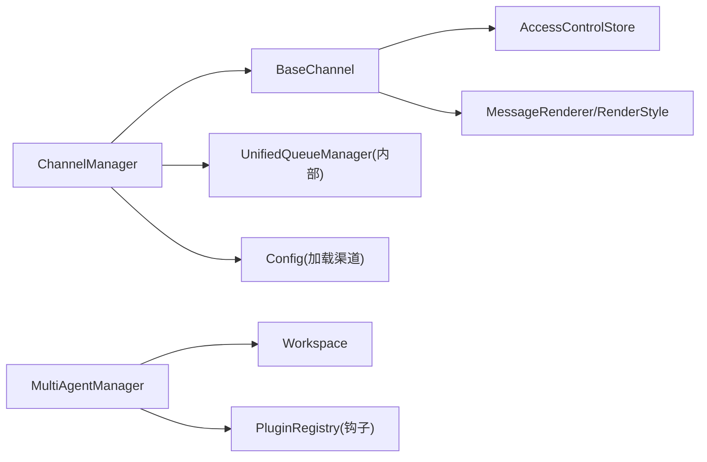

# 通信协作技能

<cite>
**本文引用的文件**
- [src/qwenpaw/agents/skills/channel_message-zh/SKILL.md](file://src/qwenpaw/agents/skills/channel_message-zh/SKILL.md)
- [src/qwenpaw/agents/skills/chat_with_agent-zh/SKILL.md](file://src/qwenpaw/agents/skills/chat_with_agent-zh/SKILL.md)
- [src/qwenpaw/agents/skills/multi_agent_collaboration-zh/SKILL.md](file://src/qwenpaw/agents/skills/multi_agent_collaboration-zh/SKILL.md)
- [src/qwenpaw/app/channels/__init__.py](file://src/qwenpaw/app/channels/__init__.py)
- [src/qwenpaw/app/channels/manager.py](file://src/qwenpaw/app/channels/manager.py)
- [src/qwenpaw/app/channels/base.py](file://src/qwenpaw/app/channels/base.py)
- [src/qwenpaw/app/multi_agent_manager.py](file://src/qwenpaw/app/multi_agent_manager.py)
</cite>

## 目录
1. [简介](#简介)
2. [项目结构](#项目结构)
3. [核心组件](#核心组件)
4. [架构总览](#架构总览)
5. [详细组件分析](#详细组件分析)
6. [依赖关系分析](#依赖关系分析)
7. [性能与并发特性](#性能与并发特性)
8. [故障排查指南](#故障排查指南)
9. [结论](#结论)
10. [附录：配置与参数速查](#附录配置与参数速查)

## 简介
本文件聚焦 QwenPaw 的“通信协作技能”，围绕以下能力进行系统化说明：
- Agent 间对话（多智能体协作）
- 多渠道消息处理（统一队列、优先级、去抖合并、流式推送）
- 技能使用模式与调用关系（CLI 命令、工具函数、后台任务）
- 配置选项、参数与返回值约定
- 常见问题与解决方案

文档既适合初学者快速上手，也为有经验的开发者提供足够的实现细节与架构图示。

## 项目结构
与通信协作相关的代码主要分布在如下位置：
- 技能说明（面向 Agent 的行为规范与用法）：skills 目录下的 channel_message、chat_with_agent、multi_agent_collaboration
- 渠道管理与基础通道：app/channels 下的 manager.py、base.py、__init__.py
- 多 Agent 工作区管理：app/multi_agent_manager.py

图表来源
- [src/qwenpaw/app/channels/manager.py:68-112](file://src/qwenpaw/app/channels/manager.py#L68-L112)
- [src/qwenpaw/app/channels/base.py:80-170](file://src/qwenpaw/app/channels/base.py#L80-L170)
- [src/qwenpaw/app/multi_agent_manager.py:23-150](file://src/qwenpaw/app/multi_agent_manager.py#L23-L150)

章节来源
- [src/qwenpaw/agents/skills/channel_message-zh/SKILL.md:1-251](file://src/qwenpaw/agents/skills/channel_message-zh/SKILL.md#L1-L251)
- [src/qwenpaw/agents/skills/chat_with_agent-zh/SKILL.md:1-118](file://src/qwenpaw/agents/skills/chat_with_agent-zh/SKILL.md#L1-L118)
- [src/qwenpaw/agents/skills/multi_agent_collaboration-zh/SKILL.md:1-477](file://src/qwenpaw/agents/skills/multi_agent_collaboration-zh/SKILL.md#L1-L477)
- [src/qwenpaw/app/channels/manager.py:68-112](file://src/qwenpaw/app/channels/manager.py#L68-L112)
- [src/qwenpaw/app/channels/base.py:80-170](file://src/qwenpaw/app/channels/base.py#L80-L170)
- [src/qwenpaw/app/multi_agent_manager.py:23-150](file://src/qwenpaw/app/multi_agent_manager.py#L23-L150)

## 核心组件
- ChannelManager：负责多渠道的统一入队、优先级路由、批量合并、消费者循环、健康检查与动态替换。
- BaseChannel：定义所有渠道的通用行为，包括去抖、内容合并、访问控制、流式事件分发、渲染策略等。
- MultiAgentManager：集中管理多个 Agent 工作区的生命周期（懒加载、热重载、并行启动、优雅停止）。
- 技能文档：为 Agent 提供“何时用、怎么用、参数与返回”的权威指引，覆盖频道消息推送、Agent 对话、多 Agent 协作。

章节来源
- [src/qwenpaw/app/channels/manager.py:68-112](file://src/qwenpaw/app/channels/manager.py#L68-L112)
- [src/qwenpaw/app/channels/base.py:80-170](file://src/qwenpaw/app/channels/base.py#L80-L170)
- [src/qwenpaw/app/multi_agent_manager.py:23-150](file://src/qwenpaw/app/multi_agent_manager.py#L23-L150)
- [src/qwenpaw/agents/skills/channel_message-zh/SKILL.md:1-251](file://src/qwenpaw/agents/skills/channel_message-zh/SKILL.md#L1-L251)
- [src/qwenpaw/agents/skills/chat_with_agent-zh/SKILL.md:1-118](file://src/qwenpaw/agents/skills/chat_with_agent-zh/SKILL.md#L1-L118)
- [src/qwenpaw/agents/skills/multi_agent_collaboration-zh/SKILL.md:1-477](file://src/qwenpaw/agents/skills/multi_agent_collaboration-zh/SKILL.md#L1-L477)

## 架构总览
下图展示了从用户输入到 Agent 处理再到渠道回复的整体流程，以及多 Agent 协作的关键路径。

图表来源
- [src/qwenpaw/app/channels/manager.py:377-473](file://src/qwenpaw/app/channels/manager.py#L377-L473)
- [src/qwenpaw/app/channels/base.py:529-585](file://src/qwenpaw/app/channels/base.py#L529-L585)
- [src/qwenpaw/app/multi_agent_manager.py:54-150](file://src/qwenpaw/app/multi_agent_manager.py#L54-L150)
- [src/qwenpaw/agents/skills/multi_agent_collaboration-zh/SKILL.md:124-176](file://src/qwenpaw/agents/skills/multi_agent_collaboration-zh/SKILL.md#L124-L176)

## 详细组件分析

### 组件一：频道消息推送（channel_message 技能）
- 适用场景：单向推送通知、异步结果回推、定时提醒等；不等待用户回复。
- 决策规则：先查询会话列表，再选择最近活跃会话；严禁猜测 target-user/target-session。
- 关键命令与参数：
  - chats list：按 agent-id、channel、user-id 筛选
  - channels send：必填 agent-id、channel、target-user、target-session、text
- 输出与错误：无用户回复；常见错误包含未查会话、缺参、误把正常回复当推送等。

图表来源
- [src/qwenpaw/agents/skills/channel_message-zh/SKILL.md:30-108](file://src/qwenpaw/agents/skills/channel_message-zh/SKILL.md#L30-L108)
- [src/qwenpaw/agents/skills/channel_message-zh/SKILL.md:215-238](file://src/qwenpaw/agents/skills/channel_message-zh/SKILL.md#L215-L238)

章节来源
- [src/qwenpaw/agents/skills/channel_message-zh/SKILL.md:1-251](file://src/qwenpaw/agents/skills/channel_message-zh/SKILL.md#L1-L251)

### 组件二：与 Agent 对话（chat_with_agent 技能）
- 适用场景：向其他 Agent 求助、复核、方案建议、续聊保留上下文。
- 使用流程：
  1) 确保具备内建工具 list_agents() 与 chat_with_agent(...)
  2) 通过 list_agents() 选择目标 Agent ID
  3) 前台对话：chat_with_agent(to_agent, text, session_id?, timeout?)
  4) 后台任务：submit_to_agent(...) + check_agent_task(...)
- 注意事项：对话前缀建议带上发起方标识；复用 session_id 保持上下文。

图表来源
- [src/qwenpaw/agents/skills/chat_with_agent-zh/SKILL.md:39-98](file://src/qwenpaw/agents/skills/chat_with_agent-zh/SKILL.md#L39-L98)

章节来源
- [src/qwenpaw/agents/skills/chat_with_agent-zh/SKILL.md:1-118](file://src/qwenpaw/agents/skills/chat_with_agent-zh/SKILL.md#L1-L118)

### 组件三：多智能体协作（multi_agent_collaboration 技能）
- 适用场景：需要其他 Agent 的专业能力、上下文或 workspace 内容；用户明确要求调用时优先执行。
- 常用命令：
  - agents list：列出可用 Agent
  - agents chat：实时模式或后台模式(--background)
  - agents chat --background --task-id：查询任务状态
- 任务模式选择：简单查询用实时模式；复杂任务（数据分析、报告生成、批量处理、慢速API）用后台模式。
- 会话复用：首次返回 SESSION，后续续聊必须传入 --session-id。

图表来源
- [src/qwenpaw/agents/skills/multi_agent_collaboration-zh/SKILL.md:104-176](file://src/qwenpaw/agents/skills/multi_agent_collaboration-zh/SKILL.md#L104-L176)
- [src/qwenpaw/agents/skills/multi_agent_collaboration-zh/SKILL.md:293-466](file://src/qwenpaw/agents/skills/multi_agent_collaboration-zh/SKILL.md#L293-L466)

章节来源
- [src/qwenpaw/agents/skills/multi_agent_collaboration-zh/SKILL.md:1-477](file://src/qwenpaw/agents/skills/multi_agent_collaboration-zh/SKILL.md#L1-L477)

### 组件四：渠道管理器（ChannelManager）
职责与要点：
- 从环境或配置构建渠道实例，注入统一 process 处理器与 on_last_dispatch 回调。
- 统一入队：线程安全 enqueue -> _enqueue_one -> UnifiedQueueManager.enqueue。
- 消费者循环：_consume_queue 拉取并批量合并，调用渠道 consume_one/_consume_one_request。
- 健康检查与重启：get_channel_health、restart_channel、replace_channel。
- 优雅关闭：取消启动/入队任务，停止队列与渠道。

图表来源
- [src/qwenpaw/app/channels/manager.py:68-112](file://src/qwenpaw/app/channels/manager.py#L68-L112)
- [src/qwenpaw/app/channels/manager.py:364-473](file://src/qwenpaw/app/channels/manager.py#L364-L473)
- [src/qwenpaw/app/channels/manager.py:579-695](file://src/qwenpaw/app/channels/manager.py#L579-L695)
- [src/qwenpaw/app/channels/base.py:80-170](file://src/qwenpaw/app/channels/base.py#L80-L170)

章节来源
- [src/qwenpaw/app/channels/manager.py:68-112](file://src/qwenpaw/app/channels/manager.py#L68-L112)
- [src/qwenpaw/app/channels/manager.py:364-473](file://src/qwenpaw/app/channels/manager.py#L364-L473)
- [src/qwenpaw/app/channels/manager.py:579-695](file://src/qwenpaw/app/channels/manager.py#L579-L695)

### 组件五：基础渠道（BaseChannel）
职责与要点：
- 通用入队/消费封装：_consume_with_tracker 注册 TaskTracker，stream_from_queue 推送事件。
- 去抖与合并：_apply_no_text_debounce、merge_native_items、merge_requests。
- 访问控制：_access_control_gate 白名单/黑名单/待审批，拒绝时回写提示。
- 流式事件分发：_dispatch_streaming_event 将 reasoning/message 分派到 on_streaming_* 钩子。
- 渲染风格：根据 show_tool_details/filter_thinking/internal_tools 控制展示。

图表来源
- [src/qwenpaw/app/channels/base.py:302-337](file://src/qwenpaw/app/channels/base.py#L302-L337)
- [src/qwenpaw/app/channels/base.py:379-451](file://src/qwenpaw/app/channels/base.py#L379-L451)
- [src/qwenpaw/app/channels/base.py:529-585](file://src/qwenpaw/app/channels/base.py#L529-L585)
- [src/qwenpaw/app/channels/base.py:604-793](file://src/qwenpaw/app/channels/base.py#L604-L793)

章节来源
- [src/qwenpaw/app/channels/base.py:80-170](file://src/qwenpaw/app/channels/base.py#L80-L170)
- [src/qwenpaw/app/channels/base.py:302-337](file://src/qwenpaw/app/channels/base.py#L302-L337)
- [src/qwenpaw/app/channels/base.py:379-451](file://src/qwenpaw/app/channels/base.py#L379-L451)
- [src/qwenpaw/app/channels/base.py:529-585](file://src/qwenpaw/app/channels/base.py#L529-L585)
- [src/qwenpaw/app/channels/base.py:604-793](file://src/qwenpaw/app/channels/base.py#L604-L793)

### 组件六：多 Agent 管理器（MultiAgentManager）
职责与要点：
- 懒加载：首次 get_agent 才创建并启动 Workspace，并发调用去重。
- 热重载：reload_agent 原子替换旧实例，旧实例优雅停止（有活动任务则延迟清理）。
- 并行启动：start_all_configured_agents 并发启动已启用的 Agent。
- 生命周期：stop_all 并行停止，cancel_all_cleanup_tasks 清理后台任务。

图表来源
- [src/qwenpaw/app/multi_agent_manager.py:23-150](file://src/qwenpaw/app/multi_agent_manager.py#L23-L150)
- [src/qwenpaw/app/multi_agent_manager.py:321-448](file://src/qwenpaw/app/multi_agent_manager.py#L321-L448)
- [src/qwenpaw/app/multi_agent_manager.py:540-601](file://src/qwenpaw/app/multi_agent_manager.py#L540-L601)

章节来源
- [src/qwenpaw/app/multi_agent_manager.py:23-150](file://src/qwenpaw/app/multi_agent_manager.py#L23-L150)
- [src/qwenpaw/app/multi_agent_manager.py:321-448](file://src/qwenpaw/app/multi_agent_manager.py#L321-L448)
- [src/qwenpaw/app/multi_agent_manager.py:540-601](file://src/qwenpaw/app/multi_agent_manager.py#L540-L601)

## 依赖关系分析
- ChannelManager 依赖 BaseChannel 的具体实现与 UnifiedQueueManager（内部模块），并通过 set_workspace 注入 Workspace 以访问 TaskTracker/ChatManager。
- BaseChannel 依赖渲染器、访问控制存储、配置加载与 schemas 类型。
- MultiAgentManager 依赖 Workspace 生命周期与插件钩子（workspace_created）。

图表来源
- [src/qwenpaw/app/channels/manager.py:92-112](file://src/qwenpaw/app/channels/manager.py#L92-L112)
- [src/qwenpaw/app/channels/base.py:157-170](file://src/qwenpaw/app/channels/base.py#L157-L170)
- [src/qwenpaw/app/multi_agent_manager.py:160-203](file://src/qwenpaw/app/multi_agent_manager.py#L160-L203)

章节来源
- [src/qwenpaw/app/channels/manager.py:92-112](file://src/qwenpaw/app/channels/manager.py#L92-L112)
- [src/qwenpaw/app/channels/base.py:157-170](file://src/qwenpaw/app/channels/base.py#L157-L170)
- [src/qwenpaw/app/multi_agent_manager.py:160-203](file://src/qwenpaw/app/multi_agent_manager.py#L160-L203)

## 性能与并发特性
- 渠道入队与消费者：
  - enqueue 线程安全，基于 call_soon_threadsafe 投递到事件循环。
  - _enqueue_with_timeout 对入队操作设置超时保护，避免阻塞。
  - _consume_queue 同 key 批量拉取并合并，减少重复处理。
- 流式事件：
  - BaseChannel 支持 streaming_enabled 开关，reasoning/message 增量推送，带最小间隔与超时保护。
- 多 Agent 启动：
  - start_all_configured_agents 并发启动，get_agent 仅短锁，长耗时初始化在锁外执行。
  - reload_agent 原子替换，旧实例优雅停止，有活动任务则延迟清理。

章节来源
- [src/qwenpaw/app/channels/manager.py:364-473](file://src/qwenpaw/app/channels/manager.py#L364-L473)
- [src/qwenpaw/app/channels/base.py:604-793](file://src/qwenpaw/app/channels/base.py#L604-L793)
- [src/qwenpaw/app/multi_agent_manager.py:540-601](file://src/qwenpaw/app/multi_agent_manager.py#L540-L601)
- [src/qwenpaw/app/multi_agent_manager.py:321-448](file://src/qwenpaw/app/multi_agent_manager.py#L321-L448)

## 故障排查指南
- 渠道无法启动或连接缓慢：
  - 现象：start_all 中 channel.start() 异常被捕获并记录日志。
  - 处理：检查渠道配置与网络连通性，必要时使用 restart_channel 重建实例。
- 消息丢失或未处理：
  - 现象：enqueue 超时或被取消。
  - 处理：确认队列容量与消费者是否正常，查看 _enqueue_with_timeout 日志。
- 访问控制拦截：
  - 现象：用户收到“需要审批/已被禁止”的消息。
  - 处理：检查 ACL 白名单/黑名单/待审批状态，调整策略或放行。
- 多 Agent 热重载失败：
  - 现象：新实例启动失败，旧实例仍服务。
  - 处理：查看 reload_agent 异常日志，确认配置与工作区资源可用性。

章节来源
- [src/qwenpaw/app/channels/manager.py:474-570](file://src/qwenpaw/app/channels/manager.py#L474-L570)
- [src/qwenpaw/app/channels/manager.py:610-695](file://src/qwenpaw/app/channels/manager.py#L610-L695)
- [src/qwenpaw/app/channels/base.py:379-451](file://src/qwenpaw/app/channels/base.py#L379-L451)
- [src/qwenpaw/app/multi_agent_manager.py:321-448](file://src/qwenpaw/app/multi_agent_manager.py#L321-L448)

## 结论
QwenPaw 的通信协作技能通过“技能规范 + 渠道框架 + 多 Agent 管理”的组合，提供了：
- 明确的 Agent 协作范式（前台/后台、会话复用、身份前缀）
- 统一的渠道消息处理（优先级、去抖、合并、流式）
- 高可用的运行期保障（懒加载、热重载、优雅停止）

遵循技能文档中的决策规则与参数约定，结合 ChannelManager/BaseChannel 的能力，即可构建稳定、可扩展的多平台消息与多 Agent 协作系统。

## 附录：配置与参数速查
- 渠道构造（from_config）：
  - 参数：process、config、on_reply_sent、show_tool_details、filter_tool_messages、filter_thinking、no_text_debounce、workspace_dir
  - 作用：按配置启用渠道并注入渲染与过滤策略
- 渠道通用参数（BaseChannel）：
  - dm_policy/group_policy：私聊/群聊策略
  - allow_from/deny_message：允许/拒绝列表与提示
  - require_mention/no_text_debounce/streaming_enabled/access_control_dm/access_control_group
- 多 Agent 管理：
  - get_agent/reload_agent/stop_agent/start_all_configured_agents/stop_all/preload_agent
- 技能命令与参数：
  - channel_message：chats list、channels send（必填：agent-id、channel、target-user、target-session、text）
  - chat_with_agent：list_agents、chat_with_agent、submit_to_agent、check_agent_task
  - multi_agent_collaboration：agents list、agents chat（--background/--task-id/--session-id/--mode/--timeout/--json-output）

章节来源
- [src/qwenpaw/app/channels/manager.py:114-228](file://src/qwenpaw/app/channels/manager.py#L114-L228)
- [src/qwenpaw/app/channels/base.py:121-170](file://src/qwenpaw/app/channels/base.py#L121-L170)
- [src/qwenpaw/app/multi_agent_manager.py:54-150](file://src/qwenpaw/app/multi_agent_manager.py#L54-L150)
- [src/qwenpaw/agents/skills/channel_message-zh/SKILL.md:215-238](file://src/qwenpaw/agents/skills/channel_message-zh/SKILL.md#L215-L238)
- [src/qwenpaw/agents/skills/chat_with_agent-zh/SKILL.md:39-98](file://src/qwenpaw/agents/skills/chat_with_agent-zh/SKILL.md#L39-L98)
- [src/qwenpaw/agents/skills/multi_agent_collaboration-zh/SKILL.md:263-290](file://src/qwenpaw/agents/skills/multi_agent_collaboration-zh/SKILL.md#L263-L290)