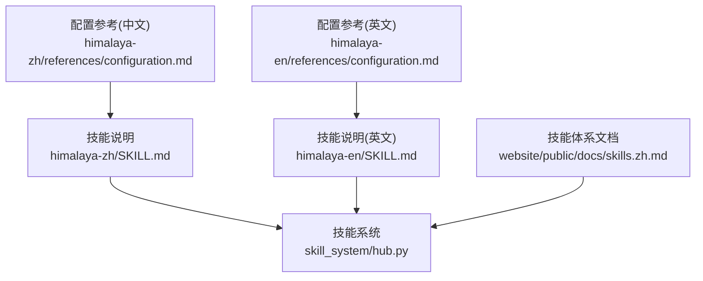
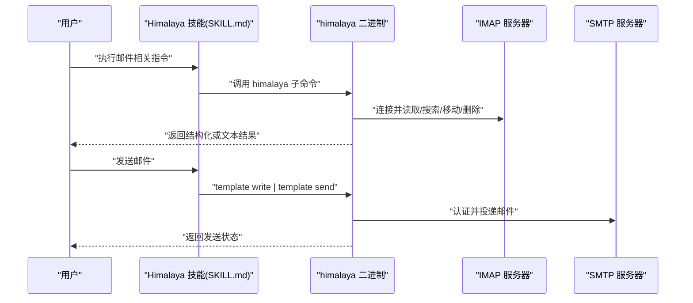
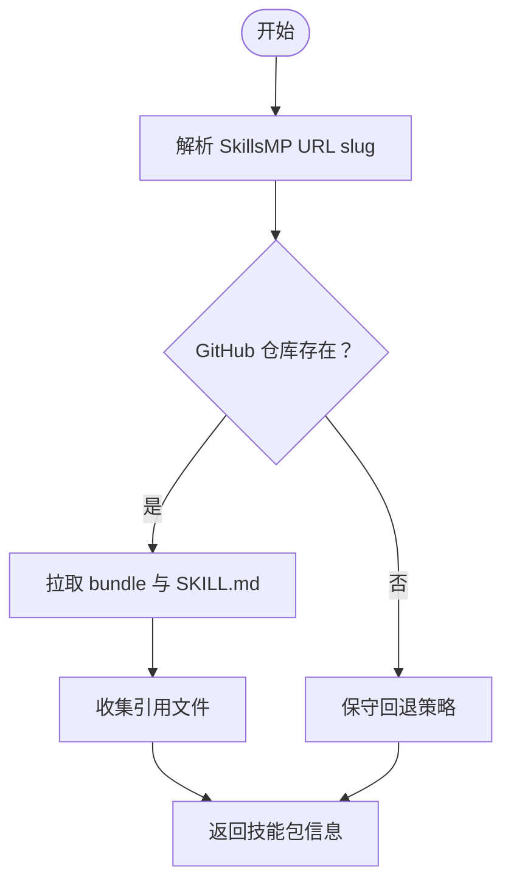

# 邮件处理技能

<cite>
**本文引用的文件**   
- [himalaya-zh/SKILL.md](file://src/qwenpaw/agents/skills/himalaya-zh/SKILL.md)
- [himalaya-en/SKILL.md](file://src/qwenpaw/agents/skills/himalaya-en/SKILL.md)
- [himalaya-zh/references/configuration.md](file://src/qwenpaw/agents/skills/himalaya-zh/references/configuration.md)
- [himalaya-en/references/configuration.md](file://src/qwenpaw/agents/skills/himalaya-en/references/configuration.md)
- [skills.zh.md](file://website/public/docs/skills.zh.md)
- [hub.py](file://src/qwenpaw/agents/skill_system/hub.py)
</cite>

## 目录
1. [简介](#简介)
2. [项目结构](#项目结构)
3. [核心组件](#核心组件)
4. [架构总览](#架构总览)
5. [详细组件分析](#详细组件分析)
6. [依赖关系分析](#依赖关系分析)
7. [性能与可靠性考虑](#性能与可靠性考虑)
8. [故障排查指南](#故障排查指南)
9. [结论](#结论)
10. [附录：常用命令速查](#附录常用命令速查)

## 简介
本章节面向 QwenPaw 的“邮件处理技能”，聚焦 Himalaya 邮件客户端集成。该技能通过命令行工具 himalaya 实现 IMAP/SMTP 邮件管理，包括列出、阅读、搜索、整理、发送等能力，并支持多账户与 MML（MIME Meta Language）撰写。文档将覆盖功能特性、使用方法、配置选项、调用关系、接口与使用模式，并提供来自仓库的实际示例路径，帮助初学者快速上手，同时为有经验的开发者提供足够的技术深度。

## 项目结构
QwenPaw 内置了中英文两套 Himalaya 技能说明与参考配置，位于 agents/skills 目录下；同时在网站文档中提供了技能体系概览，并在技能系统代码中维护了从外部仓库拉取技能的解析逻辑。

图示来源
- [himalaya-zh/SKILL.md:1-295](file://src/qwenpaw/agents/skills/himalaya-zh/SKILL.md#L1-L295)
- [himalaya-en/SKILL.md:1-296](file://src/qwenpaw/agents/skills/himalaya-en/SKILL.md#L1-L296)
- [himalaya-zh/references/configuration.md:1-185](file://src/qwenpaw/agents/skills/himalaya-zh/references/configuration.md#L1-L185)
- [himalaya-en/references/configuration.md:1-185](file://src/qwenpaw/agents/skills/himalaya-en/references/configuration.md#L1-L185)
- [skills.zh.md:70-118](file://website/public/docs/skills.zh.md#L70-L118)
- [hub.py:1300-1499](file://src/qwenpaw/agents/skill_system/hub.py#L1300-L1499)

章节来源
- [himalaya-zh/SKILL.md:1-295](file://src/qwenpaw/agents/skills/himalaya-zh/SKILL.md#L1-L295)
- [himalaya-en/SKILL.md:1-296](file://src/qwenpaw/agents/skills/himalaya-en/SKILL.md#L1-L296)
- [himalaya-zh/references/configuration.md:1-185](file://src/qwenpaw/agents/skills/himalaya-zh/references/configuration.md#L1-L185)
- [himalaya-en/references/configuration.md:1-185](file://src/qwenpaw/agents/skills/himalaya-en/references/configuration.md#L1-L185)
- [skills.zh.md:70-118](file://website/public/docs/skills.zh.md#L70-L118)
- [hub.py:1300-1499](file://src/qwenpaw/agents/skill_system/hub.py#L1300-L1499)

## 核心组件
- 技能元数据与安装要求
  - 技能名称：himalaya
  - 描述：通过 IMAP/SMTP 管理邮件的命令行工具，支持多账户与 MML 撰写
  - 依赖二进制：himalaya（建议 v1.2.0+）
  - 安装方式：brew 公式 himalaya（在元数据中标注）
- 配置文件位置与最小化配置
  - 配置文件：~/.config/himalaya/config.toml
  - 最小化配置包含 IMAP 读取后端与 SMTP 发送后端的基本参数
- 常用操作
  - 文件夹列表、邮件列表、分页、搜索、阅读、导出原始 MIME
  - 发送邮件（推荐 template write | template send 管道）、移动/复制、删除、标记管理
  - 附件下载与管理
  - 输出格式（json/plain）
  - 调试日志（RUST_LOG=debug/trace）
- 多账户与别名
  - 通过 --account 切换账户
  - 可配置文件夹别名以适配不同邮箱服务

章节来源
- [himalaya-zh/SKILL.md:1-295](file://src/qwenpaw/agents/skills/himalaya-zh/SKILL.md#L1-L295)
- [himalaya-en/SKILL.md:1-296](file://src/qwenpaw/agents/skills/himalaya-en/SKILL.md#L1-L296)
- [himalaya-zh/references/configuration.md:1-185](file://src/qwenpaw/agents/skills/himalaya-zh/references/configuration.md#L1-L185)
- [himalaya-en/references/configuration.md:1-185](file://src/qwenpaw/agents/skills/himalaya-en/references/configuration.md#L1-L185)

## 架构总览
Himalaya 技能在 QwenPaw 中以“技能”形式存在，由 SKILL.md 与 references 组成，运行时通过调用系统 PATH 中的 himalaya 二进制完成 IMAP/SMTP 操作。技能系统还支持从外部仓库拉取技能包，并通过 URL slug 解析定位到具体仓库与技能提示。

图示来源
- [himalaya-zh/SKILL.md:70-295](file://src/qwenpaw/agents/skills/himalaya-zh/SKILL.md#L70-L295)
- [himalaya-en/SKILL.md:71-296](file://src/qwenpaw/agents/skills/himalaya-en/SKILL.md#L71-L296)

章节来源
- [himalaya-zh/SKILL.md:70-295](file://src/qwenpaw/agents/skills/himalaya-zh/SKILL.md#L70-L295)
- [himalaya-en/SKILL.md:71-296](file://src/qwenpaw/agents/skills/himalaya-en/SKILL.md#L71-L296)

## 详细组件分析

### 配置与认证
- 配置文件路径：~/.config/himalaya/config.toml
- 最小化配置项
  - accounts.default.email、display-name、default
  - backend.type/host/port/encryption/login/auth.type/auth.raw 或 auth.cmd
  - message.send.backend.type/host/port/encryption/login/auth.type/auth.raw 或 auth.cmd
- 密码获取方式
  - 明文 raw（仅测试）
  - 命令 cmd（如 pass show email/imap）
  - 系统 keyring（需启用 keyring 功能）
- 常见服务商配置
  - Gmail：应用专用密码
  - iCloud：应用专用密码
- 其他选项
  - 签名 signature/signature-delim
  - 下载目录 downloads-dir
  - 编辑器环境变量 EDITOR
  - 文件夹别名 folder.alias

章节来源
- [himalaya-zh/references/configuration.md:1-185](file://src/qwenpaw/agents/skills/himalaya-zh/references/configuration.md#L1-L185)
- [himalaya-en/references/configuration.md:1-185](file://src/qwenpaw/agents/skills/himalaya-en/references/configuration.md#L1-L185)

### 常用操作与使用模式
- 列出文件夹与邮件
  - folder list
  - envelope list（默认 INBOX，支持 --folder、--page、--page-size）
- 搜索邮件
  - envelope list from/subject 等条件
- 阅读与导出
  - message read <id>
  - message export <id> --full（原始 MIME）
- 发送邮件
  - 推荐模板管道：template write | template send
  - 设置 EDITOR=cat 避免交互
  - 注意：message write 需要交互式 TUI，不适合自动化
  - 注意：message send 直接发送原始邮件可能因头字段解析失败，建议使用 template send
- 移动/复制/删除
  - message move/copy/delete <id> "<目标文件夹>"
- 标记管理
  - flag add/remove <id> --flag seen
- 附件
  - attachment download <id> [--dir 指定目录]
- 输出格式
  - --output json/plain
- 调试
  - RUST_LOG=debug/trace
  - RUST_BACKTRACE=1

章节来源
- [himalaya-zh/SKILL.md:70-295](file://src/qwenpaw/agents/skills/himalaya-zh/SKILL.md#L70-L295)
- [himalaya-en/SKILL.md:71-296](file://src/qwenpaw/agents/skills/himalaya-en/SKILL.md#L71-L296)

### 发送带附件邮件的实现模式
- 由于 MML 附件限制（v1.1.0 已知问题），推荐使用 Python smtplib + email.mime 构建 multipart 消息并发送。
- 关键步骤
  - 构造 MIMEMultipart 消息体
  - 附加文本部分与附件部分（Base64 编码）
  - 通过 SMTP_SSL 连接并登录发送
- 适用场景
  - 自动化脚本、批量发送、复杂附件组合

章节来源
- [himalaya-zh/SKILL.md:149-186](file://src/qwenpaw/agents/skills/himalaya-zh/SKILL.md#L149-L186)
- [himalaya-en/SKILL.md:150-187](file://src/qwenpaw/agents/skills/himalaya-en/SKILL.md#L150-L187)

### 多账户与文件夹别名
- 多账户
  - account list
  - --account <name> 切换账户
- 文件夹别名
  - folder.alias.inbox/sent/drafts/trash 映射本地名到服务端真实名

章节来源
- [himalaya-zh/SKILL.md:235-248](file://src/qwenpaw/agents/skills/himalaya-zh/SKILL.md#L235-L248)
- [himalaya-en/SKILL.md:236-249](file://src/qwenpaw/agents/skills/himalaya-en/SKILL.md#L236-L249)
- [himalaya-zh/references/configuration.md:108-137](file://src/qwenpaw/agents/skills/himalaya-zh/references/configuration.md#L108-L137)
- [himalaya-en/references/configuration.md:108-137](file://src/qwenpaw/agents/skills/himalaya-en/references/configuration.md#L108-L137)

### 与 IMAP/SMTP 协议的集成方式
- IMAP 用于读取、搜索、移动、复制、删除、标记等操作
- SMTP 用于发送邮件
- 认证方式
  - 密码明文（不推荐）
  - 命令获取（推荐，如 pass）
  - 系统 keyring
  - OAuth2（部分提供商支持）
- 加密与安全
  - IMAP TLS（端口 993）
  - SMTP STARTTLS（端口 587）或 SSL（端口 465）

章节来源
- [himalaya-zh/references/configuration.md:1-185](file://src/qwenpaw/agents/skills/himalaya-zh/references/configuration.md#L1-L185)
- [himalaya-en/references/configuration.md:1-185](file://src/qwenpaw/agents/skills/himalaya-en/references/configuration.md#L1-L185)

### 技能系统与外部仓库集成
- 技能体系文档指出 himalaya 为内置技能之一，可通过控制台或工作区进行管理与同步
- 技能系统 hub 模块支持从 GitHub 或 skills.sh 拉取技能包，并解析 SkillsMP URL slug 定位 owner/repo/skill_hint
- 当需要从外部仓库导入技能时，URL 解析会尝试多种分支与路径策略，最终找到包含 SKILL.md 的技能根目录

图示来源
- [hub.py:1300-1499](file://src/qwenpaw/agents/skill_system/hub.py#L1300-L1499)
- [skills.zh.md:70-118](file://website/public/docs/skills.zh.md#L70-L118)

章节来源
- [skills.zh.md:70-118](file://website/public/docs/skills.zh.md#L70-L118)
- [hub.py:1300-1499](file://src/qwenpaw/agents/skill_system/hub.py#L1300-L1499)

## 依赖关系分析
- 运行依赖
  - himalaya 二进制（PATH 可用，版本建议 v1.2.0+）
  - 可选：pass、系统 keyring、Python smtplib（用于附件发送）
- 网络依赖
  - IMAP/SMTP 服务器可达性与证书信任链
- 配置依赖
  - ~/.config/himalaya/config.toml 正确配置账户与后端
- 技能系统依赖
  - 若从外部仓库导入技能，需要 GitHub API 访问权限与网络连通性

章节来源
- [himalaya-zh/SKILL.md:28-34](file://src/qwenpaw/agents/skills/himalaya-zh/SKILL.md#L28-L34)
- [himalaya-en/SKILL.md:28-34](file://src/qwenpaw/agents/skills/himalaya-en/SKILL.md#L28-L34)
- [himalaya-zh/references/configuration.md:1-30](file://src/qwenpaw/agents/skills/himalaya-zh/references/configuration.md#L1-L30)
- [himalaya-en/references/configuration.md:1-30](file://src/qwenpaw/agents/skills/himalaya-en/references/configuration.md#L1-L30)

## 性能与可靠性考虑
- 分页与筛选
  - 使用 --page 与 --page-size 控制列表大小，减少网络与解析开销
- 结构化输出
  - 使用 --output json 便于程序化处理，提升自动化效率
- 连接复用与重试
  - himalaya 内部对 IMAP/SMTP 连接进行优化；建议在高频操作中复用会话上下文（例如固定账户与文件夹）
- 错误恢复
  - 遇到服务器不稳定时，结合 RUST_LOG=debug 查看底层日志，必要时重试
- 附件处理
  - 大附件建议分批次处理，避免一次性加载导致内存压力

[本节为通用指导，无需特定文件来源]

## 故障排查指南
- 常见问题与解决方案
  - 无法列出收件箱或报错：尝试 -f INBOX -s 1 限定范围
  - 发送失败且提示缺少收件人：改用 template send 而非 message send
  - 自动化工具挂起：避免使用 message write（需要交互式 TUI）
  - 附件发送失败（MML empty body）：改用 Python smtplib 方案
  - 已发送文件夹不存在：创建 Sent 文件夹并配置 message.send.save-to-folder
  - 163 邮箱兼容性问题：添加 backend.extensions.id.send-after-auth = true
- 调试方法
  - 启用 debug/trace 日志：RUST_LOG=debug/trace
  - 开启回溯：RUST_BACKTRACE=1
  - 检查配置文件与凭据来源（raw/cmd/keyring）

章节来源
- [himalaya-zh/SKILL.md:98-103](file://src/qwenpaw/agents/skills/himalaya-zh/SKILL.md#L98-L103)
- [himalaya-zh/SKILL.md:181-200](file://src/qwenpaw/agents/skills/himalaya-zh/SKILL.md#L181-L200)
- [himalaya-zh/SKILL.md:272-285](file://src/qwenpaw/agents/skills/himalaya-zh/SKILL.md#L272-L285)
- [himalaya-en/SKILL.md:99-104](file://src/qwenpaw/agents/skills/himalaya-en/SKILL.md#L99-L104)
- [himalaya-en/SKILL.md:182-201](file://src/qwenpaw/agents/skills/himalaya-en/SKILL.md#L182-L201)
- [himalaya-en/SKILL.md:273-286](file://src/qwenpaw/agents/skills/himalaya-en/SKILL.md#L273-L286)

## 结论
Himalaya 邮件技能在 QwenPaw 中以轻量、可移植的方式提供完整的 IMAP/SMTP 管理能力。通过标准化的 SKILL.md 与 references 配置，用户可以快速完成账户设置与日常邮件操作；对于复杂场景（如附件发送），可结合 Python 标准库实现稳定可靠的自动化流程。技能系统还支持从外部仓库导入与更新，便于扩展与维护。

[本节为总结性内容，无需特定文件来源]

## 附录：常用命令速查
- 列出文件夹：himalaya folder list
- 列出收件箱：himalaya envelope list
- 分页列出：himalaya envelope list --page 1 --page-size 20
- 搜索邮件：himalaya envelope list from john@example.com subject meeting
- 阅读邮件：himalaya message read <id>
- 导出原始 MIME：himalaya message export <id> --full
- 发送简单邮件：export EDITOR=cat && himalaya template write -H "To: ..." -H "Subject: ..." "body" | himalaya template send
- 移动/复制/删除：himalaya message move/copy/delete <id> "<文件夹>"
- 标记管理：himalaya flag add/remove <id> --flag seen
- 下载附件：himalaya attachment download <id> [--dir 目录]
- 输出格式：himalaya envelope list --output json/plain
- 调试日志：RUST_LOG=debug himalaya envelope list

章节来源
- [himalaya-zh/SKILL.md:70-295](file://src/qwenpaw/agents/skills/himalaya-zh/SKILL.md#L70-L295)
- [himalaya-en/SKILL.md:71-296](file://src/qwenpaw/agents/skills/himalaya-en/SKILL.md#L71-L296)