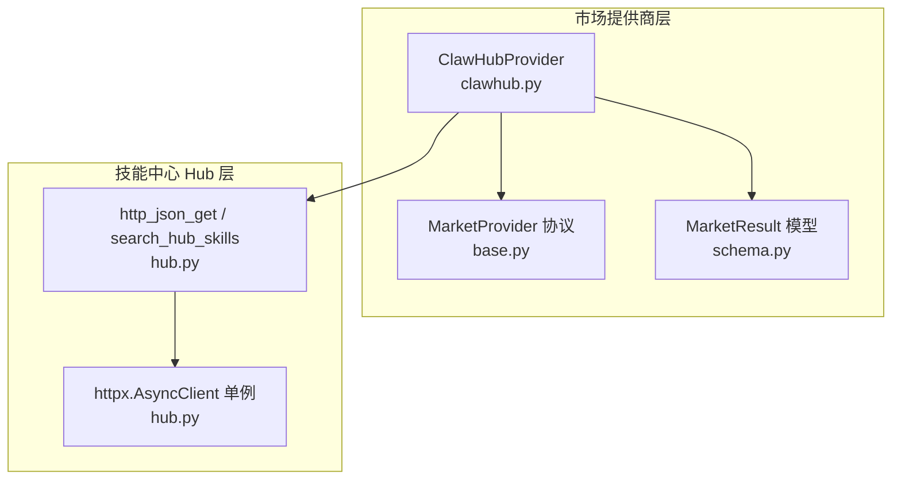
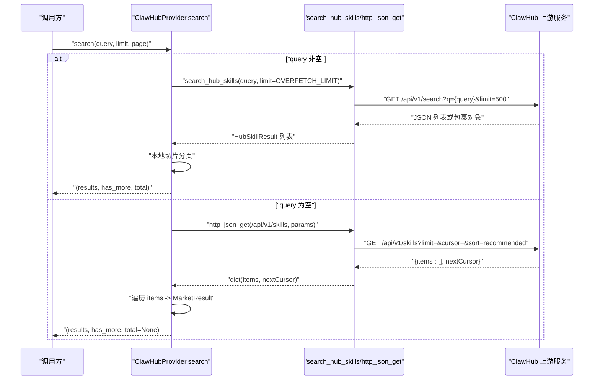
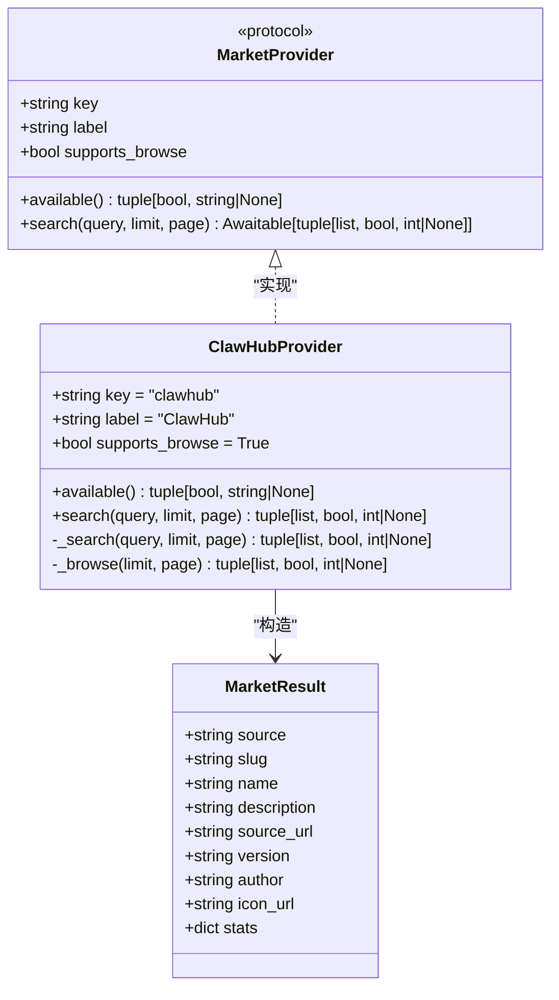
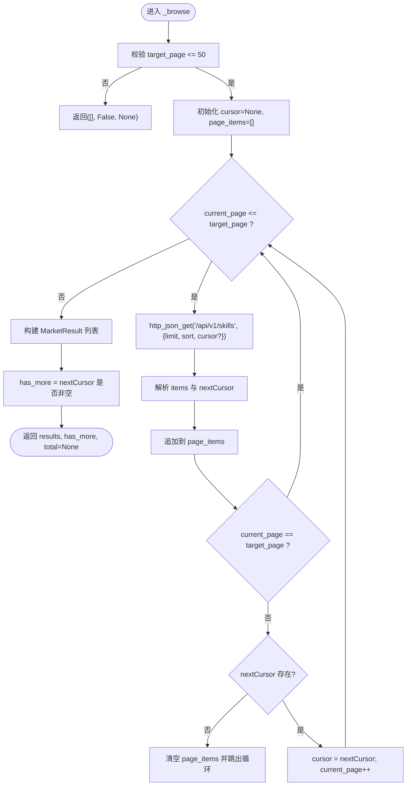
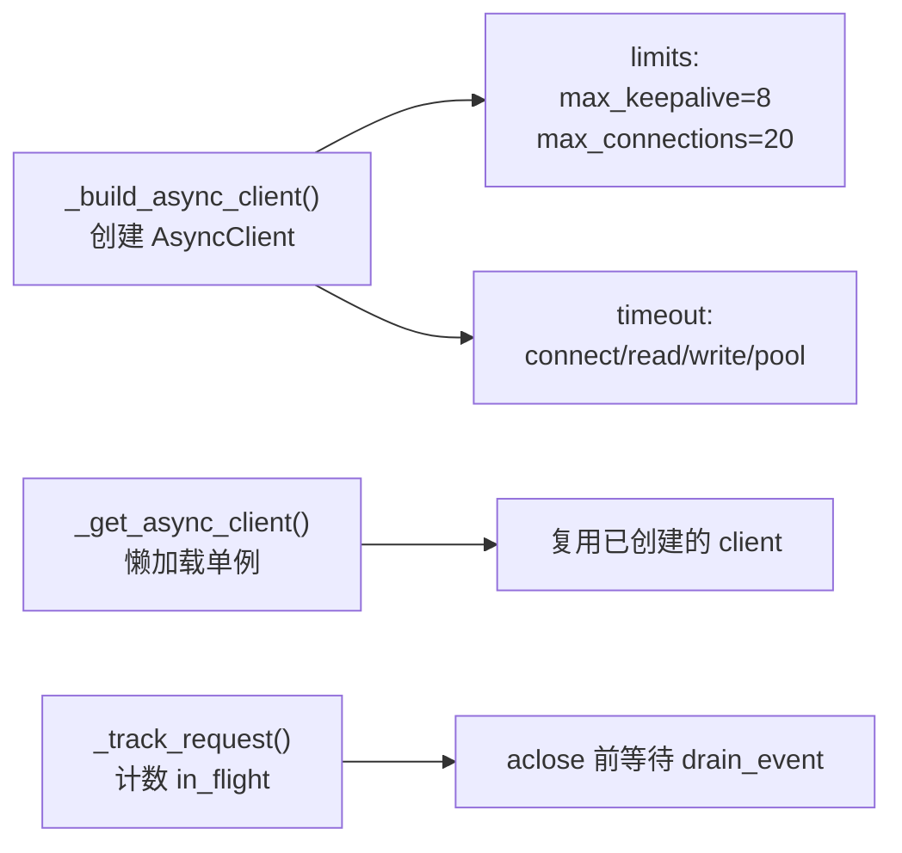
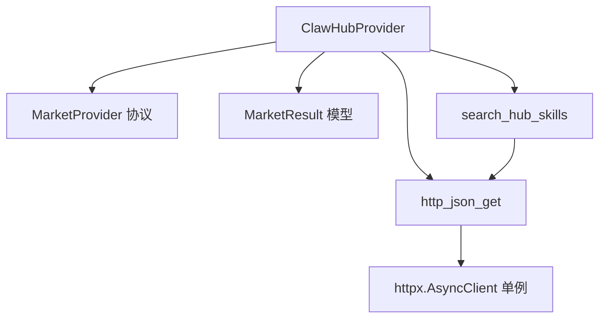

# ClawHub 提供商

<cite>
**本文引用的文件**   
- [clawhub.py](file://src/qwenpaw/market/providers/clawhub.py)
- [base.py](file://src/qwenpaw/market/providers/base.py)
- [schema.py](file://src/qwenpaw/market/schema.py)
- [hub.py](file://src/qwenpaw/agents/skill_system/hub.py)
</cite>

## 目录
1. [简介](#简介)
2. [项目结构](#项目结构)
3. [核心组件](#核心组件)
4. [架构总览](#架构总览)
5. [详细组件分析](#详细组件分析)
6. [依赖关系分析](#依赖关系分析)
7. [性能与并发](#性能与并发)
8. [故障排查指南](#故障排查指南)
9. [结论](#结论)

## 简介
本文件面向 QwenPaw 市场提供商开发者，聚焦于 ClawHub 提供商的 HTTP API 集成、RESTful 接口调用与数据格式处理。文档基于代码库实际实现，说明：
- ClawHub 提供的两个上游端点及其参数与返回结构
- 如何使用共享异步 HTTP 客户端（基于 httpx）发起请求、解析 JSON、分页与游标翻页
- 搜索语法与过滤条件（由上游服务端决定，本地仅透传查询字符串）
- 与通用市场提供商协议（MarketProvider）的适配方式
- 网络错误处理、重试与超时策略
- 并发请求与连接池管理要点

## 项目结构
ClawHub 提供商位于 market/providers 子模块中，遵循统一的 MarketProvider 协议，并通过 agents/skill_system/hub 中的共享 HTTP 基础设施访问上游服务。

图表来源
- [clawhub.py:28-45](file://src/qwenpaw/market/providers/clawhub.py#L28-L45)
- [base.py:17-43](file://src/qwenpaw/market/providers/base.py#L17-L43)
- [schema.py:10-24](file://src/qwenpaw/market/schema.py#L10-L24)
- [hub.py:635-653](file://src/qwenpaw/agents/skill_system/hub.py#L635-L653)
- [hub.py:316-332](file://src/qwenpaw/agents/skill_system/hub.py#L316-L332)

章节来源
- [clawhub.py:1-168](file://src/qwenpaw/market/providers/clawhub.py#L1-L168)
- [base.py:1-44](file://src/qwenpaw/market/providers/base.py#L1-L44)
- [schema.py:1-39](file://src/qwenpaw/market/schema.py#L1-L39)
- [hub.py:316-332](file://src/qwenpaw/agents/skill_system/hub.py#L316-L332)
- [hub.py:635-653](file://src/qwenpaw/agents/skill_system/hub.py#L635-L653)

## 核心组件
- ClawHubProvider：实现 MarketProvider 协议，提供 available() 与 search(query, limit, page)。当 query 非空时走关键词搜索；否则走浏览列表（支持 stats）。
- MarketProvider 协议：定义 provider 的统一能力边界（key、label、supports_browse、available、search）。
- MarketResult：统一的结果数据结构，包含 source、slug、name、description、source_url、version、author、icon_url、stats 等字段。
- Hub HTTP 工具：http_json_get 与 search_hub_skills，封装了基于 httpx 的异步 GET、JSON 解析、重试与取消钩子。

章节来源
- [clawhub.py:28-45](file://src/qwenpaw/market/providers/clawhub.py#L28-L45)
- [base.py:17-43](file://src/qwenpaw/market/providers/base.py#L17-L43)
- [schema.py:10-24](file://src/qwenpaw/market/schema.py#L10-L24)
- [hub.py:635-653](file://src/qwenpaw/agents/skill_system/hub.py#L635-L653)

## 架构总览
ClawHub 提供商通过两种路径获取数据：
- 关键词搜索：调用 search_hub_skills，内部使用 hub 的 http_json_get 向 /api/v1/search?q=&limit= 发起 GET 请求，返回标准化后的 HubSkillResult 列表，再由 ClawHubProvider 转换为 MarketResult 并执行本地分页。
- 浏览列表：直接调用 http_json_get 访问 /api/v1/skills?limit=&cursor=&sort=，按游标 nextCursor 进行翻页，并将 items 映射为 MarketResult。

图表来源
- [clawhub.py:36-45](file://src/qwenpaw/market/providers/clawhub.py#L36-L45)
- [clawhub.py:47-79](file://src/qwenpaw/market/providers/clawhub.py#L47-L79)
- [clawhub.py:81-126](file://src/qwenpaw/market/providers/clawhub.py#L81-L126)
- [hub.py:1979-2022](file://src/qwenpaw/agents/skill_system/hub.py#L1979-L2022)
- [hub.py:635-653](file://src/qwenpaw/agents/skill_system/hub.py#L635-L653)

## 详细组件分析

### ClawHubProvider 类
- 属性
  - key = "clawhub"
  - label = "ClawHub"
  - supports_browse = True
- 方法
  - available(): 始终可用，返回 (True, None)
  - search(query, limit, page): 根据 query 是否为空选择 _search 或 _browse
  - _search(query, limit, page): 使用 search_hub_skills 拉取最多 500 条结果，再在本地按页切片，返回 has_more 与 total
  - _browse(limit, page): 使用 http_json_get 访问 /api/v1/skills，按 cursor 翻页，最大允许走到第 50 页；has_more 由 nextCursor 是否存在决定，total 为 None

图表来源
- [base.py:17-43](file://src/qwenpaw/market/providers/base.py#L17-L43)
- [clawhub.py:28-45](file://src/qwenpaw/market/providers/clawhub.py#L28-L45)
- [schema.py:10-24](file://src/qwenpaw/market/schema.py#L10-L24)

章节来源
- [clawhub.py:28-126](file://src/qwenpaw/market/providers/clawhub.py#L28-L126)
- [base.py:17-43](file://src/qwenpaw/market/providers/base.py#L17-L43)
- [schema.py:10-24](file://src/qwenpaw/market/schema.py#L10-L24)

### 搜索与浏览流程细节

#### 关键词搜索（_search）
- 上游端点：GET /api/v1/search?q=<keyword>&limit=500
- 行为：
  - 调用 search_hub_skills 获取 HubSkillResult 列表
  - 将每个 item 转换为 MarketResult（包含 slug、name、description、source_url、version、author、icon_url）
  - 本地计算 start/end 索引，返回当前页结果、是否有更多、以及 total（等于全部命中数）
- 注意：搜索不携带 stats（下载量、星标等），这些仅在浏览列表返回

章节来源
- [clawhub.py:47-79](file://src/qwenpaw/market/providers/clawhub.py#L47-L79)
- [hub.py:1979-2022](file://src/qwenpaw/agents/skill_system/hub.py#L1979-L2022)

#### 浏览列表（_browse）
- 上游端点：GET /api/v1/skills?limit=N&cursor=...&sort=recommended
- 行为：
  - 从第 1 页开始，逐页累积到目标页 target_page（上限 50）
  - 每次请求带上 limit 与 sort=recommended，若存在 nextCursor 则继续翻页
  - 将 items 映射为 MarketResult，提取 stats.downloads/stars/installs 与 tags.latest 作为 version
  - has_more 由 nextCursor 是否存在决定，total 为 None（上游未提供总数）

图表来源
- [clawhub.py:81-126](file://src/qwenpaw/market/providers/clawhub.py#L81-L126)

章节来源
- [clawhub.py:81-126](file://src/qwenpaw/market/providers/clawhub.py#L81-L126)

### 数据格式与字段映射
- 搜索结果（/api/v1/search）
  - 输入：q（关键词）、limit（固定为 500）
  - 输出：数组或包裹对象（含 items/skills/results/data 之一），每项包含 slug/name/description/version/url/owner 等
  - 转换：生成 MarketResult，author/icon_url 来自 owner 信息
- 浏览列表（/api/v1/skills）
  - 输入：limit、cursor（可选）、sort=recommended
  - 输出：{ items: [...], nextCursor: string|undefined }
  - 转换：从 item.stats 提取 downloads/stars/installs；从 item.tags.latest 取 version；author/icon_url 保持为空

章节来源
- [clawhub.py:129-158](file://src/qwenpaw/market/providers/clawhub.py#L129-L158)
- [hub.py:670-680](file://src/qwenpaw/agents/skill_system/hub.py#L670-L680)

### 与通用提供商协议的适配
- 实现 MarketProvider 协议，暴露 key、label、supports_browse、available、search
- search 返回值约定：(results, has_more, total)，其中 has_more 驱动“加载更多”，total 用于展示（未知时为 None）

章节来源
- [base.py:17-43](file://src/qwenpaw/market/providers/base.py#L17-L43)
- [clawhub.py:28-45](file://src/qwenpaw/market/providers/clawhub.py#L28-L45)

### 搜索语法、过滤与排序
- 搜索语法与过滤条件：由上游服务端决定，本地仅透传 q 参数，不做额外解析或改写
- 排序选项：浏览列表使用 sort=recommended，其他值未在本地使用

章节来源
- [clawhub.py:19-25](file://src/qwenpaw/market/providers/clawhub.py#L19-L25)
- [clawhub.py:93-98](file://src/qwenpaw/market/providers/clawhub.py#L93-L98)

### 网络错误处理与重试
- 底层异常：非 2xx 响应会抛出 httpx.HTTPStatusError；传输错误或超时抛出 httpx.TransportError/httpx.TimeoutException
- 重试机制：上层 _http_fetch 对可重试错误进行有限次重试，失败后抛出 SkillsError
- 取消支持：通过上下文变量传播取消检查器，确保安装任务可被安全取消

章节来源
- [hub.py:580-603](file://src/qwenpaw/agents/skill_system/hub.py#L580-L603)
- [hub.py:635-653](file://src/qwenpaw/agents/skill_system/hub.py#L635-L653)

### 并发请求与连接池管理
- 全局 httpx.AsyncClient 单例：懒加载创建，线程安全锁保护
- 连接限制：max_keepalive_connections=8，max_connections=20
- 超时配置：connect/read/write/pool 分别设置，read 默认受环境变量控制
- 请求追踪：_track_request 跟踪并发请求数量，优雅关闭等待所有请求完成

图表来源
- [hub.py:316-332](file://src/qwenpaw/agents/skill_system/hub.py#L316-L332)
- [hub.py:335-341](file://src/qwenpaw/agents/skill_system/hub.py#L335-L341)
- [hub.py:343-355](file://src/qwenpaw/agents/skill_system/hub.py#L343-L355)

章节来源
- [hub.py:316-355](file://src/qwenpaw/agents/skill_system/hub.py#L316-L355)

## 依赖关系分析
- ClawHubProvider 依赖：
  - MarketProvider 协议（约束接口）
  - MarketResult 模型（统一返回结构）
  - Hub 层的 http_json_get 与 search_hub_skills（HTTP 与搜索封装）
- Hub 层依赖：
  - httpx.AsyncClient（连接池、超时、重试）
  - 环境变量（QWENPAW_SKILLS_HUB_HTTP_TIMEOUT、QWENPAW_SKILLS_HUB_HTTP_RETRIES）

图表来源
- [clawhub.py:12-16](file://src/qwenpaw/market/providers/clawhub.py#L12-L16)
- [hub.py:635-653](file://src/qwenpaw/agents/skill_system/hub.py#L635-L653)
- [hub.py:316-332](file://src/qwenpaw/agents/skill_system/hub.py#L316-L332)

章节来源
- [clawhub.py:12-16](file://src/qwenpaw/market/providers/clawhub.py#L12-L16)
- [hub.py:635-653](file://src/qwenpaw/agents/skill_system/hub.py#L635-L653)
- [hub.py:316-332](file://src/qwenpaw/agents/skill_system/hub.py#L316-L332)

## 性能与并发
- 搜索分页优化：关键词搜索一次性拉取最多 500 条，本地切片避免多次上游请求
- 浏览翻页限制：最大允许走到第 50 页，防止无限翻页导致资源消耗
- 连接池与超时：合理设置 max_connections 与 read 超时，避免长尾请求拖垮系统
- 重试策略：对瞬态错误进行有限次重试，降低偶发网络抖动影响

[本节为通用指导，无需具体文件引用]

## 故障排查指南
- 常见错误类型
  - 非 2xx 响应：httpx.HTTPStatusError
  - 传输错误/超时：httpx.TransportError/httpx.TimeoutException
  - 上游不可达或格式异常：SkillsError（包装原始错误信息）
- 定位步骤
  - 确认上游 URL 与参数是否正确（q、limit、cursor、sort）
  - 检查环境变量 QWENPAW_SKILLS_HUB_HTTP_TIMEOUT 与 QWENPAW_SKILLS_HUB_HTTP_RETRIES
  - 观察 has_more 与 nextCursor 状态，判断翻页逻辑是否正常
- 恢复建议
  - 适当增大超时或重试次数
  - 减少单次 limit 或限制最大翻页页数
  - 捕获并记录上游返回体以便诊断

章节来源
- [hub.py:580-603](file://src/qwenpaw/agents/skill_system/hub.py#L580-L603)
- [hub.py:635-653](file://src/qwenpaw/agents/skill_system/hub.py#L635-L653)

## 结论
ClawHub 提供商以最小适配实现了 MarketProvider 协议，通过 Hub 层统一的 httpx 客户端访问上游 REST 接口，提供关键词搜索与浏览列表两种模式。其设计兼顾易用性与健壮性：统一的返回模型、清晰的分页策略、完善的错误与重试处理、合理的连接池与超时配置。对于初学者，可按本文示例理解如何调用搜索与浏览接口；对于有经验的开发者，可参考连接池与重试策略进一步优化性能与稳定性。