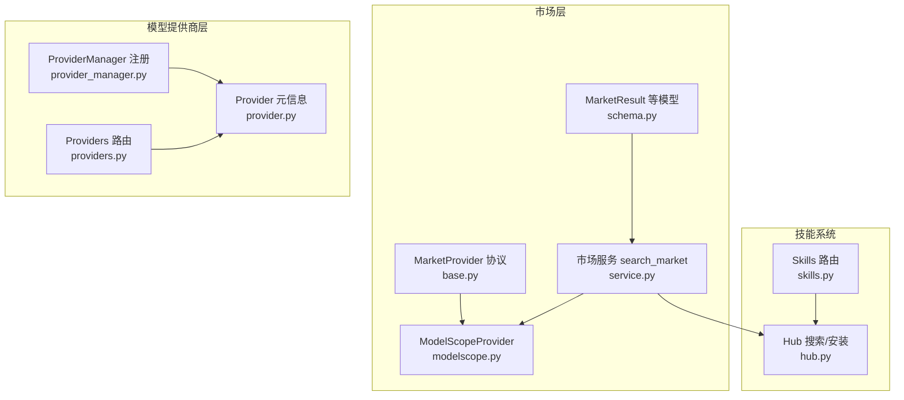
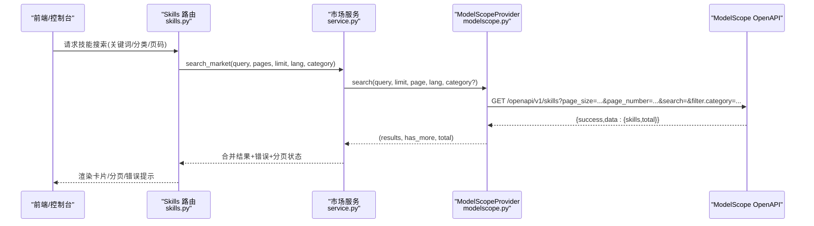
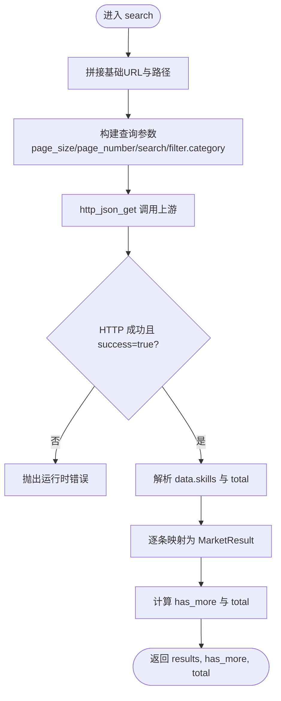
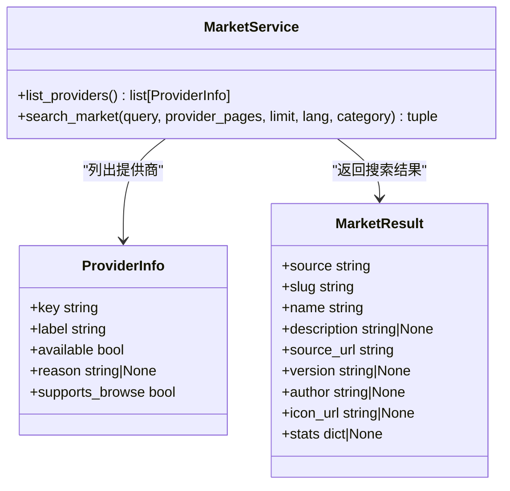
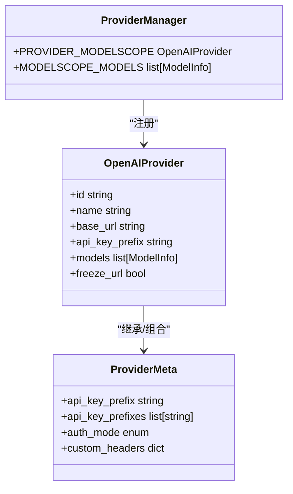
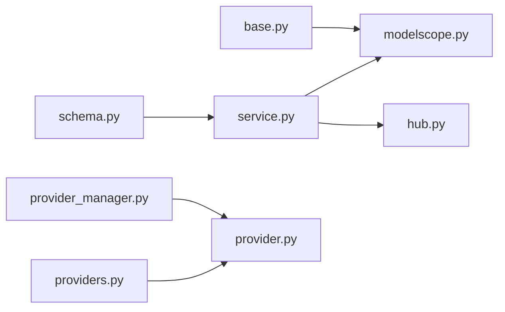

# ModelScope 提供商

<cite>
**本文引用的文件**   
- [src/qwenpaw/market/providers/modelscope.py](file://src/qwenpaw/market/providers/modelscope.py)
- [src/qwenpaw/market/providers/base.py](file://src/qwenpaw/market/providers/base.py)
- [src/qwenpaw/market/schema.py](file://src/qwenpaw/market/schema.py)
- [src/qwenpaw/market/service.py](file://src/qwenpaw/market/service.py)
- [src/qwenpaw/agents/skill_system/hub.py](file://src/qwenpaw/agents/skill_system/hub.py)
- [src/qwenpaw/app/routers/skills.py](file://src/qwenpaw/app/routers/skills.py)
- [src/qwenpaw/providers/provider_manager.py](file://src/qwenpaw/providers/provider_manager.py)
- [src/qwenpaw/providers/provider.py](file://src/qwenpaw/providers/provider.py)
- [src/qwenpaw/app/routers/providers.py](file://src/qwenpaw/app/routers/providers.py)
</cite>

## 目录
1. [简介](#简介)
2. [项目结构](#项目结构)
3. [核心组件](#核心组件)
4. [架构总览](#架构总览)
5. [详细组件分析](#详细组件分析)
6. [依赖关系分析](#依赖关系分析)
7. [性能与限流](#性能与限流)
8. [故障排查指南](#故障排查指南)
9. [结论](#结论)
10. [附录](#附录)

## 简介
本文件面向 QwenPaw 的 ModelScope 市场提供商集成，系统性说明以下内容：
- ModelScope 技能搜索 API 的调用方式、参数映射与响应解析
- 认证方式（模型推理提供商 vs 技能市场）
- 与通用提供商协议的适配实现
- 错误处理策略、分页与“更多”判定
- 版本管理与标签/分类在 UI 中的体现
- 初学者入门指引与进阶开发者所需的技术深度

## 项目结构
围绕 ModelScope 的相关代码主要分布在以下模块：
- 市场提供商协议与统一数据模型
  - 协议定义与常量：[src/qwenpaw/market/providers/base.py](file://src/qwenpaw/market/providers/base.py)
  - 统一结果模型：[src/qwenpaw/market/schema.py](file://src/qwenpaw/market/schema.py)
- ModelScope 市场提供商实现
  - 搜索实现与本地化字段解析：[src/qwenpaw/market/providers/modelscope.py](file://src/qwenpaw/market/providers/modelscope.py)
- 市场服务编排
  - 多提供商并发搜索、错误聚合、分页状态汇总：[src/qwenpaw/market/service.py](file://src/qwenpaw/market/service.py)
- 技能导入与 Hub 能力（与 ModelScope 技能来源协同）
  - Hub 搜索与安装入口：[src/qwenpaw/agents/skill_system/hub.py](file://src/qwenpaw/agents/skill_system/hub.py)
  - 后端路由与请求模型：[src/qwenpaw/app/routers/skills.py](file://src/qwenpaw/app/routers/skills.py)
- 模型推理提供商配置（ModelScope 作为 OpenAI 兼容提供商）
  - 内置 Provider 注册与默认模型列表：[src/qwenpaw/providers/provider_manager.py](file://src/qwenpaw/providers/provider_manager.py)
  - Provider 元信息与鉴权模式字段：[src/qwenpaw/providers/provider.py](file://src/qwenpaw/providers/provider.py)
  - 连接测试与发现接口：[src/qwenpaw/app/routers/providers.py](file://src/qwenpaw/app/routers/providers.py)

图表来源
- [src/qwenpaw/market/providers/base.py:1-44](file://src/qwenpaw/market/providers/base.py#L1-L44)
- [src/qwenpaw/market/schema.py:1-39](file://src/qwenpaw/market/schema.py#L1-L39)
- [src/qwenpaw/market/service.py:1-130](file://src/qwenpaw/market/service.py#L1-L130)
- [src/qwenpaw/market/providers/modelscope.py:1-186](file://src/qwenpaw/market/providers/modelscope.py#L1-L186)
- [src/qwenpaw/agents/skill_system/hub.py:1979-2022](file://src/qwenpaw/agents/skill_system/hub.py#L1979-L2022)
- [src/qwenpaw/app/routers/skills.py:26-233](file://src/qwenpaw/app/routers/skills.py#L26-L233)
- [src/qwenpaw/providers/provider_manager.py:46-62](file://src/qwenpaw/providers/provider_manager.py#L46-L62)
- [src/qwenpaw/providers/provider_manager.py:886-893](file://src/qwenpaw/providers/provider_manager.py#L886-L893)
- [src/qwenpaw/providers/provider.py:164-242](file://src/qwenpaw/providers/provider.py#L164-L242)
- [src/qwenpaw/app/routers/providers.py:279-334](file://src/qwenpaw/app/routers/providers.py#L279-L334)

章节来源
- [src/qwenpaw/market/providers/base.py:1-44](file://src/qwenpaw/market/providers/base.py#L1-L44)
- [src/qwenpaw/market/schema.py:1-39](file://src/qwenpaw/market/schema.py#L1-L39)
- [src/qwenpaw/market/providers/modelscope.py:1-186](file://src/qwenpaw/market/providers/modelscope.py#L1-L186)
- [src/qwenpaw/market/service.py:1-130](file://src/qwenpaw/market/service.py#L1-L130)
- [src/qwenpaw/agents/skill_system/hub.py:1979-2022](file://src/qwenpaw/agents/skill_system/hub.py#L1979-L2022)
- [src/qwenpaw/app/routers/skills.py:26-233](file://src/qwenpaw/app/routers/skills.py#L26-L233)
- [src/qwenpaw/providers/provider_manager.py:46-62](file://src/qwenpaw/providers/provider_manager.py#L46-L62)
- [src/qwenpaw/providers/provider_manager.py:886-893](file://src/qwenpaw/providers/provider_manager.py#L886-L893)
- [src/qwenpaw/providers/provider.py:164-242](file://src/qwenpaw/providers/provider.py#L164-L242)
- [src/qwenpaw/app/routers/providers.py:279-334](file://src/qwenpaw/app/routers/providers.py#L279-L334)

## 核心组件
- MarketProvider 协议
  - 定义统一的 market provider 接口：available()、search()，以及常量 MARKET_SEARCH_TIMEOUT_S。
- MarketResult 数据模型
  - 统一返回结构：source、slug、name、description、source_url、version、author、icon_url、stats。
- ModelScopeProvider
  - 通过公开 OpenAPI 获取技能列表，支持分页、关键词搜索、按分类过滤、语言本地化。
- 市场服务 service.search_market
  - 并发调用各 provider，聚合结果与错误，维护 has_more 与 total 统计。
- 模型提供商 ProviderManager
  - 将 ModelScope 作为 OpenAI 兼容提供商注册，设置 base_url、api_key_prefix、默认模型列表与 URL 冻结。

章节来源
- [src/qwenpaw/market/providers/base.py:1-44](file://src/qwenpaw/market/providers/base.py#L1-L44)
- [src/qwenpaw/market/schema.py:1-39](file://src/qwenpaw/market/schema.py#L1-L39)
- [src/qwenpaw/market/providers/modelscope.py:1-186](file://src/qwenpaw/market/providers/modelscope.py#L1-L186)
- [src/qwenpaw/market/service.py:1-130](file://src/qwenpaw/market/service.py#L1-L130)
- [src/qwenpaw/providers/provider_manager.py:46-62](file://src/qwenpaw/providers/provider_manager.py#L46-L62)
- [src/qwenpaw/providers/provider_manager.py:886-893](file://src/qwenpaw/providers/provider_manager.py#L886-L893)

## 架构总览
下图展示从前端到后端的完整链路：用户发起技能搜索 → 市场服务并行查询多个提供商 → ModelScope 提供商调用上游 OpenAPI → 结果归一化为 MarketResult → 上层路由或 UI 消费。

图表来源
- [src/qwenpaw/app/routers/skills.py:26-233](file://src/qwenpaw/app/routers/skills.py#L26-L233)
- [src/qwenpaw/market/service.py:38-76](file://src/qwenpaw/market/service.py#L38-L76)
- [src/qwenpaw/market/providers/modelscope.py:37-93](file://src/qwenpaw/market/providers/modelscope.py#L37-L93)

## 详细组件分析

### ModelScope 市场提供商实现
- 关键行为
  - 可用性与搜索：available() 始终可用；search() 构造查询参数并调用上游 OpenAPI。
  - 分页限制：page_size 上限为 100，超出会返回 HTTP 400。
  - 响应校验：要求 success=true，否则抛出运行时异常。
  - 结果转换：将上游字段映射为 MarketResult，包含 slug、名称、描述、作者、图标、版本、统计信息等。
  - 本地化：根据 lang 选择 zh/en 的 description/category。
- 参数映射
  - search → search
  - filter.category → filter.category
  - page_size/page_number → page_size/page_number
- 错误处理
  - HTTPStatusError → 包装为 RuntimeError
  - 非 JSON 或 success=false → 包装为 RuntimeError
- 分页与“更多”
  - has_more = page * page_size < total
  - total 优先使用上游 total，否则回退为当前页结果数

图表来源
- [src/qwenpaw/market/providers/modelscope.py:29-93](file://src/qwenpaw/market/providers/modelscope.py#L29-L93)

章节来源
- [src/qwenpaw/market/providers/modelscope.py:22-93](file://src/qwenpaw/market/providers/modelscope.py#L22-L93)
- [src/qwenpaw/market/providers/modelscope.py:96-137](file://src/qwenpaw/market/providers/modelscope.py#L96-L137)
- [src/qwenpaw/market/providers/modelscope.py:140-161](file://src/qwenpaw/market/providers/modelscope.py#L140-L161)

### 市场服务编排
- 并发执行：对每个选定的 provider 并发执行 search，收集结果与错误。
- 错误聚合：单个 provider 失败不会中断整体流程，以 MarketSearchError 形式返回。
- 分页状态：by_provider 记录每个 provider 的 has_more 与 total，供 UI 控制“加载更多”。
- 类别路由：根据 resolve_category 将通用分类映射为 provider 原生 code 或直接替换 query。

图表来源
- [src/qwenpaw/market/service.py:23-76](file://src/qwenpaw/market/service.py#L23-L76)
- [src/qwenpaw/market/schema.py:10-39](file://src/qwenpaw/market/schema.py#L10-L39)

章节来源
- [src/qwenpaw/market/service.py:38-130](file://src/qwenpaw/market/service.py#L38-L130)
- [src/qwenpaw/market/schema.py:10-39](file://src/qwenpaw/market/schema.py#L10-L39)

### 技能导入与 Hub 协同
- Hub 搜索：提供通用的 hub 技能搜索能力，返回 HubSkillResult，用于跨源技能发现。
- 路由层：skills 路由暴露相关接口，结合 Hub 能力进行安装与同步。
- 与 ModelScope 的关系：ModelScope 作为独立的市场提供商，同时也可被上层技能导入流程引用。

章节来源
- [src/qwenpaw/agents/skill_system/hub.py:1979-2022](file://src/qwenpaw/agents/skill_system/hub.py#L1979-L2022)
- [src/qwenpaw/app/routers/skills.py:26-233](file://src/qwenpaw/app/routers/skills.py#L26-L233)

### 模型推理提供商（OpenAI 兼容）
- 注册与默认模型
  - PROVIDER_MODELSCOPE 基于 OpenAIProvider 创建，id=modelscope，base_url 指向 inference 端点，api_key_prefix=ms，并冻结 URL。
  - MODELSCOPE_MODELS 预置若干模型元信息。
- 鉴权模式
  - Provider 元信息支持 api_key/api_key_prefixes、auth_mode 等字段，用于不同协议的鉴权头注入。
- 连接测试与发现
  - providers 路由提供测试连接与模型发现接口，便于用户在控制台验证配置。

图表来源
- [src/qwenpaw/providers/provider_manager.py:46-62](file://src/qwenpaw/providers/provider_manager.py#L46-L62)
- [src/qwenpaw/providers/provider_manager.py:886-893](file://src/qwenpaw/providers/provider_manager.py#L886-L893)
- [src/qwenpaw/providers/provider.py:164-242](file://src/qwenpaw/providers/provider.py#L164-L242)

章节来源
- [src/qwenpaw/providers/provider_manager.py:46-62](file://src/qwenpaw/providers/provider_manager.py#L46-L62)
- [src/qwenpaw/providers/provider_manager.py:886-893](file://src/qwenpaw/providers/provider_manager.py#L886-L893)
- [src/qwenpaw/providers/provider.py:164-242](file://src/qwenpaw/providers/provider.py#L164-L242)
- [src/qwenpaw/app/routers/providers.py:279-334](file://src/qwenpaw/app/routers/providers.py#L279-L334)

## 依赖关系分析
- 低耦合高内聚
  - MarketProvider 协议将具体实现与上层解耦，新增提供商只需实现 search/available。
  - MarketResult 统一数据结构，屏蔽上游差异。
- 直接依赖
  - ModelScopeProvider 依赖 httpx 与共享异步客户端 http_json_get。
  - 市场服务依赖所有已注册的 PROVIDERS，并通过反射探测支持的参数。
- 外部依赖
  - ModelScope OpenAPI（无需鉴权的 GET 接口）。
  - 模型推理侧依赖 OpenAI 兼容协议。

图表来源
- [src/qwenpaw/market/providers/base.py:1-44](file://src/qwenpaw/market/providers/base.py#L1-L44)
- [src/qwenpaw/market/providers/modelscope.py:1-186](file://src/qwenpaw/market/providers/modelscope.py#L1-L186)
- [src/qwenpaw/market/schema.py:1-39](file://src/qwenpaw/market/schema.py#L1-L39)
- [src/qwenpaw/market/service.py:1-130](file://src/qwenpaw/market/service.py#L1-L130)
- [src/qwenpaw/agents/skill_system/hub.py:1979-2022](file://src/qwenpaw/agents/skill_system/hub.py#L1979-L2022)
- [src/qwenpaw/providers/provider_manager.py:886-893](file://src/qwenpaw/providers/provider_manager.py#L886-L893)
- [src/qwenpaw/providers/provider.py:164-242](file://src/qwenpaw/providers/provider.py#L164-L242)
- [src/qwenpaw/app/routers/providers.py:279-334](file://src/qwenpaw/app/routers/providers.py#L279-L334)

## 性能与限流
- 超时控制
  - 市场搜索统一超时：MARKET_SEARCH_TIMEOUT_S=15s，避免上游慢查询阻塞。
- 分页与节流
  - page_size 上限 100，防止上游 400 错误。
  - has_more 由 page*page_size < total 决定，避免一次性拉取过多数据。
- 并发
  - 市场服务对多个 provider 并发调用，提升总体吞吐。
- 重试机制
  - 当前未实现自动重试；建议在调用方或服务层增加指数退避重试策略，针对瞬时网络抖动与上游限流。

章节来源
- [src/qwenpaw/market/providers/base.py:14](file://src/qwenpaw/market/providers/base.py#L14)
- [src/qwenpaw/market/providers/modelscope.py:24-26](file://src/qwenpaw/market/providers/modelscope.py#L24-L26)
- [src/qwenpaw/market/providers/modelscope.py:92-93](file://src/qwenpaw/market/providers/modelscope.py#L92-L93)
- [src/qwenpaw/market/service.py:57-61](file://src/qwenpaw/market/service.py#L57-L61)

## 故障排查指南
- 常见错误
  - HTTP 400：page_size > 100，需调整 limit。
  - success=false：上游业务错误，检查 search 与 filter.category 参数。
  - 非 JSON 响应：网络异常或上游变更，建议增加日志与重试。
- 定位步骤
  - 确认 provider 是否 available。
  - 打印最终请求 URL 与参数。
  - 查看 by_provider 中 has_more 与 total，判断是否为分页问题。
  - 若为模型推理侧问题，使用 providers 路由的连接测试接口验证 base_url 与 api_key。

章节来源
- [src/qwenpaw/market/providers/modelscope.py:63-73](file://src/qwenpaw/market/providers/modelscope.py#L63-L73)
- [src/qwenpaw/market/service.py:106-115](file://src/qwenpaw/market/service.py#L106-L115)
- [src/qwenpaw/app/routers/providers.py:279-334](file://src/qwenpaw/app/routers/providers.py#L279-L334)

## 结论
QwenPaw 对 ModelScope 的集成采用“协议抽象 + 统一数据模型 + 并发编排”的设计，既保证了可扩展性，又提供了良好的用户体验。对于初学者，重点在于理解 MarketProvider 协议与 MarketResult 模型；对于资深开发者，可关注分页与错误聚合策略、上游限流与重试方案，以及模型推理侧的鉴权与连接测试。

## 附录
- 快速上手
  - 配置 ModelScope 模型推理提供商：在控制台或 API 中设置 base_url 与 api_key（前缀 ms），保存后可用连接测试接口验证。
  - 搜索 ModelScope 技能：通过 skills 路由或控制台界面输入关键词/分类，观察分页与“更多”按钮。
- 版本管理
  - MarketResult.version 来自上游 version 字段，可用于显示与对比。
- 标签与分类
  - 分类通过 filter.category 传递；标签在 UI 中以 chips 形式展示，来源于 skill 元数据。

章节来源
- [src/qwenpaw/providers/provider_manager.py:886-893](file://src/qwenpaw/providers/provider_manager.py#L886-L893)
- [src/qwenpaw/app/routers/providers.py:279-334](file://src/qwenpaw/app/routers/providers.py#L279-L334)
- [src/qwenpaw/market/providers/modelscope.py:127-137](file://src/qwenpaw/market/providers/modelscope.py#L127-L137)