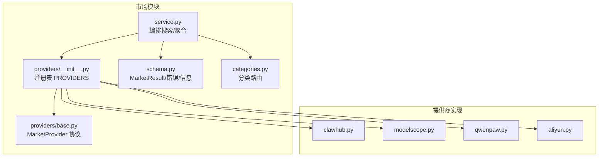
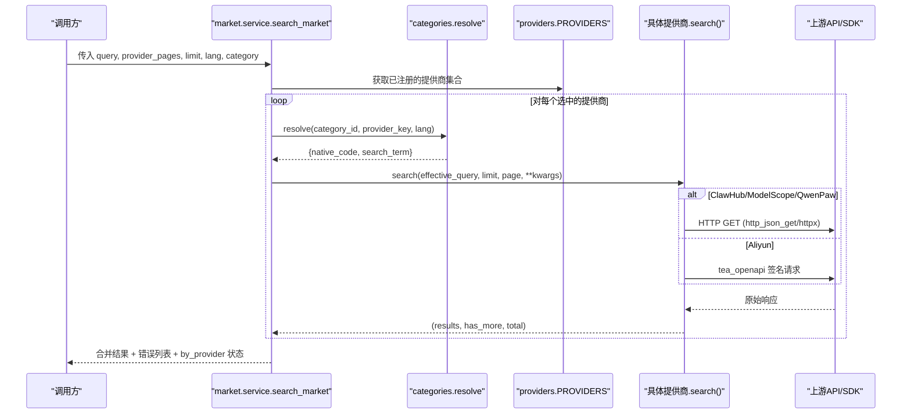
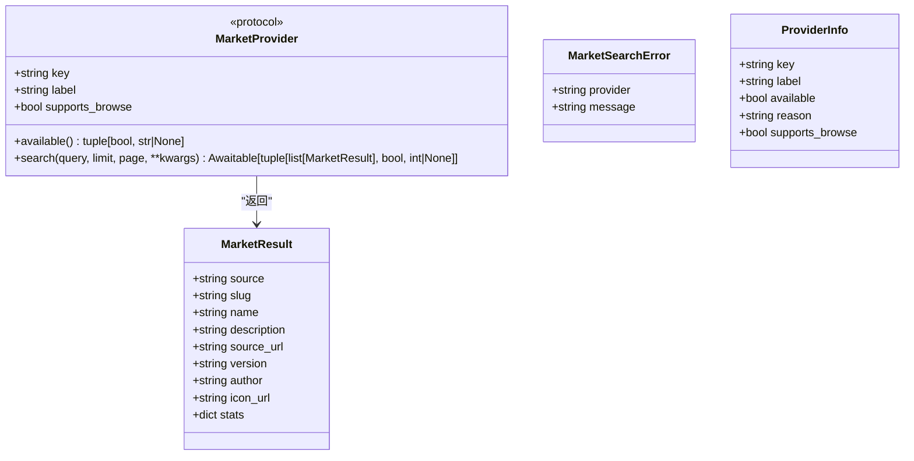
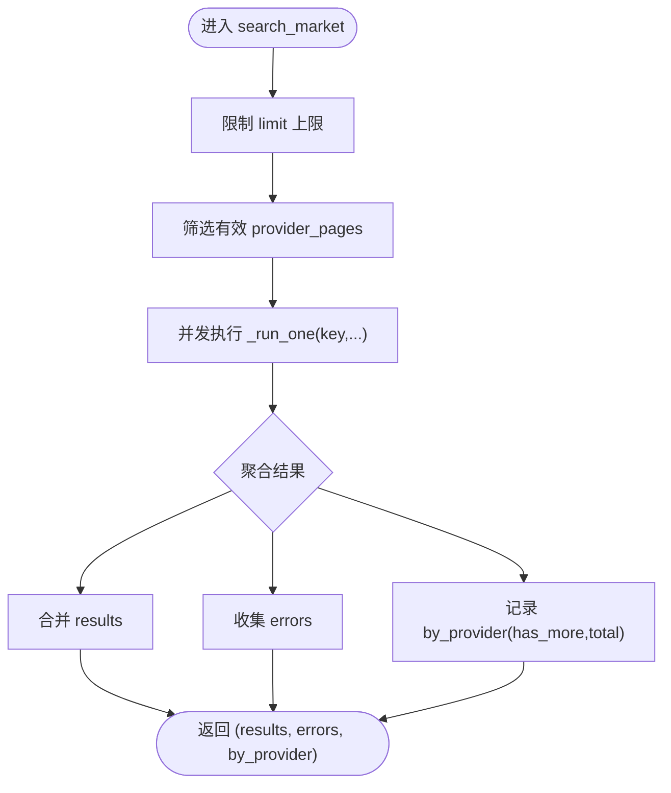
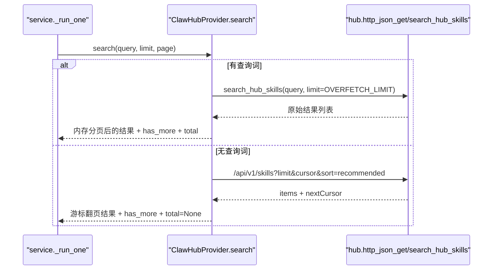
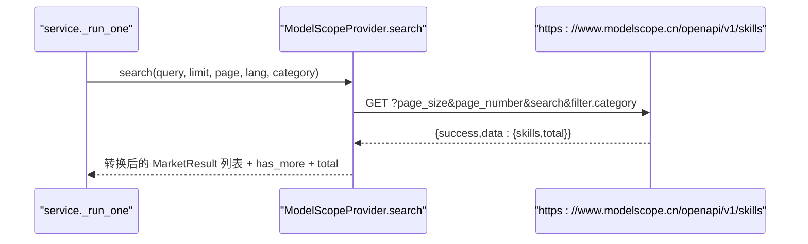
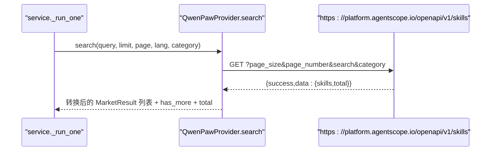
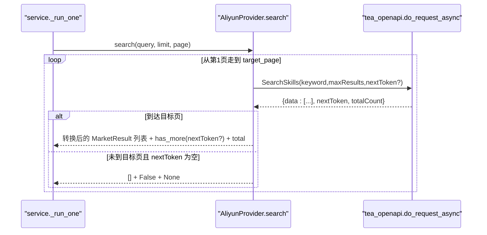
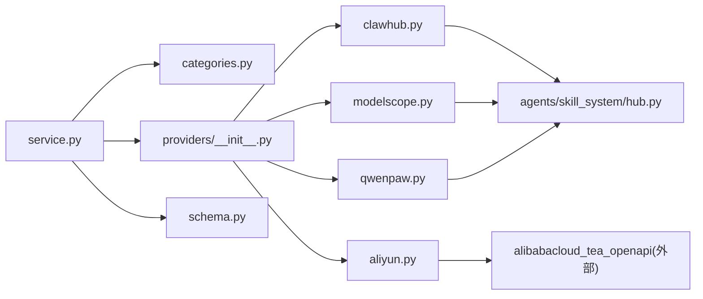

# 市场提供商集成

<cite>
**本文引用的文件**
- [src/qwenpaw/market/__init__.py](file://src/qwenpaw/market/__init__.py)
- [src/qwenpaw/market/service.py](file://src/qwenpaw/market/service.py)
- [src/qwenpaw/market/schema.py](file://src/qwenpaw/market/schema.py)
- [src/qwenpaw/market/categories.py](file://src/qwenpaw/market/categories.py)
- [src/qwenpaw/market/providers/__init__.py](file://src/qwenpaw/market/providers/__init__.py)
- [src/qwenpaw/market/providers/base.py](file://src/qwenpaw/market/providers/base.py)
- [src/qwenpaw/market/providers/clawhub.py](file://src/qwenpaw/market/providers/clawhub.py)
- [src/qwenpaw/market/providers/modelscope.py](file://src/qwenpaw/market/providers/modelscope.py)
- [src/qwenpaw/market/providers/aliyun.py](file://src/qwenpaw/market/providers/aliyun.py)
- [src/qwenpaw/market/providers/qwenpaw.py](file://src/qwenpaw/market/providers/qwenpaw.py)
- [src/qwenpaw/agents/skill_system/hub.py](file://src/qwenpaw/agents/skill_system/hub.py)
</cite>

## 目录
1. [简介](#简介)
2. [项目结构](#项目结构)
3. [核心组件](#核心组件)
4. [架构总览](#架构总览)
5. [详细组件分析](#详细组件分析)
6. [依赖关系分析](#依赖关系分析)
7. [性能与并发](#性能与并发)
8. [故障排查指南](#故障排查指南)
9. [结论](#结论)
10. [附录：自定义提供商实现指南](#附录自定义提供商实现指南)

## 简介
本章节面向 QwenPaw 的“技能市场”能力，系统性阐述市场提供商抽象层、协议适配器与认证机制，统一数据模型与通信协议，并给出多提供商并发访问、负载均衡与错误处理策略。文档同时解释与统一安装路由（下载/解析技能元数据）的适配关系，帮助初学者快速上手，也为有经验的开发者提供深入的技术细节。

## 项目结构
市场模块位于 src/qwenpaw/market，采用“服务 + 注册表 + 提供商实现 + 统一模式”的分层组织方式：
- 服务层 service.py：编排搜索流程、聚合结果、错误收集与分页控制
- 注册表 providers/__init__.py：集中注册所有 MarketProvider 实例
- 抽象协议 base.py：定义 MarketProvider 协议与全局超时常量
- 统一模式 schema.py：MarketResult、MarketSearchError、ProviderInfo
- 分类路由 categories.py：将逻辑分类映射到各提供商原生代码或本地化搜索词
- 具体提供商实现：clawhub.py、modelscope.py、qwenpaw.py、aliyun.py

图表来源
- [src/qwenpaw/market/service.py:1-130](file://src/qwenpaw/market/service.py#L1-L130)
- [src/qwenpaw/market/providers/__init__.py:1-29](file://src/qwenpaw/market/providers/__init__.py#L1-L29)
- [src/qwenpaw/market/providers/base.py:1-44](file://src/qwenpaw/market/providers/base.py#L1-L44)
- [src/qwenpaw/market/schema.py:1-39](file://src/qwenpaw/market/schema.py#L1-L39)
- [src/qwenpaw/market/categories.py:1-156](file://src/qwenpaw/market/categories.py#L1-L156)

章节来源
- [src/qwenpaw/market/__init__.py:1-21](file://src/qwenpaw/market/__init__.py#L1-L21)
- [src/qwenpaw/market/service.py:1-130](file://src/qwenpaw/market/service.py#L1-L130)
- [src/qwenpaw/market/providers/__init__.py:1-29](file://src/qwenpaw/market/providers/__init__.py#L1-L29)
- [src/qwenpaw/market/providers/base.py:1-44](file://src/qwenpaw/market/providers/base.py#L1-L44)
- [src/qwenpaw/market/schema.py:1-39](file://src/qwenpaw/market/schema.py#L1-L39)
- [src/qwenpaw/market/categories.py:1-156](file://src/qwenpaw/market/categories.py#L1-L156)

## 核心组件
- MarketProvider 协议：定义 key、label、supports_browse、available()、search() 等接口，确保不同提供商具备一致行为
- 统一数据模型：MarketResult 描述技能元数据；MarketSearchError 描述单个提供商的错误；ProviderInfo 描述提供商可用性
- 分类路由：将 UI 的分类标签映射为各提供商的原生 filter code 或本地化搜索词
- 服务编排：并行调用多个提供商，聚合结果，统计 has_more/total，收集错误

章节来源
- [src/qwenpaw/market/providers/base.py:17-44](file://src/qwenpaw/market/providers/base.py#L17-L44)
- [src/qwenpaw/market/schema.py:10-39](file://src/qwenpaw/market/schema.py#L10-L39)
- [src/qwenpaw/market/categories.py:122-156](file://src/qwenpaw/market/categories.py#L122-L156)
- [src/qwenpaw/market/service.py:23-76](file://src/qwenpaw/market/service.py#L23-L76)

## 架构总览
下图展示从上层调用到各提供商实现的完整调用链，包括分类路由、参数裁剪、并发执行与结果聚合。

图表来源
- [src/qwenpaw/market/service.py:38-116](file://src/qwenpaw/market/service.py#L38-L116)
- [src/qwenpaw/market/categories.py:133-156](file://src/qwenpaw/market/categories.py#L133-L156)
- [src/qwenpaw/market/providers/clawhub.py:28-127](file://src/qwenpaw/market/providers/clawhub.py#L28-L127)
- [src/qwenpaw/market/providers/modelscope.py:29-93](file://src/qwenpaw/market/providers/modelscope.py#L29-L93)
- [src/qwenpaw/market/providers/qwenpaw.py:26-90](file://src/qwenpaw/market/providers/qwenpaw.py#L26-L90)
- [src/qwenpaw/market/providers/aliyun.py:165-245](file://src/qwenpaw/market/providers/aliyun.py#L165-L245)

## 详细组件分析

### 抽象协议与统一模式
- MarketProvider 协议
  - available(): 返回是否可用及不可用原因（用于 UI 提示）
  - search(query, limit, page, **kwargs): 异步返回 (结果列表, 是否有下一页, 总数)
- 统一模式
  - MarketResult: source/slug/name/description/source_url/version/author/icon_url/stats
  - MarketSearchError: provider/message
  - ProviderInfo: key/label/available/reason/supports_browse

图表来源
- [src/qwenpaw/market/providers/base.py:17-44](file://src/qwenpaw/market/providers/base.py#L17-L44)
- [src/qwenpaw/market/schema.py:10-39](file://src/qwenpaw/market/schema.py#L10-L39)

章节来源
- [src/qwenpaw/market/providers/base.py:17-44](file://src/qwenpaw/market/providers/base.py#L17-L44)
- [src/qwenpaw/market/schema.py:10-39](file://src/qwenpaw/market/schema.py#L10-L39)

### 服务编排与分类路由
- list_providers(): 遍历 PROVIDERS，调用 available() 生成 ProviderInfo 列表
- search_market(): 
  - 限制 limit 上限
  - 过滤未注册提供商
  - asyncio.gather 并发执行 _run_one
  - 聚合 results/errors/by_provider
- _run_one():
  - 检查 provider.available()
  - 通过 categories.resolve 得到 native_code 或 search_term
  - 使用 _supported_kwargs 动态裁剪 kwargs（仅传递 provider.search 接受的参数）
  - 捕获异常并包装为 MarketSearchError

图表来源
- [src/qwenpaw/market/service.py:38-76](file://src/qwenpaw/market/service.py#L38-L76)
- [src/qwenpaw/market/service.py:79-116](file://src/qwenpaw/market/service.py#L79-L116)
- [src/qwenpaw/market/service.py:118-130](file://src/qwenpaw/market/service.py#L118-L130)
- [src/qwenpaw/market/categories.py:133-156](file://src/qwenpaw/market/categories.py#L133-L156)

章节来源
- [src/qwenpaw/market/service.py:23-76](file://src/qwenpaw/market/service.py#L23-L76)
- [src/qwenpaw/market/service.py:79-116](file://src/qwenpaw/market/service.py#L79-L116)
- [src/qwenpaw/market/service.py:118-130](file://src/qwenpaw/market/service.py#L118-L130)
- [src/qwenpaw/market/categories.py:122-156](file://src/qwenpaw/market/categories.py#L122-L156)

### 提供商实现详解

#### ClawHub 提供商
- 特点：支持关键词搜索与浏览列表两种路径；无鉴权；使用共享 hub 客户端 http_json_get/search_hub_skills
- 分页：
  - 搜索：一次性拉取较大结果集后在内存分页
  - 浏览：基于 nextCursor 游标翻页
- 元数据：从 stats 字段提取 downloads/stars/installs；version 来自 tags.latest

图表来源
- [src/qwenpaw/market/providers/clawhub.py:28-127](file://src/qwenpaw/market/providers/clawhub.py#L28-L127)
- [src/qwenpaw/market/providers/clawhub.py:129-158](file://src/qwenpaw/market/providers/clawhub.py#L129-L158)

章节来源
- [src/qwenpaw/market/providers/clawhub.py:28-168](file://src/qwenpaw/market/providers/clawhub.py#L28-L168)

#### ModelScope 提供商
- 特点：公开 OpenAPI，无需鉴权；支持按 category 过滤与语言选择
- 分页：page_number/page_size，受上游 page_size 上限约束
- 元数据：description/category 支持 locales 多语言回退；downloads/views 作为 stats

图表来源
- [src/qwenpaw/market/providers/modelscope.py:29-93](file://src/qwenpaw/market/providers/modelscope.py#L29-L93)
- [src/qwenpaw/market/providers/modelscope.py:96-137](file://src/qwenpaw/market/providers/modelscope.py#L96-L137)

章节来源
- [src/qwenpaw/market/providers/modelscope.py:29-186](file://src/qwenpaw/market/providers/modelscope.py#L29-L186)

#### QwenPaw 提供商
- 特点：平台开放 API，无需鉴权；结构与 ModelScope 类似
- 分页：page_number/page_size，受上游限制
- 元数据：description/category 支持 locales；downloads/views 作为 stats

图表来源
- [src/qwenpaw/market/providers/qwenpaw.py:26-90](file://src/qwenpaw/market/providers/qwenpaw.py#L26-L90)
- [src/qwenpaw/market/providers/qwenpaw.py:93-131](file://src/qwenpaw/market/providers/qwenpaw.py#L93-L131)

章节来源
- [src/qwenpaw/market/providers/qwenpaw.py:26-176](file://src/qwenpaw/market/providers/qwenpaw.py#L26-L176)

#### Aliyun 提供商
- 特点：使用阿里云 tea_openapi SDK，ACS3-HMAC-SHA256 签名；需要 AK/SK 环境变量
- 分页：上游 cursor 分页，内部以 token 逐页推进至目标页
- 元数据：installs/likes/category/updated_at 作为 stats；部分字段为空时保持 null

图表来源
- [src/qwenpaw/market/providers/aliyun.py:165-245](file://src/qwenpaw/market/providers/aliyun.py#L165-L245)
- [src/qwenpaw/market/providers/aliyun.py:254-287](file://src/qwenpaw/market/providers/aliyun.py#L254-L287)

章节来源
- [src/qwenpaw/market/providers/aliyun.py:165-320](file://src/qwenpaw/market/providers/aliyun.py#L165-L320)

### 注册表与入口
- providers/__init__.py 汇总所有 provider 实例，暴露 PROVIDERS 字典
- market/__init__.py 对外暴露 list_categories、list_providers、search_market 等公共 API

章节来源
- [src/qwenpaw/market/providers/__init__.py:1-29](file://src/qwenpaw/market/providers/__init__.py#L1-L29)
- [src/qwenpaw/market/__init__.py:1-21](file://src/qwenpaw/market/__init__.py#L1-L21)

## 依赖关系分析
- 服务层依赖：
  - categories.resolve：决定使用原生分类码还是本地化搜索词
  - providers.PROVIDERS：运行时可用的提供商集合
  - schema：统一的数据结构与错误类型
- 提供商实现依赖：
  - clawhub/modelscope/qwenpaw：复用 agents.skill_system.hub 的 http_json_get/search_hub_skills
  - aliyun：依赖 alibabacloud_tea_openapi 及其凭证库进行签名请求

图表来源
- [src/qwenpaw/market/service.py:1-130](file://src/qwenpaw/market/service.py#L1-L130)
- [src/qwenpaw/market/providers/__init__.py:1-29](file://src/qwenpaw/market/providers/__init__.py#L1-L29)
- [src/qwenpaw/market/providers/clawhub.py:1-168](file://src/qwenpaw/market/providers/clawhub.py#L1-L168)
- [src/qwenpaw/market/providers/modelscope.py:1-186](file://src/qwenpaw/market/providers/modelscope.py#L1-L186)
- [src/qwenpaw/market/providers/qwenpaw.py:1-176](file://src/qwenpaw/market/providers/qwenpaw.py#L1-L176)
- [src/qwenpaw/market/providers/aliyun.py:1-320](file://src/qwenpaw/market/providers/aliyun.py#L1-L320)
- [src/qwenpaw/agents/skill_system/hub.py:2025-2059](file://src/qwenpaw/agents/skill_system/hub.py#L2025-L2059)

章节来源
- [src/qwenpaw/market/service.py:1-130](file://src/qwenpaw/market/service.py#L1-L130)
- [src/qwenpaw/market/providers/__init__.py:1-29](file://src/qwenpaw/market/providers/__init__.py#L1-L29)
- [src/qwenpaw/agents/skill_system/hub.py:2025-2059](file://src/qwenpaw/agents/skill_system/hub.py#L2025-L2059)

## 性能与并发
- 并发模型：search_market 使用 asyncio.gather 并行调用各提供商，最大化吞吐
- 超时预算：MARKET_SEARCH_TIMEOUT_S 为单次搜索的超时上限，避免慢上游拖垮整体
- 分页成本：
  - ClawHub 搜索会先拉取较大结果集再内存分页，适合小结果集场景
  - ModelScope/QwenPaw 使用服务端分页，更高效
  - Aliyun 基于 nextToken 逐页推进，设置最大页步数保护
- 限流与重试：
  - 市场搜索本身不直接复用 LLM 限流器，但可结合应用层速率控制
  - 若需跨提供商均衡负载，可在上层对 selected 列表做随机打散或加权调度

章节来源
- [src/qwenpaw/market/providers/base.py:12-14](file://src/qwenpaw/market/providers/base.py#L12-L14)
- [src/qwenpaw/market/service.py:38-76](file://src/qwenpaw/market/service.py#L38-L76)
- [src/qwenpaw/market/providers/clawhub.py:23-26](file://src/qwenpaw/market/providers/clawhub.py#L23-L26)
- [src/qwenpaw/market/providers/modelscope.py:24-27](file://src/qwenpaw/market/providers/modelscope.py#L24-L27)
- [src/qwenpaw/market/providers/qwenpaw.py:22-24](file://src/qwenpaw/market/providers/qwenpaw.py#L22-L24)
- [src/qwenpaw/market/providers/aliyun.py:35-42](file://src/qwenpaw/market/providers/aliyun.py#L35-L42)

## 故障排查指南
- 提供商不可用
  - 现象：list_providers 中 available=false，reason 显示缺失环境或依赖
  - 处理：补齐环境变量或安装依赖（如 Aliyun 的 tea_openapi 相关包）
- 上游返回非 JSON 或失败
  - 现象：ModelScope/QwenPaw 抛出 RuntimeError，包含 HTTP 状态码或 message
  - 处理：检查网络连通性、URL 与参数；确认上游维护状态
- 分页越界
  - 现象：请求超过最大页步数，返回空结果
  - 处理：降低 page 或增大 _MAX_PAGE_WALK（谨慎评估成本）
- 分类路由无效
  - 现象：category 无法映射到原生 code，回退为本地化搜索词
  - 处理：检查 categories.py 配置，必要时新增映射

章节来源
- [src/qwenpaw/market/providers/aliyun.py:170-190](file://src/qwenpaw/market/providers/aliyun.py#L170-L190)
- [src/qwenpaw/market/providers/modelscope.py:57-73](file://src/qwenpaw/market/providers/modelscope.py#L57-L73)
- [src/qwenpaw/market/providers/qwenpaw.py:54-70](file://src/qwenpaw/market/providers/qwenpaw.py#L54-L70)
- [src/qwenpaw/market/providers/clawhub.py:86-89](file://src/qwenpaw/market/providers/clawhub.py#L86-L89)
- [src/qwenpaw/market/providers/aliyun.py:198-200](file://src/qwenpaw/market/providers/aliyun.py#L198-L200)
- [src/qwenpaw/market/categories.py:133-156](file://src/qwenpaw/market/categories.py#L133-L156)

## 结论
QwenPaw 市场提供商体系通过清晰的协议抽象、统一的模式定义与服务编排，实现了多源技能的检索与聚合。各提供商在认证、分页与元数据上各有差异，但均被收敛到一致的接口与数据结构。配合分类路由与并发编排，系统具备良好的可扩展性与鲁棒性。

## 附录：自定义提供商实现指南
- 步骤概览
  1) 新建 providers/<your>.py，实现类 YourProvider，遵循 MarketProvider 协议
     - 属性：key、label、supports_browse
     - 方法：available()、search(query, limit, page, **kwargs)
  2) 在 providers/__init__.py 中导入并加入 PROVIDERS 字典
  3) 可选：在 categories.py 中为逻辑分类增加你的 provider_key 映射
  4) 测试：通过 list_providers 与 search_market 验证
- 认证与签名
  - 无鉴权：参考 clawhub/modelscope/qwenpaw，直接使用 http_json_get/httpx
  - 签名鉴权：参考 aliyun，使用 SDK 构造 Client 并在 available() 中校验依赖与环境
- 分页策略
  - 服务端分页优先（page_number/page_size），减少内存占用
  - 游标分页（nextCursor/nextToken）注意最大页步数保护
- 元数据映射
  - 将上游字段映射到 MarketResult，尽量填充 stats（如 downloads/views/installs）
  - 对于不支持的字段保持 null，不要伪造数据
- 错误处理
  - 将上游异常转换为 RuntimeError，由 service._run_one 统一包装为 MarketSearchError
  - 在 available() 中尽早发现缺失依赖/配置，提升用户体验
- 与统一安装路由的适配
  - 安装阶段的路由在 agents/skill_system/hub.py 的 PROVIDERS 列表中声明匹配器与抓取器
  - 市场搜索与安装路由是两条链路：前者负责检索与展示，后者负责下载与解析
  - 建议在 MarketResult.source_url 指向详情页，便于用户跳转与后续安装

章节来源
- [src/qwenpaw/market/providers/base.py:17-44](file://src/qwenpaw/market/providers/base.py#L17-L44)
- [src/qwenpaw/market/providers/__init__.py:10-22](file://src/qwenpaw/market/providers/__init__.py#L10-L22)
- [src/qwenpaw/market/categories.py:133-156](file://src/qwenpaw/market/categories.py#L133-L156)
- [src/qwenpaw/market/service.py:79-116](file://src/qwenpaw/market/service.py#L79-L116)
- [src/qwenpaw/agents/skill_system/hub.py:2025-2059](file://src/qwenpaw/agents/skill_system/hub.py#L2025-L2059)