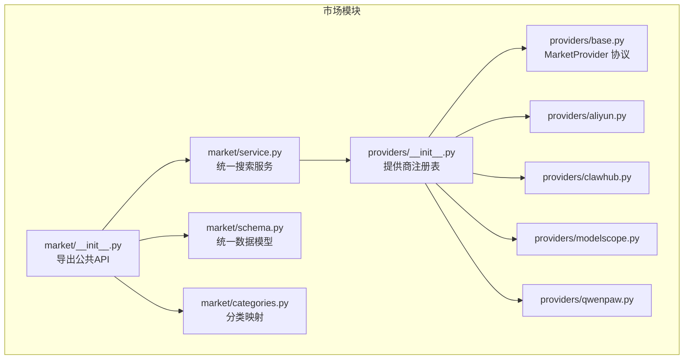
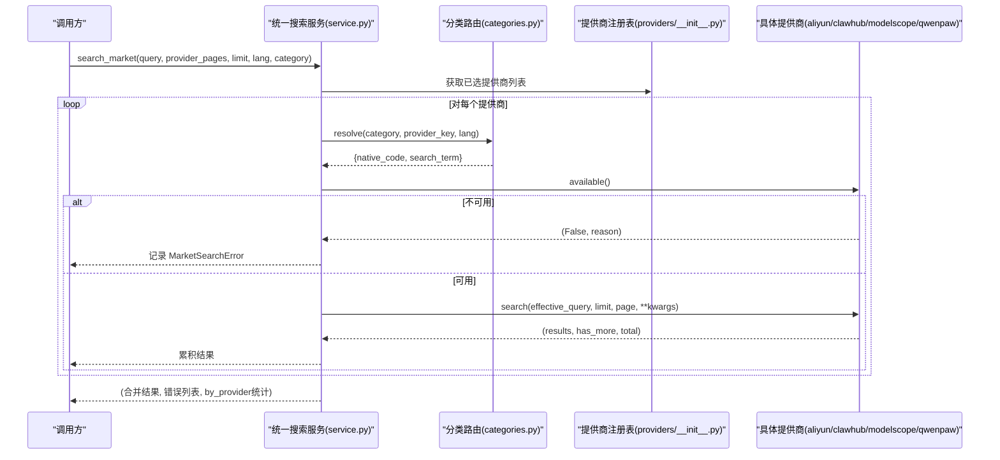
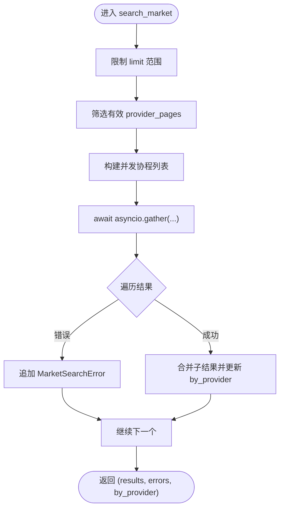
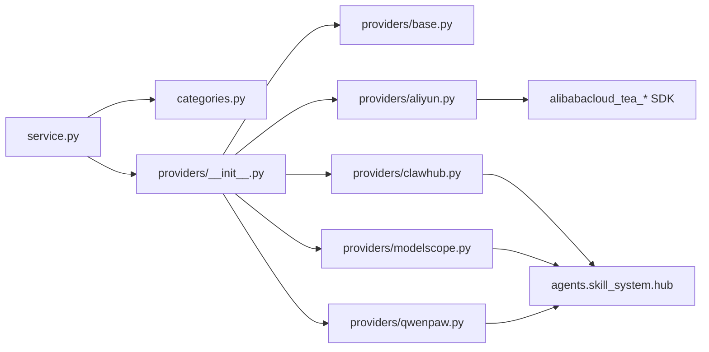

# 提供商抽象层

<cite>
**本文引用的文件**
- [src/qwenpaw/market/__init__.py](file://src/qwenpaw/market/__init__.py)
- [src/qwenpaw/market/schema.py](file://src/qwenpaw/market/schema.py)
- [src/qwenpaw/market/service.py](file://src/qwenpaw/market/service.py)
- [src/qwenpaw/market/categories.py](file://src/qwenpaw/market/categories.py)
- [src/qwenpaw/market/providers/__init__.py](file://src/qwenpaw/market/providers/__init__.py)
- [src/qwenpaw/market/providers/base.py](file://src/qwenpaw/market/providers/base.py)
- [src/qwenpaw/market/providers/aliyun.py](file://src/qwenpaw/market/providers/aliyun.py)
- [src/qwenpaw/market/providers/clawhub.py](file://src/qwenpaw/market/providers/clawhub.py)
- [src/qwenpaw/market/providers/modelscope.py](file://src/qwenpaw/market/providers/modelscope.py)
- [src/qwenpaw/market/providers/qwenpaw.py](file://src/qwenpaw/market/providers/qwenpaw.py)
</cite>

## 目录
1. [简介](#简介)
2. [项目结构](#项目结构)
3. [核心组件](#核心组件)
4. [架构总览](#架构总览)
5. [详细组件分析](#详细组件分析)
6. [依赖关系分析](#依赖关系分析)
7. [性能与超时策略](#性能与超时策略)
8. [错误处理机制](#错误处理机制)
9. [配置与环境变量](#配置与环境变量)
10. [统一市场接口适配与数据模型转换](#统一市场接口适配与数据模型转换)
11. [自定义提供商实现指南](#自定义提供商实现指南)
12. [故障排查](#故障排查)
13. [结论](#结论)

## 简介
本文件面向 QwenPaw 的“市场提供商抽象层”，系统性阐述 MarketProvider 协议设计、共享常量定义、统一搜索服务编排、分类路由以及各具体提供商的实现规范。文档同时提供从初学者到高级开发者的分层说明，涵盖异步搜索请求、标准结果格式、配置选项、超时策略与错误处理，并解释与统一市场接口的适配关系和数据模型转换过程。

## 项目结构
市场模块位于 src/qwenpaw/market，包含：
- 公共 API 与导出（__init__.py）
- 统一数据模型（schema.py）
- 分类映射与本地化（categories.py）
- 统一搜索服务（service.py）
- 提供商注册表与基础协议（providers/__init__.py, providers/base.py）
- 具体提供商实现（aliyun.py, clawhub.py, modelscope.py, qwenpaw.py）

图表来源
- [src/qwenpaw/market/__init__.py:1-21](file://src/qwenpaw/market/__init__.py#L1-L21)
- [src/qwenpaw/market/service.py:1-130](file://src/qwenpaw/market/service.py#L1-L130)
- [src/qwenpaw/market/schema.py:1-39](file://src/qwenpaw/market/schema.py#L1-L39)
- [src/qwenpaw/market/categories.py:1-156](file://src/qwenpaw/market/categories.py#L1-L156)
- [src/qwenpaw/market/providers/__init__.py:1-29](file://src/qwenpaw/market/providers/__init__.py#L1-L29)
- [src/qwenpaw/market/providers/base.py:1-44](file://src/qwenpaw/market/providers/base.py#L1-L44)

章节来源
- [src/qwenpaw/market/__init__.py:1-21](file://src/qwenpaw/market/__init__.py#L1-L21)
- [src/qwenpaw/market/providers/__init__.py:1-29](file://src/qwenpaw/market/providers/__init__.py#L1-L29)

## 核心组件
- MarketProvider 协议：定义每个提供商必须实现的 key、label、supports_browse 属性，以及 available() 和 search() 方法。search() 为异步方法，返回 (results, has_more, total)。
- 统一数据模型：MarketResult、MarketSearchError、ProviderInfo 用于跨提供商标准化结果与错误信息。
- 统一搜索服务：list_providers() 列出所有提供商及其可用性；search_market() 并发调用多个提供商，聚合结果并汇总错误。
- 分类路由：根据逻辑分类 ID 与语言，解析出每个提供商的原生过滤码或本地化搜索词。

章节来源
- [src/qwenpaw/market/providers/base.py:1-44](file://src/qwenpaw/market/providers/base.py#L1-L44)
- [src/qwenpaw/market/schema.py:1-39](file://src/qwenpaw/market/schema.py#L1-L39)
- [src/qwenpaw/market/service.py:1-130](file://src/qwenpaw/market/service.py#L1-L130)
- [src/qwenpaw/market/categories.py:1-156](file://src/qwenpaw/market/categories.py#L1-L156)

## 架构总览
统一市场接口通过 service.search_market() 协调多个提供商并行搜索，按页合并结果，并将异常转换为统一的 MarketSearchError。分类路由将 UI 的分类标签映射为各提供商可识别的参数或搜索词。

图表来源
- [src/qwenpaw/market/service.py:38-116](file://src/qwenpaw/market/service.py#L38-L116)
- [src/qwenpaw/market/categories.py:133-156](file://src/qwenpaw/market/categories.py#L133-L156)
- [src/qwenpaw/market/providers/__init__.py:17-22](file://src/qwenpaw/market/providers/__init__.py#L17-L22)

## 详细组件分析

### MarketProvider 协议与共享常量
- 协议要求：
  - key: 字符串标识符，用于注册表索引
  - label: 显示名称
  - supports_browse: 是否支持浏览模式（无查询时按推荐排序浏览）
  - available(): 同步检查可用性，返回 (bool, reason|None)
  - search(): 异步方法，参数包括 query、limit、page，可选 lang、category；返回 (list[MarketResult], bool has_more, int|None total)
- 共享常量：
  - MARKET_SEARCH_TIMEOUT_S = 15.0，作为单次搜索调用的预算上限

章节来源
- [src/qwenpaw/market/providers/base.py:1-44](file://src/qwenpaw/market/providers/base.py#L1-L44)

### 统一数据模型
- MarketResult：包含 source、slug、name、description、source_url、version、author、icon_url、stats 等字段，其中 stats 为可选键值对，供详情页面展示下载量、点赞数、分类等。
- MarketSearchError：记录 provider 与 message，便于上层聚合错误。
- ProviderInfo：描述提供商 key、label、available、reason、supports_browse。

章节来源
- [src/qwenpaw/market/schema.py:1-39](file://src/qwenpaw/market/schema.py#L1-L39)

### 统一搜索服务
- list_providers()：遍历 PROVIDERS，调用每个 provider.available()，生成 ProviderInfo 列表。
- search_market()：
  - 限制 limit 在合理范围
  - 选择有效的 provider_pages
  - 并发执行 _run_one(key, ...)
  - 聚合结果、错误与 by_provider 统计
- _run_one()：
  - 先检查 provider.available()
  - 使用 categories.resolve() 将逻辑分类映射为 native_code 或 search_term
  - 构造 kwargs，并通过 inspect.signature 动态裁剪只传递给 provider.search() 支持的参数
  - 捕获异常并转为 MarketSearchError

图表来源
- [src/qwenpaw/market/service.py:38-76](file://src/qwenpaw/market/service.py#L38-L76)
- [src/qwenpaw/market/service.py:79-116](file://src/qwenpaw/market/service.py#L79-L116)
- [src/qwenpaw/market/service.py:118-130](file://src/qwenpaw/market/service.py#L118-L130)

章节来源
- [src/qwenpaw/market/service.py:1-130](file://src/qwenpaw/market/service.py#L1-L130)

### 分类路由
- CATEGORIES：定义逻辑分类 ID、中英文标签、各提供商原生代码及 fallback 搜索词。
- list_categories(lang)：返回当前语言的分类列表 [{id, label}]。
- resolve(category_id, provider_key, lang)：
  - 若未指定或未知分类 → 返回空路由
  - 若提供商有原生代码 → 设置 native_code，search_term 为空
  - 否则 → 使用本地化 fallback 作为 search_term

章节来源
- [src/qwenpaw/market/categories.py:1-156](file://src/qwenpaw/market/categories.py#L1-L156)

### 提供商实现要点

#### AliyunProvider（阿里云 AgentExplorer）
- 可用性检查：
  - 校验环境变量 ALIBABA_CLOUD_ACCESS_KEY_ID、ALIBABA_CLOUD_ACCESS_KEY_SECRET 是否存在
  - 校验 alibabacloud_tea_openapi、alibabacloud_credentials、alibabacloud_tea_util 是否安装
- 搜索实现：
  - 上游采用游标分页（nextToken），内部循环翻页至目标页，最多 _MAX_PAGE_WALK 步
  - 每次调用 call_aliyun_action_async(action="SearchSkills", pathname="/openapi/skills")，带 keyword、maxResults、nextToken
  - 将上游响应转换为 MarketResult，填充 installs、likes、category、updated_at 等 stats
  - 使用 MARKET_SEARCH_TIMEOUT_S 控制超时
- 注意：
  - 上游无 version/author/iconUrl，这些字段留空
  - 异常包装为 RuntimeError，由上层转为 MarketSearchError

章节来源
- [src/qwenpaw/market/providers/aliyun.py:1-320](file://src/qwenpaw/market/providers/aliyun.py#L1-L320)

#### ClawHubProvider（ClawHub）
- 可用性检查：始终可用
- 搜索实现：
  - 若有查询词 → 使用 search_hub_skills(query, limit=_OVERFETCH_LIMIT, timeout=MARKET_SEARCH_TIMEOUT_S)，再在内存中分页
  - 若无查询词 → 使用 /api/v1/skills?sort=recommended&cursor=... 进行浏览式分页
  - 搜索结果不包含 stats，浏览路径可从 items.stats 提取 downloads/stars/installs
- 注意：
  - 浏览路径无 total，has_more 基于 nextCursor 判断

章节来源
- [src/qwenpaw/market/providers/clawhub.py:1-168](file://src/qwenpaw/market/providers/clawhub.py#L1-L168)

#### ModelScopeProvider（ModelScope）
- 可用性检查：始终可用
- 搜索实现：
  - 调用 https://www.modelscope.cn/openapi/v1/skills，参数 page_size、page_number、search、filter.category
  - 校验 success 标志与 data.skills 列表，total 来自 data.total
  - 支持本地化字段 locales[lang][field]，优先按 lang 选择，回退另一语言
- 注意：
  - 上游 page_size 限制 1..100，需截断 limit
  - HTTPStatusError 包装为 RuntimeError

章节来源
- [src/qwenpaw/market/providers/modelscope.py:1-186](file://src/qwenpaw/market/providers/modelscope.py#L1-L186)

#### QwenPawProvider（QwenPaw Plaza）
- 可用性检查：始终可用
- 搜索实现：
  - 调用 https://platform.agentscope.io/openapi/v1/skills，参数 page_size、page_number、search、category
  - 校验 success 标志与 data.skills 列表，total 来自 data.total
  - 支持本地化字段 locales[lang][field]，优先按 lang 选择，回退另一语言
- 注意：
  - 上游 page_size 限制 1..100，需截断 limit
  - HTTPStatusError 包装为 RuntimeError

章节来源
- [src/qwenpaw/market/providers/qwenpaw.py:1-176](file://src/qwenpaw/market/providers/qwenpaw.py#L1-L176)

## 依赖关系分析
- 统一服务依赖：
  - categories.resolve：分类路由
  - providers.PROVIDERS：提供商注册表
  - schema：统一数据模型
- 提供商依赖：
  - ClawHub/ModelScope/QwenPaw：复用 agents.skill_system.hub 的 http_json_get 与 search_hub_skills
  - Aliyun：依赖 alibabacloud_tea_openapi 客户端签名与 do_request_async

图表来源
- [src/qwenpaw/market/service.py:1-130](file://src/qwenpaw/market/service.py#L1-L130)
- [src/qwenpaw/market/providers/__init__.py:1-29](file://src/qwenpaw/market/providers/__init__.py#L1-L29)
- [src/qwenpaw/market/providers/clawhub.py:1-168](file://src/qwenpaw/market/providers/clawhub.py#L1-L168)
- [src/qwenpaw/market/providers/modelscope.py:1-186](file://src/qwenpaw/market/providers/modelscope.py#L1-L186)
- [src/qwenpaw/market/providers/qwenpaw.py:1-176](file://src/qwenpaw/market/providers/qwenpaw.py#L1-L176)
- [src/qwenpaw/market/providers/aliyun.py:1-320](file://src/qwenpaw/market/providers/aliyun.py#L1-L320)

章节来源
- [src/qwenpaw/market/providers/__init__.py:1-29](file://src/qwenpaw/market/providers/__init__.py#L1-L29)

## 性能与超时策略
- 并发搜索：search_market 使用 asyncio.gather 并发调用各提供商，提升整体吞吐。
- 超时预算：MARKET_SEARCH_TIMEOUT_S = 15.0 秒，各提供商在底层 HTTP 或 SDK 调用中传入该超时。
- 分页与上拉：
  - Aliyun：游标翻页，最大 _MAX_PAGE_WALK 步，避免无限循环
  - ClawHub：搜索路径内存分页；浏览路径基于 cursor 翻页
  - ModelScope/QwenPaw：直接透传 page_number/page_size，计算 has_more 基于 total
- 限制上限：统一服务限制 limit 不超过 _MAX_LIMIT（50），防止过大请求。

章节来源
- [src/qwenpaw/market/service.py:20-76](file://src/qwenpaw/market/service.py#L20-L76)
- [src/qwenpaw/market/providers/base.py:12-14](file://src/qwenpaw/market/providers/base.py#L12-L14)
- [src/qwenpaw/market/providers/aliyun.py:35-42](file://src/qwenpaw/market/providers/aliyun.py#L35-L42)
- [src/qwenpaw/market/providers/clawhub.py:23-26](file://src/qwenpaw/market/providers/clawhub.py#L23-L26)
- [src/qwenpaw/market/providers/modelscope.py:24-27](file://src/qwenpaw/market/providers/modelscope.py#L24-L27)
- [src/qwenpaw/market/providers/qwenpaw.py:22-24](file://src/qwenpaw/market/providers/qwenpaw.py#L22-L24)

## 错误处理机制
- 提供商级异常：
  - Aliyun：ImportError 包装为 RuntimeError；HTTP/签名异常包装为 RuntimeError
  - ModelScope/QwenPaw：httpx.HTTPStatusError 包装为 RuntimeError
  - ClawHub：依赖 hub 客户端异常传播
- 统一服务捕获：
  - _run_one 捕获任何异常，记录警告日志，并返回 MarketSearchError(provider=key, message=str(exc))
- 可用性检查失败：
  - available() 返回 False 时，直接返回 MarketSearchError，message 为 reason

章节来源
- [src/qwenpaw/market/providers/aliyun.py:221-227](file://src/qwenpaw/market/providers/aliyun.py#L221-L227)
- [src/qwenpaw/market/providers/modelscope.py:63-73](file://src/qwenpaw/market/providers/modelscope.py#L63-L73)
- [src/qwenpaw/market/providers/qwenpaw.py:60-70](file://src/qwenpaw/market/providers/qwenpaw.py#L60-L70)
- [src/qwenpaw/market/service.py:106-116](file://src/qwenpaw/market/service.py#L106-L116)

## 配置与环境变量
- AliyunProvider：
  - 环境变量：ALIBABA_CLOUD_ACCESS_KEY_ID、ALIBABA_CLOUD_ACCESS_KEY_SECRET
  - 可选端点：ALIYUN_AGENTEXPLORER_ENDPOINT（默认 agentexplorer.aliyuncs.com）
  - 依赖包：alibabacloud-tea-openapi、alibabacloud-credentials、alibabacloud-tea-util
- 其他提供商：无需额外环境变量，使用公开 OpenAPI 或 hub 客户端

章节来源
- [src/qwenpaw/market/providers/aliyun.py:27-46](file://src/qwenpaw/market/providers/aliyun.py#L27-L46)
- [src/qwenpaw/market/providers/aliyun.py:170-190](file://src/qwenpaw/market/providers/aliyun.py#L170-L190)

## 统一市场接口适配与数据模型转换
- 统一入口：
  - market.__all__ 暴露 MARKET_SEARCH_TIMEOUT_S、MarketResult、MarketSearchError、ProviderInfo、list_categories、list_providers、search_market
- 数据模型转换：
  - 各提供商将上游数据结构转换为 MarketResult，确保字段语义一致（slug、name、description、source_url、version、author、icon_url、stats）
  - stats 字段承载各平台特有指标（如 installs、likes、downloads、stars、views、category、updated_at）
- 分类适配：
  - categories.resolve 将 UI 分类映射为 provider 原生 filter 或本地化搜索词
  - service._supported_kwargs 动态裁剪参数，仅传递 provider.search 接受的参数

章节来源
- [src/qwenpaw/market/__init__.py:1-21](file://src/qwenpaw/market/__init__.py#L1-L21)
- [src/qwenpaw/market/schema.py:1-39](file://src/qwenpaw/market/schema.py#L1-L39)
- [src/qwenpaw/market/categories.py:133-156](file://src/qwenpaw/market/categories.py#L133-L156)
- [src/qwenpaw/market/service.py:118-130](file://src/qwenpaw/market/service.py#L118-L130)

## 自定义提供商实现指南
- 步骤概览：
  1. 新建 providers/<your_provider>.py，实现类 YourProvider，满足 MarketProvider 协议
     - 定义 key、label、supports_browse
     - 实现 available() 检查依赖或凭据
     - 实现 async def search(self, query, limit, page, lang="en", category=None) -> tuple[list[MarketResult], bool, int|None]
  2. 在 providers/__init__.py 中导入并注册 provider 实例到 PROVIDERS 字典
  3. （可选）在 categories.py 中添加该提供商的分类映射（qwenpaw/modelscope 列），以便分类路由生效
  4. 测试：
     - 调用 list_providers() 验证 availability
     - 调用 search_market(query, {"your_provider": 1}, limit=10, lang="zh", category="xxx") 验证结果
- 关键注意事项：
  - 始终使用 MARKET_SEARCH_TIMEOUT_S 作为底层网络调用超时
  - 严格遵循 search() 返回值约定：(results, has_more, total)
  - 将上游异常包装为 RuntimeError，以便统一服务捕获并转为 MarketSearchError
  - 若上游不支持 total，可返回 None；has_more 应反映是否有下一页
  - 使用 _to_market_result 辅助函数保证字段一致性

章节来源
- [src/qwenpaw/market/providers/base.py:17-44](file://src/qwenpaw/market/providers/base.py#L17-L44)
- [src/qwenpaw/market/providers/__init__.py:10-22](file://src/qwenpaw/market/providers/__init__.py#L10-L22)
- [src/qwenpaw/market/categories.py:28-113](file://src/qwenpaw/market/categories.py#L28-L113)

## 故障排查
- 常见问题与定位：
  - Aliyun 缺少 AK/SK 或未安装依赖：available() 返回 False，message 提示缺失的环境变量或依赖包
  - 上游 HTTP 错误：ModelScope/QwenPaw 抛出 HTTPStatusError，被包装为 RuntimeError，最终转为 MarketSearchError
  - 分页越界：Aliyun/ClawHub 超过 _MAX_PAGE_WALK 直接返回空结果
  - 分类不生效：确认 categories.py 中对应 provider 列存在原生代码或 fallback 搜索词
- 建议操作：
  - 检查环境变量与依赖安装
  - 查看统一服务的警告日志（provider failed for query）
  - 调整 limit 与 page，确保不超过上游限制
  - 验证 categories.resolve 输出是否符合预期

章节来源
- [src/qwenpaw/market/providers/aliyun.py:170-190](file://src/qwenpaw/market/providers/aliyun.py#L170-L190)
- [src/qwenpaw/market/providers/modelscope.py:63-73](file://src/qwenpaw/market/providers/modelscope.py#L63-L73)
- [src/qwenpaw/market/providers/qwenpaw.py:60-70](file://src/qwenpaw/market/providers/qwenpaw.py#L60-L70)
- [src/qwenpaw/market/providers/aliyun.py:198-200](file://src/qwenpaw/market/providers/aliyun.py#L198-L200)
- [src/qwenpaw/market/providers/clawhub.py:86-89](file://src/qwenpaw/market/providers/clawhub.py#L86-L89)
- [src/qwenpaw/market/service.py:106-116](file://src/qwenpaw/market/service.py#L106-L116)

## 结论
QwenPaw 的市场提供商抽象层通过清晰的 MarketProvider 协议、统一数据模型与搜索服务编排，实现了多源技能市场的聚合检索。分类路由与动态参数裁剪提升了扩展性与兼容性。各提供商在保持各自传输细节的同时，对外暴露一致的异步接口与结果格式，便于上层应用快速集成与扩展。