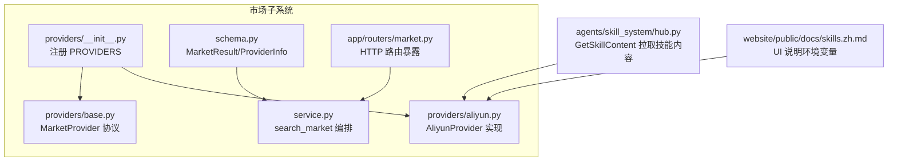
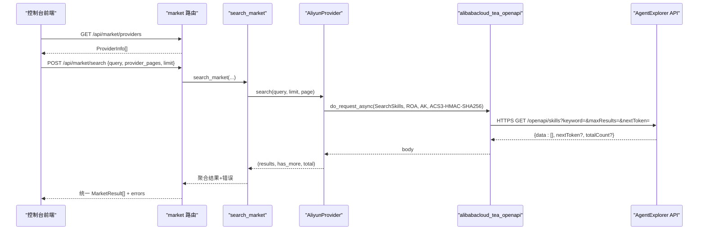
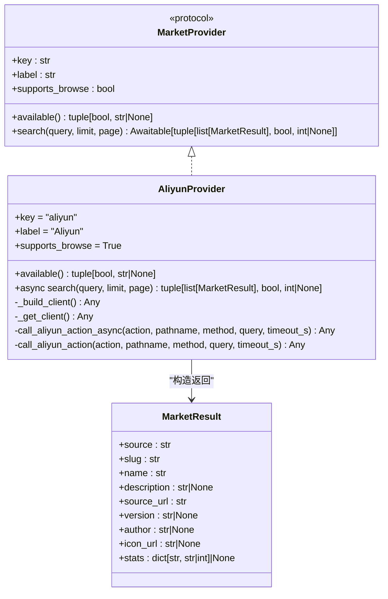
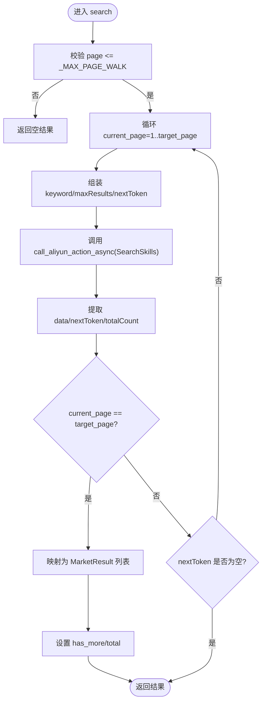
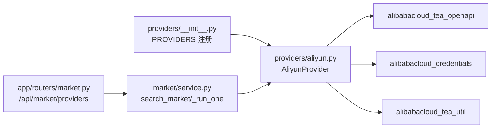

# 阿里云提供商

<cite>
**本文引用的文件**   
- [src/qwenpaw/market/providers/aliyun.py](file://src/qwenpaw/market/providers/aliyun.py)
- [src/qwenpaw/market/providers/base.py](file://src/qwenpaw/market/providers/base.py)
- [src/qwenpaw/market/schema.py](file://src/qwenpaw/market/schema.py)
- [src/qwenpaw/market/service.py](file://src/qwenpaw/market/service.py)
- [src/qwenpaw/market/providers/__init__.py](file://src/qwenpaw/market/providers/__init__.py)
- [src/qwenpaw/app/routers/market.py](file://src/qwenpaw/app/routers/market.py)
- [tests/integration/test_market.py](file://tests/integration/test_market.py)
- [src/qwenpaw/agents/skill_system/hub.py](file://src/qwenpaw/agents/skill_system/hub.py)
- [website/public/docs/skills.zh.md](file://website/public/docs/skills.zh.md)
</cite>

## 目录
1. [简介](#简介)
2. [项目结构](#项目结构)
3. [核心组件](#核心组件)
4. [架构总览](#架构总览)
5. [详细组件分析](#详细组件分析)
6. [依赖分析](#依赖分析)
7. [性能考虑](#性能考虑)
8. [故障排查指南](#故障排查指南)
9. [结论](#结论)
10. [附录](#附录)

## 简介
本文件面向 QwenPaw 的“阿里云市场提供商”实现，聚焦以下目标：
- 深入解释阿里云 SDK 集成、认证机制与技能搜索实现
- 记录具体的 API 调用方式、参数配置与响应解析
- 提供来自实际代码库的具体示例路径，展示如何配置阿里云凭据、执行技能搜索和处理分页结果
- 记录阿里云特有的功能特性、限流策略和错误码处理
- 解释与通用提供商协议的适配实现
- 处理网络异常重试与性能优化建议

## 项目结构
围绕阿里云市场提供商的相关代码主要位于 market 子系统下，包含协议定义、服务编排、具体提供商实现以及注册表。

图表来源
- [src/qwenpaw/market/providers/__init__.py:1-29](file://src/qwenpaw/market/providers/__init__.py#L1-L29)
- [src/qwenpaw/market/providers/base.py:1-44](file://src/qwenpaw/market/providers/base.py#L1-L44)
- [src/qwenpaw/market/providers/aliyun.py:1-320](file://src/qwenpaw/market/providers/aliyun.py#L1-L320)
- [src/qwenpaw/market/schema.py:1-39](file://src/qwenpaw/market/schema.py#L1-L39)
- [src/qwenpaw/market/service.py:1-130](file://src/qwenpaw/market/service.py#L1-L130)
- [src/qwenpaw/app/routers/market.py:79-81](file://src/qwenpaw/app/routers/market.py#L79-L81)
- [src/qwenpaw/agents/skill_system/hub.py:1797-1838](file://src/qwenpaw/agents/skill_system/hub.py#L1797-L1838)
- [website/public/docs/skills.zh.md:339-365](file://website/public/docs/skills.zh.md#L339-L365)

章节来源
- [src/qwenpaw/market/providers/__init__.py:1-29](file://src/qwenpaw/market/providers/__init__.py#L1-L29)
- [src/qwenpaw/market/providers/base.py:1-44](file://src/qwenpaw/market/providers/base.py#L1-L44)
- [src/qwenpaw/market/schema.py:1-39](file://src/qwenpaw/market/schema.py#L1-L39)
- [src/qwenpaw/market/service.py:1-130](file://src/qwenpaw/market/service.py#L1-L130)
- [src/qwenpaw/app/routers/market.py:79-81](file://src/qwenpaw/app/routers/market.py#L79-L81)
- [src/qwenpaw/agents/skill_system/hub.py:1797-1838](file://src/qwenpaw/agents/skill_system/hub.py#L1797-L1838)
- [website/public/docs/skills.zh.md:339-365](file://website/public/docs/skills.zh.md#L339-L365)

## 核心组件
- MarketProvider 协议：统一了各市场数据源的可用性与搜索接口，返回 (结果列表, has_more, total)。
- AliyunProvider：基于阿里云 tea_openapi SDK，使用 ACS3-HMAC-SHA256 签名，实现 SearchSkills 分页检索。
- 市场服务 service.search_market：并行调度多个 provider，聚合结果并汇总错误。
- HTTP 路由：对外暴露 /api/market/providers 等接口，供控制台渲染市场入口。
- 技能内容获取：通过 GetSkillContent 拉取指定技能的完整内容包。

章节来源
- [src/qwenpaw/market/providers/base.py:17-43](file://src/qwenpaw/market/providers/base.py#L17-L43)
- [src/qwenpaw/market/providers/aliyun.py:165-245](file://src/qwenpaw/market/providers/aliyun.py#L165-L245)
- [src/qwenpaw/market/service.py:38-76](file://src/qwenpaw/market/service.py#L38-L76)
- [src/qwenpaw/app/routers/market.py:79-81](file://src/qwenpaw/app/routers/market.py#L79-L81)
- [src/qwenpaw/agents/skill_system/hub.py:1797-1838](file://src/qwenpaw/agents/skill_system/hub.py#L1797-L1838)

## 架构总览
下图展示了从控制台到阿里云市场的端到端调用链：前端请求后端路由，路由调用市场服务，服务并行查询各 provider；其中阿里云 provider 通过 tea_openapi SDK 完成签名与请求。

图表来源
- [src/qwenpaw/app/routers/market.py:79-81](file://src/qwenpaw/app/routers/market.py#L79-L81)
- [src/qwenpaw/market/service.py:38-76](file://src/qwenpaw/market/service.py#L38-L76)
- [src/qwenpaw/market/providers/aliyun.py:121-138](file://src/qwenpaw/market/providers/aliyun.py#L121-L138)
- [src/qwenpaw/market/providers/aliyun.py:192-245](file://src/qwenpaw/market/providers/aliyun.py#L192-L245)

## 详细组件分析

### 阿里云提供商类图

图表来源
- [src/qwenpaw/market/providers/base.py:17-43](file://src/qwenpaw/market/providers/base.py#L17-L43)
- [src/qwenpaw/market/providers/aliyun.py:165-245](file://src/qwenpaw/market/providers/aliyun.py#L165-L245)
- [src/qwenpaw/market/schema.py:10-23](file://src/qwenpaw/market/schema.py#L10-L23)

章节来源
- [src/qwenpaw/market/providers/base.py:17-43](file://src/qwenpaw/market/providers/base.py#L17-L43)
- [src/qwenpaw/market/providers/aliyun.py:165-245](file://src/qwenpaw/market/providers/aliyun.py#L165-L245)
- [src/qwenpaw/market/schema.py:10-23](file://src/qwenpaw/market/schema.py#L10-L23)

### 认证与 SDK 初始化
- 认证来源：标准阿里云凭据链（环境变量、~/.alibabacloud/credentials、RAM 角色）。
- 关键环境变量：ALIBABA_CLOUD_ACCESS_KEY_ID、ALIBABA_CLOUD_ACCESS_KEY_SECRET。
- SDK 客户端：tea_openapi Client，使用 ACS3-HMAC-SHA256 签名算法，ROA 风格，AK 鉴权。
- 线程安全：全局单例缓存 + 锁保护，避免重复构建。

章节来源
- [src/qwenpaw/market/providers/aliyun.py:43-84](file://src/qwenpaw/market/providers/aliyun.py#L43-L84)
- [src/qwenpaw/market/providers/aliyun.py:56-74](file://src/qwenpaw/market/providers/aliyun.py#L56-L74)
- [src/qwenpaw/market/providers/aliyun.py:93-106](file://src/qwenpaw/market/providers/aliyun.py#L93-L106)
- [src/qwenpaw/agents/skill_system/hub.py:1797-1800](file://src/qwenpaw/agents/skill_system/hub.py#L1797-L1800)

### 技能搜索实现与分页
- 上游接口：GET /openapi/skills，支持 keyword、maxResults、nextToken。
- 分页策略：上游为 cursor 分页（nextToken），内部按页号 walking，限制最大步行页数 _MAX_PAGE_WALK，每页最多 _UPSTREAM_PAGE_SIZE。
- 超时控制：MARKET_SEARCH_TIMEOUT_S 作为单次请求超时上限。
- 结果映射：将上游 data 列表转换为统一的 MarketResult，保留 installs、likes、category、updated_at 等 stats。

图表来源
- [src/qwenpaw/market/providers/aliyun.py:192-245](file://src/qwenpaw/market/providers/aliyun.py#L192-L245)
- [src/qwenpaw/market/providers/base.py:12-14](file://src/qwenpaw/market/providers/base.py#L12-L14)
- [src/qwenpaw/market/providers/aliyun.py:248-287](file://src/qwenpaw/market/providers/aliyun.py#L248-L287)

章节来源
- [src/qwenpaw/market/providers/aliyun.py:192-245](file://src/qwenpaw/market/providers/aliyun.py#L192-L245)
- [src/qwenpaw/market/providers/aliyun.py:248-287](file://src/qwenpaw/market/providers/aliyun.py#L248-L287)
- [src/qwenpaw/market/providers/base.py:12-14](file://src/qwenpaw/market/providers/base.py#L12-L14)

### API 调用封装与运行时选项
- 同步/异步双入口：call_aliyun_action 与 call_aliyun_action_async。
- 请求体：OpenApiRequest(query=_string_query(...))，仅传递非 None 值。
- 运行时：RuntimeOptions(connect_timeout/read_timeout)，单位毫秒。
- 返回值解包：do_request/do_request_async 返回 {"body": ..., "headers": ..., "statusCode"}，统一取 body。

章节来源
- [src/qwenpaw/market/providers/aliyun.py:121-138](file://src/qwenpaw/market/providers/aliyun.py#L121-L138)
- [src/qwenpaw/market/providers/aliyun.py:141-158](file://src/qwenpaw/market/providers/aliyun.py#L141-L158)
- [src/qwenpaw/market/providers/aliyun.py:109-118](file://src/qwenpaw/market/providers/aliyun.py#L109-L118)
- [src/qwenpaw/market/providers/aliyun.py:86-90](file://src/qwenpaw/market/providers/aliyun.py#L86-L90)

### 与通用提供商协议的适配
- 协议对齐：AliyunProvider 遵循 MarketProvider 协议，返回统一 MarketResult 与分页元信息。
- 分类路由：service._run_one 根据 category 与语言进行路由，必要时替换为空查询词或注入 native_code。
- 错误隔离：单个 provider 失败不影响其他 provider 的结果展示。

章节来源
- [src/qwenpaw/market/providers/base.py:17-43](file://src/qwenpaw/market/providers/base.py#L17-L43)
- [src/qwenpaw/market/service.py:79-115](file://src/qwenpaw/market/service.py#L79-L115)
- [src/qwenpaw/market/schema.py:10-23](file://src/qwenpaw/market/schema.py#L10-L23)

### 技能内容获取（GetSkillContent）
- 用途：根据 skill_id 拉取完整的技能内容包。
- 调用方式：GET /openapi/skills/{skillId}，同样走 tea_openapi 签名通道。
- 错误包装：捕获异常并抛出 SkillsError，便于上层统一处理。

章节来源
- [src/qwenpaw/agents/skill_system/hub.py:1797-1838](file://src/qwenpaw/agents/skill_system/hub.py#L1797-L1838)

## 依赖分析
- 外部依赖：alibabacloud-tea-openapi、alibabacloud-credentials、alibabacloud-tea-util。
- 模块耦合：
  - providers/__init__.py 集中注册 PROVIDERS，aliyun 通过 module-level provider 实例暴露。
  - service.py 通过 inspect.signature 动态决定向 provider.search 透传哪些额外参数（如 lang、category）。
  - routers/market.py 将 list_providers 暴露为 HTTP 接口，供控制台渲染市场入口。

图表来源
- [src/qwenpaw/market/providers/__init__.py:1-29](file://src/qwenpaw/market/providers/__init__.py#L1-L29)
- [src/qwenpaw/market/providers/aliyun.py:177-190](file://src/qwenpaw/market/providers/aliyun.py#L177-L190)
- [src/qwenpaw/market/service.py:118-129](file://src/qwenpaw/market/service.py#L118-L129)
- [src/qwenpaw/app/routers/market.py:79-81](file://src/qwenpaw/app/routers/market.py#L79-L81)

章节来源
- [src/qwenpaw/market/providers/__init__.py:1-29](file://src/qwenpaw/market/providers/__init__.py#L1-L29)
- [src/qwenpaw/market/providers/aliyun.py:177-190](file://src/qwenpaw/market/providers/aliyun.py#L177-L190)
- [src/qwenpaw/market/service.py:118-129](file://src/qwenpaw/market/service.py#L118-L129)
- [src/qwenpaw/app/routers/market.py:79-81](file://src/qwenpaw/app/routers/market.py#L79-L81)

## 性能考虑
- 分页步行上限：_MAX_PAGE_WALK 防止极端情况下过多上游往返。
- 每页大小限制：_UPSTREAM_PAGE_SIZE 控制单次请求数据量。
- 并发聚合：service.search_market 使用 asyncio.gather 并行调用各 provider，提升整体吞吐。
- 超时控制：MARKET_SEARCH_TIMEOUT_S 确保单次请求不会长时间阻塞。
- 客户端复用：全局单例 + 锁减少重复初始化开销。

章节来源
- [src/qwenpaw/market/providers/aliyun.py:35-41](file://src/qwenpaw/market/providers/aliyun.py#L35-L41)
- [src/qwenpaw/market/providers/base.py:12-14](file://src/qwenpaw/market/providers/base.py#L12-L14)
- [src/qwenpaw/market/service.py:57-61](file://src/qwenpaw/market/service.py#L57-L61)
- [src/qwenpaw/market/providers/aliyun.py:52-84](file://src/qwenpaw/market/providers/aliyun.py#L52-L84)

## 故障排查指南
- 可用性检查：provider.available() 会检测环境变量与第三方模块是否安装，未满足时返回不可用原因，用于 UI 提示。
- 常见错误：
  - 缺少 ALIBABA_CLOUD_ACCESS_KEY_ID/SECRET：在 available() 中明确提示缺失项。
  - 第三方模块未安装：available() 给出 uv add 命令提示。
  - 上游调用异常：search() 捕获并包装为 RuntimeError，附带 message 字段或字符串化异常。
- 集成测试验证：
  - GET /api/market/providers 应返回非空列表且每个条目包含 key、label、available。
  - POST /api/market/search 传入未知 provider key 时应返回 400，detail 中包含 unknown providers 或该 key。

章节来源
- [src/qwenpaw/market/providers/aliyun.py:170-190](file://src/qwenpaw/market/providers/aliyun.py#L170-L190)
- [src/qwenpaw/market/providers/aliyun.py:221-227](file://src/qwenpaw/market/providers/aliyun.py#L221-L227)
- [tests/integration/test_market.py:11-42](file://tests/integration/test_market.py#L11-L42)
- [tests/integration/test_market.py:45-78](file://tests/integration/test_market.py#L45-L78)

## 结论
阿里云市场提供商以 tea_openapi SDK 为核心，采用 ACS3-HMAC-SHA256 签名与 AK 鉴权，实现了稳定的 SearchSkills 分页检索与 GetSkillContent 内容拉取。通过 MarketProvider 协议与市场服务编排，QwenPaw 在多数据源场景下具备良好的扩展性与容错能力。结合合理的分页上限、并发聚合与超时控制，系统在性能与稳定性之间取得平衡。

## 附录
- 环境变量配置（控制台文档）：需在“设置 → 环境变量”中配置 ALIBABA_CLOUD_ACCESS_KEY_ID 与 ALIBABA_CLOUD_ACCESS_KEY_SECRET；未配置时该数据源会被置灰并在 tooltip 显示原因。
- 控制台文档参考路径：skills.zh.md 中的“技能市场”章节。

章节来源
- [website/public/docs/skills.zh.md:339-365](file://website/public/docs/skills.zh.md#L339-L365)