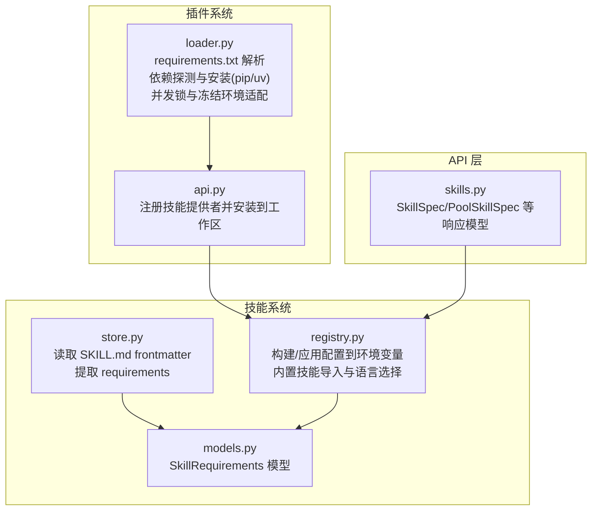
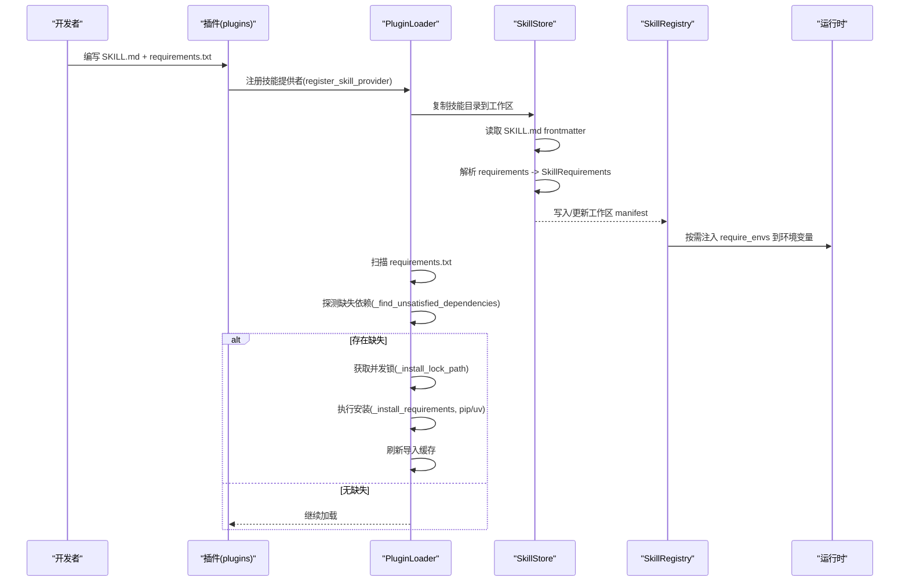
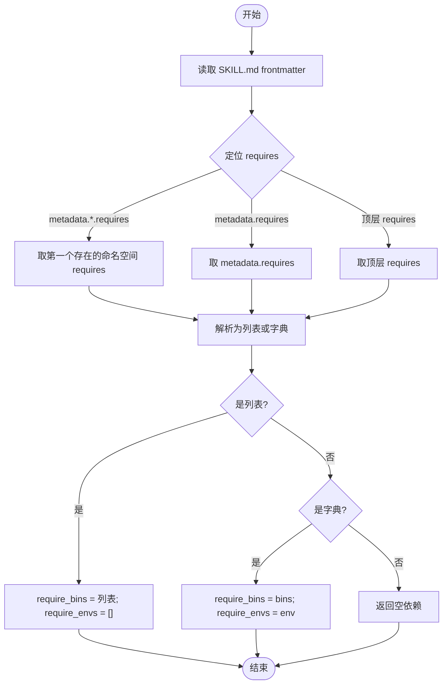
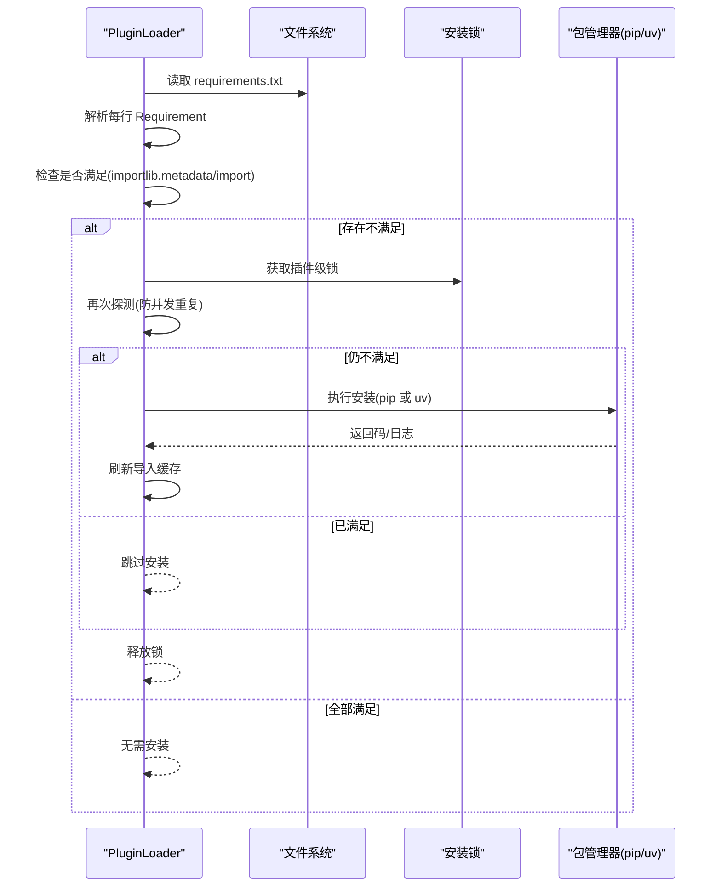
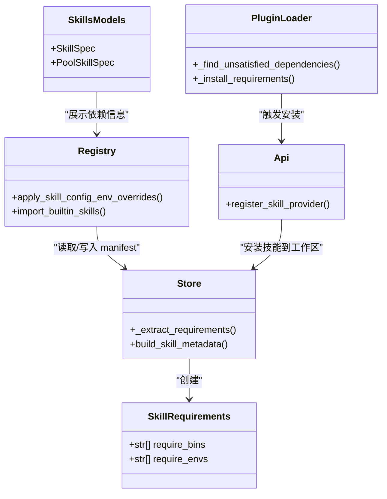

# 依赖管理

<cite>
**本文引用的文件**
- [store.py](file://src/qwenpaw/agents/skill_system/store.py)
- [models.py](file://src/qwenpaw/agents/skill_system/models.py)
- [registry.py](file://src/qwenpaw/agents/skill_system/registry.py)
- [loader.py](file://src/qwenpaw/plugins/loader.py)
- [api.py](file://src/qwenpaw/plugins/api.py)
- [skills.py](file://src/qwenpaw/app/routers/skills.py)
</cite>

## 目录
1. [简介](#简介)
2. [项目结构](#项目结构)
3. [核心组件](#核心组件)
4. [架构总览](#架构总览)
5. [详细组件分析](#详细组件分析)
6. [依赖关系分析](#依赖关系分析)
7. [性能考虑](#性能考虑)
8. [故障排查指南](#故障排查指南)
9. [结论](#结论)
10. [附录](#附录)

## 简介
本文件系统性阐述 QwenPaw 的技能依赖管理机制，覆盖以下关键主题：
- 技能依赖声明与解析（requirements 字段、二进制与环境变量）
- 插件 Python 依赖检测与安装流程（pip/uv 回退、并发锁、冻结环境适配）
- 版本约束处理与冲突策略
- 依赖验证机制与安全边界
- 与 Python 环境隔离和虚拟环境的关系
- 安装失败处理与修复方案
- 生命周期管理与回滚策略

目标读者包括初学者与有经验的开发者，既提供循序渐进的说明，也给出代码级细节与可视化图示。

## 项目结构
与“依赖管理”直接相关的核心模块位于 agents/skill_system 与 plugins 子系统中：
- skill_system：负责技能的清单、元数据、依赖提取、工作区/池化技能同步以及运行时环境变量注入
- plugins：负责插件发现、依赖探测、依赖安装（含并发锁与冻结环境适配）、加载与卸载清理

图表来源
- [store.py:594-660](file://src/qwenpaw/agents/skill_system/store.py#L594-L660)
- [models.py:66-71](file://src/qwenpaw/agents/skill_system/models.py#L66-L71)
- [registry.py:264-392](file://src/qwenpaw/agents/skill_system/registry.py#L264-L392)
- [loader.py:248-334](file://src/qwenpaw/plugins/loader.py#L248-L334)
- [api.py:1112-1148](file://src/qwenpaw/plugins/api.py#L1112-L1148)
- [skills.py:193-233](file://src/qwenpaw/app/routers/skills.py#L193-L233)

章节来源
- [store.py:594-660](file://src/qwenpaw/agents/skill_system/store.py#L594-L660)
- [models.py:66-71](file://src/qwenpaw/agents/skill_system/models.py#L66-L71)
- [registry.py:264-392](file://src/qwenpaw/agents/skill_system/registry.py#L264-L392)
- [loader.py:248-334](file://src/qwenpaw/plugins/loader.py#L248-L334)
- [api.py:1112-1148](file://src/qwenpaw/plugins/api.py#L1112-L1148)
- [skills.py:193-233](file://src/qwenpaw/app/routers/skills.py#L193-L233)

## 核心组件
- 技能依赖模型与提取
  - SkillRequirements：描述技能所需的二进制与环境变量键集合
  - _extract_requirements：从 SKILL.md frontmatter 的 metadata.requires 或顶层 requires 中解析依赖
- 插件依赖探测与安装
  - _find_unsatisfied_dependencies：基于 packaging.requirements 解析 requirements.txt 并校验是否满足
  - _is_requirement_satisfied：结合 importlib.metadata 与 import 探测双重校验，兼容打包/冻结环境
  - _install_requirements：优先 python -m pip，缺失时回退 uv；支持超时与日志流式输出
  - 并发安装锁：按插件粒度加锁，避免多进程重复安装导致资源耗尽
  - 冻结环境适配：在桌面打包环境中使用内置 Python 运行时与用户可写 site-dir
- 运行时环境变量注入
  - apply_skill_config_env_overrides：将匹配 require_envs 的配置项注入为环境变量，并提供完整 JSON 配置的环境变量入口
- API 与模型
  - api.register_skill_provider：将插件内 skills 目录安装到工作区，并维护 manifest
  - skills.py 中的 SkillSpec/PoolSkillSpec 等用于对外暴露技能状态与依赖信息

章节来源
- [models.py:66-71](file://src/qwenpaw/agents/skill_system/models.py#L66-L71)
- [store.py:594-660](file://src/qwenpaw/agents/skill_system/store.py#L594-L660)
- [loader.py:248-334](file://src/qwenpaw/plugins/loader.py#L248-L334)
- [loader.py:721-800](file://src/qwenpaw/plugins/loader.py#L721-L800)
- [registry.py:264-392](file://src/qwenpaw/agents/skill_system/registry.py#L264-L392)
- [api.py:1112-1148](file://src/qwenpaw/plugins/api.py#L1112-L1148)
- [skills.py:193-233](file://src/qwenpaw/app/routers/skills.py#L193-L233)

## 架构总览
下图展示了“技能依赖声明 → 解析 → 安装 → 运行期注入”的整体流程，以及插件与技能系统的协作关系。

图表来源
- [api.py:1112-1148](file://src/qwenpaw/plugins/api.py#L1112-L1148)
- [store.py:594-660](file://src/qwenpaw/agents/skill_system/store.py#L594-L660)
- [registry.py:264-392](file://src/qwenpaw/agents/skill_system/registry.py#L264-L392)
- [loader.py:248-334](file://src/qwenpaw/plugins/loader.py#L248-L334)
- [loader.py:721-800](file://src/qwenpaw/plugins/loader.py#L721-L800)

## 详细组件分析

### 技能依赖声明与解析（SKILL.md frontmatter）
- 支持的声明位置与优先级
  - metadata.<namespace>.requires（命名空间 openclaw/qwenpaw/clawdbot）
  - metadata.requires
  - 顶层 requires
- 支持的格式
  - 列表：等价于 require_bins
  - 字典：包含 bins 与 env 两个可选数组
- 解析结果
  - 转换为 SkillRequirements(require_bins, require_envs)，并在构建 manifest 时持久化

图表来源
- [store.py:594-633](file://src/qwenpaw/agents/skill_system/store.py#L594-L633)
- [store.py:636-660](file://src/qwenpaw/agents/skill_system/store.py#L636-L660)
- [models.py:66-71](file://src/qwenpaw/agents/skill_system/models.py#L66-L71)

章节来源
- [store.py:594-633](file://src/qwenpaw/agents/skill_system/store.py#L594-L633)
- [store.py:636-660](file://src/qwenpaw/agents/skill_system/store.py#L636-L660)
- [models.py:66-71](file://src/qwenpaw/agents/skill_system/models.py#L66-L71)

### 插件 Python 依赖探测与安装流程
- 探测逻辑
  - 逐行解析 requirements.txt，忽略注释与选项行
  - 对每个 Requirement 进行满足性检查：
    - 优先通过 importlib.metadata 查询已安装分布及版本规范
    - 若未找到，则尝试 import 探测以兼容冻结/预打包环境
- 安装策略
  - 首选 python -m pip install -r requirements.txt
  - 若当前解释器缺少 pip，自动回退到 uv pip install
  - 在冻结桌面环境中，使用内置 Python 运行时与用户可写 site-dir
- 并发与幂等
  - 按插件 ID 生成跨进程锁路径，串行化同一插件的安装
  - 获得锁后二次探测，避免重复安装风暴
- 超时与日志
  - 安装命令带超时保护，实时流式记录 stdout/stderr

图表来源
- [loader.py:248-334](file://src/qwenpaw/plugins/loader.py#L248-L334)
- [loader.py:721-800](file://src/qwenpaw/plugins/loader.py#L721-L800)

章节来源
- [loader.py:248-334](file://src/qwenpaw/plugins/loader.py#L248-L334)
- [loader.py:721-800](file://src/qwenpaw/plugins/loader.py#L721-L800)

### 版本约束处理与冲突策略
- 版本约束
  - 使用 packaging.requirements.Requirement 解析版本规范
  - 通过 importlib.metadata.version 获取已安装版本，并用 specifier.contains 判定是否满足
- 冲突场景
  - 当同一技能名在工作区已存在且来源不同（如自定义 vs 内置），会提示冲突并建议重命名
  - 内置技能导入时，若语言或版本不一致，会标记为 outdated/conflict 并等待确认

章节来源
- [loader.py:209-246](file://src/qwenpaw/plugins/loader.py#L209-L246)
- [store.py:694-716](file://src/qwenpaw/agents/skill_system/store.py#L694-L716)
- [registry.py:498-556](file://src/qwenpaw/agents/skill_system/registry.py#L498-L556)

### 依赖验证机制与安全边界
- 安全校验
  - 技能 zip 解压前限制大小、拒绝符号链接、校验路径相对性
  - 技能目录名规范化与安全检查，防止越界路径
- 依赖验证
  - 双探针（metadata + import）降低误报
  - 针对常见包名与 import 名不一致提供映射表

章节来源
- [store.py:482-523](file://src/qwenpaw/agents/skill_system/store.py#L482-L523)
- [store.py:526-556](file://src/qwenpaw/agents/skill_system/store.py#L526-L556)
- [loader.py:28-37](file://src/qwenpaw/plugins/loader.py#L28-L37)
- [loader.py:209-246](file://src/qwenpaw/plugins/loader.py#L209-L246)

### 与 Python 环境隔离和虚拟环境的关系
- 插件依赖安装目标
  - 非冻结环境：安装到当前活跃环境（conda/pip 环境）
  - 冻结桌面环境：安装到用户可写的 site-dir，并通过 sys.path/site 机制加入导入路径
- 虚拟环境
  - 若由脚本创建的 uv-managed venv 缺少 pip，会自动回退到 uv pip install

章节来源
- [loader.py:51-66](file://src/qwenpaw/plugins/loader.py#L51-L66)
- [loader.py:93-116](file://src/qwenpaw/plugins/loader.py#L93-L116)
- [loader.py:721-800](file://src/qwenpaw/plugins/loader.py#L721-L800)

### 依赖安装失败与修复方案
- 失败原因
  - 网络/镜像问题、权限不足、依赖冲突、超时
- 修复步骤
  - 查看安装日志（已流式输出到调试日志）
  - 手动在对应环境中执行 pip/uv 安装
  - 在冻结环境中检查内置 Python 运行时路径与 site-dir 权限
  - 若因并发导致状态不一致，重试一次（锁会保证幂等）

章节来源
- [loader.py:673-719](file://src/qwenpaw/plugins/loader.py#L673-L719)
- [loader.py:721-800](file://src/qwenpaw/plugins/loader.py#L721-L800)

### 生命周期管理与回滚策略
- 插件加载失败清理
  - 注销注册表条目
  - 清理 sys.modules（按模块名前缀与 __file__ 路径）
  - 移除 sys.path 中插件目录
- 技能安装/更新
  - 通过原子写入与版本递增保障 manifest 一致性
  - 内置技能导入时保留用户自定义 config/tags/auto_update 等字段

章节来源
- [loader.py:460-513](file://src/qwenpaw/plugins/loader.py#L460-L513)
- [store.py:359-394](file://src/qwenpaw/agents/skill_system/store.py#L359-L394)
- [registry.py:741-800](file://src/qwenpaw/agents/skill_system/registry.py#L741-L800)

## 依赖关系分析
- 组件耦合
  - store.py 提供依赖提取与元数据构建，被 registry.py 消费
  - registry.py 负责将 require_envs 注入到运行期环境变量
  - loader.py 独立负责插件依赖探测与安装，并通过 api.py 触发技能安装到工作区
  - skills.py 定义对外暴露的模型，便于上层 API 展示依赖与状态

图表来源
- [models.py:66-71](file://src/qwenpaw/agents/skill_system/models.py#L66-L71)
- [store.py:594-660](file://src/qwenpaw/agents/skill_system/store.py#L594-L660)
- [registry.py:264-392](file://src/qwenpaw/agents/skill_system/registry.py#L264-L392)
- [loader.py:248-334](file://src/qwenpaw/plugins/loader.py#L248-L334)
- [api.py:1112-1148](file://src/qwenpaw/plugins/api.py#L1112-L1148)
- [skills.py:193-233](file://src/qwenpaw/app/routers/skills.py#L193-L233)

章节来源
- [models.py:66-71](file://src/qwenpaw/agents/skill_system/models.py#L66-L71)
- [store.py:594-660](file://src/qwenpaw/agents/skill_system/store.py#L594-L660)
- [registry.py:264-392](file://src/qwenpaw/agents/skill_system/registry.py#L264-L392)
- [loader.py:248-334](file://src/qwenpaw/plugins/loader.py#L248-L334)
- [api.py:1112-1148](file://src/qwenpaw/plugins/api.py#L1112-L1148)
- [skills.py:193-233](file://src/qwenpaw/app/routers/skills.py#L193-L233)

## 性能考虑
- 依赖探测采用双重探针，减少误判导致的重复安装
- 并发安装锁避免多进程同时安装同一插件引发的内存与 I/O 风暴
- 安装过程异步线程执行，避免阻塞事件循环
- 冻结环境下通过 site-dir 与 sys.path 快速定位已安装依赖，避免全量扫描

[本节为通用指导，不涉及具体文件分析]

## 故障排查指南
- 常见问题
  - 依赖安装超时：检查网络与镜像源，必要时增大超时或离线安装
  - pip 不可用：确保当前环境包含 pip，或安装 uv 作为回退
  - 冻结环境导入失败：确认内置 Python 运行时路径与 site-dir 权限
  - 并发安装异常：重启后端，让锁机制重新串行化安装
- 定位方法
  - 查看安装日志（已流式输出）
  - 检查工作区 skill.json 与 pool skill.json 的版本号与更新时间
  - 核对 SKILL.md frontmatter 的 requires 字段是否符合预期

章节来源
- [loader.py:673-719](file://src/qwenpaw/plugins/loader.py#L673-L719)
- [loader.py:721-800](file://src/qwenpaw/plugins/loader.py#L721-L800)
- [store.py:359-394](file://src/qwenpaw/agents/skill_system/store.py#L359-L394)

## 结论
QwenPaw 的技能依赖管理以“声明即事实”的方式，通过 SKILL.md frontmatter 与 requirements.txt 统一表达依赖，配合严格的解析、探测与安装流程，实现了跨环境的稳定行为。其并发锁、冻结环境适配、版本约束校验与回滚清理共同构成了健壮的生命周期管理。对于使用者而言，只需遵循标准声明格式即可享受自动化安装与运行期注入；对于开发者，可通过扩展命名空间与 require_envs 精细控制运行环境。

[本节为总结，不涉及具体文件分析]

## 附录
- 示例参考（仅列出路径，不包含代码内容）
  - 技能依赖声明示例：[store.py:594-660](file://src/qwenpaw/agents/skill_system/store.py#L594-L660)
  - 插件依赖探测与安装示例：[loader.py:248-334](file://src/qwenpaw/plugins/loader.py#L248-L334), [loader.py:721-800](file://src/qwenpaw/plugins/loader.py#L721-L800)
  - 运行时环境变量注入示例：[registry.py:264-392](file://src/qwenpaw/agents/skill_system/registry.py#L264-L392)
  - 插件注册技能到工作区示例：[api.py:1112-1148](file://src/qwenpaw/plugins/api.py#L1112-L1148)
  - 对外暴露的技能规格模型示例：[skills.py:193-233](file://src/qwenpaw/app/routers/skills.py#L193-L233)