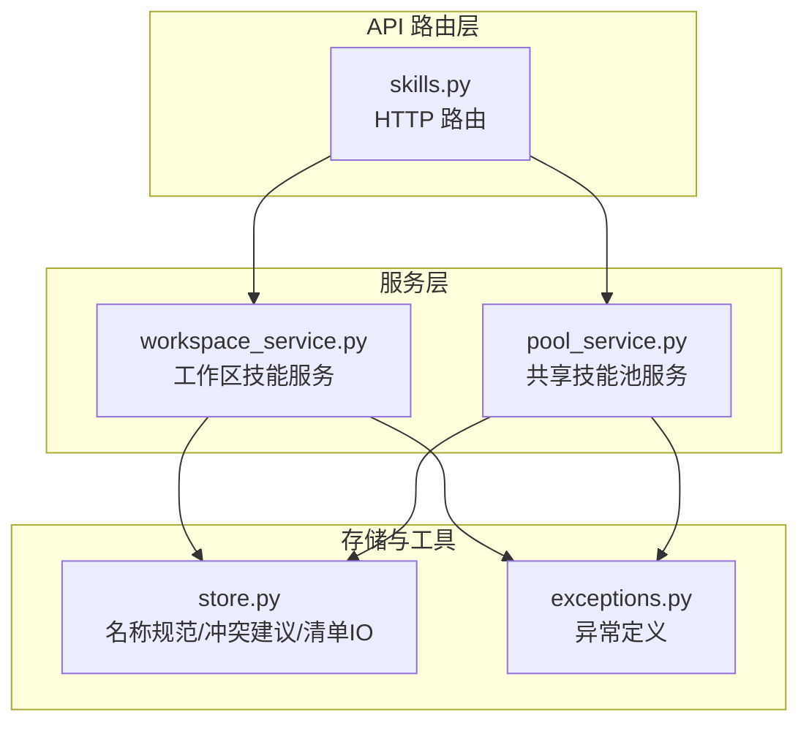
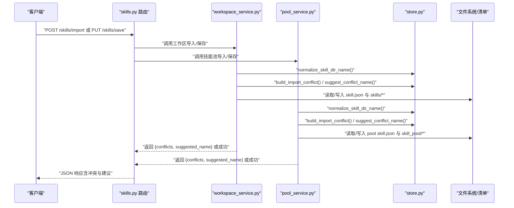
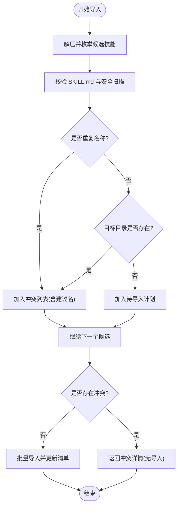
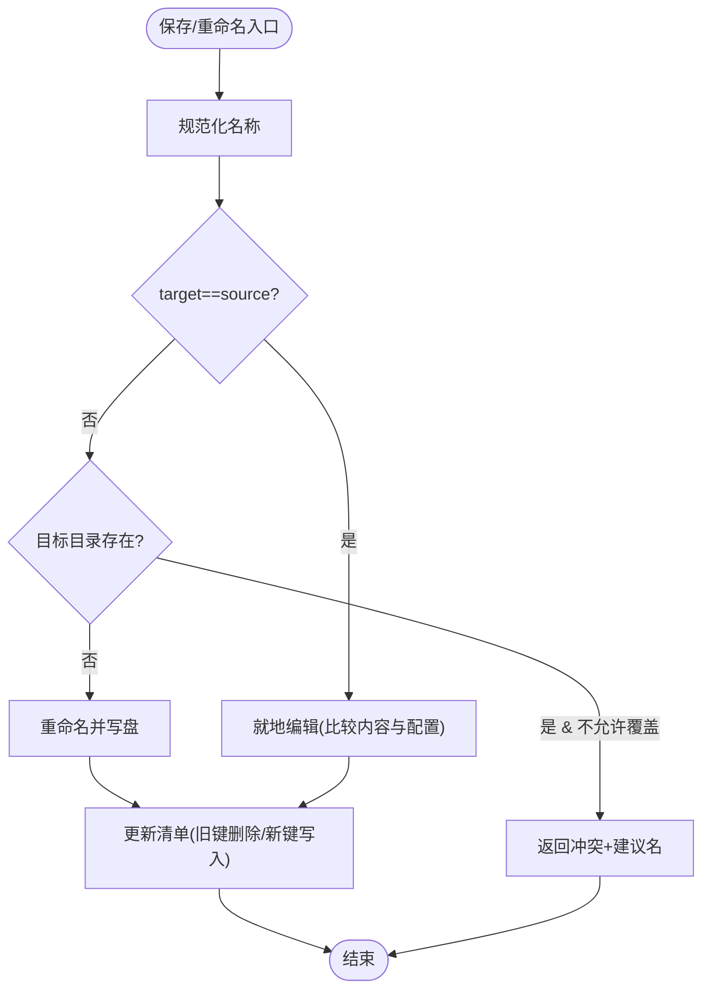
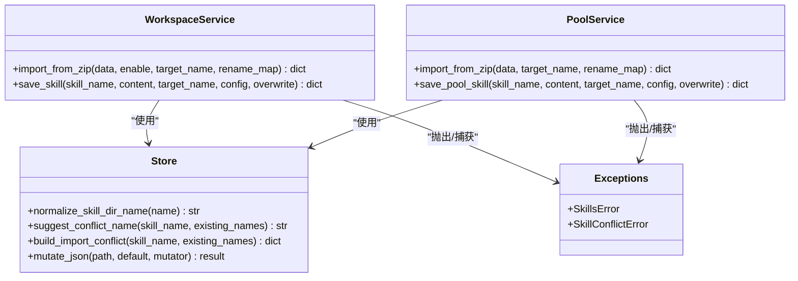

# 冲突检测机制

<cite>
**本文引用的文件列表**
- [workspace_service.py](file://src/qwenpaw/agents/skill_system/workspace_service.py)
- [pool_service.py](file://src/qwenpaw/agents/skill_system/pool_service.py)
- [store.py](file://src/qwenpaw/agents/skill_system/store.py)
- [skills.py](file://src/qwenpaw/app/routers/skills.py)
- [exceptions.py](file://src/qwenpaw/exceptions.py)
- [test_skills_agent_scoped.py](file://tests/integration/test_skills_agent_scoped.py)
</cite>

## 目录
1. [简介](#简介)
2. [项目结构](#项目结构)
3. [核心组件](#核心组件)
4. [架构总览](#架构总览)
5. [详细组件分析](#详细组件分析)
6. [依赖关系分析](#依赖关系分析)
7. [性能与并发特性](#性能与并发特性)
8. [故障排查指南](#故障排查指南)
9. [结论](#结论)
10. [附录：接口与示例](#附录接口与示例)

## 简介
本文件系统性梳理 QwenPaw 的技能冲突检测机制，覆盖技能名称规范化、冲突识别算法与解决方案生成逻辑；记录与“同名技能检测”“版本冲突处理”“命名建议”相关的实现细节；并给出来自实际代码库的调用路径与测试用例，帮助初学者快速上手，同时为有经验的开发者提供深入的技术参考。

## 项目结构
与冲突检测直接相关的代码主要分布在以下模块：
- 工作区技能服务：负责工作区内的创建、保存、导入、启用/禁用等生命周期操作，并在导入和重命名时进行冲突检测。
- 共享技能池服务：管理跨工作区的共享技能池，支持上传、下载、自动更新同步，在导入与重命名时进行冲突检测。
- 存储与工具函数：提供名称规范化、安全路径校验、冲突名建议、导入冲突构建、清单读写与原子写入等基础能力。
- API 路由层：将上述服务暴露为 HTTP 接口，统一错误包装与用户提示。
- 异常定义：定义技能相关异常类型，包括可重命名的冲突异常。

图表来源
- [skills.py:1-120](file://src/qwenpaw/app/routers/skills.py#L1-L120)
- [workspace_service.py:1-120](file://src/qwenpaw/agents/skill_system/workspace_service.py#L1-L120)
- [pool_service.py:1-120](file://src/qwenpaw/agents/skill_system/pool_service.py#L1-L120)
- [store.py:1-120](file://src/qwenpaw/agents/skill_system/store.py#L1-L120)
- [exceptions.py:310-360](file://src/qwenpaw/exceptions.py#L310-L360)

章节来源
- [workspace_service.py:1-120](file://src/qwenpaw/agents/skill_system/workspace_service.py#L1-L120)
- [pool_service.py:1-120](file://src/qwenpaw/agents/skill_system/pool_service.py#L1-L120)
- [store.py:1-120](file://src/qwenpaw/agents/skill_system/store.py#L1-L120)
- [skills.py:1-120](file://src/qwenpaw/app/routers/skills.py#L1-L120)
- [exceptions.py:310-360](file://src/qwenpaw/exceptions.py#L310-L360)

## 核心组件
- 名称规范化与安全路径
  - 通过统一的名称规范化函数对输入技能名进行清洗与校验，拒绝空值、NUL、路径分隔符等非法字符，并通过安全路径解析确保不会逃逸根目录。
  - 该函数被工作区与技能池服务广泛复用，保证冲突检测的一致性。
- 冲突检测与解决
  - 导入流程：在导入前扫描目标空间（工作区或技能池）已存在名称集合，结合去重与磁盘占用检查，发现冲突后返回结构化冲突信息，包含建议的新名称。
  - 保存/重命名流程：当目标名称与现有技能冲突且未显式允许覆盖时，返回冲突结果与建议名称；若允许覆盖则执行覆盖策略。
- 命名建议算法
  - 基于时间戳后缀生成不重复的建议名称，自动剥离已有时间戳后缀，避免多次追加导致名称膨胀。
- 清单与文件系统一致性
  - 使用带锁的原子写入保障多进程并发下的清单一致性，避免竞态导致的误判。

章节来源
- [store.py:526-556](file://src/qwenpaw/agents/skill_system/store.py#L526-L556)
- [store.py:671-691](file://src/qwenpaw/agents/skill_system/store.py#L671-L691)
- [store.py:731-743](file://src/qwenpaw/agents/skill_system/store.py#L731-L743)
- [store.py:384-394](file://src/qwenpaw/agents/skill_system/store.py#L384-L394)

## 架构总览
下图展示从 API 到服务再到存储层的冲突检测主流程。

图表来源
- [skills.py:1-120](file://src/qwenpaw/app/routers/skills.py#L1-L120)
- [workspace_service.py:444-553](file://src/qwenpaw/agents/skill_system/workspace_service.py#L444-L553)
- [pool_service.py:237-351](file://src/qwenpaw/agents/skill_system/pool_service.py#L237-L351)
- [store.py:526-556](file://src/qwenpaw/agents/skill_system/store.py#L526-L556)
- [store.py:671-691](file://src/qwenpaw/agents/skill_system/store.py#L671-L691)
- [store.py:731-743](file://src/qwenpaw/agents/skill_system/store.py#L731-L743)

## 详细组件分析

### 名称规范化与安全路径
- 作用：统一输入校验与路径安全，防止非法名称与路径穿越。
- 关键点：
  - 拒绝空名、NUL、路径分隔符、`.` `..`。
  - 通过 resolve + is_relative_to 双重校验，确保最终路径位于目标根目录下。
- 影响范围：所有导入、保存、重命名、删除等操作入口均先规范化名称。

章节来源
- [store.py:526-556](file://src/qwenpaw/agents/skill_system/store.py#L526-L556)

### 冲突检测算法（导入场景）
- 工作区导入（zip）：
  - 步骤：
    1) 解压 zip，提取候选技能目录与名称（优先使用 frontmatter name）。
    2) 遍历候选，校验内容并执行安全扫描。
    3) 维护 seen_names 集合，检测同一包内重复名称。
    4) 扫描目标工作区 skills 目录，收集已存在名称集合。
    5) 若目标名称已在 seen_names 或磁盘上存在，则构建冲突条目，包含建议新名称。
    6) 若存在任何冲突，整体失败并返回 conflicts 列表；否则批量导入并更新清单。
- 技能池导入（zip）：
  - 步骤类似，但目标空间为共享技能池目录，冲突判断依据清单与磁盘目录联合集合。

图表来源
- [workspace_service.py:444-553](file://src/qwenpaw/agents/skill_system/workspace_service.py#L444-L553)
- [pool_service.py:237-351](file://src/qwenpaw/agents/skill_system/pool_service.py#L237-L351)
- [store.py:923-965](file://src/qwenpaw/agents/skill_system/store.py#L923-L965)

章节来源
- [workspace_service.py:444-553](file://src/qwenpaw/agents/skill_system/workspace_service.py#L444-L553)
- [pool_service.py:237-351](file://src/qwenpaw/agents/skill_system/pool_service.py#L237-L351)
- [store.py:923-965](file://src/qwenpaw/agents/skill_system/store.py#L923-L965)

### 冲突检测算法（保存/重命名场景）
- 工作区保存：
  - 若 target_name 与当前名称相同，走就地编辑分支。
  - 若不同，计算目标目录是否存在；若存在且未允许覆盖，返回冲突与建议名；否则执行重命名并更新清单。
- 技能池保存：
  - 先通过 get_edit_target_name 判定模式（edit/rename/conflict），再进入对应分支。
  - 重命名成功后，若开启自动更新，会迁移工作区中的副本并处理覆盖情况。

图表来源
- [workspace_service.py:229-284](file://src/qwenpaw/agents/skill_system/workspace_service.py#L229-L284)
- [pool_service.py:460-545](file://src/qwenpaw/agents/skill_system/pool_service.py#L460-L545)

章节来源
- [workspace_service.py:229-284](file://src/qwenpaw/agents/skill_system/workspace_service.py#L229-L284)
- [pool_service.py:460-545](file://src/qwenpaw/agents/skill_system/pool_service.py#L460-L545)

### 命名建议算法
- 规则：
  - 去除已有时间戳后缀，避免多次追加。
  - 以 UTC 时间戳生成候选名，循环尝试直到不与现有名称集合冲突。
  - 最多尝试固定次数，必要时回退到最后一个候选。
- 适用场景：
  - 导入冲突、保存/重命名冲突、Hub 安装冲突等。

章节来源
- [store.py:671-691](file://src/qwenpaw/agents/skill_system/store.py#L671-L691)

### 冲突数据结构与异常
- 冲突条目：
  - 包含 reason、skill_name、suggested_name 等字段，便于前端渲染冲突提示与一键重命名。
- 异常类型：
  - SkillConflictError：用于可重命名冲突的错误封装，携带 detail 供上层统一处理。
  - SkillsError：技能管理通用异常基类。

章节来源
- [store.py:731-743](file://src/qwenpaw/agents/skill_system/store.py#L731-L743)
- [exceptions.py:333-341](file://src/qwenpaw/exceptions.py#L333-L341)
- [exceptions.py:311-320](file://src/qwenpaw/exceptions.py#L311-L320)

### 与技能池和工作空间的关系
- 工作空间（Workspace）：
  - 每个 Agent 拥有独立的工作空间目录，其 skills 目录存放可编辑技能，manifest 为 skill.json。
  - 工作空间技能的生命周期由 workspace_service 管理，冲突检测针对本地磁盘与清单。
- 共享技能池（Skill Pool）：
  - 全局共享目录，支持跨工作区复用与自动更新同步。
  - 技能池服务负责上传、下载、自动更新、重命名迁移等工作，冲突检测同样考虑清单与磁盘。

章节来源
- [store.py:58-133](file://src/qwenpaw/agents/skill_system/store.py#L58-L133)
- [pool_service.py:121-141](file://src/qwenpaw/agents/skill_system/pool_service.py#L121-L141)
- [workspace_service.py:88-105](file://src/qwenpaw/agents/skill_system/workspace_service.py#L88-L105)

## 依赖关系分析
- 低耦合高内聚：
  - store.py 提供纯函数与上下文管理器，被多个服务复用，职责清晰。
  - workspace_service 与 pool_service 分别面向不同作用域，但共用相同的冲突检测工具。
- 关键依赖链：
  - API 路由 -> 服务 -> 存储工具 -> 文件系统/清单。
  - 异常体系贯穿各层，便于统一错误处理与用户提示。

图表来源
- [store.py:526-556](file://src/qwenpaw/agents/skill_system/store.py#L526-L556)
- [store.py:671-691](file://src/qwenpaw/agents/skill_system/store.py#L671-L691)
- [store.py:731-743](file://src/qwenpaw/agents/skill_system/store.py#L731-L743)
- [workspace_service.py:444-553](file://src/qwenpaw/agents/skill_system/workspace_service.py#L444-L553)
- [pool_service.py:237-351](file://src/qwenpaw/agents/skill_system/pool_service.py#L237-L351)
- [exceptions.py:311-341](file://src/qwenpaw/exceptions.py#L311-L341)

章节来源
- [store.py:526-556](file://src/qwenpaw/agents/skill_system/store.py#L526-L556)
- [workspace_service.py:444-553](file://src/qwenpaw/agents/skill_system/workspace_service.py#L444-L553)
- [pool_service.py:237-351](file://src/qwenpaw/agents/skill_system/pool_service.py#L237-L351)
- [exceptions.py:311-341](file://src/qwenpaw/exceptions.py#L311-L341)

## 性能与并发特性
- 清单原子写入与跨进程锁：
  - 通过文件级锁与临时文件替换实现原子写入，避免并发修改导致的数据不一致。
  - 读缓存按 mtime 失效，减少频繁 IO。
- 导入批量处理：
  - 冲突检测阶段一次性收集冲突，避免部分导入造成中间状态。
- 建议名生成：
  - 时间戳方案 O(1) 生成候选，冲突迭代上限固定，性能稳定。

章节来源
- [store.py:384-394](file://src/qwenpaw/agents/skill_system/store.py#L384-L394)
- [store.py:760-776](file://src/qwenpaw/agents/skill_system/store.py#L760-L776)
- [store.py:671-691](file://src/qwenpaw/agents/skill_system/store.py#L671-L691)

## 故障排查指南
- 常见问题定位：
  - 导入失败：检查返回的 conflicts 列表，确认是否有重复名称或磁盘占用；根据 suggested_name 调整目标名。
  - 保存/重命名失败：查看 reason 是否为 conflict，若 allow overwrite 为 False，需选择建议名或显式覆盖。
  - 清单损坏：系统会在 JSON 解析失败时重置为默认清单，检查日志与恢复后的状态。
- 错误码与消息：
  - 冲突异常：SkillConflictError.detail 中包含 reason、skill_name、suggested_name。
  - 扫描失败：SkillScanError 会附带 findings 摘要，便于定位安全问题。
- 恢复策略：
  - 导入取消：清理已创建的临时目录与已导入的部分技能，保持工作区一致。
  - 重命名迁移：若开启自动更新，服务会迁移工作区副本并处理覆盖。

章节来源
- [workspace_service.py:444-553](file://src/qwenpaw/agents/skill_system/workspace_service.py#L444-L553)
- [pool_service.py:237-351](file://src/qwenpaw/agents/skill_system/pool_service.py#L237-L351)
- [exceptions.py:333-341](file://src/qwenpaw/exceptions.py#L333-L341)

## 结论
QwenPaw 的技能冲突检测机制以“名称规范化 + 预检 + 建议名生成 + 原子写入”为核心，兼顾工作区与共享技能池两个作用域，既保证了数据一致性，又提供了友好的用户体验（冲突提示与一键重命名）。通过清晰的异常体系与完善的错误处理，系统在复杂场景下仍能提供稳定的行为与可恢复性。

## 附录：接口与示例

### 冲突检测相关接口概览
- 工作区技能导入（zip）
  - 方法：POST /api/agents/{agentId}/skills/import
  - 行为：若检测到冲突，返回 conflicts 列表与 suggested_name；否则导入成功。
- 工作区技能保存/重命名
  - 方法：PUT /api/agents/{agentId}/skills/save
  - 行为：若目标名称冲突且不允许覆盖，返回 conflict 与建议名；允许覆盖则执行覆盖。
- 共享技能池导入/保存
  - 方法：POST /skills/import、PUT /skills/save
  - 行为：与工作区类似，但作用于共享技能池目录与清单。

章节来源
- [skills.py:1-120](file://src/qwenpaw/app/routers/skills.py#L1-L120)
- [workspace_service.py:444-553](file://src/qwenpaw/agents/skill_system/workspace_service.py#L444-L553)
- [pool_service.py:237-351](file://src/qwenpaw/agents/skill_system/pool_service.py#L237-L351)

### 具体示例与测试路径
- 工作区保存冲突 409 场景
  - 说明：当 source_name 指向一个技能，而 name 指向另一个已存在的技能，且 overwrite=False 时，应返回 409 并包含 reason=conflict。
  - 测试路径：[test_skills_agent_scoped.py:528-583](file://tests/integration/test_skills_agent_scoped.py#L528-L583)
- 导入冲突与建议名
  - 说明：导入 zip 时若存在重复或占用的名称，返回 conflicts 列表，每项包含 suggested_name。
  - 实现路径：
    - 工作区导入：[workspace_service.py:444-553](file://src/qwenpaw/agents/skill_system/workspace_service.py#L444-L553)
    - 技能池导入：[pool_service.py:237-351](file://src/qwenpaw/agents/skill_system/pool_service.py#L237-L351)
    - 冲突构建与建议名：[store.py:671-691](file://src/qwenpaw/agents/skill_system/store.py#L671-691), [store.py:731-743](file://src/qwenpaw/agents/skill_system/store.py#L731-743)

章节来源
- [test_skills_agent_scoped.py:528-583](file://tests/integration/test_skills_agent_scoped.py#L528-L583)
- [workspace_service.py:444-553](file://src/qwenpaw/agents/skill_system/workspace_service.py#L444-L553)
- [pool_service.py:237-351](file://src/qwenpaw/agents/skill_system/pool_service.py#L237-L351)
- [store.py:671-691](file://src/qwenpaw/agents/skill_system/store.py#L671-L691)
- [store.py:731-743](file://src/qwenpaw/agents/skill_system/store.py#L731-L743)