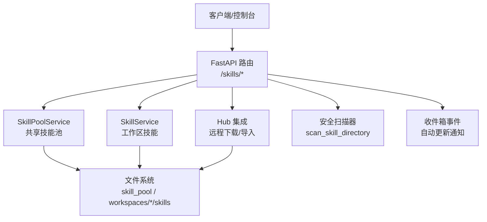
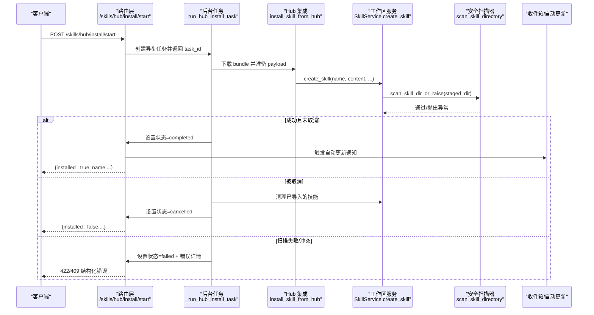
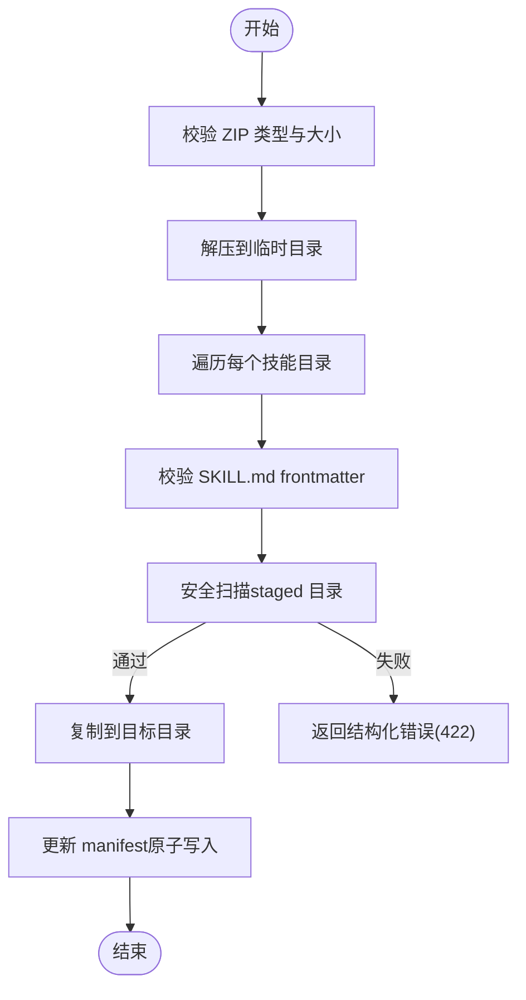
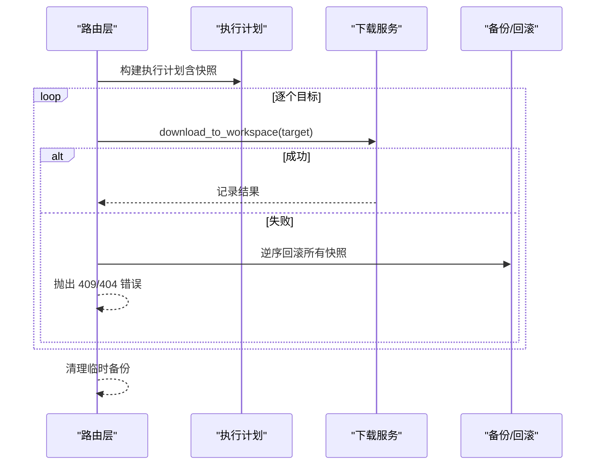
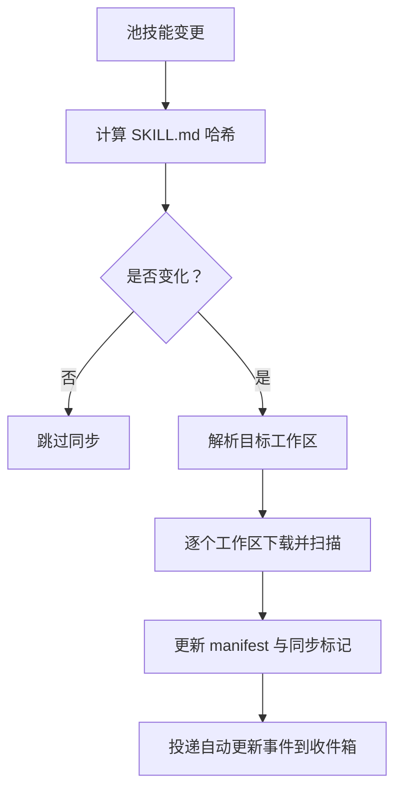
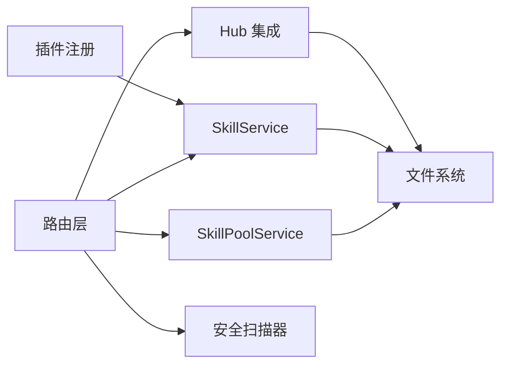

# 安装工作流

<cite>
**本文引用的文件**   
- [skills.py](file://src/qwenpaw/app/routers/skills.py)
- [pool_service.py](file://src/qwenpaw/agents/skill_system/pool_service.py)
- [workspace_service.py](file://src/qwenpaw/agents/skill_system/workspace_service.py)
- [hub.py](file://src/qwenpaw/agents/skill_system/hub.py)
- [__init__.py（安全扫描器）](file://src/qwenpaw/security/skill_scanner/__init__.py)
- [config.py](file://src/qwenpaw/config/config.py)
- [skills_cmd.py](file://src/qwenpaw/cli/skills_cmd.py)
- [api.py（插件注册）](file://src/qwenpaw/plugins/api.py)
</cite>

## 目录
1. [简介](#简介)
2. [项目结构](#项目结构)
3. [核心组件](#核心组件)
4. [架构总览](#架构总览)
5. [详细组件分析](#详细组件分析)
6. [依赖关系分析](#依赖关系分析)
7. [性能与并发特性](#性能与并发特性)
8. [故障排查指南](#故障排查指南)
9. [结论](#结论)
10. [附录：API 参考](#附录api-参考)

## 简介
本文件系统化梳理 QwenPaw 的“技能安装工作流”，覆盖从前端/CLI 发起的安装请求，到后端路由、服务层、文件系统操作、安全扫描、权限校验、事务回滚、批量安装、进度跟踪与错误恢复等全链路细节。文档同时给出面向初学者的流程说明与面向开发者的代码级实现要点，帮助读者快速理解并正确使用安装能力。

## 项目结构
围绕“技能安装”的关键路径涉及以下模块：
- API 路由层：接收 HTTP 请求，参数校验，调用服务层，处理异常与响应
- 服务层：SkillPoolService（共享技能池）、SkillService（工作区技能）、Hub 集成（远程下载）
- 安全扫描：在启用/安装前进行静态安全检查，支持白名单与超时保护
- CLI：提供交互式配置与命令行安装入口
- 插件系统：将插件内置技能自动分发到各工作区

图表来源
- [skills.py:706-800](file://src/qwenpaw/app/routers/skills.py#L706-L800)
- [pool_service.py:121-236](file://src/qwenpaw/agents/skill_system/pool_service.py#L121-L236)
- [workspace_service.py:88-227](file://src/qwenpaw/agents/skill_system/workspace_service.py#L88-L227)
- [hub.py:2187-2219](file://src/qwenpaw/agents/skill_system/hub.py#L2187-L2219)
- [__init__.py（安全扫描器）:397-487](file://src/qwenpaw/security/skill_scanner/__init__.py#L397-L487)

章节来源
- [skills.py:706-800](file://src/qwenpaw/app/routers/skills.py#L706-L800)
- [pool_service.py:121-236](file://src/qwenpaw/agents/skill_system/pool_service.py#L121-L236)
- [workspace_service.py:88-227](file://src/qwenpaw/agents/skill_system/workspace_service.py#L88-L227)
- [hub.py:2187-2219](file://src/qwenpaw/agents/skill_system/hub.py#L2187-L2219)
- [__init__.py（安全扫描器）:397-487](file://src/qwenpaw/security/skill_scanner/__init__.py#L397-L487)

## 核心组件
- 路由层（skills.py）
  - 统一入口：创建/上传 ZIP、从 Hub 安装、从技能池下载、批量启停/删除、自动更新触发等
  - 任务生命周期：异步安装任务状态查询与取消
  - 错误归一化：将安全扫描异常转换为结构化响应
- 服务层
  - SkillPoolService：管理共享技能池（创建、ZIP 导入、重命名、标签、自动更新、向工作区推送）
  - SkillService：管理工作区技能（创建、编辑、重命名、启用/禁用、ZIP 导入、删除）
  - Hub 集成：远程下载 bundle，解析并写入工作区或技能池
- 安全扫描器（security/skill_scanner）
  - 模式：block/warn/off；白名单基于内容哈希；结果缓存与超时保护
- CLI（cli/skills_cmd.py）
  - 交互式选择要启用的技能，支持从池安装、启用/禁用、本地测试与校验
- 插件系统（plugins/api.py）
  - 注册技能提供者，按策略批量安装至所有工作区

章节来源
- [skills.py:862-941](file://src/qwenpaw/app/routers/skills.py#L862-L941)
- [pool_service.py:237-351](file://src/qwenpaw/agents/skill_system/pool_service.py#L237-L351)
- [workspace_service.py:145-227](file://src/qwenpaw/agents/skill_system/workspace_service.py#L145-L227)
- [__init__.py（安全扫描器）:397-487](file://src/qwenpaw/security/skill_scanner/__init__.py#L397-L487)
- [skills_cmd.py:163-310](file://src/qwenpaw/cli/skills_cmd.py#L163-L310)
- [api.py（插件注册）:1112-1148](file://src/qwenpaw/plugins/api.py#L1112-L1148)

## 架构总览
下图展示一次“从 Hub 安装到工作区”的典型端到端流程，包括任务状态、取消、回滚与安全扫描。

图表来源
- [skills.py:757-814](file://src/qwenpaw/app/routers/skills.py#L757-L814)
- [skills.py:507-589](file://src/qwenpaw/app/routers/skills.py#L507-L589)
- [hub.py:2187-2219](file://src/qwenpaw/agents/skill_system/hub.py#L2187-L2219)
- [workspace_service.py:145-227](file://src/qwenpaw/agents/skill_system/workspace_service.py#L145-L227)
- [__init__.py（安全扫描器）:397-487](file://src/qwenpaw/security/skill_scanner/__init__.py#L397-L487)

## 详细组件分析

### 安装接口与多源安装方式
- 工作区 ZIP 导入（POST /skills/upload）
  - 校验 ZIP 类型与大小，解析重命名映射，逐技能验证 frontmatter 与安全扫描，冲突检测，可选启用
- 技能池 ZIP 导入（POST /skills/pool/upload-zip）
  - 同工作区导入逻辑，但目标为共享技能池，支持批量导入与冲突列表返回
- 从 Hub 直接安装到工作区（POST /skills/hub/install/start）
  - 异步任务：start/status/cancel 三件套；支持取消后清理已导入技能
- 从 Hub 导入到技能池（POST /skills/pool/import）
  - 下载 bundle 并写入 pool，随后触发自动更新传播
- 从技能池下载到工作区（POST /skills/pool/download）
  - 预检冲突（语言切换/版本升级/名称冲突），构建执行计划与快照，全部成功或全部回滚
- 批量操作
  - 批量启用/禁用/删除（工作区与技能池分别提供）
  - 每技能独立结果，便于前端细粒度反馈

章节来源
- [skills.py:897-941](file://src/qwenpaw/app/routers/skills.py#L897-L941)
- [skills.py:996-1031](file://src/qwenpaw/app/routers/skills.py#L996-L1031)
- [skills.py:757-814](file://src/qwenpaw/app/routers/skills.py#L757-L814)
- [skills.py:1034-1059](file://src/qwenpaw/app/routers/skills.py#L1034-L1059)
- [skills.py:1203-1245](file://src/qwenpaw/app/routers/skills.py#L1203-L1245)
- [skills.py:1400-1495](file://src/qwenpaw/app/routers/skills.py#L1400-L1495)

### 文件验证、权限检查与安全扫描
- 文件验证
  - SKILL.md frontmatter 校验；ZIP 解压后对每个技能目录进行内容校验
  - 路径安全：仅允许 references/ 与 scripts/ 下的相对路径访问
- 权限控制
  - 工作区技能删除需先禁用；技能池条目删除受保护判断
  - 上传 ZIP 的 Content-Type 白名单与大小限制
- 安全扫描
  - 在 staged 目录完成后再落盘，避免中间态污染
  - 扫描模式 block/warn/off；白名单基于内容哈希；结果缓存与超时保护
  - 扫描失败时返回结构化 422 响应，包含发现项详情

图表来源
- [skills.py:477-490](file://src/qwenpaw/app/routers/skills.py#L477-L490)
- [workspace_service.py:444-552](file://src/qwenpaw/agents/skill_system/workspace_service.py#L444-L552)
- [pool_service.py:237-351](file://src/qwenpaw/agents/skill_system/pool_service.py#L237-L351)
- [__init__.py（安全扫描器）:397-487](file://src/qwenpaw/security/skill_scanner/__init__.py#L397-L487)

章节来源
- [skills.py:477-490](file://src/qwenpaw/app/routers/skills.py#L477-L490)
- [workspace_service.py:751-782](file://src/qwenpaw/agents/skill_system/workspace_service.py#L751-L782)
- [__init__.py（安全扫描器）:397-487](file://src/qwenpaw/security/skill_scanner/__init__.py#L397-L487)

### 事务处理与回滚机制
- 原子写入
  - 使用 mutate_json 对 manifest 进行原子更新；若失败则尝试回滚已写文件
- 快照与回滚
  - 批量下载前为每个目标工作区创建快照（备份目录+manifest 副本）
  - 任一目标失败则逆序回滚所有已完成的目标，保证一致性
- 取消与清理
  - Hub 安装任务支持取消；若已部分导入，会清理已导入的技能与 manifest 条目

图表来源
- [skills.py:1147-1245](file://src/qwenpaw/app/routers/skills.py#L1147-L1245)
- [skills.py:385-434](file://src/qwenpaw/app/routers/skills.py#L385-L434)
- [pool_service.py:980-1079](file://src/qwenpaw/agents/skill_system/pool_service.py#L980-L1079)

章节来源
- [skills.py:1147-1245](file://src/qwenpaw/app/routers/skills.py#L1147-L1245)
- [skills.py:385-434](file://src/qwenpaw/app/routers/skills.py#L385-L434)
- [pool_service.py:980-1079](file://src/qwenpaw/agents/skill_system/pool_service.py#L980-L1079)

### 批量安装、进度跟踪与错误恢复
- 批量安装
  - 批量启用/禁用/删除接口返回 per-skill 结果，便于前端逐项提示
  - CLI 交互配置支持从池安装、批量启用/禁用
- 进度跟踪
  - Hub 安装任务：start/status/cancel 三端点；状态枚举涵盖 pending/importing/completed/failed/cancelled
- 错误恢复
  - 扫描失败返回 422 并附带 findings
  - 冲突返回 409，包含建议名称或语言/版本差异信息
  - 网络异常由上层捕获并转为失败状态，客户端可重试

章节来源
- [skills.py:1400-1495](file://src/qwenpaw/app/routers/skills.py#L1400-L1495)
- [skills.py:757-814](file://src/qwenpaw/app/routers/skills.py#L757-L814)
- [skills_cmd.py:163-310](file://src/qwenpaw/cli/skills_cmd.py#L163-L310)

### 安装配置选项、权限控制与审计日志
- 配置项
  - 安全扫描器：mode（block/warn/off）、timeout（秒）、whitelist（按名称+内容哈希）
  - 环境变量优先级高于配置文件
- 权限控制
  - 仅禁用的工作区技能可删除
  - 上传 ZIP 的 Content-Type 白名单与大小限制
- 审计日志
  - 自动更新结果投递到收件箱事件，便于追踪变更影响范围
  - 安全扫描告警记录到历史文件，支持查看与白名单管理

章节来源
- [config.py:2030-2071](file://src/qwenpaw/config/config.py#L2030-L2071)
- [__init__.py（安全扫描器）:397-487](file://src/qwenpaw/security/skill_scanner/__init__.py#L397-L487)
- [skills.py:81-148](file://src/qwenpaw/app/routers/skills.py#L81-L148)

### 与文件系统操作和事务处理的关系
- 所有写操作遵循“先 staging，再落盘”的模式，确保中间态不污染生产目录
- manifest 更新采用原子写入，失败时回滚文件变更
- 批量下载前建立快照，失败时逆序回滚，保障跨工作区一致性

章节来源
- [workspace_service.py:145-227](file://src/qwenpaw/agents/skill_system/workspace_service.py#L145-L227)
- [pool_service.py:237-351](file://src/qwenpaw/agents/skill_system/pool_service.py#L237-L351)
- [skills.py:1147-1245](file://src/qwenpaw/app/routers/skills.py#L1147-L1245)

### 安装中断与网络异常的处理策略
- 安装中断
  - 支持取消 Hub 安装任务；取消后清理已导入的技能与 manifest 条目
- 网络异常
  - 路由层捕获异常并转为失败状态；客户端可轮询 status 获取最终结果
  - 批量下载失败时整体回滚，避免部分成功导致的不一致

章节来源
- [skills.py:794-814](file://src/qwenpaw/app/routers/skills.py#L794-L814)
- [skills.py:507-589](file://src/qwenpaw/app/routers/skills.py#L507-L589)
- [skills.py:1203-1245](file://src/qwenpaw/app/routers/skills.py#L1203-L1245)

### 概念性概览
下图展示了“从技能池自动更新到工作区”的概念流程，强调变更检测与通知。

[此图为概念流程图，不直接映射具体源码文件]

## 依赖关系分析
- 路由层依赖服务层与扫描器
- 服务层依赖文件系统工具与 manifest 读写
- Hub 集成负责远程下载与 payload 构造
- 插件系统在工作区创建时自动注入技能

图表来源
- [skills.py:706-800](file://src/qwenpaw/app/routers/skills.py#L706-L800)
- [pool_service.py:121-236](file://src/qwenpaw/agents/skill_system/pool_service.py#L121-L236)
- [workspace_service.py:88-227](file://src/qwenpaw/agents/skill_system/workspace_service.py#L88-L227)
- [api.py（插件注册）:1112-1148](file://src/qwenpaw/plugins/api.py#L1112-L1148)

章节来源
- [skills.py:706-800](file://src/qwenpaw/app/routers/skills.py#L706-L800)
- [pool_service.py:121-236](file://src/qwenpaw/agents/skill_system/pool_service.py#L121-L236)
- [workspace_service.py:88-227](file://src/qwenpaw/agents/skill_system/workspace_service.py#L88-L227)
- [api.py（插件注册）:1112-1148](file://src/qwenpaw/plugins/api.py#L1112-L1148)

## 性能与并发特性
- 安全扫描使用线程池执行，支持超时保护与结果缓存（基于目录 mtime）
- Hub 安装任务以异步 Task 运行，避免阻塞请求线程
- 批量下载顺序执行，但每次单个目标失败即触发全局回滚，减少不一致风险
- 自动更新通过哈希门控，仅在内容变化时推送，降低不必要 I/O

章节来源
- [__init__.py（安全扫描器）:397-487](file://src/qwenpaw/security/skill_scanner/__init__.py#L397-L487)
- [skills.py:757-814](file://src/qwenpaw/app/routers/skills.py#L757-L814)
- [pool_service.py:1218-1264](file://src/qwenpaw/agents/skill_system/pool_service.py#L1218-L1264)

## 故障排查指南
- 常见错误码
  - 400：请求参数错误（如 rename_map 非 JSON）
  - 404：资源不存在（工作区/技能/文件）
  - 409：冲突（名称/版本/语言切换）
  - 422：安全扫描失败（返回 findings 详情）
- 定位步骤
  - 查看 Hub 安装任务状态与错误字段
  - 检查安全扫描历史记录与白名单
  - 确认 manifest 与目录一致性（必要时刷新）
- 恢复手段
  - 使用批量接口重试失败项
  - 利用快照回滚机制恢复工作区状态
  - 调整扫描模式或加入白名单（谨慎使用）

章节来源
- [skills.py:150-190](file://src/qwenpaw/app/routers/skills.py#L150-L190)
- [skills.py:757-814](file://src/qwenpaw/app/routers/skills.py#L757-L814)
- [__init__.py（安全扫描器）:397-487](file://src/qwenpaw/security/skill_scanner/__init__.py#L397-L487)

## 结论
QwenPaw 的技能安装工作流以“安全优先、事务一致、可观测可恢复”为核心设计原则。通过分层职责清晰的路由与服务、严格的安全扫描与权限控制、完善的批量与异步任务机制，以及快照与回滚保障，既满足初学者易用性，也为高级用户提供足够的扩展与排障能力。

## 附录：API 参考
- 工作区技能
  - GET /skills：列出当前工作区技能
  - POST /skills：创建工作区技能
  - POST /skills/upload：上传 ZIP 到工作区
  - POST /skills/{name}/enable：启用（带扫描）
  - POST /skills/{name}/disable：禁用
  - DELETE /skills/{name}：删除（需先禁用）
  - PUT /skills/save：保存/重命名（带扫描）
  - POST /skills/batch-enable/disable/delete：批量操作
- 技能池
  - GET /skills/pool：列出池技能
  - POST /skills/pool/create：创建池技能
  - POST /skills/pool/upload-zip：上传 ZIP 到池
  - POST /skills/pool/download：从池下载到工作区（支持预览与批量）
  - PUT /skills/pool/{name}/auto-update：开启/关闭自动更新
  - POST /skills/pool/import：从 Hub 导入到池
- Hub 安装任务
  - POST /skills/hub/install/start：启动安装任务
  - GET /skills/hub/install/status/{id}：查询状态
  - POST /skills/hub/install/cancel/{id}：取消任务

章节来源
- [skills.py:706-800](file://src/qwenpaw/app/routers/skills.py#L706-L800)
- [skills.py:862-941](file://src/qwenpaw/app/routers/skills.py#L862-L941)
- [skills.py:996-1059](file://src/qwenpaw/app/routers/skills.py#L996-L1059)
- [skills.py:1203-1245](file://src/qwenpaw/app/routers/skills.py#L1203-L1245)
- [skills.py:1400-1495](file://src/qwenpaw/app/routers/skills.py#L1400-L1495)