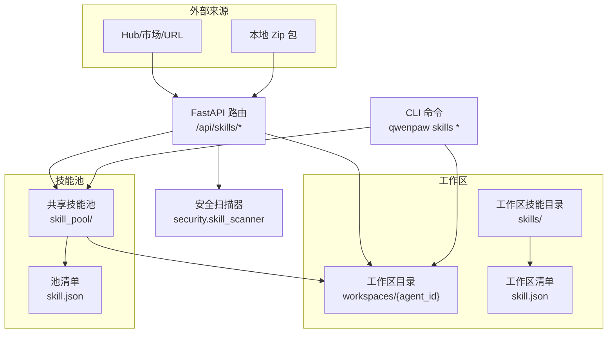
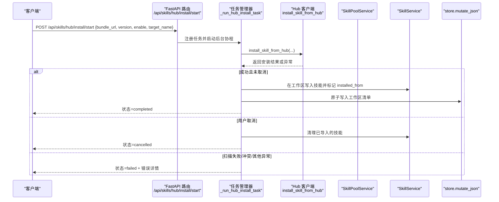
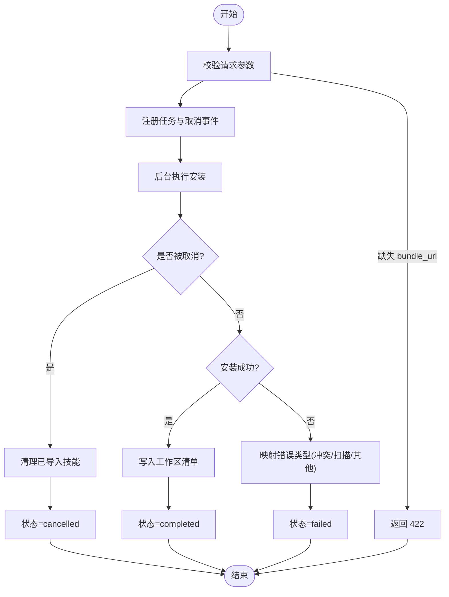
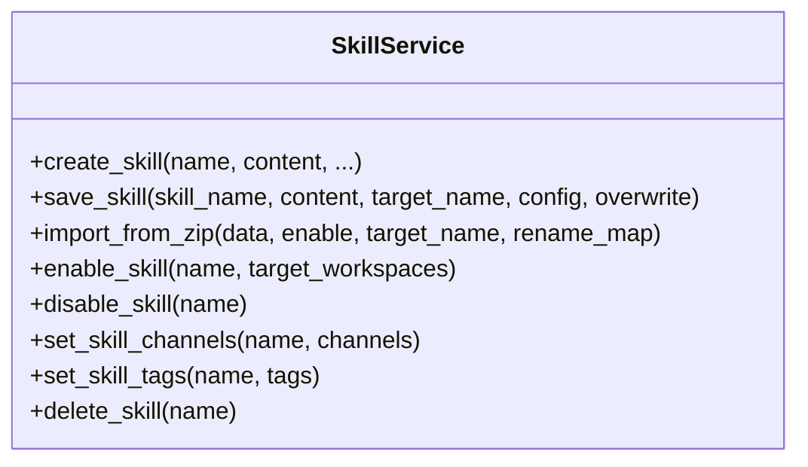
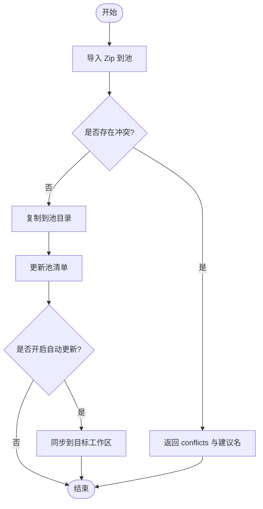
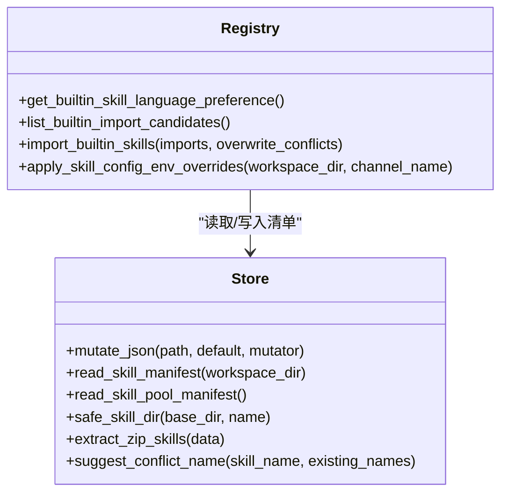
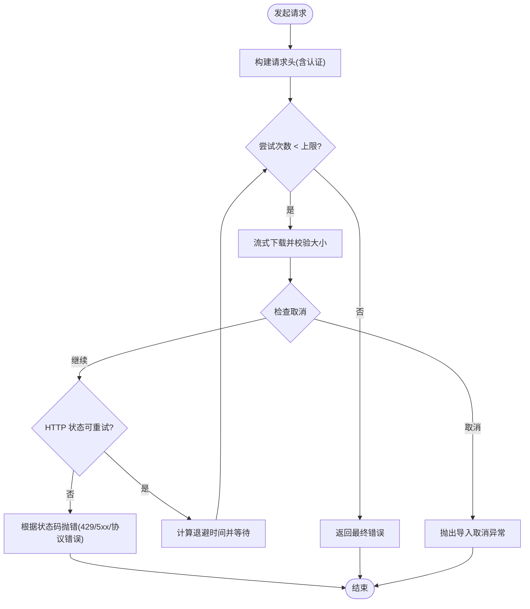
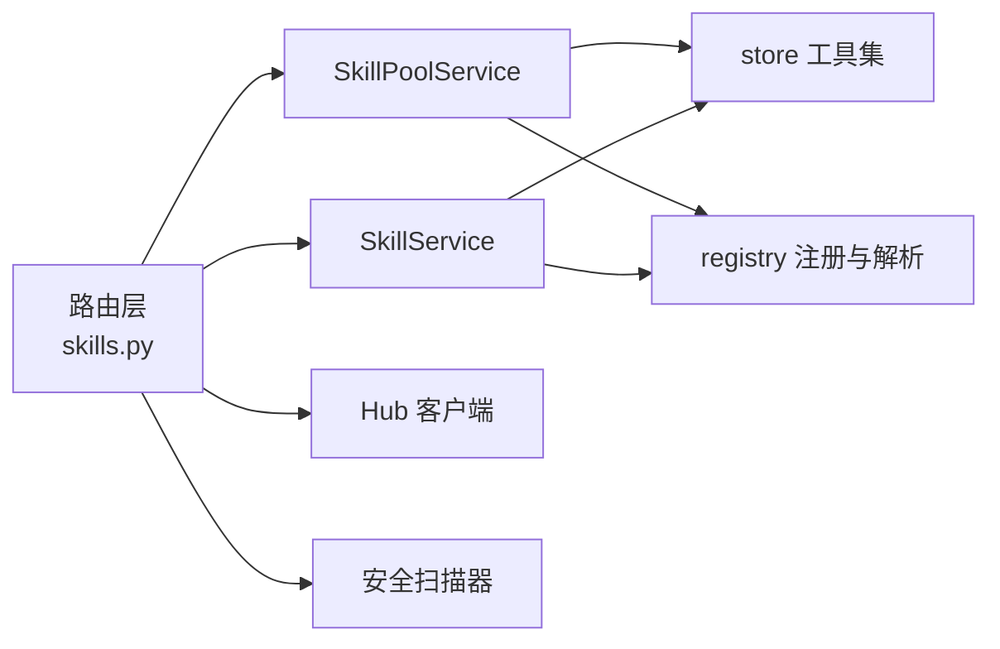

# 技能安装与管理

<cite>
**本文引用的文件**   
- [skills.py](file://src/qwenpaw/app/routers/skills.py)
- [hub.py](file://src/qwenpaw/agents/skill_system/hub.py)
- [pool_service.py](file://src/qwenpaw/agents/skill_system/pool_service.py)
- [workspace_service.py](file://src/qwenpaw/agents/skill_system/workspace_service.py)
- [registry.py](file://src/qwenpaw/agents/skill_system/registry.py)
- [store.py](file://src/qwenpaw/agents/skill_system/store.py)
- [models.py](file://src/qwenpaw/agents/skill_system/models.py)
- [skills_cmd.py](file://src/qwenpaw/cli/skills_cmd.py)
- [__init__.py](file://src/qwenpaw/agents/skill_system/__init__.py)
- [config.py](file://src/qwenpaw/config/config.py)
- [test_skills_router.py](file://tests/unit/app/routers/test_skills_router.py)
- [test_skills_agent_scoped.py](file://tests/integration/test_skills_agent_scoped.py)
- [skills.zh.md](file://website/public/docs/skills.zh.md)
</cite>

## 目录
1. [简介](#简介)
2. [项目结构](#项目结构)
3. [核心组件](#核心组件)
4. [架构总览](#架构总览)
5. [详细组件分析](#详细组件分析)
6. [依赖关系分析](#依赖关系分析)
7. [性能与并发特性](#性能与并发特性)
8. [故障排查指南](#故障排查指南)
9. [结论](#结论)
10. [附录：API 与配置参考](#附录api-与配置参考)

## 简介
本文件系统性梳理 QwenPaw 的“技能安装与管理”能力，覆盖以下关键主题：
- 技能安装流程（从 Hub/URL、Zip 导入、工作区创建、到池化与同步）
- 冲突检测与版本管理（重名处理、内置语言选择、自动更新）
- 安装接口与任务生命周期（异步安装、取消、状态查询）
- 依赖解析与安全验证（前置校验、安全扫描、白名单）
- 安装配置选项、权限控制与回滚机制
- 与技能池和工作空间的同步关系
- 错误处理与恢复策略

文档既适合初学者快速上手，也为有经验的开发者提供深入的技术细节与源码定位。

## 项目结构
QwenPaw 的技能系统围绕“共享技能池 + 工作区副本”的双层模型组织：
- 共享技能池：位于 WORKING_DIR/skill_pool，用于跨工作区复用与集中管理
- 工作区副本：位于 WORKING_DIR/workspaces/{agent_id}/skills，是运行时实际使用的本地副本

图示来源
- [skills.py:706-800](file://src/qwenpaw/app/routers/skills.py#L706-L800)
- [pool_service.py:121-145](file://src/qwenpaw/agents/skill_system/pool_service.py#L121-L145)
- [workspace_service.py:88-110](file://src/qwenpaw/agents/skill_system/workspace_service.py#L88-L110)
- [store.py:58-103](file://src/qwenpaw/agents/skill_system/store.py#L58-L103)

章节来源
- [skills.zh.md:19-47](file://website/public/docs/skills.zh.md#L19-L47)
- [store.py:58-103](file://src/qwenpaw/agents/skill_system/store.py#L58-L103)

## 核心组件
- 路由层（API）：暴露工作区与技能池的管理接口，封装安装任务生命周期、搜索、列表、保存、上传等
- 服务层：
  - SkillPoolService：共享技能池的创建、导入、删除、标签、自动更新、重命名与工作区迁移
  - SkillService：工作区维度的技能 CRUD、启用/禁用、频道范围、配置、Zip 导入
- 注册与解析：
  - registry：内置技能发现、语言偏好、环境注入、工作区/池清单协调
  - store：路径与清单读写、原子写入、锁、冲突建议、内容校验
- Hub 客户端：网络请求、重试退避、取消检查、Bundle 归一化、版本提示
- CLI：交互式配置、安装/卸载、测试、信息查看

章节来源
- [__init__.py:1-46](file://src/qwenpaw/agents/skill_system/__init__.py#L1-L46)
- [skills.py:706-800](file://src/qwenpaw/app/routers/skills.py#L706-L800)
- [pool_service.py:121-145](file://src/qwenpaw/agents/skill_system/pool_service.py#L121-L145)
- [workspace_service.py:88-110](file://src/qwenpaw/agents/skill_system/workspace_service.py#L88-L110)
- [registry.py:1-60](file://src/qwenpaw/agents/skill_system/registry.py#L1-L60)
- [store.py:384-395](file://src/qwenpaw/agents/skill_system/store.py#L384-L395)
- [hub.py:375-604](file://src/qwenpaw/agents/skill_system/hub.py#L375-L604)

## 架构总览
下图展示一次“从 Hub 安装到工作区”的端到端调用链，包括任务注册、后台执行、取消与回滚。

图示来源
- [skills.py:757-800](file://src/qwenpaw/app/routers/skills.py#L757-L800)
- [skills.py:507-589](file://src/qwenpaw/app/routers/skills.py#L507-L589)
- [hub.py:1-800](file://src/qwenpaw/agents/skill_system/hub.py#L1-L800)
- [workspace_service.py:444-553](file://src/qwenpaw/agents/skill_system/workspace_service.py#L444-L553)
- [store.py:384-395](file://src/qwenpaw/agents/skill_system/store.py#L384-L395)

## 详细组件分析

### 组件 A：Hub 安装与任务生命周期
- 入口：POST /api/skills/hub/install/start
- 行为：
  - 生成任务 ID，注册任务与取消事件
  - 后台运行 _run_hub_install_task，调用 install_skill_from_hub
  - 支持取消：通过 threading.Event 触发，若已导入则回滚
  - 状态查询：GET /api/skills/hub/install/status/{task_id}
  - 取消接口：POST /api/skills/hub/install/cancel/{task_id}
- 错误映射：
  - 冲突 -> failed + detail.reason="conflict"
  - 安全扫描失败 -> failed + scan 详情
  - 参数缺失 -> 422

图示来源
- [skills.py:757-800](file://src/qwenpaw/app/routers/skills.py#L757-L800)
- [skills.py:507-589](file://src/qwenpaw/app/routers/skills.py#L507-L589)
- [test_skills_router.py:158-249](file://tests/unit/app/routers/test_skills_router.py#L158-L249)

章节来源
- [skills.py:757-800](file://src/qwenpaw/app/routers/skills.py#L757-L800)
- [skills.py:507-589](file://src/qwenpaw/app/routers/skills.py#L507-L589)
- [test_skills_router.py:158-249](file://tests/unit/app/routers/test_skills_router.py#L158-L249)

### 组件 B：工作区技能服务（SkillService）
- 职责：工作区维度的技能生命周期管理（创建、保存/重命名、Zip 导入、启用/禁用、频道范围、配置、删除）
- 关键点：
  - 创建/保存使用暂存目录 + 安全扫描 + 原子写入清单
  - 重命名时检测冲突并提供建议名称
  - 导入 Zip 时进行批量冲突检测与可选启用
  - 删除前确保未启用（如启用则先禁用）

图示来源
- [workspace_service.py:145-227](file://src/qwenpaw/agents/skill_system/workspace_service.py#L145-L227)
- [workspace_service.py:229-284](file://src/qwenpaw/agents/skill_system/workspace_service.py#L229-L284)
- [workspace_service.py:444-553](file://src/qwenpaw/agents/skill_system/workspace_service.py#L444-L553)
- [workspace_service.py:554-652](file://src/qwenpaw/agents/skill_system/workspace_service.py#L554-L652)
- [workspace_service.py:709-749](file://src/qwenpaw/agents/skill_system/workspace_service.py#L709-L749)

章节来源
- [workspace_service.py:145-227](file://src/qwenpaw/agents/skill_system/workspace_service.py#L145-L227)
- [workspace_service.py:229-284](file://src/qwenpaw/agents/skill_system/workspace_service.py#L229-L284)
- [workspace_service.py:444-553](file://src/qwenpaw/agents/skill_system/workspace_service.py#L444-L553)
- [workspace_service.py:554-652](file://src/qwenpaw/agents/skill_system/workspace_service.py#L554-L652)
- [workspace_service.py:709-749](file://src/qwenpaw/agents/skill_system/workspace_service.py#L709-L749)

### 组件 C：技能池服务（SkillPoolService）
- 职责：共享技能池的创建、Zip 导入、删除、标签、自动更新、重命名与工作区迁移
- 关键点：
  - 导入 Zip 时进行批量冲突检测，返回 conflicts 列表与建议名称
  - 自动更新开关可指定目标工作区；开启后即时同步
  - 重命名时自动迁移关联工作区的副本（按 auto_update_targets 过滤）

图示来源
- [pool_service.py:237-352](file://src/qwenpaw/agents/skill_system/pool_service.py#L237-L352)
- [pool_service.py:417-459](file://src/qwenpaw/agents/skill_system/pool_service.py#L417-L459)
- [pool_service.py:617-682](file://src/qwenpaw/agents/skill_system/pool_service.py#L617-L682)
- [pool_service.py:684-789](file://src/qwenpaw/agents/skill_system/pool_service.py#L684-L789)

章节来源
- [pool_service.py:237-352](file://src/qwenpaw/agents/skill_system/pool_service.py#L237-L352)
- [pool_service.py:417-459](file://src/qwenpaw/agents/skill_system/pool_service.py#L417-L459)
- [pool_service.py:617-682](file://src/qwenpaw/agents/skill_system/pool_service.py#L617-L682)
- [pool_service.py:684-789](file://src/qwenpaw/agents/skill_system/pool_service.py#L684-L789)

### 组件 D：注册与解析（Registry & Store）
- 内置技能语言偏好与变体选择
- 清单协调（reconcile_*）与有效技能解析（resolve_effective_skills）
- 原子写入与跨进程锁（mutate_json/_file_write_lock）
- 冲突建议（suggest_conflict_name）、安全路径与 Zip 校验

图示来源
- [registry.py:80-117](file://src/qwenpaw/agents/skill_system/registry.py#L80-L117)
- [registry.py:662-800](file://src/qwenpaw/agents/skill_system/registry.py#L662-L800)
- [registry.py:347-392](file://src/qwenpaw/agents/skill_system/registry.py#L347-L392)
- [store.py:384-395](file://src/qwenpaw/agents/skill_system/store.py#L384-L395)
- [store.py:671-692](file://src/qwenpaw/agents/skill_system/store.py#L671-L692)
- [store.py:482-503](file://src/qwenpaw/agents/skill_system/store.py#L482-L503)

章节来源
- [registry.py:80-117](file://src/qwenpaw/agents/skill_system/registry.py#L80-L117)
- [registry.py:662-800](file://src/qwenpaw/agents/skill_system/registry.py#L662-L800)
- [registry.py:347-392](file://src/qwenpaw/agents/skill_system/registry.py#L347-L392)
- [store.py:384-395](file://src/qwenpaw/agents/skill_system/store.py#L384-L395)
- [store.py:671-692](file://src/qwenpaw/agents/skill_system/store.py#L671-L692)
- [store.py:482-503](file://src/qwenpaw/agents/skill_system/store.py#L482-L503)

### 组件 E：Hub 客户端（网络与重试）
- 统一 httpx 异步客户端、超时与连接池
- 指数退避重试、可配置最大字节限制、取消钩子
- GitHub 响应缓存与速率限制友好处理
- Bundle 归一化与版本提示提取

图示来源
- [hub.py:375-604](file://src/qwenpaw/agents/skill_system/hub.py#L375-L604)
- [hub.py:428-466](file://src/qwenpaw/agents/skill_system/hub.py#L428-L466)
- [hub.py:290-311](file://src/qwenpaw/agents/skill_system/hub.py#L290-L311)

章节来源
- [hub.py:375-604](file://src/qwenpaw/agents/skill_system/hub.py#L375-L604)
- [hub.py:428-466](file://src/qwenpaw/agents/skill_system/hub.py#L428-L466)
- [hub.py:290-311](file://src/qwenpaw/agents/skill_system/hub.py#L290-L311)

### 组件 F：CLI 技能管理
- 列出、交互式配置、安装/卸载、测试
- 安装支持直接到工作区或导入到池
- 冲突与安全扫描错误以友好的 CLI 消息呈现

章节来源
- [skills_cmd.py:417-480](file://src/qwenpaw/cli/skills_cmd.py#L417-L480)
- [skills_cmd.py:482-557](file://src/qwenpaw/cli/skills_cmd.py#L482-L557)
- [skills_cmd.py:559-572](file://src/qwenpaw/cli/skills_cmd.py#L559-L572)

## 依赖关系分析
- API 路由依赖服务层（SkillPoolService/SkillService），并通过 store 进行清单原子写入
- Hub 客户端为所有网络相关操作提供统一 HTTP 能力
- 注册模块负责内置技能发现、语言偏好与环境变量注入
- 安全扫描在导入/启用/保存等关键路径被调用

图示来源
- [skills.py:706-800](file://src/qwenpaw/app/routers/skills.py#L706-L800)
- [pool_service.py:121-145](file://src/qwenpaw/agents/skill_system/pool_service.py#L121-L145)
- [workspace_service.py:88-110](file://src/qwenpaw/agents/skill_system/workspace_service.py#L88-L110)
- [registry.py:1-60](file://src/qwenpaw/agents/skill_system/registry.py#L1-L60)
- [store.py:384-395](file://src/qwenpaw/agents/skill_system/store.py#L384-L395)

章节来源
- [skills.py:706-800](file://src/qwenpaw/app/routers/skills.py#L706-L800)
- [pool_service.py:121-145](file://src/qwenpaw/agents/skill_system/pool_service.py#L121-L145)
- [workspace_service.py:88-110](file://src/qwenpaw/agents/skill_system/workspace_service.py#L88-L110)
- [registry.py:1-60](file://src/qwenpaw/agents/skill_system/registry.py#L1-L60)
- [store.py:384-395](file://src/qwenpaw/agents/skill_system/store.py#L384-L395)

## 性能与并发特性
- 并发安装任务：路由层维护任务字典与运行时任务表，支持并行查询状态与取消
- 网络层：
  - 共享 httpx.AsyncClient，带连接池与重试
  - GitHub 响应缓存与键级锁避免“惊群效应”
  - 指数退避与可配置超时/重试次数
- 文件系统：
  - 清单写入采用原子替换与跨进程文件锁
  - 暂存目录 + 安全扫描后再落盘，降低脏写风险

[本节为通用性能讨论，不直接分析具体文件]

## 故障排查指南
- 常见错误与定位
  - 422 参数缺失：检查 bundle_url 是否提供
  - 409 冲突：重名导致，使用建议名称或设置 overwrite
  - 404 不存在：技能或任务 ID 不存在
  - 安全扫描失败：查看扫描结果中的 severity 与 findings
- 恢复策略
  - 取消安装：调用 cancel 接口，系统会清理已导入的技能
  - 回滚机制：安装失败时保留快照并在必要时恢复清单与文件
  - 清单损坏：mutate_json 会在 JSON 解析失败时回退默认值并记录日志

章节来源
- [test_skills_router.py:224-249](file://tests/unit/app/routers/test_skills_router.py#L224-L249)
- [test_skills_agent_scoped.py:530-562](file://tests/integration/test_skills_agent_scoped.py#L530-L562)
- [skills.py:407-434](file://src/qwenpaw/app/routers/skills.py#L407-L434)
- [store.py:344-357](file://src/qwenpaw/agents/skill_system/store.py#L344-L357)

## 结论
QwenPaw 的技能安装与管理体系以“共享池 + 工作区副本”为核心，结合稳健的网络层、原子清单写入、安全扫描与完善的冲突/回滚机制，提供了高可用、可扩展的技能生态管理能力。通过清晰的 API 与 CLI 入口，用户可在控制台、命令行与自动化脚本中高效完成技能的安装、配置与同步。

[本节为总结性内容，不直接分析具体文件]

## 附录：API 与配置参考

### 安装接口概览
- 工作区技能
  - GET /api/skills — 列出当前工作区技能
  - POST /api/skills — 创建工作区技能
  - PUT /api/skills/save — 保存/重命名工作区技能
  - POST /api/skills/upload — 上传 Zip 到工作区
  - PUT /api/skills/{name}/channels — 设置频道范围
  - PUT /api/skills/{name}/config — 设置配置
  - DELETE /api/skills/{name}/config — 清空配置
- 技能池
  - GET /api/skills/pool — 列出池技能
  - POST /api/skills/pool/import — 从 Zip 导入到池
  - PUT /api/skills/pool/save — 保存/重命名池技能
  - PUT /api/skills/pool/{name}/auto-update — 开启/关闭自动更新
- Hub 安装任务
  - POST /api/skills/hub/install/start — 开始安装
  - GET /api/skills/hub/install/status/{id} — 查询状态
  - POST /api/skills/hub/install/cancel/{id} — 取消安装

章节来源
- [skills.py:706-800](file://src/qwenpaw/app/routers/skills.py#L706-L800)
- [test_skills_agent_scoped.py:747-830](file://tests/integration/test_skills_agent_scoped.py#L747-L830)

### 安装配置选项
- 环境变量（示例）
  - QWENPAW_SKILLS_HUB_BASE_URL — Hub 基础地址
  - QWENPAW_SKILLS_HUB_HTTP_TIMEOUT — 请求超时
  - QWENPAW_SKILLS_HUB_HTTP_RETRIES — 重试次数
  - QWENPAW_SKILLS_HUB_HTTP_BACKOFF_BASE/CAP — 退避参数
  - QWENPAW_GITHUB_CACHE_TTL — GitHub 缓存 TTL
- 安全扫描配置
  - security.skill_scanner.mode: block/warn/off
  - security.skill_scanner.timeout: 秒
  - security.skill_scanner.whitelist: 白名单条目（名称+内容哈希）

章节来源
- [hub.py:142-188](file://src/qwenpaw/agents/skill_system/hub.py#L142-L188)
- [config.py:2030-2071](file://src/qwenpaw/config/config.py#L2030-L2071)

### 与技能池与工作空间的同步关系
- 自动同步：当池技能内容变化时，可按配置将变更推送到相关工作区
- 变更检测：基于 SKILL.md 内容哈希
- 通知：每次自动同步会在收件箱推送汇总消息

章节来源
- [skills.py:81-148](file://src/qwenpaw/app/routers/skills.py#L81-L148)
- [skills.zh.md:311-338](file://website/public/docs/skills.zh.md#L311-L338)