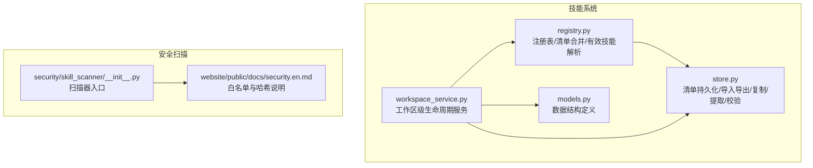
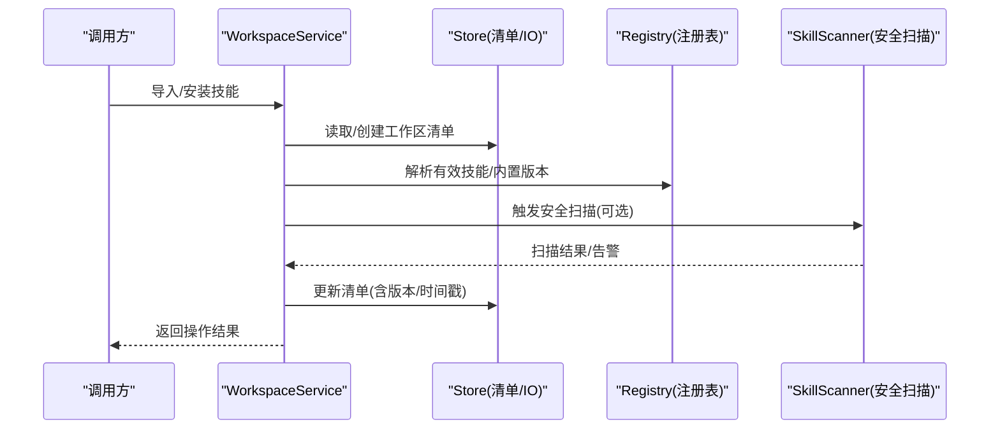
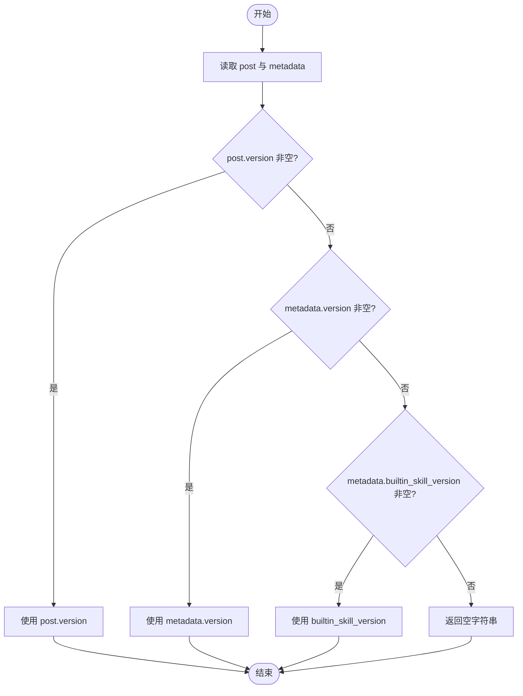
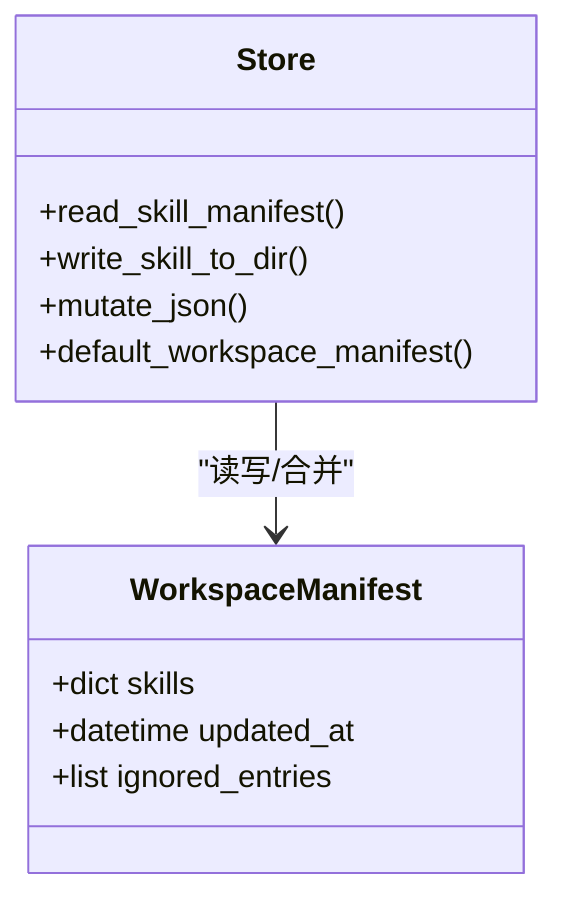
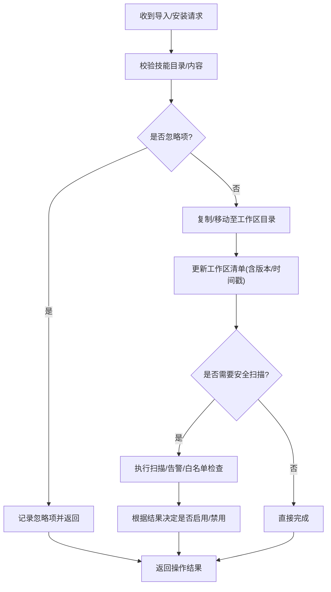
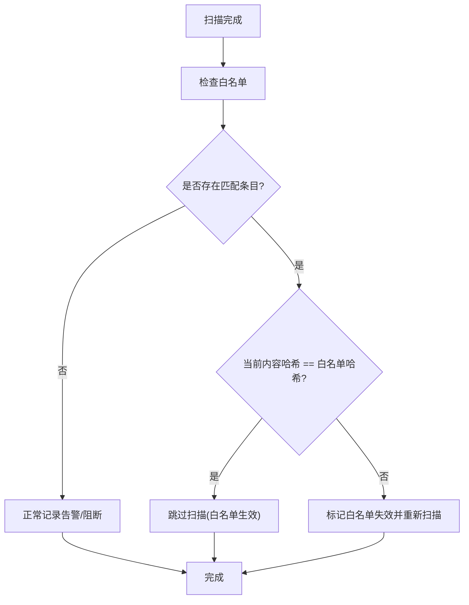
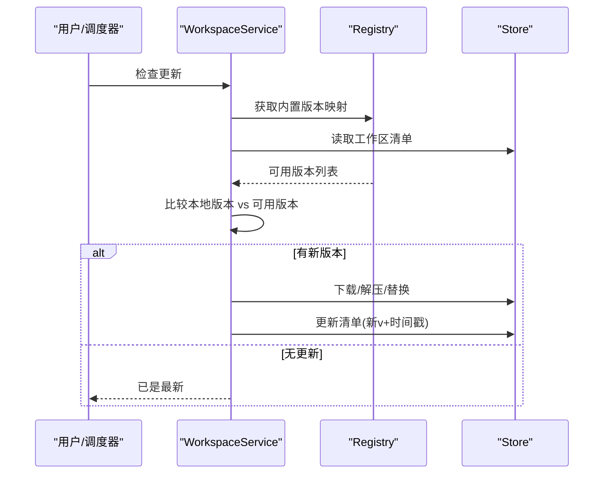
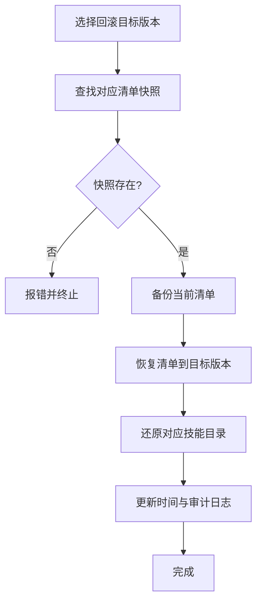
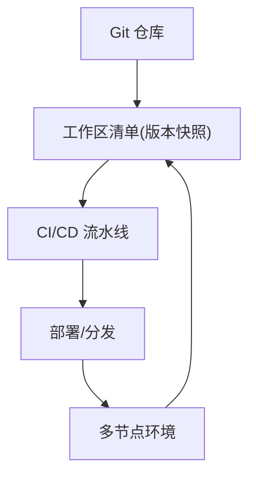
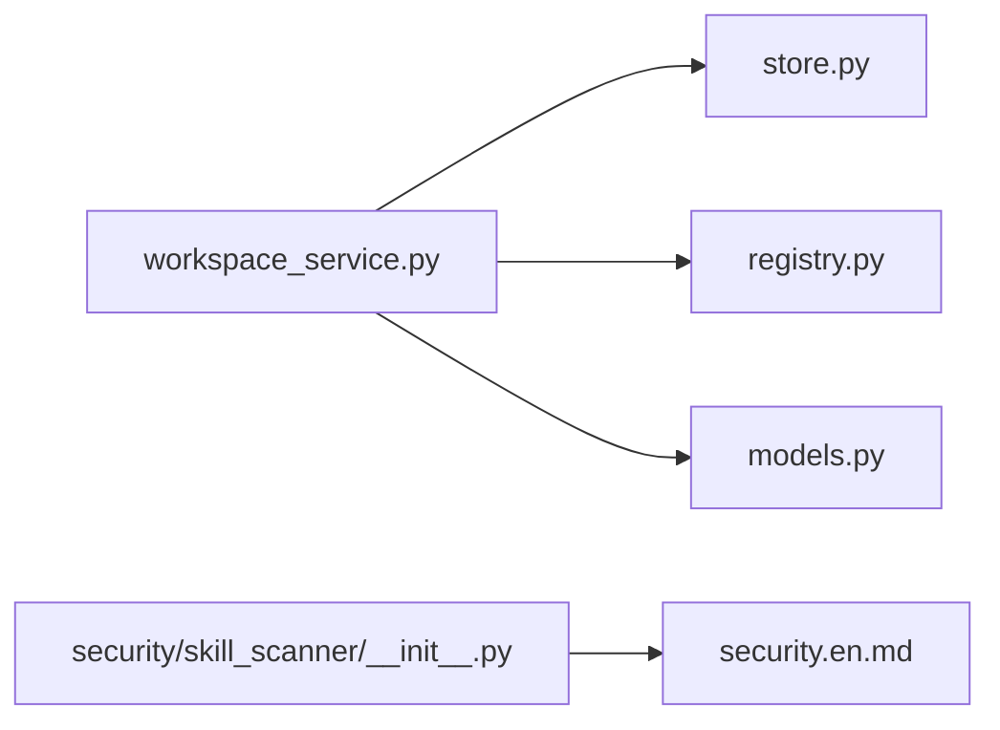

# 版本控制

<cite>
**本文引用的文件**   
- [src/qwenpaw/agents/skill_system/store.py](file://src/qwenpaw/agents/skill_system/store.py)
- [src/qwenpaw/agents/skill_system/workspace_service.py](file://src/qwenpaw/agents/skill_system/workspace_service.py)
- [src/qwenpaw/agents/skill_system/registry.py](file://src/qwenpaw/agents/skill_system/registry.py)
- [src/qwenpaw/agents/skill_system/models.py](file://src/qwenpaw/agents/skill_system/models.py)
- [src/qwenpaw/security/skill_scanner/__init__.py](file://src/qwenpaw/security/skill_scanner/__init__.py)
- [website/public/docs/security.en.md](file://website/public/docs/security.en.md)
</cite>

## 目录
1. [引言](#引言)
2. [项目结构](#项目结构)
3. [核心组件](#核心组件)
4. [架构总览](#架构总览)
5. [详细组件分析](#详细组件分析)
6. [依赖关系分析](#依赖关系分析)
7. [性能考虑](#性能考虑)
8. [故障排查指南](#故障排查指南)
9. [结论](#结论)
10. [附录](#附录)

## 引言
本章节面向 QwenPaw 的技能版本控制系统，系统性阐述技能版本管理机制、哈希计算与变更检测算法、版本比较与增量更新、回滚策略、元数据管理与时间戳跟踪、以及与 Git 集成和分布式版本控制的关联。文档同时提供来自实际代码库的接口与流程说明，帮助初学者快速上手，并为有经验的开发者提供深入的技术细节。

## 项目结构
QwenPaw 的技能版本控制相关能力主要分布在 agents/skill_system 与 security/skill_scanner 两个模块中：
- skill_system 负责技能的注册、解析、工作区级生命周期管理、清单（manifest）持久化与冲突处理等。
- security/skill_scanner 负责安全扫描与白名单机制，其中白名单基于内容哈希校验实现“版本锁定”语义。

**图表来源** 
- [src/qwenpaw/agents/skill_system/registry.py](file://src/qwenpaw/agents/skill_system/registry.py)
- [src/qwenpaw/agents/skill_system/store.py](file://src/qwenpaw/agents/skill_system/store.py)
- [src/qwenpaw/agents/skill_system/workspace_service.py](file://src/qwenpaw/agents/skill_system/workspace_service.py)
- [src/qwenpaw/agents/skill_system/models.py](file://src/qwenpaw/agents/skill_system/models.py)
- [src/qwenpaw/security/skill_scanner/__init__.py](file://src/qwenpaw/security/skill_scanner/__init__.py)
- [website/public/docs/security.en.md](file://website/public/docs/security.en.md)

**章节来源**
- [src/qwenpaw/agents/skill_system/store.py](file://src/qwenpaw/agents/skill_system/store.py)
- [src/qwenpaw/agents/skill_system/workspace_service.py](file://src/qwenpaw/agents/skill_system/workspace_service.py)
- [src/qwenpaw/agents/skill_system/registry.py](file://src/qwenpaw/agents/skill_system/registry.py)
- [src/qwenpaw/agents/skill_system/models.py](file://src/qwenpaw/agents/skill_system/models.py)
- [src/qwenpaw/security/skill_scanner/__init__.py](file://src/qwenpaw/security/skill_scanner/__init__.py)
- [website/public/docs/security.en.md](file://website/public/docs/security.en.md)

## 核心组件
- 版本提取与元数据
  - 版本字段优先顺序：post.version → metadata.version → metadata.builtin_skill_version；任一非空即视为版本标识。
  - 参考路径：[extract_version:267-278](file://src/qwenpaw/agents/skill_system/store.py#L267-L278)
- 清单与持久化
  - 工作区清单默认值、读写、跨进程 JSON 锁与原子写入。
  - 参考路径：[default_workspace_manifest:317-380](file://src/qwenpaw/agents/skill_system/store.py#L317-L380)
- 工作区级生命周期
  - 安装/导入/复制/重命名/冲突建议/忽略项/安全扫描触发等。
  - 参考路径：[workspace_service.py:1-38](file://src/qwenpaw/agents/skill_system/workspace_service.py#L1-L38)
- 注册表与有效技能解析
  - 内置包版本获取、工作区清单协调、有效技能集合解析。
  - 参考路径：[registry.py](file://src/qwenpaw/agents/skill_system/registry.py)
- 安全扫描与白名单（版本锁定）
  - 白名单条目包含技能名、SHA-256 内容哈希（所有技能文件内容计算）、添加时间戳；任何文件变更导致哈希变化，白名单失效并重新扫描。
  - 参考路径：[security.en.md:567-637](file://website/public/docs/security.en.md#L567-L637)

**章节来源**
- [src/qwenpaw/agents/skill_system/store.py:267-278](file://src/qwenpaw/agents/skill_system/store.py#L267-L278)
- [src/qwenpaw/agents/skill_system/store.py:317-380](file://src/qwenpaw/agents/skill_system/store.py#L317-L380)
- [src/qwenpaw/agents/skill_system/workspace_service.py:1-38](file://src/qwenpaw/agents/skill_system/workspace_service.py#L1-L38)
- [src/qwenpaw/agents/skill_system/registry.py](file://src/qwenpaw/agents/skill_system/registry.py)
- [website/public/docs/security.en.md:567-637](file://website/public/docs/security.en.md#L567-L637)

## 架构总览
技能版本控制由“清单驱动 + 安全校验 + 工作区生命周期”三部分协同完成：
- 清单驱动：通过工作区清单记录已安装/启用/忽略的技能及其版本信息，作为版本比较与同步的依据。
- 安全校验：对技能进行安全扫描，支持白名单跳过；白名单以 SHA-256 内容哈希为锚点，实现“版本锁定”。
- 工作区生命周期：在导入、安装、复制、重命名等操作时，自动更新清单、触发扫描、处理冲突与建议名称。

**图表来源** 
- [src/qwenpaw/agents/skill_system/workspace_service.py](file://src/qwenpaw/agents/skill_system/workspace_service.py)
- [src/qwenpaw/agents/skill_system/store.py](file://src/qwenpaw/agents/skill_system/store.py)
- [src/qwenpaw/agents/skill_system/registry.py](file://src/qwenpaw/agents/skill_system/registry.py)
- [src/qwenpaw/security/skill_scanner/__init__.py](file://src/qwenpaw/security/skill_scanner/__init__.py)

## 详细组件分析

### 版本提取与元数据管理
- 版本优先级：post.version > metadata.version > metadata.builtin_skill_version；若均为空则视为未标记版本。
- 元数据字段：version、builtin_skill_version、metadata.* 均可参与版本识别。
- 时间戳：工作区清单与白名单均维护添加时间戳，用于审计与回溯。

**图表来源** 
- [src/qwenpaw/agents/skill_system/store.py:267-278](file://src/qwenpaw/agents/skill_system/store.py#L267-L278)

**章节来源**
- [src/qwenpaw/agents/skill_system/store.py:267-278](file://src/qwenpaw/agents/skill_system/store.py#L267-L278)

### 清单与持久化（版本快照）
- 默认清单：提供工作区清单的默认结构与初始状态。
- 跨进程 JSON 锁与原子 I/O：确保并发场景下清单一致性。
- 版本快照：清单中保存每个技能的版本信息与时间戳，作为后续比较与回滚依据。

**图表来源** 
- [src/qwenpaw/agents/skill_system/store.py:317-380](file://src/qwenpaw/agents/skill_system/store.py#L317-L380)

**章节来源**
- [src/qwenpaw/agents/skill_system/store.py:317-380](file://src/qwenpaw/agents/skill_system/store.py#L317-L380)

### 工作区级生命周期（安装/导入/复制/重命名）
- 导入/安装：将技能目录复制到工作区，更新清单，必要时触发安全扫描。
- 复制：按平台过滤已知缓存/系统文件，保留用户 dotfiles，保证一致行为。
- 重命名/冲突：生成冲突提示与建议名称，避免覆盖已有技能。
- 忽略项：支持忽略特定技能条目，不参与有效技能解析。

**图表来源** 
- [src/qwenpaw/agents/skill_system/workspace_service.py:1-38](file://src/qwenpaw/agents/skill_system/workspace_service.py#L1-L38)
- [src/qwenpaw/agents/skill_system/store.py:295-312](file://src/qwenpaw/agents/skill_system/store.py#L295-L312)

**章节来源**
- [src/qwenpaw/agents/skill_system/workspace_service.py:1-38](file://src/qwenpaw/agents/skill_system/workspace_service.py#L1-L38)
- [src/qwenpaw/agents/skill_system/store.py:295-312](file://src/qwenpaw/agents/skill_system/store.py#L295-L312)

### 安全扫描与白名单（版本锁定）
- 白名单机制：每条白名单包含技能名、SHA-256 内容哈希（所有技能文件内容计算）、添加时间戳。
- 版本锁定：一旦任意技能文件变更，内容哈希变化，白名单条目失效，系统将重新扫描该技能。
- 控制台管理：可在设置界面查看告警、添加/删除白名单、批量清理等。

**图表来源** 
- [website/public/docs/security.en.md:567-637](file://website/public/docs/security.en.md#L567-L637)

**章节来源**
- [website/public/docs/security.en.md:567-637](file://website/public/docs/security.en.md#L567-L637)

### 版本比较与增量更新
- 版本比较：基于清单中的版本字段与内置包版本映射，判断本地版本与可用版本差异。
- 增量更新：当检测到新版本时，优先下载增量包或完整包，替换目标目录后更新清单与时间戳。
- 冲突处理：若存在同名技能且版本不一致，提供冲突提示与解决建议（如保留旧版/覆盖/重命名）。

**图表来源** 
- [src/qwenpaw/agents/skill_system/registry.py](file://src/qwenpaw/agents/skill_system/registry.py)
- [src/qwenpaw/agents/skill_system/store.py](file://src/qwenpaw/agents/skill_system/store.py)
- [src/qwenpaw/agents/skill_system/workspace_service.py](file://src/qwenpaw/agents/skill_system/workspace_service.py)

**章节来源**
- [src/qwenpaw/agents/skill_system/registry.py](file://src/qwenpaw/agents/skill_system/registry.py)
- [src/qwenpaw/agents/skill_system/store.py](file://src/qwenpaw/agents/skill_system/store.py)
- [src/qwenpaw/agents/skill_system/workspace_service.py](file://src/qwenpaw/agents/skill_system/workspace_service.py)

### 回滚策略
- 回滚目标：恢复到指定版本的清单快照与对应技能目录。
- 操作步骤：定位历史清单快照 → 恢复清单 → 还原对应版本目录 → 更新时间戳与审计日志。
- 注意事项：回滚前需确认依赖与兼容性，避免破坏现有工作流。

**图表来源** 
- [src/qwenpaw/agents/skill_system/store.py](file://src/qwenpaw/agents/skill_system/store.py)
- [src/qwenpaw/agents/skill_system/workspace_service.py](file://src/qwenpaw/agents/skill_system/workspace_service.py)

**章节来源**
- [src/qwenpaw/agents/skill_system/store.py](file://src/qwenpaw/agents/skill_system/store.py)
- [src/qwenpaw/agents/skill_system/workspace_service.py](file://src/qwenpaw/agents/skill_system/workspace_service.py)

### 与 Git 集成与分布式版本控制
- 清单作为版本锚点：工作区清单记录了每个技能的版本与时间戳，可作为 Git 提交时的稳定快照。
- 变更检测：结合内容哈希与清单差异，可快速识别哪些技能需要重新构建或部署。
- 分布式协作：在多节点环境中，通过清单同步与冲突解决策略，确保各节点技能集一致。

**图表来源** 
- [src/qwenpaw/agents/skill_system/store.py](file://src/qwenpaw/agents/skill_system/store.py)
- [src/qwenpaw/agents/skill_system/registry.py](file://src/qwenpaw/agents/skill_system/registry.py)

**章节来源**
- [src/qwenpaw/agents/skill_system/store.py](file://src/qwenpaw/agents/skill_system/store.py)
- [src/qwenpaw/agents/skill_system/registry.py](file://src/qwenpaw/agents/skill_system/registry.py)

## 依赖关系分析
- 组件耦合
  - workspace_service 依赖 store 与 registry，负责编排生命周期与清单更新。
  - store 提供清单持久化、目录复制、JSON 原子写入等基础能力。
  - registry 提供内置版本映射与有效技能解析。
  - security/skill_scanner 与安全文档配合，实现白名单与版本锁定。
- 外部依赖
  - 文件系统与 JSON 存储。
  - 安全扫描规则与签名库（YAML 规则文件）。
  - 控制台 UI 用于配置与管理。

**图表来源** 
- [src/qwenpaw/agents/skill_system/workspace_service.py](file://src/qwenpaw/agents/skill_system/workspace_service.py)
- [src/qwenpaw/agents/skill_system/store.py](file://src/qwenpaw/agents/skill_system/store.py)
- [src/qwenpaw/agents/skill_system/registry.py](file://src/qwenpaw/agents/skill_system/registry.py)
- [src/qwenpaw/agents/skill_system/models.py](file://src/qwenpaw/agents/skill_system/models.py)
- [src/qwenpaw/security/skill_scanner/__init__.py](file://src/qwenpaw/security/skill_scanner/__init__.py)
- [website/public/docs/security.en.md](file://website/public/docs/security.en.md)

**章节来源**
- [src/qwenpaw/agents/skill_system/workspace_service.py](file://src/qwenpaw/agents/skill_system/workspace_service.py)
- [src/qwenpaw/agents/skill_system/store.py](file://src/qwenpaw/agents/skill_system/store.py)
- [src/qwenpaw/agents/skill_system/registry.py](file://src/qwenpaw/agents/skill_system/registry.py)
- [src/qwenpaw/agents/skill_system/models.py](file://src/qwenpaw/agents/skill_system/models.py)
- [src/qwenpaw/security/skill_scanner/__init__.py](file://src/qwenpaw/security/skill_scanner/__init__.py)
- [website/public/docs/security.en.md](file://website/public/docs/security.en.md)

## 性能考虑
- 清单读写采用跨进程 JSON 锁与原子写入，降低并发竞争导致的损坏风险。
- 复制目录时过滤已知缓存与系统文件，减少不必要 IO。
- 安全扫描支持超时与模式切换（Block/Warn/Off），避免长时间阻塞。
- 白名单基于内容哈希，命中后可跳过扫描，提升整体吞吐。

## 故障排查指南
- 白名单失效
  - 现象：某技能被重新扫描或禁用。
  - 原因：任意技能文件变更导致内容哈希变化，白名单条目失效。
  - 处理：更新白名单条目或修复文件一致性。
- 清单不一致
  - 现象：重复安装/覆盖异常。
  - 原因：并发写入或中断导致清单损坏。
  - 处理：使用默认清单重建、检查锁机制与重试策略。
- 冲突与覆盖
  - 现象：同名技能冲突。
  - 处理：使用建议名称或显式覆盖，并在清单中记录版本与时间戳。

**章节来源**
- [website/public/docs/security.en.md:567-637](file://website/public/docs/security.en.md#L567-L637)
- [src/qwenpaw/agents/skill_system/store.py:317-380](file://src/qwenpaw/agents/skill_system/store.py#L317-L380)
- [src/qwenpaw/agents/skill_system/workspace_service.py:1-38](file://src/qwenpaw/agents/skill_system/workspace_service.py#L1-L38)

## 结论
QwenPaw 的技能版本控制以清单为核心，结合安全扫描与白名单机制，实现了稳定的版本锁定与变更检测。通过工作区级生命周期服务，系统在导入、安装、复制、重命名等场景中自动维护版本元数据与时间戳，并提供冲突建议与回滚能力。与 Git 集成后，清单可作为稳定快照，支撑 CI/CD 与分布式环境的一致性保障。

## 附录
- 版本锁定最佳实践
  - 定期审查白名单条目，确保哈希与实际内容一致。
  - 在发布流程中将清单纳入版本标签，便于追溯。
- 自动化更新策略
  - 定时任务拉取可用版本，对比清单后执行增量更新。
  - 更新失败时自动回滚到上一份清单快照。
- 数据迁移
  - 升级清单结构时，提供迁移脚本与兼容层，确保旧清单平滑过渡。