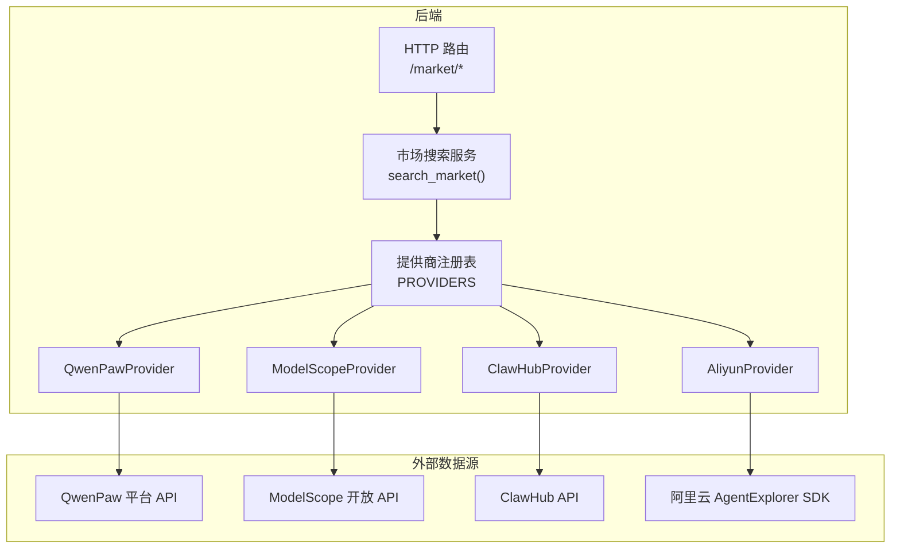
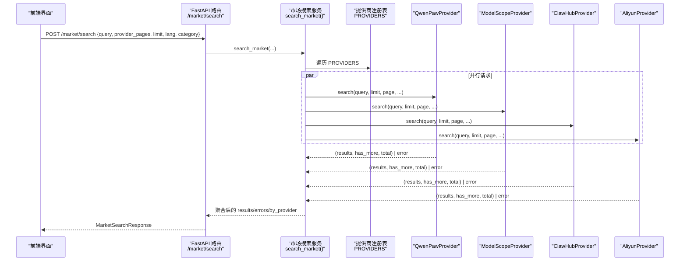
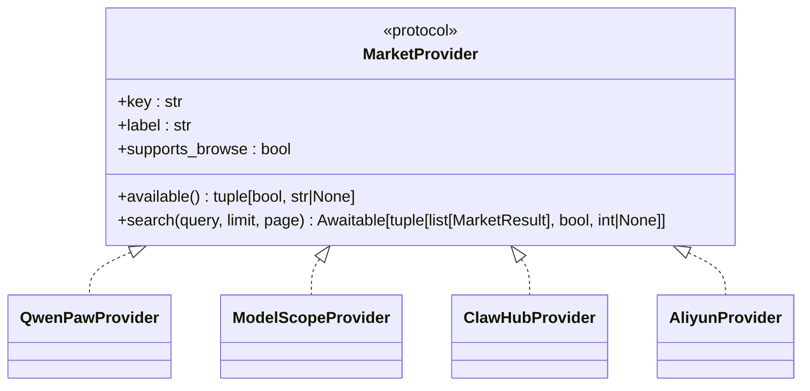
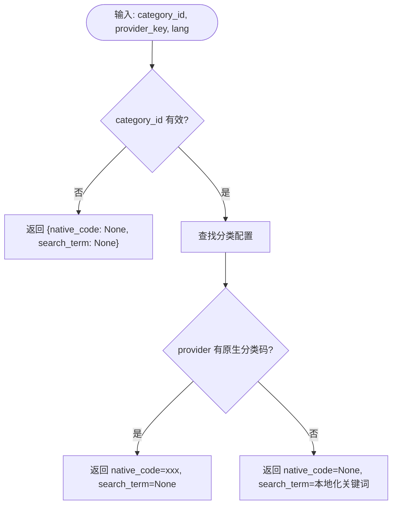
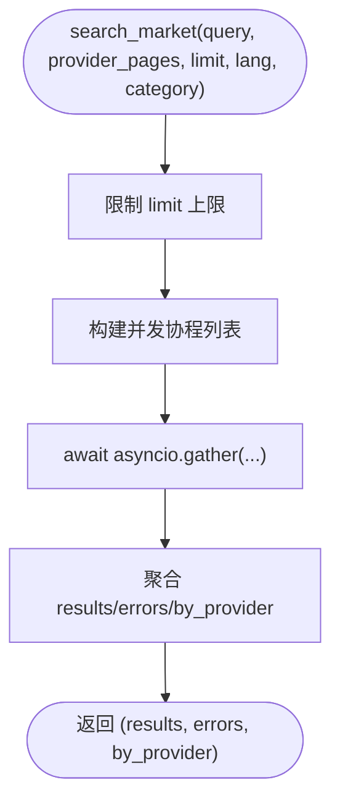
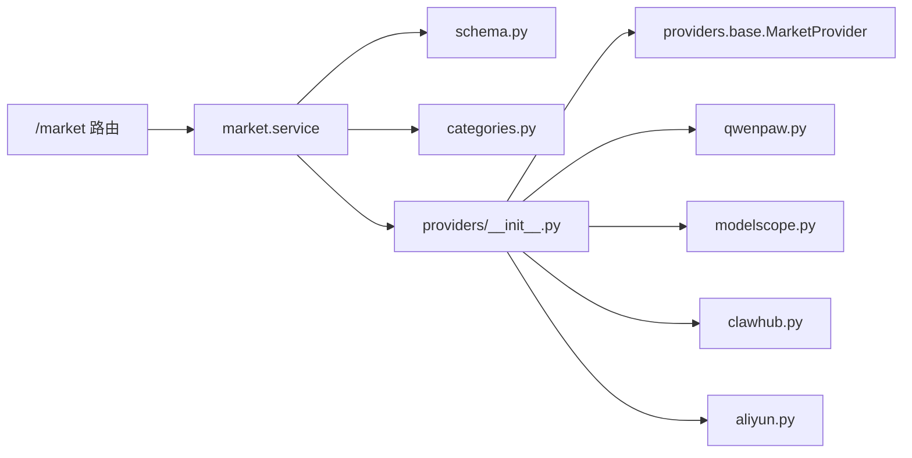

# 技能市场管理

<cite>
**本文引用的文件**   
- [src/qwenpaw/market/__init__.py](file://src/qwenpaw/market/__init__.py)
- [src/qwenpaw/market/service.py](file://src/qwenpaw/market/service.py)
- [src/qwenpaw/market/schema.py](file://src/qwenpaw/market/schema.py)
- [src/qwenpaw/market/categories.py](file://src/qwenpaw/market/categories.py)
- [src/qwenpaw/market/providers/__init__.py](file://src/qwenpaw/market/providers/__init__.py)
- [src/qwenpaw/market/providers/base.py](file://src/qwenpaw/market/providers/base.py)
- [src/qwenpaw/market/providers/qwenpaw.py](file://src/qwenpaw/market/providers/qwenpaw.py)
- [src/qwenpaw/market/providers/modelscope.py](file://src/qwenpaw/market/providers/modelscope.py)
- [src/qwenpaw/market/providers/clawhub.py](file://src/qwenpaw/market/providers/clawhub.py)
- [src/qwenpaw/market/providers/aliyun.py](file://src/qwenpaw/market/providers/aliyun.py)
- [src/qwenpaw/app/routers/market.py](file://src/qwenpaw/app/routers/market.py)
- [website/public/docs/skills.zh.md](file://website/public/docs/skills.zh.md)
</cite>

## 目录
1. [简介](#简介)
2. [项目结构](#项目结构)
3. [核心组件](#核心组件)
4. [架构总览](#架构总览)
5. [详细组件分析](#详细组件分析)
6. [依赖关系分析](#依赖关系分析)
7. [性能与可用性](#性能与可用性)
8. [故障排查指南](#故障排查指南)
9. [结论](#结论)
10. [附录：接口与协议](#附录接口与协议)

## 简介
本章节面向 QwenPaw 的“技能市场”能力，系统性阐述其架构设计、提供商集成与分发机制。内容覆盖搜索、安装、更新与版本管理的端到端流程，并给出来自代码库的具体实现路径、调用关系、接口与市场协议说明。文档兼顾初学者友好与资深开发者的技术深度。

## 项目结构
技能市场由后端服务层、HTTP 路由层与多数据源提供商组成；前端通过 HTTP 接口进行浏览与安装操作。关键目录与职责如下：
- market 模块：统一的市场搜索服务、分类映射、数据模型与提供商注册表
- app/routers/market：对外暴露 /market 系列 REST 接口
- providers：各市场数据源的适配实现（QwenPaw、ModelScope、ClawHub、Aliyun）
- website 文档：用户侧关于“技能市场”的使用说明与入口指引

图表来源
- [src/qwenpaw/app/routers/market.py:1-144](file://src/qwenpaw/app/routers/market.py#L1-L144)
- [src/qwenpaw/market/service.py:1-130](file://src/qwenpaw/market/service.py#L1-L130)
- [src/qwenpaw/market/providers/__init__.py:1-29](file://src/qwenpaw/market/providers/__init__.py#L1-L29)
- [src/qwenpaw/market/providers/qwenpaw.py:1-176](file://src/qwenpaw/market/providers/qwenpaw.py#L1-L176)
- [src/qwenpaw/market/providers/modelscope.py:1-186](file://src/qwenpaw/market/providers/modelscope.py#L1-L186)
- [src/qwenpaw/market/providers/clawhub.py:1-168](file://src/qwenpaw/market/providers/clawhub.py#L1-L168)
- [src/qwenpaw/market/providers/aliyun.py:1-320](file://src/qwenpaw/market/providers/aliyun.py#L1-L320)

章节来源
- [src/qwenpaw/market/__init__.py:1-21](file://src/qwenpaw/market/__init__.py#L1-L21)
- [src/qwenpaw/app/routers/market.py:1-144](file://src/qwenpaw/app/routers/market.py#L1-L144)
- [website/public/docs/skills.zh.md:339-365](file://website/public/docs/skills.zh.md#L339-L365)

## 核心组件
- 统一数据模型
  - MarketResult：搜索结果条目（来源、标识、名称、描述、链接、版本、作者、图标、统计等）
  - MarketSearchError：单个提供商的错误信息
  - ProviderInfo：提供商元信息与可用性
- 分类映射
  - 逻辑分类到具体提供商的“原生分类码”或“本地化检索词”的映射
- 市场搜索服务
  - list_providers：列出所有提供商及其可用性
  - search_market：并行查询多个提供商，聚合结果、错误与分页信息
- 提供商协议
  - MarketProvider：统一的可用性与搜索接口契约
- HTTP 路由
  - GET /market/providers：获取提供商列表
  - GET /market/categories：获取分类列表
  - POST /market/search：执行跨提供商搜索

章节来源
- [src/qwenpaw/market/schema.py:1-39](file://src/qwenpaw/market/schema.py#L1-L39)
- [src/qwenpaw/market/categories.py:1-156](file://src/qwenpaw/market/categories.py#L1-L156)
- [src/qwenpaw/market/service.py:1-130](file://src/qwenpaw/market/service.py#L1-L130)
- [src/qwenpaw/market/providers/base.py:1-44](file://src/qwenpaw/market/providers/base.py#L1-L44)
- [src/qwenpaw/app/routers/market.py:1-144](file://src/qwenpaw/app/routers/market.py#L1-L144)

## 架构总览
下图展示从前端到后端的完整调用链，以及后端如何并行调度多个提供商并汇总结果。

图表来源
- [src/qwenpaw/app/routers/market.py:89-112](file://src/qwenpaw/app/routers/market.py#L89-L112)
- [src/qwenpaw/market/service.py:37-76](file://src/qwenpaw/market/service.py#L37-L76)
- [src/qwenpaw/market/providers/__init__.py:17-22](file://src/qwenpaw/market/providers/__init__.py#L17-L22)
- [src/qwenpaw/market/providers/qwenpaw.py:34-90](file://src/qwenpaw/market/providers/qwenpaw.py#L34-L90)
- [src/qwenpaw/market/providers/modelscope.py:37-93](file://src/qwenpaw/market/providers/modelscope.py#L37-L93)
- [src/qwenpaw/market/providers/clawhub.py:36-126](file://src/qwenpaw/market/providers/clawhub.py#L36-L126)
- [src/qwenpaw/market/providers/aliyun.py:192-245](file://src/qwenpaw/market/providers/aliyun.py#L192-L245)

## 详细组件分析

### 提供商协议与注册表
- 协议定义
  - key/label/supports_browse：提供商标识、显示名与是否支持浏览模式
  - available()：返回可用性状态与原因（用于 UI 提示）
  - search()：异步搜索，返回(结果列表, 是否有下一页, 总数)
- 注册表
  - 集中注册 qwenpaw、clawhub、modelscope、aliyun 四个提供商实例

图表来源
- [src/qwenpaw/market/providers/base.py:17-44](file://src/qwenpaw/market/providers/base.py#L17-L44)
- [src/qwenpaw/market/providers/qwenpaw.py:26-33](file://src/qwenpaw/market/providers/qwenpaw.py#L26-L33)
- [src/qwenpaw/market/providers/modelscope.py:29-35](file://src/qwenpaw/market/providers/modelscope.py#L29-L35)
- [src/qwenpaw/market/providers/clawhub.py:28-34](file://src/qwenpaw/market/providers/clawhub.py#L28-L34)
- [src/qwenpaw/market/providers/aliyun.py:165-190](file://src/qwenpaw/market/providers/aliyun.py#L165-L190)
- [src/qwenpaw/market/providers/__init__.py:17-22](file://src/qwenpaw/market/providers/__init__.py#L17-L22)

章节来源
- [src/qwenpaw/market/providers/base.py:1-44](file://src/qwenpaw/market/providers/base.py#L1-L44)
- [src/qwenpaw/market/providers/__init__.py:1-29](file://src/qwenpaw/market/providers/__init__.py#L1-L29)

### 分类映射与语言处理
- 逻辑分类（如“工程开发”、“数据研究”等）在不同提供商上可能对应不同的原生分类码或回退为本地化检索词
- resolve(category_id, provider_key, lang) 返回 native_code 或 search_term，供上层构造搜索参数

图表来源
- [src/qwenpaw/market/categories.py:133-156](file://src/qwenpaw/market/categories.py#L133-L156)

章节来源
- [src/qwenpaw/market/categories.py:1-156](file://src/qwenpaw/market/categories.py#L1-L156)

### 市场搜索服务
- list_providers：遍历 PROVIDERS，调用每个 provider.available() 组装 ProviderInfo
- search_market：
  - 校验 provider_pages 中的 key 是否在 PROVIDERS
  - 对每个选定的 provider 并发执行 _run_one
  - 聚合结果、错误与 by_provider 分页信息
- _run_one：
  - 检查 provider 可用性
  - 使用 resolve_category 将逻辑分类转换为 native_code 或 search_term
  - 动态裁剪 kwargs 以匹配 provider.search 签名
  - 捕获异常并包装为 MarketSearchError

图表来源
- [src/qwenpaw/market/service.py:37-76](file://src/qwenpaw/market/service.py#L37-L76)
- [src/qwenpaw/market/service.py:79-116](file://src/qwenpaw/market/service.py#L79-L116)
- [src/qwenpaw/market/service.py:118-130](file://src/qwenpaw/market/service.py#L118-L130)

章节来源
- [src/qwenpaw/market/service.py:1-130](file://src/qwenpaw/market/service.py#L1-L130)

### 提供商实现要点

#### QwenPawProvider
- 公开 OpenAPI，无需鉴权
- 支持按 search、category 过滤，page_size/page_number 分页
- 将上游字段映射为 MarketResult，包含下载量、浏览量、分类等 stats

章节来源
- [src/qwenpaw/market/providers/qwenpaw.py:1-176](file://src/qwenpaw/market/providers/qwenpaw.py#L1-L176)

#### ModelScopeProvider
- 公开 OpenAPI，无需鉴权
- 支持 search 与 filter.category 过滤，page_size/page_number 分页
- 支持 locales 字段的多语言描述与分类

章节来源
- [src/qwenpaw/market/providers/modelscope.py:1-186](file://src/qwenpaw/market/providers/modelscope.py#L1-L186)

#### ClawHubProvider
- 两种模式：
  - 关键词搜索：走 /api/v1/search，无统计信息
  - 浏览模式：走 /api/v1/skills?sort=recommended，带 downloads/stars/installs 等统计
- 采用游标分页，has_more 基于 nextCursor

章节来源
- [src/qwenpaw/market/providers/clawhub.py:1-168](file://src/qwenpaw/market/providers/clawhub.py#L1-L168)

#### AliyunProvider
- 需要 AK/SK 环境变量，使用阿里云 tea_openapi SDK 签名请求
- SearchSkills 为游标分页，内部按页向前推进至目标页
- 返回 installs/likes/category/updated_at 等 stats

章节来源
- [src/qwenpaw/market/providers/aliyun.py:1-320](file://src/qwenpaw/market/providers/aliyun.py#L1-L320)

### HTTP 接口规范（/market）
- GET /market/providers
  - 响应：ProviderInfoSpec[]
  - 用途：列出所有提供商及其可用性
- GET /market/categories?lang=en|zh
  - 响应：CategorySpec[]
  - 用途：获取逻辑分类列表（标签按语言）
- POST /market/search
  - 请求体：MarketSearchRequest
    - query: 用户输入的关键词
    - provider_pages: 各提供商的页码映射
    - limit: 每页条数（1..50）
    - lang: 语言（影响本地化字段）
    - category: 逻辑分类 id
  - 响应：MarketSearchResponse
    - results: MarketResultSpec[]
    - errors: MarketSearchErrorSpec[]
    - by_provider: 各提供商的 has_more 与 total

章节来源
- [src/qwenpaw/app/routers/market.py:24-112](file://src/qwenpaw/app/routers/market.py#L24-L112)

## 依赖关系分析
- 低耦合高内聚
  - 提供商通过 Protocol 解耦，新增数据源只需实现 MarketProvider 并注册
- 外部依赖
  - httpx：QwenPaw/ModelScope/ClawHub 的 HTTP 客户端
  - alibabacloud_tea_openapi/credentials/util：Aliyun 的 SDK 与签名
- 路由与服务
  - FastAPI 路由仅做参数校验与转换，核心逻辑在 service 层

图表来源
- [src/qwenpaw/app/routers/market.py:1-144](file://src/qwenpaw/app/routers/market.py#L1-L144)
- [src/qwenpaw/market/service.py:1-130](file://src/qwenpaw/market/service.py#L1-L130)
- [src/qwenpaw/market/providers/__init__.py:1-29](file://src/qwenpaw/market/providers/__init__.py#L1-L29)
- [src/qwenpaw/market/providers/base.py:1-44](file://src/qwenpaw/market/providers/base.py#L1-L44)

章节来源
- [src/qwenpaw/market/providers/__init__.py:1-29](file://src/qwenpaw/market/providers/__init__.py#L1-L29)
- [src/qwenpaw/market/providers/base.py:1-44](file://src/qwenpaw/market/providers/base.py#L1-L44)

## 性能与可用性
- 并发与超时
  - 使用 asyncio.gather 并行调用各提供商
  - 单提供商搜索超时预算统一为 15 秒
- 分页与限流
  - 统一限制 limit 最大 50，部分上游限制 page_size 最大 100
  - ClawHub/Aliyun 采用游标分页，内部按页推进，设置最大页步长保护
- 容错
  - 单个提供商失败不影响其他结果展示，错误以 MarketSearchError 返回
  - 未知 provider key 直接拒绝（400）

章节来源
- [src/qwenpaw/market/providers/base.py:12-14](file://src/qwenpaw/market/providers/base.py#L12-L14)
- [src/qwenpaw/market/service.py:37-76](file://src/qwenpaw/market/service.py#L37-L76)
- [src/qwenpaw/market/providers/clawhub.py:23-26](file://src/qwenpaw/market/providers/clawhub.py#L23-L26)
- [src/qwenpaw/market/providers/aliyun.py:35-41](file://src/qwenpaw/market/providers/aliyun.py#L35-L41)
- [src/qwenpaw/app/routers/market.py:91-96](file://src/qwenpaw/app/routers/market.py#L91-L96)

## 故障排查指南
- 常见错误与定位
  - 未知提供商 key：检查 provider_pages 中是否存在未注册的 key
  - Aliyun 不可用：确认环境变量 ALIBABA_CLOUD_ACCESS_KEY_ID/ALIBABA_CLOUD_ACCESS_KEY_SECRET 已设置，且相关 SDK 已安装
  - 上游返回非 JSON 或业务失败：查看 MarketSearchError.message 中的上游消息
- 建议步骤
  - 先调用 GET /market/providers 确认各提供商 availability 与 reason
  - 缩小范围：仅选择可用的 provider_pages 进行 POST /market/search
  - 降低 limit 或切换 lang 以排除上游限制或本地化问题

章节来源
- [src/qwenpaw/app/routers/market.py:91-96](file://src/qwenpaw/app/routers/market.py#L91-L96)
- [src/qwenpaw/market/providers/aliyun.py:170-190](file://src/qwenpaw/market/providers/aliyun.py#L170-L190)
- [src/qwenpaw/market/service.py:106-116](file://src/qwenpaw/market/service.py#L106-L116)

## 结论
QwenPaw 的技能市场通过统一的 MarketProvider 协议与注册表，实现了多数据源的无缝聚合与扩展。服务层负责并发调度、分类映射与错误隔离，HTTP 路由提供简洁的接口契约。该设计既保证了易用性，也为后续接入更多市场提供了清晰的扩展点。

## 附录：接口与协议

### 数据结构
- MarketResult
  - source、slug、name、description、source_url、version、author、icon_url、stats
- MarketSearchError
  - provider、message
- ProviderInfo
  - key、label、available、reason、supports_browse

章节来源
- [src/qwenpaw/market/schema.py:10-39](file://src/qwenpaw/market/schema.py#L10-L39)

### 路由与参数
- GET /market/providers
  - 返回：ProviderInfoSpec[]
- GET /market/categories?lang=en|zh
  - 返回：CategorySpec[]
- POST /market/search
  - 请求体字段：
    - query: 字符串
    - provider_pages: 字典，键为提供商 key，值为页码
    - limit: 整数，1..50
    - lang: 字符串，默认 en
    - category: 可选的逻辑分类 id
  - 响应体字段：
    - results: MarketResultSpec[]
    - errors: MarketSearchErrorSpec[]
    - by_provider: 字典，键为提供商 key，值为 {has_more: bool, total: int}

章节来源
- [src/qwenpaw/app/routers/market.py:24-112](file://src/qwenpaw/app/routers/market.py#L24-L112)

### 提供商行为差异
- QwenPaw/ModelScope：支持 search 与 category 过滤，page_size/page_number 分页
- ClawHub：关键词搜索无统计；浏览模式带统计，游标分页
- Aliyun：需 AK/SK，游标分页，返回 installs/likes/category/updated_at 等

章节来源
- [src/qwenpaw/market/providers/qwenpaw.py:34-90](file://src/qwenpaw/market/providers/qwenpaw.py#L34-L90)
- [src/qwenpaw/market/providers/modelscope.py:37-93](file://src/qwenpaw/market/providers/modelscope.py#L37-L93)
- [src/qwenpaw/market/providers/clawhub.py:36-126](file://src/qwenpaw/market/providers/clawhub.py#L36-L126)
- [src/qwenpaw/market/providers/aliyun.py:192-245](file://src/qwenpaw/market/providers/aliyun.py#L192-L245)

### 用户侧入口与工作机制
- 入口：工作区→技能 或 设置→技能池 页面点击“添加技能→浏览市场”
- 内置数据源：QwenPaw、ClawHub、ModelScope、Aliyun（后者需配置环境变量）
- 工作机制：
  - 支持按来源、分类与关键词筛选
  - 搜索并行调用所有启用的数据源，单个失败不影响其它结果
  - 保存目标由入口决定（当前工作区或技能池）
  - 安装串行队列，支持重试与取消；重名会报错并可改名重装
  - 安装完成后记录 installed_from 字段，用于展示安装来源

章节来源
- [website/public/docs/skills.zh.md:339-365](file://website/public/docs/skills.zh.md#L339-L365)