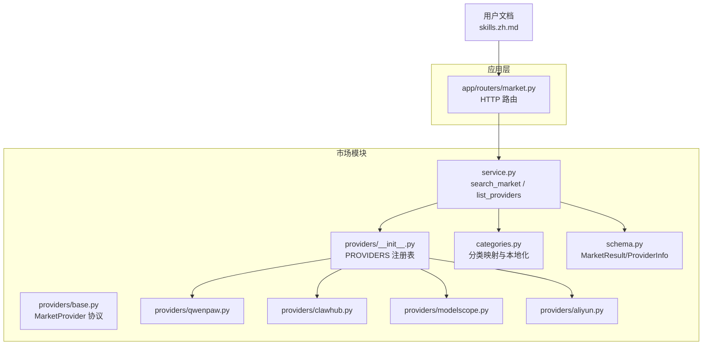
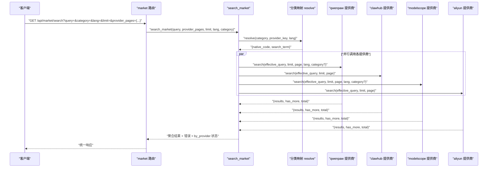
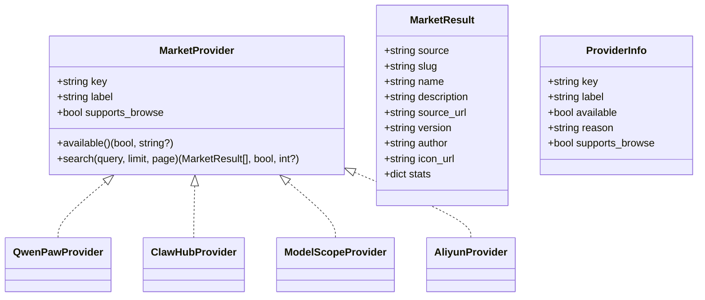
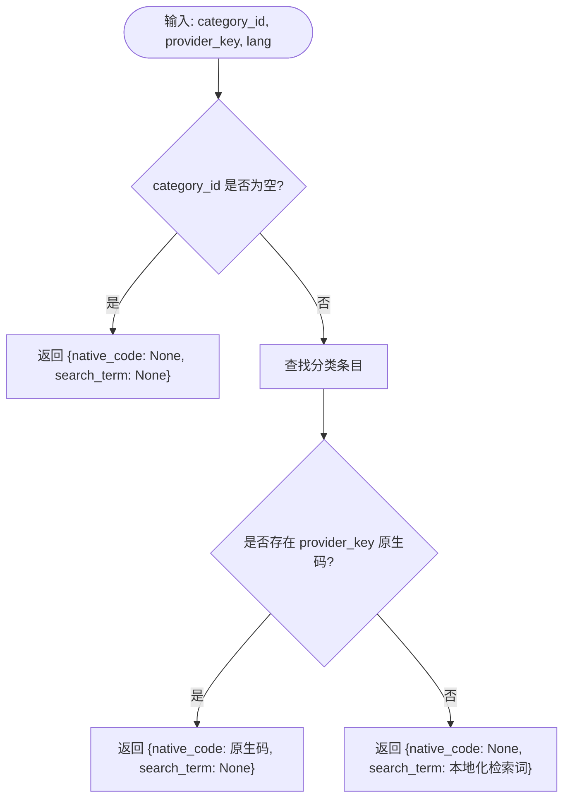
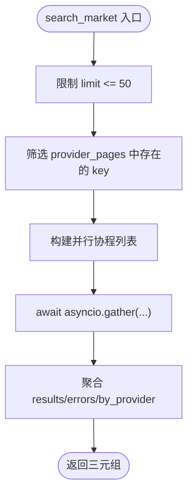
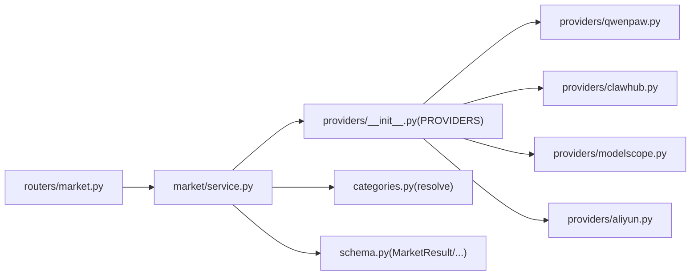

# 技能搜索与发现

<cite>
**本文引用的文件**   
- [src/qwenpaw/market/__init__.py](file://src/qwenpaw/market/__init__.py)
- [src/qwenpaw/market/service.py](file://src/qwenpaw/market/service.py)
- [src/qwenpaw/market/schema.py](file://src/qwenpaw/market/schema.py)
- [src/qwenpaw/market/categories.py](file://src/qwenpaw/market/categories.py)
- [src/qwenpaw/market/providers/__init__.py](file://src/qwenpaw/market/providers/__init__.py)
- [src/qwenpaw/market/providers/base.py](file://src/qwenpaw/market/providers/base.py)
- [src/qwenpaw/market/providers/qwenpaw.py](file://src/qwenpaw/market/providers/qwenpaw.py)
- [src/qwenpaw/market/providers/clawhub.py](file://src/qwenpaw/market/providers/clawhub.py)
- [src/qwenpaw/market/providers/modelscope.py](file://src/qwenpaw/market/providers/modelscope.py)
- [src/qwenpaw/market/providers/aliyun.py](file://src/qwenpaw/market/providers/aliyun.py)
- [src/qwenpaw/app/routers/market.py](file://src/qwenpaw/app/routers/market.py)
- [website/public/docs/skills.zh.md](file://website/public/docs/skills.zh.md)
</cite>

## 目录
1. [简介](#简介)
2. [项目结构](#项目结构)
3. [核心组件](#核心组件)
4. [架构总览](#架构总览)
5. [详细组件分析](#详细组件分析)
6. [依赖关系分析](#依赖关系分析)
7. [性能考虑](#性能考虑)
8. [故障排查指南](#故障排查指南)
9. [结论](#结论)
10. [附录](#附录)

## 简介
本章节面向 QwenPaw 的“技能搜索与发现”能力，系统性阐述市场搜索架构、提供商集成与搜索算法实现。内容覆盖：
- 统一搜索接口与参数约定
- 多市场提供商（QwenPaw、ClawHub、ModelScope、Aliyun）的接入方式
- 分类映射与本地化策略
- 结果聚合、分页与排序逻辑
- 错误处理与可用性检查
- 前端使用入口与安装流程说明
- 性能优化与缓存策略建议

## 项目结构
市场模块位于 src/qwenpaw/market，采用“服务 + 协议 + 提供商注册表 + 分类映射”的分层设计：
- schema：统一的搜索结果与错误数据结构
- providers：各市场提供商的具体实现（HTTP/SDK）
- categories：逻辑分类到各提供商原生分类或检索词的映射
- service：跨提供商的并行搜索编排、限流与聚合
- app/routers/market：对外暴露 HTTP API

图表来源
- [src/qwenpaw/market/service.py:1-130](file://src/qwenpaw/market/service.py#L1-L130)
- [src/qwenpaw/market/providers/__init__.py:1-29](file://src/qwenpaw/market/providers/__init__.py#L1-L29)
- [src/qwenpaw/market/providers/base.py:1-44](file://src/qwenpaw/market/providers/base.py#L1-L44)
- [src/qwenpaw/market/providers/qwenpaw.py:1-176](file://src/qwenpaw/market/providers/qwenpaw.py#L1-L176)
- [src/qwenpaw/market/providers/clawhub.py:1-168](file://src/qwenpaw/market/providers/clawhub.py#L1-L168)
- [src/qwenpaw/market/providers/modelscope.py:1-186](file://src/qwenpaw/market/providers/modelscope.py#L1-L186)
- [src/qwenpaw/market/providers/aliyun.py:1-320](file://src/qwenpaw/market/providers/aliyun.py#L1-L320)
- [src/qwenpaw/market/categories.py:1-156](file://src/qwenpaw/market/categories.py#L1-L156)
- [src/qwenpaw/market/schema.py:1-39](file://src/qwenpaw/market/schema.py#L1-L39)
- [src/qwenpaw/app/routers/market.py:1-120](file://src/qwenpaw/app/routers/market.py#L1-L120)
- [website/public/docs/skills.zh.md:339-369](file://website/public/docs/skills.zh.md#L339-L369)

章节来源
- [src/qwenpaw/market/__init__.py:1-21](file://src/qwenpaw/market/__init__.py#L1-L21)
- [src/qwenpaw/market/service.py:1-130](file://src/qwenpaw/market/service.py#L1-L130)
- [src/qwenpaw/market/providers/__init__.py:1-29](file://src/qwenpaw/market/providers/__init__.py#L1-L29)
- [src/qwenpaw/market/providers/base.py:1-44](file://src/qwenpaw/market/providers/base.py#L1-L44)
- [src/qwenpaw/market/schema.py:1-39](file://src/qwenpaw/market/schema.py#L1-L39)
- [src/qwenpaw/market/categories.py:1-156](file://src/qwenpaw/market/categories.py#L1-L156)
- [src/qwenpaw/app/routers/market.py:1-120](file://src/qwenpaw/app/routers/market.py#L1-L120)
- [website/public/docs/skills.zh.md:339-369](file://website/public/docs/skills.zh.md#L339-L369)

## 核心组件
- 统一协议 MarketProvider：定义 key、label、supports_browse、available()、search() 等契约，确保新增提供商可插拔。
- 提供商注册表 PROVIDERS：集中管理 qwenpaw、clawhub、modelscope、aliyun 四个提供商实例。
- 分类映射 categories：将 UI 上的逻辑分类（如“工程开发”）映射为各提供商的原生分类码或本地化检索词。
- 搜索服务 service：并行调用多个提供商，聚合结果，统计 has_more/total，并汇总错误。
- 统一数据模型 schema：MarketResult、MarketSearchError、ProviderInfo 作为跨层传输的规范。

章节来源
- [src/qwenpaw/market/providers/base.py:17-44](file://src/qwenpaw/market/providers/base.py#L17-L44)
- [src/qwenpaw/market/providers/__init__.py:17-22](file://src/qwenpaw/market/providers/__init__.py#L17-L22)
- [src/qwenpaw/market/categories.py:122-156](file://src/qwenpaw/market/categories.py#L122-L156)
- [src/qwenpaw/market/service.py:23-76](file://src/qwenpaw/market/service.py#L23-L76)
- [src/qwenpaw/market/schema.py:10-39](file://src/qwenpaw/market/schema.py#L10-L39)

## 架构总览
下图展示了从 HTTP 请求到多提供商并行搜索、再到结果聚合的完整链路。

图表来源
- [src/qwenpaw/app/routers/market.py:1-120](file://src/qwenpaw/app/routers/market.py#L1-L120)
- [src/qwenpaw/market/service.py:38-76](file://src/qwenpaw/market/service.py#L38-L76)
- [src/qwenpaw/market/categories.py:133-156](file://src/qwenpaw/market/categories.py#L133-L156)
- [src/qwenpaw/market/providers/qwenpaw.py:34-90](file://src/qwenpaw/market/providers/qwenpaw.py#L34-L90)
- [src/qwenpaw/market/providers/clawhub.py:36-79](file://src/qwenpaw/market/providers/clawhub.py#L36-L79)
- [src/qwenpaw/market/providers/modelscope.py:37-93](file://src/qwenpaw/market/providers/modelscope.py#L37-L93)
- [src/qwenpaw/market/providers/aliyun.py:192-245](file://src/qwenpaw/market/providers/aliyun.py#L192-L245)

## 详细组件分析

### 统一协议与数据模型
- MarketProvider 协议定义了每个提供商必须实现的 available() 与 search()，以及元信息 key、label、supports_browse。
- MarketResult 是跨提供商的统一结果项，包含 source、slug、name、description、source_url、version、author、icon_url、stats 等字段。
- ProviderInfo 用于列出可用提供商及其可用性原因。
- MARKET_SEARCH_TIMEOUT_S 为所有提供商单次搜索请求的超时预算。

图表来源
- [src/qwenpaw/market/providers/base.py:17-44](file://src/qwenpaw/market/providers/base.py#L17-L44)
- [src/qwenpaw/market/schema.py:10-39](file://src/qwenpaw/market/schema.py#L10-L39)
- [src/qwenpaw/market/providers/qwenpaw.py:26-90](file://src/qwenpaw/market/providers/qwenpaw.py#L26-L90)
- [src/qwenpaw/market/providers/clawhub.py:28-79](file://src/qwenpaw/market/providers/clawhub.py#L28-L79)
- [src/qwenpaw/market/providers/modelscope.py:29-93](file://src/qwenpaw/market/providers/modelscope.py#L29-L93)
- [src/qwenpaw/market/providers/aliyun.py:165-245](file://src/qwenpaw/market/providers/aliyun.py#L165-L245)

章节来源
- [src/qwenpaw/market/providers/base.py:1-44](file://src/qwenpaw/market/providers/base.py#L1-L44)
- [src/qwenpaw/market/schema.py:1-39](file://src/qwenpaw/market/schema.py#L1-L39)

### 分类映射与本地化
- 逻辑分类列表通过 list_categories(lang) 返回，支持 zh/en。
- resolve(category_id, provider_key, lang) 将逻辑分类解析为：
  - native_code：若该提供商有原生分类码则直接透传
  - search_term：否则回退为本地化的检索词，当 query 为空时用作有效查询词
- 当前已为部分提供商（如 modelscope）配置了原生分类映射；其余提供商使用 fallback 检索词。

图表来源
- [src/qwenpaw/market/categories.py:122-156](file://src/qwenpaw/market/categories.py#L122-L156)

章节来源
- [src/qwenpaw/market/categories.py:1-156](file://src/qwenpaw/market/categories.py#L1-L156)

### 搜索服务编排
- list_providers()：遍历 PROVIDERS，调用 each.available() 生成 ProviderInfo 列表。
- search_market(query, provider_pages, limit, lang, category)：
  - 限制 limit 上限（_MAX_LIMIT=50）
  - 过滤出有效的 provider_pages 键
  - 对每个提供商执行 _run_one(key, query, capped_limit, page, lang, category)
  - 并行 gather 所有协程
  - 聚合 results/errors/by_provider(has_more, total)
- _run_one：
  - 先检查 provider.available()
  - 通过 resolve_category 得到 native_code 与 search_term
  - 若无 query 且有 search_term，则以 search_term 作为 effective_query
  - 根据 provider.search 签名动态裁剪参数（仅传递支持的 kwargs）
  - 捕获异常并包装为 MarketSearchError

图表来源
- [src/qwenpaw/market/service.py:23-76](file://src/qwenpaw/market/service.py#L23-L76)
- [src/qwenpaw/market/service.py:79-130](file://src/qwenpaw/market/service.py#L79-L130)

章节来源
- [src/qwenpaw/market/service.py:1-130](file://src/qwenpaw/market/service.py#L1-L130)

### 提供商实现要点

#### QwenPaw 提供商
- 公开 OpenAPI，无需鉴权
- 支持 query、category、lang 本地化
- 上游硬分页限制 page_size 1..100
- 返回 data.skills 列表与 data.total，据此计算 has_more

章节来源
- [src/qwenpaw/market/providers/qwenpaw.py:1-176](file://src/qwenpaw/market/providers/qwenpaw.py#L1-L176)

#### ClawHub 提供商
- 关键词搜索走 /api/v1/search?q=&limit=（无统计信息）
- 浏览列表走 /api/v1/skills?limit=&cursor=&sort=recommended（携带 downloads/stars/installs）
- 搜索模式：一次性拉取较多结果（_OVERFETCH_LIMIT），再在内存中按页切片
- 浏览模式：基于 cursor 翻页，has_more 由 nextCursor 决定

章节来源
- [src/qwenpaw/market/providers/clawhub.py:1-168](file://src/qwenpaw/market/providers/clawhub.py#L1-L168)

#### ModelScope 提供商
- 公开 OpenAPI，无需鉴权
- 支持 query 与 filter.category 原生分类
- 返回 data.skills 与 data.total，据此计算 has_more

章节来源
- [src/qwenpaw/market/providers/modelscope.py:1-186](file://src/qwenpaw/market/providers/modelscope.py#L1-L186)

#### Aliyun 提供商
- 需要 AK/SK 环境变量，未配置时 available() 返回不可用及原因
- 使用 tea_openapi SDK 进行签名请求
- SearchSkills 为游标分页（nextToken），内部以循环推进至目标页
- 返回 totalCount 与 nextToken，据此计算 has_more 与 total

章节来源
- [src/qwenpaw/market/providers/aliyun.py:1-320](file://src/qwenpaw/market/providers/aliyun.py#L1-L320)

### HTTP 路由与外部接口
- 路由提供两个主要端点：
  - 列出可用提供商：返回 ProviderInfo 列表
  - 搜索市场：接收 query、category、lang、limit、provider_pages 等参数，调用 search_market 并返回统一格式
- 路由层不改变业务逻辑，仅做参数透传与响应封装

章节来源
- [src/qwenpaw/app/routers/market.py:1-120](file://src/qwenpaw/app/routers/market.py#L1-L120)

### 前端使用与安装流程
- 入口：工作区 → 技能 或 设置 → 技能池 页面点击“添加技能 → 浏览市场”
- 内置数据源：QwenPaw、ClawHub、ModelScope、Aliyun（后者需配置环境变量）
- 工作机制：
  - 支持按来源、分类和关键词筛选
  - 分类自动映射为各数据源原生分类或等价检索词
  - 搜索并行调用所有启用的数据源，单个失败不影响其它结果展示
  - 保存目标由入口决定（工作区或技能池）
  - 安装串行队列，支持重试与取消；重名会展示服务端错误
- 安装来源记录：installed_from 字段，用于展示“安装来源”

章节来源
- [website/public/docs/skills.zh.md:339-369](file://website/public/docs/skills.zh.md#L339-L369)

## 依赖关系分析
- 服务层依赖：
  - providers.__init__ 中的 PROVIDERS 字典
  - categories.resolve 的分类映射
  - schema 的数据模型
- 提供商实现依赖：
  - httpx/http_json_get（QwenPaw、ModelScope、ClawHub 浏览）
  - alibabacloud_tea_openapi（Aliyun）
- 路由层依赖 market.service 的公开函数

图表来源
- [src/qwenpaw/app/routers/market.py:1-120](file://src/qwenpaw/app/routers/market.py#L1-L120)
- [src/qwenpaw/market/service.py:1-130](file://src/qwenpaw/market/service.py#L1-L130)
- [src/qwenpaw/market/providers/__init__.py:1-29](file://src/qwenpaw/market/providers/__init__.py#L1-L29)
- [src/qwenpaw/market/categories.py:1-156](file://src/qwenpaw/market/categories.py#L1-L156)
- [src/qwenpaw/market/schema.py:1-39](file://src/qwenpaw/market/schema.py#L1-L39)

章节来源
- [src/qwenpaw/market/providers/__init__.py:1-29](file://src/qwenpaw/market/providers/__init__.py#L1-L29)
- [src/qwenpaw/market/service.py:1-130](file://src/qwenpaw/market/service.py#L1-L130)

## 性能考虑
- 并发与超时
  - 使用 asyncio.gather 并行调用各提供商，提升整体吞吐
  - 全局搜索超时预算 MARKET_SEARCH_TIMEOUT_S 控制单次网络请求耗时
- 分页与上拉加载
  - 统一 limit 上限（_MAX_LIMIT=50），避免过大请求
  - 各提供商内部对上游限制进行适配（如 page_size 上限、cursor 翻页）
- 内存与带宽
  - ClawHub 搜索模式采用 overfetch 后内存切片，适合小量结果场景；大数据集下可考虑改为服务端分页
- 分类映射
  - 优先使用原生分类减少无效结果，降低后续过滤成本
- 缓存策略（建议）
  - 分类列表与提供商可用性：短 TTL 缓存（例如 5-10 分钟）
  - 热门关键词搜索结果：短 TTL 缓存（例如 1-5 分钟），结合去抖与幂等键（query+category+lang+limit+page）
  - 注意：由于不同提供商返回结构与统计字段差异较大，缓存应保留原始结果并按需转换

[本节为通用性能建议，不直接分析具体文件]

## 故障排查指南
- 提供商不可用
  - 检查 available() 返回的原因字符串，常见于 Aliyun 缺少 AK/SK 或未安装 SDK
- 搜索失败
  - 查看 by_provider 中的错误列表，定位具体 provider 的错误消息
  - 关注上游 HTTP 状态码与 message（QwenPaw/ModelScope 会抛出运行时错误）
- 分页异常
  - 确认 limit 是否超过上游限制（如 page_size > 100）
  - 对于游标分页（Aliyun/ClawHub browse），检查 nextToken/nextCursor 是否正确推进
- 分类映射问题
  - 确认 category_id 是否在 CATEGORIES 中存在
  - 若提供商无原生分类，fallback 检索词是否正确本地化

章节来源
- [src/qwenpaw/market/providers/aliyun.py:170-190](file://src/qwenpaw/market/providers/aliyun.py#L170-L190)
- [src/qwenpaw/market/providers/qwenpaw.py:60-70](file://src/qwenpaw/market/providers/qwenpaw.py#L60-L70)
- [src/qwenpaw/market/providers/modelscope.py:63-73](file://src/qwenpaw/market/providers/modelscope.py#L63-L73)
- [src/qwenpaw/market/providers/clawhub.py:86-126](file://src/qwenpaw/market/providers/clawhub.py#L86-L126)
- [src/qwenpaw/market/categories.py:133-156](file://src/qwenpaw/market/categories.py#L133-L156)

## 结论
QwenPaw 的技能搜索与发现模块通过清晰的协议与分层设计，实现了多市场提供商的统一接入与并行搜索。分类映射与本地化提升了用户体验，统一数据模型简化了前后端交互。通过合理的分页、超时与错误处理机制，系统在稳定性与性能之间取得平衡。未来可在缓存、搜索排序与更丰富的筛选维度上进一步优化。

[本节为总结性内容，不直接分析具体文件]

## 附录

### 搜索接口与参数约定
- 路由端点
  - 列出提供商：GET /api/market/providers
  - 搜索市场：GET /api/market/search
- 关键参数
  - query：关键词（可为空）
  - category：逻辑分类 id（可选）
  - lang：语言（zh/en）
  - limit：每页条数（受 _MAX_LIMIT 限制）
  - provider_pages：{provider_key: page_number}，指定要搜索的提供商与页码
- 返回结构
  - results：MarketResult 列表
  - errors：MarketSearchError 列表
  - by_provider：{provider_key: (has_more, total)}

章节来源
- [src/qwenpaw/app/routers/market.py:1-120](file://src/qwenpaw/app/routers/market.py#L1-L120)
- [src/qwenpaw/market/service.py:38-76](file://src/qwenpaw/market/service.py#L38-L76)
- [src/qwenpaw/market/schema.py:10-39](file://src/qwenpaw/market/schema.py#L10-L39)