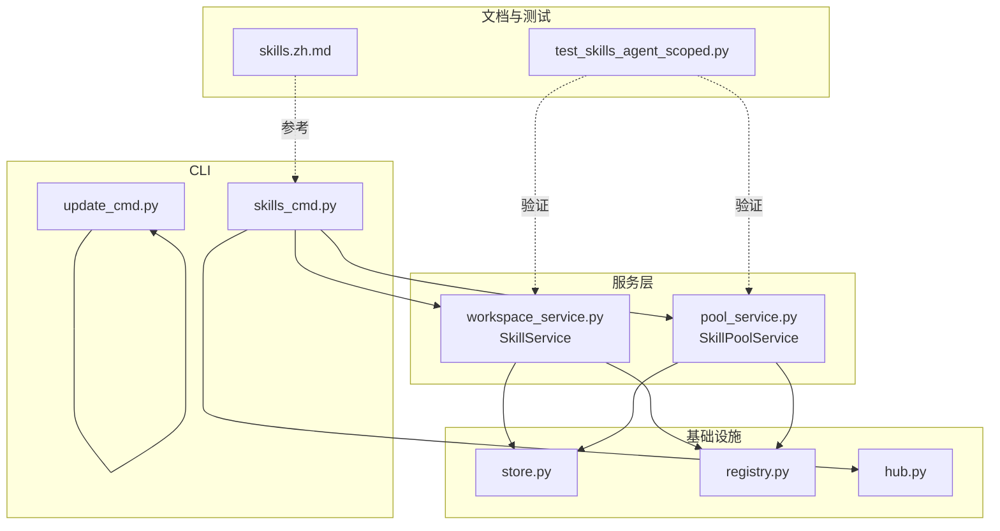
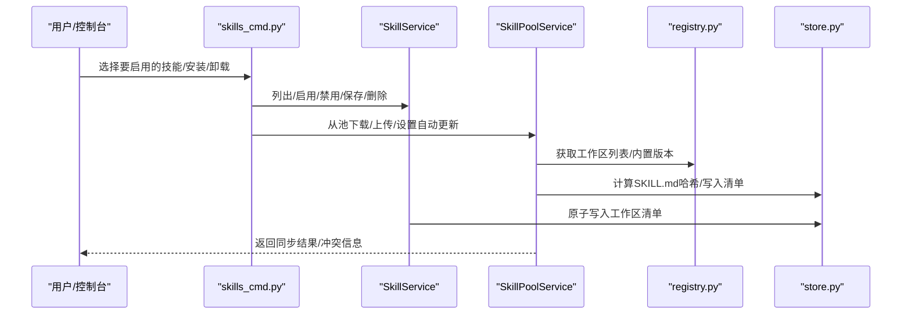
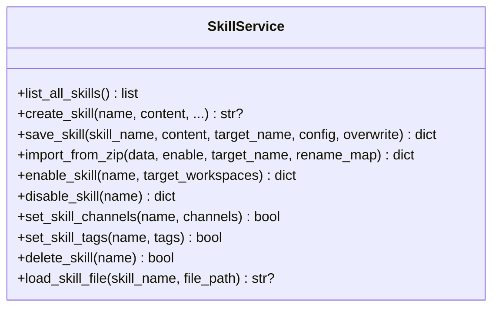
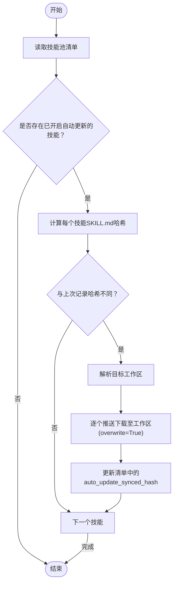
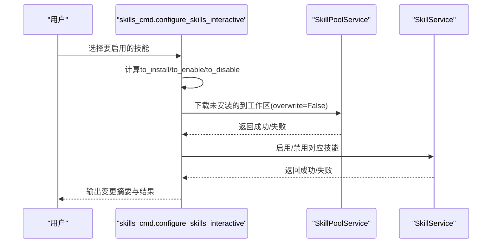
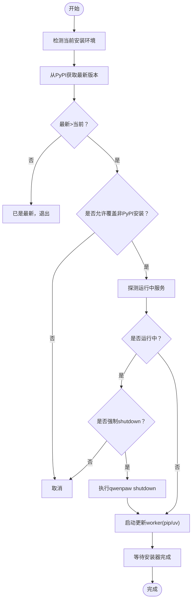
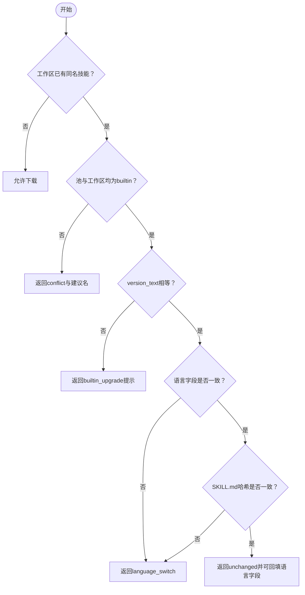
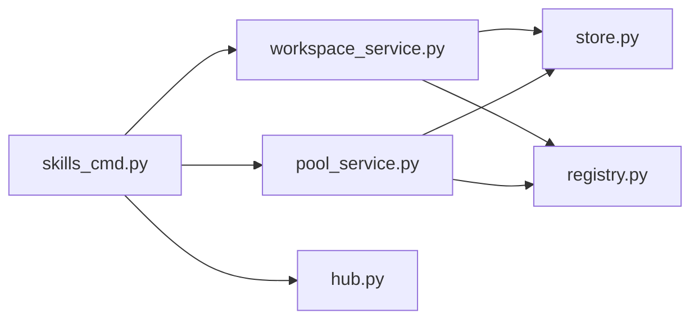

# 版本管理与更新

<cite>
**本文引用的文件**   
- [skills_cmd.py](file://src/qwenpaw/cli/skills_cmd.py)
- [update_cmd.py](file://src/qwenpaw/cli/update_cmd.py)
- [workspace_service.py](file://src/qwenpaw/agents/skill_system/workspace_service.py)
- [pool_service.py](file://src/qwenpaw/agents/skill_system/pool_service.py)
- [store.py](file://src/qwenpaw/agents/skill_system/store.py)
- [registry.py](file://src/qwenpaw/agents/skill_system/registry.py)
- [hub.py](file://src/qwenpaw/agents/skill_system/hub.py)
- [skills.zh.md](file://website/public/docs/skills.zh.md)
- [test_skills_agent_scoped.py](file://tests/integration/test_skills_agent_scoped.py)
</cite>

## 目录
1. [简介](#简介)
2. [项目结构](#项目结构)
3. [核心组件](#核心组件)
4. [架构总览](#架构总览)
5. [详细组件分析](#详细组件分析)
6. [依赖关系分析](#依赖关系分析)
7. [性能与一致性](#性能与一致性)
8. [故障排查指南](#故障排查指南)
9. [结论](#结论)
10. [附录：接口与配置速查](#附录接口与配置速查)

## 简介
本章节聚焦 QwenPaw 的“技能版本管理与更新”能力，覆盖以下主题：
- 版本控制机制：工作区副本与共享技能池的双层结构、元数据与清单管理。
- 自动更新系统：基于 SKILL.md 内容哈希的变更检测、目标工作区解析与推送同步。
- 版本比较算法：内置技能的版本文本比较与语言切换冲突检测；应用级 qwenpaw update 的版本比较。
- 具体接口与策略：工作区与技能池的 CRUD、上传/下载、重命名迁移、回滚与冲突处理。
- 与工作空间版本的协调：工作区清单、启用状态、频道范围与配置的持久化。
- 版本迁移与数据兼容：旧版 active/customized 目录迁移策略与注意事项。

## 项目结构
围绕“技能版本管理与更新”，关键代码分布在如下模块：
- CLI 命令层：提供交互式技能配置与应用级更新入口。
- 服务层：工作区技能生命周期（SkillService）与共享技能池生命周期（SkillPoolService）。
- 存储与注册：清单读写、路径解析、内置版本信息、工作区发现等。
- 文档与测试：用户文档说明与集成测试用例。

图表来源
- [skills_cmd.py:1-120](file://src/qwenpaw/cli/skills_cmd.py#L1-L120)
- [update_cmd.py:675-784](file://src/qwenpaw/cli/update_cmd.py#L675-L784)
- [workspace_service.py:88-227](file://src/qwenpaw/agents/skill_system/workspace_service.py#L88-L227)
- [pool_service.py:121-235](file://src/qwenpaw/agents/skill_system/pool_service.py#L121-L235)
- [store.py](file://src/qwenpaw/agents/skill_system/store.py)
- [registry.py](file://src/qwenpaw/agents/skill_system/registry.py)
- [hub.py](file://src/qwenpaw/agents/skill_system/hub.py)
- [skills.zh.md:311-336](file://website/public/docs/skills.zh.md#L311-L336)
- [test_skills_agent_scoped.py:234-270](file://tests/integration/test_skills_agent_scoped.py#L234-L270)

章节来源
- [skills_cmd.py:1-120](file://src/qwenpaw/cli/skills_cmd.py#L1-L120)
- [update_cmd.py:675-784](file://src/qwenpaw/cli/update_cmd.py#L675-L784)
- [workspace_service.py:88-227](file://src/qwenpaw/agents/skill_system/workspace_service.py#L88-L227)
- [pool_service.py:121-235](file://src/qwenpaw/agents/skill_system/pool_service.py#L121-L235)
- [skills.zh.md:311-336](file://website/public/docs/skills.zh.md#L311-L336)
- [test_skills_agent_scoped.py:234-270](file://tests/integration/test_skills_agent_scoped.py#L234-L270)

## 核心组件
- SkillService（工作区技能服务）
  - 职责：工作区内技能的创建、保存（原地编辑/重命名）、导入 zip、启用/禁用、频道与标签设置、删除、文件读取。
  - 关键点：以工作区 skill.json 为运行时状态源，以 skills/ 目录为内容源；所有变更通过原子化的 mutate_json 写入清单。
- SkillPoolService（共享技能池服务）
  - 职责：共享池内技能的创建、导入 zip、保存（原地编辑/重命名）、从工作区上传、下载到工作区、重命名迁移、自动更新同步。
  - 关键点：维护 auto_update/auto_update_targets/auto_update_synced_hash；按 SKILL.md 内容哈希判断是否需要同步。
- CLI 命令
  - skills_cmd：交互式配置工作区技能、安装/卸载、测试校验。
  - update_cmd：应用级版本检查与升级流程（PyPI 源），包含运行中服务探测与关闭确认。
- 存储与注册
  - store：清单读写、安全目录、暂存目录、扫描校验、元数据构建、冲突建议名等。
  - registry：工作区列表、内置版本信息、清单 reconcile 等。
  - hub：从市场/URL 导入技能到工作区或技能池。

章节来源
- [workspace_service.py:88-227](file://src/qwenpaw/agents/skill_system/workspace_service.py#L88-L227)
- [pool_service.py:121-235](file://src/qwenpaw/agents/skill_system/pool_service.py#L121-L235)
- [skills_cmd.py:312-479](file://src/qwenpaw/cli/skills_cmd.py#L312-L479)
- [update_cmd.py:675-784](file://src/qwenpaw/cli/update_cmd.py#L675-L784)
- [store.py](file://src/qwenpaw/agents/skill_system/store.py)
- [registry.py](file://src/qwenpaw/agents/skill_system/registry.py)
- [hub.py](file://src/qwenpaw/agents/skill_system/hub.py)

## 架构总览
下图展示了“技能版本管理与更新”的整体交互：用户通过 CLI 或控制台触发操作，服务层在工作区与技能池之间进行版本复制、冲突检测与同步，并通过清单持久化状态。

图表来源
- [skills_cmd.py:219-310](file://src/qwenpaw/cli/skills_cmd.py#L219-L310)
- [workspace_service.py:114-124](file://src/qwenpaw/agents/skill_system/workspace_service.py#L114-L124)
- [pool_service.py:146-160](file://src/qwenpaw/agents/skill_system/pool_service.py#L146-L160)
- [pool_service.py:1218-1264](file://src/qwenpaw/agents/skill_system/pool_service.py#L1218-L1264)
- [store.py](file://src/qwenpaw/agents/skill_system/store.py)
- [registry.py](file://src/qwenpaw/agents/skill_system/registry.py)

## 详细组件分析

### 组件一：工作区技能服务（SkillService）
- 设计要点
  - 工作区清单（skill.json）作为运行时状态（enabled、channels、config、tags、metadata、updated_at）的唯一来源。
  - 内容位于 workspaces/{agent_id}/skills/{name}/SKILL.md 及 references/scripts/extra_files。
  - 所有写操作使用暂存目录 + 扫描校验 + 原子写入清单，失败时回滚文件。
- 关键方法
  - create_skill/save_skill/import_from_zip/enable_skill/disable_skill/set_skill_channels/set_skill_tags/delete_skill/load_skill_file
- 错误与回滚
  - 当清单写入失败但文件已创建时，抛出异常并尝试清理已创建的技能目录，保证一致性。

图表来源
- [workspace_service.py:88-227](file://src/qwenpaw/agents/skill_system/workspace_service.py#L88-L227)
- [workspace_service.py:229-442](file://src/qwenpaw/agents/skill_system/workspace_service.py#L229-L442)
- [workspace_service.py:444-553](file://src/qwenpaw/agents/skill_system/workspace_service.py#L444-L553)
- [workspace_service.py:554-782](file://src/qwenpaw/agents/skill_system/workspace_service.py#L554-L782)

章节来源
- [workspace_service.py:88-227](file://src/qwenpaw/agents/skill_system/workspace_service.py#L88-L227)
- [workspace_service.py:229-442](file://src/qwenpaw/agents/skill_system/workspace_service.py#L229-L442)
- [workspace_service.py:444-553](file://src/qwenpaw/agents/skill_system/workspace_service.py#L444-L553)
- [workspace_service.py:554-782](file://src/qwenpaw/agents/skill_system/workspace_service.py#L554-L782)

### 组件二：共享技能池服务（SkillPoolService）
- 设计要点
  - 共享池位于 WORKING_DIR/skill_pool，支持多工作区复用。
  - 自动更新字段：auto_update、auto_update_targets、auto_update_synced_hash。
  - 下载至工作区时进行冲突检测（内置版本/语言切换/普通冲突），必要时提示或阻止。
- 关键方法
  - create_skill/import_from_zip/save_pool_skill/upload_from_workspace/download_to_workspace/preiflight_download_to_workspace/rename_in_workspaces/set_skill_auto_update/run_pool_auto_update_sync
- 自动更新流程
  - 检测变更：遍历开启 auto_update 的技能，计算当前 SKILL.md 哈希并与上次记录对比。
  - 解析目标：若指定 targets 则仅对指定工作区；否则对所有已安装该技能的工作区。
  - 推送同步：调用 download_to_workspace(overwrite=True)，成功后在清单中记录新的哈希。

图表来源
- [pool_service.py:1189-1264](file://src/qwenpaw/agents/skill_system/pool_service.py#L1189-L1264)
- [pool_service.py:1115-1187](file://src/qwenpaw/agents/skill_system/pool_service.py#L1115-L1187)
- [pool_service.py:980-1112](file://src/qwenpaw/agents/skill_system/pool_service.py#L980-L1112)

章节来源
- [pool_service.py:121-235](file://src/qwenpaw/agents/skill_system/pool_service.py#L121-L235)
- [pool_service.py:417-458](file://src/qwenpaw/agents/skill_system/pool_service.py#L417-L458)
- [pool_service.py:980-1112](file://src/qwenpaw/agents/skill_system/pool_service.py#L980-L1112)
- [pool_service.py:1189-1264](file://src/qwenpaw/agents/skill_system/pool_service.py#L1189-L1264)

### 组件三：CLI 技能管理（skills_cmd）
- 功能概览
  - 交互式配置：列出工作区与池候选，预览变更（安装/启用/禁用），确认后批量应用。
  - 安装/卸载：支持从 URL 安装到工作区或技能池；卸载前会先禁用再删除。
  - 本地测试：校验 frontmatter 与安全扫描。
- 典型流程
  - 选择技能 → 计算 to_install/to_enable/to_disable → 打印预览 → 确认 → 调用 SkillPoolService.download_to_workspace 与 SkillService.enable/disable。

图表来源
- [skills_cmd.py:219-310](file://src/qwenpaw/cli/skills_cmd.py#L219-L310)
- [skills_cmd.py:417-479](file://src/qwenpaw/cli/skills_cmd.py#L417-L479)
- [skills_cmd.py:482-557](file://src/qwenpaw/cli/skills_cmd.py#L482-L557)

章节来源
- [skills_cmd.py:219-310](file://src/qwenpaw/cli/skills_cmd.py#L219-L310)
- [skills_cmd.py:417-479](file://src/qwenpaw/cli/skills_cmd.py#L417-L479)
- [skills_cmd.py:482-557](file://src/qwenpaw/cli/skills_cmd.py#L482-L557)

### 组件四：应用级版本更新（update_cmd）
- 功能概览
  - 从 PyPI 拉取最新版本，比较当前版本，探测运行中服务，必要时执行 shutdown，然后启动更新 worker 执行 pip/uv 升级。
- 版本比较算法
  - 使用 packaging.version.Version 解析版本号，忽略无法解析的情况；若两者相等返回 False，否则返回 None 表示不可比较。
- 更新策略
  - 非 PyPI 安装源会提示覆盖风险；Windows 下采用分离进程以避免锁定可执行文件。

图表来源
- [update_cmd.py:675-784](file://src/qwenpaw/cli/update_cmd.py#L675-L784)
- [update_cmd.py:79-91](file://src/qwenpaw/cli/update_cmd.py#L79-L91)
- [update_cmd.py:120-161](file://src/qwenpaw/cli/update_cmd.py#L120-L161)
- [update_cmd.py:181-211](file://src/qwenpaw/cli/update_cmd.py#L181-L211)
- [update_cmd.py:214-233](file://src/qwenpaw/cli/update_cmd.py#L214-L233)
- [update_cmd.py:353-389](file://src/qwenpaw/cli/update_cmd.py#L353-L389)
- [update_cmd.py:584-633](file://src/qwenpaw/cli/update_cmd.py#L584-L633)

章节来源
- [update_cmd.py:675-784](file://src/qwenpaw/cli/update_cmd.py#L675-L784)
- [update_cmd.py:79-91](file://src/qwenpaw/cli/update_cmd.py#L79-L91)
- [update_cmd.py:120-161](file://src/qwenpaw/cli/update_cmd.py#L120-L161)
- [update_cmd.py:181-211](file://src/qwenpaw/cli/update_cmd.py#L181-L211)
- [update_cmd.py:214-233](file://src/qwenpaw/cli/update_cmd.py#L214-L233)
- [update_cmd.py:353-389](file://src/qwenpaw/cli/update_cmd.py#L353-L389)
- [update_cmd.py:584-633](file://src/qwenpaw/cli/update_cmd.py#L584-L633)

### 组件五：版本比较与冲突检测
- 内置技能版本比较
  - 当池与工作区均为 builtin 且 version_text 相同：
    - 若语言不一致，直接拒绝（language_switch）。
    - 若语言一致但 SKILL.md 内容哈希不同，也视为 language_switch（防止语言切换导致的语义差异）。
  - 若 version_text 不同，返回需要升级的提示（builtin_upgrade）。
- 普通冲突
  - 名称冲突时返回 conflict，并提供建议的新名称。

图表来源
- [pool_service.py:862-959](file://src/qwenpaw/agents/skill_system/pool_service.py#L862-L959)

章节来源
- [pool_service.py:862-959](file://src/qwenpaw/agents/skill_system/pool_service.py#L862-L959)

### 组件六：与工作空间版本的协调
- 工作区清单字段
  - enabled、channels、source、installed_from、config、metadata、requirements、updated_at、tags、builtin_language（针对内置技能）。
- 协调机制
  - 下载后保留工作区原有 enabled/channels/config/tags（如存在），同时继承池的 installed_from 与 metadata。
  - 重命名迁移时，将旧条目替换为新条目，并删除旧目录。

章节来源
- [pool_service.py:1034-1079](file://src/qwenpaw/agents/skill_system/pool_service.py#L1034-L1079)
- [pool_service.py:684-789](file://src/qwenpaw/agents/skill_system/pool_service.py#L684-L789)
- [workspace_service.py:41-86](file://src/qwenpaw/agents/skill_system/workspace_service.py#L41-L86)

### 组件七：版本迁移与数据兼容性
- 旧版目录迁移
  - 首次启动时自动执行迁移，将 active_skills 与 customized_skills 复制到工作区 skills/，并保留旧目录。
  - 同名但内容不同的两个版本会分别添加 -active/-customize 后缀。
- 注意事项
  - 升级前备份重要自定义技能；迁移完成后旧目录不再被读取。

章节来源
- [skills.zh.md:473-486](file://website/public/docs/skills.zh.md#L473-L486)

## 依赖关系分析
- 组件耦合
  - CLI 依赖服务层（SkillService/SkillPoolService）与 hub（URL/市场导入）。
  - 服务层依赖 store（清单/文件/校验）与 registry（工作区/内置版本）。
- 外部依赖
  - update_cmd 依赖 PyPI JSON API 与 pip/uv 安装器。
- 潜在循环
  - 无直接循环依赖；各模块职责清晰，通过函数式组合与数据传递解耦。

图表来源
- [skills_cmd.py:10-33](file://src/qwenpaw/cli/skills_cmd.py#L10-L33)
- [workspace_service.py:10-38](file://src/qwenpaw/agents/skill_system/workspace_service.py#L10-L38)
- [pool_service.py:12-48](file://src/qwenpaw/agents/skill_system/pool_service.py#L12-L48)

章节来源
- [skills_cmd.py:10-33](file://src/qwenpaw/cli/skills_cmd.py#L10-L33)
- [workspace_service.py:10-38](file://src/qwenpaw/agents/skill_system/workspace_service.py#L10-L38)
- [pool_service.py:12-48](file://src/qwenpaw/agents/skill_system/pool_service.py#L12-L48)

## 性能与一致性
- 变更检测优化
  - 自动更新仅读取 SKILL.md 计算哈希，避免全量扫描；仅在哈希变化时执行下载与清单更新。
- 原子写入
  - 所有清单修改通过 mutate_json 原子写入，降低并发与崩溃导致的不一致风险。
- 暂存目录
  - 写入前先落盘到暂存目录，校验通过后替换，提升安全性与可回滚性。
- 网络与安装器
  - update_cmd 使用超时与健壮解码，避免子进程输出编码问题导致崩溃。

[本节为通用指导，不直接分析具体文件]

## 故障排查指南
- 常见错误与定位
  - 冲突（conflict）：名称重复或语言切换冲突，查看返回的 suggested_name 与 reason。
  - 扫描失败（scan_skill_dir_or_raise）：frontmatter 或安全规则不满足，需修正 SKILL.md 或文件结构。
  - 清单写入失败：检查权限与磁盘空间，服务会尝试回滚已创建的文件。
  - 自动更新未生效：确认 auto_update 已开启、auto_update_targets 正确、SKILL.md 确实发生变化。
- 调试步骤
  - 使用 CLI 的 test 命令校验本地技能目录。
  - 查看工作区清单与技能池清单，确认 updated_at、metadata、auto_update_synced_hash 等字段。
  - 对于应用级更新失败，检查 pip/uv 日志与网络连通性。

章节来源
- [skills_cmd.py:112-161](file://src/qwenpaw/cli/skills_cmd.py#L112-L161)
- [workspace_service.py:187-227](file://src/qwenpaw/agents/skill_system/workspace_service.py#L187-L227)
- [pool_service.py:203-235](file://src/qwenpaw/agents/skill_system/pool_service.py#L203-L235)
- [pool_service.py:1189-1264](file://src/qwenpaw/agents/skill_system/pool_service.py#L1189-L1264)

## 结论
QwenPaw 的技能版本管理与更新体系以“双层结构（工作区+技能池）+ 清单驱动 + 原子写入 + 内容哈希检测”为核心，既保证了跨工作区的复用与一致性，又提供了灵活的自动更新与冲突处理能力。配合 CLI 与文档，用户可在控制台或命令行高效管理技能版本，并在复杂场景（语言切换、内置版本升级、重命名迁移）中获得明确反馈与安全保障。

[本节为总结，不直接分析具体文件]

## 附录：接口与配置速查
- 工作区技能接口（示例路径）
  - POST /api/agents/{agentId}/skills — 创建工作区技能
  - PUT /api/agents/{agentId}/skills/save — 保存/重命名
  - PUT /api/agents/{agentId}/skills/{name}/channels — 设置频道范围
  - PUT /api/agents/{agentId}/skills/{name}/config — 设置运行时配置
  - PUT /api/agents/{agentId}/skills/{name}/tags — 设置标签
  - DELETE /api/agents/{agentId}/skills/{name} — 删除
  - POST /api/agents/{agentId}/skills/refresh — 刷新工作区技能列表
- 技能池接口（示例路径）
  - 上传工作区技能到池：POST /api/skills/upload
  - 下载池技能到工作区：POST /api/skills/download
  - 设置自动更新：PUT /api/skills/{name}/auto-update
- 配置选项
  - auto_update：布尔值，是否开启自动同步
  - auto_update_targets：字符串数组，目标 agent_id 列表
  - auto_update_synced_hash：字符串，上次同步的 SKILL.md 哈希
- 工作区清单关键字段
  - enabled、channels、source、installed_from、config、metadata、requirements、updated_at、tags、builtin_language

章节来源
- [test_skills_agent_scoped.py:234-270](file://tests/integration/test_skills_agent_scoped.py#L234-L270)
- [test_skills_agent_scoped.py:410-427](file://tests/integration/test_skills_agent_scoped.py#L410-L427)
- [pool_service.py:417-458](file://src/qwenpaw/agents/skill_system/pool_service.py#L417-L458)
- [pool_service.py:1218-1264](file://src/qwenpaw/agents/skill_system/pool_service.py#L1218-L1264)
- [workspace_service.py:41-86](file://src/qwenpaw/agents/skill_system/workspace_service.py#L41-L86)