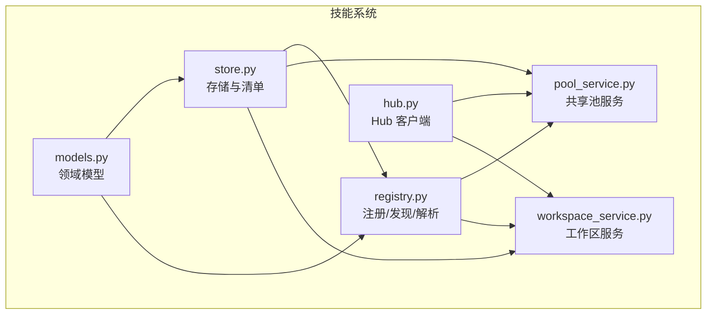
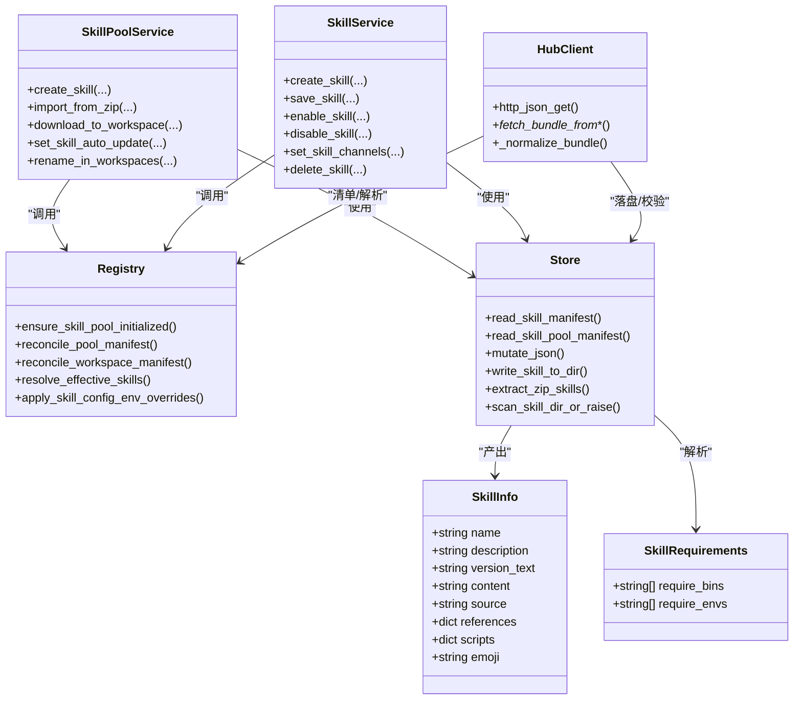
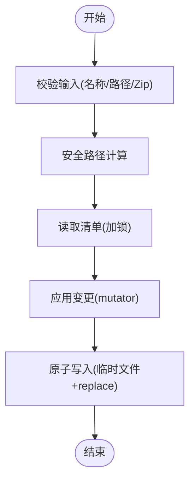
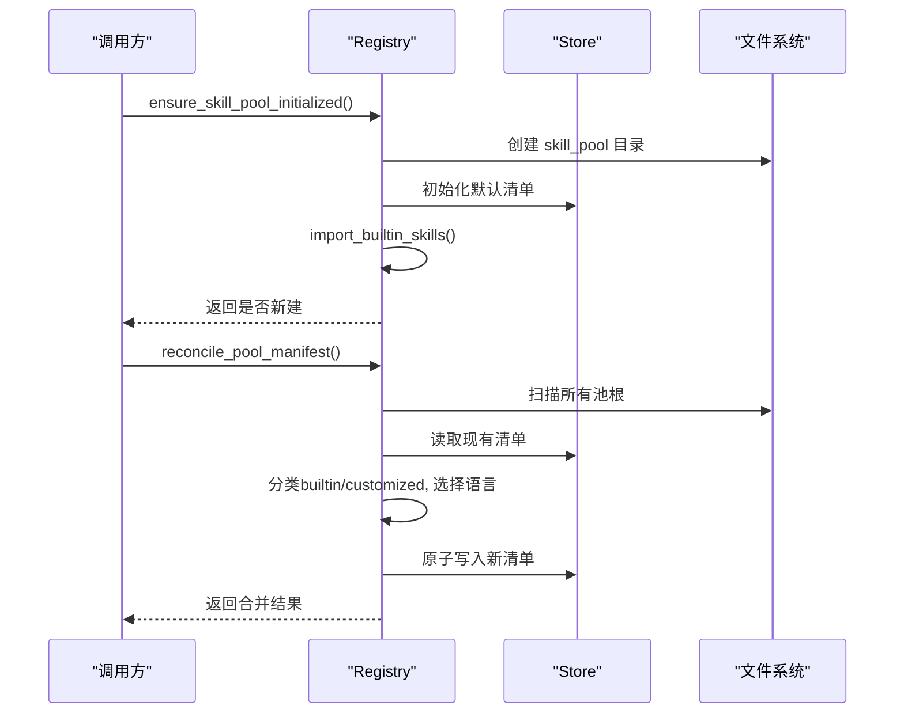
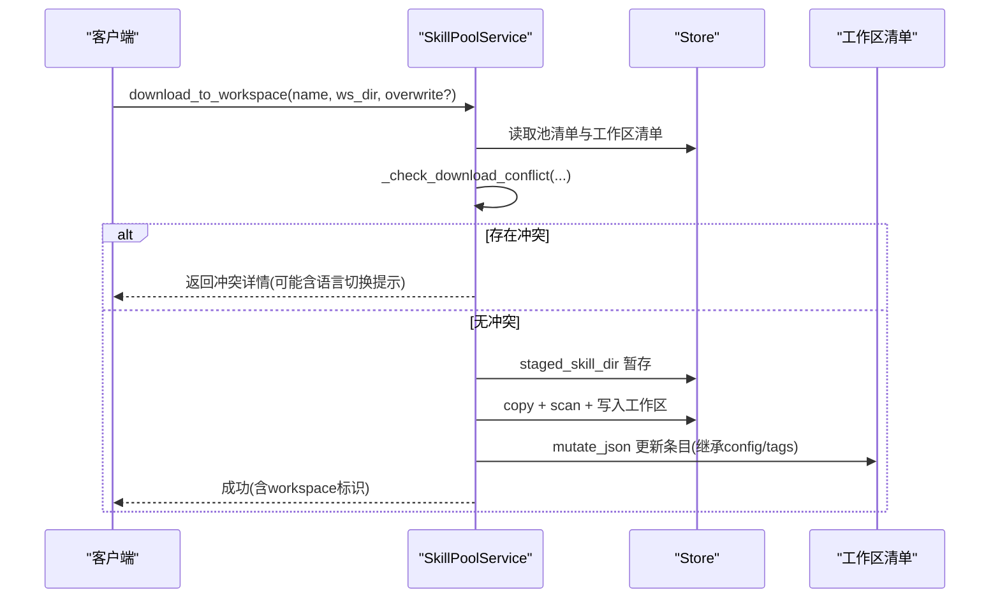
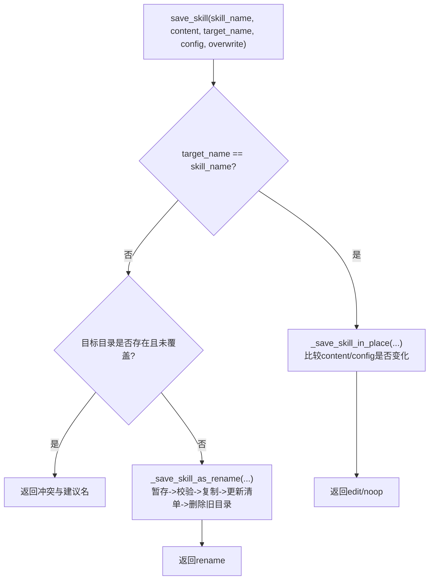
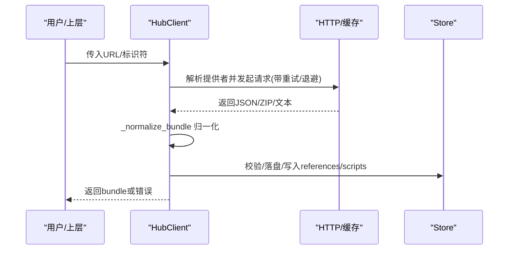
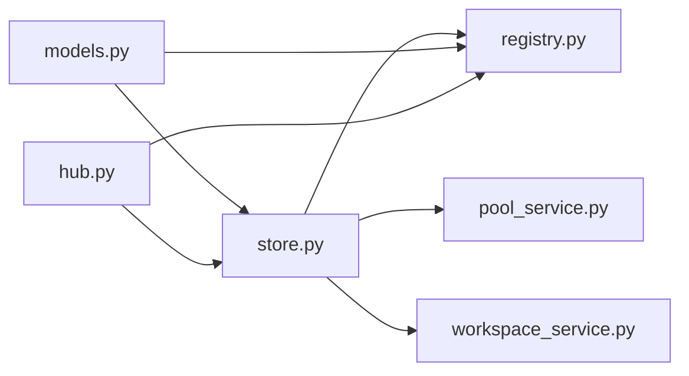

# 技能架构设计

<cite>
**本文引用的文件**   
- [__init__.py](file://src/qwenpaw/agents/skill_system/__init__.py)
- [models.py](file://src/qwenpaw/agents/skill_system/models.py)
- [registry.py](file://src/qwenpaw/agents/skill_system/registry.py)
- [store.py](file://src/qwenpaw/agents/skill_system/store.py)
- [pool_service.py](file://src/qwenpaw/agents/skill_system/pool_service.py)
- [workspace_service.py](file://src/qwenpaw/agents/skill_system/workspace_service.py)
- [hub.py](file://src/qwenpaw/agents/skill_system/hub.py)
</cite>

## 目录
1. [简介](#简介)
2. [项目结构](#项目结构)
3. [核心组件](#核心组件)
4. [架构总览](#架构总览)
5. [详细组件分析](#详细组件分析)
6. [依赖关系分析](#依赖关系分析)
7. [性能与并发特性](#性能与并发特性)
8. [故障排查指南](#故障排查指南)
9. [结论](#结论)
10. [附录：接口与配置要点](#附录接口与配置要点)

## 简介
本文件系统性阐述 QwenPaw 的技能系统（Skill System）的架构设计与实现细节，覆盖以下关键主题：
- 整体架构与职责划分：工作区技能、共享技能池、内置技能、Hub 生态集成
- 注册表管理与发现机制：磁盘扫描、清单重建、语言偏好与变体选择
- 生命周期管理：创建、导入、启用/禁用、重命名、删除、自动更新
- 数据流与调用关系：服务层到存储层、到文件系统与清单文件的读写路径
- 领域模型与接口契约：SkillInfo、SkillRequirements、错误类型等
- 配置与环境注入：按渠道解析有效技能、将配置映射为环境变量
- 常见问题与排障建议

## 项目结构
技能系统位于 agents/skill_system 下，采用“服务 + 存储 + 注册/发现”的分层组织方式：
- models：领域模型与常量
- store：本地存储、清单读写、安全校验、目录操作
- registry：内置技能发现、语言偏好、清单对账、运行时解析
- pool_service：共享技能池的生命周期服务
- workspace_service：工作区范围的技能生命周期服务
- hub：外部 Hub 客户端（搜索、下载、安装）

图表来源
- [__init__.py:1-46](file://src/qwenpaw/agents/skill_system/__init__.py#L1-L46)
- [models.py:1-81](file://src/qwenpaw/agents/skill_system/models.py#L1-L81)
- [store.py:1-200](file://src/qwenpaw/agents/skill_system/store.py#L1-L200)
- [registry.py:1-120](file://src/qwenpaw/agents/skill_system/registry.py#L1-L120)
- [pool_service.py:1-120](file://src/qwenpaw/agents/skill_system/pool_service.py#L1-L120)
- [workspace_service.py:1-120](file://src/qwenpaw/agents/skill_system/workspace_service.py#L1-L120)
- [hub.py:1-120](file://src/qwenpaw/agents/skill_system/hub.py#L1-L120)

章节来源
- [__init__.py:1-46](file://src/qwenpaw/agents/skill_system/__init__.py#L1-L46)

## 核心组件
- 领域模型
  - SkillInfo：对外暴露的技能信息（名称、描述、版本、内容、来源、引用、脚本、表情等）
  - SkillRequirements：声明式依赖（二进制、环境变量）
  - BuiltinSkillIdentity/BuiltinSkillVariant：内置技能身份与多语言变体
  - ALL_SKILL_ROUTING_CHANNELS：支持路由的渠道集合
- 存储层（store）
  - 清单默认结构与读写（工作区 skill.json、共享池 skill_pool/skill.json）
  - 原子写入、跨进程锁、mtime 缓存
  - 目录安全校验、zip 解压校验、SKILL.md frontmatter 解析
  - 元数据构建、冲突名建议、树形 references/scripts 处理
- 注册与发现（registry）
  - 内置技能包扫描与语言偏好选择
  - 清单对账（reconcile）：从磁盘重建清单，保留用户配置
  - 运行时解析：根据渠道筛选启用的技能
  - 环境注入：将配置映射为环境变量并作用域化
- 服务层
  - SkillPoolService：共享池的 CRUD、上传/下载、标签、自动更新
  - SkillService：工作区技能的 CRUD、启用/禁用、渠道范围、重命名迁移
- Hub 客户端（hub）
  - 统一 HTTP 客户端、重试退避、取消钩子
  - 多源解析（GitHub、skills.sh、skillsmp、lobehub、qwenpaw、aliyun 等）
  - 打包规范归一化与安全限制

章节来源
- [models.py:1-81](file://src/qwenpaw/agents/skill_system/models.py#L1-L81)
- [store.py:1-200](file://src/qwenpaw/agents/skill_system/store.py#L1-L200)
- [registry.py:1-120](file://src/qwenpaw/agents/skill_system/registry.py#L1-L120)
- [pool_service.py:1-120](file://src/qwenpaw/agents/skill_system/pool_service.py#L1-L120)
- [workspace_service.py:1-120](file://src/qwenpaw/agents/skill_system/workspace_service.py#L1-L120)
- [hub.py:1-120](file://src/qwenpaw/agents/skill_system/hub.py#L1-L120)

## 架构总览
技能系统围绕“工作区技能 + 共享技能池 + 内置技能 + Hub 生态”四层展开。运行期通过渠道解析出“有效技能集”，并在执行上下文中注入对应配置的环境变量。

图表来源
- [models.py:1-81](file://src/qwenpaw/agents/skill_system/models.py#L1-L81)
- [store.py:1-200](file://src/qwenpaw/agents/skill_system/store.py#L1-L200)
- [registry.py:1-120](file://src/qwenpaw/agents/skill_system/registry.py#L1-L120)
- [pool_service.py:1-120](file://src/qwenpaw/agents/skill_system/pool_service.py#L1-L120)
- [workspace_service.py:1-120](file://src/qwenpaw/agents/skill_system/workspace_service.py#L1-L120)
- [hub.py:1-120](file://src/qwenpaw/agents/skill_system/hub.py#L1-L120)

## 详细组件分析

### 领域模型与常量
- SkillInfo：面向上层 API 的统一视图，包含内容、来源、引用与脚本树、表情等
- SkillRequirements：声明式依赖，用于前置检查或提示
- 内置技能身份与变体：以 name-language 形式识别同一技能的多语言版本
- 渠道白名单：ALL_SKILL_ROUTING_CHANNELS 限定可路由渠道

章节来源
- [models.py:1-81](file://src/qwenpaw/agents/skill_system/models.py#L1-L81)

### 存储层（store）
- 清单与路径
  - 工作区清单：workspaces/<id>/skill.json；共享池清单：WORKING_DIR/skill_pool/skill.json
  - 额外只读根：通过配置 skill_paths 扩展
- 原子写与并发
  - mutate_json 提供带锁的读取-修改-原子替换流程，避免损坏
  - mtime 缓存提升重复读取性能
- 安全与校验
  - normalize_skill_dir_name/safe_skill_dir 防止路径穿越
  - extract_zip_skills/_extract_and_validate_zip 限制大小、拒绝软链
  - scan_skill_dir_or_raise 调用安全扫描器
- 元数据与内容
  - build_skill_metadata 从 SKILL.md frontmatter 提取描述、版本、需求等
  - read_skill_from_dir 组装 SkillInfo
  - write_skill_to_dir 支持 references/scripts/extra_files 树写入

图表来源
- [store.py:320-395](file://src/qwenpaw/agents/skill_system/store.py#L320-L395)
- [store.py:877-983](file://src/qwenpaw/agents/skill_system/store.py#L877-L983)

章节来源
- [store.py:1-200](file://src/qwenpaw/agents/skill_system/store.py#L1-L200)
- [store.py:320-395](file://src/qwenpaw/agents/skill_system/store.py#L320-L395)
- [store.py:877-983](file://src/qwenpaw/agents/skill_system/store.py#L877-L983)

### 注册与发现（registry）
- 内置技能发现
  - 扫描 packaged builtins 目录，解析 name-language 变体
  - 语言偏好：settings.json 中 builtin_skill_language 或 UI language 推导
- 清单对账
  - reconcile_pool_manifest：从磁盘重建池清单，保留 config/tags/auto_update 等
  - reconcile_workspace_manifest：从工作区 skills 目录重建，保留 enabled/channels/config
- 运行时解析
  - resolve_effective_skills：按渠道过滤 enabled 且 channels 匹配的技能
- 环境注入
  - apply_skill_config_env_overrides：将配置键映射为环境变量，仅在当前上下文生效

图表来源
- [registry.py:853-871](file://src/qwenpaw/agents/skill_system/registry.py#L853-L871)
- [registry.py:968-1033](file://src/qwenpaw/agents/skill_system/registry.py#L968-L1033)
- [registry.py:1036-1143](file://src/qwenpaw/agents/skill_system/registry.py#L1036-L1143)
- [registry.py:1186-1207](file://src/qwenpaw/agents/skill_system/registry.py#L1186-L1207)
- [registry.py:347-392](file://src/qwenpaw/agents/skill_system/registry.py#L347-L392)

章节来源
- [registry.py:1-120](file://src/qwenpaw/agents/skill_system/registry.py#L1-L120)
- [registry.py:853-871](file://src/qwenpaw/agents/skill_system/registry.py#L853-L871)
- [registry.py:968-1033](file://src/qwenpaw/agents/skill_system/registry.py#L968-L1033)
- [registry.py:1036-1143](file://src/qwenpaw/agents/skill_system/registry.py#L1036-L1143)
- [registry.py:1186-1207](file://src/qwenpaw/agents/skill_system/registry.py#L1186-L1207)
- [registry.py:347-392](file://src/qwenpaw/agents/skill_system/registry.py#L347-L392)

### 共享技能池服务（SkillPoolService）
- 能力概览
  - 创建/导入 zip/删除/重命名/标签/自动更新
  - 上传自工作区到池、下载至工作区（含冲突检测与语言回补）
  - 自动更新：基于 SKILL.md 哈希变化推送至目标工作区
- 关键流程
  - create_skill/import_from_zip：先暂存目录，校验后复制并更新清单
  - download_to_workspace：预检冲突（同名/内置升级/语言切换），必要时回补语言字段
  - set_skill_auto_update：开启时立即触发一次同步
  - rename_in_workspaces：批量迁移已自动更新的副本

图表来源
- [pool_service.py:980-1079](file://src/qwenpaw/agents/skill_system/pool_service.py#L980-L1079)
- [pool_service.py:862-959](file://src/qwenpaw/agents/skill_system/pool_service.py#L862-L959)
- [pool_service.py:1115-1264](file://src/qwenpaw/agents/skill_system/pool_service.py#L1115-L1264)

章节来源
- [pool_service.py:1-120](file://src/qwenpaw/agents/skill_system/pool_service.py#L1-L120)
- [pool_service.py:801-860](file://src/qwenpaw/agents/skill_system/pool_service.py#L801-L860)
- [pool_service.py:980-1079](file://src/qwenpaw/agents/skill_system/pool_service.py#L980-L1079)
- [pool_service.py:1115-1264](file://src/qwenpaw/agents/skill_system/pool_service.py#L1115-L1264)

### 工作区技能服务（SkillService）
- 能力概览
  - 创建/保存（原地编辑/重命名）、导入 zip、启用/禁用、设置渠道、删除
  - 列表：全部技能、可用技能（基于 resolve_effective_skills）
- 关键流程
  - save_skill：若 target_name 不同则走重命名分支，否则原地编辑
  - enable_skill：重新扫描当前目录后再更新状态，确保一致性
  - delete_skill：仅允许删除未启用的技能

图表来源
- [workspace_service.py:229-284](file://src/qwenpaw/agents/skill_system/workspace_service.py#L229-L284)
- [workspace_service.py:286-372](file://src/qwenpaw/agents/skill_system/workspace_service.py#L286-L372)
- [workspace_service.py:374-442](file://src/qwenpaw/agents/skill_system/workspace_service.py#L374-L442)

章节来源
- [workspace_service.py:1-120](file://src/qwenpaw/agents/skill_system/workspace_service.py#L1-L120)
- [workspace_service.py:229-284](file://src/qwenpaw/agents/skill_system/workspace_service.py#L229-L284)
- [workspace_service.py:286-372](file://src/qwenpaw/agents/skill_system/workspace_service.py#L286-L372)
- [workspace_service.py:374-442](file://src/qwenpaw/agents/skill_system/workspace_service.py#L374-L442)

### Hub 客户端（hub）
- 网络与可靠性
  - 统一 httpx.AsyncClient，超时/重试/退避策略可配置
  - GitHub 响应缓存与每 key 锁，避免雪崩
  - 请求追踪与优雅关闭
- 多源解析
  - GitHub/skills.sh/skillsmp/lobehub/qwenpaw/aliyun 等 URL 解析
  - 统一归一化为 bundle（name/files/SKILL.md/references/scripts/extra_files）
- 安全与限制
  - 最大条目数/字节数、文本 blob 判断、错误消息提取

图表来源
- [hub.py:316-373](file://src/qwenpaw/agents/skill_system/hub.py#L316-L373)
- [hub.py:378-603](file://src/qwenpaw/agents/skill_system/hub.py#L378-L603)
- [hub.py:785-848](file://src/qwenpaw/agents/skill_system/hub.py#L785-L848)
- [store.py:923-965](file://src/qwenpaw/agents/skill_system/store.py#L923-L965)

章节来源
- [hub.py:1-120](file://src/qwenpaw/agents/skill_system/hub.py#L1-L120)
- [hub.py:316-373](file://src/qwenpaw/agents/skill_system/hub.py#L316-L373)
- [hub.py:378-603](file://src/qwenpaw/agents/skill_system/hub.py#L378-L603)
- [hub.py:785-848](file://src/qwenpaw/agents/skill_system/hub.py#L785-L848)

## 依赖关系分析
- 模块内聚与耦合
  - store 作为基础 I/O 与校验被其他模块广泛复用，内聚度高
  - registry 依赖 store 进行清单读写，同时向上提供服务（初始化、对账、解析）
  - 两个服务层分别封装了各自范围的复杂业务逻辑，降低耦合
- 外部依赖
  - httpx（异步 HTTP）、frontmatter/yaml（frontmatter 解析）、zipfile/shutil/os（文件操作）
- 潜在循环依赖
  - 通过 __init__.py 集中导出，避免直接循环导入
- 接口契约
  - 清单结构由 default_*_manifest 定义，变更需保持向后兼容
  - 错误类型集中在 exceptions（如 SkillsError、SkillConflictError）

图表来源
- [__init__.py:1-46](file://src/qwenpaw/agents/skill_system/__init__.py#L1-L46)
- [store.py:1-200](file://src/qwenpaw/agents/skill_system/store.py#L1-L200)
- [registry.py:1-120](file://src/qwenpaw/agents/skill_system/registry.py#L1-L120)
- [pool_service.py:1-120](file://src/qwenpaw/agents/skill_system/pool_service.py#L1-L120)
- [workspace_service.py:1-120](file://src/qwenpaw/agents/skill_system/workspace_service.py#L1-L120)
- [hub.py:1-120](file://src/qwenpaw/agents/skill_system/hub.py#L1-L120)

章节来源
- [__init__.py:1-46](file://src/qwenpaw/agents/skill_system/__init__.py#L1-L46)

## 性能与并发特性
- 清单读取缓存：基于文件 mtime 的 lru_cache，减少重复 IO
- 原子写入：临时文件 + replace，避免部分写入导致损坏
- 并发安全：
  - 跨进程 JSON 锁（fcntl/msvcrt）
  - 内置语言偏好与注册表内存缓存（线程锁保护）
  - Hub 层 per-key 异步锁避免重复请求
- 资源限制：
  - Zip 解压大小上限、条目数量上限
  - HTTP 超时、重试次数、指数退避上限

[本节为通用性能讨论，不直接分析具体文件]

## 故障排查指南
- 常见错误与定位
  - 清单损坏：store 会记录警告并重置为默认清单，检查日志中的 malformed JSON 提示
  - 路径不安全：safe_skill_dir/normalize_skill_dir_name 抛出异常，确认名称不含分隔符或穿越符号
  - 冲突：导入/重命名/下载时返回冲突与建议名，优先采纳建议名或显式覆盖
  - 语言切换：内置技能在不同语言间切换时会提示语言差异，必要时手动确认
  - 网络问题：Hub 层 429/5xx 会给出重试与 Token 提示，检查 GITHUB_TOKEN 与网络连通性
- 快速自检步骤
  - 运行 ensure_skill_pool_initialized 与 reconcile_*_manifest 修复不一致
  - 查看 apply_skill_config_env_overrides 的作用域是否正确
  - 检查 auto_update 目标的哈希是否变化，必要时手动触发 run_pool_auto_update_sync

章节来源
- [store.py:344-395](file://src/qwenpaw/agents/skill_system/store.py#L344-L395)
- [store.py:526-556](file://src/qwenpaw/agents/skill_system/store.py#L526-L556)
- [pool_service.py:862-959](file://src/qwenpaw/agents/skill_system/pool_service.py#L862-L959)
- [registry.py:1214-1283](file://src/qwenpaw/agents/skill_system/registry.py#L1214-L1283)
- [hub.py:378-603](file://src/qwenpaw/agents/skill_system/hub.py#L378-L603)

## 结论
QwenPaw 技能系统通过清晰的分层与严格的清单对账机制，实现了跨工作区与共享池的稳定复用；在安全、并发与性能方面提供了完善的保障。服务层将复杂的生命周期与冲突处理封装为易用的 API，配合 Hub 客户端打通多生态来源，形成完整的技能发现、注册与生命周期管理体系。

[本节为总结性内容，不直接分析具体文件]

## 附录：接口与配置要点
- 关键入口函数与服务方法
  - 初始化与对账：ensure_skill_pool_initialized、reconcile_pool_manifest、reconcile_workspace_manifest
  - 运行时解析：resolve_effective_skills(workspace_dir, channel_name) -> list[str]
  - 环境注入：apply_skill_config_env_overrides(workspace_dir, channel_name)
  - 共享池：SkillPoolService.create_skill/import_from_zip/download_to_workspace/set_skill_auto_update/run_pool_auto_update_sync
  - 工作区：SkillService.create_skill/save_skill/enable_skill/disable_skill/set_skill_channels/delete_skill
- 清单关键字段（节选）
  - 工作区 skill.json：schema_version、version、skills.<name>.enabled/channels/source/config/metadata/requirements/updated_at
  - 共享池 skill_pool/skill.json：schema_version、version、skills.<name>.source/builtin_language/builtin_source_name/config/tags/auto_update/auto_update_targets/auto_update_synced_hash
- 环境变量注入规则
  - 将配置键映射为环境变量（要求声明 require_envs），同时提供完整配置的 JSON 环境变量前缀
- Hub 相关配置（环境变量）
  - QWENPAW_SKILLS_HUB_BASE_URL、*_SEARCH_PATH、*_VERSION_PATH、*_DETAIL_PATH、*_FILE_PATH
  - QWENPAW_SKILLS_HUB_HTTP_TIMEOUT、QWENPAW_SKILLS_HUB_HTTP_RETRIES、QWENPAW_SKILLS_HUB_HTTP_BACKOFF_BASE、QWENPAW_SKILLS_HUB_HTTP_BACKOFF_CAP
  - QWENPAW_GITHUB_CACHE_TTL

章节来源
- [registry.py:853-871](file://src/qwenpaw/agents/skill_system/registry.py#L853-L871)
- [registry.py:968-1033](file://src/qwenpaw/agents/skill_system/registry.py#L968-L1033)
- [registry.py:1036-1143](file://src/qwenpaw/agents/skill_system/registry.py#L1036-L1143)
- [registry.py:1186-1207](file://src/qwenpaw/agents/skill_system/registry.py#L1186-L1207)
- [registry.py:347-392](file://src/qwenpaw/agents/skill_system/registry.py#L347-L392)
- [pool_service.py:1115-1264](file://src/qwenpaw/agents/skill_system/pool_service.py#L1115-L1264)
- [workspace_service.py:114-143](file://src/qwenpaw/agents/skill_system/workspace_service.py#L114-L143)
- [hub.py:142-188](file://src/qwenpaw/agents/skill_system/hub.py#L142-L188)
- [hub.py:193-229](file://src/qwenpaw/agents/skill_system/hub.py#L193-L229)